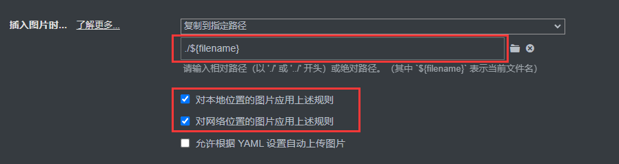
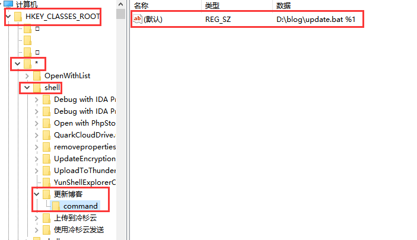

# 博客的搭建记录

## 1. 参考文档

1. 主要参考了：

    > https://blog.cuijiacai.com/blog-building/

2. 文章中是使用 Netlify，本人改用的 Vercel，也不错。

## 2. 一些额外配置

### 2.1 统一添加 YAML 头部

1. 写了一个 Python 脚本，迁移笔记的时候用的，不然每个文件都要手动添加 YAML。

2. 脚本代码：
    ```python
    # -*- encoding: utf-8 -*-
    """
    @File    : addYAMLHeader.py
    @Time    : 2024/1/3 17:52
    @Author  : EndlessShw
    @Email   : 1502309758@qq.com
    @Software: PyCharm
    """
    import regex as re
    import os
    import argparse
    
    
    def addHeader(filename, filePath):
        """
        添加头部
        :param filePath: 文件的绝对路径
        :return:
        """
        allContent = "---\n"
        allContent += "title: "
        allContent += re.sub(r"\.md", "", filename)
        allContent += "\n"
        allContent += "---\n"
        f = open(filePath, encoding="utf-8")
        allContent += f.read()
        f.close()
        with open(filePath, "w", encoding="utf-8") as writeFile:
            writeFile.write(allContent)
        pass
    
    
    def addYAMLHeader(rootPath):
        """
        为每个 md 文件头部添加 YAML 文件头
        :param rootPath:
        :return:
        """
        for root, dirs, files in os.walk(rootPath, topdown=False):
            for fileName in files:
                # 为每个 markdown 文件添加 YAML 头部
                if fileName.endswith(r".md"):
                    addHeader(fileName, os.path.join(root, fileName))
    
    def main():
        parser = argparse.ArgumentParser()
        parser.description = '请输入要添加头部的文件的根路径'
        parser.add_argument("-p", "--rootPath", help="根路径名", dest="rootPath", type=str, default="")
        args = parser.parse_args()
        rootPath = args.rootPath
        if rootPath == "":
            rootPath = input("请输入路径:")
        addYAMLHeader(rootPath)
    
    
    if __name__ == '__main__':
        main()
    ```

3. 其实用的不多，因为没有添加 Tag 和 Categories。

### 2.2 图片格式内容转换

1. 相关问题有的文章已经给出了，这里给我的解决方案：

    > https://github.com/yiyungent/hexo-asset-img

2. 对 Typora 的图片解析做了更改：
    
    个人其实是比较喜欢 `./${filename}.asset` 的，但是所用的插件不允许（以后有 JS 基础后考虑改插件的代码)，就只能这样了。

## 2.3 文章的时间问题

1. 默认情况下，YAML 头没有时间头（`date`）的话，应该是根据 GitHub 上文件的修改时间来的；但是如果每次 `git commit` 后，由于跨平台的换行符号问题，上传会对文件进行修改，从而导致文件的修改时间变了，所以文章的发布时间也会统一跟着变，这属实是蛋疼。

2. 先写一个添加 YAML `date` 头的脚本：
    ```python
    # -*- encoding: utf-8 -*-
    """
    @File    : update.py
    @Time    : 2024/4/29 15:36
    @Author  : EndlessShw
    @Email   : 1502309758@qq.com
    @Software: PyCharm
    """
    import regex as re
    import os
    import argparse
    from datetime import datetime
    
    
    def update(filePath):
        # 打开文件
        YAMLContent = ""
        allContent = ""
        with open(filePath, 'r', encoding="utf-8") as openFile:
            allContent = openFile.read()
            # 定位文件的 YAML 部分
            YAMLContent = re.search(r"(?<=---).*?(?=---)", allContent, re.S).group(0)
            # 获取文件的修改日期
            updateTime = datetime.fromtimestamp(os.path.getmtime(filePath)).strftime("%Y-%m-%d %H:%M:%S")
            # 如果不包含 date，就插入 date
            if YAMLContent.find("date") == -1:
                YAMLContent += "date: " + updateTime
                YAMLContent += "\n"
            # 如果包含 date，就修改 date 后面的内容
            else:
                # 获取原先文件内容中的 date
                oldDate = re.search(r"(?<=date: ).*", YAMLContent).group(0)
                # 如果发生了修改，则修改时间不同，那么 date 的内容就要替换
                # print(oldDate[:-4])
                # print(updateTime[:-4])
                # 实际上 oldDate 和 updateTime 有时间误差，因此控制在 10 分钟内
                if oldDate[:-4] != updateTime[:-4]:
                    YAMLContent = re.sub(r"(?<=date: ).*", updateTime, YAMLContent)
                # 如果没有发生修改，就啥也不做
                else:
                    pass
            allContent = re.sub(r"(?<=---).*?(?=---)", YAMLContent, allContent, 1, re.S)
        with open(filePath, 'w', encoding="utf-8") as writeFile:
            writeFile.write(allContent)
        pass
    
    
    def main():
        parser = argparse.ArgumentParser()
        parser.description = '请输入待更新的文件的根路径'
        parser.add_argument("-p", "--rootPath", help="根路径名", dest="rootPath", type=str, default="")
        args = parser.parse_args()
        rootPath = args.rootPath
        if rootPath == "":
            rootPath = input("请输入路径:")
        update(rootPath)
    
    
    if __name__ == '__main__':
        main()
    ```

3. 每次写完/修改完文章后，调用脚本，输入路径后即可自动添加 `date` 头。但还是不方便，每次都要敲命令和输入文件路径。

4. 因此考虑自动化，最简单的方法就是把调用脚本的操作用一个右键来直接整合。先写一个 bat 文件：
    ```bat
    python D:\blog\update.py -p "%1"
    # %1 是占位符，最终的内容就是文件的绝对路径
    ```

5. 然后添加文件的右键功能，这里要修改注册表，教程网上也有：

    > https://blog.csdn.net/Mrceel/article/details/107459678

    

6. 最终就是：
    

7. 这样一个右键一个左键就可以将文件的时间进行同步。（TODO：感觉还可以搞个快捷键）

## 3. 日常发表文章 - 自用

1. 指令：
    ```bash
    cd "博客目录"
    git add .
    git commit -m "xxx"
    git push origin main(主分支的名字)
    ```