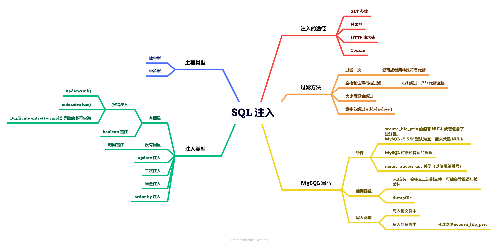

# 北邮网安复试整理 - 自用

## 1. 密码学

### 1.1 绪论

#### 1.1.1 基本概念

1. 密码学是数学的一个分支，是**密码编码学**和**密码分析学**的统称。
2. 密码编码学：**消息保密**的技术和科学。
    研究内容：序列密码、分组密码、公钥密码三个密码算法体系的编码技术。
3. 密码分析学：**破译密文**的科学和技术。
    研究内容：
    1. 密码**算法**的安全性分析和破译的理论、方法、技术和实践。
    2. 密码**协议**的安全性分析的理论和方法。
    3. 安全**保密系统**的安全性分析和攻击的理论、方法、技术和实践。
4. 密码学的四个安全特性：保密性、完整性、认证性（确认身份）、不可否认性。
5. 密码学的 CIA：
    1. 保密性(Confidentiality)
    2. 完整性(Integrity)
    3. 可用性(Availability)

#### 1.1.2 密码体制的 5 要素

1. 明文空间 M：全体明文的集合
2. 密文空间 C：全体密文的集合
3. 密钥空间 K：全体密钥的集合，`K＝< Ke, Kd> Ke` 是加密钥，Kd 是解密钥
4. 加密算法 E：一簇由 M→C 的加密变换
5. 解密算法 D：一簇由 C→M 的解密变换，而且解密变换是加密变换的逆

#### 1.1.3 密码分析攻击类型

1. 唯密文攻击
2. 已知明文攻击：有了一定密文对应的明文。
3. 选择明文/密文攻击：在已知的基础上，能选择对自己有利明/密文进行攻击。

#### 1.1.4 衡量密码体制安全性的基本准则

1. 计算安全的
2. 可证明安全的
3. 无条件安全的

### 1.2 古典密码

#### 1.2.1 分组密码基本加密方式

1. 代换
    1. 凯撒密码
    2. 仿射密码
    3. 单表、多表代换
2. 置换
3. 加减：将明文逐字符或逐字符组与乱数相加或相减的密码。

### 1.3 分组密码

#### 1.3.1 分组密码的概念

1. 将明文数字序列按固定长度**分组**，并用一个密钥和同一个加密算法**逐组加密**，从而将各明文分组变换成密文分组的密码。

#### 1.3.2 分组密码的基本设计准则

1. 迭代结构（一般的结构）：选择某个较为简单的密码变换，在密钥控制下以迭代方式**多次**利用它进行加密变换，就可以实现预期的扩散和混乱效果。
2. 混淆：是指在加密变换过程中是明文、密钥以及密文之间的**关系尽可能地复杂化**，以防密码破译者采用统计分析法进行破译攻击。
3. 扩散：明文和密钥中**任何一比特值**得改变，都会在某种程度上影响到**尽可能多的密文值**的变化，以防止将密文分解成若干个孤立的小部分，然后各个击破。

#### 1.3.3 Feistel 结构

1. **乘积密码**指顺序地执行两个或多个基本密码系统，使得最后结果的密码强度高于每个基本密码系统产生的结果。
2. Feistel 还提出了实现**代换和置换**的方法。其思想实际上**是 Shannon 提出的利用乘积密码实现混淆和扩散思想的具体应用。**
3. Feistel 参数：
    1. 分组大小：分组越大则安全性越高，但加密速度就越慢。
    2. 密钥大小：密钥越长则安全性越高，但加密速度就越慢。
    3. 轮数：单轮结构远不足以保证安全性，但多轮结构可提供足够的安全性。 典型地，轮数取为16。
    4. 子密钥产生算法：该算法的复杂性越大，则密码分析的困难性就越大。
    5. **轮函数**：轮函数的复杂性越大，密码分析的困难性也越大。

#### 1.3.4 DES（Data Encryption Standard）

1. 明文和密文分组长度为 64 bit，密钥长度为 64 bit = 56 + 8。其中末尾 8 bit 用于校验。
2. 整体结构：
    
3. IP 置换阶段：给定一个 IP 表，对每一 bit 进行置换，同时从左到右变成从右到左。
4. 16 轮迭代：采用 Feistel 结构进行 16 次迭代，每次迭代使用由密钥 k 经密钥编排函数计算出来的、长达 48 bit 的子密钥来加密。
    
    1. 轮函数：先将上轮后半 32 bit  作为输入，然后通过 **E 盒扩展**成 48 bit。然后进行密钥加运算得到新 48 bit。再通过 **S 盒代换** 变成 32 bit。最后进行 **P 置换**得到下一轮的后半 32 bit。
        
        1. E 盒扩展目的：将输入的 32 bit 数据扩展为 48 bit 数据。
        2. S 盒代替的作用（核心）：将输入的 48 bit 数据压缩为 32 bit 数据。
        3. P 盒变换是对 S 盒变换后的 32 bit 数据的位置进行移动。
    2. 每轮的密钥是怎么来的（密钥编排算法）：
        
5. IP 逆置换：即将 IP 置换时的表反过来，操作同 IP 置换阶段。
6. 解密变换：DES 的解密与加密一样使用相同的算法，它以 密文y 作为输入，但以相反的顺序使用密钥（逆序）。
7. 特点：软件实现慢、硬件实现快；可全部用布尔电路实现。可以成功地对 DES 进行穷举攻击。

#### 1.3.5 AES

1. 也是分组迭代加密算法，明文 128/256 等 bit，密文分组 128/192/256 等可变长度。这里以 aes-128，即明文分组为 128 bit 为主。
2. 整体结构：
    
3. 密钥加就是入口处理变换，即和密钥进行一次相加。
4. 轮函数进行 10 轮（128 下）变换，分为两个层级：
    非线性层 - 字节代替变换。
    线性混合层 - 行移位变换和列混合变换。
    最后再来一次密钥加。
    
    1. 字节代换：使用**可逆 S 盒**进行变换，由两个可逆变换复合而成。
    2. 行移位是将状态阵列的各行进行**循环移位**，不同状态行的位移量不同。
    3. 列混合通过类似矩阵的乘法，与固定多项式的对应项进行模 x^4+1 的乘法。
    4. 密钥加就是和密钥逐比特异或。其中也有自己的密钥编排算法（太复杂了）。
5. 解密就是加密的逆运算。
6. AES 的 SPN **代换-置换网络**（或译作**置换排列网络**，英语：Substitution-Permutation Network）结构：轮函数包含**代换层-置换层-密钥混合层。**

#### 1.3.6 AES 和 DES 的优缺点以及区别

1. 相同点：
    1. 分块加密。
    2. 需要用到密钥编排算法来扩展密钥。
    3. 用到 S 盒的表进行转换。
    4. 都用子密钥进行加密处理。
2. DES 优点：
    1. 较高安全性，目前除了穷举攻击外，还没有发现更有效的方法。
3. DES 缺点：
    1. 分组和密钥较短。
    2. 采用的是 Feistel 结构，密码扩散较慢，因此迭代轮数多，导致速度慢。
4. AES 优点：
    1. 运算速度快
    2. 对内存需求底
    3. 分组与密钥长度灵活，密钥长度较长。
    4. 很好的抵抗**差分密码分析**和**线性密码分析**的能力。
5. AES 缺点：
    1. 存在对其简化算法的攻击。
6. DES 和 AES 的区别（根据上述的总结），本质是 Feistel 和 SPN 的区别：
    1. Feistel 结构在加解密过程中可以节约一半的资源，其加解密过程是一致的。在实现时，通常可以节约资源。然而，Feistel 结构的密码扩散较慢，因此迭代轮数一般多一些（16 轮）。而 SPN 结构具有较好的扩散性，一轮运算就改变了所有数据，所以轮数少，速度快，但相应的消耗更多资源。
    2. 一般情况下，由于高扩散性，且同时 AES 的安全设计策略是**宽轨迹策略**，能够抵抗目前的**差分攻击、线性攻击**等，从而 SPN 结构的安全性要高于 Feistel 结构。

#### 1.3.7 分组密码的 5 种常用工作模式

1. 工作模式：需要加密的明文长度可能会**超过**分组密码的分组长度，这就需要对分组密码算法进行迭代，以便将一段**很长的明文全部加密**。迭代的方法就被称为**分组密码的模式**。
2. 电码本 ECB 模式（Electronic-Codebook Mode）：简单点说就是将文件直接分组加密后再组合。
    缺陷在于：明文中的重复排列会反应在密文中，通过删除、替换密文分组能够对明文进行操作；对包含某些比特错误的密文进行解密时，对应的分组会出错；不可以抵御重放攻击。
3. 密码分组连接 CBC 模式（Cipher-Block-Chaining）：首先对明文分组，它一次对一个明文分组加密，加密算法的输入是当前**明文分组和前一次密文分组的异或**。
    存在错误传播，一块密文传输错误会导致下一块密文解密失败。
4. 密码反馈 CFB 模式（Cipher-Feedback Mode）
5. 输出反馈 OFB 模式（Output-Feedback Mode）：类似于 CFB, 不同之处在于 OFB模式是将加密算法的输出反馈到移位寄存器，而 CFB 模式中是将密文单元反馈到移位寄存器。
6. 计数器 CTR 模式（Counter Mode）。

### 1.4 流密码 - 序列密码

#### 1.4.1 主要原理

1. 通过随机数发生器产生性能优良的**伪随机序列**（密钥流），使用该序列加密信息流（逐比特加密），得到密文序列。
1. Golomb 伪随机性测试是随机性的**必要条件**。

#### 1.4.2 序列密码的分类

1. 同步序列密码性质：
    1. 同步性 - 不同步的话就会导致解密失败，此时需要借助外界手段重新建立同步。
    2. 无错误传播性 - 各个位互不影响。
    3. 主动攻击
2. 自同步序列密码性质（多了一个**寄存器**，此时密钥流生成器多了一个来源，使得密文之间有联系）：
    1. 自同步性 - 双方不同步的话，只要接收端能正确地连续接收密文符号，就能重新建立同步。
    2. 错误传播的有限性
    3. 主动攻击
    4. 明文统计扩散性

#### 1.4.3 基于移位寄存器的算法

1. 发生了移位，导致有一位出来，但是末尾有一位是空的，根据函数的不同，得出末尾，总称为“反馈移位寄存器”，此时用到的函数就是反馈函数，根据反馈函数的不同，又分为：线性反馈（LFSR linear feedback shift register）、非线性反馈。
1. 由于非线性反馈本身使用起来就很复杂，所以非线性又将**密钥流生成器**进一步划分，由**驱动部分（线性，提供初始状态序列）**和**非线性组合部分（使用滤波生成器，其中使用非线性的滤波函数，从而提供伪随机特性）**

#### 1.4.4 RC4 算法

1. RC4 不是基于 LFSR 的序列密码，其使用了一张 256 Bytes 的非线性数据表（S 表）来进行非线性变换，从而得到密钥流。
2. RC4 的优点是算法简单、高效，特别适合于软件实现，加密速度很快。

#### 1.4.5 其他的类似 RC4 的软件算法

1. HC-256/128 算法，使用两张密表 P 和 Q，每一张都包含 1024 个 32 bit 元素，因此算法的硬件速度慢。
2. Rabbit 流密码输入 128 bit 密钥和 64 bit 的初始向量，每次迭代后从 513 bit 内部状态中生成 128 bit 的伪随机序列。

#### 1.4.6 序列密码的攻击法

1. 插入攻击法
2. 位串匹配攻击法
3. 单词匹配攻击法

#### 1.4.7 序列密码和分组密码的区别

1. 分组密码的本质是把明文分成相对较大的快，对于每一块使用相同的加密函数进行处理。因此分组密码是**无记忆的**。
2. 序列密码处理的明文长度可以小到 1 bit，而且序列密码是**有记忆的**。
3. 分组密码的算法关键在于**加解密算法，要尽可能复杂**。而序列密码实际关键在于密钥序列产生器，使之尽可能的**不可预测**。

### 1.5 Hash 函数

#### 1.5.1 概念

1. 一个将任意长度的消息序列映射为较短的、固定长度的一个值的函数，能够保障数据的完整性。
2. Hash 函数具有：
    1. 单向性：即**单向函数，不是单向陷门函数**
    2. 弱抗碰撞性：给定一个明文 M，要求找到另一个 M1，使得 H(M) = H(M1) 在计算上是不可行的。
    3. 强抗碰撞性：**任意**给定一个明文 M，要求找到另一个 M1，使得 H(M) = H(M1) 在计算上是不可行的。

#### 1.5.2 分类

1. 改动检测码 MDC（Manipulation Detection Code），也就是**不带密钥**的 Hash 函数，主要用于消息完整性。
2. 消息认证码 MAC（Message Authentication Code），也就是**带密钥**的 Hash 函数，主要用于**消息源认证和消息完整性**。

#### 1.5.3 用途

1. 消息完整性检测。
2. 消息源认证码。
3. 数字签名。
4. Hash 链用于口令认证。
5. 比特承诺等密码协议。

#### 1.5.4 MD5 算法（Message-Digest Algorithm 5）

1. 消息填充：
    `一个分组 = 原信息 % 512（最多 9 位） + `1` + n * `0` + 64 bit 的长度信息（表示长度）`。其中 n 的最大值不超过 447。一共加起来要 512 bit。
2. 分组与初始变量进入 MD（缓冲区 128 bit） 结构进行迭代压缩，到所有分块运算完为止。
    压缩函数的消息分组长度 512 bit，压缩函数分为 4 轮，每轮 16 步，共 64 步。
    **MD5 的核心就是不断对 MD Buffer 做 64 步的线性、非线性向量变换，最终得到消息摘要。**
3. 性质：
    Hash 函数的**每一位均是输入消息序列中每一位的函数。**
    保证了**在 Hash 函数计算过程中产生基于消息 x 的混合重复**，从而使得生成的 Hash 函数结果混合得十分理想。也就是说，随机选取两个有着相似规律性的两组消息序列，也很难得到结果相同的 Hash 函数值。

#### 1.5.5 SHA-1（Secure Hash Algorithm - 1）

1. 消息填充
    和 MD5 填充方式相似，直到 `原文长度 + 填充长度  % 512 = 448`，如果原文长度 > 448，那么就要额外添加分块。
    最后添加上 64 bit 的长度信息，正好构成 512 bit。
    最终总长度也要是 512 bit 的整数倍数。
2. 初始化缓冲区：初始化 160 bit 的缓冲区（比 MD5 的 128 长），由 5 个 32 bit 的 A、B、C、D、E 寄存器组成。
3. 主循环：四轮，每轮 20 次（MD5 是每轮 16 次），对 5 个寄存器中的 3 个做一次非线性函数运算。然后进行与 MD5 中类似的移位运算和加运算。
4. SHA-256 就是 256 bit 的缓冲区，一共 64 次。

#### 1.5.6 消息认证码

1. 发送方 A 和接收方 B **共享密钥 K**，若 A 向 B 发送消息 M，则 A 计算利用 `C=F (K, M)` 计算 MAC 值；然后将原始消息 M 和 C 一起发送给接收方。接收方 B 对收到的消息 M 用**相同的密钥 K** 进行相同的计算得出新的 MAC 值 C’。并将接收到的 C 与其计算出的 C’ 进行比较。
    若相等，则：接收方可以相信消息**未被修改**且可以确信消息来自真正的信任的某一发送方（密钥保证身份是可信任的）。
2. 上述的 F 是 MAC 函数，它利用密钥 K 和任意长度的消息 M 来生成一个固定长度的短数据块 C。
3. 有 CBC-MAC 算法和 HMAC 算法。
    1. CBC-MAC：
        首先，填充数据，形成一串 n 比特组（分组密钥的长度，例如使用 DES）；
        其次，使用 CBC 模式加密这些数据；
        对最后的输出分组进行选择处理和截断（如果m＜n）以形成 MAC。
    2. HMAC：
        使用 Hash 函数 H，K1 和 K2（K1≠K2）计算 `MAC=H(K1 ‖ H (K2 ‖ m))`，其中 K1 和 K2 由同一个密钥 K 导出。
        H 是一个 Hash 函数
        K 表示密钥
        B 表示计算消息摘要时消息分块的字节长度（对 MD5 和 SHA-1 是 512 bit）
        L 表示消息摘要按字节计算的长度（对 MD5 是 16 字节）。
        ipad 表示 0x36 重复 B 次，opad 表示 0x5c 重复 B 次。
        K 可以有不超过 B 字节的任意长度，但一般建议 K 的长度不小于 L。当使用长度大于 B 的密钥时，先用 H 对密钥进行杂凑，然后用得出的 L 字节作为 HMAC 的真正密钥。

### 1.6 公钥密码体制

#### 1.6.1 分类

1. 私钥建立方案（Public Key Establishment Schemes，PKES）
    1. 交换秘密信息
    2. **常用于对称加密算法的密钥分配**
2. 公开密钥加密（Public Key Encryption，PKE）
    1. 用于加密任何消息
    2. 任何人都可以用公钥加密消息
    3. 私钥的拥有者可以解密消息
    4. **任何**公钥加密方案能够用于**密钥分配方案 PKDS**（密钥的分配与管理）
    5. 一些公钥加密方案也是数字签名方案
3. 数字签名（Signature Schemes，SS）
    1. 用于生成对某消息的数字签名
    2. 私钥的拥有者生成数字签名
    3. 任何人可以用公钥验证签名

#### 1.6.2 特点

1. 加解密速度比对称算法慢，因此公钥密码体制目前主要用于**密钥管理**和**数字签字**。
2. 类似于对称算法，穷搜索在理论上是能够破解公钥密码。 实际上,密钥足够长 （> 512bits）保证计算安全。
3. 安全性依赖于**足够大**的困难性差别，如 NP 和 P 问题（利用公钥及公开参数加密明文容易计算；利用私钥及公开参数解密密文容易计算；只利用公钥解密密文困难）；

#### 1.6.3 公钥密码算法的本质

1. 单向陷门函数：
    
    “陷门”，也就是后门。
2. 研究公钥密码算法就是要找出合适的陷门单向函数。
3. 目前单向函数现状：
    
4. 背包密码体制：
    
    
    NP 类问题：（Nondeterministic polynominal) 能在多项式时间内验证出一个正确解的问题，也就是说这个问题不一定在多项式时间内可解，但可以在多项式时间内验证。
5. 背包问题和单向陷门函数的结合：
    
    超递增背包问题是**存在多项式时间解法**的，因此需要对**超递增背包向量**进行伪装，使攻击者看到的**只是一般背包向量**，但接收者知道这是**超递增背包向量**。
6. 背包密码体制是继 DH 提出的公钥密码体制后设想出来的第一个公钥密码算法。

#### 1.6.4 RSA

1. RSA 算法的原理就是**大数分解问题**，即**计算两个素数的乘积非常容易，分解该乘积却异常困难**。
    RSA 用于加密和数字签名。
2. 算法流程：
   
   
3. 一些名词解释：

    1. 互质：公约数只有 1 的两个整数。
    2. 欧拉函数：小于 n 的正整数（n - 1 个）中与 n 互质的数的**个数**。
    3. 模反元素：如果 e 和 φ(n) 互质，那么就一定能找到一个整数 d，使得 e * d - 1 能被 φ(n) 整除，此时 d 就为 e 的模反元素。即 `(e * d ) mod φ(n) = 1`。
        例如假设 φ(n) 为 11，e 为 3，那么 d 可以取 4，此时 3 * 4 mod 11 = 1。

4. 判断一个数是否为大素数：
    最笨的办法是从 1 除到 根号 n。但是时间复杂度很高。
    由于存在“伪素数”，因此采用 Fermat 小定理进行初步筛选，通过筛选的极大可能是素数（因为有可能是伪素数）。为了进一步判断其是否为素数，采用 Rabin-Miller 算法。这样得到的数可以达到“工业级别”。
    
    > https://zhihu.com/question/308322307/answer/574767625

#### 1.6.5 DH 密钥交换协议和 ElGamal 算法

1. **有限域上的离散对数**问题：
    
    
2. Diffie-Hellman 公钥技术 - 密钥交换算法
    
    
3. ElGamal
    
    将本原 a 的密钥次方、a 、公共素数 q 公开，而 k 就是密钥，要隐藏。
    尽管 Diffie-Hellman 很好地完成了交换密钥的任务，但密钥毕竟不带有信息，无法用于传输数据。Elgamal 公钥加密算法解决了传输数据的问题，即 ElGamal = DH + 对称加密传输数据。
4. DH 与 Elgamal 的攻击难度是一样的。如果 DH 是安全的，则 Elgamal 也是安全的。但是 DH 的安全性不等于离散对数的安全性——如果离散对数可以快速求出来，则 DH、Elgamal 被攻破；目前为止，Diffie-Hellman 密钥交换算法是安全的。它被用于 SSL 协议的握手阶段。

#### 1.6.6 椭圆曲线上的离散对数密码体制

1. 可以代替**有限域上的离散对数问题**。
2. 相比有限域上的离散对数问题，其有以下**优点**：
    1. 安全性高，针对**离散对数问题的攻击**对椭圆曲线上的离散对数问题不怎么有效。
    2. **能够大大缩短密钥的长度**。
    3. 由于基于椭圆曲线方程，因此灵活性高，多选择性。

### 1.7 公钥密码体制 - 数字签名

#### 1.7.1 数字签名的概念

1. 所谓数字签名（Digital Signature），也称电子签名，是指附加在某一电子文档中的**一组特定的符号或代码**，**它是利用数学方法对该电子文档进行关键信息提取并与用户私有信息进行混合运算而形成的**，用于标识签发者的身份以及签发者对电子文档的认可，并能被接收者用来验证该电子文档在传输过程中是否被篡改或伪造。

#### 1.7.2 数字签名和手写签名的区别

1. 手写签名是一种传统的确认方式，如写信、签订协议、支付确认、批复文件等。
2. 手写签名是所签文件的**物理组成**部分；数字签名与所签文件**无物理载体**绑定。
3. 手写签名通过与标准签名**比较或检查笔迹**来验证，伪造签名比较容易；数字签名是数字信息，**肉眼**无法辨识真假。
4. 手写签名**不易复制**；数字签名是一个电子信息，十分**容易复制**。

#### 1.7.3 一般签名算法的组成

1. 密钥生成（公钥和私钥）
2. 消息签名：用**私钥**对**消息摘要**进行签名运算。
3. 消息验证：用公钥对签名解密，与原文的**消息摘要**对比。

#### 1.7.4 RSA 数字签名技术

1. 使用 [RSA 技术](#1.6.4 RSA)生成公钥和私钥。
2. 进行签名运算。

#### 1.7.5 DSA 数字签名算法

1. DSA（Digital Signature Algorithm） 是 Schnorr 和 ElGamal 签名算法的变形（这两个也是基于离散对数的），该算法的安全性依赖于**有限域上的离散对数问题的难解性**。其安全性与 RSA 相比差不多。DSA 的一个重要特点是**两个素数公开**，这样，当使用别人的 p 和 q 时，即使不知道私钥，你也能确认它们是否是随机产生的，还是作了手脚。
1. DSS（Digital Signature Standard）数字签名标注 = SHA + DSA。
1. DSA 的签名算法，加密使用的是 p 和 q，私钥是随机数 k，即加密的时候使用了三个数，而 RSA 只用到了私钥。

#### 1.7.6 DSA 和 RSA 相比

1. RSA 既可以加密，又可以签名，还可以密钥交换。DSA 只能用于数字签名。
2. RSA 是确定算法，相同输入相同输出。而 DSA 是非确定算法（因为**引入了随机数** k 作为密钥），相同输入却可以有不同输出。
3. RSA 的安全性基于大数分解问题，而 DSA 基于有限域上的离散对数问题。

#### 1.7.7 ECDSA 算法

1. 椭圆曲线数字签名算法（ECDSA）是使用**椭圆曲线密码（ECC）**对数字签名算法（DSA）的模拟。
2. 与普通的离散对数问题（discrete logarithm problem DLP）和大数分解问题（integer factorization problem IFP）不同，**椭圆曲线离散对数**问题（elliptic curve discrete logarithm problem ECDLP）没有亚指数时间的解决方法。因此椭圆曲线密码的单位比特强度要高于其他公钥体制。

#### 1.7.8 基于身份的签名 - IBS

1. 引入了 **PKG** 作为密钥分发的公信方。
2. 发送方用自己的**公开身份信息 ID **向 PKG 申请私钥进行使用，发送方会收到 PKG 的公钥，同时结合发送方公开的身份信息来验证消息。

#### 1.7.9 特殊的签名

1. 盲签名：签名者能够在**不知道被签名文件内容**的情况下对文件进行签名。此外，即使签名者以后看到了被签名文件及其签名，签名者也不能判断该签名是他何时为谁而生的，即签名者无法将**签名和其对应的文件相关联**。盲签名主要用于数字货币和匿名选举。
2. 群签名：允许某**个人以集体且匿名**的方式进行签名，同时允许**群管理员**打破匿名性以确定实际签名者。
3. 环签名：允许某个人以**某个集体且匿名**的方式签署文件，**任何人**都无权打破匿名性。
4. 多重签名：同一文件多次签名。
5. 聚合签名：将来自**多个用户**针对**多个不同文件**的**不同**签名合成一个签名。目的是为了减少存储空间，节省传输带宽。
6. 代理签名：也就是授权，Kim - Park - Won 代理签名体制。
7. 不可否认签名：防止签署过的电子文档未经签名者同意而被**复制分发**。
    特征：如果没有签名者的合作，签名则得不到验证。如果拒绝合作（即签了，但是不履行义务），则“拒绝”本身可证明签名是有效的，也就是不可否认。

#### 1.7.10 消息验证码和数字签名的区别

1. 两者都是消息源认证和防止信息篡改。
2. 区别在于数字签名在源认证的基础上，多了个**实体认证**。
3. 数字签名采用公私钥对非对称加密，消息认证码采用对称加密。
    因此非对称加密比对称加密多了实体认证。
4. 即对称加密只能保证发送方是信任群体中的其中一方，但是非对称保证发送方是确认的某一方，也就保证了不可抵赖性。

### 1.8 密钥管理 - PKI

#### 1.8.1 密钥管理介绍

1. 现代密码体制要求密码算法是可以**公开**评估的，整个密码系统的安全性并不取决对密码算法的保密或者是对密码设备等保护，决定整个密码体制安全性的因素是**密钥的保密性**。也就是说，在考虑密码系统的安全性时，需要解决的**核心问题**是密钥管理问题。
2. 密钥管理就是在被授权的各方之间实现**密钥关系的建立和维护**的一整套技术和程序。
3. 在一定的安全策略指导下完成密钥从**产生**到**最终销毁**的整个过程，包括密钥的**生成、建立（分配和协商）、存储、托管（为政府机构提供了法律授权下的监听）、使用、备份/恢复、更新、撤销和销毁**等。
4. 密钥的分层管理：
    1. 会话密钥：用户之间使用，会话结束后立即清除，也称为数据加密密钥。
    2. 密钥加密密钥：即二级密钥，用来保护会话密钥的。
    3. 主密钥：最高层次的密钥，对二级密钥进行加密的密钥（三级，真能套娃啊），应该受到严格的保护。

#### 1.8.2 密钥分配

1. 无密钥分配，通过三次交互和数学原理，接收方解出密钥。但是无法防御中间人攻击（缺少消息源和目的的认证）。
2. 单密钥（共享密钥）系统的密钥分配方法：
    1. 双方**已知**一个密钥，如果用新密钥传输，就拿这个旧密钥进行保护，以完成新密钥的交换。（**无中心**的密钥分配）
    2. 找可信的第三方 KDC/KTC，第三方和双方都有保密信道。（**有中心**的密钥分配）。
    3. 为了对付重放攻击，会加入随机数或生存期/时间戳。
3. 网络中如果用户数目非常多而且分布的地域非常广，一个 KDC 就无法承担为用户分配密钥的重任。问题的解决方法是使用多个 KDC 的**分层**结构。
    1. **同一范围**的用户在进行保密通信时，由本地KDC为他们分配密钥。
    2. **两个不同范围**的用户想获得共享密钥，则可通过**各自的本地 KDC**，而两个本地 KDC 的沟通又需经过**一个全局 KDC**。
4. 公钥系统的密钥分配
    利用**公钥加密算法**的密钥分配，发送方需要发送自己的 ID 和公钥证书（含发送方的公钥）；接收方用公钥加密**会话密钥**，然后传给发送方。

#### 1.8.3 密钥协商

1. 密钥协商是双方通过公开信道的通信来共同形成密钥的过程。
2. 经典的无密钥协商算法就是 [DH 密钥协商协议](#1.6.5 DH 密钥交换协议和 ElGamal 算法)，由于本质是无密钥协商（注意是协商的过程没有用密钥保护，DH 本身将会话密钥传递过去），所以容易遭受中间人攻击。
    为了防止中间人攻击，对 DH 进行改进，增加数字签名。
3. 有**中心**的密钥协商协议：Needham-Schroeder（ni:dem,施罗德） 2 协议。

#### 1.8.4 中间人攻击

1. 原理图：
    

#### 1.8.5 Needham-Schroeder 2 协议

1. 参考：

    > https://codelife.me/blog/2013/06/13/needham-schroeder-protocol/

2. 知道了对应参数的含义后，使用**对称密钥加密**的流程图不难理解：
    
    ID 在公钥体系内实际上是证书。`E(K, ...)` 表明用第一个参数（也就是密钥)来加密。A 明文发过去的内容是叫“副本”。

3. 在对称加密的基础上，增加时间戳的检验，就是 Kerberos 协议的基础了。

4. 对于非对称加密的 Needham-Schroeder，关键在于向 KDC 申请对方的公钥。

#### 1.8.6 PKI 的介绍

1. 公钥的分发：

    1. 广播式公钥分发

    2. 目录式公钥分发：由可信机构维护一个公开、动态、可访问的密钥目录。
        参与者可以通过正常或者可信渠道到目录可信机构登记、访问、增删改查自己的密钥，可以获取非自己的公钥。

    3. 公钥管理机构分发（即在线，有个管理员实时负责），相当于有人管理的目录式公钥分发。

2. **公钥证书**进行公钥分发。该方式由 Kohnfelder 提出，使得无需可信服务器在线，在能达到类似直接从可信权威机构在线获得公钥安全性。
    公钥证书由可信证书管理机构 CA 生成，内容包括用户的身份，证书有效期，公钥等信息。所有信息**经 CA 用自己的私钥**签名后形成了公约证书。即证书的内容为：
    $$
    CertA=SigSK_{CA}(T,ID,PK_{A})
    \\
    其中\ ID_{A}\ 表示用户身份，PK_{A}\ 是\ A\ 的公钥，T\ 是有效期，SK_{CA}\ 是\ CA\ 的私钥，CertA\ 是\ A\ 的公钥证书。
    $$
    可见，证书就是将**用户 ID 和其公钥**绑定在一起，且经过权威机构的认证。

3. 每个参与者向证书中心提交自己的公钥，申请证书，申请需本人当面提出，或有安全通道传递。使用证书时，可向**通信对方索取证书或向可信中心索取**。该方法的优点是无需可信服务器在线，但是公钥证书的有效期一般较长，期间可能会被撤销，于是验证公钥证书时需要检查这个证书是否被撤销，这样可信中心需要维护一个证书撤销列表，这会增加验证证书的复杂性和可信中心的维护成本。

4. 公钥基础设施（PKI，Public Key Infrastructure）以公钥技术为基础，**将个人、组织、设备的标识信息与各自的公钥捆绑在一起**，为用户建立起一个安全、可信的网络运行环境，使陌生用户可以在多种应用环境下方便地使用加密和数字签名技术，在互联网上验证用户的身份，从而保证了互联网上所传输信息的真实性、完整性、机密性和不可否认性。
    PKI 是生成、管理、存储、分发和吊销基于**公钥密码学的公钥证书**所需要的**硬件、软件、人员、策略和规程的总和**。

5. 证书是公开的，可复制的。
    任何具有 CA 公钥（根证书/CA 证书，自签名证书）的用户都可以验证证书有效性。除了 CA 以外，任何人都无法伪造、修改证书。**证书的安全性依赖于 CA 的私钥安全。**

#### 1.8.7 PKI 的组成与应用

1. 粗略图：
    
2. 注册中心（RA）（可以理解为受理前台）
    1. 主体注册证书的个人信息认证。
    2. **确定主体所提供信息的有效性。**
    3. 对被请求证书属性确定主体的权利。
    4. 认证机构代表主体开始注册过程。
    5. 为识别身份的目的分配名字。
    6. 在注册初始化和证书获得阶段产生共享秘密。
    7. **产生公私钥对。**
    8. 在需要撤销时报告报告密钥泄露或终止事件。
    9. 开始密钥恢复处理。
3. 证书授权中心（CA）的功能（可以理解为正式处理和管理密钥的机构）
    1. 确定是否接受最终用户数字证书的申请（证书审批）。
    2. **验证最终用户的公钥是否合法**（用户是否知道对应私钥）。
    3. 向申请者颁发、拒绝颁发数字证书（证书发放）。
    4. 接受、处理最终用户的数字证书更新请求（证书更新）。
    5. 接受最终用户数字证书的查询、撤销。
    6. 产生和发布证书注销列表（CRL）。
    7. 数字证书的归档。
    8. 密钥归档。
    9. 历史数据归档。
4. CA 的组成
    1. 签名和加密服务器
        对于数字证书和被撤销的数字证书，应有认证机构的数字签名。
    2. 密钥管理服务器
        与签名加密服务器连接，按配置生成密钥、撤销密钥、恢复密钥和查询密钥。
    3. 证书管理服务器
        主要完成证书的生成、作废等操作控制。
    4. 证书发布和 CRL 发布服务器
        用于将证书信息按一定时间间隔对外发布，为客户提供证书下载和 CRL 下载等服务。
    5. 在线证书状态查询服务器
        证书用户随时都知道某个证书的最新状态。
    6. Web服务器
        用于证书发布和有关数据认证系统政策的发布。
5. 特殊的 PKI 服务：时间戳服务
    时间戳服务就是时间戳协议（TSP  Time Stamp Protocol），通过时间戳（Time Stamp Authority）的服务来提供数据在**特定时间存在**的证据。
    TSA(Time Stamp Authority)，时间戳权威，是一个可信的第三方时间权威。它是PKI 中的**重要组成部分**。
    若仅仅是为了支持不可否认的目的，那么其实并不需要一个正确的时间，只要能标记各项动作发生的先后关系即可。但在很多情况下，一个权威的真正正确的时间是非常有用的，所以要求使用官方时间源提供的标准时间。
    不可否认服务需要一个安全时间戳来证明某个事件发生在**某个特定时间**。例如：Alice 用自己的私钥对一张支票签名并把它发送给 Bob 。现在 Alice 想反悔，她故意把私钥四处散发，并通过 CA 撤销自己的签名证书，以证明签名的并不是自己。现在要揭穿 Alice 是在抵赖，就需要有时间戳来证明她的证书撤销是发生在签名之后。
6. PKI 的应用：简化站-站协议（STS 协议）
    W.Diffie 和 P.C.Van Orschot 等人于1992年提出 DH 密钥协商协议的**改进协议** - 站对站协议。该协议基于公钥基础设施，存在可信中心 CA；同时利用数字签名技术。
    还有 SSL/HTTPS、IPSecVPN 中会使用。
7. 目前 PKI 存在的最大问题是**不兼容性**，即各个金融体系，政府机构等的 PKI 都是不兼容的。因此信任域之间实现互联是困难的。

#### 1.8.8 秘密共享

1. 对于一个重要的秘密信息(如主密钥)，由单一用户保管危险系数较高: 
    1. 该用户会成为众矢之的，遭受各种攻击，该用户一旦背叛，秘密将完全泄漏。
    2. 掌握秘密的人出现事故，秘密无法恢复。
2. 由若干用户分别保管秘密，每个用户保管秘密的一部分，部分用户被攻击或者背叛不会泄露秘密，更有利于的保密。此外，足够的人一起可以恢复秘密，少量人出现事故，不会导致秘密无法恢复。
3. 具体协议：Shamir 门限方案。

### 1.9 身份鉴别与认证

#### 1.9.1 认证的概念与目的

1. 认证包括**消息认证**和**身份认证**。
    1. 消息认证：消息的完整性，“用户”检验它收到的文件是否遭受到第三方的篡改。用户可以是文件的接收者，阅读者，甚至是登录的设备。
    2. 身份认证：让验证者相信正在与之通信的另一方就是所声称的那个实体。
2. 消息认证的方式：
    1. 基于对称密码体制，一般是分组密码或者序列密码。
    2. 基于杂凑函数实现的消息认证。
    3. 基于公钥体制实现的消息认证。
    4. 数字信封技术。
3. 身份认证手段：
    1. 已拥有的事物：通常是物理配件，例如磁卡、智能或 IC 卡、口令生成器等。
    2. 某人的固有事物：人类的物理或无意行为，例如手写签名、指纹、声音、视网膜模式等。
    3. 已知事物：**口令、个人识别码（PIN）、挑战 - 响应协议中已被证实的秘密或者私钥**
4. **认证的三个目的**：
    1. 保证**消息完整性**，即验证信息在传送或存储过程中是否被**篡改**。
    2. 进行**身份认证**，验证消息的收发者是否持有正确的身份认证符，如口令、密钥等。
    3. 针对消息的**序号和操作时间**（时间性）等的认证，其目的是防止消息**重放或延迟**攻击。

#### 1.9.2 身份鉴别密码技术的分类

1. Password（weak authentication）：系统检查口令是否与系统拥有的相应用户数据相匹配，批准声明的身份访问资源。
    用户 ID 是**声称的身份**。
    口令是支持**声称的证据**：固定口令、PIN 和通行密钥。
2. Challenge - response identification（strong authentication）：通过向验证者展示与**证明者实体有关的秘密知识**来证明自己的身份，但在协议中并没有向验证者泄漏秘密本身。

#### 1.9.3 口令认证

1. 最简单的单次固定口令：
    1. 字典攻击：针对用户的弱口令，搜索用户口令。
        口令生成保护：生成强口令，且口令不重复使用。
    2. 从数据库窃取口令。
        口令存储保护（服务器）：
        明文的口令文件以明文形式将用户口令存储在系统口令文件中；口令文件需**读保护和写保护**。
        对于“加密的”口令文件，存储口令的单向函数值；口令文件需**写保护**。
2. 口令加盐（Salting Passwords）：
    1. 根据口令，生成“盐”值，然后拼接在原口令上，这一坨给加密。
    2. 把“盐”和加密后的信息存入数据库。
3. PIN（Personal Identification Numbers）：
    1. 属于固定(时不变)口令类，作为身份验证的证据，通常和磁卡(或芯片卡、门卡)等一起使用。
    2. 通常很短，如 4-8 位数字。
    3. 限制 PIN 的输入尝试次数。
    4. 也可与**通行码生成器**一起使用：映射为通行密钥（如 56 bits 的 DES 密钥），以保证用户和知道用户口令的系统间的安全通信。
4. 一次口令（向强口令的过渡）
    1. 防止窃听和随后的口令重放
    2. lamport 基于单向函数的一次口令序列。
        用户和系统运用这种方法中的散列函数，创建一个连续升级口令，这种方法是由莱斯利·莱姆波特设计的。用户和系统都同意这个初始口令 w 和一个计数器 n。系统算出 hn(w)，这里 hn 表示 n 次使用一个 hash 函数：w,H(w),H(H(w)), … ,hn(w) 从后向前使用。
        需保持认证方和服务器方同步。

#### 1.9.4 口令和密码的区别

1. 口令就是日常中输入的“密码”，也就是未经过任何处理的字符串。
2. 密码指的是口令经过各种协议和算法处理过后的结果。

#### 1.9.5 挑战 - 应答身份鉴别协议

1. 通过向验证者展示与证明者实体有关的秘密知识来证明自己的身份，但在协议中并没有向验证者泄露秘密（私钥）本身。
2. 简单来说就是在该认证机制中，客户端向服务器端发起认证请求，认证者（服务器）每次向被认证者（客户端）发送一个**不同的“挑战”字串**，客户端收到这个“挑战”字串后，按照双方事先协商好的方法**应答**，回答正确的话就表明挑战成功。
3. 分类：
    1. 基于**对称密钥**技术的挑战-响应身份识别协议
    2. 基于**公钥**技术的挑战-响应身份识别协议
    3. 基于**零知识**概念的挑战-响应身份识别协议

        > 零知识证明想要解决的问题是，让一方向另一方证明他知道某个问题的答案但却不想透露该问题的具体答案。
        > https://zhuanlan.zhihu.com/p/144847471
4. 挑战的含义在于：时变参数、临时值、唯一数或非重复数以用来抵抗重放攻击。
    1. 随机数：发送方发随机数作为询问，接收方回复正确的随机数（双方随机数都是一次性的）。
    2. 序列号：用的少，因为负担大。
    3. 时戳：发送方收到充分接近自己时刻的时间戳才行；要求双方时间要尽量同步。

5. 使用**对称技术**的挑战 - 应答
    每对用户可预先共享一个密钥，发送方证明他知道共享密钥，方式有两种：

    1. 可以对“挑战”加密，从而得到正确的密文 - 基于对称加密。
    2. 可以对挑战，从而得到正确的认证码 - 基于消息认证码。

6. 使用**公钥技术**的挑战 - 应答（还是不太会，不管了，问不到这么深）
    每个用户拥有一对公钥和私钥，以及 CA 对其公钥的认证证书。发送方证明他知道私钥的方式有两种：

    1. 发送方可以正确解密用它的公钥加密的“挑战”。
    2. 发送方对一个挑战得到正确的数字签名。

7. 身份识别方案可转换为数字签名方案，两者区别：
    数字签名：

    1. 包含**可变的**消息摘要
    2. 通常提供**不可抵赖性**，以允许事后法官来解决争端
    3. 签署的消息通常是可公开验证的

    身份识别：

    1. 消息的语义**基本固定**（在当前时刻及时地声称身份）
    2. 声称可以**立即**确证或拒绝，从而实时保证或解除相关的特权或访问
    3. 仅通信双方可以验证对方身份

#### 1.9.6 对身份识别协议的攻击和对策

1. 假冒攻击：一个实体声称是另一个实体
2. 重放攻击(replay attack)：利用从以前执行的协议中获得的信息进行假冒或其他欺骗。
    对策：用挑战-响应技术；用时变值；在响应值中嵌入目标身份。
3. 交织攻击(interleaving attack)：从一个或多个以前的或同时正在执行的单个协议中获得的信息进行有选择地组合，以实现假冒或欺骗。
    对策：使用链接的临时值
4. 反射攻击(reflection attack)：从正在执行的协议将信息发送回该协议的发送者的**交织攻击**
    对策：在挑战-响应中嵌入目标的标识符；避免消息的对称性；单向密钥的使用。
5. 强迫延时(forced delay)：使协议的过程暂时终止，在延迟一段时间后，再使协议继续进行
    对策：随机数与短响应延时结合使用；时戳加上适当的附加技术
6. 等等。。。

## 2. 网安

### 2.1 Web

#### 2.1.1 SQL 注入的原理与过程

1. 看自己笔记就行：
    

#### 2.1.2 XSS

1. 之前的笔记：

    > https://www.endlessshw.top/2024/02/02/Network_Security/Web/XSS/XSS/

#### 2.1.3 Cookie 和 Session

1. 简单来说，Cookie 用户保存，Session 服务器保存。
2. 当使用 Session 时，用户一般有 Sessionid 用于区分 Session。
3. Session 会增加服务器的运行负担。但 Cookie 可以被伪造和窃取。

#### 2.1.4 Cookie 和 Token 和 JWT

1. Cookie 的存储空间只有 4kb，因此存储的主要是一个用户 id，其他的用户信息都存储在服务器的 Session 中，而 Token 没有内存限制，用户信息可以存储 Token 中，返回给用户自行存储。
    因此可以看出，采用 Cookie 的话，由于所有用户都需要在服务器的 Session 中存储相对应的用户信息，所以如果用户量非常大，这对于服务器来说，将是非常大的性能压力，而 Token 将用户信息返回给客户端各自存储，也就完全避开这个问题了。
2. 此外，由于历史（规范）遗留问题，Cookie 有跨域限制，且不安全。Token 不存在跨域限制，而且由于使用了 Hash 算法（一般是 [HMAC 消息认证码](#1.5.6 消息认证码)），因此安全性更高。
3. 同时由于 Token 需要手动/额外参数提交的特性（即 Token 一般放在表单或者 JS 里面，不在 Cookie 里面），使得 Token 可以防御 CSRF。
4. 为了迎合前后端分离的轻量级开发趋势，JSON Web Token 是一个 Token 的具体实现方式。JWT 去中心化，基本非重要信息可以放在 JWT 中以供服务端解析，主要用于无状态的 API 调用。且由于采用的签名，因此不可伪造。但是服务端不能主动让 Token 失效。
    如果想要实现状态调用，例如管理用户登录状态等，就需要用到 Token + Redis 的组合。

#### 2.1.5 HTTPS

1. 就是在 HTTP 上套用了 SSL 第七层安全隧道协议，TLS（Transport Layer Security 安全传输层协议，即 SSL 的规范化） 1.0 对应 SSL 3.1，目前用的多的是 TLS 3.0。

2. 具体流程：

    > https://forum.huawei.com/enterprise/zh/thread/580885320185036800
    >
    > https://mp.weixin.qq.com/s/KA66YEj5erMWj-cRgY7fAQ
    
    先 3 次 TCP 握手，然后是 4 次 SSL 握手（TLS 1.2）。
    **如果「TCP Fast Open + TLSv1.3」情况下，在第二次以后的通信过程中，TLS 和 TCP 的握手过程是可以同时进行的。**

#### 2.1.6 FTPS 和 SFTP

1. 参考：

    > https://zhuanlan.zhihu.com/p/266255133

2. FTPS **隐式** SSL：该模式通常在端口 990 上运行。在这个模式下全部数据的交换都需要在客户端和服务器之间建立 SSL 会话，并且服务器会拒绝任何不使用 SSL 进行的连接尝试。

3. FTPS **显式** SSL：显示 SSL 下服务器可以同时支持 FTP 和 FTPS 会话。开始会话前客户端需要先建立与 FTP 服务器的**未加密连接**，并在发送用户凭证前先发送 AUTH TLS 或 AUTH SSL 命令来**请求服务器将命令通道切换到 SSL 加密通道**，成功建立通道后再将用户凭证发送到 FTP 服务器，从而保证在会话期间的任何命令都可以通过 SSL 通道自动加密。

4. SFTP 是基于网络协议 SSH（安全外壳）的协议。SFTP 不使用单独的命令通道和数据通道，而是数据和命令都会**通过单个连接以特殊格式的数据包**进行传输。

### 2.2 PWN

#### 2.2.1 C 语言的安全问题

1. C 语言很多库函数无长度限制，导致 C 语言特别容易造成缓冲区溢出问题。
2. 同时 C 语言由于指针的存在，让 C 语言程序员可以越过安全的栅栏，对某些内存区域进行破坏性访问，引发安全风险。

#### 2.2.2 PWN

1. 见 PWN 笔记。

### 2.3 网络攻击

#### 2.3.1 ARP 欺骗

1. 详见复现文章：

    > https://zhuanlan.zhihu.com/p/374650070

#### 2.3.2 重放攻击

1. 详见文章：

    > https://zhuanlan.zhihu.com/p/594946100
    > https://zhuanlan.zhihu.com/p/109351009

#### 2.3.3 针对物理层上的网络攻击

1. 剪网线

#### 2.3.4 针对数据链路层的攻击

1. MAC 泛洪，使交换机的交换表充满。

### 2.4 安全设备

#### 2.4.1 入侵检测系统 IDS（并联，事后且被动）

1. 详见：

    > https://zhuanlan.zhihu.com/p/624409778
    >
    > https://www.zhihu.com/question/63175793

2. 基于主机的入侵检测系统 HIDS，也就是在主机上装一个 **Agent**，然后通过 Agent 监视系统的状态和各种进程，输入数据来源于系统的审计日志，其实阿里云的安骑士就是个 Agent。
    有关 Agent 代理技术：

    > https://www.cnblogs.com/zhuochongdashi/p/15926134.html

3. 基于网络的入侵检测系统 NIDS，通过**被动地监听网络上传输的原始流量**，对获取的网络数据进行处理，从中提取有用的信息，再通过与已知攻击特征相匹配或与正常网络行为原型相比较来识别攻击事件。此类检测系统不依赖操作系统作为检测资源，可应用于不同的操作系统平台；配置简单，不需要任何特殊的审计和登录机制；可检测协议攻击、特定环境的攻击等多种攻击。但它只能监视经过本网段的活动，无法得到主机系统的实时状态，精确度较差。

#### 2.4.2 防火墙和入侵防御系统 IPS（串联、事先且主动）

1. 详见：

    > https://zhuanlan.zhihu.com/p/95664193

2. 防火墙是指设置在不同网络（如可信任的企业内部网和不可信的公共网）或网络安全域之间的**一系列部件**的组合。它可以通过监测、限制、更改跨越防火墙的**数据流**，尽可能地**对外部屏蔽网络内部**的信息、结构和运行状况，以此来实现网络的安全保护。在逻辑上，防火墙是一个分离器，一个限制器，也是一个分析器，有效地监控了内部网和 Internet 之间的任何活动，保证了内部网络的安全。
    防火墙（Firewall），是一种硬件设备或软件系统，主要架设在内部网络和外部网络间，为了防止外界恶意程式对内部系统的破坏，或者阻止内部重要信息向外流出，有双向监督功能。藉由防火墙管理员的设定，可以弹性的调整安全性的等级。

### 2.5 常见的病毒类型

#### 2.5.1 病毒

1. 计算机的病毒指的是**感染性**病毒。除了能破坏计算机的功能外，其主要的特征就是类生物病毒：开发期→传染期→潜伏期→发作期→发现期→消化期→消亡期。
2. 自我复制是它最明显的特点。
3. 病毒的主要目的在于**“破坏”**，例如当年的“熊猫烧香”。

#### 2.5.2 木马

1. 木马一般是为了达成某种目的而存在的，其为了达成目的，首要的特征就是**“伪装”**，例如内网渗透中需要将获得的 Shell 进行进程嵌入。

#### 2.5.3 病毒和木马的区别

1. 从特点的角度来看，病毒主要是“传染性”，而木马没有，但是木马为了达成目的，特征就是“伪装性”。
2. 病毒的目的在于“破坏”，而木马往往是为了达成某个特殊的目的，例如盗窃信息，挖矿等等。

#### 2.5.4 特殊的病毒 - 蠕虫

1. 普通的计算机病毒是需要人为进行一定的操作后，才会触发，例如打开含有病毒的文件。
2. 但是蠕虫能够自动执行一些操作，使得其能够在没有人为操作的情况下，传播自身。例如 WannaCry 病毒就会自动扫描开放 445 端口的计算机，然后利用“永恒之蓝”的漏洞攻击。

### 2.6 杂项

#### 2.6.1 云计算安全

1. 首先啥是云计算：

    > https://zhuanlan.zhihu.com/p/188260935

    三种类型：

    1. 基础设施即服务 IaaS(Infrastructure as a service) - 机房和网络等基础设施。
    1. 平台即服务 PaaS(platform as a service) - 搭建好的操作系统等。
    1. 软件即服务 SaaS(software as a service) - 配套的相关软件也搞好。

    三种云：共有（弹性和共享，个人程序员常买的）、私有（专属）、混合

2. 有关云计算的安全问题：

    1. 服务中断：某些云服务可能会宕机，例如亚马逊的服务中断事件，影响到地理定位社交网站 Foursquare、在线视频网站 Netflix、图片共享网站 Instagram 以及数百万用户。
    2. 系统安全漏洞：一方面是服务商提供的服务器和软件是否足够安全。另一方面，为服务商的员工也可能在业务过程中泄漏机密信息。
        此外，云提供的接口和 API，也容易遭受黑客攻击。
    3. 数据泄漏量大：云计算依托的基础就是海量数据，只有在超大型的数据中心才能充分发挥作用，而海量数据若发生泄露，造成的损失很大，尤其是各种数据混杂在一起，做不好数据防护，很容易被人所窃取。
    4. 攻击频率急剧增大：数据中心建设规模都很大，树大招风，因此云计算服务器容易遭受大量的攻击，尤其是 DDOS。
    5. 横向移动风险：一些云计算供应商在同一实体服务器上存储不同客户的数据。所以，客户 A 可能运行在一个“虚拟机”上，客户 B 则运行在另一个，但所有客户实际都运行在同一实体服务器上。经验丰富的黑客如果获取了客户 A 的访问权，那么他也有可能获取客户 B 的数据。

#### 2.6.2 数据安全的一些防护措施

1. 磁盘阵列
2. 数据备份
3. 双机容错，保证数据不丢失和系统不停机。
4. NAS：Nas Network Area Storage ，网路储存空间，它就是一个让大家可以透过网路（内网，外网 - 内网穿透）来进行储存和读取资料的设备。
5. 数据库和硬盘的加密。

#### 2.6.3 容灾技术

1. 容灾技术：**灾难发生时，在保证生产系统的数据尽量少丢失的情况下，保持生存系统的业务不间断地运行。**

2. 容灾的实现方式有很多：

    1. 最基本 - 数据备份和恢复
    2. 采用冗余系统和设备，也就是备份设备以保证业务运营。
    3. 多地备份和异地备份。
    4. **虚拟化和云计算，将业务运行在云平台上，在灾难发生时可以快速迁移。**

3. 常见的容灾技术：
    
    参考：

    > https://blog.csdn.net/weixin_43997530/article/details/108244116

#### 2.6.3 最近的安全的一些事情，内容

1. 资讯：
    据最新的 GitGuardian 最新报告，2023 年 Github 平台上超过 300 万个公开代码库，累计泄漏超过 1280 万个身份验证和敏感密钥，其中绝大多数在泄漏 5 天后仍然有效，所泄漏的敏感信息包括账号密码，api 的密钥，TLS/SSL 证书，云服务凭据等。
    对于这件事情，我觉得网络安全除了系统本身要有安全性，同时相应的技术人员也应该具备一定的安全意识。网络安全的思想普及，依旧任重而道远。

#### 2.6.4 说一个 CVE 漏洞

1. 贴一个 Weblogic 的洞吧，就当回顾了 CVE-2017-3506：

    > https://www.endlessshw.top/2024/02/02/Network_Security/Web/Middleware/WebLogic/WebLogic/

2. **经典漏洞永恒之蓝：MS17010 CVE-2017-0146，随便贴一个**：

    > https://cloud.tencent.com/developer/article/1746766
    >
    > CVE-2017-0146 漏洞出现在 Windows SMB v1 中的内核态函数`srv!SrvOs2FeaListToNt`在处理`FEA`(File Extended Attributes) 转换时，在大非分页池 (Large Non-Paged Kernel Pool) 上存在缓冲区溢出。
    >
    > 函数`srv!SrvOs2FeaListToNt`在将 `FEA` list 转换成 `NTFEA`(Windows NT FEA) list前会调用`srv!SrvOs2FeaListSizeToNt`去计算转换后的FEA lsit 的大小，因计算大小错误，而导致缓冲区溢出。
    
    面试：Windows SMB v1 的内核态函数处理请求时，在转换内部的一个变量类型时，导致其大小计算错误，从而导致缓冲区溢出。

#### 2.6.5 区块链

1. 缪雪峰讲的很好：

    > https://www.liaoxuefeng.com/wiki/1207298049439968/1207297567093664

    比特币挖矿的工作量证明原理就是，不断尝试计算区块的哈希，直到计算出一个特定的哈希值，它比难度值要小。最终导致区块被认可。

2. 主要看一下区块链的原理，里面的几个 Hash 值注意一下。

## 3. 计网和网安的协议

### 3.1 SSL 和 SSH

1. SSH 全称 Secure Shell，是一种加密的网络传输协议，可在不安全的网络中网络服务提供安全的传输环境。它通过在网络中创建安全隧道来实现 SSH 客户端和服务器之间的连接。
2. SSL Secure Socket Layer 安全套接层协议，第七层安全隧道协议，TLS 1.0 对应 SSL 3.1，目前用的多的是 TLS 3.0。

### 3.2 IPSec

1. 看 HCIP 的 PDF。

## 4. 编程语言

看一下 Java 和 Python 的基础。

## 5.数据库

### 5.1 关系数据库和非关系数据库

1. 直接上链接：

    > https://zhuanlan.zhihu.com/p/78619241
    >
    > https://cloud.tencent.com/developer/article/1784274

### 5.2 数据库事物的 ACID 特性

1. 事物（Transaction）是访问和更新数据库的程序**执行单元**，事务中可能包含一个或多个 sql 语句，这些语句要么都执行，要么都不执行。简单理解：将多各操作打包在一起执行，且支持回滚，就是事务。

2. A：Atomicity 原子性
    是指一个事务是一个不可分割的工作单位，其中的操作要么都做，要么都不做。

3. C：Consistency 一致性
    一致性是指事务执行结束后，数据库的**完整性约束**没有被破坏，事务执行的前后都是**合法**的数据状态。

4. I：Isolation 隔离性
    隔离性是指，**事务内部**的操作与其他事务是隔离的，并发执行的各个事务之间不能互相干扰。

5. D：Durability 持久性
    数据的持久化。

6. 详细的介绍在：

    > https://zhuanlan.zhihu.com/p/382569958

### 5.3 数据独立性

1. 数据独立性表示**应用程序与数据库**中存储的数据不存在依赖关系，包括**逻辑**数据独立性和**物理**数据独立性。

2. 物理独立性是指用数据在**磁盘上**怎样存储由 DBMS 管理，**用户程序**不需要了解，应用程序要处理的只是数据的逻辑结构，这样当数据的物理存储改变了，应用程序不用改变。

3. 逻辑独立性是指用户的应用程序与数据库的逻辑结构是相互独立的，即，当数据的逻辑结构改变时，用户程序不用变。

4. 补充各个模式的解释：

    > https://blog.csdn.net/VariatioZbw/article/details/106928986
    
    外模式对应着逻辑，内模式对应着物理。这两个共同和应用程序之间形成对应的数据独立性。
    概念模式：整个数据库中的逻辑结构，用来描述实体以及之间的关系。

### 5.4 数据库的范式

#### 5.4.1 第一范式

1. 数据库表中没有出现重复记录（要有主键）
2. 每个字段都是原子性的（不可再分）。

#### 5.4.2 第二范式

1. 在第一范式的基础上，所有非主键字段必须**完全依赖**主键，不能部分依赖部分不依赖。
2. 如果有部分依赖（也就是平行主键），那么根据两者关系，分成两个表后：
    1. 一对一：主键共享（关联）或外键
    2. 一对多：“多”的要记住“一”的主键，即“多”表要添加外键。
    3. 多对多：三张表，第三张表加外键。

#### 5.4.3 第三范式

1. 在第二范式的基础上，非主键字段不能**传递依赖**于主键字段。
2. 解决传递依赖的方法就是将冗余的字段单独拿出来建立表。例如 A <- B <- C，那么就 A <- B，B <- C。

尽量遵循三范式，但是有时也会用冗余换取速度，具体看业务需求。

#### 5.4.4 巴斯-科德范式（BCNF）

1. 在 3NF 基础上，任何非主属性不能对主键的子集产生依赖。

#### 5.4.5 第四范式

1. 多对多关系删除，用三张表。

### 5.5 数据库的数据完整性约束

1. 数据完整性：存储在数据库中的所有数据值均正确的状态。它是应防止数据库中存在不符合语义规定的数据和防止因错误信息的输入输出造成无效操作或错误信息而提出的。
2. 实体完整性：即主键约束，唯一且非空。
3. 域完整性：域完整性通常指**数据的有效性**，它包括字段的值域、类型及有效规则等约束，它是由确定**关系结构**时所定义的字段的属性决定的。限制数据类型，缺省值，规则，约束，是否可以为空等。域完整性可以确保不会输入无效的值。
4. 参照完整性：对关系数据库中建立关联关系的**数据表间**数据参照引用的约束，也就是对**外键**的约束。外键要么为空，要么值在所依赖的主键中取一个。
5. 用户自定义的完整性：NOT NULL、UNIQUE、PRIMARY KEY、FOREIGN KEY、CHECK。

### 5.6 数据库的基本操作有哪些

1. 查询：直接查、投影（也就是查哪些列）、连接（内、外左右）、除、并、交、差、笛卡尔积。
2. 数据更新：插入、删除、修改
3. 关系操作的特点：操作的对象和结果都是集合。

### 5.7 连接/跨表查询

1. 为了实现跨表查询，一般要指定查询的条件，最常见的关键字就是 `where`，SQL92 中就一般只用 where 来实现跨表查询。
2. SQL99 使用 `(inner) join` ，同时配合 `where` 来实现跨表查询。
3. 内连接按照 `JOIN…ON` 中 `ON` 所指定的连接条件合并两个表（从而缩短 `where`的同时，实现表的连接和查询条件分离），返回满足连接条件的行，由于内连接是系统默认的，可以省略 `inner` 关键字。内连接可以实现多个表的连接。
    一般都是：`FROM 表1 JOIN 表2 ON <连接条件>`。
4. 内连接只输出符合条件的行，但是外连接可以指定主次表，从而将主表的所有行输出。左外就是左表为主表，右外同理，还有完全外连接。（注意 MySQL 没有全外连接，需要使用 `union` 将左右连接的结果结合）。

### 5.8 DBMS 是什么，作用有哪些

1. Database Management System 是管理和维护数据库的系统软件，常见的有：Oracle、SqlServer、MySQL 等。
2. 管理功能：
    1. 数据库的定义和创建
    2. 数据的组织、存储和管理
    3. 数据存取
    4. 数据库事物管理和运行管理
    5. 数据库的建立和维护
3. 控制操作：
    1. 数据的安全性保护
    2. 数据的完整性检查
    3. 并发控制
    4. 数据库恢复

### 5.9 视图

1. 视图是一种根据查询（也就是 Select 表达式）定义的数据库对象，用于获取想要看到和使用的局部数据。
2. 视图有时也可以成为“虚拟表”，视图的好处在于：
    1. 访问数据变得简单，简化用户操作。
    2. 提高检索效率。
    3. 隐藏表的实现细节。
    4. 可被用来对不同用户显示不同的表的内容。
3. 视图属于外模式范畴。
4. 相对于表，视图的更新受到约束，主要是视图不保存数据。

### 5.10 什么是 E-R 图，其有哪些关联关系

1. ER 图分为实体（长方形）、属性（椭圆形）、关系（菱形）三个部分。
2. 实体：业务中的实体对象。
3. 属性：实体的一些特征属性，例如 id 等。
4. 关系：一对一、一对多、多对多。

### 5.11 索引

1. 数据库的索引可以使得数据库程序无需对整个表进行扫描，就可以在其中找到所需要的数据。
2. 索引的作用：
    1. 通过创建**唯一索引**，可以保证**数据的唯一性**。
    2. 可以大大加快数据检索速度。
    3. 加速表和表之间的连接。
3. 索引的实现：
    1. 哈希链表
    2. 有序数组
    3. 搜索树 - B+ 树（MySQL）

### 5.12 数据库中的锁、乐观和悲观锁

1. 太多了，看不懂：

    > https://www.cnblogs.com/kexinxin/p/11620345.html
    >
    > https://blog.csdn.net/Dhaihaihai/article/details/110454553
    
    直接看“锁按照级别划分”和“使用方式分类”。
    
2. “意向锁”没搞懂，补充更新锁（U）：
    用来预定要对此页面施加 X 锁，它允许其他事物读，但是不允许再施加 U 锁或 X 锁；当被读取的页将要被更新时，则升级为 X 锁；U 锁直到事物结束时才能被释放。

### 5.13 数据库的读锁、写锁

1. 读写锁实际是一种特殊的**自旋锁**。这种锁相对于自旋锁而言，能提高并发性，因为在多处理器系统中，它允许同时有**多个读者来访问共享资源**，最大可能的读者数为实际的逻辑 CPU 数。写者是排他性的，**一个读写锁同时只能有一个写者或多个读者（与 CPU 数相关），但不能同时既有读者又有写者。**

### 5.14 死锁

1. 死锁的成因和必要条件等详见 OS。
2. 数据库降低死锁的一些措施：
    1. 按照同一顺序访问对象
    2. 避免事务中的用户交互
    3. 保持事务简短，并在同一个批处理中
    4. 使用底隔离级别，这样并发程度就提高

### 5.15 触发器

1. 触发器是一种特殊的存储过程，主要是**通过事件**触发而被执行的。它可以强化约束，来维护数据的完整性和一致性，可以跟踪数据库内的操作从而不允许未经许可的更新和变化。

### 5.16 B+ 比 B 更好的原因

1. B+ 的磁盘读写代价更低
    B+ 的内部结点并没有指向关键字具体信息的指针。因此其内部结点相对 B 树更小。如果把所有同一内部结点的关键字存放在同一盘块中，那么盘块所能容纳的关键字数量也越多。一次性读入内存中的需要查找的关键字也就越多。相对来说 IO 读写次数也就降低了。
2. B+ 的查询效率更加稳定
    由于非终结点并不是最终指向文件内容的结点，而只是叶子结点中关键字的**索引**。所以任何关键字的查找必须走一条从根结点到叶子结点的路。所有关键字查询的路径长度相同，导致每一个数据的查询效率相当。

### 5.17 常见的 DBMS 特点

1. Oracle：**Oracle 能在所有主流平台上运行（包括 windows）**，完全支持所有的工业标准，采用完全开放策略，可以使客户选择最适合的解决方案。
    体量很大，齐全，适合大型项目，但是管理复杂、硬件要求高。
2. MSSQL：高度集成化，微软也提供了整套的软件方案，管理便利。
3. MySQL：轻量，简单易用。免费，本身是随着 Web 发展而发展的，与中小企业的 Web 项目相匹配。缺点在于安全性，不支持热备份。

### 5.18 为什么使用 B+ 索引而不用 Hash 索引

1. Hash 索引适用于精确的等值查找，即满足 `=`、`IN` 等等 Hash 值查询，不适用于范围查询。
2. Hash 索引不支持排序，因为 Hash 表是无序的，但是 B+ 树的叶子满足递增或者递减的趋势。
3. Hash 也不支持模糊查询，即使部分 Hash 值相同，但是对应的结果基本是不同的。
4. 在大量的数据下，Hash 索引会出现冲突的现象，导致其查询性能不稳定。但是 B+ 树就很稳定。

## 6. 英语 - 自我介绍

1. Good morning/afternoon, dear professors. I'm honored to attend this interview. My name is ChenJingYu, from Lianyungang city, Jiangsu Province. I am a bachelor of Computer Science and Technology from South-east University Chengxian College. 
2. During my 4 years undergraduate education, most of my time has been spent on study and campus activities. Firstly, my GPA is 4/4.8. Also, I've acquired several school scholarships and passed CET-4 and 6.
3. Furthermore, when I am a freshman, I've got CISP-PTE certification. Then a year later, I took part in the school Innovational and Entrepreneurial Project, as a captain. With joint efforts, the project was ended in a paper, published in a journal.
5. When I was a member of blue team in national Network Protection Event, I found   my professional skills are insufficient. So I think further education is indispensable for the realization of self-value. In Beijing University of Posts and Telecommunications, I could not only study from the most learned teachers but also communicate with the most talented colleagues.
6. That's all my presentation! Thanks for listening.

## 7. 英语 - 自由问答环节

### 7.1 通用的注意点

1. 没听清楚问题：
    I'm sorry, I didn't hear that clearly. Could you repeat it, please?（重复一遍）
    Sorry, I didn't understand the question, could you repeat it in another way?（没听懂，请换个说法）
    Sorry, I didn't get the word "xx", could you explain it, please?（某个单词没听懂）
2. **还**没听懂：用与问题中关键词相关的内容，先铺垫，然后转到熟知的内容：
    Sorry, I'm not sure about how to answer it, but I guess ...
3. 老师误解或没理解回答时：
    Sorry, maybe you mistaken it, can you give me a chance to explain?（误解）
    Sorry, I'll make a more reasonable explanation for you.（没理解）
    Excuse me. I think I didn't make myself clear. May I explain in another way?（通用）
4. 回答得到老师的肯定回复时：
    Thank you for your encouragement, I will go further to enrich my knowledge about it.
    I appreciate your encouragement, I will make a further exploration in this field.
5. 当自己卡思路，语塞时：
    In regard to ... Actually, I ever thought about it...
    As you know...
    Well, let me see...

### 7.2 常见话题

1. 兴趣 hobbies
    I love running. When in senior high school and university, I was twice awarded in school long-distance running events. For many students who become increasingly sedentary, proper physical exercise can not only strengthens heart, muscles and bones, but also unleash their accumulated stress. Besides, for me, long distance running can push my envelope over and over again which renders me tenacity to achieve a goal.
2. 特长 personal strengths
    I am slightly expert in long-distance running. When in senior high school and university, I was twice awarded in school long-distance running events. For many students who become increasingly sedentary, proper physical exercise can not only strengthens heart, muscles and bones, but also unleash their accumulated stress. Besides, for me, long distance running can push my envelope over and over again which renders me tenacity to achieve a goal.
3. 性格优点 strengths/merits
    About my strengths, I think it is tenacity in work and study. When I was a freshman, I spent about more than 7 hours a day to learn the Web Security in summer vacation. Since I haven't studied much courses about web development, I faced quite a lot difficulties. But at last, I'm not knocked down. At the end of vacation, I got the PTE certification. Through this matter, I found that tenacity is indispensable in my life. And I will stick to it in the following work.
4. 缺点 weakness/shortcoming
    Sometimes I feel awkward saying no to people, so I usually take on more than my fair share of the work. But it's still happy for me to help others. Therefore, I don't think it's a complete weakness or shortcoming. I still hope to give a hand as much as possible, as long as it's within my ability.
5. 家乡 hometown/where from
    My hometown is lianyungang. It is famous for its Mount Huaguoshan, which is also the hometown of Monkey King. Different environment always renders different characteristics to its residents. Monkey King, partly as a representative of Huaguoshan, is characterized by its courage and tenacity, which affect people in lianyungang, including me. Due to these good characters, I can push my envelope of long distance running and solve learning problems over and over again.
6. **未来规划 - 研究方向** research direction
    After comprehensive consideration, I hope to do my favourite research in vulnerability discovery or attack and defense of Network Security. Of course, I will also refer to the suggestions of future mentors to choose a suitable direction. I think there is no flawless system, so vulnerability discovery is essential for enterprises and countries. And for scholars, Interest is also important. I keen on discovering the veiled vulnerabilities, just like huntering treasure. So I choose these directions.
7. **未来规划 - 读研学习规划** plans/postgraduate study/expect to achieve
    At present, I have made a temporary plan for my graduate life. In the first year, I will make reasonable arrangements according to the curricula and learn the basic knowledge of the projects. A year later, I'll participate in the project of the mentor and do auxiliary work. Through these work, I think I'll gradually become familiar with the method of subject research until I can be one of the backbones. At last, I will carefully prepare my graduation thesis. Later, I may apply for a PhD or find a job and try to become an expert in this field. After all, I look forward to making a solid preparation for my profession and my life at this excellent university.
8. 最喜欢的电影 movie/film
    My favorite movie is Yes Man, which is played by Jim Carrey. The film is funny but also thought-provoking. Kerl, the protagonist, had a grey and unsatisfactory life before, refusing social contact. After his director's suggestion, he accepted to help others and integrate into society. Although there are difficulties, he ended up in embracing a positive life. Not only humorous plots, but also the Kerl's positive attitude of life and his goodwill affect me. That's the reason why I like this film.
9. 母校 university
    I had studied in South-east Univercity Chengxian College. Although it is not a famous school, I still appreciate it because it gives me a chance to improve myself. The most valuable change during my undergraduate period was that I learned to walk out of my comfort zone, because no one forced me to study in the college. As a student, I studied hard, obtained scholarship several times, and also gained good comments from teachers and classmates. Four years' study had made me an optimistic and tenacious man. I really appreciated the education my university gave me.
10. 最喜欢的书 book
    My favorite book is 《WhiteHat tells Web Security》, written by wuhanqing. This book not only teaches the early technologies of Web Security, but also express his personal views of it. He says the core of a Network Security engineer is not the point that how much 0days or security technologies he has, but his deep **understandings and different angles** of security and its' problems. Some early technologies he mentioned maybe out-of-date, but his perspectives enlightened me a lot. That's the reason why I like this book.
    引申：The essence of Security is equivalent to trust. We must trust something in a reasonable level, for example, we must trust KDC in Kerberos because it can deliver and manage public key in security. If we don't do that, we can't get a secure plan. 
    The core of Internet Security is data security. The value of servers is their user's data. For enterprises, they need to protect their data, sort the importance of their values and isolate trust domain and trust borders.

## 8. 数据结构的部分整理（来自王道）（树、图等看自己整理的 XMIND）

### 8.1 基本术语和概念

1. 数据
    数据是**信息**的载体，是描述**客观事物属性**的数、字符以及所有能输入到计算机中并被计算机程序**识别和处理的符号的**集合。数据是计算机加工的原料。
2. 数据元素
    数据元素是**数据的基本单位**，通常作为一个整体进行考虑和处理。
    一个数据元素可由若干**数据项**组成，数据项是构成数据元素的**不可分割的最小单位**。
3. 数据对象
    数据对象是具有**相同性质**的**数据元素的集合**，是数据的一个子集。
    数据项 -> 数据元素 -> (数据对象) -> 数据。
4. 数据类型
    数据类型是一个**值的集合（int）**和定义在此集合上的**一组操作（function）**的总称。
    1. 原子类型：其**值不可再分**的数据类型。
    2. 结构类型（struct）：值可以再分解为若干成分的数据类型。
    3. 抽象数据类型 ADT：抽象数据**组织**及与之相关的**操作**。有点像 class 类。
5. 数据结构
    数据结构是相互之间存在**一种或多种特定关系**的**数据元素**的集合。注意点在于“关系”。数据结构包含三方面的内容：逻辑结构、存储结构、数据的运算。

### 8.2 数据结构的三要素

1. 逻辑结构
    集合（最基本）、线性结构（一对一）、树形结构（一对多）、图状结构或网状结构（多对多）。
2. 存储结构
    1. 连续：顺序存储
    2. 离散：链式存储、索引存储、Hash/散列存储
3. 数据的运算
    运算的**定义**是针对**逻辑**结构的，运算的**实现**是针对**存储**结构的。

### 8.3 算法的基本概念

1. 算法是针对**特定问题求解步骤**的一种描述，它是指令的有限序列。
2. 算法的五个特征：
    1. 有穷性：有穷步、有穷时间。
    2. 确定性：每条指令确切含义，相同输入只能相同输出。
    3. 可行性：通过已经实现的基本运算且有限次来实现。
    4. 输入：0/n 个输入
    5. 输出：1/n 个输出

### 8.4 栈和队列的实际应用

1. 栈：
    1. 括号等的匹配。
    2. 表达式的求值，需要用栈将表达式转成后缀表达式。
    3. 一些递归算法中会用到栈，例如求斐波那契数列。
2. 队列：
    1. 层次遍历中，为了记录一行的处理顺序，就需要队列。
    2. 主机和外部设备不匹配问题（缓冲区）、多用户的资源竞争（排队，例如先来先服务）

## 9. 时政和开放性问题

### 9.1 网络安全和国家安全

#### 9.1.1 网络安全和国家安全的关系

1. 习主席说过：“没有网络安全就没有国家安全，就没有经济社会稳定运行，广大人民群众利益也难以得到保障。”
2. 网络安全是国家安全的重要组成部分，网络安全问题的存在直接影响国家安全的稳定。网络安全的破坏可能导致国家**重要信息泄露**、基础设施瘫痪、**社会秩序混乱**等严重后果，对国家安全造成直接威胁。因此，保障网络安全是维护国家安全的重要任务。

#### 9.1.2 从专业的角度谈网络安全强国

1. 网络安全**基础设施化**，我国新型智慧城市建设进入全面发展阶段，例如“一网通办”、“一网统管”等，新技术应用的不断推动给新型智慧城市建设带来了新的安全问题，各种创新应用与服务都离不开**互联网、物联网等网络基础设施**的保障与支撑，因此要做好网络安全强国，需要保证基础网络设施的安全。
2. 网络安全**边界融合化**。随着**云计算、人工智能**等数字技术的不断创新和深度应用，智慧城市也显现出融合化、协同化、智能化的特征。传统的“打补丁”“局部整改”“事后补救”式的网络安全防护手段已经不能满足未来的安全发展需求，从全局视角开展**网络安全顶层设计**，**系统性部署网络安全策略与基础设施建设**将成为未来网络安全发展的主流方向。
3. 网络安全**工具数智化**。随着越来越多的数据迁移到云端，网络安全问题变得更加复杂，许多传统安全系统无法满足目前的安全需求。海量的数据，区块链对于这些数据的加密、传输、存储、防篡改等问题，可以起到非常好的提升作用。目前，我们国家大力出台各种政策，扶持支持**区块链技术**的应用落地和技术升级，例如数字钱包和数字人民币的推出。

#### 9.1.3 如何为国家的网络安全建设出力

1. 首先一个网络安全强国需要完整的法律体系，**依法治网**是依法治国的时代课题。虽然我们很可能无法接触立法，但是作为学习网络安全的学生，就要向国家看齐，严格遵守《网络安全法》，并力所能及的向身边的人普及法律知识，从而帮助国家**筑牢网络安全“制度防线”**
2. 能力是安全的保障，而核心技术则是重中之重。知其黑，守其白。如果没有掌握核心技术，就会落入被动挨打的局面，因此作为一名学习网络安全的学生，要提高自己的硬实力。
3. 国家的网络安全同样需要“意识防线”，维护网络安全是全社会共同责任，需要政府、企业、社会组织和广大网民共同参与。除了自身要提高安全意识，知晓安全的本质的同时，要力所能及的帮助身边的人提高他们的安全意识，避免落入圈套。

### 9.2 对国家一些政策的看法

#### 9.2.1 脱贫攻坚（去年问的多）

1. 脱贫工作的进度
    农村贫困人口如期全部脱贫、区域性整体贫困得到解决。23 年要巩固拓展脱贫攻坚成果，巩固拓展脱贫攻坚成果是全面推进乡村振兴的底线任务。
2. 脱贫先锋
    1. 毛相林先生，凭借“愚公移山”的决心和毅力，带领相亲在绝壁上凿出 8 千米的“天路”。又带头领路，培育水果、发展乡村旅游。43 年不忘初心，铸就“下庄精神”。
    2. 刘虎先生，为实现贫困人口饮水安全，在身患肺癌的情况下，仍处在饮水安全工程一线，最终使得 47 万群主喝上安全水，但是自己却劳累过度，病情恶化。
3. 脱贫攻坚评价
    意义非常重大，是建党一百年实现全面小康目标的具体措施，是我们党始终不忘初心的充分体现。脱贫攻坚精神是伟大民族精神和时代精神的传承。脱贫工作，尽显上下同心的团结，昂扬斗志，实事求是的科学态度，开拓创新的进取品格，攻坚克难的坚韧气质。

#### 9.2.2 两会

1. 意义：全国两会凝聚起强国建设、民族复兴的共识和力量，极大鼓舞和激励亿万人民更加紧密地团结在以习近平同志为核心的党中央周围，为实现党的二十大确定的目标任务而团结奋斗。

#### 9.2.3 沙特阿拉伯和伊朗和解

1. 沙伊在中国支持下达成《北京协议》。三方签署并发表联合声明，宣布沙伊双方同意恢复外交关系。4月，在中方见证下，沙伊在北京签署联合声明，宣布即日起恢复已中断7年之久的外交关系。
2. 中国始终是**积极、善意、可靠的斡旋者，坚持和平解决热点冲突**。沙伊和解是对话与和平的重大胜利，是**中国特色热点问题解决之道的有益实践**，为通过对话协商化解国家间矛盾分歧树立了**新典范**。
3. 中国的**政策和倡议着眼于促进国家间合作共赢**，为中东地区提供了一种实现安全稳定的新模式，与西方大国以军事力量干预中东事务的做法截然不同。

#### 9.2.3 俄乌冲突

1. 基本立场：
    1. 中方主张尊重和保障各国的**主权和领土完整**，切实遵守**联合国宪章宗旨和原则**。这一立场是一贯的，也是明确的，在乌克兰问题上同样适用。
    2. 中方倡导**共同、综合、合作、可持续**的安全观。认为一国的安全不能以损害他国安全为代价，地区安全更不能以强化甚至扩张军事集团来保障。冷战思维应当彻底摒弃。各国的合理安全关切应予尊重。在北约连续五轮东扩情况下，**俄罗斯在安全方面的正当诉求理应得到重视和妥善解决**。
    3. 中方一直关注乌克兰问题的演变，目前的局势是我们不愿看到的。当务之急是各方**保持必要克制，避免乌克兰现地事态继续恶化甚至走向失控**。平民的生命财产安全应当得到有效保障，尤其要**防止出现大规模人道主义危机**。
    4. 中方支持和鼓励一切有利于和平解决乌克兰危机的外交努力。**中方欢迎俄罗斯和乌克兰尽快举行直接对话谈判**。乌克兰问题的演变有着复杂历史经纬。乌克兰应当成为东西方沟通的桥梁，而不应沦为大国对抗的前沿。**中方也支持欧方与俄罗斯就欧洲安全问题进行平等对话**，秉持安全不可分割理念，最终形成平衡、有效、可持续的欧洲安全机制。
    5. 中方认为**联合国安理会**应当为解决乌克兰问题发挥建设性作用，要**以地区和平稳定为重，以各国普遍安全为重**。安理会采取的行动应当给紧张局势降温而不是火上浇油，应当有利于推动外交解决而不是使局势进一步升级。鉴此，中方历来不赞成安理会决议动辄引用授权动武和制裁的第七章。

#### 9.2.4 巴以冲突

1. 基本立场：
    1. **全面停火止战**。当事各方要切实落实联合国大会和安理会有关决议，**立即实行持久和持续的人道主义休战**。安理会要在第 2712 号决议基础上，回应国际社会普遍呼声，进一步明确要求全面停火止战，推动冲突降级，实现局势尽快降温。
    2. **切实保护平民**。安理会决议明确要求各方遵守国际人道法义务，保护平民。要**停止一切针对平民的暴力袭击和违反国际人道法的行为**，避免袭击民用设施。安理会应进一步发出明确信号，反对强行迁移巴勒斯坦平民，避免巴勒斯坦平民流离失所，呼吁尽快释放所有被扣押的平民和人质。
    3. **确保人道主义救援**。有关各方要根据安理会决议要求，避免剥夺加沙地区平民生存不可或缺的物资和服务，在加沙建立人道主义救援通道并提供快速、安全、无障碍、可持续的人道主义准入，防止出现更严重的人道主义灾难。安理会要鼓励国际社会加大人道主义援助，改善现地人道状况，支持联合国及其近东巴勒斯坦难民救济和工程处在人道救援方面发挥协调作用，推动国际社会为支持加沙地区战后重建做好准备。
    4. **加大外交斡旋**。安理会要发挥《联合国宪章》赋予的斡旋调解作用，要求当事方保持克制，防止冲突扩大，维护中东地区和平稳定。安理会要重视地区国家和区域组织作用，支持联合国秘书长和秘书处斡旋努力，**鼓励对当事方有影响的国家秉持客观公正立场，为推动危机降温共同发挥建设性作用。**
    5. **寻求政治解决。根据安理会相关决议和有关国际共识，解决巴勒斯坦问题的根本出路是落实“两国方案”，恢复巴勒斯坦民族合法权利**，建立以1967年边界为基础、以东耶路撒冷为首都、享有完全主权的独立的巴勒斯坦国。安理会要推动重启“两国方案”，在联合国主导和组织下，尽快召开更大规模、更具权威、更有实效的国际和平会议，制定落实“两国方案”的具体时间表和路线图，推动巴勒斯坦问题全面、公正、持久解决。关于加沙未来的任何安排都必须尊重巴勒斯坦人民的意愿和自主选择，不能强加于人。

#### 9.2.5 习近平文化思想的提出

1. 这一重要思想，充分反映了习近平总书记关于文化建设理论成果在体系化、学理化方面日益完善的实际，标志着我们党对**中国特色社会主义文化建设规律**的认识达到了新高度，表明我们党的**历史自信、文化自信**达到了新高度。习近平总书记明确文化建设方面的“十四个强调”，鲜明提出**坚持党的文化领导权**、**深刻理解“两个结合”、担负起新的文化使命**等重大创新观点，提出建设**中华民族现代文明**的重大任务。

#### 9.2.6 习主席寄语青年

1. 立大志，矢志为国为民。“志不立，天下无可成之事。”古今中外，但凡成就一番事业者，莫不志向远大。
2. 明大德，坚定信仰信念。“国无德不兴，人无德不立。”当代青年要增强对马克思主义、共产主义的信仰，增强对中国特色社会主义的信念，增强对实现中华民族伟大复兴的信心
3. 成大才，做到本领高强。当代青年要担负起实现民族复兴的历史重任，既要理想信念坚定，也要本领高强。
4. 担大任，永葆担当精神。当代青年要成长为能够担当民族复兴大任的时代新人，既要有理想、有道德、有本领，还要有担当精神。要敢于战天斗地，勇于担当、乐于担当，甘于为祖国、为人民贡献自己的智慧和力量，在真刀真枪的火热实践中推进民族复兴伟业，为开创人类社会更加美好的未来作出新的更大贡献。

#### 9.2.7 经济回升

1. 今年以来，随着疫情防控平稳转段，2023年，以习近平同志为核心的党中央团结带领全党全国各族人民，顶住外部压力、克服内部困难，全面深化改革开放，加大宏观调控力度，着力扩大内需、优化结构、提振信心、防范化解风险，我国经济回升向好，高质量发展扎实推进。现代化产业体系建设取得重要进展，科技创新实现新的突破，改革开放向纵深推进，安全发展基础巩固夯实，民生保障有力有效，全面建设社会主义现代化国家迈出坚实步伐。

#### 9.2.8 两会举办的意义 - 成都大运会、杭州亚运会亚残运会

1. 中国认真履行承诺，接连成功举办国际体育盛会，以体育促和平、促团结、促包容，有力推动深化交流互鉴、弘扬全人类共同价值，为国际青年体育事业、亚洲和国际奥林匹克运动发展作出新贡献。

## 10. 项目的一些问答 - 主要针对论文

### 10.1 简要介绍毕设

1. 好的老师，我的毕业设计题目是《**一个网络与漏洞扫描工具的设计与实现**》。我学习了 Vue + Springboot 的开发框架，主要学习了常见漏洞的基本原理，同时知晓了一些渗透工具的使用。
2. 项目系统采用**前后端分离**的思想，同时底层借助多种扫描工具，从**敏感目录爆破、子域名爆破、指纹探测**三个角度对网站进行安全扫描。以帮助网站管理者或者网络安全工程师找出 Web 应用中潜在的一些安全隐患，同时也可从 **IP、端口扫描、系统提权**三个方面帮助扫描主机，从而对网站进行渗透，以期后来将隐藏漏洞进行修复。
3. 对于该系统的改进，我打算从手动实现并优化扫描效率、美化数据展示、扩大功能范围等方面健壮系统。

### 10.2 简要介绍大创 - 项目中担当的角色、本人完成的工作、项目的亮点

1. 大二下学期的时候，在指导老师的引导下，做了一个能够简易模拟手机之间交易的，基于 NFC + Android 开发的 app。
2. 本人在项目当中担任组长，主要负责 NFC 传输过程、软件的主要编写以及项目内容的工作安排。
3. 项目本身采用 Java 作为开发，数据库使用 MySQL，项目采用 MVP 的设计模式。系统的整体方向上，采取了指导老师的意见，以“数字钱包”相关的 app 为参考。项目的最主要功能就是通过 NFC，可以实现两部手机之间的数据传输。
4. 项目的思路过程：
    项目最初的目标在于先搭建一个类似基于 NFC 技术的交易 app 平台，通过模拟交易过程，复现两个攻击场景与之对应的防御场景，以体现所研究的防御代码的有效性与可行性，为今后的安全应用提供一个备选方案。
    之后从 NFC 的协议入手，在学习 NFC 的一段时间后，由于 NFC 卡片的安全特性，其需要一个名为 SE 的安全芯片，而该芯片由于保密特性且项目成员并没有一定的硬件基础。因此最终的方向改为摒弃手机模拟成支付卡的特性，转而使用纯软件。
    遗憾的是，由于项目的时间以及攻击实现的难度等问题，最终退而求其次，仅实现了基于 NFC 在手机之间的传输的 app，并将该底层的实现原理汇聚成一篇论文。
