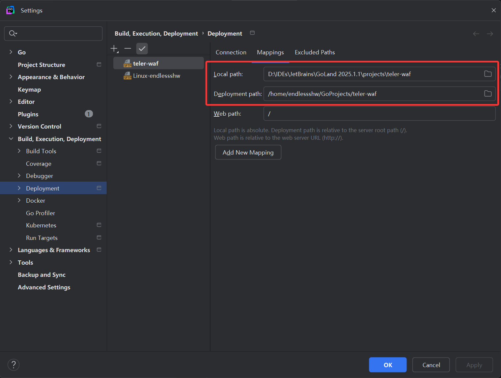
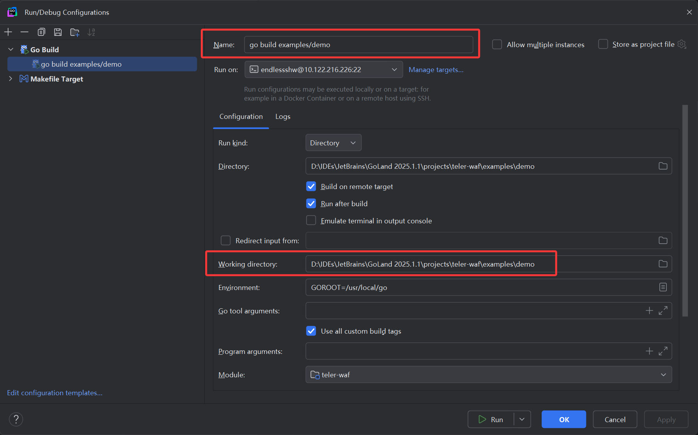
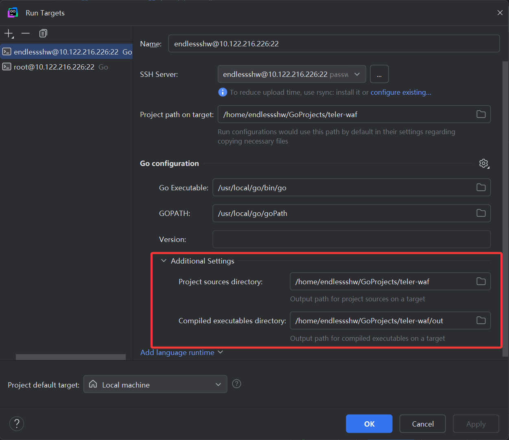
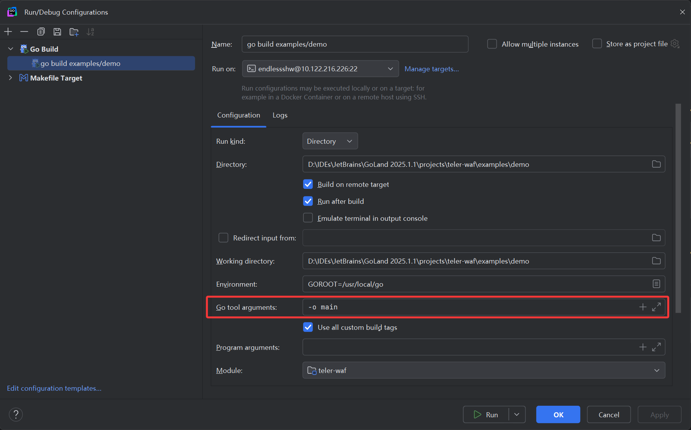

# GoLand 远程配置遇到的问题

## 1. 配置流程

1. 网络上都有教程，可以参考：

    > https://www.cnblogs.com/haima/p/16298440.html

## 2. 需要注意的点/问题

1. Linux 中使用 go get 下载依赖时会报错 `permission denied` 的问题（以非 root 权限执行时），这时需要将 go 以及 goPath 的文件夹赋予 777 权限，详见：

    > https://blog.csdn.net/qq_40338696/article/details/110003731

2. 配置远程 SSH 有一些参数需要注意：

    1. 配置 Deployment 时，特别注意对称问题：
        

    2. 注意 Build 中的 Working Directory，例如我现在需要执行项目下的 `examples/demo/main.go`，那么这里的 Working Directory 就要配置到 `examples/demo`，否则项目中会出现**使用相对路径无法寻找到静态资源**的情况（即使你把 GoLand 生成的可执行文件和静态资源放在一起时，通过 GoLand 依旧无法找到）：
        

        > https://blog.51cto.com/zhangxueliang/5376222

    3. Build Run on 的 Manage targets，需要配置源码地址和生成的可执行文件地址，不然其每次执行都会在目录生成源码文件夹和可执行文件的文件夹，不方便统一管理而且重复生成代码：
        

    4. 当然，对于生成的可执行文件，其每次运行都会生成一个可执行文件且名字各不相同。多次执行的话，不注意就会生成很多很多，因此可以添加 `-o` 参数来指定编译后的可执行文件名：
        
        以图片为例，最终生成的地方就是 `/home/endlessshw/GoProjects/teler-waf/out/main`。
