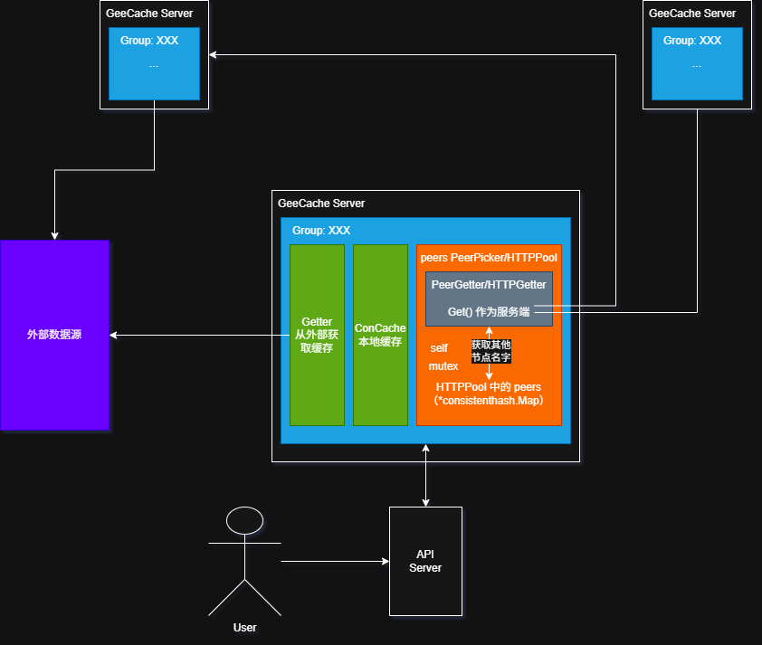

# GeeCache 学习和知识点汇总

1. 项目来源：https://geektutu.com/post/geecache.html

## 1. Day 1-5 总结

### 1.1 项目架构

1. 写到第五天时，这个项目的总体架构基本已经完成，对其进行梳理。原作者的代码的变量和方法名比较简且重复，自己学的时候时感混乱。
    
2. `Group` 表示这整个集群，集群之间靠**名字 `name`**区别。（因此这个 `Group` 其实可以画成很大的一个图，每个节点只对应一个 `HTTPPool`，不过实际代码实现中，每个 `Group` 变量本地都会创建）。
3. 对外提供服务的服务器会与其中的一个 `Group` 进行缓存交互。

### 1.2 每天涉及的知识点汇总

1. Day1：
    1. Go container 包数据结构使用。
    2. 类型的断言强制转换：
        `x.(T)`。
2. Day2：
    1. `sync.Mutex` 协程锁与并发读写。
    2. 只读数据的封装思想。
    3. 延迟初始化（懒加载）。
    4. 接口型函数，方便使用者在调用时既能够传入函数作为参数，也能够传入实现了该接口的结构体作为参数。
3. Day3：
    1. HTTP 标准库服务端。
4. Day4：
    1. 一致性 Hash。
    2. `sort.Search`
5. Day5：
    1. HTTP 客户端实现
    2. flag 包用于解析命令行参数

## 2. Day 6-7 总结

1. Day 6-7 对项目的性能和特殊情况进行优化。

### 2.1 每天涉及的知识点

1. Day6：
    1. 同步锁和 `waitgroup` 等相关锁的使用方法。
    2. singleflight 的使用方法：
        https://www.lixueduan.com/posts/go/singleflight/#4-%E6%B3%A8%E6%84%8F%E4%BA%8B%E9%A1%B9
        singleflight 是有一个单独的轻量库。
2. Day7：
    1. protobuf 的使用，主要就是 `.proto` 文件生成 `go` 源码和 `protobuf` 的使用。
    2. 教程中使用 protobuf 只是将文件的传输格式从 HTTP 原文改成了 protobuf 的二进制而已，但是节点之间的交互依旧是通过 HTTP。

