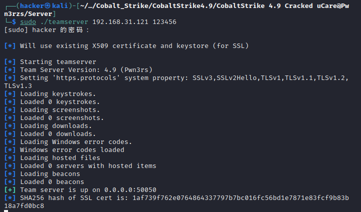
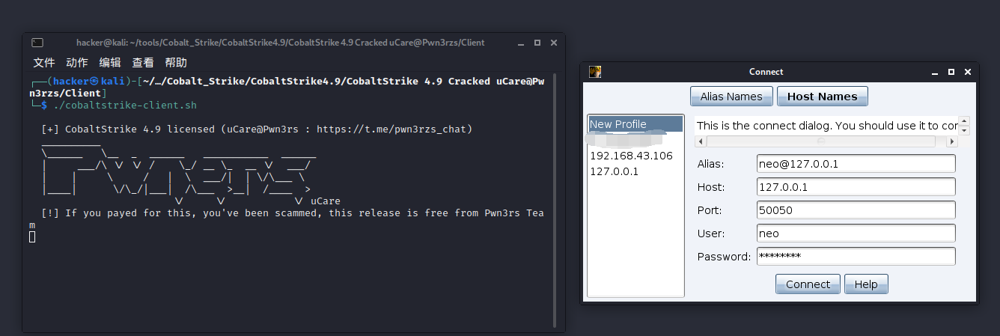
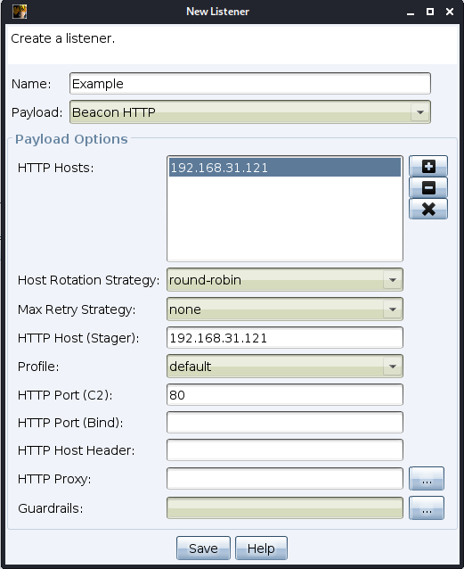
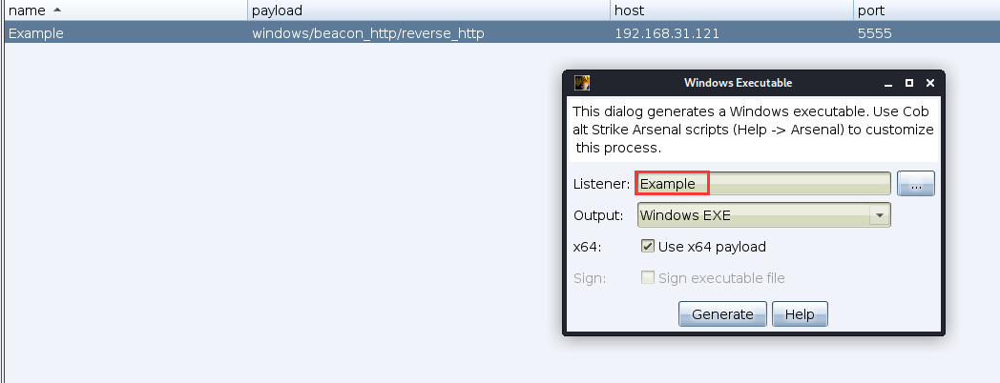

# Cobalt Strike 使用

参考：

> https://www.keleya.club/2023/01/10/d6930e43bb6d/#135-site-management
> https://payloads.cn/2019/1204/basic-functions-and-usage-of-cobaltstrike.html
> 官方手册：
> https://hstechdocs.helpsystems.com/manuals/cobaltstrike/current/userguide/content/topics/welcome_main.htm

## 1. 介绍

### 1.1 目录结构

1. 常见的目录结构：
    ```tree
    | server
    	| agscript 拓展应用的脚本
    	| c2lint 检查 profile 的错误异常
    	| teamserver 团队服务器启动脚本
    	| third-party 第三方工具
    		| winvnc.x64.dll
    		| README.winvnc.txt
    		| ...
    	| ...
    | client
    	| cobaltstrike-client.jar 客户端启动程序
    	| cobaltstrike-client.sh Linux 启动脚本
    	| ...
    ```

2. 还有其他的东西，以后再补充。有的内容有，有的内容没有。

### 1.2 个人定制

1. Cobalt Strike 可以使用 AggressorScripts 脚本来加强自身，能够扩展菜单栏，Beacon 命令行，提权脚本等。
2. Cobalt Strike 通信配置文件是 Malleable C2 。你可以修改 CS 的通讯特征，Beacon payload 的一些行为。
3. Cobalt Strike可以引用其他的通讯框架 ExternalC2，ExternalC2 是由 Cobalt Strike提出的一套规范框架，它允许黑客根据需要对框架提供的默认 HTTP(S)/DNS/SMB C2 通信通道进行扩展。

### 1.3 启动

1. 首先启动服务器端程序：
    ```bash
    # 如果没有启动权限的话，需要添加启动权限
    chmod +x ./teamserver
    # <host> 团队服务器 IP
    # <password> 连接服务器所需密码
    # [/path/to/c2.profile] 可选，指定 C2 通信配置文件，体现其强大的扩展性
    sudo ./teamserver <host> <password> [/path/to/c2.profile] [YYYY-MM-DD] 
    ```

    
    默认端口 50050，详细的设置可以在 teamserver 文件中进行修改。
    这个程序可以放置后台让其执行，可以用 screen 工具放置后台。

2. 客户端启动：
    ```bash
    ./cobaltstrike-client.sh
    ```

    
    很简单（

### 1.4 界面翻译（每个界面点进去基本都有英文概述）

1. Cobalt Strike：
    1. New Connection - 新建连接，支持连接多个服务端
    2. Preferences - 偏好设置，常用于设置 GUI、控制台样式、TeamServer 连接记录等。
    3. Visualization - 切换展示结果的视图，有线性图，表格等等，默认显示的是图表。
    4. VPN Interface - 设置 VPN 接口。
    5. Malleable C2 Profile - 官方插件，可用于定制 Beacon 向 Cobalt Strike 服务端通信的流量特征，不同于常见的修改端口，证书，做反向代理等。
    6. Script Manager 和 Script Console - 脚本管理和脚本控制台。可以通过 AggressorScript 脚本来加强自身，能够拓展菜单栏，Beacon 命令行，提权脚本等。
2. View：
    该模块主要查看一些结果，不细讲了。
3. Payloads（低版本没有，原先是 Attacks 的 Packages）：
    1. HTML Application - 生成基于 Executable/VBA/Powershell 这三种原理的 HTA 木马文件。
    2. MS Office Macro - 生成 Office 宏病毒文件。
    3. Stager/Stageless Payload Generator - 生成 Stager/Stageless 的不同语言的木马。
    4. Windows Stager/Stageless/Stageless-Generate-All Payload - 生成 Windows 相关的木马。
4. Attacks：
    1. Scripted Web Delivery - 提供 Web 服务，便于下载和执行 PowerShell Payload，类似于 Metasploit 的 Web Delivery。
    2. Signed Applet Attack - 使用 Java 自签名的程序进行钓鱼攻击（该方法已经过时）。
    3. Smart Applet Attack - 自动检测 Java 版本并进行攻击，针对 Java 1.6.0_45 以下以及 Java 1.7.0_21以下版本（该方法也已经过时）。
    4. System Profiler - 用来获取系统信息，如系统版本，Flash 版本，浏览器版本等。
    5. Spear Phish - 鱼叉钓鱼攻击。
5. Site Management：
    1. Manage - 管理 CS 创建的站点。
    2. Clone Site - 克隆站点，用于钓鱼。
    3. Host File - 给本地文件提供下载。
6. Reporting：
    1. Activity Report - 活动报告。
    2. Hosts Report - 主机报告。
    3. Indicators of Compromise - IOC报告，包括 C2 配置文件的流量分析、域名、IP 和上传文件的 MD5 hashes。
    4. Sessions Report - 会话报告。
    5. Social Engineering Report - 社会工程报告：包括鱼叉钓鱼邮件及点击记录。
    6. Tactics, Techniques, and Procedures - ATT&CK 报告。
    7. Reset Data - 重置数据
    8. Export Data - 导出数据，导出.tsv文件格式
7. 上方的一些快捷键都有英文，不难理解。

### 1.5 一些名词的解释

1. Beacon：官方的定义：

    > https://hstechdocs.helpsystems.com/manuals/cobaltstrike/current/userguide/content/topics/malleable-c2_http-staging.htm#_Toc65482843
    > Beacon is a staged **payload**. This means **the payload** is downloaded by a stager and injected into memory. Your http-get and http-post indicators will not take effect until Beacon is in memory on your target.

    Beacon 是 Payload，Stager 将其下载下来并注入到目标内存中。如果 Beacon 不在目标内存中，那么攻击端通过 GET 和 POST 发送的 Payload 将不会执行。

2. Beacon 引出了 Stager，Stager 可以参考：

    > https://hstechdocs.helpsystems.com/manuals/cobaltstrike/current/userguide/content/topics/listener-infrastructure_payload-staging.htm#_Toc65482735
    > **Payloads** are often divided into **two parts**: the payload **stage** and the payload **stager**. **A stager is a small program**, usually hand-optimized assembly, that **downloads a payload stage**, **injects it into memory**, and **passes execution to it**. This process is known as staging.
    >
    > Cobalt Strike does use staging in its user-driven attacks...Payloads with no stager cannot be delivered with these attack options.

    一般一段 Payload 分为两步，Payload 的执行和能够执行 Payload 的执行器。那么  Cobalt Strike 的 Stager 就是执行器（本质是一小段程序），其将 Payload 下载，注入内存并执行。
    在用户驱动攻击方面，Stager 就显得尤为重要。攻击需要很多参数，因此如果没有 Stager 的话，有些攻击参数无法被投递。

3. 有 Stager 就会有 Stageless，官方对 Stageless 没有直接定义，但是可以从下文看出一些内容：

    > https://hstechdocs.helpsystems.com/manuals/cobaltstrike/current/userguide/content/topics/listener-infrastructure_payload-staging.htm#_Toc65482735
    > If you don’t need payload staging, you can turn it off. Set the **host_stage** option in your Malleable C2 profile to false. This will prevent Cobalt Strike from hosting payload stages on its web and DNS servers. **There is a big OPSEC benefit to doing this.** With staging on, anyone can connect to your server, request a payload, and analyze its contents to find information from your payload configuration.
    >
    > In Cobalt Strike 4.0 and later, **post-exploitation and lateral movement actions eschew（重点这个词，译为“避开”） stagers and opt to deliver a full payload where possible**. If you disable payload staging, you shouldn’t notice it once you’re ready to do post-exploitation.

    使用 Stageless，意味着 Payload 将不会分两步执行而是尽可能一次性全发送，使用 Stageless 的好处在于 OPSEC（作战安全），这样攻击服务器可以避免遭到反渗透。
    同时 Payload 的分段与不分段，其他文章有做解释：

    > https://cangqingzhe.github.io/2020/09/01/%E5%85%B3%E4%BA%8Ecobaltstrike%E9%80%9A%E4%BF%A1%E6%B5%81%E7%A8%8B%E7%9A%84%E5%88%86%E6%9E%90/
    > 在内网横向渗透的过程中，因为目标内网的主机可能无法和外网通信，这个时候如果还使用分阶段执行，目标内网的断网机将无法下载到 Stage。所以在内网渗透的过程中一般使用的是无阶段的 Payload。
    > 同时使用 Stager 的好处：
    >
    > 1. 为了解决文件文件大小的问题，另一方面为了和 Metasploit 兼容
    > 2. 通常 Stager 作为一个加载器并没有做安全处理，而stage则会做比较好的处理，一般如果别人捕获了 Stager样本并不会造成什么影响。所以使用分阶段的形式也是为了保护 Stage（也就是有一定的免杀能力）。

4. 

## 2. 基本的使用（以 Beacon HTTP 为主）

1. 首先需要创建监听器，监听器支持多种协议，包括但不限于：
    Beacon DNS/HTTP/HTTPS/TCP/SMB、External C2、Foreign HTTP/HTTPS。

2. Beacon 是 Cobalt Strike 的 payload。Foreign 表示外部监听器，一般用来配合 Metasploit 和 Armitage。

3. 监听器的配置界面如下：
    
    下面讲解一下参数和特殊的地方。

4. 首先 HTTP Hosts 可以设置为多个，这个 Hosts 表示 Beacon 直接回连的主机列表（注意不是 Stager 的）。一般是一个。同时 HTTP Hosts 可以是域名。

5. 然后 Host Rotation Strategy 也就是地址轮询策略，当 HTTP Hosts 为多个的时候，它就会发挥作用，其具体效果如下：

    1. **round-robin**：顺序连接列表中的主机，每个主机都会建立一个连接。

    2. **random**：随机选一个主机连接。
    3. **failover-xx**：尽可能的选择一个主机。直到一个主机遇到连续的错误和长时间的错误时，才会选择下一个主机。后面的 `xx` 表示连续的错误次数或错误持续时间。
    4. **rotate-xx**：每个主机都用一段时间，到时间就换下一个主机。

6. Max Retry Strategy：当 Beacon 连接 Teamserver 多次失败时，该选项用于指定其之后的行为。默认 None 表示 Beacon 尝试连接失败后依旧不退出。

7. HTTP Host(Stager)：设置 Stager 的回连主机 IP，如果使用 Stager，就需要设置好这个 IP，一般就是 TeamServer 的 IP（可以看出，如果 Stager 被拿到，就可能会被反向溯源，所以 Stageless 可以保证 OPSEC）。

8. Profile：也就是官方插件 Malleable C2 Profile，可以定制 Beacon 向 Cobalt Strike 服务端通信的流量特征。

9. Guardrails：直译“护栏”，按照官方的文档，意思大概是用于限制 Beacon 可以连接的范围。

10. 创建好 Listener 后，再在 Payloads 中去生成木马：
    

11. 生成的文件保存，给靶机执行，就会上线了。

12. 也可以使用 Scripted Web Delivery，当有靶机的 Powershell 时，执行其生成的命令，也会上线。

