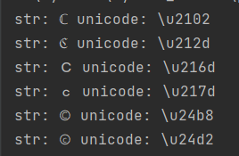
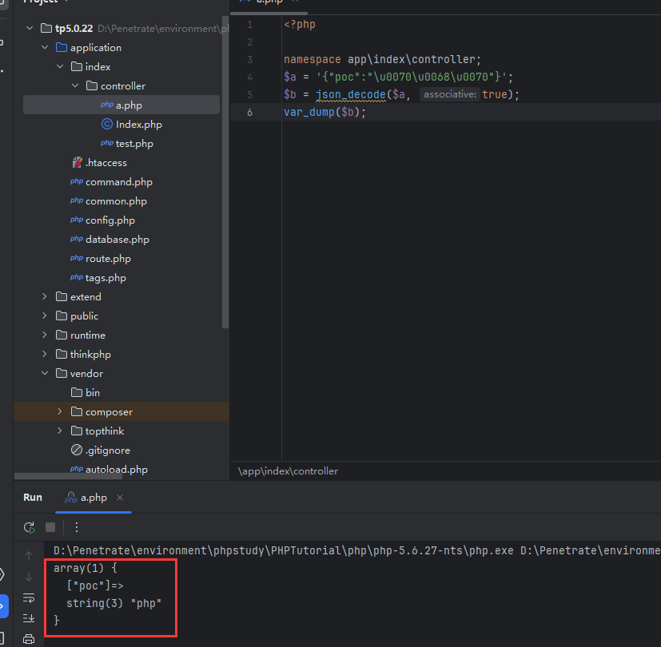

# 常见的编码

## 1. ASCII

1. 最常见的编码，没啥可说的，注意他有十进制和十六进制两种。

## 2. HTML 编码

1. 字符实体编码，即在 HTML 中对字符实体进行编码（转义），不让它起作用。

2. 第一种编码形式是**实体名称**，以 `&` 开头，例如 `&nbsp` 表示空格。

3. 第二种编码形式是**实体编号**，以 `&#` 开头，后接 ASCII（ISO-8859-1）、Windows-1252 和 ISO-8859-1 的特殊符号等，常见格式如下：

    1. `&#十进制`
    2. `&#x十六进制`

4. 可以发现，就单单的空格，也分好几种；不换行空格、半角空格、全角空格等。这些空格的实体编号各不相同。详见：

    > https://www.w3school.com.cn/charsets/ref_html_8859.asp

## 3. URL 编码

1. 对特殊符号进行编码，格式是 `%16进制 ASCII`。例如空格是 `%20`。

## 4. JS 编码（用于 XSS，把 JS 的语句进行编码，也就是 `<script>` 标签中的内容编码）

1. 第一种，十六进制编码：`\x 16 进制 ASCII`，例如 `<` 可以表示成 `\x3c`。
2. 第二种，八进制编码：`\x 8 进制 ASCII`。
3. 第三种，**Unicode 编码**：`\u 后接 Unicode 编码`。
4. PS：Unicode 编码中开头的部分和 ASCII 重合，但是 Unicode 编码是**四位十六进制数**，而 ASCII 是两位。

## 5. Hex 编码（数据库中）

1. 本质就是十六进制编码。
2. 格式：`0x 16 进制编码`。
3. hex 结果和 base16 的结果相同。

# 和编码有关的渗透

## 1. URL 中 IDNA 编码导致的绕过

1. 最初的来源是 Blackhat 2019 的会议上：
    https://i.blackhat.com/USA-19/Thursday/us-19-Birch-HostSplit-Exploitable-Antipatterns-In-Unicode-Normalization.pdf
2. IDN：
    国际化域名(Internationalized Domain Name,IDN)又名特殊字符域名，是指部分或完全使用特殊文字或字母组成的互联网域名，包括中文、法语、阿拉伯语、希伯来语或拉丁字母等非英文字母，这些文字经过多字节万国码编码而成。在域名系统中，国际化域名使用 **punycode 转写并以 ASCII 字符串存储**。
3. 使用 IDNA 编码后，域名可以出现中文等字符。
4. 但是有些 Unicode 字符经过 IDNA 编码再经过 UTF-8 解码后，就会变成常见的字符，例如：℆ 经过 IDNA 编码再 UTF-8 解码后变成 c/u。又例如：
    
    这些字符在经过处理后都会变成字母 C。
5. 例题：[SUCTF 2019]Pythonginx 1

## 2. PHP 的 JSON 编码

1. PHP 的 `json_decode()` 方法会自动将 Unicode 编码转换成对应字符。例如：
    ```php
    $a = '{"poc":"\u0070\u0068\u0070"}';
    $b = json_decode($a, true);
    var_dump($b);
    ```

2. 结果如下：
    

3. 例题：[HarekazeCTF2019]encode_and_encode 1

    
