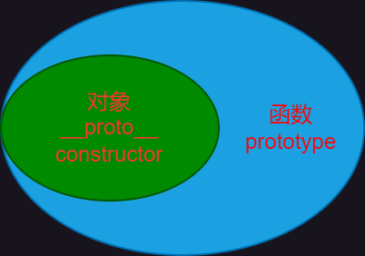
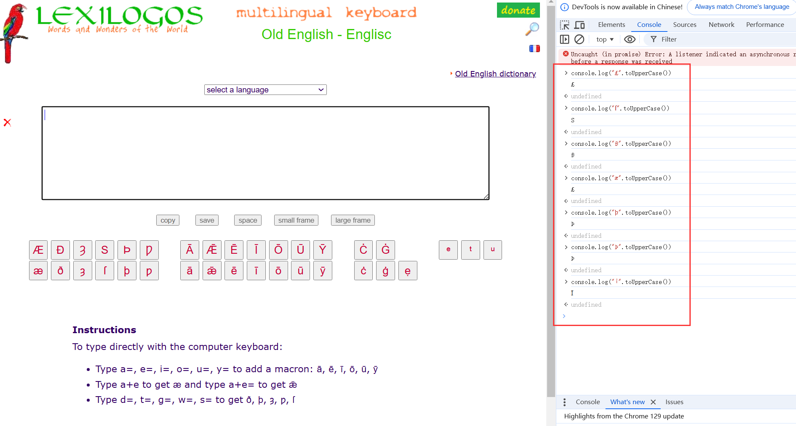

# Unknown

1. 这是我也不知道应该放在哪里的细碎知识点。个人觉得如果单独开个栏目的话就显得小题大作。如果以后哪些的内容足够开一个栏目了，那就再把它摘出来。

## 1. `#include ""`预处理编译报错`

1. 例题：[FireshellCTF2020] Caas
2. 原理很简单，就是 C 语言的 `#include ""` 引入的头文件，如果不是正确的语法，编译时就会报错，同时会将文件的内容显示出来。

## 2. Ruby 的 ERB 注入和全局变量

1. 直接上例题：[SCTF2019]Flag Shop

2. 参考文章：

    > https://blog.csdn.net/qq_53142368/article/details/124000888
    > https://blog.csdn.net/zdq0394123/article/details/8443694
    > https://550532788.github.io/2020/04/17/%5BSCTF2019%5DFlag%20Shop/

    ERB 注入参考文章讲的很清除。针对全局变量的 $\` 和 `$'`，这两者的意思是上一次正则表达式主体匹配的结果。例如针对例题的代码：
    ```ruby
    get "/work" do
      islogin
      auth = JWT.decode cookies[:auth],ENV["SECRET"] , true, { algorithm: 'HS256' }
      auth = auth[0]
      unless params[:SECRET].nil?
          # 这里的主体就是 ENV["SECRET"]
        if ENV["SECRET"].match("#{params[:SECRET].match(/[0-9a-z]+/)}")
          puts ENV["FLAG"]
        end
      end
    ```

    因此全局变量的内容主体是 `ENV["SECRET"]`。

## 3. JavaScript 的原型链污染

1. 参考链接：

    > 底层原理讲解：https://blog.csdn.net/cc18868876837/article/details/81211729
    > 原型链污染原理：https://www.leavesongs.com/PENETRATION/javascript-prototype-pollution-attack.html
    > 官方对于 `__proto__` 的使用态度，以及 `__proto__` 的属性：
    > https://developer.mozilla.org/zh-CN/docs/Web/JavaScript/Reference/Global_Objects/Object/proto
    > JS 内访问属性的两种方式：
    > https://developer.mozilla.org/zh-CN/docs/Web/JavaScript/Reference/Operators/Property_accessors

2. 先总结一下底层原理，还是挺绕的，容易忘：

    1. JS 类的定义不同，用的是 `function` 关键字，定义的函数就是构造函数 `constractor`。创建出来，用 `new` 实例化后的叫对象。这个可以看官方文档：

        > https://developer.mozilla.org/zh-CN/docs/Learn/JavaScript/Objects/Basics#%E6%9E%84%E9%80%A0%E5%87%BD%E6%95%B0%E4%BB%8B%E7%BB%8D

    2. JS 中函数和类的关系有点特殊：
        
        函数的范围比对象大。也就是说，[对象和类实际上是特殊的函数](https://developer.mozilla.org/zh-CN/docs/Web/JavaScript/Reference/Classes)。常说的 `class` 关键字其实是 ES6 中引入的语法糖。

    3. `prototype` 是函数独有的，他是一个**对象**。

    4. `__proto__` 属性由**对象/函数**指向一个对象，也就是指向一个函数的 `prototype`。所以 `函数所实例化的对象.__proto__ == 函数.prototype`。

    5. 对于函数所实例化的对象或者函数的原型（`prototype`），他们的 `constractor` 都是函数，也就就对应了第 1 点，即我们所定义的函数就是构造函数。
    
    6. `__proto__` 目前官方是不推荐使用的，且应该是弃用状态（Deprecated），然后 `__proto__` 是有 getter 和 setter，因此在原型链污染中可以直接修改。
    
    7. JS 中**访问属性的方式有两种**，除了常见的 `.`，也就是 `对象.__proto__` 之外，还可以用 `对象['__proto__']` 来访问。这个需要注意！
    
3. 漏洞点：

    1. 第一个就是在 P 神的文章中提到的，直接使用对象或者 `lodash` 库的 `merge()` 或者 `clone()`。

    2. 第二个就是在使用 `express + lodash + ejs` 时，通过修改 `express` 的内部变量从而修改渲染逻辑而导致 RCE。详见：

        > https://evi0s.com/2019/08/30/expresslodashejs-%e4%bb%8e%e5%8e%9f%e5%9e%8b%e9%93%be%e6%b1%a1%e6%9f%93%e5%88%b0rce/

        应该是只要有原型链污染的入口，就可以使用该 Payload 来通杀：
        入口代码（例子）：
    
        ```js
        // 将请求体中的内容（对象） clone 到数据中
        req.session.user.data = clone(req.body);
        ```
    
        可能的 Payload（前端自动解析 JSON）：
    
        ```http
        Content-Type: application/json
        ...
        
        {"__proto__": {"outputFunctionName": "a; return global.process.mainModule.constructor._load('child_process').execSync('cat /flag');//"}}
        ```
    
        需要注意的是，如果想要回显，那么得需要寻找 `res.render()` 函数。该函数就是 Express 的渲染函数。
    
4. 例题：[GYCTF2020]Ez_Express

## 4. JavaScript 大小写绕过

1. 搜了一下，目前能绕过的不多，我以为古英语经过大写后都能转换成现在英文字母，但显然不是。
    
2. 有人做了整理：
    https://www.cnblogs.com/k1ra8/articles/4013278.html
3. 总结一下，小写转大写就两个，大写转小写就一个。
