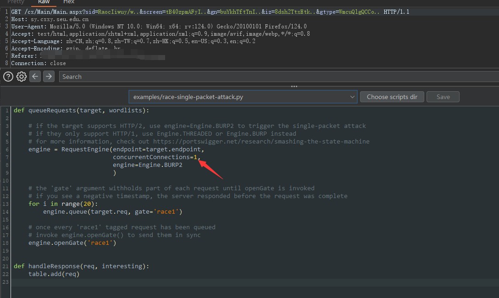

# 并发漏洞

## 1. 常见场景

1. 点赞、签到、领取积分等限次数的地方。
2. 验证码同一时间没有限制的话，可以造成短信轰炸。
3. 提高爆破的效率。

## 2. 常用工具

1. Burp Suite 的插件：Turbo Intruder。
    
    需要 fuzz 的地方使用 `%s` 来替代，如果没有的话就随便找个地方填 `%s`，没有 fuzz 需求的话，就用 race-single-packet-attack.py。
    `concurrentConnections` 代表并发量，根据要求适当提高。
2. TODO：Python 的学习和其他脚本的使用

## 3. 例子

1. 参考：

    > https://www.cnblogs.com/backlion/p/18088702
    >
    > https://blog.csdn.net/Javachichi/article/details/133375463

2. TODO：这辈子要是能挖到的话，就写上自己的例子。