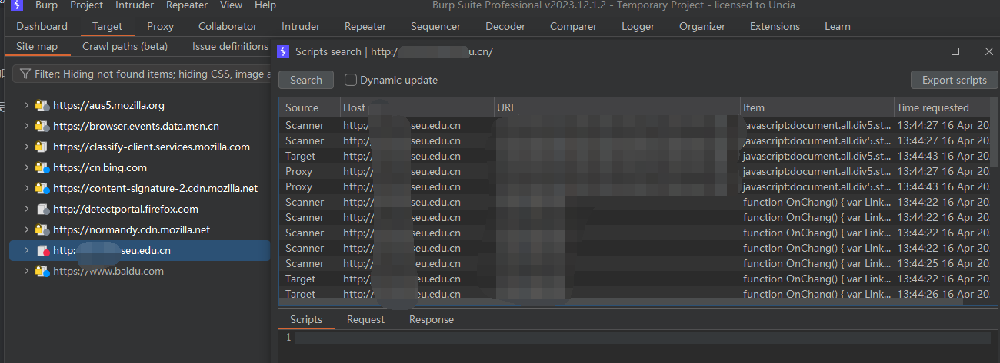
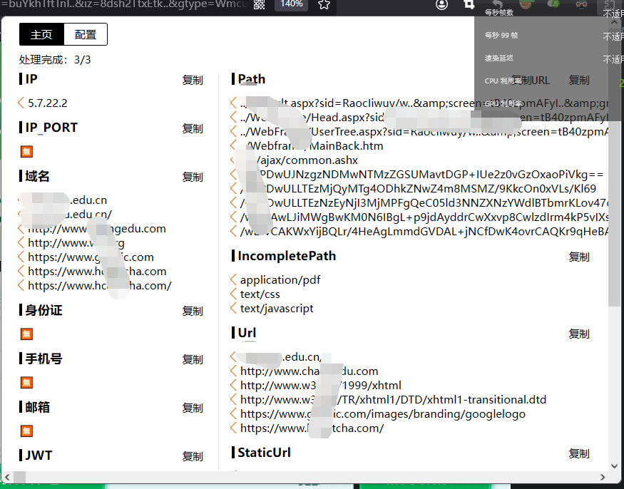

# JS 探寻和前端参数加密

## 1. JS 探寻

1. 主要的目的是为了爬取网站的 JS 文件，以用于代码审计。

### 1.1 常用工具

1. BurpSuite 专业版可以爬取 JS，详细方法就是 Target - Site Map - 感兴趣的站点右键 - Engagement Tools - Find Scripts。
    
2. 使用插件 FindSomething 来获取网站的一些信息：
    
    但感觉在 JS 方面，还是 Burp Suite 全一点。
3. jsFinder，也可以发现一些内容或者接口：
    https://github.com/Threezh1/JSFinder
4. JS 的代码美化：
    https://beautifier.io/

## 2. 常见思路

1. 学会搜索，搜 key 等查看前端有没有泄漏加密密钥；搜 encrypt 等关键字可以找到前端加密的逻辑。
2. f12 可以打断点，有助于弄清页面的加密逻辑和找到加密密钥的**原文或者 JSON/Object 格式**。JS Debug：
    https://www.runoob.com/js/js-debugging.html

