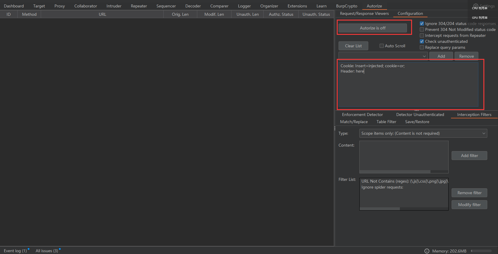

# 越权漏洞的思路

## 1. 漏洞发现

1. 隐藏的 URL：一些开发者通过在菜单栏**隐藏 URL 实现**对普通用户和特权用户的访问控制。但是通过 Google Hacking、前端源码（路由）分析、路径扫描或利用其他漏洞来发现这些特权用户才能访问到的 URL。
2. 关注请求参数（包括 Header）中的各种 id，场景很多，可以对 id 进行遍历。
3. 看似顺序执行的流程：很多功能的实现都需要分阶段请求，例如找回密码、购买商品等。
    以找回密码为例：
    1. 第一阶段：对当前需要找回密码的账户进行认证，认证通过后到第二阶段。
    2. 第二阶段：此阶段发起修改密码请求，通过拦截修改请求数据包中的账号。若开发者认为，到达验证通过后的第二阶段的用户一定已经拥有了相关的权限，并在后续阶段执行操作时不再对用户提交的请求进行验证，那么此时会成功修改掉受害者账号密码。 
4. 当然找回密码处的问题除了这类越权外，还有很多可以挖掘的点，比如验证码泄露、验证码认证绕过、邮箱弱 token等。

## 2. 常见场景

1. 菜单 URL 越权访问，不同角色账号访问系统菜单 URL 不一样，互相访问并未做限制。
2. 订单/用户等信息遍历，未校验和加密 id。
3. 找回/修改密码，没有校验用户的真实性。
4. 交易流程，下单阶段未校验订单数量、价格。
5. 控制身份的一些字段，如果页面中决定个人身份的参数不可修改（或没有提交），那么考虑前端寻找提交参数，手动提交尝试。
6. 跳转过程中，返回的身份字段拿过来添加后修改；前后端分离的项目中，后端返回的接口 URL 可以考虑直接访问，从而绕过xian'zhi。

## 3. 一些技巧

1. 某些页面看似 403，但是请求头中添加 x-forwarded-for 为 127.0.0.1 时，有可能绕过验证逻辑访问到页面了。
2. 看似需要验证码登录的后台，修改一些参数或许能绕过验证码登录策略，例如 verifycode2 改成 verifycode。

## 4. 工具使用 - Burp 的 autorize

1. 这是一个用来测试是否出现账户垂直越权的工具，使用的情况一般是要有两个账号。
2. 界面大概如下：
    
3. 先使用第一个低权限账号的身份凭证，输入到框内；然后登录高权限账号，再打开 autosize，这时以高权限的身份去测试功能，然后 autosize 同时会以低权限同步测试。

