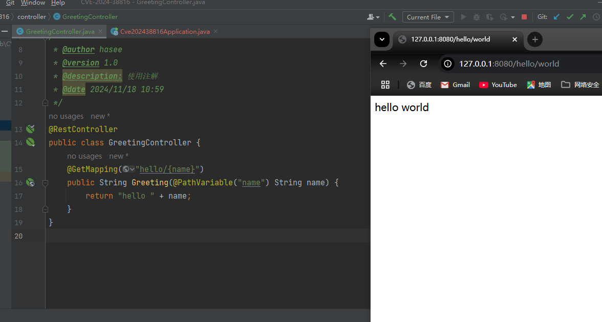
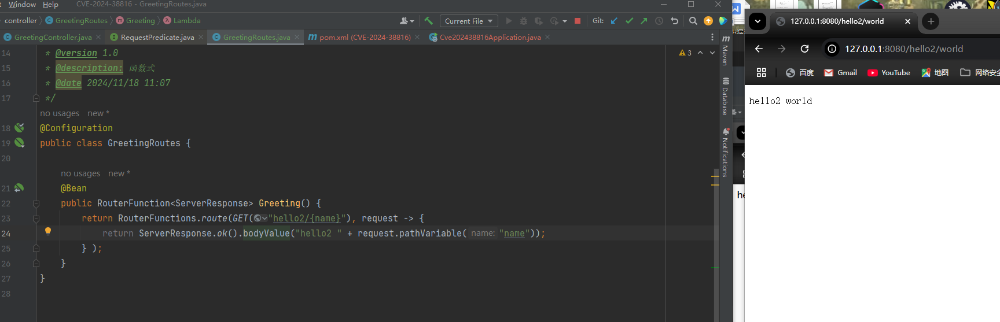
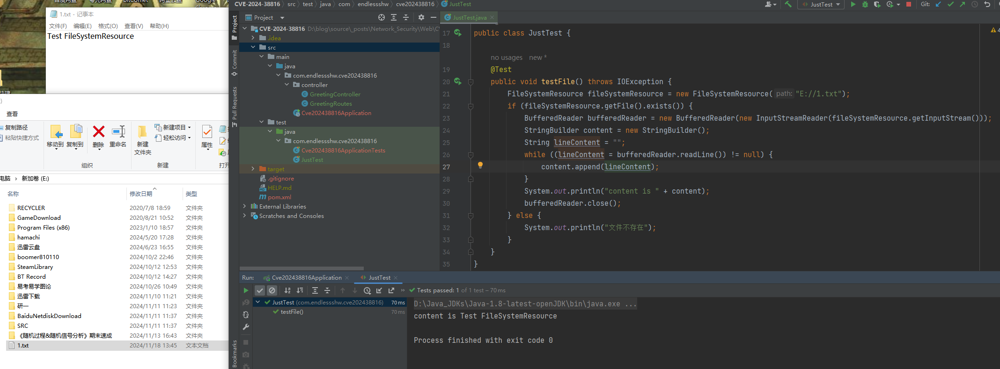
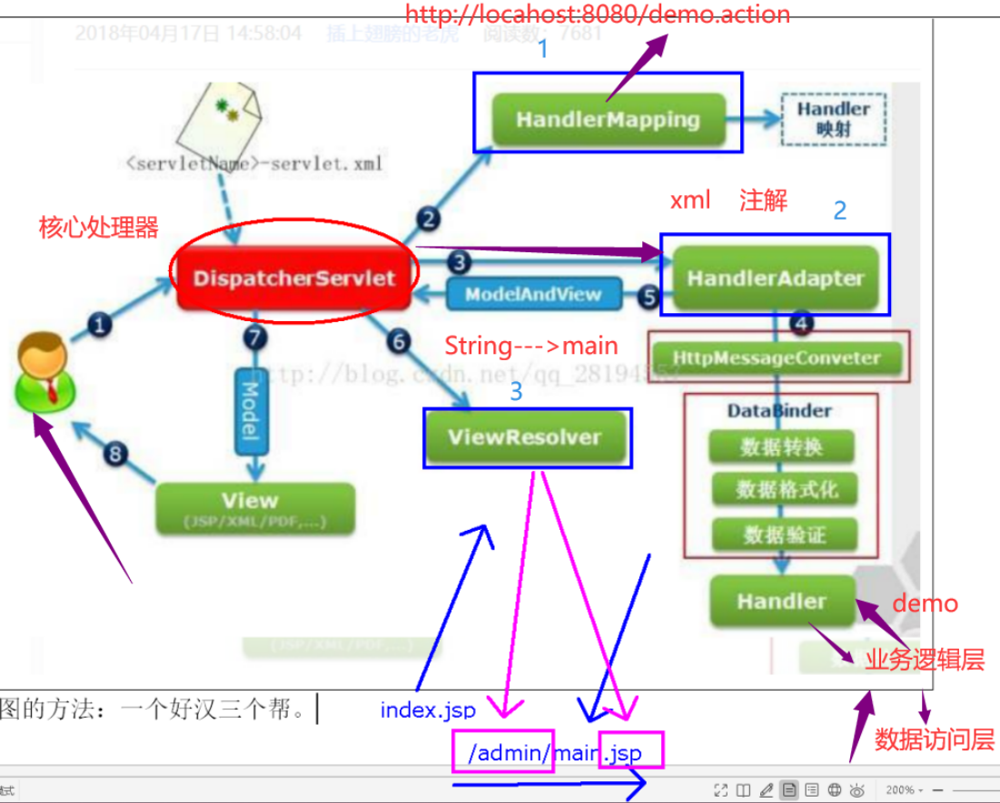
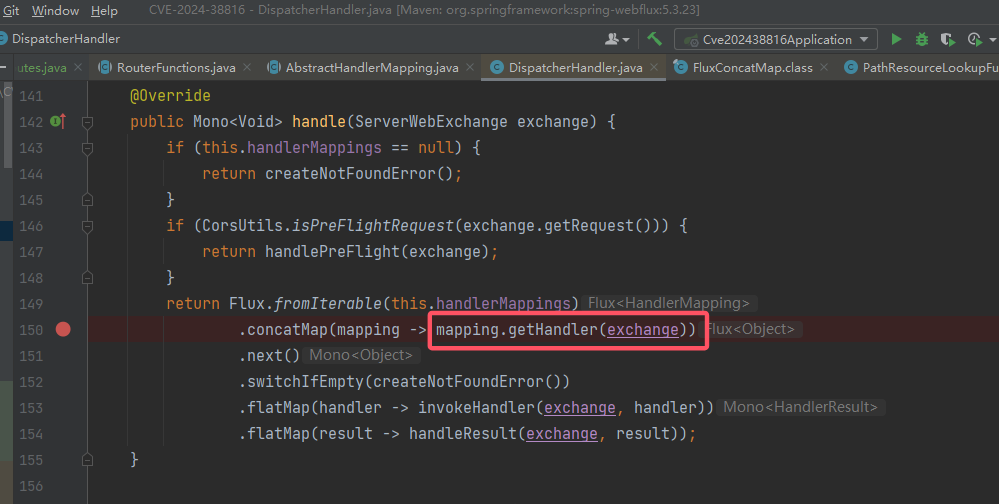
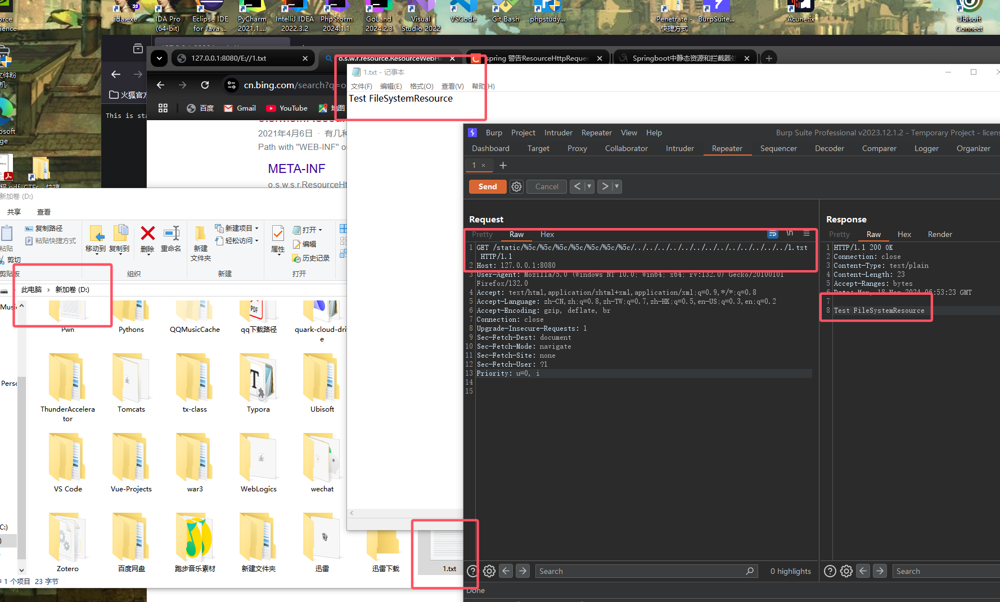
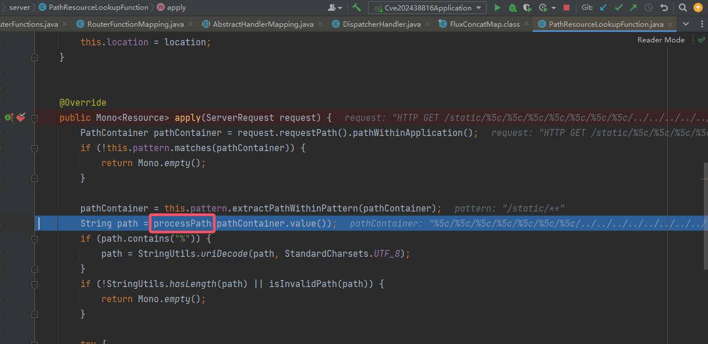
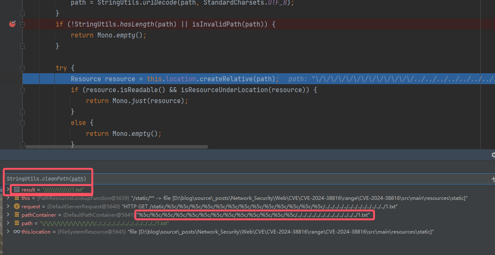

# CVE-2024-38816 Spring 目录遍历漏洞

1. 作为第一篇学习 CVE 的文章，就从比赛题的来源开始。

2. 文章参考：

    > https://xz.aliyun.com/t/15779?time__1311=GqjxnQiQitDQKGXKQxUxQT4WT%3DEQdzW4D
    > https://www.freebuf.com/vuls/414658.html

## 1. 漏洞概述

1. 官方直接给出了补丁的详细内容，包括但不限于漏洞描述，漏洞影响版本，修复建议等等：

    > https://spring.io/security/cve-2024-38816
    > **Applications serving static resources through the functional web frameworks WebMvc.fn or WebFlux.fn are vulnerable to path traversal attacks.** An attacker can craft malicious HTTP requests and obtain any file on the file system that is also accessible to the process in which the Spring application is running.
    >
    > Specifically, an application is vulnerable when both of the following are true:
    >
    > - the web application uses `RouterFunctions` to serve static resources
    > - resource handling is explicitly configured with a `FileSystemResource` location
    >
    > However, malicious requests are blocked and rejected when any of the following is true:
    >
    > - the [Spring Security HTTP Firewall](https://docs.spring.io/spring-security/reference/servlet/exploits/firewall.html) is in use
    > - the application runs on Tomcat or Jetty

## 2. 基础知识

1. 根据漏洞描述，有两个关键性的名词：WebMvc.fn 和 WebFlux.fn。先来了解这两者是什么。

### 2.1 函数式编程

1. 先来了解两者的共性：函数式编程。这个思想在后端我也是第一次接触过，印象中应该是前端中常见的东西。

2. 从差异中学习特性，来看一下面向对象和函数式两者思想的对比：

    1. 面向对象编程的思维方式：把现实世界中的事物**抽象成程序世界中的类和对象**，通过封装、继承和多态来演示事物事件的联系。
    2. 函数式编程的思维方式：把现实世界的**事物和事物之间的联系**抽象到程序世界（对运算过程进行抽象）。

3. 有关函数式编程的具体思想，知乎大佬们给出了答案：

    > https://www.zhihu.com/question/28292740

    这里主要总结一下函数式编程的一些特性，有助于代码理解：

    1. 输入输出基本是同一个东西，由于变量值是不可变的，对于值的操作并不是修改原来的值，而是修改新产生的值，原来的值保持不便。
    2. 高阶函数：参数为函数或返回值为函数的函数。对于返回值为函数的函数，也就意味着可以重复调用。

### 2.2 `RouterFunction` 函数式接口

1. 参考文章：

    > https://www.cnblogs.com/somefuture/p/15433565.html

2. Spring 框架提供了两种 http 端点暴露方式来隐藏 servlet 原理，一种就是这多年大家都在使用的基于注解的形式 `@Controller` 或 `@RestController` 以及其他的注解如 `@RequestMapping`、`@GetMapping` 等等。另外一种是基于路由配置 `RouterFunction` 和 `HandlerFunction` 的，称为“函数式 WEB”。

3. 来看看两者的对比，先是注解式写的 Demo：
    
    然后来看一下函数式：
    

4. 和 Contoller 一样，函数式也支持用 Handler 来处理业务逻辑，这就涉及到了 `HandlerFunction`。详见参考文章，这里就不多提及了。

### 2.3 `FileSystemResource` 资源类

1. 来直接看官方对这个类的介绍：

    > Resource implementation for java.io.File and java.nio.file.Path handles with a file system target. Supports resolution as a File and also as a URL. Implements the extended WritableResource interface.

    该类实现接口 `Resource`（对资源的抽象接口，常见资源有文件、URL、URI、Byte 和 Context 等），针对给定的文件系统，为 `File` 和 `Path` 提供句柄（可以看一下它的成员变量，有这两个类）。支持将资源解析为一个文件或者一个 URL。

2. 总之可以理解为“用它可以访问文件”，举个例子：
    

### 2.4 MVC 和 WebFlux

1. MVC 对于接触过 Java 开发的人来说，都很熟悉。但是 WebFlux 作为一种 Spring 新引入的技术，来看看它的相关说明。

2. 参考：

    > https://blog.csdn.net/A_art_xiang/article/details/129571421#:~:text=%E4%BC%A0%E7%BB%9F%E7%9A%84%E5%9F%BA%E4%BA%8EServlet%E7%9A%84Web%E6%A1%86%E6%9E%B6%EF%BC%8C%E5%A6%82Spring

3. SpringMVC 对标 Spring-WebFlux，Spring-WebFlux 是一个新的异步、非阻塞的 WEB 模块，其没有与 Servlet API 耦合，因此可以运行在任意非阻塞 Web 容器中，包括 Netty、Undertow、Tomcat、Jetty 或任意 Servlet 3.1 及以上的容器。

4. 需要注意的是，虽然 WebFlux 经常用响应式编程模式（也就是常用函数式接口），**但是它也可以使用注解式开发**。Web 模块的使用和编程范式不是一定绑定的，所以不论是 MVC 还是 WebFlux，只要使用了 `RouterFunction` 函数式编程，就有可能存在该漏洞。

### 2.5 WebFlux 的前端调度器

1. 回顾 SpringMVC 的执行流程，本质上是为了方便断点从哪开始打以捕获到 HTTP 请求。

2. SpringMVC 的函数式接口本质上和注解式没啥区别，其负责前端页面分配调度的中心就是 `DispatcherServlet`：
    

3. 在 WebFlux 中，负责前端调度的类是 `DispatcherHandler`，来看看官方对其描述：

    > Central dispatcher for HTTP request handlers/controllers. Dispatches to registered handlers for processing a request, providing convenient mapping facilities.
    >
    > 其中有三个关键类来处理请求：
    > HandlerMapping -- map requests to handler objects
    > HandlerAdapter -- for using any handler interface
    > HandlerResultHandler -- process handler return values

    根据描述，`HandlerMapping` 是用来寻找 handler，类比 MVC 中就是寻找哪个 Controller 中的 Handler，因此把断点打在 `HandlerMapping` 的相关操作上：
    

## 3. 环境搭建

1. 问题是出现在 Spring 上，直接用 Springboot 搭建，注意修改 Web 容器为非 Tomcat 和 Jetty：
    ```xml
    <dependency>
        <groupId>org.springframework.boot</groupId>
        <artifactId>spring-boot-starter</artifactId>
        <!-- 排除 Tomcat -->
        <exclusions>
            <exclusion>
                <artifactId>spring-boot-starter-tomcat</artifactId>
                <groupId>org.springframework.boot</groupId>
            </exclusion>
        </exclusions>
    </dependency>
    <!-- 引入 Netty -->
    <dependency>
        <groupId>org.springframework.boot</groupId>
        <artifactId>spring-boot-starter-webflux</artifactId>
    </dependency>
    ```

2. 用 `RouterFunction` 搭建一个路由，该路由可以访问静态文件夹中的资源：
    ```java
    package com.endlessshw.cve202438816.controller;
    
    import org.springframework.context.annotation.Bean;
    import org.springframework.context.annotation.Configuration;
    import org.springframework.core.io.FileSystemResource;
    import org.springframework.web.reactive.function.server.RouterFunction;
    import org.springframework.web.reactive.function.server.RouterFunctions;
    import org.springframework.web.reactive.function.server.ServerResponse;
    
    /**
     * @author hasee
     * @version 1.0
     * @description: TODO
     * @date 2024/11/18 14:02
     */
    @Configuration
    public class FileRoutes {
    
        @Bean
        public RouterFunction<ServerResponse> staticFileRoute() {
            return RouterFunctions
                    .resources("/static/**",
                            // 注意一定要 `/` 结尾
                            new FileSystemResource("src/main/resources/static/"));
        }
    }
    ```

3. 用 PoC 打如下：
    

## 4. 流程分析

### 4.1 初步处理

1. 在 [2.5](# 2.5 WebFlux 的前端调度器) 中提到断点的入口，那就打在那里。

2. 一路跟进来到 `PathResourceLookupFunction#apply`：
    
    看到处理函数 `PathResourceLookupFunction#processPath`。

3. 分析一下它的处理过程：
    ```java
    private String processPath(String path) {
        // 判断当前的字符是否是 `/`
        boolean slash = false;
        // 外层遍历路径中的每个元素
        for (int i = 0; i < path.length(); i++) {
            if (path.charAt(i) == '/') {
                slash = true;
            }
            // ascii 32 后面，但是不能为 del，也就是找到有效字符
            else if (path.charAt(i) > ' ' && path.charAt(i) != 127) {
                // 如果一开头是有效字符或者 `/有效字符` 时就直接返回
                if (i == 0 || (i == 1 && slash)) {
                    return path;
                }
                // 针对多个 `/` 开头的路径，从第一个有效字符开始获取，前面添加一个 `/`，表现上来看就是合并开头的多个 `/`
                path = slash ? "/" + path.substring(i) : path.substring(i);
                return path;
            }
        }
        return (slash ? "/" : "");
    }
    ```

    总结一下：

    1. `/xxx...` 直接返回。
    2. `xxx/xxx` 直接返回。
    3. `非有效字符 * n` + `...`，过滤前面的所有非有效字符。
    4. `///////xxx` 消除前面所有的 `/`，只保留一个。

4. 接着下面会进行 URL 解码，到此就是对路径做一个初步的处理。

### 4.2 核心过程

1. 接下来主要是绕过 `isInvalidPath` 函数，来看看该函数的判断逻辑：
    ```java
    private boolean isInvalidPath(String path) {
        // WEB-INF、META-INF 两个是黑名单
        if (path.contains("WEB-INF") || path.contains("META-INF")) {
            return true;
        }
        // 判断是否是 Windows 路径
        if (path.contains(":/")) {
            // 获取相对路径，忽略开头的 `/`
            String relativePath = (path.charAt(0) == '/' ? path.substring(1) : path);
            // url 和 url: 开头的路径不许通过
            if (ResourceUtils.isUrl(relativePath) || relativePath.startsWith("url:")) {
                return true;
            }
        }
        // 路径中不允许含有 `..` 和 `../`，然后还有一个关键点：StringUtils.cleanPath(path)
        if (path.contains("..") && StringUtils.cleanPath(path).contains("../")) {
            return true;
        }
        return false;
    }
    ```

2. 接着分析 `StringUtils.cleanPath()`：
    ```java
    /**
      * Normalize the path by suppressing sequences like "path/.." and
      * inner simple dots.
      * <p>The result is convenient for path comparison. For other uses,
      * notice that Windows separators ("\") are replaced by simple slashes.
      * <p><strong>NOTE</strong> that {@code cleanPath} should not be depended
      * upon in a security context. Other mechanisms should be used to prevent
      * path-traversal issues.
      * @param path the original path
      * @return the normalized path
    */
    public static String cleanPath(String path) {
        // 异常处理
        if (!hasLength(path)) {
            return path;
        }
    	
        // 处理 Windows 中特有的 `\\`
        String normalizedPath = replace(path, WINDOWS_FOLDER_SEPARATOR, FOLDER_SEPARATOR);
        String pathToUse = normalizedPath;
    
        // Shortcut if there is no work to do
        if (pathToUse.indexOf('.') == -1) {
            return pathToUse;
        }
    
        // Strip prefix from path to analyze, to not treat it as part of the first path element. This is necessary to correctly parse paths like "file:core/../core/io/Resource.class", where the ".." should just strip the first "core" directory while keeping the "file:" prefix.
        // 将路径中的前缀取出以分析，而不是将前缀当作路径的第一个元素。官方这样做的原因在于能够正确处理例如 "file:core/../core/io/Resource.class" 这种路径。此时 core/../ 是一个重复的路径，在去掉这种重复路径的同时保留 `file:` 前缀（可能是为了方便）
        int prefixIndex = pathToUse.indexOf(':');
        // 拿到 `:` 前面的内容
        String prefix = "";
        // 找到 `:` 的所在位置
        if (prefixIndex != -1) {
            prefix = pathToUse.substring(0, prefixIndex + 1);
            // 如果前缀中含有 `/`，那就直接清空前缀
            if (prefix.contains(FOLDER_SEPARATOR)) {
                prefix = "";
            }
            else {
                // 否则获取 `:` 后面的内容，提取路径的主体内容
                pathToUse = pathToUse.substring(prefixIndex + 1);
            }
        }
        // 如果有效路径中以 `/` 开头时，把这个 `/` 传给前缀，有效路径的 `/` 去掉
        if (pathToUse.startsWith(FOLDER_SEPARATOR)) {
            prefix = prefix + FOLDER_SEPARATOR;
            pathToUse = pathToUse.substring(1);
        }
        // 到此分开了前缀和主体部分
    
        // 根据 `/` 切割路径，将其转换成数组
        String[] pathArray = delimitedListToStringArray(pathToUse, FOLDER_SEPARATOR);
        // we never require more elements than pathArray and in the common case the same number
        // pathArray 就是最终的元素，通常情况下其长度也不会再变了
        // 创建一个队列，用于存放处理后的路径
        Deque<String> pathElements = new ArrayDeque<>(pathArray.length);
        int tops = 0;
    
        // 从后往前遍历队列
        for (int i = pathArray.length - 1; i >= 0; i--) {
            String element = pathArray[i];
            // 处理 `.`
            if (CURRENT_PATH.equals(element)) {
                // Points to current directory - drop it.
            }
            // 处理 `..`，tops 是计数器，每有一个 `..`，就舍弃掉一个路径中的文件夹
            else if (TOP_PATH.equals(element)) {
                // Registering top path found.
                tops++;
            }
            else {
                if (tops > 0) {
                    // Merging path element with element corresponding to top path.
                    tops--;
                }
                else {
                    // Normal path element found.
                    pathElements.addFirst(element);
                }
            }
        }
    
        // All path elements stayed the same - shortcut
        // 啥也没变的话，直接返回就好了
        if (pathArray.length == pathElements.size()) {
            return normalizedPath;
        }
        // Remaining top paths need to be retained.
        // 如果循环结束，还有 `..` 没有处理的话，就将这些 `../` 直接放最前面
        for (int i = 0; i < tops; i++) {
            pathElements.addFirst(TOP_PATH);
        }
        // If nothing else left, at least explicitly point to current path.
        // 如果啥也不剩了，至少需要指向当前路径（也就是 `.`）
        if (pathElements.size() == 1 && pathElements.getLast().isEmpty() && !prefix.endsWith(FOLDER_SEPARATOR)) {
            pathElements.addFirst(CURRENT_PATH);
        }
    
        // 最后就是将队列元素拼接
        final String joined = collectionToDelimitedString(pathElements, FOLDER_SEPARATOR);
        // avoid string concatenation with empty prefix
        return prefix.isEmpty() ? joined : prefix + joined;
    }
    ```

3. 分析到这里，如果想要路径穿越，那么就要在 `StringUtils.cleanPath()` 中返回的路径不含有 `../`，如果从正常路径来看，一个 `../` 就要对应一个目录。因此要想办法，让输入的部分内容，**看似不是多层文件夹，实际上却当成多层文件夹**处理。
    所以想到了引入多个连续的 `/`，源程序是根据 `/` 来拆分的，多个连续的 `/` 会有 `''`，这样 `/` 就满足了上面说的不是“多层”但是在 `StringUtils.cleanPath()` 当成“多层”处理，从而绕过外面的 `../` 检测。

4. 但是多个 `/` 会在一开始被预合并，可是 `\` 的处理在 `/` 之后，那么这就会导致用 `\` 来生成 `/`。

5. 最后注意一下 URL 编码即可。
    

## 5. 修复逻辑

