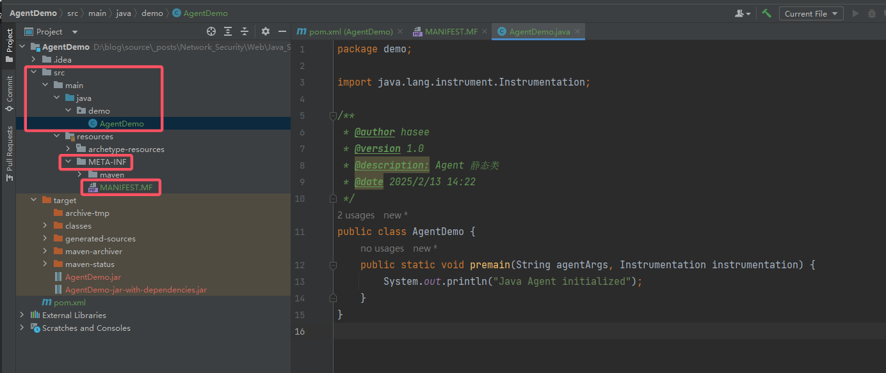

# Java Agent 内存马

1. 参考：

    > https://lotabout.me/2024/Java-Agent-101/
    > https://juejin.cn/post/7157684112122183693
    > https://www.cnblogs.com/jingzh/p/18535625
    > https://su18.org/post/irP0RsYK1/
    > https://yuanjava.com/java-agent/
    > 学习路线参考：
    > https://edu.51cto.com/course/30137.html

## 1. Java Agent 知识点

### 1.1 Java Agent 介绍

1. Java Agent 是一种用于在 Java 应用**启动或运行过程中**对其进行监控、修改或增强的机制。它利用 `Java Instrumentation API`，可以在应用启动时或运行中动态加载代码，对目标应用的字节码进行操作。这种机制非常适合应用监控、性能分析、调试、代码注入和安全性增强等任务。
    简单来说，Java Agent 就是运行在 Java 虚拟机（JVM）上的一种工具，能在程序运行时对其进行监控、修改甚至重定义。它的作用和 AOP（面向切面编程）有点类似，但更加底层，直接作用在 JVM 层面。可以理解为它是全局的 AOP，能在类加载、方法执行等时刻动态插手程序行为。
    通俗来讲，Java 提供了**动态修改字节码**的能力，而 Java Agent 提供了外挂修改的能力，**能不动已有的 jar 包，在运行时动态修改 jar 内的字节码。**
2. Java Agent 和代理很像，但是它主要是通过修改**类字节码**的方式，相比于 Java 动态代理和 CGLIB 代理，它更底层，不需要在代码中显式调用代理方法。
    同时 Java Agent 技术在应用启动或运行时注入代理逻辑的同时，**不需要修改原始代码**。
    最后就是 Java Agent 的作用范围最广，能应用于**整个 JVM 中加载的类**。
3. Java Agent 的核心原理是通过 Java Instrumentation API 提供的机制，在类加载时或运行时动态修改字节码。这里主要涉及到以下几个技术点：
    1. `Instrumentation` 接口
    2. `PreMain()` 和 `AgentMain()`。

### 1.2 Java Agent 基本流程和模式

1. 基本流程大致为：

    1. 创建代理类：编写一个含有 `premain` 或 `agentmain` 方法的代理类。premain 用于在应用启动时加载，agentmain 用于在应用运行时动态附加。
    2. 实现字节码操作：在代理类中，通过 `Instrumentation` 对象，可以拦截和修改字节码，比如用 Java ASM 或 Javassist 等字节码工具来修改类文件。
    3. 打包和运行：将代理类打包为 jar 并设置清单文件中的 Premain-Class 或 Agent-Class 属性，使 Java 在启动时加载该代理。

    许多名词看不懂没关系，接下来会涉及到。

2. 先来看 Java Agent 的模式，上文提到 `PreMain()` 和 `AgentMain()`。

    1. `Premain`模式：在程序**启动前**就能注入。
        这种模式通常是我们在程序启动时就注入 `Agent`，常见于应用启动时的初始化操作。
        例如：在程序启动时，配置一些监控、日志、性能分析工具。通过这种方式，Agent 可以在应用的生命周期中，从一开始就进行干预。
        使用场景：初始化操作、性能监控、日志收集等。
    2. `Agentmain`模式：动态注入`Agent`。
        这种模式是指在程序启动后，动态地将 `Agent` 注入到正在运行的 `JVM` 中。在主程序已经启动并且运行的过程中，也可以通过一些工具（比如 attach API）把 Agent 加入到 JVM 中。
        这种方式主要用于热更新和动态调试。
        使用场景：热部署、动态调整配置、动态监控等。

### 1.3 Agent Demo - Agent 项目创建 -- 静态 Agent

1. 首先需要准备两个项目，一个项目是 Agent，还有一个是用于测试的项目。

2. 用 Maven 新建一个最基本的项目（不一定是 Webapp，最基本的就行），同时修改其 pom.xml 为（关键点在于打包的部分）：
    ```xml
    <project xmlns="http://maven.apache.org/POM/4.0.0" xmlns:xsi="http://www.w3.org/2001/XMLSchema-instance"
      xsi:schemaLocation="http://maven.apache.org/POM/4.0.0 http://maven.apache.org/maven-v4_0_0.xsd">
      <modelVersion>4.0.0</modelVersion>
      <groupId>org.example</groupId>
      <artifactId>AgentDemo</artifactId>
      <version>1.0-SNAPSHOT</version>
      <name>AgentDemo</name>
      <url>http://maven.apache.org</url>
    
      <dependencies>
        <!-- https://mvnrepository.com/artifact/org.ow2.asm/asm -->
        <dependency>
          <groupId>org.ow2.asm</groupId>
          <artifactId>asm</artifactId>
          <version>9.7</version>
        </dependency>
        <!-- https://mvnrepository.com/artifact/org.javassist/javassist -->
        <dependency>
          <groupId>org.javassist</groupId>
          <artifactId>javassist</artifactId>
          <version>3.29.2-GA</version>
        </dependency>
      </dependencies>
    
      <build>
        <plugins>
          <plugin>
            <!-- 指定打包插件：assembly 定制化打包方式 -->
            <groupId>org.apache.maven.plugins</groupId>
            <artifactId>maven-assembly-plugin</artifactId>
            <version>3.6.0</version>
            <!-- 打包的一些配置 -->
            <configuration>
              <!-- 官方提供的定制化打包方式 -->
              <descriptorRefs>
                <descriptorRef>
                  jar-with-dependencies
                </descriptorRef>
              </descriptorRefs>
              <archive>
                <!-- Agent 的相关配置文件，也可以使用 <manifestEntries> 标签指定 -->
                <manifestFile>
                  src/main/resources/META-INF/MANIFEST.MF
                </manifestFile>
                <!-- 设置 manifest 配置-->
                <!-- <manifestEntries> -->
                  <!--Premain-Class: 代表 Agent 静态加载时会调用的类全路径名。-->
                  <!-- <Premain-Class>demo.AgentDemo</Premain-Class> -->
                  <!--Agent-Class: 代表 Agent 动态加载时会调用的类全路径名。-->
                  <!-- <Agent-Class>???</Agent-Class> -->
                  <!--Can-Redefine-Classes: 是否可进行类定义。-->
                  <!-- <Can-Redefine-Classes>true</Can-Redefine-Classes> -->
                  <!--Can-Retransform-Classes: 是否可进行类转换。-->
                  <!-- <Can-Retransform-Classes>true</Can-Retransform-Classes> -->
                <!-- </manifestEntries> -->
              </archive>
            </configuration>
            <executions>
              <execution>
                <!-- 绑定到 package 的生命周期 -->
                <phase>package</phase>
                <goals>
                  <goal>single</goal>
                </goals>
              </execution>
            </executions>
          </plugin>
        </plugins>
        <finalName>AgentDemo</finalName>
      </build>
    </project>
    ```

    关键点在于打包的插件：maven-assembly-plugin，其相关的知识点可以参考：

    > https://segmentfault.com/a/1190000016237395#item-4

    上述的配置方式涉及到 Agent 的相关配置清单文件 MANIFEST.MF，详细如下：
    ```makefile
    Manifest-Version: 1.0
    Premain-Class: demo.AgentDemo      # 静态加载(premain) Agent 时的入口类
    Agent-Class: ???                   # 动态加载(agentmain) Agent 时的入口类
    Can-Redefine-Classes: true         # 该 Agent 能否重新定义类
    Can-Retransform-Classes: true      # 该 Agent 能否修改已有类
    Can-Set-Native-Method-Prefix: true # 是否允许修改 Native 方法的前缀
    
    ```

    上述配置文件中还指定了 MANIFEST.MF 的位置，要注意对应。

3. 先从静态 `Premain` 说起，创建 Agent 类：
    ```java
    package demo;
    
    import java.lang.instrument.Instrumentation;
    
    /**
     * @author hasee
     * @version 1.0
     * @description: Agent 静态类
     * @date 2025/2/13 14:22
     */
    public class AgentDemo {
        // 一定要有该方法
        public static void premain(String agentArgs, Instrumentation instrumentation) {
            System.out.println("Java Agent initialized");
        }
    }
    ```

    附上一张此时项目的图片：
    

4. 使用 Maven 将项目打包，此时生成 jar 包：
    

5. 新建测试项目，很简单的 Hello World，但是需要对其添加 VM Options：
    
    具体内容为：
    `-javaagent:Agent Jar 包所在路径`。

6. 运行测试项目，可以看到 Agent 发挥作用：
    

### 1.4 Agent Demo - Agent 项目创建 -- 动态 Agent

1. 对于动态 `Agentmain`，需要添加一个**中间人**，这个中间人借助 Attach API 将 Agent 与测试类绑定。相对于静态，其不需要借助参数 `-javaagent`。

2. 先给 Agent 添加 `agentmain`：

    ```java
    package demo;
    
    import java.lang.instrument.Instrumentation;
    
    /**
     * @author hasee
     * @version 1.0
     * @description: Agent
     * @date 2025/2/13 14:22
     */
    public class AgentDemo {
        public static void premain(String agentArgs, Instrumentation instrumentation) {
            System.out.println("Java Agent initialized");
        }
        // 主要是这个
        public static void agentmain(String agentArgs, Instrumentation instrumentation) {
            System.out.println("AgentMain initialized");
        }
    }
    ```

    同时别忘了修改 MANIFEST.MF：
    ```makefile
    Manifest-Version: 1.0
    Premain-Class: demo.AgentDemo
    Agent-Class: demo.AgentDemo
    Can-Redefine-Classes: true
    Can-Retransform-Classes: true
    Can-Set-Native-Method-Prefix: true
    
    ```

3. 中间人可以新建一个项目，不过也可以在测试类中创建中间人（用一个类）。因此测试类中要引入 Attach API：

    ```xml
    <!-- 引入 Attach API -->
    <dependency>
        <groupId>com.sun</groupId>
        <artifactId>tools</artifactId>
        <version>1.8</version>
        <scope>system</scope>
        <systemPath>${java.home}/../lib/tools.jar</systemPath>
    </dependency>
    ```

    引入之后，创建中间人类：
    ```java
    package demo;
    
    import com.sun.tools.attach.VirtualMachine;
    
    /**
     * @author hasee
     * @version 1.0
     * @description: 中间人类，调用 Attach API 的类
     * @date 2025/2/13 18:10
     */
    public class AgentStart {
        public static void main(String[] args) throws Exception {
            // 获取目标 JVM 的进程 ID（外部指定）
            String pid = "16580";
            // Agent Jar 包路径
            String agentJarPath = "D:\\blog\\source\\_posts\\Network_Security\\Web\\Java_Security\\Memory-Trojan-Java\\range\\AgentDemo\\target\\AgentDemo-jar-with-dependencies.jar";
            // 根据 PID 获取对应的虚拟机 JVM
            VirtualMachine virtualMachine = VirtualMachine.attach(pid);
            // 向 JVM 注入 Agent
            virtualMachine.loadAgent(agentJarPath);
            // 断开连接
            virtualMachine.detach();
        }
    }
    ```
    
4. 测试类修改一下，跑一个耗时的线程：
    ```java
    package demo;
    
    import java.lang.management.ManagementFactory;
    
    /**
     * @author hasee
     * @version 1.0
     * @description: 测试类
     * @date 2025/2/13 15:37
     */
    public class HelloWorld {
        public static void main(String[] args) throws InterruptedException {
            System.out.println("Hello World!");
            // 获取到当前进程的 PID
            String name = ManagementFactory.getRuntimeMXBean().getName();
            String pid = name.split("@")[0];
            // 指定一个长时间任务，保证项目在运行
            for (int i = 0; i < 1000; i++) {
                System.out.println("running! PID is " + pid);
                Thread.sleep(5000);
            }
        }
    }
    ```

5. 启动！可以观察结果：
    

### 1.5 Instrumentation 接口

1. 上述的项目演示了 Agent 如“外挂”一样的作用，接下来就要学习更高阶的功能。
2. `java.lang.instrument` 下存放了 `Instrumentation` 的相关源码：
    

#### 1.5.1 `IllegalClassFormatException` 异常类

1. 此异常为非法的字节码格式化异常，由`ClassFileTransformer.transform()` 的实现抛出。
2. 抛出此异常的原因是由于初始类文件字节无效，或者由于以前应用的转换损坏了字节码。

#### 1.5.2 `UnmodifiableClassException` 异常类

1. 当程序无法修改制定的类时，会抛出该异常。由 `Instrumentation.redefineClasses()` 的实现抛出。

#### 1.5.3 ClassDefinition 绑定/定义类

1. 类不长，直接复制下来分析：
    ```java
    package java.lang.instrument;
    
    /**
     * This class serves as a parameter block to the <code>Instrumentation.redefineClasses</code> method.
     * Serves to bind the <code>Class</code> that needs redefining together with the new class file bytes.
     * 该类主要作为一个参数块，用于 Instrumentation.redefineClasses() 方法
     *
     * @see     java.lang.instrument.Instrumentation#redefineClasses
     * @since   1.5
     */
    public final class ClassDefinition {
        /**
         *  The class to redefine
         *  待重定义的类
         */
        private final Class<?> mClass;
    
        /**
         *  The replacement class file bytes
         *  被替换目标 class 的 bytes file
         */
        private final byte[]   mClassFile;
    
        /**
         *  Creates a new <code>ClassDefinition</code> binding using the supplied
         *  class and class file bytes. Does not copy the supplied buffer, just captures a reference to it.
         *  构造方法，根据提供的类和类字节文件创建一个新的 ClassDefinition 绑定。实现时没有拷贝提供的 buffer，仅仅只是获取它的一个引用。
         *
         * @param theClass the <code>Class</code> that needs redefining
         * @param theClassFile the new class file bytes
         *
         * @throws java.lang.NullPointerException if the supplied class or array is <code>null</code>.
         */
        public
        ClassDefinition(    Class<?> theClass,
                            byte[]  theClassFile) {
            if (theClass == null || theClassFile == null) {
                throw new NullPointerException();
            }
            mClass      = theClass;
            mClassFile  = theClassFile;
        }
    
        /**
         * Returns the class.
         *
         * @return    the <code>Class</code> object referred to.
         */
        public Class<?>
        getDefinitionClass() {
            return mClass;
        }
    
        /**
         * Returns the array of bytes that contains the new class file.
         *
         * @return    the class file bytes.
         */
        public byte[]
        getDefinitionClassFile() {
            return mClassFile;
        }
    }
    ```

#### 1.5.4 `ClassFileTransformer` 接口

1. 这个接口比较简单，但是注释也很多，部分重要翻译如下：
    ```java
    package java.lang.instrument;
    
    import  java.security.ProtectionDomain;
    
    /**
     * An agent provides an implementation of this interface in order
     * to transform class files.
     * The transformation occurs before the class is defined by the JVM.
     * 一个 Agent 需要实现这个接口以完成 class file 的转换
     * ...
     *
     * @see     java.lang.instrument.Instrumentation
     * @see     java.lang.instrument.Instrumentation#addTransformer
     * @see     java.lang.instrument.Instrumentation#removeTransformer
     * @since   1.5
     */
    
    public interface ClassFileTransformer {
        /**
         * The implementation of this method may transform the supplied class file and
         * return a new replacement class file.
         *
         * <P>
         * There are two kinds of transformers, determined by the <code>canRetransform</code>
         * parameter of
         * {@link java.lang.instrument.Instrumentation#addTransformer(ClassFileTransformer,boolean)}:
         *  <ul>
         *    <li><i>retransformation capable</i> transformers that were added with
         *        <code>canRetransform</code> as true
         *    </li>
         *    <li><i>retransformation incapable</i> transformers that were added with
         *        <code>canRetransform</code> as false or where added with
         *        {@link java.lang.instrument.Instrumentation#addTransformer(ClassFileTransformer)}
         *    </li>
         *  </ul>
         *
         * <P>
         * 有两种 transformer，通过 `java.lang.instrument.Instrumentation#addTransformer(ClassFileTransformer,boolean)` 的第二个参数 `canRetransform` 来区分。
         *  true 表示有 retransformation 能力的 transformer；同样的，false 表示没有。
         *
         * Once a transformer has been registered with
         * {@link java.lang.instrument.Instrumentation#addTransformer(ClassFileTransformer,boolean)
         * addTransformer},
         * the transformer will be called for every new class definition and every class redefinition.
         * Retransformation capable transformers will also be called on every class retransformation.
         * The request for a new class definition is made with
         * {@link java.lang.ClassLoader#defineClass ClassLoader.defineClass}
         * or its native equivalents.
         * The request for a class redefinition is made with
         * {@link java.lang.instrument.Instrumentation#redefineClasses Instrumentation.redefineClasses}
         * or its native equivalents.
         * The request for a class retransformation is made with
         * {@link java.lang.instrument.Instrumentation#retransformClasses Instrumentation.retransformClasses}
         * or its native equivalents.
         * The transformer is called during the processing of the request, before the class file bytes
         * have been verified or applied.
         * When there are multiple transformers, transformations are composed by chaining the
         * <code>transform</code> calls.
         * That is, the byte array returned by one call to <code>transform</code> becomes the input
         * (via the <code>classfileBuffer</code> parameter) to the next call.
         * 重要的地方粗略翻译一下：通过 `Instumentation.addTransformer()` 来注册 transformer。每一次 transform 或 retransform，都会调用 transformer 或 retransformer。通过 `ClassLoader.defineClass()` 或 `Instrumentation.redefineClasses()` 或等同的原生方法来发起 class definition 或者 redefinition。
         * 
         * <P>
         * Transformations are applied in the following order:
         *  <ul>
         *    <li>Retransformation incapable transformers
         *    </li>
         *    <li>Retransformation incapable native transformers
         *    </li>
         *    <li>Retransformation capable transformers
         *    </li>
         *    <li>Retransformation capable native transformers
         *    </li>
         *  </ul>
         *
         * <P>
         * For retransformations, the retransformation incapable transformers are not
         * called, instead the result of the previous transformation is reused.
         * In all other cases, this method is called.
         * Within each of these groupings, transformers are called in the order registered.
         * Native transformers are provided by the <code>ClassFileLoadHook</code> event
         * in the Java Virtual Machine Tool Interface).
         *
         * <P>
         * The input (via the <code>classfileBuffer</code> parameter) to the first
         * transformer is:
         *  <ul>
         *    <li>for new class definition,
         *        the bytes passed to <code>ClassLoader.defineClass</code>
         *    </li>
         *    <li>for class redefinition,
         *        <code>definitions.getDefinitionClassFile()</code> where
         *        <code>definitions</code> is the parameter to
         *        {@link java.lang.instrument.Instrumentation#redefineClasses
         *         Instrumentation.redefineClasses}
         *    </li>
         *    <li>for class retransformation,
         *         the bytes passed to the new class definition or, if redefined,
         *         the last redefinition, with all transformations made by retransformation
         *         incapable transformers reapplied automatically and unaltered;
         *         for details see
         *         {@link java.lang.instrument.Instrumentation#retransformClasses
         *          Instrumentation.retransformClasses}
         *    </li>
         *  </ul>
         *
         * <P>
         * If the implementing method determines that no transformations are needed,
         * it should return <code>null</code>.
         * Otherwise, it should create a new <code>byte[]</code> array,
         * copy the input <code>classfileBuffer</code> into it,
         * along with all desired transformations, and return the new array.
         * The input <code>classfileBuffer</code> must not be modified.
         *
         * <P>
         * In the retransform and redefine cases,
         * the transformer must support the redefinition semantics:
         * if a class that the transformer changed during initial definition is later
         * retransformed or redefined, the
         * transformer must insure that the second class output class file is a legal
         * redefinition of the first output class file.
         *
         * <P>
         * If the transformer throws an exception (which it doesn't catch),
         * subsequent transformers will still be called and the load, redefine
         * or retransform will still be attempted.
         * Thus, throwing an exception has the same effect as returning <code>null</code>.
         * To prevent unexpected behavior when unchecked exceptions are generated
         * in transformer code, a transformer can catch <code>Throwable</code>.
         * If the transformer believes the <code>classFileBuffer</code> does not
         * represent a validly formatted class file, it should throw
         * an <code>IllegalClassFormatException</code>;
         * while this has the same effect as returning null. it facilitates the
         * logging or debugging of format corruptions.
         *
         * @param loader                the defining loader of the class to be transformed,
         *                              may be <code>null</code> if the bootstrap loader    定义要转换的类加载器；如果是引导加载器，则为 null
         * @param className             the name of the class in the internal form of fully
         *                              qualified class and interface names as defined in
         *                              <i>The Java Virtual Machine Specification</i>.
         *                              For example, <code>"java/util/List"</code>.    类名,如:java/lang/Runtime
         * @param classBeingRedefined   if this is triggered by a redefine or retransform,
         *                              the class being redefined or retransformed;
         *                              if this is a class load, <code>null</code>    如果是被重定义或重转换触发，则为重定义或重转换的类；如果是类加载，则为 null
         * @param protectionDomain      the protection domain of the class being defined or redefined     要定义或重定义的类的保护域
         * @param classfileBuffer       the input byte buffer in class file format - must not be modified    类文件格式的输入字节缓冲区（不得修改）
         *
         * @throws IllegalClassFormatException if the input does not represent a well-formed class file
         * @return  a well-formed class file buffer (the result of the transform),
                    or <code>null</code> if no transform is performed.
         * @see Instrumentation#redefineClasses    返回一个通过 ASM 修改后添加了防御代码的字节码 byte 数组。
         */
        byte[]
        transform(  ClassLoader         loader,
                    String              className,
                    Class<?>            classBeingRedefined,
                    ProtectionDomain    protectionDomain,
                    byte[]              classfileBuffer)
            throws IllegalClassFormatException;
    }
    ```

2. su18 师傅给出了重写 `transform()` 的一些注意事项：

    > 1. ClassLoader 如果是被 Bootstrap ClassLoader (引导类加载器)所加载那么 loader 参数的值是空。
    > 2. 修改类字节码时需要特别注意插入的代码在对应的 ClassLoader 中可以正确的获取到，否则会报 ClassNotFoundException ，比如修改 java.io.FileInputStream (该类由 Bootstrap ClassLoader 加载)时插入了我们检测代码，那么我们将必须保证 FileInputStream 能够获取到我们的检测代码类。
    > 3. JVM 类名的书写方式路径方式：`java/lang/String` 而不是我们常用的类名方式：`java.lang.String`。
    > 4. 类字节必须符合 JVM 校验要求，如果无法验证类字节码会导致 JVM 崩溃或者 VerifyError (类验证错误)。
    > 5. 如果修改的是 retransform 类(修改已被 JVM 加载的类)，修改后的类字节码不得新增方法、修改方法参数、类成员变量。
    > 6. addTransformer 时如果没有传入 retransform 参数(默认是 false )，就算 MANIFEST.MF 中配置了 `Can-Redefine-Classes: true` 而且手动调用了`retransformClasses()`方法也一样无法 retransform。
    > 7. 卸载 transform 时需要使用创建时的 Instrumentation 实例。

3. 此外，在以下三种情形下 `ClassFileTransformer.transform()` 会被执行：

    1. 新的 class 被加载。
    2. `Instrumentation.redefineClasses()` 显式调用。
    3. `addTransformer` 第二个参数为 true 时，`Instrumentation.retransformClasses()` 显式调用。

#### 1.5.5 `Instrumentation` 接口

1. `Instrumentation` 是 Java 提供的 JVM 接口，该接口提供了一系列查看和操作 Java 类定义的方法，例如修改类的字节码、向 classLoader 的 classpath 下加入 jar 文件等。使得开发者可以通过 Java 语言来操作和监控 JVM 内部的一些状态，进而实现 Java 程序的监控分析，甚至实现一些特殊功能（如 AOP、热部署）。

2. 相关方法如下：
    | 类方法                                                       | 功能                                                         |
    | ------------------------------------------------------------ | ------------------------------------------------------------ |
    | `void addTransformer(ClassFileTransformer transformer, boolean canRetransform)` | 添加一个 Transformer，是否允许 reTransformer                 |
    | `void addTransformer(ClassFileTransformer transformer)`      | 添加一个 Transformer                                         |
    | `boolean removeTransformer(ClassFileTransformer transformer)` | 移除一个 Transformer                                         |
    | `boolean isRetransformClassesSupported()`                    | 检测是否允许 reTransformer                                   |
    | `void retransformClasses(Class<?>... classes)`               | 重加载（retransform）类                                      |
    | `boolean isModifiableClass(Class<?> theClass)`               | 确定一个类是否可以被 retransformation 或 redefinition 修改   |
    | `Class[] getAllLoadedClasses()`                              | 获取 JVM 当前加载的所有类                                    |
    | `Class[] getInitiatedClasses(ClassLoader loader)`            | 获取指定类加载器下所有已经初始化的类                         |
    | `long getObjectSize(Object objectToSize)`                    | 返回指定对象大小                                             |
    | `void appendToBootstrapClassLoaderSearch(JarFile jarfile)`   | 添加到 BootstrapClassLoader 搜索                             |
    | `void appendToSystemClassLoaderSearch(JarFile jarfile)`      | 添加到 SystemClassLoader 搜索                                |
    | `boolean isNativeMethodPrefixSupported()`                    | 是否支持设置 native 方法 Prefix                              |
    | `void setNativeMethodPrefix(ClassFileTransformer transformer, String prefix)` | 通过允许重试，将前缀应用到名称，此方法修改本机方法解析的失败处理 |
    | `boolean isRedefineClassesSupported()`                       | 是否支持类 redefine                                          |
    | `void redefineClasses(ClassDefinition... definitions)`       | 重定义（redefine）类                                         |
    
3. 相关原理：

    > instrument 的底层实现依赖于 JVMTI（JVM Tool Interface） ，它是 JVM 暴露出来的一些供用户扩展的接口集合。 JVMTI 是基于**事件驱动**的， JVM 每执行到一定的逻辑就会调用一些事件的回调接口（如果有的话），这些接口可以供开发者去扩展自己的逻辑。 JVMTIAgent 是一个利用 JVMTI 暴露出来的接口提供了代理**启动时**加载(agent on load)、代理**通过 attach 形式**加载(agent on attach)和代理**卸载(agent on unload)功能**的动态库。而 instrument agent 可以理解为一类 JVMTIAgent 动态库，别名是 JPLISAgent (Java Programming Language Instrumentation Services Agent)，也就是专门为 Java 语言编写的插桩服务提供支持的代理。

### 1.6 Instrumentation 例子 -- 以动态 Agent 为例（别忘了修改配置文件 MANIFEST.MF）

1. 根据上述所学知识，先创建一个 Transformer 来修改类的字节码：
    ```java
    package transformer;
    
    import java.lang.instrument.ClassFileTransformer;
    import java.lang.instrument.IllegalClassFormatException;
    import java.security.ProtectionDomain;
    import java.util.Arrays;
    
    /**
     * @author EndlessShw
     * @version 1.0
     * @description: 演示的 Transformer
     * @date 2025/2/17 16:35
     */
    public class MyTransformer implements ClassFileTransformer {
    
        @Override
        public byte[] transform(ClassLoader loader, String className, Class<?> classBeingRedefined, ProtectionDomain protectionDomain, byte[] classfileBuffer) throws IllegalClassFormatException {
            // 将常用的类名转换为 JVM 认识的类名
            className = className.replace("/", ".");
            if (className.equals("demo.HelloWorld")) {
                return replaceBytes(className, classfileBuffer);
            }
            return classfileBuffer;
        }
    
        /**
         * 将输出的 pid 改成别的内容
         *
         * @param className 目标 className
         * @param classfileBuffer 目标的 classfileBuffer
         * @return
         */
        private byte[] replaceBytes(String className, byte[] classfileBuffer) {
            // 先将类字节码转换成 byte 字符串
            String classfileStr = Arrays.toString(classfileBuffer);
            System.out.println(className + " 类替换前的字节码为： " + classfileStr);
            // 去除数组转字符串中的中括号
            classfileStr = classfileStr.replace("[", "").replace("]", "");
    
            // 被替换的内容
            byte[] contents = "Welcome Admin!".getBytes();
            String contentStr = Arrays.toString(contents).replace("[", "").replace("]", "");
            // 替换的内容
            byte[] replacements = "Welcome Hack!!".getBytes();
            String replacementStr = Arrays.toString(replacements).replace("[", "").replace("]", "");
    
            // 进行替换
            classfileStr = classfileStr.replace(contentStr, replacementStr);
    
            // 切割替换后的 byte 字符串
            String[] byteArray = classfileStr.split("\\s*,\\s*");
            // 创建新的 byte 数组，存放替换后的二进制
            byte[] bytes = new byte[byteArray.length];
            // 将 byte 字符串转换成 byte
            for (int i = 0; i < byteArray.length; i++) {
                bytes[i] = Byte.parseByte(byteArray[i]);
            }
    
            System.out.println(className + " 类替换后的字节码为： " + Arrays.toString(bytes));
            return bytes;
        }
    }
    ```

2. 测试类如下：
    ```java
    package demo;
    
    import java.lang.management.ManagementFactory;
    
    /**
     * @author hasee
     * @version 1.0
     * @description: 测试类
     * @date 2025/2/13 15:37
     */
    public class HelloWorld {
        public static void main(String[] args) throws InterruptedException {
            System.out.println("Hello World!");
            // 获取到当前进程的 PID
            String name = ManagementFactory.getRuntimeMXBean().getName();
            String pid = name.split("@")[0];
            // 指定一个长时间任务，保证项目在运行
            for (int i = 0; i < 1000; i++) {
                System.out.println("running! PID is " + pid);
                sayHello();
                Thread.sleep(5000);
            }
        }
    
        private static void sayHello() {
            System.out.println("Welcome Admin!");
        }
    }
    ```

3. 运行中间人程序：
    ```java
    package demo;
    
    import com.sun.tools.attach.VirtualMachine;
    
    /**
     * @author hasee
     * @version 1.0
     * @description: 中间人类，调用 Attach API 的类
     * @date 2025/2/13 18:10
     */
    public class AgentStart {
        public static void main(String[] args) throws Exception {
            // 获取目标 JVM 的进程 ID（外部指定）
            String pid = "12408";
            // Agent Jar 包路径
            String agentJarPath = "D:\\blog\\source\\_posts\\Network_Security\\Web\\Java_Security\\Memory-Trojan-Java\\range\\AgentDemo\\target\\AgentDemo-jar-with-dependencies.jar";
            // 根据 PID 获取对应的虚拟机 JVM
            VirtualMachine virtualMachine = VirtualMachine.attach(pid);
            // 向 JVM 注入 Agent
            virtualMachine.loadAgent(agentJarPath);
            // 断开连接
            virtualMachine.detach();
        }
    }
    ```

4. 结果如下：
    

5. 可以看到，这里将类字节码转换为 byte 字符串，并进行字符串查找，替换后再转回 byte，这里为了演示是一种取巧的方式，在实际项目中将使用 ASM 或 javassist 等对类字节码进行处理。
