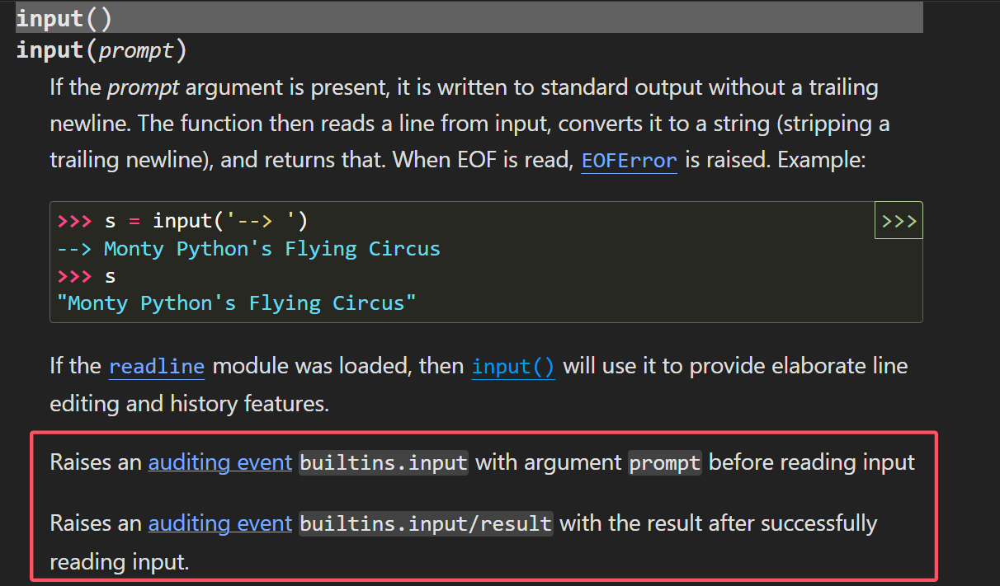
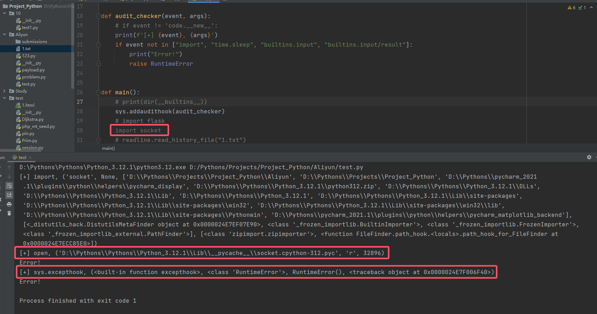

# Python Audit Hook 绕过探究与总结

1. 今年 Aliyun CTF 遇到了 Audit Hook，有些细枝末节的问题有待思考与总结。

2. 相关的引入详见上一篇文章。本文主要针对白名单逃逸进行总结。

3. 参考：

    > https://dummykitty.github.io/python/2023/05/30/pyjail-bypass-07-%E7%BB%95%E8%BF%87-audit-hook.html
    > https://xz.aliyun.com/news/17029?time__1311=eqUxn7DQoYqGT4mqGXnj7KqqAK0QCrztCH4D&u_atoken=89e8e0296146d2993ccdb4b096b74573&u_asig=0a47319217411453591374590e0045

## 1. 审计事件

1. 有关审计事件的分类，其实官方给出了一个表：

    > https://docs.python.org/3/library/audit_events.html#audit-events

2. 具体事件的查看，例如以 `builtins.input/result` 为例，官方给出了一些说明：
    

## 2. 调试技巧

1. 在给定的 hook 函数前将参数打印即可看到其触发审计的事件：
    ```python
    def audit_checker(event, args):
        # 审计代码
        print(f'[+] {event}, {args}')
        # 白名单
        if event not in ["import", "time.sleep", "builtins.input", "builtins.input/result"]:
            print("Error!")
            raise RuntimeError
    ```

2. 结果可以看一下：
    
    可以看到，在引入模块 socket 后，`import` 底层触发了 `open()` 事件（也可以说是调用了 `open()`)，同时打印了当时的事件参数。

## 3. `import`

1. DumKiy 师傅给出了 `__loader__.load_module('模块')` 来绕过 `import` 白名单，但是其中有两个问题需要关注一下：

    1. 其提到的 built-in module 有哪些？在做题中必然要判断哪些模块是内部模块，这样才方便从这些内部模块中寻找突破口。（**注意，Linux 和 Windows 下内部模块有些许变化，做题需要注意！**）
    2. `import` 在导入大部分外部模块（和部分内部模块）时是会触发 `open`、`exec`、`compile` 等事件的，这时也需要进行额外的筛选。

2. 首先是确定内部类，哪些是内部类呢？在 DumKiy 师傅提到的情况下，个人这里写了一个脚本来进行筛选：
    ```python
    # -*- encoding: utf-8 -*-
    """
    @File    : Get_Builtin.py
    @Time    : 2025/3/5 16:57
    @Author  : EndlessShw
    @Email   : 1502309758@qq.com
    @Software: PyCharm
    """
    import pkgutil
    import sys
    
    def list_all_modules():
        all_modules = []
        for module_info in pkgutil.iter_modules():
            all_modules.append(module_info.name)
        return all_modules
    
    
    modules = list_all_modules()
    builtin = []
    non_builtin = []
    
    # for module_name, module_obj in sys.modules.items():
    for module_name in modules:
        try:
            __builtins__.__loader__.load_module(module_name)
            builtin.append(module_name)
        except ImportError:
            # print("{} is not builtin Module".format(module_name))
            non_builtin.append(module_name)
            pass
    
    for module_name in sys.builtin_module_names:
        try:
            __builtins__.__loader__.load_module(module_name)
            builtin.append(module_name)
        except ImportError:
            # print("{} is not builtin Module".format(module_name))
            print("{} is not builtin Module".format(module_name))
            non_builtin.append(module_name)
            pass
    print(builtin)
    print(non_builtin)
    
    # 在 Windows 下，Python 3.12.1 的版本结果如下：
    
    D:\Pythons\Projects\Project_Python\Aliyun\Get_Builtin.py:35: DeprecationWarning: 'audioop' is deprecated and slated for removal in Python 3.13
      __builtins__.__loader__.load_module(module_name)
    ['_collections_abc', '_sitebuiltins', '_weakrefset', 'abc', 'ast', 'codecs', 'collections', 'contextlib', 'copyreg', 'dis', 'encodings', 'enum', 'functools', 'genericpath', 'importlib', 'inspect', 'io', 'keyword', 'linecache', 'ntpath', 'opcode', 'operator', 'os', 'pkgutil', 're', 'reprlib', 'site', 'stat', 'textwrap', 'token', 'tokenize', 'traceback', 'types', 'typing', 'warnings', 'weakref', 'zipimport', '_distutils_hack', 'pywin32_bootstrap', 'sitecustomize', '_abc', '_ast', '_bisect', '_blake2', '_codecs', '_codecs_cn', '_codecs_hk', '_codecs_iso2022', '_codecs_jp', '_codecs_kr', '_codecs_tw', '_collections', '_contextvars', '_csv', '_datetime', '_functools', '_heapq', '_imp', '_io', '_json', '_locale', '_lsprof', '_md5', '_multibytecodec', '_opcode', '_operator', '_pickle', '_random', '_sha1', '_sha2', '_sha3', '_signal', '_sre', '_stat', '_statistics', '_string', '_struct', '_symtable', '_thread', '_tokenize', '_tracemalloc', '_typing', '_warnings', '_weakref', '_winapi', '_xxinterpchannels', '_xxsubinterpreters', 'array', 'atexit', 'audioop', 'binascii', 'builtins', 'cmath', 'errno', 'faulthandler', 'gc', 'itertools', 'marshal', 'math', 'mmap', 'msvcrt', 'nt', 'sys', 'time', 'winreg', 'xxsubtype', 'zlib']
    # 开头有一些本地创建的，请忽略
    ['123', 'Get_Builtin', 'payload', 'problem', 'test', '10', 'Aliyun', 'Study', '第三天', '第二天', 'datalore', '_asyncio', '_bz2', '_ctypes', '_ctypes_test', '_decimal', '_elementtree', '_hashlib', '_lzma', '_msi', '_multiprocessing', '_overlapped', '_queue', '_socket', '_sqlite3', '_ssl', '_testbuffer', '_testcapi', '_testclinic', '_testconsole', '_testimportmultiple', '_testinternalcapi', '_testmultiphase', '_testsinglephase', '_tkinter', '_uuid', '_wmi', '_zoneinfo', 'pyexpat', 'select', 'unicodedata', 'winsound', '__future__', '__hello__', '__phello__', '_aix_support', '_compat_pickle', '_compression', '_markupbase', '_osx_support', '_py_abc', '_pydatetime', '_pydecimal', '_pyio', '_pylong', '_strptime', '_threading_local', 'aifc', 'antigravity', 'argparse', 'asyncio', 'base64', 'bdb', 'bisect', 'bz2', 'cProfile', 'calendar', 'cgi', 'cgitb', 'chunk', 'cmd', 'code', 'codeop', 'colorsys', 'compileall', 'concurrent', 'configparser', 'contextvars', 'copy', 'crypt', 'csv', 'ctypes', 'curses', 'dataclasses', 'datetime', 'dbm', 'decimal', 'difflib', 'doctest', 'email', 'ensurepip', 'filecmp', 'fileinput', 'fnmatch', 'fractions', 'ftplib', 'getopt', 'getpass', 'gettext', 'glob', 'graphlib', 'gzip', 'hashlib', 'heapq', 'hmac', 'html', 'http', 'idlelib', 'imaplib', 'imghdr', 'ipaddress', 'json', 'lib2to3', 'locale', 'logging', 'lzma', 'mailbox', 'mailcap', 'mimetypes', 'modulefinder', 'msilib', 'multiprocessing', 'netrc', 'nntplib', 'nturl2path', 'numbers', 'optparse', 'pathlib', 'pdb', 'pickle', 'pickletools', 'pipes', 'platform', 'plistlib', 'poplib', 'posixpath', 'pprint', 'profile', 'pstats', 'pty', 'py_compile', 'pyclbr', 'pydoc', 'pydoc_data', 'queue', 'quopri', 'random', 'rlcompleter', 'runpy', 'sched', 'secrets', 'selectors', 'shelve', 'shlex', 'shutil', 'signal', 'smtplib', 'sndhdr', 'socket', 'socketserver', 'sqlite3', 'sre_compile', 'sre_constants', 'sre_parse', 'ssl', 'statistics', 'string', 'stringprep', 'struct', 'subprocess', 'sunau', 'symtable', 'sysconfig', 'tabnanny', 'tarfile', 'telnetlib', 'tempfile', 'this', 'threading', 'timeit', 'tkinter', 'tomllib', 'trace', 'tracemalloc', 'tty', 'turtle', 'turtledemo', 'unittest', 'urllib', 'uu', 'uuid', 'venv', 'wave', 'webbrowser', 'wsgiref', 'xdrlib', 'xml', 'xmlrpc', 'zipapp', 'zipfile', 'zoneinfo', 'Crypto', 'OpenSSL', 'PyQt6', '_cffi_backend', '_mysql_connector', 'adodbapi', 'bcrypt', 'blinker', 'bs4', 'capstone', 'certifi', 'cffi', 'chardet', 'charset_normalizer', 'click', 'colorama', 'colored_traceback', 'cryptography', 'dateutil', 'defusedxml', 'dns', 'elftools', 'exrex', 'fenjing', 'fire', 'flask', 'flask_cors', 'future', 'idna', 'intervaltree', 'isapi', 'itsdangerous', 'jinja2', 'libfuturize', 'libpasteurize', 'loguru', 'mako', 'markupsafe', 'mysql', 'nacl', 'ntlm_auth', 'packaging', 'paramiko', 'past', 'pip', 'pkg_resources', 'plumbum', 'prompt_toolkit', 'psutil', 'psycopg', 'psycopg_binary', 'pwn', 'pwnlib', 'pycparser', 'pygments', 'pyparsing', 'pythoncom', 'regex', 'requests', 'requests_ntlm', 'ropgadget', 'rpyc', 'serial', 'setuptools', 'six', 'socks', 'sockshandler', 'sortedcontainers', 'soupsieve', 'spnego', 'sqlalchemy', 'sspilib', 'style', 'tenacity', 'termcolor', 'tests', 'tqdm', 'treelib', 'typing_extensions', 'tzdata', 'unicorn', 'unidecode', 'update', 'urllib3', 'utils', 'wcwidth', 'werkzeug', 'win32_setctime', 'win32com', '_win32sysloader', '_winxptheme', 'mmapfile', 'odbc', 'perfmon', 'servicemanager', 'timer', 'win32api', 'win32clipboard', 'win32console', 'win32cred', 'win32crypt', 'win32event', 'win32evtlog', 'win32file', 'win32gui', 'win32help', 'win32inet', 'win32job', 'win32lz', 'win32net', 'win32pdh', 'win32pipe', 'win32print', 'win32process', 'win32profile', 'win32ras', 'win32security', 'win32service', 'win32trace', 'win32transaction', 'win32ts', 'win32wnet', 'winxpgui', 'afxres', 'commctrl', 'dbi', 'mmsystem', 'netbios', 'ntsecuritycon', 'pywin32_testutil', 'pywintypes', 'rasutil', 'regcheck', 'regutil', 'sspi', 'sspicon', 'win2kras', 'win32con', 'win32cryptcon', 'win32evtlogutil', 'win32gui_struct', 'win32inetcon', 'win32netcon', 'win32pdhquery', 'win32pdhutil', 'win32rcparser', 'win32serviceutil', 'win32timezone', 'win32traceutil', 'win32verstamp', 'winerror', 'winioctlcon', 'winnt', 'winperf', 'winxptheme', 'dde', 'pywin', 'start_pythonwin', 'win32ui', 'win32uiole', 'backend_interagg']
    
    Process finished with exit code 0
    
    # 在 Linux Python 3.10.12 版本下的结果：
    ['_collections_abc', '_sitebuiltins', '_weakrefset', 'abc', 'ast', 'codecs', 'collections', 'contextlib', 'copyreg', 'dis', 'encodings', 'enum', 'functools', 'genericpath', 'importlib', 'inspect', 'io', 'keyword', 'linecache', 'opcode', 'operator', 'os', 'pkgutil', 'posixpath', 're', 'reprlib', 'site', 'sitecustomize', 'sre_compile', 'sre_constants', 'sre_parse', 'stat', 'token', 'tokenize', 'types', 'warnings', 'weakref', 'zipimport', '_opcode', 'apport_python_hook', '_abc', '_ast', '_bisect', '_blake2', '_codecs', '_collections', '_csv', '_datetime', '_elementtree', '_functools', '_heapq', '_imp', '_io', '_locale', '_md5', '_operator', '_pickle', '_posixsubprocess', '_random', '_sha1', '_sha256', '_sha3', '_sha512', '_signal', '_socket', '_sre', '_stat', '_statistics', '_string', '_struct', '_symtable', '_thread', '_tracemalloc', '_warnings', '_weakref', 'array', 'atexit', 'binascii', 'builtins', 'cmath', 'errno', 'faulthandler', 'fcntl', 'gc', 'grp', 'itertools', 'marshal', 'math', 'posix', 'pwd', 'pyexpat', 'select', 'spwd', 'sys', 'syslog', 'time', 'unicodedata', 'xxsubtype', 'zlib']
    ['Get_Builtin', 'test2', '__future__', '_aix_support', '_bootsubprocess', '_compat_pickle', '_compression', '_distutils_system_mod', '_markupbase', '_osx_support', '_py_abc', '_pydecimal', '_pyio', '_strptime', '_sysconfigdata__linux_x86_64-linux-gnu', '_sysconfigdata__x86_64-linux-gnu', '_threading_local', 'aifc', 'antigravity', 'argparse', 'asynchat', 'asyncio', 'asyncore', 'base64', 'bdb', 'binhex', 'bisect', 'bz2', 'cProfile', 'calendar', 'cgi', 'cgitb', 'chunk', 'cmd', 'code', 'codeop', 'colorsys', 'compileall', 'concurrent', 'configparser', 'contextvars', 'copy', 'crypt', 'csv', 'ctypes', 'curses', 'dataclasses', 'datetime', 'dbm', 'decimal', 'difflib', 'distutils', 'doctest', 'email', 'filecmp', 'fileinput', 'fnmatch', 'fractions', 'ftplib', 'getopt', 'getpass', 'gettext', 'glob', 'graphlib', 'gzip', 'hashlib', 'heapq', 'hmac', 'html', 'http', 'imaplib', 'imghdr', 'imp', 'ipaddress', 'json', 'locale', 'logging', 'lzma', 'mailbox', 'mailcap', 'mimetypes', 'modulefinder', 'multiprocessing', 'netrc', 'nntplib', 'ntpath', 'nturl2path', 'numbers', 'optparse', 'pathlib', 'pdb', 'pickle', 'pickletools', 'pipes', 'platform', 'plistlib', 'poplib', 'pprint', 'profile', 'pstats', 'pty', 'py_compile', 'pyclbr', 'pydoc', 'pydoc_data', 'queue', 'quopri', 'random', 'rlcompleter', 'runpy', 'sched', 'secrets', 'selectors', 'shelve', 'shlex', 'shutil', 'signal', 'smtpd', 'smtplib', 'sndhdr', 'socket', 'socketserver', 'sqlite3', 'ssl', 'statistics', 'string', 'stringprep', 'struct', 'subprocess', 'sunau', 'symtable', 'sysconfig', 'tabnanny', 'tarfile', 'telnetlib', 'tempfile', 'test', 'textwrap', 'this', 'threading', 'timeit', 'trace', 'traceback', 'tracemalloc', 'tty', 'turtle', 'typing', 'unittest', 'urllib', 'uu', 'uuid', 'venv', 'wave', 'webbrowser', 'wsgiref', 'xdrlib', 'xml', 'xmlrpc', 'zipapp', 'zipfile', 'zoneinfo', '_asyncio', '_bz2', '_codecs_cn', '_codecs_hk', '_codecs_iso2022', '_codecs_jp', '_codecs_kr', '_codecs_tw', '_contextvars', '_crypt', '_ctypes', '_ctypes_test', '_curses', '_curses_panel', '_dbm', '_decimal', '_gdbm', '_hashlib', '_json', '_lsprof', '_lzma', '_multibytecodec', '_multiprocessing', '_posixshmem', '_queue', '_sqlite3', '_ssl', '_testbuffer', '_testcapi', '_testclinic', '_testimportmultiple', '_testinternalcapi', '_testmultiphase', '_uuid', '_xxsubinterpreters', '_xxtestfuzz', '_zoneinfo', 'audioop', 'mmap', 'nis', 'ossaudiodev', 'readline', 'resource', 'termios', 'xxlimited', 'xxlimited_35', 'AptUrl', 'CommandNotFound', 'DistUpgrade', 'HweSupportStatus', 'LanguageSelector', 'NvidiaDetector', 'PIL', 'Quirks', 'UbuntuDrivers', 'UpdateManager', '_cffi_backend', '_dbus_bindings', '_dbus_glib_bindings', '_ldb_text', '_yaml', 'apport', 'apt', 'apt_inst', 'apt_pkg', 'aptdaemon', 'aptsources', 'blinker', 'brlapi', 'cairo', 'certifi', 'chardet', 'click', 'colorama', 'cryptography', 'cups', 'cupsext', 'cupshelpers', 'dateutil', 'dbus', 'deb822', 'debconf', 'debian', 'debian_bundle', 'defer', 'distro', 'distro_info', 'gi', 'hpmudext', 'httplib2', 'idna', 'importlib_metadata', 'janitor', 'jeepney', 'jwt', 'keyring', 'language_support_pkgs', 'launchpadlib', 'ldb', 'louis', 'lsb_release', 'macaroonbakery', 'more_itertools', 'nacl', 'netifaces', 'oauthlib', 'olefile', 'orca', 'pcardext', 'pexpect', 'pkg_resources', 'problem_report', 'ptyprocess', 'pyatspi', 'pygtkcompat', 'pymacaroons', 'pyparsing', 'pyrfc3339', 'pytz', 'reportlab', 'requests', 'scanext', 'secretstorage', 'six', 'softwareproperties', 'speechd', 'speechd_config', 'systemd', 'talloc', 'uaclient', 'ufw', 'urllib3', 'wadllib', 'xdg', 'xkit', 'yaml', 'zipp']
    ```

    如果细心的话可以发现，大部分文章所说的内部模块，或者官方给出的标准库（其他博客所提及的内部类），在该情况下不一定叫内部模块，例如 socket、ssl 等模块：

    > 官方标准库：
    > https://docs.python.org/zh-cn/3.13/library/index.html

    也算是对师傅的一些补充吧？

3. 接下来是处理会导致进行其他审计事件的类，也可以写一个脚本：
    ```python
    # 本打算对所有模块 import，但是会出现问题，只能改为针对单个
    import sys
    import pkgutil
    from importlib import import_module
    
    # pass_modules = []
    # fail_modules = []
    tag = 1
    
    
    def audit_checker(event, args):
        global tag
        print(f'[+] {event}')
        # print(f'[+] {event}, {args}')
        if event not in ["import", "time.sleep", "builtins.input", "builtins.input/result"]:
            tag = 0
            # print("Error!")
            # raise RuntimeError
    
    
    def main():
        sys.addaudithook(audit_checker)
    
        global tag
        module_name = '具体模块名'
        import_module(module_name)
        if tag == 1:
            print("符合要求！")
        else:
            print("不符合要求！")
    
        # def list_all_modules():
        #     all_modules = []
        #     for module_info in pkgutil.iter_modules():
        #         all_modules.append(module_info.name)
        #     return all_modules
        #
        # modules = list_all_modules()
    
    
        # for module_name in modules[11:]:
        #     try:
        #         # print(module_name)
        #         import_module(module_name)
        #         if tag == 1:
        #             pass_modules.append(module_name)
        #         else:
        #             fail_modules.append(module_name)
        #         tag = 1
        #     except:
        #         pass
        #
        # print(pass_modules)
        # print(fail_modules)
    
    
    if __name__ == '__main__':
        main()
    ```

    为什么会强调这一点呢？因为 Aliyun CTF WP 中涉及到这一部分：

    > 根据白名单的内容，允许导入模块，但是导入其他模块需要用到 compile 和 exec，因此只能导入内部模块。

    针对该部分，如果从 Python 标准库为内部模块出发，显然所谓的 SSL、Socket 等库也是“内部模块”，但是也会出发 open 等其他审计事件。
    不过总体的思路还是先从 Python 标准库入手，寻找能够进行敏感操作的模块，然后再考虑其是否能满足审计要求。
