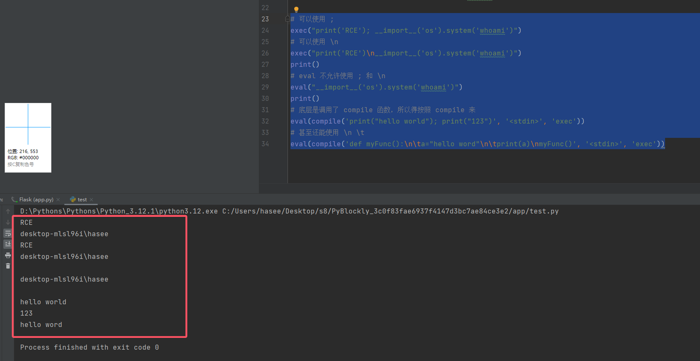
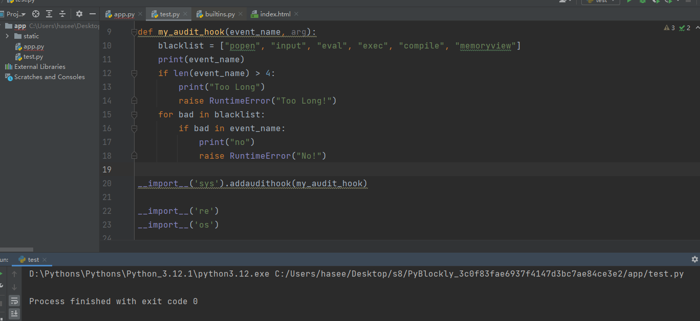
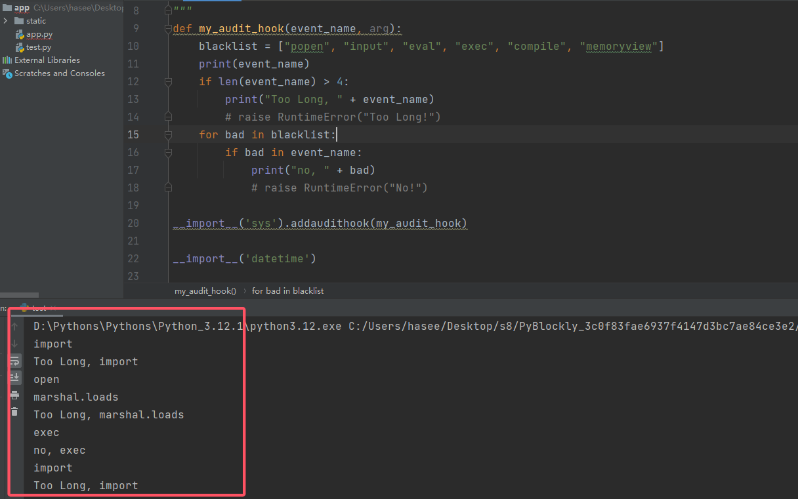

# Python 有关的安全

## 1. Flask 的 PIN 码

1. 参考文章：

    > https://adam8en.github.io/2023/11/06/CTF%E9%97%AE%E9%A2%98%E9%9B%86/%E4%B8%80%E6%96%87%E5%BC%84%E6%B8%85%E6%A5%9AFlask%E6%A1%86%E6%9E%B6%E4%B8%8B%E8%AF%A5%E5%A6%82%E4%BD%95%E8%AE%A1%E7%AE%97PIN%E7%A0%81/

    文章讲的很清楚。

2. 例题：
    [GYCTF2020]FlaskApp 1

## 2. Pickle 的反序列化漏洞

1. 原理不是很复杂，这篇文章讲的很清楚：

    > https://blog.csdn.net/qq_39947980/article/details/137033740

2. 注意 payload 的生成环境，Python2 和 3 经过 URL 编码后的结果不同。

## 3. PyYaml 反序列化漏洞

1. 参考文章：

    > https://xz.aliyun.com/t/12481?time__1311=GqGxRQqiuDyDlrzG78KG%3DGC9wE5WuepD&u_atoken=e289de62ffad3edd58b1962b2be28946&u_asig=ac11000117270828592812553e0047#toc-5

    TODO 以后再学

2. 参考例题：[TSCTF-J2024]alpaca_search_again

## 4. Python 原型链污染

1. 参考文章：

    > https://xz.aliyun.com/t/13072?u_atoken=c65aecab27cdf6d2023eafe3b2adc879&u_asig=ac11000117268316071081875e0044&time__1311=CqIx0DBDRDcD97D2DBuQwqpqh7YitrettH4D

2. 思想基本和 JS 的原型链污染类似，常见的危险函数：
    ```python
    def merge(src, dst):
        # 遍历源的键值对？
        for k, v in src.items():
            # 如果 dst 有 __getitem__
            if hasattr(dst, '__getitem__'):
                if dst.get(k) and isinstance(v, dict):
                    merge(v, dst.get(k))
                else:
                    dst[k] = v
            elif hasattr(dst, k) and isinstance(v, dict):
                merge(v, getattr(dst, k))
            else:
                setattr(dst, k, v)
    ```

3. 关键点在于找目标类，切入（可以被修改的对象）和想要修改的对象之间尽量要有关系，当然也不一定，Python 相对于 JS，有了 `__init__` 可以获取到全局变量，sys 模块中的 module 属性也可以访问其他的模块（从而可以污染）。总之范围可以影响的范围应该更广。

4. 详细例题：[TSCTF-J2024]我闻到了[巧物]的清香

## 5. Python Pyjail 沙箱绕过

1. 去看了眼强网 S8，结果第一题的沙箱绕过就有点烦，没接触过，比赛结束来学一下。

2. 直接参考下列文章：

    > https://dummykitty.github.io/python/2023/05/29/python-%E6%B2%99%E7%AE%B1%E9%80%83%E9%80%B8%E5%8E%9F%E7%90%86.html#%E5%9F%BA%E4%BA%8E-audit-hook-%E7%9A%84%E6%B2%99%E7%AE%B1
    > 沙箱是一种安全机制，用于在受限制的环境中运行未信任的程序或代码。它的主要目的是防止这些程序或代码影响宿主系统或者访问非授权的数据。
    >
    > 在 Python 中，沙箱主要用于限制 Python 代码的能力，例如，阻止其访问文件系统、网络，或者限制其使用的系统资源。Python 沙箱的实现方式有多种，包括使用 Python 的内置功能（如re模块），使用特殊的 Python 解释器（如PyPy），或者使用第三方库（如RestrictedPython）。
    >
    > 然而，Python 并没有提供内建的、可靠的沙箱机制,并且 Python 的标准库和语言特性提供了很多可以用于逃逸沙箱的方法，因此在实践中创建一个完全安全的 Python 沙箱非常困难。例如，通过`os`模块访问文件系统，通过`subprocess`模块执行外部命令，或者通过`import`语句加载并执行任意 Python 代码。

    写的挺好，我就直接开抄，中间有一些针对个人的补充。

### 5.1 Python 命名空间与内置（内建 built-in）

1. 详见：

    > https://www.runoob.com/python3/python3-namespace-scope.html

2. 知道内置名称后，可以去了解 Python 的 `builtins` module 和 `__builtin__`：

    > https://blog.csdn.net/happyjacob/article/details/109482015
    
3. 插入一个 Python 的导入模块知识点，除了常见的 `Import` 和 `from Import` 语句，还有一个动态导入的方法：`__import__`，其在内建空间 builtins 中。

### 5.2 常见沙箱

#### 5.2.1 `exec` 和 `eval` - 基于内置函数和命名空间的沙箱

1. `exec` 的基本语法：

    ```python
    exec(object, globals, locals)
    ```

    - `object` 必需参数，是一个字符串，或者是任何可以被 `compile()` 函数转化为代码对象的对象。
    - `globals` 可选参数，是一个字典，表示全局命名空间 (全局变量)，如果提供了，则在执行代码中被用作全局命名空间。
    - `locals` 可选参数，可以是任何映射对象，表示局部命名空间 (局部变量)，如果被提供，则在执行代码中被用作局部命名空间。如果两者都被忽略，那么在 `exec()` 调用的地方决定执行的命名空间。

    官方文档：

    > https://docs.python.org/zh-cn/3/library/functions.html#exec

    `exec` 还有另外一种写法：

    ```python
    exec command in _global
    ```

    其中 `_global` 为一个字典， 表示 command 将在 `_global` 指定的命名空间中运行。

2. `eval` 的基本语法：
    `eval` 的执行与 `exec` 基本一致，都可以对命名空间进行限制，例如下面的代码，在这个示例中就是直接将命名空间置空，这样就使得内置的函数都无法使用。

    ```python
    # 注意命名空间由 dict 组成
    print(
        eval(input("code> "), 
             {"__builtins__": {}},
            {"__builtins__": {}}
            )
        )
    ```

3. `exec` 与 `eval` 的区别：
    `eval` 与 `exec` 的区别在于：`exec` 允许 `\n` 和 `;` 进行换行，而 `eval` 不允许。并且 `exec` 不会将结果输出出来，而 `eval` 会。

    ```python
    # 可以使用 ;
    exec("print('RCE'); __import__('os').system('whoami')")
    # 可以使用 \n
    exec("print('RCE')\n__import__('os').system('whoami')")
    print()
    # eval 不允许使用 ; 和 \n
    eval("__import__('os').system('whoami')")
    print()
    # 底层是调用了 compile 函数，所以得按照 compile 来
    eval(compile('print("hello world"); print("123")', '<stdin>', 'exec'))
    # 甚至还能使用 \n \t
    eval(compile('def myFunc():\n\ta="hello word"\n\tprint(a)\nmyFunc()', '<stdin>', 'exec'))
    ```

    
    加入了 `compile()`，就按照 `compile()` 来。

4. 来个沙箱示例：
    ```python
    #!/usr/bin/env python2
    # -*- coding:utf-8 -*-
    
    def banner():
        print "============================================="
        print "   Simple calculator implemented by python   "
        print "============================================="
        return
    
    
    def getexp():
        return raw_input(">>> ")
    
    
    # 在 import 之前对引入的模块名进行黑名单过滤
    def _hook_import_(name, *args, **kwargs):
        module_blacklist = ['os', 'sys', 'time', 'bdb', 'bsddb', 'cgi',
                            'CGIHTTPServer', 'cgitb', 'compileall', 'ctypes', 'dircache',
                            'doctest', 'dumbdbm', 'filecmp', 'fileinput', 'ftplib', 'gzip',
                            'getopt', 'getpass', 'gettext', 'httplib', 'importlib', 'imputil',
                            'linecache', 'macpath', 'mailbox', 'mailcap', 'mhlib', 'mimetools',
                            'mimetypes', 'modulefinder', 'multiprocessing', 'netrc', 'new',
                            'optparse', 'pdb', 'pipes', 'pkgutil', 'platform', 'popen2', 'poplib',
                            'posix', 'posixfile', 'profile', 'pstats', 'pty', 'py_compile',
                            'pyclbr', 'pydoc', 'rexec', 'runpy', 'shlex', 'shutil', 'SimpleHTTPServer',
                            'SimpleXMLRPCServer', 'site', 'smtpd', 'socket', 'SocketServer',
                            'subprocess', 'sysconfig', 'tabnanny', 'tarfile', 'telnetlib',
                            'tempfile', 'Tix', 'trace', 'turtle', 'urllib', 'urllib2',
                            'user', 'uu', 'webbrowser', 'whichdb', 'zipfile', 'zipimport']
        for forbid in module_blacklist:
            if name == forbid:        # don't let user import these modules
                raise RuntimeError('No you can\' import {0}!!!'.format(forbid))
        # normal modules can be imported
        return __import__(name, *args, **kwargs)
    
    # 对执行的命令过滤
    def sandbox_filter(command):
        blacklist = ['exec', 'sh', '__getitem__', '__setitem__',
                     '=', 'open', 'read', 'sys', ';', 'os']
        for forbid in blacklist:
            if forbid in command:
                return 0
        return 1
    
    
    def sandbox_exec(command):      # sandbox user input
        result = 0
        # 这一步不转 dict() 也应该可以，__dict__ 拿到的就是 dict
        __sandboxed_builtins__ = dict(__builtins__.__dict__)
        # 修改 builtin 中的 __import__ 方法
        __sandboxed_builtins__['__import__'] = _hook_import_    # hook import
        del __sandboxed_builtins__['open']
        # 上述用当前的内置命名空间，创建新的内置命名空间，供接下来的 exec 使用
        _global = {
            '__builtins__': __sandboxed_builtins__
        }
        if sandbox_filter(command) == 0:
            print 'Malicious user input detected!!!'
            exit(0)
        command = 'result = ' + command
        try:
            exec command in _global     # do calculate in a sandboxed environment
        except Exception, e:
            print e
            return 0
        result = _global['result']  # extract the result
        return result
    
    
    banner()
    while 1:
        command = getexp()
        print sandbox_exec(command)
    ```

#### 5.2.2 `compile` 函数

1. 为什么要提 `compile` 函数呢？因为 `compile` 底层会调用函数 `exec` 或 `eval` 等。同时 AST 的生成也需要它（下文会描述）。来看看它的介绍和函数使用方法：
    `compile()` 函数是一个内置函数，它可以将源码 source 编译为**代码或 AST 对象**。编译的源码可以是普通的 Python 代码，也可以是 AST 对象。如果它是一个普通的 Python 代码，那么它必须是一个字符串。如果它是一个 AST 对象，那么它将被编译为一个代码对象。
    基本语法如下：

    ```python
    compile(source, filename, mode, flags=0, dont_inherit=False, optimize=-1)
    ```

    - source：要编译的源代码。它可以是普通的 Python 代码，或者是一个 AST 对象。如果它是普通的 Python 代码，那么它必须是一个字符串。
    - filename：源代码的文件名。如果源代码没有来自文件，你可以传递一些可识别的值。
    - mode：源代码的种类。可以是 `'exec'`，`'eval'` 或 `'single'`。`'exec'` 用于模块、脚本或者命令行，`'eval'` 用于简单的表达式，`'single'` 用于单一的可执行语句。
    - flags 和 dont_inherit：这两个参数用于控制编译源代码时的标志和是否继承上下文。它们是可选的。
    - optimize：用于指定优化级别。默认值为 -1。

2. 针对 mode，这里还需要细讲一下：

    - `'exec'`： `'exec'` 方式就类似于直接使用 `exec` 方法，可以处理换行符，分号，`import` 语句等。
    - `'eval'`： `'eval'` 方式也就类似于直接使用 `eval`，只能处理简单的表达式，**不支持换行、分号、import 语句**。
    - `'single'`：这个模式类似于 `'exec'`，但是它只用于执行单个语句(可以在语句中添加换行符等)。

#### 5.2.3 基于 audit hook 的沙箱

1. Python 3.8 中引入的一种 audit hook 的新特性。审计钩子可以用来**监控和记录** Python 程序在运行时的行为，特别是那些安全敏感的行为，如文件的读写、网络通信和动态代码的执行等。
    官方的详细介绍：

    > Audit hook：
    > https://peps.python.org/pep-0578/
    > Audit hook 在安全方面的相关讨论：
    > https://peps.python.org/pep-0551/

2. 先来看一下官方给出的 hook 函数的 C 定义，以及如何添加 hook 函数：

    > The following new C APIs allow embedders and CPython implementors to send and receive audit hook messages:
    >
    > ```python
    > # Add an auditing hook
    > typedef int (*hook_func)(const char *event, PyObject *args,
    >                          void *userData);
    > int PySys_AddAuditHook(hook_func hook, void *userData);
    > 
    > # Raise an event with all auditing hooks
    > int PySys_Audit(const char *event, PyObject *args);
    > ```
    >
    > The new Python APIs for receiving and raising audit hooks are:
    >
    > ```python
    > # Add an auditing hook
    > sys.addaudithook(hook: Callable[[str, tuple]])
    > 
    > # Raise an event with all auditing hooks
    > sys.audit(str, *args)
    > ```
    >
    > Hooks are added by calling `PySys_AddAuditHook()` from C at any time, including before `Py_Initialize()`, or by calling `sys.addaudithook()` from Python code. Hooks cannot be removed or replaced. For CPython, hooks added from C are global, while hooks added from Python are only for the current interpreter. Global hooks are executed before interpreter hooks.

3. 先给出一个模板吧：

    ```python
    import sys
    
    def my_audit_hook(eventName, args):
        if eventName == 'open':
            print(f'Opening file: {args}')
            
    sys.addaudithook(audit_hook)
    ```

    `sys.addaudithook(hook)` 的参数 `hook` 是一个函数，它的定义形式为 `hook(eventName: str, args: tuple)`。其中，`eventName` 是一个描述事件名称的字符串，`args` 是一个包含了与该事件相关的参数的元组。
    上述定义的 hook，作用是如果运行 `open('myfile.txt')`，就会得到 `Opening file: ('myfile.txt',)` 这样的输出。
    从安全的角度来说，一旦一个审计钩子被添加，那么在解释器运行时，每当发生一个与安全相关的事件，就会调用该审计钩子函数。`event` 参数会包含事件的描述，`args` 参数则包含了事件的相关信息。这样，审计钩子就可以根据这些信息进行审计记录或者对某些事件进行阻止。

4. 给出一个基于事件名黑名单的沙箱：
    ```python
        # ...
    def my_audit_hook(event, _):
        BALCKED_EVENTS = set({'pty.spawn', 'os.system', 'os.exec', 'os.posix_spawn','os.spawn','subprocess.Popen'})
        if event in BALCKED_EVENTS:
            raise RuntimeError('Operation banned: {}'.format(event))
        # ...
        sys.addaudithook(my_audit_hook)
    if __name__ == '__main__':
        main()
    ```

    有哪些事件名呢？常用的可以详见官方给出的事件表：

    > https://docs.python.org/zh-cn/3/library/audit_events.html

5. 有关导入模块的问题，详见以下内容：
    
    
    说明现在有一个现象：“有的模块引入时没有调用 `import`，而有的模块引入时调用了 `import`，且导入时有的函数调用也被探测到”。
    官方对于导入系统的描述如下：

    > https://docs.python.org/zh-cn/3/reference/import.html#the-import-system
    > 一个 [module](https://docs.python.org/zh-cn/3/glossary.html#term-module) 内的 Python 代码通过 [importing](https://docs.python.org/zh-cn/3/glossary.html#term-importing) 操作就能够访问另一个模块内的代码。 [`import`](https://docs.python.org/zh-cn/3/reference/simple_stmts.html#import) 语句是发起调用导入机制的最常用方式，但不是唯一的方式。 [`importlib.import_module()`](https://docs.python.org/zh-cn/3/library/importlib.html#importlib.import_module) 以及内置的 [`__import__()`](https://docs.python.org/zh-cn/3/library/functions.html#import__) 等函数也可以被用来发起调用导入机制。
    >
    > [`import`](https://docs.python.org/zh-cn/3/reference/simple_stmts.html#import) 语句结合了两个操作；它先搜索指定名称的模块，然后将搜索结果绑定到当前作用域中的名称。 **`import` 语句的搜索操作被定义为对 [`__import__()`](https://docs.python.org/zh-cn/3/library/functions.html#import__) 函数的调用并带有适当的参数。** [`__import__()`](https://docs.python.org/zh-cn/3/library/functions.html#import__) 的返回值会被用于执行 `import` 语句的名称绑定操作。 请参阅 `import` 语句了解名称绑定操作的更多细节。
    >
    > 对 [`__import__()`](https://docs.python.org/zh-cn/3/library/functions.html#import__) 的直接调用将仅执行模块搜索以及在找到时的模块创建操作。 不过也可能产生某些副作用，例如导入父包和更新各种缓存 (包括 [`sys.modules`](https://docs.python.org/zh-cn/3/library/sys.html#sys.modules))，只有 [`import`](https://docs.python.org/zh-cn/3/reference/simple_stmts.html#import) 语句会执行名称绑定操作。
    >
    > **当 [`import`](https://docs.python.org/zh-cn/3/reference/simple_stmts.html#import) 语句被执行时，标准的内置 [`__import__()`](https://docs.python.org/zh-cn/3/library/functions.html#import__) 函数会被调用。** 其他发起调用导入系统的机制 (例如 [`importlib.import_module()`](https://docs.python.org/zh-cn/3/library/importlib.html#importlib.import_module)) 可能会选择绕过 [`__import__()`](https://docs.python.org/zh-cn/3/library/functions.html#import__) 并使用它们自己的解决方案来实现导入机制。
    >
    > 当一个模块首次被导入时，Python 会搜索该模块，如果找到就创建一个 module 对象 [[1\]](https://docs.python.org/zh-cn/3/reference/import.html#fnmo) 并初始化它。 如果指定名称的模块未找到，则会引发 [`ModuleNotFoundError`](https://docs.python.org/zh-cn/3/library/exceptions.html#ModuleNotFoundError)。 当发起调用导入机制时，Python 会实现多种策略来搜索指定名称的模块。 这些策略可以通过使用使用下文所描述的多种钩子来加以修改和扩展。
    
     TODO：太底层了，等以后代码能力强了之后再看。

#### 5.2.4 基于 AST 的沙箱

1. Python 的抽象语法树（AST，Abstract Syntax Tree）是一种用来表示 Python 源代码的树状结构。在这个树状结构中，每个节点都代表源代码中的一种结构，如一个函数调用、一个操作符、一个变量等。Python 的 `ast` 模块提供了一种机制来解析 Python 源代码并生成这样的抽象语法树。
    抽象语法树的生成需要用到 `compile` 函数，直接上代码：

    ```python
    # flask 项目中：
    # ast.PyCF_ONLY_AST 表示生成并返回一个抽象语法树而不是返回一个已编译的代码对象。
    tree = compile(source_code, "run.py", 'exec', flags=ast.PyCF_ONLY_AST)
    # 除了用 compile 函数，ast 官方还提供了一个方法：
    tree = ast.parse(source, filename='<unknown>', mode='exec', *, type_comments=False, feature_version=None, optimize=-1)
    ```

    通过该代码就拿到了 AST 的根。

2. 列举一些常见的 AST 事件：

    - `ast.Module`: 表示一个整个的模块或者脚本。
    - `ast.FunctionDef`: 表示一个函数定义。
    - `ast.AsyncFunctionDef`: 表示一个异步函数定义。
    - `ast.ClassDef`: 表示一个类定义。
    - `ast.Return`: 表示一个return语句。
    - `ast.Delete`: 表示一个del语句。
    - `ast.Assign`: 表示一个赋值语句。
    - `ast.AugAssign`: 表示一个增量赋值语句，如`x += 1`。
    - `ast.For`: 表示一个for循环。
    - `ast.While`: 表示一个while循环。
    - `ast.If`: 表示一个if语句。
    - `ast.With`: 表示一个with语句。
    - `ast.Raise`: 表示一个raise语句。
    - `ast.Try`: 表示一个try/except语句。
    - `ast.Import`: 表示一个import语句。
    - `ast.ImportFrom`: 表示一个from…import…语句。
    - `ast.Expr`: 表示一个表达式。
    - `ast.Call`: 表示一个函数调用。
    - `ast.Name`: 表示一个变量名。
    - `ast.Attribute`: 表示一个属性引用，如`x.y`。

    更多的可以参考官方文档：

    > https://docs.python.org/zh-cn/3/library/ast.html

3. 来看一个沙箱的例子：
    ```python
    import ast
    import sys
    import os
    
    # 安全函数，使用 ast.walk() 遍历树的孩子节点
    def verify_secure(tree):
      for node in ast.walk(tree):
        match type(node):
            # 这里对 Import，from Import，函数调用这三个类型进行匹配过滤
          case (ast.Import|ast.ImportFrom|ast.Call):
            print(f"ERROR: Banned statement {node}")
            return False
      return True
    
    abspath = os.path.abspath(__file__)
    dname = os.path.dirname(abspath)
    os.chdir(dname)
    
    print("-- Please enter code (last line must contain only --END)")
    source_code = ""
    while True:
      line = sys.stdin.readline()
      if line.startswith("--END"):
        break
      source_code += line
    
    tree = compile(source_code, "input.py", 'exec', flags=ast.PyCF_ONLY_AST)
    if verify_secure(tree):  # Safe to execute!
      print("-- Executing safe code:")
      compiled = compile(source_code, "input.py", 'exec')
      exec(compiled)
    ```

### 5.3 常见的敏感操作方法

1. 包括命令执行，文件读取等。

2. 详细可参考：

    > https://dummykitty.github.io/python/2023/05/29/python-%E6%B2%99%E7%AE%B1%E9%80%83%E9%80%B8%E5%8E%9F%E7%90%86.html#%E9%80%83%E9%80%B8%E7%9B%AE%E6%A0%87

