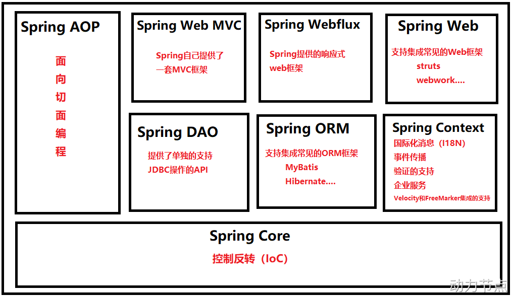
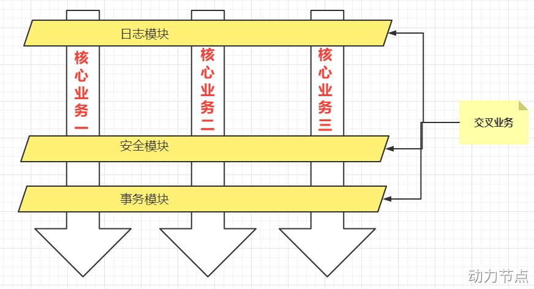

# Spring

## 1. Spring 引入 —— 背后的一些思想

### 1. OCP 开闭原则

1. OCP（Open-Closed Principle） 为软件七大开发原则当中最基本的一个原则：开闭原则。

2. > 开闭原则是这样说的：在软件开发过程中应当对扩展开放，对修改关闭。也就是说，如果在进行功能扩展的时候，添加额外的类是没问题的，但因为功能扩展而修改之前运行正常的程序，这是忌讳的，不被允许的。因为一旦修改之前运行正常的程序，就会导致项目整体要进行全方位的重新测试。这是相当麻烦的过程。导致以上问题的主要原因是：代码和代码之间的耦合度太高。如下图所示：

    
    上层依赖下层，**下面只要改动**，**上面必然会受牵连（跟着也会改)**，所谓牵一发而动全身。这样也就同时违背了另一个开发原则：依赖倒置原则。

### 2. 依赖倒置原则 DIP

1. > 依赖倒置原则(Dependence Inversion Principle)，简称DIP，主要倡导**面向抽象编程**，面向接口编程，不要面向具体编程，让**上层**不再依赖**下层**，下面改动了，上面的代码不会受到牵连。这样可以大大降低程序的耦合度，耦合度低了，扩展力就强了，同时代码复用性也会增强。（**软件七大开发原则都是在为解耦合服务**）

2. 以前常见的对象创建方法：
    `Interface interface = new InterfaceImpl()`
    这个虽然是接口编程，看似解耦合，但是实际上还是**使用了具体实现类**，接口依赖具体实现类，具体实现类一改动，上面接口就会收到影响，没有做到完全的面向接口编程。
    但是现在应该这么写：

    ```java
    private Interface itf;
    public void func(){
        // 直接调用 itf 的方法
        ...
    }
    ```
    但是上述的接口对象是 `null`，所以要解决这个问题，即解决两大问题：

    1. 谁来负责实现类对象的创建？
    2. 谁来负责把创建的实现类对象赋到这个接口对象上（这个接口对象从属于 Service 的一个类）？
    
    此时 Spring 框架就可以将上述的问题解决。程序员将实现类的对象的创建权/管理权以及对象关系的管理权交给 Spring，不再使用硬编码的方式。这种思想被称为“控制反转 IoC”。

### 3. 控制反转 IoC

1. 控制反转（Inversion of Control，缩写为 IoC），是面向对象编程中的一种设计思想，可以用来降低代码之间的耦合度，符合依赖倒置原则。

2. 该思想的**核心**是：**将对象的创建权交出去，将对象和对象之间关系的管理权交出去，由第三方容器来负责创建与维护。**

3. IoC可以认为是一种**全新的设计模式**，但是理论和时间成熟相对较晚，并没有包含在 GoF 中。（GoF 指的是23种设计模式）

4. 控制反转常见且比较重要的实现方式：依赖注入（Dependency Injection，简称 DI），通常，依赖注入的实现包括两种方式（也就是除了直接用 `=` 外的赋值）：

    1. `set` 方法注入
    2. 构造方法注入

    依赖：A 对象与 B 对象的**关系**
    注入：A 对象与 B 对象产生关系的**手段**。

    而 Spring 框架就是一个实现了 IoC 思想的框架。

## 2. Spring 概述

### 1. Spring 简介

1. > Spring是一个开源框架，它由 Rod Johnson 创建。它是为了解决企业应用开发的复杂性而创建的。
    >
    > 从简单性、可测试性和松耦合的角度而言，任何 Java 应用都可以从 Spring 中受益。
    >
    > **Spring 是一个轻量级的控制反转(IoC)和面向切面(AOP)的容器框架。**
    >
    > **Spring 最初的出现是为了解决 EJB 臃肿的设计，以及难以测试等问题。**
    >
    > **Spring 为简化开发而生，让程序员只需关注核心业务的实现，尽可能的不再关注非业务逻辑代码（事务控制，安全日志等）。**

### 2. Spring 的八大模块

1. Spring5 版本之后是 8 个模块。在Spring5中新增了 WebFlux 模块。
    
    两大核心模块：AOP 和 IoC，而 IoC 更是重量级，AOP 底层依赖 IoC。
2. Spring Core模块
    这是 Spring 框架最基础的部分，它提供了依赖注入（DI）特征来实现容器对 Bean 的管理。核心容器的主要组件是 BeanFactory，BeanFactory 是工厂模式的一个实现，是任何 Spring 应用的核心。它使用 IoC 将应用配置和依赖从实际的应用代码中分离出来。
3. Spring Context 模块
    如果说核心模块中的 BeanFactory 使 Spring 成为容器的话，那么上下文模块就是 Spring 成为框架的原因。
    这个模块扩展了BeanFactory，增加了对国际化（I18N）消息、事件传播、验证的支持。另外提供了许多企业服务，例如电子邮件、JNDI 访问、EJB 集成、远程以及时序调度（scheduling）服务。也包括了对模版框架例如 Velocity 和 FreeMarker 集成的支持。
4. Spring AOP 模块
    Spring 在它的 AOP 模块中提供了对面向切面编程的丰富支持，Spring AOP 模块为基于 Spring 的应用程序中的对象提供了事务管理服务。通过使用 Spring AOP，不用依赖组件，就可以将声明性事务管理集成到应用程序中，可以自定义拦截器、切点、日志等操作。
5. Spring DAO 模块
    提供了一个 JDBC 的抽象层和异常层次结构，消除了烦琐的 JDBC 编码和数据库厂商特有的错误代码解析，用于简化 JDBC。
6. Spring ORM 模块
    Spring 提供了 ORM 模块。Spring 并不试图实现它自己的 ORM 解决方案，而是为几种流行的 ORM 框架提供了集成方案，包括Hibernate、JDO 和 iBATIS SQL（MyBatis） 映射，这些都遵从 Spring 的通用事务和 DAO 异常层次结构。
7. Spring Web MVC 模块
    Spring 为构建 Web 应用提供了一个功能全面的 MVC 框架。虽然Spring 可以很容易地与其它 MVC 框架集成（通过 Spring Web 模块），例如 Struts，但 Spring 的 MVC 框架使用 IoC 对控制逻辑和业务对象提供了完全的分离。
8. Spring WebFlux 模块
    Spring Framework 中包含的原始 Web 框架 Spring Web MVC 是专门为 Servlet API 和 Servlet 容器构建的。反应式堆栈 Web 框架 Spring WebFlux 是在 5.0 版的后期添加的。它是完全非阻塞的，支持反应式流(Reactive Stream)背压，并在 Netty，Undertow 和 Servlet 3.1+ 容器等服务器上运行。
9. Spring Web 模块
    Web 上下文模块建立在应用程序上下文模块之上，为基于 Web 的应用程序提供了上下文，**提供了 Spring 和其它 Web 框架的集成**，比如Struts、WebWork。还提供了一些面向服务支持，例如：实现文件上传的 multipart 请求。

### 3. Spring 的特点

1. 轻量
    1. 从大小与开销两方面而言 Spring 都是轻量的。完整的 Spring 框架可以在一个大小只有 1MB 多的 JAR 文件里发布。并且Spring 所需的处理开销也是微不足道的。
    2. Spring 是非侵入式的：Spring 应用中的对象不依赖于 Spring 的特定类（即不依赖别人东西，独立的完成任务）。
2. IoC
    Spring 通过一种称作控制反转（IoC）的技术促进了松耦合。当应用了 IoC，一个对象依赖的其它对象会通过被动的方式传递进来，而不是这个对象自己创建或者查找依赖对象。你可以认为 IoC 与 JNDI 相反——不是对象从容器中查找依赖，而是容器在对象初始化时不等对象请求就主动将依赖传递给它。
3. 面向切面
    Spring 提供了面向切面编程的丰富支持，允许通过分离应用的业务逻辑与系统级服务（例如审计（auditing）和事务（transaction）管理）进行内聚性的开发。应用对象只实现它们应该做的——完成业务逻辑——仅此而已。它们并不负责（甚至是意识）其它的系统级关注点，例如日志或事务支持。
4. 容器
    Spring 包含并管理应用对象的配置和生命周期，在这个意义上它是一种容器，你可以配置你的每个 bean 如何被创建——基于一个可配置原型（prototype），你的 bean 可以创建一个单独的实例或者每次需要时都生成一个新的实例——以及它们是如何相互关联的。然而，Spring不应该被混同于传统的重量级的 EJB 容器，它们经常是庞大与笨重的，难以使用。
5. 框架
    Spring 可以将简单的组件配置、组合成为复杂的应用。在 Spring 中，应用对象被声明式地组合，典型地是在一个 XML 文件里。Spring 也提供了很多基础功能（事务管理、持久化框架集成等等），将应用逻辑的开发留给了你。
6. 所有 Spring 的这些特征使你能够编写更干净、更可管理、并且更易于测试的代码。它们也为 Spring 中的各种模块提供了基础支持。

## 3. Spring 的入门程序

### 1. Spring 的引入

1. 如果只是想用 Spring 的IoC功能，仅需要引入：spring-context即可。采用maven只需要引入context的依赖即可。

2. | **JAR文件**                      | **描述**                                                     |
    | -------------------------------- | ------------------------------------------------------------ |
    | spring-aop-5.3.9.jar             | **这个 jar 文件包含在应用中使用 Spring 的AOP 特性时所需的类** |
    | spring-aspects-5.3.9.jar         | **提供对 AspectJ 的支持，以便可以方便的将面向切面的功能集成进 IDE 中** |
    | spring-beans-5.3.9.jar           | **这个jar 文件是所有应用都要用到的，它包含访问配置文件、创建和管理 bean 以及进行 Inversion of Control / Dependency Injection（IoC/DI）操作相关的所有类。如果应用只需基本的IoC/DI 支持，引入spring-core.jar 及spring-beans.jar 文件就可以了。** |
    | spring-context-5.3.9.jar         | **这个 jar 文件为 Spring 核心提供了大量扩展。可以找到使用 Spring ApplicationContext 特性时所需的全部类，JDNI 所需的全部类，instrumentation 组件以及校验 Validation 方面的相关类。** |
    | spring-context-indexer-5.3.9.jar | 虽然类路径扫描非常快，但是 Spring 内部存在大量的类，添加此依赖，可以通过在编译时创建候选对象的静态列表来提高大型应用程序的启动性能。 |
    | spring-context-support-5.3.9.jar | 用来提供 Spring上下文的一些扩展模块,例如实现邮件服务、视图解析、缓存、定时任务调度等 |
    | spring-core-5.3.9.jar            | **Spring 框架基本的核心工具类。Spring 其它组件要都要使用到这个包里的类，是其它组件的基本核心，当然你也可以在自己的应用系统中使用这些工具类。** |
    | spring-expression-5.3.9.jar      | Spring 表达式语言。                                          |
    | spring-instrument-5.3.9.jar      | Spring3.0 对服务器的代理接口。                               |
    | spring-jcl-5.3.9.jar             | Spring的日志模块。JCL，全称为"Jakarta Commons Logging"，也可称为"Apache Commons Logging"。 |
    | spring-jdbc-5.3.9.jar            | **Spring 对 JDBC 的支持。**                                  |
    | spring-jms-5.3.9.jar             | 这个jar包提供了对JMS 1.0.2/1.1的支持类。JMS是Java消息服务。属于JavaEE规范之一。 |
    | spring-messaging-5.3.9.jar       | 为集成messaging api和消息协议提供支持                        |
    | spring-orm-5.3.9.jar             | **Sprin g集成 ORM 框架的支持，比如集成hibernate，mybatis 等。** |
    | spring-oxm-5.3.9.jar             | 为主流 O/X Mapping 组件提供了统一层抽象和封装，OXM 是 Object Xml Mapping。对象和 XML 之间的相互转换。 |
    | spring-r2dbc-5.3.9.jar           | Reactive Relational Database Connectivity (关系型数据库的响应式连接) 的缩写。这个jar文件是 Spring 对 r2dbc 的支持。 |
    | spring-test-5.3.9.jar            | 对Junit等测试框架的简单封装。                                |
    | spring-tx-5.3.9.jar              | **为 JDBC、Hibernate、JDO、JPA、Beans 等提供的一致的声明式和编程式事务管理支持。** |
    | spring-web-5.3.9.jar             | **Spring 集成 MVC 框架的支持，比如集成 Struts等。**          |
    | spring-webflux-5.3.9.jar         | **WebFlux 是 Spring5 添加的新模块，用于 web 的开发，功能和 SpringMVC 类似的，Webflux 使用当前一种比较流程响应式编程出现的框架。** |
    | spring-webmvc-5.3.9.jar          | **SpringMVC 框架的类库**                                     |
    | spring-websocket-5.3.9.jar       | Spring集成 WebSocket 框架时使用                              |

3. 目前暂时只需要引入 Spring Context 依赖即可：
    ```xml
    <!-- 引入 Spring Context 后，相当于把 Spring 的基础依赖引入了 -->
    <!-- 如果想使用 Spring 的 JDBC，或者说其他的依赖，那么还需要添加依赖 -->
    <!-- https://mvnrepository.com/artifact/org.springframework/spring-context -->
    <dependency>
        <groupId>org.springframework</groupId>
        <artifactId>spring-context</artifactId>
        <version>6.0.4</version>
    </dependency>
    ```

### 2. Spring 入门程序编写以及一些细节

1. 正常导入 Context。

2. 在 resources 目录下创建 Spring 的配置文件（即最好放在类路径当中以方便后期移植），名字随意，根据业务来，比如 Bean 的配置文件就叫 Beans.xml（注意 IDEA 提供了创建 Spring 配置文件的模板）。

3. 创建一个 Bean ：这里为 User。

4. 配置 Beans.xml：
    ```xml
    <?xml version="1.0" encoding="UTF-8"?>
    <beans xmlns="http://www.springframework.org/schema/beans"
           xmlns:xsi="http://www.w3.org/2001/XMLSchema-instance"
           xsi:schemaLocation="http://www.springframework.org/schema/beans http://www.springframework.org/schema/beans/spring-beans.xsd">
    
        <!--
            id 属性：是这个 bean 的身份证，不能重复，唯一标识
            class 属性：用来指定要创建的 Java 对象的类名，这个类名必须是全限定类名（带包名）
         -->
        <bean id="User" class="com.endlessshw.spring6.bean.User"/>
    
    </beans>
    ```

5. 编写程序：
    ```java
    package com.endlessshw.spring6.test;
    
    import org.junit.Test;
    import org.springframework.context.ApplicationContext;
    import org.springframework.context.support.ClassPathXmlApplicationContext;
    
    /**
     * @author hasee
     * @version 1.0
     * @description: TODO
     * @date 2023/2/14 11:34
     */
    public class FirstSpringTest {
        @Test
        public void testFirstSpringCode() {
            // 第一步，获取 Spring 容器对象，参数为配置文件路径
            // ApplicationContext 是一个接口，该接口下有很多实现类，其中有一个实现类叫：ClassPathXmlApplicationContext
            // ClassPathXmlApplicationContext 专门从类路径当中加载 Spring 配置文件，并生成一个 Spring 上下文对象。
            // 该对象只要实例化，其相当于启动了 Spring 容器并解析对应的配置文件，并且实例化所有的 Bean 对象，放到 Spring 容器中。（注意不是调用 getBean() 之后才创建对象）
            ApplicationContext applicationContext = new ClassPathXmlApplicationContext("Beans.xml");
    
            // 第二步，根据 Bean 的 id，从 Spring 容器中获取对象
            Object user = applicationContext.getBean("User");
            System.out.println(user);
        }
    }
    ```

    需要注意的是，Bean 并非只有 Setter、Getter、Constructor 等，Dao 的实现类 xxxDaoImpl 也可以配置。

6. 和 MyBatis 一样，Spring 实例化对象的本质就是通过反射机制，调用类的无参构造方法以实例化对象。
    ```java
    Class clazz = Class.forName("com.endlessshw.spring6.bean.User");
    Object obj = clazz.newInstance();
    ```

    如果没有无参构造方法，实例化对象时就会报错，**因此创建 Bean 时，一定要养成创建无参构造方法的习惯**。

7. Spring 会把创建好的对象存储到了 Map 中：
    

8. Spring 的配置文件可以有多个：
    ```java
    ApplicationContext applicationContext = new ClassPathXmlApplicationContext("Beans.xml", "spring.xml");
    ```

    源代码中，是可变数量参数。

9. 如果 id 不存在，是出现异常，而不是返回 `null`。

10. `getBean()` 方法默认返回 `Object` 类型，如果需要访问子类的特有属性和方法时，还需要向下转型；为了方便，可以这么写：

    ```java
    User user = applicationContext.getBean("userBean", User.class);
    ```

    第二个参数指定要转型的类。

11. 没有在类路径中的话，需要使用 `FileSystemXmlApplicationContext` 类进行加载配置文件。这种方式较少用，一般都是将配置文件放到类路径当中，这样可移植性更强。

12. 上述所提及的所有 `xxxApplicationContext` 的父接口为 `BeanFactory` ，即其为 Spring 容器的超级接口。可以看出，Spring 的 IoC 容器底层上是使用了**工厂模式**。**其底层原理就是：XML 解析 + 工厂模式 + 反射机制**。

### 3. 启用 Log4j2 日志框架

1. 引入 Log4j2 依赖：
    ```xml
    <!-- 启用 Log4j2 -->
    <!-- https://mvnrepository.com/artifact/org.apache.logging.log4j/log4j-core -->
    <dependency>
        <groupId>org.apache.logging.log4j</groupId>
        <artifactId>log4j-core</artifactId>
        <version>2.19.0</version>
    </dependency>
    <!-- https://mvnrepository.com/artifact/org.apache.logging.log4j/log4j-slf4j2-impl -->
    <dependency>
        <groupId>org.apache.logging.log4j</groupId>
        <artifactId>log4j-slf4j2-impl</artifactId>
        <version>2.19.0</version>
    </dependency>
    ```
    
2. 创建日志配置文件 log4j2.xml（文件名固定且必须放在类根路径下）
    ```xml
    <?xml version="1.0" encoding="UTF-8"?>
    
    <configuration>
    
        <loggers>
            <!--
                level指定日志级别，从低到高的优先级：
                    ALL < TRACE < DEBUG < INFO < WARN < ERROR < FATAL < OFF
            -->
            <root level="DEBUG">
                <appender-ref ref="spring6log"/>
            </root>
        </loggers>
    
        <appenders>
            <!-- 输出日志信息到控制台 -->
            <console name="spring6log" target="SYSTEM_OUT">
                <!-- 控制日志输出的格式 -->
                <PatternLayout pattern="%d{yyyy-MM-dd HH:mm:ss SSS} [%t] %-3level %logger{1024} - %msg%n"/>
            </console>
        </appenders>
    
    </configuration>
    ```

3. 自己使用 Log4j2 来记录日志：
    ```java
    // 第一步：创建某个特定类的日志记录器对象，即只要这个类中的代码执行日志的话，其就会输出相关的日志信息
    Logger logger = LoggerFactory.getLogger(FirstSpringTest.class);
    // 第二步：根据不同的级别输出日志
    logger.debug("我是一条调制信息");
    ```

## 4. Spring 对 IoC 的实现

### 1. IoC 控制反转

1. 控制反转是一种思想。
2. 控制反转是为了降低程序耦合度，提高程序扩展力，达到OCP原则，达到DIP原则。
3. 控制反转，反转的是什么？
  1. 将对象的创建权利交出去，交给第三方容器负责。
  2. 将对象和对象之间关系的维护权交出去，交给第三方容器负责。
4. 控制反转这种思想如何实现呢？
    DI（Dependency Injection）：依赖注入

### 2. 依赖注入

1. **Spring 通过依赖注入的方式来完成 Bean 管理的。Bean 管理说的是：Bean 对象的创建，以及 Bean 对象中属性的赋值（或者叫做 Bean 对象之间关系的维护）。**

#### 1. Set 注入

1. set 注入，基于 set 方法实现的，底层会通过反射机制调用属性对应的set 方法然后给属性赋值。这种方式**要求属性必须对外提供 set 方法**。

2. UserDaoImpl：
    ```java
    package com.endlessshw.spring6.dao.Impl;
    
    import com.endlessshw.spring6.dao.UserDao;
    import org.slf4j.Logger;
    import org.slf4j.LoggerFactory;
    
    /**
     * @author hasee
     * @version 1.0
     * @description: UseDao 接口实现类
     * @date 2023/2/14 13:58
     */
    public class UserDaoImpl implements UserDao {
        private static final Logger logger = LoggerFactory.getLogger(UserDaoImpl.class);
        @Override
        public void insert() {
            logger.debug("数据库...");
        }
    }
    ```

    UserServiceImpl：
    ```java
    package com.endlessshw.spring6.service.Impl;
    
    import com.endlessshw.spring6.dao.UserDao;
    import com.endlessshw.spring6.service.UserService;
    
    /**
     * @author hasee
     * @version 1.0
     * @description: UserService 接口实现类
     * @date 2023/2/14 14:01
     */
    public class UserServiceImpl implements UserService {
    
        private UserDao mUserDao = null;
    
        // 使用 set 注入时，必须要提供一个 set 方法
        // Spring 容器会调用这个 set 方法来给 Dao 赋值。
        // 这个 set 方法是 IDEA 自动生成的，符合 JavaBean 规范
        public void setUserDao(UserDao userDao) {
            mUserDao = userDao;
        }
    
        @Override
        public void saveUser() {
            mUserDao.insert();
        }
    }
    ```

    最后要在 Spring 配置文件中进行配置：
    ```xml
    <?xml version="1.0" encoding="UTF-8"?>
    <beans xmlns="http://www.springframework.org/schema/beans"
           xmlns:xsi="http://www.w3.org/2001/XMLSchema-instance"
           xsi:schemaLocation="http://www.springframework.org/schema/beans http://www.springframework.org/schema/beans/spring-beans.xsd">
    
        <!-- 配置 Dao 实现类 -->
        <bean id="userDao" class="com.endlessshw.spring6.dao.Impl.UserDaoImpl"/>
    
        <!-- 配置 Service 实现类 -->
        <bean id="userService" class="com.endlessshw.spring6.service.Impl.UserServiceImpl">
            <!-- 想让 Spring 调用对应的 set 方法，需要配置 <property> 标签 -->
            <!--
                name：指定被注入的对象，其本质是需要一个 set 方法。具体输入的内容取决于 set 方法名而不是属性/成员对象名。要求把 set 方法名去掉 set 和 首字母小写（因为这样的结果一般是属性名/成员对象名）。
                ref：要注入的 Bean 对象的 id。(通过ref属性来完成 Bean 的装配，这是 Bean 最简单的一种装配方式。装配指的是：创建系统组件之间关联的动作)
            -->
            <property name="userDao" ref="userDao"/>
        </bean>
    </beans>
    ```

    最后编写测试类，测试结果：
    ```java
    package com.endlessshw.spring6.test;
    
    import com.endlessshw.spring6.service.Impl.UserServiceImpl;
    import org.junit.Test;
    import org.springframework.context.ApplicationContext;
    import org.springframework.context.support.ClassPathXmlApplicationContext;
    
    /**
     * @author hasee
     * @version 1.0
     * @description: TODO
     * @date 2023/2/14 14:07
     */
    public class SpringDITest {
        @Test
        public void testSetDI() {
            ApplicationContext applicationContext = new ClassPathXmlApplicationContext("Spring.xml");
            UserServiceImpl userService = applicationContext.getBean("userService", UserServiceImpl.class);
            userService.saveUser();
        }
    }
    ```

#### 2. 构造注入

1. 核心原理：通过调用构造方法来给属性赋值。

2. 和 set 方法的核心区别：set 方法注入其实是在对象创建之后调用的，而通过构造方法注入其实际上是在创建对象的同时调用的。时机不同。

3. 配置文件代码：
    ```xml
    <bean id="customDao" class="com.endlessshw.spring6.dao.Impl.CustomDaoImpl"/>
    <bean id="customService" class="com.endlessshw.spring6.service.Impl.CustomServiceImpl">
        <!-- 构造方法 -->
        <!-- 指定构造方法的第一个参数 -->
        <constructor-arg index="0" ref="customDao"/>
    </bean>
    ```

    然后服务层的实现类：
    ```Java
    package com.endlessshw.spring6.service.Impl;
    
    import com.endlessshw.spring6.dao.CustomDao;
    import com.endlessshw.spring6.dao.Impl.CustomDaoImpl;
    import com.endlessshw.spring6.service.CustomService;
    
    /**
     * @author hasee
     * @version 1.0
     * @description: TODO
     * @date 2023/2/14 16:06
     */
    public class CustomServiceImpl implements CustomService {
    
        private CustomDao mCustomDao = null;
    
        // 构造注入
        public CustomServiceImpl(CustomDao customDao) {
            mCustomDao = customDao;
        }
    
        @Override
        public void saveCustom() {
            mCustomDao.insert();
        }
    }
    ```

4. `<constructor-arg>` 的属性，还可以是：

    1. `name`：指定参数的名字，在指定时 IDEA 是有提示的。其内容和构造函数中形参的名字相同。
    2. 参数下标和名字都不指定，甚至设置顺序和构造方法参数的顺序不一致，都可以自动对应。但一定要有 `ref` 。这种方式会根据类型判断，将哪个对象注入到哪个参数。

    可以看出 Spring 很健壮。

### 3. Set 注入专题（注入的对象的多种情况）

#### 1. 注入外部 Bean

1. 之前讲的例子就是外部 Bean，即正常的一个 Bean。
2. 外部 Bean 的特点：Bean 定义到外面，在 `<property>` 标签中使用 `ref` 属性进行注入。通常这种方式是常用。

#### 2. 注入内部 Bean（了解，少用）

1. 内部 Bean 的方式：在 `<Bean>` 标签中嵌套 `<bean>` 标签。

2. 内部 Bean：
    ```xml
    <bean id="userDao" class="com.endlessshw.spring6.dao.Impl.UserDaoImpl"/>
    <bean id="userService" class="com.endlessshw.spring6.service.Impl.UserServiceImpl">
        <property name="userDao">
            <bean class="com.endlessshw.spring6.dao.Impl.UserDaoImpl"/>
        </property>
    </bean>
    ```

    没有 `ref` 属性，但在 `<property>` 中又嵌套了一个 `<bean>`。虽然看起来有清晰的层次结构，但是一旦多起来就会乱，代码丑。

#### 3. 注入简单类型

1. 之前举得例子都是复杂数据类型，这里对简单数据类型进行注入。

2. 和外部 Bean 注入的思路差不多，就是配置文件有所不同：
    ```xml
    <bean id="userBean" class="com.endlessshw.spring6.bean.User">
        <!-- 对简单类型进行注入时，使用 value 属性 -->
        <property name="username" value="张三" />
        <!-- 或者使用下述方法 -->
        <property name="password">
            <value>"123456"</value>
        </property>
        <property name="age" value="20"/>
    </bean>
    ```

3. 通过查看 Spring 的 `BeanUtils` 类的 `isSimpleValueType()` 方法得知（`ctrl + f12` 在源码中搜索方法），Spring 眼中的简单数据类型：

    1. `ClassUtils.isPrimitiveOrWrapper(type)`：表示 8 中基本数据类型及其包装类
    2. `Enum`，`CharSequence`，`Number`，`Date`，`Temporal`（Java 8 后有关时区的类），`URI 和 URL`，`Locale`，`Class`。
    3. 另外还包括以上简单值类型对应的数组类型。

4. **如果把 `Date` 当做简单类型的话，日期字符串格式不能随便写。格式必须符合`Date` 的 `toString()` 方法格式。**显然这就比较鸡肋了。如果提供一个这样的日期字符串：2010-10-11，在这里是无法赋值给 `Date` 类型的属性的。所以实际开发中，不会把 `Date` 当作简单类型，而是通过 `ref` 属性引入。

5. **spring6 之后，当注入的是 URL，那么这个 url 字符串是会进行有效性检测的。如果是一个存在的 url，那就没问题。如果不存在则报错。**

6. 实际应用为“给数据源的属性注入值”，例如数据源中含有数据库的信息。
    数据源是用于返回 `Connection` 的类。

#### 4. 级联属性赋值（了解）

1. 即一个 Bean 类的属性是另一个 Bean 类，然后如果给内部的 Bean 的属性赋值，就用级联属性赋值：
    ```xml
    <bean id="student" class="com.endlessshw.spring6.beans.Student">
        <property name="name" value="张三"/>
        <!--要点 1：以下两行配置的顺序不能颠倒-->
        <property name="clazz" ref="clazzBean"/>
        <!--要点 2：clazz 中 name 属性必须有 getter 方法-->
        <property name="clazz.name" value="高三一班"/>
    </bean>
    
    <bean id="clazzBean" class="com.endlessshw.spring6.beans.Clazz"/>
    ```

2. 实际不会像这样麻烦，都是分开赋值：
    ```xml
    <bean id="student" class="com.endlessshw.spring6.beans.Student">
        <property name="name" value="张三"/>
        <property name="clazz" ref="clazzBean"/>
    </bean>
    
    <bean id="clazzBean" class="com.endlessshw.spring6.beans.Clazz">
    	<property name="name" value="高三一班"/>
    </bean>
    ```

#### 5. 注入数组

1. 如果数据的内容是简单数据类型：
    ```xml
    <bean id="person" class="com.endlessshw.spring6.bean.Persion">
    	<property name="hoppies">
        	<array>
                <value>抽烟</value>
                <value>喝酒</value>
                <value>烫头</value>
            </array>
        </property>
    </bean>
    ```

2. 如果数据中的元素是非简单类型：
    ```xml
    <property name="hoppies">
        <array>
            <value>抽烟</value>
            <value>喝酒</value>
            <value>烫头</value>
        </array>
    </property>
    
    <!-- 创建数组中的一个 Bean 元素 -->
    <bean id="user1" class="com.endlessshw.spring6.bean.User">
    	<property name="username" value="张三" />
    </bean>
    
    <property name="Users">
    	<array>
        	<ref bean="user1"/>
        </array>
    </property>
    ```

#### 6. 注入 List（有序可重复）和 Set 集合（无序不重复） 集合

1. 和数组差不多，就是把 `<array>` 标签换成 `<list>` 和 `<set>` 标签即可。其他不变，**简单类型使用 `value` 标签，反之使用 `ref` 标签。**
2. 如果 Set 集合有重复，会自动去掉重复。

#### 7. 注入 Map 集合

1. 代码示例：
    ```xml
    <?xml version="1.0" encoding="UTF-8"?>
    <beans xmlns="http://www.springframework.org/schema/beans"
           xmlns:xsi="http://www.w3.org/2001/XMLSchema-instance"
           xsi:schemaLocation="http://www.springframework.org/schema/beans http://www.springframework.org/schema/beans/spring-beans.xsd">
    
        <bean id="peopleBean" class="com.endlessshw.spring6.bean.People">
            <property name="addrs">
                <map>
                    <!-- 如果 key 不是简单类型，使用 key-ref 属性 -->
                    <!-- 如果 value 不是简单类型，使用 value-ref 属性 -->
                    <entry key="1" value="北京大兴区"/>
                    <entry key="2" value="上海浦东区"/>
                    <entry key="3" value="深圳宝安区"/>
                </map>
            </property>
        </bean>
    </beans>
    ```

#### 8. 注入 Properties

1. java.util.Properties 继承 java.util.Hashtable，所以 Properties 也是一个Map 集合。

2. 示例代码（注入方式和 Map 不同）：
    ```xml
    <?xml version="1.0" encoding="UTF-8"?>
    <beans xmlns="http://www.springframework.org/schema/beans"
           xmlns:xsi="http://www.w3.org/2001/XMLSchema-instance"
           xsi:schemaLocation="http://www.springframework.org/schema/beans http://www.springframework.org/schema/beans/spring-beans.xsd">
    
        <bean id="peopleBean" class="com.endlessshw.spring6.beans.People">
            <property name="properties">
                <!-- 注意这里 -->
                <props>
                    <!-- Properties 类的 key 和 value 只能是 String -->
                    <prop key="driver">com.mysql.cj.jdbc.Driver</prop>
                    <prop key="url">jdbc:mysql://localhost:3306/spring</prop>
                    <prop key="username">root</prop>
                    <prop key="password">123456</prop>
                </props>
            </property>
        </bean>
    </beans>
    ```

#### 9. 注入 `null` 和空字符串

1. 注入空字符串使用：`<value/>` 或者 `value=""`
2. 注入 `null` 使用：在 `<property>` 中使用 `<null/>` 或者不为该属性赋值。

#### 10. 注入的值中含有特殊符号 `< > ' " &`

1. 默认情况下，特殊符号在 XML 中会被当作语法解析。

2. 解决办法：

    1. 使用转义字符：
        | **特殊字符** | **转义字符** |
        | ------------ | ------------ |
        | >            | `&gt;`       |
        | <            | `&lt;`       |
        | '            | `&apos;`     |
        | "            | `&quot;`     |
        | &            | `&amp;`      |
    
    2. 将含有特殊符号的字符串放到：`<![CDATA[]]>` 当中。因为放在 CDATA 区中的数据不会被 XML 文件解析器解析。
        ```xml
        <?xml version="1.0" encoding="UTF-8"?>
        <beans xmlns="http://www.springframework.org/schema/beans"
               xmlns:xsi="http://www.w3.org/2001/XMLSchema-instance"
               xsi:schemaLocation="http://www.springframework.org/schema/beans http://www.springframework.org/schema/beans/spring-beans.xsd">
        
            <bean id="mathBean" class="com.endlessshw.spring6.beans.Math">
                <property name="result">
                    <!--只能使用 value 标签-->
                    <value><![CDATA[2 < 3]]></value>
                </property>
            </bean>
        
        </beans>
        ```
    
        一定要注意只能在 `<value>` 标签内来使用 `<![CDATA[2 < 3]]>`。

#### 11. p 命名空间注入

1. 该注入的目的是为了“简化配置”。

2. 使用 p 命名空间注入的前提条件包括：

    1. 在 XML 头部信息中添加 p 命名空间的配置信息：
        `xmlns:p="http://www.springframework.org/schema/p"`
    2. p 命名空间注入是基于 setter 方法的，所以需要对应的属性提供 setter 方法。(p 命名空间注入的底层就是 setter 注入)

3. 示例：
    ```xml
    <?xml version="1.0" encoding="UTF-8"?>
    <beans xmlns="http://www.springframework.org/schema/beans"
           xmlns:xsi="http://www.w3.org/2001/XMLSchema-instance"
           xmlns:p="http://www.springframework.org/schema/p"
           xsi:schemaLocation="http://www.springframework.org/schema/beans http://www.springframework.org/schema/beans/spring-beans.xsd">
    
        <!-- 创建日期类 -->
        <bean id="birthBean" class="java.util.Date"/>
    
        <!-- 在这里使用 p 命名空间 -->
        <bean id="dog" class="com.endlessshw.spring6.bean.Dog" p:name="狗" p:age="3" p:birth-ref="birthBean"/>
    
    </beans>
    ```

#### 12. c 命名空间注入

1. 对应 p 命名空间注入，c 命名空间注入是简化构造方法注入的。

2. 同样的，它也有两个前提条件：

    1. 在 XML 配置文件头部添加信息：
        `xmlns:c="http://www.springframework.org/schema/c"`
    2. 需要提供构造方法

3. 示例：
    ```xml
    <!-- 创建日期类 -->
    <bean id="birthBean" class="java.util.Date"/>
    <!-- 在这里使用 c 命名空间，可以用 _数字 来指定对应参数，也可以使用 c:参数名 来指定 -->
    <bean id="dog" class="com.endlessshw.spring6.bean.Dog" c:_0="狗" c:age="3" c:_2-ref="birthBean"/>
    ```

#### 13. util 命名空间

1. 使用 util 命名空间可以让“配置复用”

2. 用 util 命名空间的前提是：在 Spring 配置文件头部添加配置信息：
    `xmlns:util="http://www.springframework.org/schema/util"`
    以及在 `xsi:schemaLocation` 中额外添加：
    `http://www.springframework.org/schema/util http://www.springframework.org/schema/util/spring-util.xsd`

3. 一般应用场景就是使用多家数据库连接池，多个数据源需要配置信息。

4. 示例：
    ```xml
    <?xml version="1.0" encoding="UTF-8"?>
    <beans xmlns="http://www.springframework.org/schema/beans"
           xmlns:xsi="http://www.w3.org/2001/XMLSchema-instance"
           xmlns:util="http://www.springframework.org/schema/util"
           xsi:schemaLocation="http://www.springframework.org/schema/beans http://www.springframework.org/schema/beans/spring-beans.xsd
                               http://www.springframework.org/schema/util http://www.springframework.org/schema/util/spring-util.xsd">
    
        <util:properties id="prop">
            <prop key="driver">com.mysql.cj.jdbc.Driver</prop>
            <prop key="url">jdbc:mysql://localhost:3306/spring</prop>
            <prop key="username">root</prop>
            <prop key="password">123456</prop>
        </util:properties>
    
        <!-- id 为实现 DataSource 的类 -->
        <bean id="dataSource1" class="com.endlessshw.spring6.beans.MyDataSource1">
            <property name="properties" ref="prop"/>
        </bean>
    
        <bean id="dataSource2" class="com.endlessshw.spring6.beans.MyDataSource2">
            <property name="properties" ref="prop"/>
        </bean>
    </beans>
    ```

### 4. 基于 XML 的自动装配

1. Spring 还可以完成自动化的注入，自动化注入又被称为自动装配。它可以根据**名字**进行自动装配，也可以根据**类型**进行自动装配。

2. 根据名字自动装配：
    ```xml
    <bean id="userService" class="com.endlessshw.spring6.service.Impl.UserServiceImpl" autowire="byName"/>
    <bean id="userDao" class="com.endlessshw.spring6.dao.Impl.UserDaoImpl"/>
    ```

    使用自动装配时，`id` 一定要为 Bean 变量的名称（即和在别的调用类中的属性名一致，且别的调用类有对应 setter 方法）。

3. 根据类型自动装配：
    ```xml
    <bean id="userService" class="com.endlessshw.spring6.service.Impl.UserServiceImpl" autowire="byType"/>
    <bean class="com.endlessshw.spring6.dao.Impl.UserDaoImpl"/>
    ```

    基于类型注入的，可以没有 `id` 属性。
    基于类型注入的缺陷在于，同一个配置文件，不能有两个类型一样的 Bean（即 `class` 相同的两个），即使 `id` 不同也不行。

### 5. Spring 引入外部属性配置文件

1. 我们都知道编写数据源的时候是需要连接数据库的信息的，例如：driver url username password 等信息。这些信息可以单独写到一个属性配置文件中吗，这样用户修改起来会更加的方便。
2. 引入外部的 properties 文件：
    1. 引入 context 命名空间
        `xmlns:context="http://www.springframework.org/schema/context"`
    2. 使用 `<context:property-placeholder location="xxx.properties" />` 来指定配置文件的路径，默认从类的根路径下开始寻找。
    3. 使用 `${key}` 取值。
    4. 需要注意的是，`${}` 如果取 `${username}`，它会从系统的环境变量去当前系统的用户名。因此配置文件内 key 的名字建议带上前缀，例如 JDBC 配置文件中的 username 应该是：`jdbc.username`。

## 5. Bean 的作用域

###  1. SingleTon

1. 默认情况下，Spring 的 IoC 容器创建的 Bean 对象是**单例**的。（即通过多次创建 Bean 对象并查看起 Hash 值，都相同。）
2. 如果不创建对象，给 Bean 添加“输出”的无参构造函数，此时可以看出：**默认情况下，Bean 对象的创建是在初始化 Spring 上下文的时候就完成的。**

### 2. Prototype

1. 如果想让 Spring 的 Bean 对象以**多例**的形式存在，可以在 `<bean>` 标签中指定 `scope` 属性的值为：**`prototype`**，这样 Spring 会在每一次执行 `getBean()` 方法的时候创建 Bean 对象，调用几次则创建几次。
2. 如果采用“多例”/“原型”模式，那么**Spring 上下文初始化的时候并不会创建 Bean 对象**

### 3. 其他类型的 `scope`

1. `singleTon` ：默认的，单例。

2. `prototype` ：原型，每调用一次 `getBean()` 就获取一个新的 Bean 对象。或者每次注入的时候都是新对象。

3. `request` ：一个请求对应一个 Bean。**仅在 Web Application 中使用。**

4. `session` ：一个会话对应一个 Bean。**仅在 Web Application 中使用。**

5. `global session` ：**portlet 应用中专用的**。如果在 Servlet 的 WEB 应用中使用 `global session` 的话，和 `session` 一个效果。（portlet 和servlet 都是规范。servlet 运行在 servlet 容器中，例如 Tomcat。portlet 运行在 portlet 容器中。）

6. `application` ：一个应用对应一个Bean。**仅限于在 Web Application 中使用。**

7. `websocket` ：一个 WebSocket 对应一个Bean。**仅限于在 Web Application 中使用。**

8. `自定义 scope` ：很少使用。

9. 自定义 scope（了解）（以“线程级别的 Scope，在同一个线程中，获取的Bean都是同一个”为例）

    1. 实现 Scope 接口
        spring 内置了线程范围的类（例子）：org.springframework.context.support.SimpleThreadScope，可以直接用（就不需要继承 Scope 接口）。

    2. 将自定义的 Scope 注册到 Spring 容器中。
        ```xml
        <bean class="org.springframework.beans.factory.config.CustomScopeConfigurer">
          <property name="scopes">
            <map>
              <entry key="myThread">
                <!-- 这里填写自定义的类（实现了 scope 接口） -->
                <bean class="org.springframework.context.support.SimpleThreadScope"/>
              </entry>
            </map>
          </property>
        </bean>
        ```

    3. 使用 Scope：
        ```xml
        <bean id="sb" class="com.endlessshw.spring6.beans.SpringBean" scope="myThread" />
        ```

## 6. GoF（Gang of Four 四人组） 之工厂模式

1. 设计模式：一种可以被重复利用的解决方案。
2. 《Design Patterns: Elements of Reusable Object-Oriented Software》（即《设计模式》一书），1995 年由 Erich Gamma、Richard Helm、Ralph Johnson 和 John Vlissides 合著。这几位作者常被称为"四人组（Gang of Four）"。
    该书中描述了 23 种设计模式。我们平常所说的设计模式就是指这 23 种设计模式。
    不过除了 GoF 23 种设计模式之外，还有其它的设计模式，比如：JavaEE 的设计模式（DAO 模式、MVC 模式等）。
3. GoF 23 种设计模式可分为三大类：
    1. **创建型**（5个）：解决对象**创建**问题。
        单例、工厂方法、抽象工厂、建造者、原型
    2. **结构型**（7个）：一些类或对象**组合**在一起的经典结构。
        代理、装饰、适配器、组合、享元、外观、桥接
    3. **行为型**（11个）：解决类或对象之间的**交互**问题。
        策略、模板方法、责任链、观察者、迭代子、命令、备忘录、状态、访问者、中介者、解释器
4. 工厂模式是解决对象创建问题的，所以工厂模式属于**创建型**设计模式。这里为什么学习工厂模式呢？这是因为 Spring 框架底层使用了大量的工厂模式。

### 1. 工厂模式的三种形态

1. 简单工厂模式：**不属于23种设计模式之一。简单工厂模式又叫做：静态工厂方法模式。简单工厂模式是工厂方法模式的一种特殊实现。**
2. 工厂方法模式和抽象工厂模式属于 23 种设计模式。

### 2. 简单工厂模式

1. 简单工厂模式的角色包括三个：
    1. 抽象产品角色（定义产品的属性）
    2. 具体产品角色（具体的产品）
    3. 工厂类角色（生产角色）

2. 代码示例：
    ```java
    package com.powernode.factory;
    
    /**
     * 工厂类角色
     * @version 1.0
     * @className WeaponFactory
     * @since 1.0
     **/
    public class WeaponFactory {
        /**
         * 根据不同的武器类型生产武器
         * 获取方法为静态类型，因此称为静态工厂
         * @param weaponType 武器类型
         * @return 武器对象
         */
        public static Weapon get(String weaponType){
            if (weaponType == null || weaponType.trim().length() == 0) {
                return null;
            }
            // Weapon 为抽象产品角色
            Weapon weapon = null;
            if ("TANK".equals(weaponType)) {
                weapon = new Tank();
            } else if ("FIGHTER".equals(weaponType)) {
                weapon = new Fighter();
            } else if ("DAGGER".equals(weaponType)) {
                weapon = new Dagger();
            } else {
                throw new RuntimeException("不支持该武器！");
            }
            return weapon;
        }
    }
    ```

    简单工厂模式的作用在于，将客户端和生产端分离；客户端只需要调用方法并获取对象即可，无需关注生产细节。工厂类只负责生产对象。

3. 缺点在于：工厂类集中了所有产品的创造逻辑，形成一个无所不知的全能类，有人把它叫做上帝类。显然工厂类非常关键，**不能出问题**，一旦出问题，整个系统瘫痪。而且**不符合 OCP 开闭原则**，在进行系统扩展时，需要修改工厂类。

### 3. 工厂方法模式

1. 相比于简单工厂模式，工厂方法模式中的角色包括：
    1. **抽象工厂角色**
    2. **具体工厂角色**
    3. 抽象产品角色
    4. 具体产品角色
2. 核心思想是**一个工厂对应生产一种产品**。
3. 工厂方法模式的缺点在于：每次增加一个产品时，都需要增加一个具体类和对象实现工厂，使得系统中类的个数成倍增加，在一定程度上增加了系统的复杂度，同时也增加了系统具体类的依赖。这并不是什么好事。

### 4. 抽象工厂模式

1. 工厂方法模式是一个产品系列一个工厂类，而抽象工厂模式是多个产品系列一个工厂类。
2. 一个抽象工厂类，可以派生出多个具体工厂类（需要 `new` 一个工厂，或者使用简单工厂对其掩盖），每个具体工厂类可以创建多个具体产品类的实例 `getXXX("类型")`。每一个模式都是针对一定问题的解决方案，工厂方法模式针对的是一个产品等级结构；而抽象工厂模式针对的是多个产品等级结果。
3. 抽象工厂模式的缺点在于：产品族扩展非常困难，要增加一个系列的某一产品，既要在 AbstractFactory 里加代码，又要在具体的里面加代码。

## 7. Bean 的实例化方式

1. Spring 为 Bean 提供了多种实例化方式，通常包括 4 种方式。（也就是说在 Spring 中为 Bean 对象的创建准备了多种方案，目的是：更加灵活）
    1. 通过构造方法实例化
    2. 通过简单工厂模式实例化
    3. 通过 `factory-bean` 实例化
    4. 通过 `FactoryBean` 实例化

### 1. 通过构造方法实例化

1. 默认情况下调用 Bean 的无参数构造方法。

### 2. 通过简单工厂模式实例化

1. 按照“简单工厂”的设计思想来编写相关类。

2. 在 Spring 配置文件中指定创建 Bean 的方法：
    ```xml
    <bean id="bean" class="com.endlessshw.spring6.bean.beanFactory" factory-method="get"/>
    ```

    `factory-method` 属性指定工厂类中的静态创建方法。

### 3. 通过工厂方法模式 `factory-bean` 实例化

1. 本质就是：通过工厂方法进行实例化。

2. 由于工厂方法模式中，具体工厂的创建需要用 `new` 实例化（如果使用简单工厂模式对工厂的创建进行了掩盖的话，那就不需要实例化），因此具体工厂的创建也需要交给 Spring 进行管理。

3. 配置文件：
    ```xml
    <!-- 具体工厂 Bean -->
    <bean id="orderFactory" class="com.endlessshw.spring6.bean.OrderFactory"/>
    <!-- 告诉 Spring 通过调用 factory-bean 的 factory-method 方法来实例化产品 -->
    <bean id="orderBean" factory-bean="orderFactory" factory-method="get"/>
    ```

### 4. 通过 `FactoryBean` 接口实例化

1. 第三种方法中，`factory-bean` 和 `factory-method` 都是自定义的。但在 Spring 中，当你编写的类直接实现 FactoryBean 接口之后，factory-bean 不需要指定了，factory-method 也不需要指定了。

2. `factory-bean` 会自动指向实现 `FactoryBean` 接口的类，`factory-method` 会自动指向 `getObject()` 方法。

3. 示例：
    ```java
    package com.powernode.spring6.bean;
    
    import org.springframework.beans.factory.FactoryBean;
    
    /**
     * 注意要制定泛型（具体产品类）
     * @version 1.0
     * @className PersonFactoryBean
     * @since 1.0
     **/
    public class PersonFactoryBean implements FactoryBean<Person> {
    
        @Override
        public Person getObject() throws Exception {
            return new Person();
        }
    
        @Override
        public Class<?> getObjectType() {
            return null;
        }
    
        @Override
        public boolean isSingleton() {
            // true表示单例
            // false表示原型
            return true;
        }
    }
    ```

    配置文件：
    ```xml
    <!-- 直接制定工厂所在的地方，生成的就是具体产品 Bean -->
    <bean id="personBean" class="com.endlessshw.spring6.bean.PersionFactoryBean" />
    ```

4. 使用工厂模式的优点在于，相比通过“构造方法”的直接暴露，工厂可以对产品进行加工。

### 5. `BeanFactory` 和 `FactoryBean` 的区别

1. `BeanFactory` 是 Spring IoC 容器的顶级对象。BeanFactory 被翻译为“Bean 工厂”，在 Spring 的 IoC 容器中，“Bean工厂”负责创建 Bean 对象。因此 BeanFactory 是工厂。
2. FactoryBean：它是一个 Bean，是一个能够**辅助 Spring **实例化其它Bean 对象的一个 Bean。（一般是工厂 Bean）

### 6. 工厂方法模式的应用

1. 工厂方法模式最大的用处在于可以对类进行加工，因此常见的应用就是针对 `java.util.Date`。

2. 尽管 `java.util.Date` 在 Spring 中算简单类型，但是由于 `Date` 类的格式问题，因此很麻烦；而且如果使用默认构造方法来创建 `Date` 时，其时间必定为当前时间。

3. 因此为了解决该问题，自己创建 `DateFactoryBean` 继承 `FactoryBean<Date>`，然后对 Date 类进行加工处理。
    ```java
    package com.powernode.spring6.bean;
    
    import org.springframework.beans.factory.FactoryBean;
    
    import java.text.SimpleDateFormat;
    import java.util.Date;
    
    /**
     * @version 1.0
     * @className DateFactoryBean
     * @since 1.0
     **/
    public class DateFactoryBean implements FactoryBean<Date> {
    
        // 定义属性接收日期字符串
        private String date;
    
        // 通过构造方法给日期字符串属性赋值
        public DateFactoryBean(String date) {
            this.date = date;
        }
    
        @Override
        public Date getObject() throws Exception {
            // 这里对创建的 Date 进行加工，使得在配置文件中可以兼容 value="year-month-day" 的格式
            SimpleDateFormat sdf = new SimpleDateFormat("yyyy-MM-dd");
            return sdf.parse(this.date);
        }
    
        @Override
        public Class<?> getObjectType() {
            return null;
        }
    }
    ```

    配置文件：
    ```xml
    <bean id="dateBean" class="com.powernode.spring6.bean.DateFactoryBean">
        <constructor-arg name="date" value="1999-10-11"/>
    </bean>
    
    <bean id="studentBean" class="com.powernode.spring6.bean.Student">
        <property name="birth" ref="dateBean"/>
    </bean>
    ```

## 8. Bean 的生命周期

1. 其实生命周期的本质是：在哪个时间节点上调用了哪个类的哪个方法。我们需要充分的了解在这个生命线上，都有哪些特殊的时间节点。只有我们知道了特殊的时间节点都在哪，到时我们才可以确定代码写到哪。我们可能需要在某个特殊的时间点上执行一段特定的代码，这段代码就可以放到这个节点上。当生命线走到这里的时候，自然会被调用。

### 1. Bean 的 5 步生命周期

1. Bean 生命周期可以粗略的划分为五大步：
    
    第一步：实例化 Bean（调用无参构造方法）
    第二步：给 Bean 属性赋值（调用 Set 方法）
    第三步：初始化 Bean（会调用 Bean 的 `init()` 方法。该方法需要自己写）
    第四步：使用 Bean
    第五步：销毁 Bean（必须手动关闭 Spring 容器，才会调用 Bean 的 `destory()` 方法，该方法也需要自己写)

    Bean生命周期的管理，可以参考 Spring 的源码：**AbstractAutowireCapableBeanFactory 类的 `doCreateBean()` 方法**。

2. 示例：
    Bean 的 Java 代码：

    ```java
    package com.endlessshw.spring6.bean;
    
    /**
     * @author hasee
     * @version 1.0
     * @description: UserBean
     * @date 2023/2/19 11:38
     */
    public class User {
        private String name;
    
        public User() {
            System.out.println("第一步：实例化 Bean");
        }
    
        @Override
        public String toString() {
            return "User{" +
                    "name='" + name + '\'' +
                    '}';
        }
    
        public String getName() {
            return name;
        }
    
        public void setName(String name) {
            this.name = name;
            System.out.println("第二步：Bean 属性赋值");
        }
    
        /**
         * 初始化 Bean
         */
        public void initBean() {
            System.out.println("第三步：初始化 Bean");
        }
    
        /**
         * 销毁 Bean
         */
        public void destoryBean() {
            System.out.println("第五步，销毁 Bean");
        }
    }
    ```

    配置文件：
    ```xml
    <?xml version="1.0" encoding="UTF-8"?>
    <beans xmlns="http://www.springframework.org/schema/beans"
           xmlns:xsi="http://www.w3.org/2001/XMLSchema-instance"
           xsi:schemaLocation="http://www.springframework.org/schema/beans http://www.springframework.org/schema/beans/spring-beans.xsd">
    
        <!-- 需要手动制定 Bean 的初始化方法以及 Bean 的销毁方法 -->
        <bean id="userBean" class="com.endlessshw.spring6.bean.User" init-method="initBean" destroy-method="destoryBean">
            <!-- 第二步：给 Bean 属性赋值 -->
            <property name="name" value="张三"/>
        </bean>
    
    </beans>
    ```

    测试类：
    ```java
    package com.endlessshw.spring6.test;
    
    import com.endlessshw.spring6.bean.User;
    import org.junit.Test;
    import org.springframework.context.ApplicationContext;
    import org.springframework.context.support.ClassPathXmlApplicationContext;
    
    /**
     * @author hasee
     * @version 1.0
     * @description: 测试方法
     * @date 2023/2/19 11:43
     */
    public class TestMethod {
    
        @Test
        public void beanLifeCycleTest() {
            ApplicationContext applicationContext = new ClassPathXmlApplicationContext("spring.xml");
            User userBean = applicationContext.getBean("userBean", User.class);
            System.out.println(userBean);
            // 只有实现类 ClassPathXmlApplicationContext 才有 close() 方法
            // 只有正常关闭 Spring 容器才会执行销毁方法
            ClassPathXmlApplicationContext context = (ClassPathXmlApplicationContext) applicationContext;
            context.close();
        }
    }
    ```

    显示的结果为：

    > 第一步：实例化 Bean
    > 第二步：Bean 属性赋值
    > 第三步：初始化 Bean
    > User{name='张三'}
    > 第五步，销毁 Bean

3. 注意上述的一些知识点：

    1. 只有正常关闭 Spring 容器才会执行销毁方法
    2. 只有实现类 ClassPathXmlApplicationContext 才有 `close()` 方法
    3. 需要手动制定 Bean 的初始化方法以及 Bean 的销毁方法

### 2. Bean 的 7 步生命周期（必须记住）

1. 在五部的基础上，在第三步前后加入“Bean 后处理器”。编写一个类实现 BeanPostProcessor 类，并且重写 `postProcessBeforeInitialization()` 和 `postProcessAfterInitialization()` 方法。
    ```java
    package com.endlessshw.spring6.bean;
    
    import org.springframework.beans.BeansException;
    import org.springframework.beans.factory.config.BeanPostProcessor;
    
    /**
     * @author hasee
     * @version 1.0
     * @description: Bean 后处理器
     * @date 2023/2/19 19:26
     */
    public class LogBeanPostProcessor implements BeanPostProcessor {
        /**
         * 方法有两个参数
         * @param bean the new bean instance 刚创建的 Bean 对象
         * @param beanName the name of the bean Bean 的名字
         * @return 返回 Bean
         * @throws BeansException
         */
        @Override
        public Object postProcessBeforeInitialization(Object bean, String beanName) throws BeansException {
            System.out.println("执行 Bean 后处理器的 before 方法");
            return BeanPostProcessor.super.postProcessBeforeInitialization(bean, beanName);
        }
    
        @Override
        public Object postProcessAfterInitialization(Object bean, String beanName) throws BeansException {
            System.out.println("执行 Bean 后处理器的 after 方法");
            return BeanPostProcessor.super.postProcessAfterInitialization(bean, beanName);
        }
    }
    ```

    配置文件：
    ```xml
    <!-- 配置 Bean 后处理器，其将作用于整个配置文件中所有的 Bean -->
    <bean class="com.endlessshw.spring6.bean.LogBeanPostProcessor"/>
    ```
2. 流程图：
    

### 3. Bean 的 10 步生命周期

1. 10 步的流程图：
    
    在 `before()` 前后各加 1 步；在销毁之前，使用 Bean 之后加了 1 步。

2. 这三个点，都在检查 Bean 是否实现了某个特定的接口。

3. Aware 相关的接口包括：BeanNameAware、BeanClassLoaderAware、BeanFactoryAware

    1. 实现 BeanNameAware：Spring 会将 Bean 的名字传递给 Bean
    2. 实现 BeanClassLoaderAware，Spring 会将加载该 Bean 的类加载器传递给 Bean。
    3. 实现 BeanFactoryAware，Spring 会将 Bean 工厂对象传递给Bean。

    传递给 Bean 后，程序员就可以在重载的方法中使用这些东西。

4. InitializingBean 接口中要重载的方法为 `afterPropertiesSet()`。如果重载该方法，它就会在 `before()` 之后，初始化 Bean 之前执行。

5. DisposableBean 接口，如果实现了 `destory()` ，那么就会在销毁之前调用该方法。

### 4. Bean 的作用域不同，管理方式不同

1. Spring 根据 Bean 的作用域来选择管理方式。
    1. 对于 singleton 作用域的 Bean，Spring 能够精确地知道该 Bean 何时被创建，何时初始化完成，以及何时被销毁；
    2. 而对于 prototype 作用域的 Bean，Spring 只负责创建，当容器创建了 Bean 的实例后，Bean 的实例就交给客户端代码管理，Spring 容器将不再跟踪其生命周期（基本是后两步不管）。

### 5. 自己 `new` 的对象如何让 Spring 管理（即提前创建好了，中途想让 Spring 管理）

1. 两步走：
    ```java
    @Test
    public void testRegisterBean() {
        // 自己 new 出来的对象
        User user = new User();
        System.out.println(user);
        
        // 将自己 new 出来的对象交给 Spring 管理
        // 第一步：创建 DefaultListableBeanFactory();
        DefaultListableBeanFactory factory = new DefaultListableBeanFactory();
        // 第二步：调用方法注册
        factory.registerSingleton("userBean", user);
        
        // 从 spring 容器中获取自己存入的对象
        User userBean = factory.getBean("userBean", User.class);
        System.out.println(userBean);
    }
    ```

## 9. Bean 的循环依赖问题

1. 循环依赖问题就是：A 类对象中有属性为 B 类对象。B 类对象中又有属性为 A 类对象。这就是循环依赖。我依赖你，你也依赖我。

### 1. singleton 下的 set 注入产生的依赖问题

1. 由于是 singleton ，Spring 会自动处理依赖问题。
2. 本质：在 singleton + setter 模式下，Spring 对 Bean 的管理主要分为两个阶段：
    1. 在 Spring 容器加载的时候，实例化 Bean，只要其中任意一个 Bean **实例化之后**，马上进行**“曝光”**(没等到属性赋值就“曝光”)。“曝光”，就是没等到属性赋值这个步骤，就把该 Bean 实例存入到一个 Map 中（下面讲原理）。
    2. Bean “曝光”之后（即传入 Map）之后，再进行属性的赋值（调用 set 方法）
3. **只有在 scope 是 singleton 的情况下，Bean 才会采用“曝光”的措施**。

### 2. prototype 下的 set 注入产生的依赖问题

1. 在这种情况下，系统会报错：

    > Caused by: org.springframework.beans.factory.**BeanCurrentlyInCreationException**: Error creating bean with name 'xxxBean': Requested bean is currently in creation: Is there an unresolvable circular reference? at ...

2. 实际上，只有当两个出现循环依赖的 Bean 的 `scope` 都是 `prototype` 时才会出现循环依赖，只要有一个是 `singleton` 就不会出现问题。

### 3. singleton 下的构造注入产生的循环依赖

1. 和 singleton + setter 模式不同；构造注入下，由于构造方法是在实例化对象的过程中对属性进行赋值，因此实例化和属性赋值这两步骤没法分开。

### 4. Spring 解决循环依赖的原理

1. 实质上就是将“实例化 Bean”和“给 Bean 属性赋值”这两个动作**分开**去完成。

2. 把所有的单例 Bean 实例化出来，放到一个集合当中（称之为缓存），所有的单例 Bean 全部实例化完成之后，以后再慢慢的调用 setter 给属性赋值。这样就解决了循环依赖的问题。

3. 源码：
    创建 Bean 实例：
    
    存入缓存以及对 Bean 进行属性赋值：
    

4. 在类 `DefaultSingletonBeanRegistry` 中，有三个重要属性：
    
    这三个分别为：

    1. `singletonObjects`：一级缓存，存储完成的单例 Bean 的实例
    2. `earlySingletonObjects`：二级缓存，存储早期的单例 Bean 的实例，没有属性赋值
    3. `singletonFactories`：三级缓存，存储工厂对象。一个单例 Bean 对象对应一个单例工程对象。

    此时：
    
    这表明向三级缓存中存入。
    再到 `getSingleton()` 获取 Bean 单例对象：
    
    从源码中可以看到，Spring 会先从一级缓存中获取 Bean，如果获取不到，则从二级缓存中获取 Bean，如果二级缓存还是获取不到，则从三级缓存中获取之前曝光的 ObjectFactory 对象（即 `this.singletonFactories.put(beanName, singletonFactory);`)，通过 ObjectFactory 对象获取 Bean 实例，这样就解决了循环依赖的问题。

## 10. 回顾反射

### 1. 分析方法四要素

1. 调用一个方法，一般涉及到四要素：
    1. 调用对象
    2. 所调对象的方法
    3. 方法的传值
    4. 返回值
2. 因此使用反射机制调用方法，也需要具备该四要素。

### 2. 使用反射机制获取并调用

1. 在获取方法之前，要先获取到类：
    ```java
    Class clazz = Class.forName("全限定类名");
    ```

2. 获取方法：
    ```java
    Method xxxMethod = clazz.getDeclaredMethod("方法名", 参数类型.class...)
    ```

3. 调用方法：四要素：
    ```java
    // 获取调用方法的对象
    Constructor<?> cons = clazz.getDeclaredConstructor();
    Object obj = cons.newInstance();
    
    // xxxMethod 就是对象的方法，所以要传入其他三个要素（返回值获取）
    Object returnValue = xxxMethod.invoke(obj, "传入值", ...);
    ```
4. 举例：通过反射机制调用 User 对象的 age 属性并赋值：
    ```java
    package com.powernode.reflect;
    
    import java.lang.reflect.Method;
    
    /**
     * @author 动力节点
     * @version 1.0
     * @className UserTest
     * @since 1.0
     **/
    public class UserTest {
        public static void main(String[] args) throws Exception{
            // 已知类名
            String className = "com.powernode.reflect.User";
            // 已知属性名
            String propertyName = "age";
    
            // 通过反射机制给 User 对象的 age 属性赋值 20 岁
            Class<?> clazz = Class.forName(className);
            Object obj = clazz.newInstance(); // 创建对象
    
            // 根据属性名获取 setter 方法名，拼接出 getAge()
            String setMethodName = "set" + propertyName.toUpperCase().charAt(0) + propertyName.substring(1);
            
            // 动态获取属性的值类型
            Field field = clazz.getDeclaredField(propertyName);
    
            // 获取Method
            Method setMethod = clazz.getDeclaredMethod(setMethodName, field.getType());
    
            // 调用Method
            setMethod.invoke(obj, 20);
    
            System.out.println(obj);
        }
    }
    ```

## 11. 手写 Spring 框架（待补充）

## 12. Spring IoC 注解式开发（Spring6 倡导全注解式开发）

### 1. 注解回顾

1. 注解的定义：
    ```java
    import java.lang.annotation.ElementType;
    import java.lang.annotation.Retention;
    import java.lang.annotation.RetentionPolicy;
    import java.lang.annotation.Target;
    
    /**
     * 自定义注解
     */
    // 1. 标注注解的注解，叫做元注解
    // 2. @Target 为元注解之一，其用来修饰其他注解可以出现的位置。
    // @Target(value={ElementType.TYPE, ElementType.FIELD})：表示注解只能出现在类和属性上
    // 3. 使用某个注解的时候，如果其属性名为 value 的话，value 可以省略
    // 4. 如果其属性名对应的值是数组，且数组中只有一个元素，那么大括号可以省略
    // 5. @Retention() 也是一个元注解，用来标注其修饰的注解最终保留的范围。
    // 6. 例如，RetentionPolicy.RUNTIME 表示被修饰的注解最终保留在 class 文件中，并且可以被反射机制读取。
    // RetentionPolicy.SOURCE 表示被修饰的注解最终保留在 Java 源文件中，不在 class 文件中出现，常见的例子就是 @Override 注解
    @Target(ElementType.TYPE)
    @Retention(RetentionPolicy.SOURCE)
    public @interface Component {
        // 定义该标签的属性名，以及属性值的类型
        String[] value();
    }
    ```

2. 通过反射机制读取注解

    1. 获取被注解修饰的类：
        ```java
        Class<?> aClass = Class.forName("...");
        ```

    2. 判断类上是否有注解，如果有就获取：
        ```java
        if(aClass.isAnnotationPresent(Component.class)){
            // 获取注解
            注解类 annotation = aClass.getAnnotation(注解类.class);
            // 访问注解（如果 value() 是 String 就不需要从数组转成 String
            System.out.println(Arrays.toString(annotation.value()));
        }
        ```

3. 在只知道包名的情况下，把该包下所有被注解 `@Component` 修饰的类自动创建出来：
    ```java
    import java.io.File;
    import java.net.URL;
    import java.util.Arrays;
    import java.util.HashMap;
    import java.util.Map;
    
    /**
     * @author hasee
     * @version 1.0
     * @description: 测试注解的类
     * @date 2023/2/23 10:59
     */
    public class AnnotationTest {
        public static void main(String[] args) throws ClassNotFoundException {
            // 目前只知道包名，扫描包下的所有类，当类上有 @Component 注解的时候，实例化该对象并将其放到 Map 集合中
            // 存放Bean的Map集合。key存储beanId。value存储Bean。
            Map<String,Object> beanMap = new HashMap<>();
    
            // 获取包名
            String packageName = "com.endlessshw.bean";
            // 将包名的 . 换成路径中的 /
            String path = packageName.replaceAll("\\.", "/");
            // 找到文件资源的 URL
            URL url = ClassLoader.getSystemClassLoader().getResource(path);
            // 通过路径名创建根文件夹的包装类
            File file = new File(url.getPath());
            // 拿到根文件夹下所有的子文件
            File[] files = file.listFiles();
            // 遍历子文件
            Arrays.stream(files).forEach(f -> {
                // 取文件名，去除后缀，并将其和根文件夹的包名拼在一起
                String className = packageName + "." + f.getName().split("\\.")[0];
                try {
                    Class<?> clazz = Class.forName(className);
                    if (clazz.isAnnotationPresent(Component.class)) {
                        // 获取注解
                        Component component = clazz.getAnnotation(Component.class);
                        // 获取注解内容
                        String beanId = Arrays.toString(component.value());
                        // 有注解的要创建对象
                        Object bean = clazz.getDeclaredConstructor().newInstance();
                        beanMap.put(beanId, bean);
                    }
                } catch (Exception e) {
                    e.printStackTrace();
                }
            });
            System.out.println(beanMap);
        }
    }
    ```

### 2. 声明 Bean 的注解

1. 负责声明 Bean 的注解，常见的包括四个：
    `@Component`、`@Controller`、`@Service`、`@Repository`。

2. 通过源码可以看到，`@Controller`、`@Service`、`@Repository` 这三个注解都是 `@Component` 注解的别名。即这四个注解的功能都一样。用哪个都可以。
    但为了程序的可读性，建议：

    1. 在控制器上使用：`@Controller`
    2. `service` 类上使用：`@Service`
    3. `dao` 类上使用：`@Repository`

3. 使用的第一步：加入 aop 依赖，但引入 spring-context 后会自动引入。

4. 使用的第二步：在配置文件中添加 `context` 命名空间：
    `xmlns:context="http://www.springframework.org/schema/context"`
    `xsi:schemaLocation=http://www.springframework.org/schema/context http://www.springframework.org/schema/context/spring-context.xsd`

5. 使用的第三步：配置要扫描的包
    ```xml
    <?xml version="1.0" encoding="UTF-8"?>
    <beans xmlns="http://www.springframework.org/schema/beans"
           xmlns:xsi="http://www.w3.org/2001/XMLSchema-instance"
           xmlns:context="http://www.springframework.org/schema/context"
           xsi:schemaLocation="http://www.springframework.org/schema/beans
           http://www.springframework.org/schema/beans/spring-beans.xsd
           http://www.springframework.org/schema/context
           http://www.springframework.org/schema/context/spring-context.xsd">
        
        <context:component-scan base-package="com.endlessshw.spring6.bean"/>
    </beans>
    ```

6. 使用的第四步：在 Bean 类上使用注解。**其 `value` 有默认值，为类名的首字母小写**。

7. 如果有多个包，有两种解决方案：

    1. 在配置文件中指定多个包，用 `,` 隔开
    2. 指定多个包的共同父包，但由于扫描范围过大，效率会降低。

### 3. 选择性实例化 Bean

1. 应用场景：
    假设在某个包下有很多 Bean，有的 Bean上标注了 `@Component`，有的标注了 `@Controller`，有的标注了 `@Service`，有的标注了 `@Repository`，现在由于某种特殊业务的需要，只允许其中所有的 `@Controller` 参与 Bean 管理，其他的都不实例化。

2. 例如，只想实例化包下的 `@Controller`，第一种解决方案：
    ```xml
    <!-- 选择性实例化的第一种解决方案：
            use-default-filters="false" 表明这个包下所有 Bean 的注解失效
            再使用 <context:include-filter type="" expression=""> 来使得某个具体的标签生效
     -->
    <context:component-scan base-package="com.endlessshw.spring6.bean" use-default-filters="false">
        <context:include-filter type="annotation" expression="org.springframework.stereotype.Controller"/>
    </context:component-scan>
    ```

    第二种解决方案：
    ```xml
    <!-- 第二种解决方案：
            use-default-filters="true" 表明这个包下所有 Bean 的注解生效，默认就是生效，可以不用写
            再使用 <context:include-filter type="" expression=""> 来使得某个具体的标签生效
     -->
    <context:component-scan base-package="com.endlessshw.spring6.bean">
        <context:exclude-filter type="annotation" expression="org.springframework.stereotype.Component"/>
        <context:exclude-filter type="annotation" expression="org.springframework.stereotype.Repository"/>
        <context:exclude-filter type="annotation" expression="org.springframework.stereotype.Service"/>
    </context:component-scan>
    ```

### 4. 负责注入值的注解

1. 上述的四个注解是用来声明 Bean 并将其实例化的，给 Bean 的属性赋值需要这些注解：
    `@Value`、`@Autowired`、`@Qualifier`、`@Resource`

#### 1. `@Value` 注解

1. 在属性上使用，也可以在 setter 方法上使用，还可以在构造函数的形参前使用。
2. 用于注入简单类型
3. 可以不提供 setter 方法。

#### 2. `@Autowired` 和 `@Qualifier` 注解

1. `@Autowired` 注解可以用来注入**非简单类型**，自动装配，不需要配置任何属性。

2. 单独使用 `@Autowired` 注解，**默认根据类型装配**。（默认是 `byType`）

3. `@Autowired` 可以出现在：构造方法、方法、形参、属性、注解上。
    当如果只有一个构造方法且该构造方法的参数只有一个时（无参构造方法也算一个），`@Autowired` 可以省略（最好别省）。

4. `@Autowired` 只有一个 `required` 属性，默认值是 `true`，表示在注入的时候要求被注入的 Bean 必须是存在的，如果不存在则报错。如果`required` 属性设置为 `false`，表示注入的 Bean 存在或者不存在都没关系，存在的话就注入，不存在的话，也不报错。

5. 根据类型进行装配的缺点在于，如果接口还有另外的实现类（例如 DAO 接口有两个 DAOImpl，一个给 MySQL，一个给 Oracle），那么根据类型自动装配就会失效。因此 `@Autowired` 和 `@Qualifier` 联合使用才能根据名称进行装配。

6. 使用就是：
    ```java
    @Autowired
    @Qualifier("具体实现类的 Bean id")
    ```


#### 3. `@Resource` 注解（用的多）

1. `@Resource` 也可以完成非简单类型注入，而且官方建议使用它偏多而不是 `@Autowired`。因为 `@Resource` 是 JDK 扩展包中的，也就是说属于 JDK 的一部分。所以该注解是标准注解，更加具有通用性。(JSR-250 标准中制定的注解类型。JSR 是 Java 规范提案。)而 `@Autowired` 注解是 Spring 框架自己的。

2. `@Resource` 注解**默认根据名称装配 `byName`**，**未指定 `name` 时，使用属性名作为 `name` 去找**。通过 `name` 找不到的话**才**会自动启动通过类型`byType` 装配。

3. `@Resource` 用在类上（少），属性上和 setter 方法上。

4. 由于 `@Resource` 注解属于 JDK 扩展包，所以不在 JDK 当中，需要额外引入依赖：
    Spring6：

    ```xml
    <dependency>
    	<groupId>jakarta.annotation</groupId>
    	<artifactId>jakarta.annotation-api</artifactId>
        <version>2.1.1</version>
    </dependency>
    ```

    Spring5：
    ```xml
    <dependency>
      <groupId>javax.annotation</groupId>
      <artifactId>javax.annotation-api</artifactId>
      <version>1.3.2</version>
    </dependency>
    ```

5. 使用：
    ```java
    @Resource(name = "Bean id")
    ```

### 5. 全注解式开发

1. 所谓的全注解开发就是不再使用 spring 配置文件了。写一个配置类来代替配置文件。

2. 配置类编写：
    ```java
    /**
     * @author hasee
     * @version 1.0
     * @description: Spring 配置类
     * @date 2023/2/24 10:00
     */
    @Configurable
    @ComponentScan({"com.endlessshw.spring6.bean"})
    public class Spring6Config {
    }
    ```

    测试程序编写：不需要 `new ClassPathXMLApplicationContext()` 对象了：
    ```java
    @Test
    public void TestNoXML() {
        AnnotationConfigApplicationContext context = new AnnotationConfigApplicationContext(Spring6Config.class);
        User user = context.getBean("user", User.class);
        System.out.println(user);
    }
    ```

## 13. JdbcTemplate（一般不用，使用 MyBatis，需要用到回头再看就行）

## 14. GoF 之代理模式（结构型设计模式）（面向切面编程 AOP 的原理）

### 1. 代理模式的理解

1. 为什么使用代理模式？
    为其他对象提供一种代理以控制对这个对象的访问。在某些情况下，一个客户不想或者不能直接引用一个对象，此时可以通过一个称之为“代理”的第三者来实现间接引用。代理对象可以在客户端和目标对象之间起到**中介**的作用，并且可以通过代理对象去掉客户**不应该看到的内容和服务或者添加客户需要的额外服务**。 通过引入一个新的对象来实现对真实对象的操作或者将新的对象作为真实对象的一个替身，这种实现机制即为代理模式，通过引入代理对象来间接访问一个对象，这就是代理模式的模式动机。
    简单来说，三个原因：
    1. 保护自己
    2. 功能增强
    3. 当两个对象**无法直接交互**时，也可以使用代理模式解决问题。
2. 代理模式中的三个角色：
    1. 目标对象
    2. 代理对象
    3. 目标对象和代理对象的公共接口。（目标对象和代理对象应该具有一些相同的行为动作/方法）**只有通过接口调用，这样这两个角色看起来是一样的**（起到“代理”，“替身”的作用）

### 2. 静态代理

1. 背景：要统计 Service 层所有业务接口的每个业务的耗时。

2. 解决方法一：在每一个业务接口实现方法中添加统计耗时的程序。
    缺点：违背 OCP 开闭原则，且代码没有复用。

3. 方案二：编写业务实现类的子类，对每个业务方法进行重写。
    ```java
    @Override
    public void 方法(){
        long begin = System.currentTimeMillis();
        super.方法();
        long end = System.currentTimeMillis();
        System.out.println("耗时" + (end - begin) + "毫秒");
    }
    ```

    缺点在于：代码没有复用；虽然解决了 OCP 问题，但会导致耦合度很高。

4. 方案三：静态代理模式
    编写代理类，实现接口。

    ```java
    package com.endlessshw.proxy.service;
    
    
    import com.endlessshw.proxy.service.Impl.OrderServiceImpl;
    
    /**
     * @author hasee
     * @version 1.0
     * @description: 订单代理类，实现接口
     * @date 2023/2/24 10:57
     */
    public class OrderServiceProxy implements OrderService {
    
        // 使用关联关系（作为成员）而不是泛化关系（继承），这样耦合度会低
        // 这里要使用接口，如果用实现类的话，耦合度会很高。
        private OrderService mOrderService;
        public OrderServiceProxy(OrderService orderService) {
            mOrderService = orderService;
        }
    
        @Override
        public void generate() {
            // 增强的功能
            long begin = System.currentTimeMillis();
            mOrderService.generate();
            long end = System.currentTimeMillis();
            System.out.println("耗时" + (end - begin) + "毫秒");
        }
    
        @Override
        public void modify() {
            // 增强的功能
            long begin = System.currentTimeMillis();
            mOrderService.modify();
            long end = System.currentTimeMillis();
            System.out.println("耗时" + (end - begin) + "毫秒");
        }
    
        @Override
        public void detail() {
            // 增强的功能
            long begin = System.currentTimeMillis();
            mOrderService.detail();
            long end = System.currentTimeMillis();
            System.out.println("耗时" + (end - begin) + "毫秒");
        }
    }
    ```

    测试程序：
    ```java
    public class TestClass {
        @Test
        public void test() {
            // OrderService orderService = new OrderServiceImpl();
            // orderService.generate();
            // orderService.detail();
            // orderService.modify();
    
            // 创建目标对象
            OrderService target = new OrderServiceImpl();
            // 创建代理对象
            OrderService proxy = new OrderServiceProxy(target);
            // 调用代理对象的代理方法
            proxy.generate();
            proxy.modify();
            proxy.detail();
        }
    }
    ```

    优点：解决了 OCP 问题，同时使用了关联关系，降低了耦合度。
    缺点：如果业务接口很多，那么静态代理会造成类爆炸问题，一个接口就要对应一个代理类。

### 3. 动态代理

1. 为了解决静态代理中类爆炸问题，使用动态代理自动生成代理类（使用字节码生成技术，在内存中动态生成代理类的 class 字节码）。
2. 在内存中动态生成类的技术常见的包括：
    1. JDK 动态代理技术（JDK 自带的）：只能代理接口。
    2. CGLIB 动态代理技术：CGLIB(Code Generation Library)是一个开源项目。是一个强大的，高性能，高质量的 Code 生成类库，它可以在运行期扩展 Java 类与实现 Java 接口。它**既可以代理接口，又可以代理类，底层是通过继承的方式实现的**。性能比 JDK 动态代理要好。**（底层有一个小而快的字节码处理框架 ASM。）**
    3. Javassist 动态代理技术：Javassist 是一个开源的分析、编辑和创建 Java 字节码的类库。是由东京工业大学的数学和计算机科学系的 Shigeru Chiba （千叶 滋）所创建的。它已加入了开放源代码 JBoss 应用服务器项目，通过使用 Javassist 对字节码操作为 JBoss 实现动态"AOP"框架。

#### 1. JDK 动态代理

1. 首先编写代理类和目标类的接口：
   ```java
   package com.endlessshw.proxy.service;
   
   /**
    * @author hasee
    * @version 1.0
    * @description: 订单生成 Service 层
    * @date 2023/2/24 10:37
    */
   public interface OrderService {
       /**
        * 生成订单
        */
       void generate();
   
       /**
        * 修改订单信息
        */
       void modify();
   
       /**
        * 查看订单详情
        */
       void detail();
   
       /**
        * 获取名字
        */
       String getName();
   }
   ```

2. 接口实现类/目标类：
    ```java
    package com.endlessshw.proxy.service.Impl;
    
    import com.endlessshw.proxy.service.OrderService;
    
    /**
     * @author hasee
     * @version 1.0
     * @description: 订单 Service 实现类
     * @date 2023/2/24 10:39
     */
    public class OrderServiceImpl implements OrderService {
        @Override
        public void generate() {
            // 模拟生成订单耗时
            try {
                Thread.sleep(2000);
            } catch (InterruptedException e) {
                throw new RuntimeException(e);
            }
            System.out.println("订单已经生成");
        }
    
        @Override
        public void modify() {
            // 模拟修改订单耗时
            try {
                Thread.sleep(1500);
            } catch (InterruptedException e) {
                throw new RuntimeException(e);
            }
            System.out.println("订单已经修改");
        }
    
        @Override
        public void detail() {
            System.out.println("查看订单详情");
        }
    
        @Override
        public String getName() {
            String name = "张三";
            System.out.println(name);
            return name;
        }
    }
    ```

3. 测试程序类：
    ```java
    package com.endlessshw.proxy.client;
    
    import com.endlessshw.proxy.service.Impl.OrderServiceImpl;
    import com.endlessshw.proxy.service.OrderService;
    import com.endlessshw.proxy.service.TimerInvocationHandler;
    
    import java.lang.reflect.Proxy;
    
    /**
     * @author hasee
     * @version 1.0
     * @description: 测试程序类
     * @date 2023/2/24 18:59
     */
    public class Client {
        public static void main(String[] args) {
            // 1. 创建目标对象
            OrderService target = new OrderServiceImpl();
            /*
                2. 创建代理对象
                1. 这个方法本质上：在内存中动态生成代理类的字节码 class，而且 new 出了对象并将其实例化
                2. 三个参数为：类加载器、代理类要实现的接口、调用处理器的实现类
                    类加载器：ClassLoader loader，在内存中生成了字节码，要想执行这个字节码，也是需要先把这个字节码加载到 JVM 当中的。
                             所以要指定使用哪个类加载器加载。
                             同时 JDK 要求，目标类的类加载器必须和代理类的类加载器使用同一个。
                    代理类要实现的接口： Class<?>[] interfaces
                    调用处理器的实现类：InvocationHandler h，是一个接口，作用是提供代理的“增强”办法。
                              这种调用处理器写一个就好，从而解决类爆炸问题
             */
            Object proxyInstance = Proxy.newProxyInstance(target.getClass().getClassLoader(),
                                                        target.getClass().getInterfaces(), new TimerInvocationHandler(target));
            // 3. 调用代理对象的代理方法（代理对象和目标对象实现的接口一样，上面的方法指定了代理类实现的接口，因此可以向下转型）
            OrderService orderService = (OrderService) proxyInstance;
            // 目标对象的目标方法也得执行（在 invoke() 中调用）
            // TODO: invoke() 的三个参数
            // 每执行一次代理对象的代理方法，调用处理器就会调用一次 invoke() 并返回值
            orderService.generate();
            orderService.modify();
            orderService.detail();
            System.out.println("代理对象调用代理方法的返回值：" + orderService.getName());
        }
    }
    ```

4. 在测试程序中需要的调用处理器接口的实现类：
    ```java
    package com.endlessshw.proxy.service;
    
    import java.lang.reflect.InvocationHandler;
    import java.lang.reflect.Method;
    
    /**
     * @author hasee
     * @version 1.0
     * @description: 专门负责计时的调用处理器类（调用处理器接口的实现类）
     * @date 2023/2/24 19:14
     */
    public class TimerInvocationHandler implements InvocationHandler {
    
        private final Object target;
    
        // 通过构造方法获取目标对象
        public TimerInvocationHandler(Object target) {
            this.target = target;
        }
    
        /**
         * 当代理对象调用代理方法的时候，注册在 InvocationHandler 调用处理器当中的 invoke() 方法会被调用
         * 这个方法中编写”增强“代码
         * @param proxy 代理对象的引用，用的少
         * @param method 目标对象的目标方法（就是需要执行的目标方法）
         * @param args 目标方法上的实参
         * @return 返回目标方法的返回值
         * @throws Throwable
         */
        @Override
        public Object invoke(Object proxy, Method method, Object[] args) throws Throwable {
            long begin = System.currentTimeMillis();
            // 通过反射机制调用目标对象的目标方法
            // 方法四要素：对象，方法，参数，返回值
            // 这里的对象就是要传入目标对象
            Object returnValue = method.invoke(target, args);
            long end = System.currentTimeMillis();
            System.out.println("需要花费的时间为：" + (end - begin));
            return returnValue;
        }
    }
    ```

#### 2. CGLIB 动态代理

1. CGLIB 既可以代理接口，又可以代理类。底层在内存中采用**继承**的方式实现。所以被代理的目标类不能使用 `final` 修饰。

2. CGLIB 不用定义代理和目标的共用接口，直接创建目标类：
    ```java
    package com.endlessshw.proxy.service;
    
    /**
     * @author hasee
     * @version 1.0
     * @description: 目标类（没有接口）
     * @date 2023/2/25 10:20
     */
    public class UserService {
        public boolean login(String username, String password) {
            System.out.println("登录的用户名为：" + username);
            System.out.println("登录的密码为：" + password);
            return "endlessshw".equals(username) && "123".equals(password);
        }
    }
    ```

3. 使用程序：
    ```java
    package com.endlessshw.proxy.client;
    
    import com.endlessshw.proxy.service.TimerMethodInterceptor;
    import com.endlessshw.proxy.service.UserService;
    import net.sf.cglib.proxy.Enhancer;
    
    /**
     * @author hasee
     * @version 1.0
     * @description: TODO
     * @date 2023/2/25 10:22
     */
    public class Client {
        public static void main(String[] args) {
            // 1. 创建字节码生成器
            // 这个对象就是 CGLIB 中的核心对象，用于生成代理类
            Enhancer enhancer = new Enhancer();
            // 告诉 CGLIB 需要继承哪个类（父类/目标类是谁）
            enhancer.setSuperclass(UserService.class);
            // 设置回调函数，类似 JDK 动态代理中的调用处理器 InvocationHandler
            // 在 CGLIB 中不使用 InvocationHandler，而是使用封装好的方法拦截器的实现类：MethodInterceptor
            enhancer.setCallback(new TimerMethodInterceptor());
            // 2. 创建代理对象：在内存中生成指定父类的子类的字节码；同时创建代理对象
            UserService userServiceProxy = (UserService) enhancer.create();
    
            // 打印生成的代理类，其独特的名字可以反应一个项目底层是否使用的 CGLIB 动态代理
            System.out.println(userServiceProxy);
    
            // 3. 调用代理对象的代理方法，调用后会调用方法拦截器的 invoke() 方法
            boolean success = userServiceProxy.login("endlessshw", "123");
            System.out.println(success ? "登录成功!" : "登录失败!");
        }
    }
    ```

4. 方法拦截器的实现类：
    ```java
    package com.endlessshw.proxy.service;
    
    import net.sf.cglib.proxy.MethodInterceptor;
    import net.sf.cglib.proxy.MethodProxy;
    
    import java.lang.reflect.Method;
    
    /**
     * @author hasee
     * @version 1.0
     * @description: 方法拦截器的实现类
     * @date 2023/2/25 10:26
     */
    public class TimerMethodInterceptor implements MethodInterceptor {
        /**
         * 方法拦截器的实现类的实现方法，也就是回调方法
         * @param target 目标对象
         * @param method 目标方法
         * @param objects 目标方法调用时的参数
         * @param methodProxy 代理方法
         * @return 返回目标方法的返回值
         */
        @Override
        public Object intercept(Object target, Method method, Object[] objects, MethodProxy methodProxy) throws Throwable {
            long begin = System.currentTimeMillis();
            // 调用目标对象的目标方法
            Object returnValue = methodProxy.invokeSuper(target, objects);
            long end = System.currentTimeMillis();
            System.out.println("耗时 " + (end - begin));
            return returnValue;
        }
    }
    ```

5. JDK 版本较高需要添加参数：
    
    `--add-opens java.base/java.lang=ALL-UNNAMED`
    `add-opens java.base/sun.net.util=ALL-UNNAMED`

6. 底层本质：
    `class 目标类$$EnhancerByCGLIB$$... extends 目标类`

## 15. 面向切面编程 AOP（Aspect Oriented Programming）：面向切面编程，面向方面编程。（AOP 是一种编程技术）（重要的思想，一定要记住常用）

1. 切面：在业务流程中**与业务不挂钩的非业务通用代码**，比如说数据库事务的控制。上文中提到的调用处理器和方法拦截器就是切面。
2. IoC 使软件组件松耦合。AOP 让你能够捕捉系统中经常使用的功能，把它转化成组件。AOP 是 OOP 的补充。
3. JDK 代理和 CGLIB 代理的共同思想就是 AOP。
4. Spring 的 AOP 使用的动态代理是：JDK 动态代理 + CGLIB 动态代理技术。Spring 在这两种动态代理中灵活切换，如果是代理接口，会默认使用 JDK 动态代理，如果要代理某个类，这个类没有实现接口，就会切换使用 CGLIB 。当然，你也可以强制通过一些配置让 Spring 只使用 CGLIB。

### 1. AOP 介绍

1. 一般一个系统当中都会有一些系统服务，例如：日志、事务管理、安全等。这些系统服务被称为：**交叉业务**；这些**交叉业务**几乎是通用的，不管你是做银行账户转账，还是删除用户数据。日志、事务管理、安全，这些都是需要做的。

2. 如果在每一个业务处理过程当中，都掺杂这些交叉业务代码进去的话，存在两方面问题：

    1. 第一：交叉业务代码在多个业务流程中反复出现，显然这个交叉业务代码**没有得到复用**。并且修改这些交叉业务代码的话，需要**修改多处**。
    2. 第二：程序员**无法专注核心业务代码**的编写，在编写核心业务代码的同时还需要处理这些交叉业务。

    因此，使用AOP可以很轻松的解决以上问题。

3. AOP 思想：
    

    **将与核心业务无关的代码独立的抽取出来，形成一个独立的组件，然后以横向交叉的方式应用到业务流程当中的过程被称为 AOP**

4. 优点：代码复用性增强；易维护；使开发者更加注重于业务逻辑。

### 2. AOP 的七大术语

1. **连接点（JoinPoint）**：在程序的整个执行流程中，**可以织入切面**的**位置**。方法的执行前后，异常抛出之后等位置。

    ```java
    try{
        // JoinPoint
        do1();
        // JoinPoint
        do2();
        // JoinPoint
    }catch(Exception e){
        // JoinPoint
    }
    ```

2. **切点（CutPoint）**：在程序执行流程中，**真正织入**切面的**方法**。（一个切点对应多个连接点）

    ```java
    try{
        // JoinPoint
        do1();    // CutPoint
        // JoinPoint
        do2();    // CutPoint
        // JoinPoint
    }catch(Exception e){
        // JoinPoint
    }
    ```

3. **通知（Advice）**：又叫做“增强”，就是具体要**织入**的**代码**。
    通知又包括： 前置通知（目标对象前）、后置通知（目标对象后）、环绕通知（目标对象前后都有）、异常通知（在 `catch` 中）、最终通知（在 `finally` 内）

4. **切面（Aspect）**：切点 + 通知

5. 织入（Weaving）：把通知应用到**目标对象上**的过程。

6. 代理对象：一个目标对象被织入通知后产生的新对象。

7. 目标对象：被织入通知的对象。

8. 图：
    


### 3. 切点表达式

1. 切点表达式用来定义**通知（Advice）往哪些方法上切入**。

2. 切点表达式语法格式：
    ```java
    execution([访问控制权限修饰符] 返回值类型 [全限定类名]方法名(形式参数列表) [异常])
    ```

    1. 访问控制权限修饰符：可选项；没写就是**四种权限都包括**；写 `public` 就表示**只包括公开**的方法。
    2. 返回值类型：必填项；`*` 表示返回值类型任意。
    3. 全限定类名：两个点 `当前包..` 代表**当前包以及子包下**的所有类。省略时表示**所有**的类。
    4. 方法名：`*` 表示所有方法。`set*` 表示所有以 set 开头的方法。
    5. 形式参数列表：`()` 表示没有参数的方法；`(..)` 参数类型和个数随意的方法；`(*)` 只有一个参数的方法；`(*, String)` 第一个参数类型随意，第二个参数是 String 的。
    6. 异常：省略时表示任意异常类型

3. 例子：

    1. service 包下所有的类中以 delete 开始的所有方法：
        ```java
        execution(public * com.endlessshw.mall.service.*.delete*(..))
        ```

    2. mall 包下所有的类的所有方法：
        ```java
        execution(* com.powernode.mall..*(..))
        ```

    3. 所有类的所有方法：
        ```java
        execution(* *(..))
        ```

### 4. 使用 Spring 的 AOP 

1. 使用了 Spring 的 AOP，无需手写 JDK 代理和 CGLIB 代理，但其底层原理就是基于这两个代理，本质上是对这两个代理的二次包装。

2. Spring 对 AOP 的实现包括以下 3 种方式：

    1. **Spring 框架结合 AspectJ 框架实现的 AOP，基于注解方式（重点）。**
    2. **Spring 框架结合 AspectJ 框架实现的 AOP，基于 XML 方式。**
    3. Spring 框架自己实现的 AOP，基于 XML 配置方式。

3. AspectJ 是 Eclipse 组织的，一个支持 AOP 的框架。AspectJ 框架是独立于 Spring 框架之外的一个框架。

4. 引入依赖：
    ```xml
    <dependency>
        <groupId>org.springframework</groupId>
        <artifactId>spring-context</artifactId>
        <version>6.0.4</version>
    </dependency>
    <!-- https://mvnrepository.com/artifact/org.springframework/spring-aspects -->
    <dependency>
        <groupId>org.springframework</groupId>
        <artifactId>spring-aspects</artifactId>
        <version>6.0.5</version>
    </dependency>
    ```

5. 在 Spring 配置文件中添加 context（基于注解需要） 和 aop 命名空间：
    `xmlns:context="http://www.springframework.org/schema/context"`
    `xmlns:aop="http://www.springframework.org/schema/aop"`
    `xsi:shcemaLocation="http://www.springframework.org/schema/context http://www.springframework.org/schema/context/spring-context.xsd http://www.springframework.org/schema/aop http://www.springframework.org/schema/aop/spring-aop.xsd"`

#### 1. 基于 AspectJ 的 AOP 注解式开发

1. 目标类：
    ```java
    package com.endlessshw.spring6.service;
    
    import org.springframework.stereotype.Service;
    
    /**
     * @author hasee
     * @version 1.0
     * @description: 目标类
     * @date 2023/2/26 9:58
     */
    @Service
    public class UserService {
        // 目标方法
        public void login() {
            System.out.println("系统正在进行身份认证...");
        }
    }
    ```

2. 编写切面类：
    ```java
    package com.endlessshw.spring6.service;
    
    import org.aspectj.lang.annotation.Aspect;
    import org.aspectj.lang.annotation.Before;
    import org.springframework.stereotype.Component;
    import org.springframework.stereotype.Service;
    
    /**
     * @author hasee
     * @version 1.0
     * @description: 切面
     * @date 2023/2/26 10:00
     */
    @Component
    @Aspect    // 切面类需要使用 @Aspect 注解进行标注
    public class LogAspect {
        // 通知/增强
        // @Before() 注解表示前置通知，里面需要写切点表达式
        @Before("execution(* com.endlessshw.spring6.service..login())")
        public void reinforce() {
            System.out.println("我是增强代码");
        }
    }
    ```

3. 配置文件进行配置：
    ```xml
    <?xml version="1.0" encoding="UTF-8"?>
    <beans xmlns="http://www.springframework.org/schema/beans"
           xmlns:xsi="http://www.w3.org/2001/XMLSchema-instance"
           xmlns:context="http://www.springframework.org/schema/context"
           xmlns:aop="http://www.springframework.org/schema/aop"
           xsi:schemaLocation="http://www.springframework.org/schema/beans http://www.springframework.org/schema/beans/spring-beans.xsd
                               http://www.springframework.org/schema/context http://www.springframework.org/schema/context/spring-context.xsd
                               http://www.springframework.org/schema/aop http://www.springframework.org/schema/aop/spring-aop.xsd">
    
        <!-- 组件扫描 -->
        <context:component-scan base-package="com.endlessshw.spring6.service"/>
        <!-- 开始 aspectj 自动代理，找有 @Aspectj 标注的类 -->
        <!-- proxy-target-class="true" 表示只使用 CGLIB 动态代理；false（默认）表示接口使用 JDK，类使用 CGLIB -->
        <aop:aspectj-autoproxy proxy-target-class="true"/>
    </beans>
    ```

4. 测试类：
    ```java
    package com.endlessshw.spring6.test;
    
    import com.endlessshw.spring6.service.UserService;
    import org.junit.Test;
    import org.springframework.context.ApplicationContext;
    import org.springframework.context.support.ClassPathXmlApplicationContext;
    
    /**
     * @author hasee
     * @version 1.0
     * @description: 测试类
     * @date 2023/2/26 10:11
     */
    public class SpringAOPTest {
        @Test
        public void testBefore() {
            ApplicationContext applicationContext = new ClassPathXmlApplicationContext("spring.xml");
            UserService userService = applicationContext.getBean("userService", UserService.class);
            userService.login();
        }
    }
    ```

#### 2. 通知类型

1. 前置通知：`@Before` 

2. 后置通知：`@AfterReturning` 

3. 环绕通知：`@Around`
    ```java
    // 环绕通知
    @Around("execution(* com.endlessshw.spring6.service..login())")
    public Object aroundAdvice(ProceedingJoinPoint joinPoint) throws Throwable {
        // 前面的代码
        System.out.println("前环绕");
        // 中间要执行的目标方法
        Object proceed = joinPoint.proceed();
        // 后面的代码
        System.out.println("后环绕");
        return proceed;
    }
    ```

    需要注意的是，环绕的范围最大，在所有通知前，在最终增强后。

4. 异常通知：`@AfterThrowing`
    注意：当出现异常时，**后置通知和环绕后置**将不会被执行，但此时**异常通知**将会被执行。

5. 最终通知：`@After`；其无论如何都会被执行。

#### 3. 切面的顺序

1. 业务流程当中不一定只有一个切面，可能有的切面控制事务，有的记录日志，有的进行安全控制，如果多个切面的话，程序员应该控制切面的顺序。
2. 使用 `@order(int)` 来指定切面顺序。数字越小，优先级越高。

#### 4. 优化使用切点表达式

1. 如果多个通知的切点表达式相同，且一个通知对应一个切点表达式的话，切点表达式没有得到复用。而且如果要改表达式，则一个一个都要改，维护成本高。

2. 定义一个通用的切点来代替切点表达式：
    ```java
    @Component
    @Aspect    // 切面类需要使用 @Aspect 注解进行标注
    public class LogAspect {
    
        // 通用的切点表达式
        @Pointcut("execution(* com.endlessshw.spring6.service..login())")
        public void genericPointcut() {
            // 这个方法只是一个表示，不执行任何语句
        }
    
        // 通知/增强
        // @Before() 注解表示前置通知，里面需要写切点表达式
        @Before("genericPointcut()")
        public void beforeAdvice() {
            System.out.println("我是增强代码");
        }
    
        // 环绕通知
        @Around("genericPointcut()")
        public Object aroundAdvice(ProceedingJoinPoint joinPoint) throws Throwable {
            // 前面的代码
            System.out.println("前环绕");
            // 中间要执行的目标方法
            Object proceed = joinPoint.proceed();
            // 后面的代码
            System.out.println("后环绕");
            return proceed;
        }
    
        @After("genericPointcut()")
        public void afterAdvice() {
            System.out.println("这是最终通知");
        }
    }
    ```

3. 如果在其他切面类使用时，语法：
    ```java
    @通知("全限定类名()")
    ```

4. 如果想让某个通知应用到多个切点表达式中，可以使用 `||` 分割开：
    ```java
    @通知("genericPointcut1() || genericPointcut2() ...")
    ```


#### 5. 连接点

1. 任何一个通知的方法都可以加上 `JoinPoint` 参数，这个参数就是连接点。
2. `JoinPoint` 在 Spring 容器调用通知方法时自动传过来。
3. 其最常用的方法是 `JoinPoint.getSignature()` ，获得目标方法的签名/具体信息。方法的签名就是：`访问控制权限修饰符 返回值 方法名(参数)`
    获取目标方法名就是：`JoinPoint.getSignature().getName()`

#### 6. 基于全注解式开发（不要 spring.xml 配置文件）

1. 在 Spring IoC 全注解式开发的基础上，在其配置类中，添加新注解：
    ```java
    @Configuration                                        // 代替配置文件
    @ComponentScan({"com.endlessshw.spring6.service"})    // 配置组件扫描：context:component-scan
    @EnableAspectJAutoProxy(proxyTargetClass = true)      // 开启自动代理：aop:aspectj-autoproxy
    public class Spring6Config {
    }
    ```

2. 测试程序：
    ```java
    @Test
    public void testNoXML() {
        ApplicationContext applicationContext = new AnnotationConfigApplicationContext(Spring6Config.class);
        UserService userService = applicationContext.getBean("userService", UserService.class);
        userService.login();
        userService.logout();
    }
    ```

#### 7. 基于 XML 配置 AOP（了解）

1. 首先该纳入 Spring 管理的，就要在配置文件中使用 `<bean>` 来代替 `@Component` + `<context:component-scan>`。

2. aop 配置：
    ```xml
    <bean id="userService" class="com.endlessshw.spring6.service.UserService"/>
    <bean id="logAspect" class="com.endlessshw.spring6.service.LogAspect"/>
    
    <!-- aop 配置 -->
    <aop:config>
        <!-- 切点表达式 -->
        <aop:pointcut id="myPointcut" expression="execution(* com.endlessshw.spring6.service..login())"/>
        <!-- 切面 = 通知 + 切点 -->
        <aop:aspect ref="logAspect">
            <!-- 指定通知和切点 -->
            <aop:around method="aroundAdvice" pointcut-ref="myPointcut"/>
        </aop:aspect>
    </aop:config>
    ```

### 5. AOP 实际案例：事务处理

1. 在一个业务流程当中，可能需要多条 DML 语句共同完成，为了保证数据的安全，这多条 DML 语句要么同时成功，要么同时失败。这就需要添加事务控制的代码，假设事务的伪代码如下：
    ```java
    class 业务类1{
        public void 业务方法1(){
            try{
                // 开启事务
                startTransaction();
                
                // 执行核心业务逻辑
                step1();
                step2();
                step3();
                ....
                
                // 提交事务
                commitTransaction();
            }catch(Exception e){
                // 回滚事务
                rollbackTransaction();
            }
        }
        public void 业务方法2(){
            try{
                // 开启事务
                startTransaction();
                
                // 执行核心业务逻辑
                step1();
                step2();
                step3();
                ....
                
                // 提交事务
                commitTransaction();
            }catch(Exception e){
                // 回滚事务
                rollbackTransaction();
            }
        }
    }
    class 业务类2{
        public void 业务方法1(){
            try{
                // 开启事务
                startTransaction();
                
                // 执行核心业务逻辑
                step1();
                step2();
                step3();
                ....
                
                // 提交事务
                commitTransaction();
            }catch(Exception e){
                // 回滚事务
                rollbackTransaction();
            }
        }
    }
    ```

    可以看出：这些业务类中的每一个业务方法都是需要控制事务的，而控制事务的代码又是固定的格式：
    ```java
    try{
        // 开启事务
        startTransaction();
    
        // 执行核心业务逻辑
        //......
    
        // 提交事务
        commitTransaction();
    }catch(Exception e){
        // 回滚事务
        rollbackTransaction();
    }
    ```

2. 上述所提及的事务都是“交叉业务”，那么就应该使用 AOP 思想。

3. 可以看出，本案例就可以采用环绕通知和异常通知，将开启事务，提交事务和回滚事务提取出来。

## 16. Spring 对事务的支持

1. 上面可以看出，通过编写代码来解决事务问题（实际开发中也很少使用，麻烦）。Spring 为了简化用代码编写事务的流程，提供了配置文件和注解的方式来解决问题。

2. 事务的四个特性：
    1. A 原子性：事务是最小的工作单元，不可再分。
    2. C 一致性：事务要求要么同时成功，要么同时失败。事务前和事务后的总量不变。
    3. I 隔离性：事务和事务之间因为有隔离性，才可以保证互不干扰。
    4. D 持久性：持久性是事务结束的标志。

3. Spring 事务管理 API：
    PlatformTransactionManager 接口：spring 事务管理器的核心接口。在**Spring6** 中它有两个实现：

    1. DataSourceTransactionManager：支持 JdbcTemplate、MyBatis、Hibernate 等事务管理。即对第三方 ORM 提供接口，让 spring 来管理事务。
    2. JtaTransactionManager：支持分布式事务管理，用于微服务。

    如果要在 Spring6 中使用 JdbcTemplate，就要使用 DataSourceTransactionManager 来管理事务。（Spring 内置写好了，可以直接用。）

### 1. 声明式事务之注解实现方式

1. 首先要在 spring 配置文件中配置事务管理器：
    ```xml
    <bean id="txManager" class="org.springframework.jdbc.datasource.DataSourceTransactionManager">
        <!-- 这里要配置数据源 -->
    	<property name="dataSource" ref="dataSource"/>
    </bean>
    ```

    注意需要引入 spring-jdbc 依赖。

2. 引入 tx 命名空间：
    ` xmlns:tx="http://www.springframework.org/schema/tx"`
    `xsi:schemaLocation="http://www.springframework.org/schema/tx http://www.springframework.org/schema/tx/spring-tx.xsd"`

3. 在 spring 配置文件中配置“事务注解驱动器”，开启注解的方式控制事务。
    ```xml
    <tx:annotation-driven transaction-manager="txManager"/>
    ```

4. 在 service 层的类或者方法上添加 `@Transactional` 注解。
    在类上添加注解，就是该类中所有的方法都添加事务。

### 2. 事务的属性

1. 事务中的重点属性：

    ```java
    // 1. 事务传播行为
    Propagation propagation() default Propagation.REQUIRED;
    // 2. 事务隔离级别
    Isolation isolation() default Isolation.DEFAULT;
    // 3. 事务超时
    int timeout() default TransactionDefinition.TIMEOUT_DEFAULT;
    // 4. 只读事务
    boolean readOnly() default false;
    // 5. 设置哪些异常回滚事务
    Class<? extends Throwable>[] rollbackFor() default {};
    // 6. 设置哪些异常不回滚事务
    Class<? extends Throwable>[] noRollbackFor() default {};
    ```

2. 事务的传播行为：
    在 service 类中有 `a()` 方法和 `b()` 方法，`a()` 方法上有事务，`b()` 方法上也有事务，当 `a()` 方法执行过程中调用了 `b()` 方法，事务是如何传递的？合并到一个事务里？还是开启一个新的事务？这就是事务传播行为。
    事务一共有七种传播行为：

    1. Propagation.REQUIRED：支持当前事务，如果不存在就新建一个(默认)，即**没有就新建，有就加入**，换句话说就是 `a()` 如果有事务，那么 `b()` 就会加入 `a()` 的事务，如果 `a()` 没有事务，那么 `b()` 就自己创建。
    2. Propagation.SUPPORTS：支持当前事务，如果当前没有事务，就以非事务方式执行。就是**我跟着你，你有我就有，你没有我就没有**。
    3. Propagation.MANDATORY：必须运行在一个事务中，如果当前没有事务正在发生，将抛出一个异常（以保证“强制性”）。
    4. Propagation.REQUIRES_NEW：开启一个新的事务，如果一个事务已经存在，则将这个存在的事务挂起。即**不管你有没有，我都要直接开启一个新的，新旧事务之间不存在嵌套关系。同时旧事务会被暂时挂起**。
        假设新事务中出现异常且前事务**捕捉了该异常**，那么前事务的业务还会**继续处理**，而如果是 Propagation.REQUIRED，即使前事务捕捉了该异常，**但由于在同一个事务**，表明这个事务并没有处理完，因此回滚。
    5. Propagation.NOT_SUPPORTED：以非事务方式运行，如果有事务存在，**挂起当前事务**
    6. Propagation.NEVER：以非事务方式运行，如果有事务存在，**抛出异常**
    7. Propagation.NESTED：如果当前正有一个事务在进行中，则该方法应当运行在一个嵌套式事务中。被嵌套的事务可以独立于外层事务进行提交或回滚。如果外层事务不存在，行为就像 REQUIRED 一样。即**独立的嵌套在前事务当中，如果没有前事务，那就和 Propagation.REQUIRED 一样**

    可以继承 Log4j2 日志框架，在日志信息中可以看到更加详细的信息。

3. 事务的隔离级别：
    事务隔离级别类似于教室 A 和教室 B 之间的那道墙，隔离级别越高表示墙体越厚。隔音效果越好。
    数据库中读取数据存在三大问题：

    1. 脏读：**读取到没有提交到数据库的数据（在缓存中），叫做脏读。**
    2. 不可重复读：**在同一个事务当中，第一次和第二次读取的数据不一样。（在同一事务的两次读取之间，别的事务有 DML 操作）**
    3. 幻读：只要有并发，这个问题就会存在。读取数据后，另一个事务执行了 DML 语句。那么之间读取的数据就不真实了（但在其事务中还认为是正确的），与真实情况不同。

    隔离级别：

    1. 读未提交：READ_UNCOMMITTED
        存在脏读问题
    2. 读提交（Oracle 数据库默认）：READ_COMMITTED
        存在不可重复读问题
    3. 可重复读（MySQL 默认）：REPEATABLE_READ
        存在幻读问题
    4. 序列化：SERIALIZABLE
        不存在问题；但事务排队执行，不支持并发。

    添加注解的时候，表示被标注的类/方法可以以**四种隔离级别方法读取**别的事务数据。

4. 事务超时属性：在规定事件内**所有的 DML 语句**还没有执行完毕的话，最终结果会选择**回滚**。默认没有限制。
    在当前事务当中，**最后一条 DML 语句执行之前的时间**是事务的超时时间。如果最后一条 DML 语句**后面**很有很多业务逻辑，这些**业务代码执行的时间不被**计入超时时间。
    **注意，超时会抛出异常。**
    如果想让整个方法的所有代码都计入超时时间的话，可以在方法最后一行添加一行无关紧要的DML语句。

5. 只读事务：在该事务执行过程中只允许 `select` 语句执行，`delete`、`insert`、`update`均不可执行，如果有，**会报错**。
    该特性的作用是：**启动 spring 的优化策略。提高 select 语句执行效率。**
    如果该事务中确实没有增删改操作，建议设置为只读事务。

6. 设置哪些异常回滚事务：
    ```java
    @Transactional(rollbackFor = RuntimeException.class)
    ```

    表示只有发生 RuntimeException 异常或该异常的子类异常**才**回滚。即如果发生其他异常时**反而不会回滚**。

7. 设置哪些异常不回滚事务：
    ```java
    @Transactional(noRollbackFor = NullPointerException.class)
    ```

    表示发生 NullPointerException 或该异常的子类异常**不回滚**，其他异常则回滚。

### 3. 事务的全注解式开发

1. 写一个配置类：
    ```java
    package com.endlessshw.spring6.config;
    
    import com.alibaba.druid.pool.DruidDataSource;
    import org.springframework.context.annotation.Bean;
    import org.springframework.context.annotation.ComponentScan;
    import org.springframework.context.annotation.Configuration;
    import org.springframework.context.annotation.EnableAspectJAutoProxy;
    import org.springframework.jdbc.core.JdbcTemplate;
    import org.springframework.jdbc.datasource.DataSourceTransactionManager;
    import org.springframework.transaction.annotation.EnableTransactionManagement;
    
    import javax.sql.DataSource;
    
    /**
     * @author hasee
     * @version 1.0
     * @description: 配置类，代替配置文件
     * @date 2023/2/26 11:03
     */
    @Configuration                                        // 代替配置文件
    @ComponentScan({"com.endlessshw.spring6.service"})    // 配置组件扫描：context:component-scan
    @EnableAspectJAutoProxy(proxyTargetClass = true)      // 开启自动代理：aop:aspectj-autoproxy
    @EnableTransactionManagement                          // 开启“事务注解驱动器”：tx:annotation-driven
    public class Spring6Config {
    
        // 被 @Bean 标注的方法会被 Spring 调用，从而 Spring 获得一个 Java 对象，这个对象会自动纳入 IoC 容器管理
        // 返回的对象就是 Spring 容器中的一个 Bean 了。
        // 并且其名字就是注解中指定的。
        @Bean("dataSource")
        public DruidDataSource getDataSource() {
            DruidDataSource druidDataSource = new DruidDataSource();
            druidDataSource.setDriverClassName("com.mysql.cj.jdbc.Driver");
            druidDataSource.setUrl("jdbc:mysql://127.0.0.1:3307/spring");
            druidDataSource.setUsername("root");
            druidDataSource.setPassword("root");
            return druidDataSource;
        }
    
        // 给定参数后，Spring 会自动从上下文找合适的 Bean 进行注入
        @Bean("jdbcTemplate")
        public JdbcTemplate getJdbcTemplate(DataSource dataSource) {
            JdbcTemplate jdbcTemplate = new JdbcTemplate();
            jdbcTemplate.setDataSource(dataSource);
            return jdbcTemplate;
        }
    
        @Bean("txManager")
        public DataSourceTransactionManager getDataSourceTransactionManager(DataSource dataSource) {
            DataSourceTransactionManager txManager = new DataSourceTransactionManager();
            txManager.setDataSource(dataSource);
            return txManager;
        }
    }
    ```

2. 注意获取上下文：
    ```java
    ApplicationContext applicationContext = new AnnotationConfigApplicationContext(类名.class);
    ```

### 4. 声明式事务之 XML 实现方式

1. 配置步骤：

    1. 配置事务管理器
    2. 配置通知
    3. 配置切面

2. 配置通知：
    ```xml
    <!--配置通知-->
    <!-- 注意在事务当中还要配置事务管理器 -->
    <tx:advice id="txAdvice" transaction-manager="txManager">
        <tx:attributes>
            <!-- 这里使用模糊匹配 -->
            <tx:method name="save*" propagation="REQUIRED" rollback-for="java.lang.Throwable"/>
            <tx:method name="del*" propagation="REQUIRED" rollback-for="java.lang.Throwable"/>
            <tx:method name="update*" propagation="REQUIRED" rollback-for="java.lang.Throwable"/>
            <tx:method name="transfer*" propagation="REQUIRED" rollback-for="java.lang.Throwable"/>
        </tx:attributes>
    </tx:advice>
    
    <!--配置切面-->
    <aop:config>
        <aop:pointcut id="txPointcut" expression="execution(* com.powernode.bank.service..*(..))"/>
        <!--切面 = 通知 + 切点-->
        <aop:advisor advice-ref="txAdvice" pointcut-ref="txPointcut"/>
    </aop:config>
    ```

## 17. Spring6 整合 JUnit5（框架内专门提供对 JUnit 的支持）

### 1. Spring 对 JUnit4 支持

1. 需要额外引入 spring 对测试框架支持的依赖：
    ```xml
    <!-- https://mvnrepository.com/artifact/org.springframework/spring-test -->
    <dependency>
        <groupId>org.springframework</groupId>
        <artifactId>spring-test</artifactId>
        <version>6.0.4</version>
        <scope>test</scope>
    </dependency>
    ```

2. ```java
    @RunWith(SpringJUnit4ClassRunner.class)
    @ContextConfiguration("classpath:spring.xml")
    public class SpringJUnit4Test{
        // 测试方法
    }
    ```

3. 在单元测试类上使用这两个注解后，测试类的属性上就可以使用 `@Autowired` 自动注入，非常方便。例如：
    ```java
    @RunWith(SpringJUnit4ClassRunner.class)
    @ContextConfiguration("classpath:spring.xml")
    public class SpringJUnit4Test{
        // 测试方法
        @Autowired
        private User user;
        
        @Test
        public void testUser(){
            System.out.println(user);
        }
    }
    ```

### 2. Spring 对 JUnit5 依赖

1. 引入 spring 对测试框架的依赖以及 JUnit5 依赖：
    ```xml
    <!-- https://mvnrepository.com/artifact/org.springframework/spring-test -->
    <dependency>
        <groupId>org.springframework</groupId>
        <artifactId>spring-test</artifactId>
        <version>6.0.4</version>
        <scope>test</scope>
    </dependency>
    <!-- https://mvnrepository.com/artifact/org.junit.jupiter/junit-jupiter-api -->
    <dependency>
        <groupId>org.junit.jupiter</groupId>
        <artifactId>junit-jupiter-api</artifactId>
        <version>5.9.2</version>
        <scope>test</scope>
    </dependency>
    ```

2. 基本用法和 JUnit4 一样，只有两处不同：

    1. 用 `@ExtendWith(SpringExtension.class)` 替代 `@RunWith(SpringJUnit4ClassRunner.class)`
    2. `@Test` 用的是 org.junit.jupiter.api.Test，不是 org.junit.Test。

## 18. Spring6 集成 MyBatis

### 1. 基本实现步骤

1. 创建数据库和表

2. 引入相关依赖：

    1. spring-jdbc
    2. mysql 驱动
    3. mybatis-spring：这是 mybatis 提供的与 spring 框架集成的依赖
    4. 德鲁伊连接池

3. 创建三层架构需要的包

4. 编写 bean/pojo 类，和数据库表对应

5. 编写 mapper 接口，让 mybatis 动态实现接口

6. 编写 mapper 配置文件，在该配置文件中配置命名空间，以及每个方法对应的 sql

7. 编写 service 接口和 service 接口实现类

8. 编写 jdbc.properties

9. 编写 mybatis-config.xml配置文件

    1. 该文件可以没有，大部分的配置可以转移到 spring 的配置文件中。
    2. 如果遇到 mybatis 相关的系统级配置，还是需要这个文件。

10. 编写 spring.xml 配置文件

    1. 组件扫描：扫描交给 Spring 管理的 Bean 的包
        `<context:component-scan base-package="..." />`

    2. 引入外部属性文件（jdbc.properties）
        `<context:property-placeholder location="jdbc.properties" />`

    3. 数据源（德鲁伊）
        ```xml
        <bean id="dataSource" class="com.alibaba.druid.pool.DruidDataSource">
            <property name="driverClassName" value="${jdbc.driver}"/>
            <property name="url" value="${jdbc.url}"/>
            <property name="username" value="${jdbc.username}"/>
            <property name="passsword" value="${password}"/>
        </bean>
        ```

    4. SqlSessionFactoryBuider 配置

        1. 注入 mybatis 核心配置文件路径
        2. 指定别名包
        3. 注入数据源

        ```xml
        <!-- 配置 SqlSessionFactoryBuilder -->
        <bean class="org.mybatis.spring.SqlSessionFactoryBean">
            <!-- 注入数据源 -->
            <property name="dataSource" ref="dataSource" />
            <!-- 指定核心配置文件所在路径 -->
            <property name="configLoc" value="mybatis-config.xml" />
            <!-- 指定别名 -->
            <property name="typeAliasesPackage" value="com.endlessshw.pojo 所在的包" />
        </bean>
        ```

    5. Mapper 扫描配置器：指定扫描的包
        ```xml
        <bean class="org.mybatis.spring.mapper.MapperScannerConfigurer">
            <property name="basePackage" value="Mapper 所在包的位置" />
        </bean>
        ```

    6. 事务管理器 DataSourceTransactionManager：注入数据源
        ```xml
        <bean id="txManager" class="org.springframework.jdbc.datasource.DataSourceTransactionManager">
            <property name="dataSource" ref="dataSource" />
        </bean>
        ```

    7. 启用事务注解：注入事务管理器
        ```xml
        <tx:annotation-driven transaction-manager="txManager" />
        ```

11. 编写测试程序，并添加事务，进行测试

### 2. Spring 配置文件的引入

1. spring 配置文件有多个，并且可以在 spring 的核心配置文件中使用 `import` 进行引入，我们可以将组件扫描单独定义到一个配置文件中：
    ```xml
    <import resource="" />
    ```

2. **在实际开发中，service 单独配置到一个文件中，dao 单独配置到一个文件中，然后在核心配置文件中引入，养成好习惯。**

## 19. Spring 中的八大模式

### 1. 工厂模式

1. 之前提到的工厂模式。

### 2. 单例模式

1. Spring 用的是双重判断加锁的单例模式。
    
    这一整个方法就是双重判断加锁的单例模式。

### 3. 代理模式

1. Spring AOP 的实现的底层原理就是动态代理

### 4. 装饰器模式

1. JavaSE 中的 IO 流是非常典型的装饰器模式。
2. Spring 中配置 DataSource 的时候，这些 DataSource 可能是各种不同类型的，比如不同的数据库：Oracle、SQL Server、MySQL 等，也可能是不同的数据源：比如 apache 提供的 org.apache.commons.dbcp.BasicDataSource、spring 提供的 org.springframework.jndi.JndiObjectFactoryBean等。
3. 为了能在尽可能少修改原有类代码下的情况下，做到**动态切换不同**的数据源。此时就可以用到装饰者模式。Spring 根据每次请求的不同，将 dataSource 属性设置成不同的数据源，以到达切换数据源的目的。
4. **Spring中类名中带有：Decorator和Wrapper单词的类，都是装饰器模式。**

### 5. 观察者模式

1. 定义对象间的一对多的关系，当一个对象的状态发生改变时，所有依赖于它的对象都得到通知并自动更新。Spring 中观察者模式一般用在 listener 的实现。

2. Spring 中的事件编程模型就是观察者模式的实现。在 Spring 中定义了一个 ApplicationListener 接口，用来监听 Application 的事件，Application 其实就是 ApplicationContext，ApplicationContext 内置了几个事件，其中比较容易理解的是：ContextRefreshedEvent、ContextStartedEvent、ContextStoppedEvent、ContextClosedEvent

    > 例如在 Servlet 中：
    >
    > 1. 观察者：ServletContextListener
    > 2. 被观察者：ServletContext
    > 3. 事件：ServletContext 对象被创建或者销毁，一旦出发这些事件，观察者中的 `Event()` 将会被执行

### 6. 策略模式

1. 策略模式是行为性模式，调用不同的方法，适应行为的变化 ，**强调父类的调用子类的特性** 。`getHandler()` 是 HandlerMapping 接口中的唯一方法，用于根据请求找到匹配的处理器。
2. 比如写了 AccountDao 接口，然后这个接口下有不同的实现类：AccountDaoForMySQL，AccountDaoForOracle。对于 service 来说不需要关心底层具体的实现，**只需要面向 AccountDao 接口调用**，底层可以灵活切换实现，这就是策略模式。

### 7. 模板方法模式

1. Spring 中的 JdbcTemplate 类就是一个模板类。它就是一个模板方法设计模式的体现。在模板类的模板方法 `execute()` 中编写核心算法，具体的实现步骤在子类中完成。
2. 还有一个例子就是 HttpServlet 中的 `service()` ，里面的 7 个分支判断。

