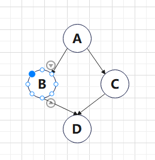
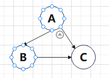

## 一、线性表

### 1. 线性表

#### 1. 顺序表（动静态分配、增删查）

1. 顺序表的静态分配结构定义

    ```c++
    #define MaxSize 50		// 定义最大线性表的长度为 50
    typedef struct{
        ElemType data[MaxSize];		// 数据表的元素
        int length;		// 顺序表的当前长度
    }SqList;
    ```

2. 顺序表的动态分配结构定义

    ```c++
    typedef struct{
        ElemType *data;		// 动态分配中的头节点
        int MaxSize, length;
    }SqList;
    ```

    动态分配语句：

    ```c++
    // C 的动态分配如下：
    // malloc 函数返回内存空间的起始地址的指针
    L.data = (ElemType *)malloc(sizeof(ElemType) * InitSize);
    // C++ 的动态分配如下
    L.data = new ElemType[InitSize];
    // 动态增加：新指针指向旧指针，旧的去申请新的空间，新指针再把数据复制到旧指针内，然后释放旧指针
    ```

    注意：动态分配不是链式存储，因为动态分配的物理结构没有变化，从地址来看依旧是连续的。

3. 顺序表的插入

    ```c++
    // i 表示插入的位置（从 1~L.length + 1）
    // e 表示要插入的元素
    bool ListInsert(SqList &L, int i, ElemType e){
        // 如果 i 的范围无效
        if(i < 1 || i > L.length + 1)
            return false;
        // 如果存储空间满了
        if(L.length >= MaxSize)
            return false;
        // 将第 i 个元素及之后的元素后移
        // 从最后往前移
        for(int j = L.length; j >= i; j--)
            L.data[j] = L.data[j - 1];
        L.data[i - 1] = e;
        // 长度别忘了 +1
        L.length++;
        return true;
    }
    ```

4. 顺序表的删除

    ```c++
    // 这里用 & 将被删除元素取出
    // i 的取值范围是 1~L.length
    bool ListDelete(SqList &L, int i, ElemType &e){
        if(i < 1 || i > L.length)
            return false;
        e = L.data[i - 1];
        // 从头向尾前移
        for(int j = i, j < L.length; j++)
            L.data[j - 1] = L.data[j];
        L.length--;
        return true;
    }
    ```

5. 顺序表的查找（顺序查找）

    ```c++
    // 返回位序（下标 + 1）
    int LocateElem(SqList L, ElemType e){
        for 循环
    }
    ```

#### 2. 单链表（点定义、头尾查法建表、遍历、前后插入）

1. 链表的节点定义

    ```c++
    typedef struct LNode{
        ElemType data;
        struct LNode *next;
    }LNode, *LinkList;
    ```

    1. 使用 `typedef` 重命名数据类型后，使用 `malloc` 函数不用再加 `struct` 关键字。

    2. 定义了 LNode（`struct` 类型）以及 *LinkList（`struct` 的指针类型），一般情况下，用：

        `LNode *Node;` 来定义节点（指针）；

        `LinkList L;` 来定义链表的头指针

2. 头指针为 `NULL` 表示一个空表，但一般会附加头节点（没有任何信息）以简化操作（默认带头节点）。

3. 头插法建表（逆向建表）

    ```c++
    LinkList List_HeadInsert(LinkList &L){
        // 要插入的节点，插入后就是第一个节点（前面还有头节点）
        LNode *insertNode;
        // 要插入的数据
        int insertData;
        // 新建链表（头节点）
        // 如果不带头节点，应该就是 L = LinkList;
        L = (LinkList)malloc(sizeof(LNode));
        L->next = NULL;
        // 输入数据
        scanf("%d", &insertData);
        while(insertData != 9999){
            insertNode = (LNode *)malloc(sizeof(LNode));
            // 其实画图就好
            insertNode->data = insertData;
            insertNode->next = L->next;
            L->next = insertNode;
            scanf("%d", &insertData);
        }
        return L;
    }
    ```

    主要注意链表头节点和节点的创建就行。

4. 尾插法建表（顺序）

    ```c++
    LinkList List_TailInsert(LinkList &L){
        int insertData;
        L = (LinkList)malloc(sizeof(LNode));
        // 注意初始时尾节点为头节点
        LNode *insertNode, *rearNode = L;
        scanf("%d", &insertData);
        while(insertData != 9999){
            insertNode = (LNode *)malloc(sizeof(LNode));
            insertNode->data = insertData;
            rearNode->next = insertNode;
            // 这里别忘了要将尾指针后移
            rearNode = insertNode;
            scanf("%d", &insertData);
        }
        // 尾指针置空
        rearNode->next = NULL;
        return L;
    }
    ```

5. 按序号查找节点值（return LNode）（注意下表为 0 时，返回头节点的数据，即 NULL）

    ```c++
    // 用 i 记录序号
    // 注意一下判断条件
    while(p && j < i)
    ```

6. 按值查找

    一直遍历，直到结尾。

    判断条件是不为尾指针并且值不同

7. 前插（双指针，找前驱）= 插入后面 + 值交换，后面的方法时间复杂度低。

8. 后插（双指针，找前驱）= 删除后继 + 后继值赋给自己，后面的方法时间复杂度低。删除记得用 `free()`

#### 3. 双链表

1. 节点定义

    ```c++
    typedef struct DNode{
        ElemType data;
        struct DNode *prior, *next;
    }DNode, *DLinkList;
    ```

    

2. 其插入和删除时，设在 p 所指节点后插入 s 节点，需要判断 p 后是否有节点（否则会报空指针错误）(只有循环链表不用加)

### 2. 操作受限的线性表

#### 1. 栈

1. 栈的顺序存储定义

    ```c++
    #define MaxSize 50
    typedef struct{
        ElemType data[MaxSize];
        // 指向栈顶元素下标
        int top;
    }SqStack;
    ```

    top 指向的是栈顶元素的下标，切记。

    初始时，top 为 -1。（不同题目的定义可能不同，注意审题）

2. 进栈：指针先 +1，然后元素进入

    出栈：元素先出栈，然后指针 -1。

3. 栈的链式定义

    ```c++
    typedef struct Linknode{
        ElemType data;
        struct Linknode *next;
    }*LinkStack;
    ```

#### 2. 队列

1. 队列的顺序存储结构

    ~~~c++
    #define MaxSize 50
    typedef struct{
        ElemType data[MaxSize];
        // 定义队头指针和队尾指针
        // 队头指针指向队头元素
        // 队尾指针指向队尾元素的后一个位置（即要插入的位置）
        int front, rear;
    }SqQueue;
    ~~~

    这里一定要注意队列中队头队尾指针所指。

2. 循环队列初始化

    ```c++
    void InitQueue(SqQueue &Q){
        Q.front = Q.rear = 0;
    }
    ```

3. 队满的判断：

    1. 牺牲最后一个单元来区分队伍是否满了（最后一个不存数据）

        `(Q.rear + 1) % MaxSize == Q.front`

    2. 在结构体中增加队的长度变量，此时队满和队空的判断条件相同，区别在于长度变量是多少

    3. 增设 tag 来表明当前队伍是否满了

4. 队列的插入、删除、取当前队列长度

    插入（队尾指针 + 1）：（先判断队是否已经满了）`Q.rear = (Q.rear + 1) % MaxSize`

    删除（队尾指针 + 1）：（先判断队列是否为空）`Q.front = (Q.front + 1) % MaxSize`

    取长度：`(Q.rear + MaxSize - Q.front) % MaxSize`

5. 链队列的存储定义

    ```c++
    typedef struct LinkNode{
        ElemType data;
        struct LinkNode *next;
    }LinkNode;
    typedef struct{
        // 将队头指针和队尾指针放在结构里面（主要是队尾），这样可以使得队尾指针一直在结构里面，从而每次可以直接取到，而不用单独建立一个变量并保存。
        // 队头指针指向头节点（不是第一个元素）
        // 队尾指针指向尾节点
        LinkNode *front, *rear;
    }LinkQueue;
    ```

    注意：队头指针指向头节点（不是第一个节点）、队尾指针指向尾节点。这两个定义和顺序队列完全不同，一定要注意区分。

6. 链队列初始化

    ```c++
    void InitQueue(LinkQueue &Q){
        // 新建头节点
        Q.front = Q.rear = (LinkNode *) malloc (sizeof(LinkNode));
        Q.front->next = NULL;
    }
    ```

7. 队列的删除

    在删除时注意，如果队列只有一个元素（即 `Q.rear == p`）此时若直接 `free(p)`，则会导致尾指针的丢失，因此需要先将尾指针前移，再释放。

## 二、树（重点）

### 1. 基本树的定义

1. 二叉树的链式存储

    ```c++
    typedef struct BiTNode{
        ElemType data;
        // 注意嵌套定义（和单链表类似，对比记忆）
        struct BiTNode *lchild, *rchild;
    }BiTNode, *BiTree;
    ```

### 2. 二叉树的遍历（重点）

1. 先序遍历（递归）

    ```c++
    void PreOrder(BiTree T){
        if(T != NULL){
            // “序”是针对中间的访问来说的
            visit(T);
            PreOrder(T->lchild);
            PreOrder(T->rchild);
        }
    }
    ```

2. 中序遍历（递归）

    ```c++
    void InOrder(BiTree T){
        if(T != NULL){
            PreOrder(T->lchild);
            visit(T);
            PreOrder(T->rchild);
        }
    }
    ```

3. 后续遍历（递归）

    ```c++
    void PostOrder(BiTree T){
        if(T != NULL){
            PreOrder(T->lchild);
            PreOrder(T->rchild);
            visit(T);
        }
    }
    ```

    三个遍历的区别在于 `visit(T)` 的执行循序，如果需要用遍历且不指明要非递归时，使用递归算法较简洁。

    三个代码的大体结构是这样，有时需要根据题目，进行 `visit(T)` 的具体化，同时也可以增加 `if` 条件来决定是否进入左右子树。

4. 前序遍历和中序遍历的非递归算法：

    注意点：

    1. 默认是没有父节点的指针的（即不是双指针），因此栈的作用就是记录访问的路径（第一次、第二次和第三次，分别对应入栈，访问栈顶（或者出栈（对应先序和中序））和出栈（对应后序）（先访问的后找其孩子，因此用栈），从而代替父指针的作用。
    2. 非递归的核心思想在于，算法的实现过程和人脑思维的过程一致，即算法的过程跟着人的思维过程走，所以理清遍历的过程至关重要。
    3. 访问叶结点时，叶节点其实有个虚节点，因为算法判断孩子是否存在的依据是当前指针指向的节点是否为空。为空表示不存在，就要倒退。

    前序遍历的非递归：

    根左右，即先访问根，然后遍历左子树，左子树遍历完，才到右子树。

    ```c++
    void PreOrder2(BiTree T){
        // 初始化栈和当前指针
        InitStack(S); BiTree p = T;
        while(p || !IsEmpty(S)){
            if(p){
                // 先序遍历是先访问根，然后入栈，找左孩子，去访问左孩子的根。
                // 也可以看成第一次经过，所以先访问
                visit(p);Push(S, p);
                p = p->lchild;
            }
            else{
                // 如果当前指向的是最左节点（没左孩子了），就要出栈以获取父节点，然后访问右孩子
                // 注意 Pop 方法的使用方法
                Pop(S, p);
                p = p->rchild;
            }
        }
    }
    ```

    中序遍历的非递归：

    先左，左到尽头，然后访问，然后访问根，根再向右，重复过程。

    ```c++
    void InOrder2(BiTree T){
        InitStack(S); BiTree p = T;
        while(p || !IsEmpty(S)){
            if(p){
                Push(S, p);
                p = p->lchild;
            }
            else{
                // 出栈的时候访问，其实可以把出栈当成第二次访问节点，即中序
                Pop(S, p);visit(p);
                p = p->rchild;
            }
        }
    }
    ```

5. 后序遍历的非递归（增设变量记录上一次访问的节点或者修改节点结构以增设标志位）：

    ```c++
    void PostOrder2(BiTree T){
        InitStack(S); BiTree p = T;
        BiTree r = NULL;
        while(p || !IsEmpty(S)){
            if(p){
                Push(S, p);
                p = p->lchild;
            }
            else{
                // 获得栈顶元素（即父节点）
                getTop(S, p);
                // 若其右孩子不空且右孩子没有被访问过，则转向右孩子
                if(p->rchild && p->rchild != r){
                    p = p->rchild;
                }
                // 没有右孩子或者右孩子被访问过
                else{
                    Pop(S, p);
                    visit(p);
                    r = p;
                    p = NULL;
                }
            }
        }
    }
    ```

    算法的关键在于，只有当右孩子不空且右孩子没有被访问过时，才转向右孩子，否则其他的情况一律可以访问父节点，同时将指针指向该父节点，表示已经访问过。

6. 层次遍历算法

    根节点入队，然后出队，访问出队节点，然后左子树根入队，右子树根入队，然后左子树根出队，访问，左子树的左右子树根入队；右子树根出队，访问，右子树的子树根入队。然后到左子树的左子树根……

    ```c++
    void LevelOrder(BiTree T){
        InitQueue(Q);
        BiTree p;
        // 根节点先入队
        EnQueue(Q, T);
        while(!IsEmpty(Q)){
            DeQueue(Q, p);
            visit(p);
            // 如果根有左子树，那么左子树的根入队
            if(p->lchild != NULL){
                EnQueue(Q, p->lchild);
            }
            // 如果根有右子树，那么右子树的根入队
            if(p-rchild != NULL){
                EnQueue(Q, p-rchild);
            }
        }
    }
    ```

## 三、图

### 1. 图的存储（邻接矩阵和邻接表）

1. 邻接矩阵的存储结构定义

    ```c++
    // 定义顶点数目的最大值
    #define MaxVertexNum 100
    // 定义邻接矩阵顶点（可以为 int）和边上权值的数据类型
    typedef char VertexType;
    typedef int EdgeType;
    typedef struct{
        // 定义顶点表（有时可以不需要）
        VertexType Vex[MaxVertexNum];
        // 定义边表（即邻接矩阵）
        EdgeType Edge[MaxVertexNum][MaxVertexNum];
        // 定义顶点数和边数
        int vexnum, arcnum;
    }MGraph;
    ```

    对于不带权图，用 0，1 表示是否为边

    对于带权图，用 0 或者 ∞ 来说明是否为边（0 一般是自己对自己）

    `#define INFINITY` 定义无穷。

2. 邻接表的存储结构定义

    邻接表分为顶点表和边表（这两个缺一不可，不像邻接矩阵可以少一个顶点表）。

    ```c++
    #define MaxVertexNum 100
    // 定义边表的节点
    typedef struct ArcNode{
        // 弧头所指顶点的号（当前顶点号）
        int adjvex;
        // 指向下一个顶点的指针
        struct ArcNode *next;
        // （可选）边权值
        InfoType info;
    }ArcNode;
    
    // 定义顶点表的节点（需要用到边表节点的定义）
    typedef struct VNode{
        // 节点信息，其实可以为 int，代表顶点号
        VertexType data;
        // 指向第一个顶点
        ArcNode *first;
    }VNode, AdjList[MaxVertexNum];
    
    // 定义邻接表（刚建立时只有顶点表）
    typedef struct{
        // 邻接表（刚定义并初始化时仅有顶点表
        AdjList vertices;
        int vexnum; arcnum;
    }ALGraph;
    ```

3. 图的基本操作主要包括：

    ```c++
    // 判断在图 G 内，x 与 y 之间是否存在边
    Adjacent(G, x, y);
    // 对于邻接矩阵的删除，由于要删除一行，所以那一行要全部置空，并且增设布尔标志位来表示是否删除
    Insert/DeleteVertex(G, x);
    Add/RemoveEdge(G, x, y);
    // 求图 G 中顶点 x 的第一个邻接点，如果有则返回顶点号，没有或 x 不存在就返回 -1（这个方法很重要，BFS 和 DFS 都用到了这个方法）
    FirstNeighbor(G, x)
    // 返回图 G 中除 y 以外的，顶点 x 的下一个临界点的顶点号，如果 y 是最后一个邻接点，则返回 -1（这个方法很重要，BFS 和 DFS 都用到了这个方法）
    NextNeighbor(G, x, y);
    Get_edge_value(G, x, y);
    Set_edge_value(G, x, y, v);
    ```

### 2. BFS 和 DFS

1. BFS 的思想与算法实现（层次遍历的扩展 + 多树）：

    以 v 为起点、由近到远依次访问和 v 有路径相通且路径长度由 1 递增的顶点。本质上是分层查找，不回头所以不是递归。算法需要借助队列来暂存正在访问的节点的下一层节点。

    ```c++
    // 定义访问标记数组，记录节点是否已经被 BFS 访问到
    bool visited[MaxVertexNum];
    void BFSTraverse(Graph G){
        // 首先初始化访问标记数组
        for(int i = 0; i < G.vexnum; i++){
            visited[i] = FALSE;
        }
        InitQueue(Q);
        for(int i = 0; i < G.vexnum; i++){
            // 如果节点没有被 BFS 访问到（即有多个连通分量时，或者理解为当有多个树时）
            if(!visited[i])
                BFS(G, i);
        }
        
        // v: 顶点编号
        void BFS(Graph G, int v){
            visit(v);
            visited[v] = TRUE;
            EnQueue(Q, v);
            while(!IsEmpty(Q)){
                // 注意此时的 v 变成了队列的第一个元素
                DeQueue(Q, v);
                // 遍历当前所指节点的所有邻接点(这里和层次遍历很相似，不过层次遍历针对二叉树，所以没用 for 循环，而是采用了两个 if)（小区别就是层次遍历是出队时访问节点，而 BFS 是入队时访问节点（刚调用 BFS 时不是））
                for(int w = FirstNeighbor(G, v); w >= 0; w = NextNeighbor(G, v, w)){
                    if(!visited[w]){
                        EnQueue(Q, w);
                        visit(w);
                        visited[w] = TRUE;
                    }// end if
                }// end for
            }// end while
        }// end BFS
    ```

2. DFS 的思想与算法实现（先根遍历的扩展 + 多树）：

    首先访问图中某一起始顶点 v，然后从 v 出发，访问与 v 邻接的未访问点 w1，然后是 w2……直到不能继续向下访问了，然后回退到最近的，如果最近的还有邻接节点未被访问，那就接着重复这个过程。

    ```c++
    bool visited[MaxVertexNum];
    void DFSTraverse(Graph G){
        for(int i = 0; i < G.vexnum; i++){
            visited[i] = FALSE;
        }
        for(int i = 0; i < G.vexnum; i++){
            // 如果节点没有被 DFS 访问到（即有多个连通分量时，或者理解为当有多个树时）
            if(!visited[i])
                DFS(G, i);
        }
        
        void DFS(Graph G, int v){
            visit(v);
            visited[v] = TRUE;
            // 等效于多分枝的先根遍历
            for(w = FirstNeighbor(G, v); w >= 0; w = NextNeighbor(G, v, w))
                if(!visited[w]){
                    // 注意这里是递归
                    DFS(G, w);
                }
        }
    }
    ```

3. 有关 DAG 的判断：

    判断的思路：从一个点出发，这个点被访问了两次

    用 DFS 来判断：

    设立三个状态，-1，0，1。其中用 -1 表示当前正在被访问的状态（即没有结束 DFS，仍在递归的状态），如果在此状态下，某一次遍历遇到了 visited[w] = -1 的情况时，表明存在回路。

    BFS 不能判断回路（出现误判）（有问题）：

    

    BFS 不能这样做是因为 BFS 不是递归操作，每个节点的所有访问都是访问度为 1 的一层，而环至少需要 2 层（度为 2 才能判断），所以最终无论无何都无法在点为 -1 的状态时访问到自己（若改成为 1 的状态时重复方位为回路，就会出现误判）。

## 四、查找

### 1. 线性结构

1. 折半查找

    ```c++
    int Binary_Search(SeqList L, ElemType key){
        int low = 0; high = L.TableLen - 1, mid;
        // 注意，当 low = high 时还会继续一次循环
        while(low <= high){
            // 注意默认是向下取整
            mid = (low + high) / 2;
            if(L.elem[mid] == key)
                return mid;
            else if(L.elem[mid] > key)
                high = mid - 1;
            else low = mid + 1;
        }// 仅当 low > high 时，循环才跳出
        return -1;
    }
    ```

## 五、排序

### 1. 交换排序

1. 快速排序

    选枢轴，分区间，小往左，大往右，定下后，选两轴……

    ```c++
    // int low: 区间的低位
    // int high: 区间的高位
    void QuickSort(ElemType A[], int low, int high){
        if(low < high){
            // 一次快排一次划分，产生两个区间，然后两个区间再快排。
            // 一直递归下去，直到区间就剩一个元素
            int pivotPos = Partition(A, low, high);
            QuickSort(A, low, pivotPos - 1);
            QuickSort(B, pivotPos + 1, high);
        }
    }
    
    // return: 返回枢轴的最终位置
    // Partition 为划分方法，抽离了出来
    int Partition(ElemType A[], int low, int high){
        // 默认枢轴为区间内第一个元素（此时 A[low] 处逻辑上是空的，等待轴右小于轴的一个数移过来）
        ElemType pivot = A[low];
        // 左右指针（low、high）都发生一次交换时，表示一次循环
        while(low < high){
            // 当轴右边的比轴大时，指针左移，其余不变
            while(low < high && A[high] >= pivot)
                high--;
            // 轴右但小于轴的左移（注意此时 A[low](即轴的最初所在位置) 逻辑上是空的
            A[low] = A[high];
            while(low < high && A[low] <= pivot)
                low++;
            A[high] = A[low];
        }// end while: 此时枢轴的位置确定了，但是值还未赋过去
        A[low] = pivot;
        return low;
    }
    ```
    
    
