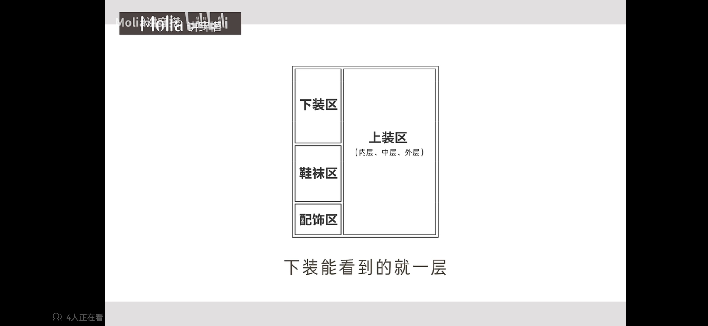
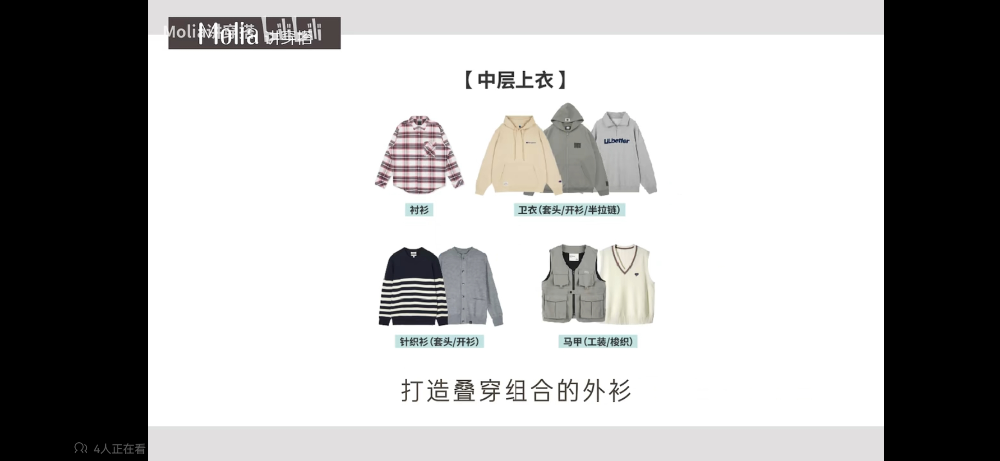
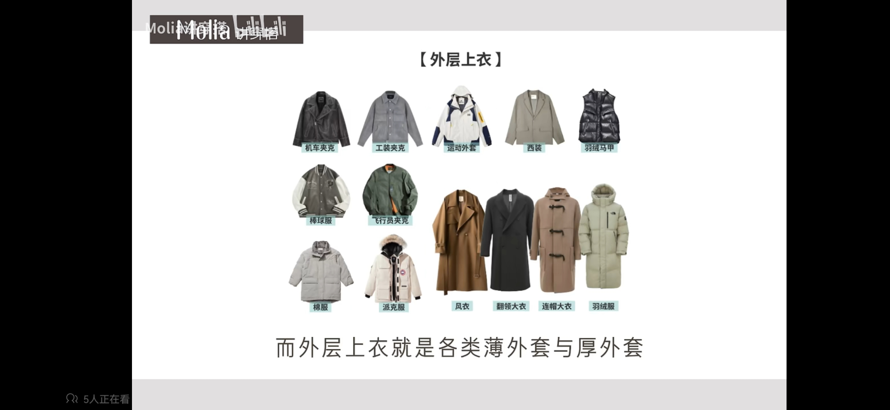
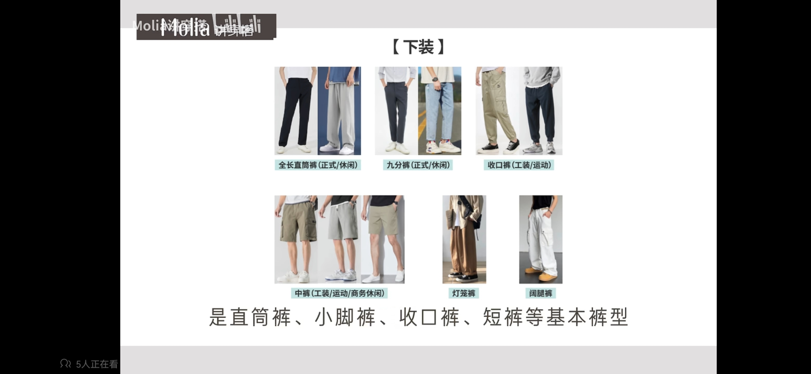
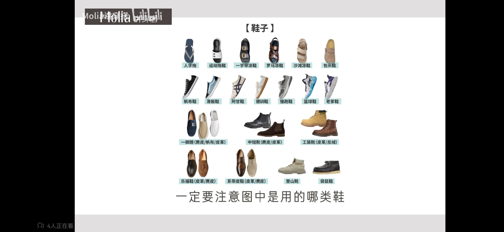

# 男士穿搭学习

## 1. 基本思路

1. 先锁定全身的款式类别，搭建出一个不错的形态框架。
2. 框架搭建后挑选颜色。
3. 根据配色做局部调整

## 2. 快速构建框架

1. 先分清分类：
    1. 正规风：正装、商务风、学院风等。
    2. 休闲风：工装、运动、时尚等等。
2. 保持风格统一。
3. 框架分为四层：
    
    各层的单品如下：
    1. 内层上衣/能单穿的上衣：T恤、薄卫衣、POLO、背心、衬衫。
    2. 中层上衣：衬衫、卫衣（套头、开衫、半拉链）、针织衫（套头、开衫）、马甲（工装、梭织）。
        
    3. 外层上衣：
        各类薄厚外套：
        
    4. 下装：
        
    5. 鞋子（重点）
        

## 3. 颜色

## 4. 常见的鞋裤搭配

1. 高帮帆布鞋：牛仔裤、工装裤、直筒休闲裤
    忌：裤腿过窄的束脚裤
2. 板鞋：百搭
3. 面包鞋：直筒运动裤、微喇裤、有堆叠感的牛仔裤、盖住鞋面的工装裤
4. 复古运动鞋：束脚卫裤、西装裤、阔腿工装裤
5. 有点休闲/运动工装靴（机能风、军旅风、街头运动、日系）：直筒、修身、阔腿、收口的休闲裤，适合露出更多的靴筒，也适合外卷裤边的穿法。
