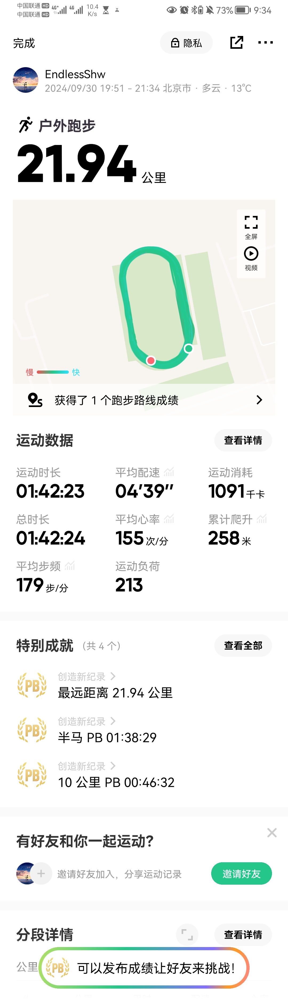
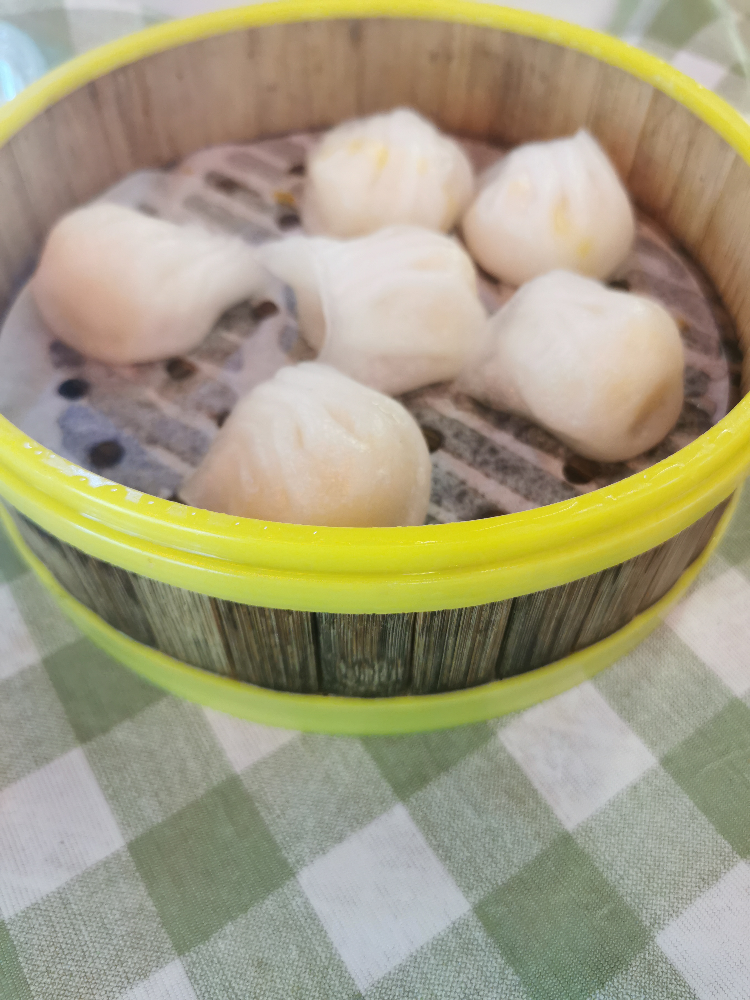
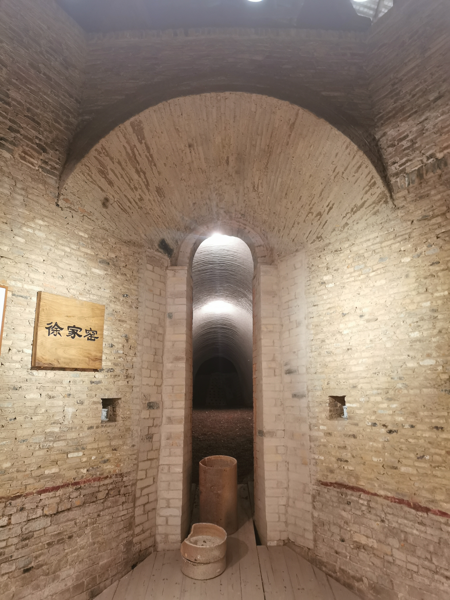
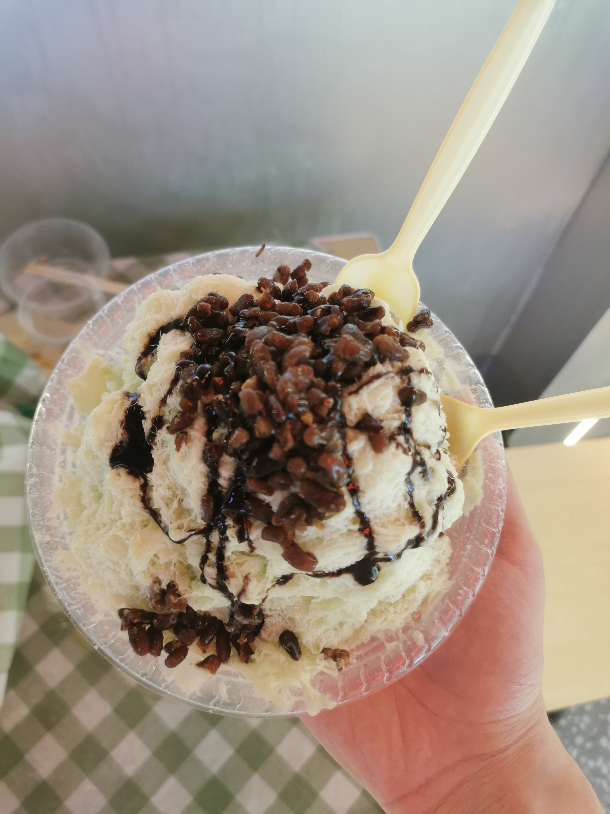
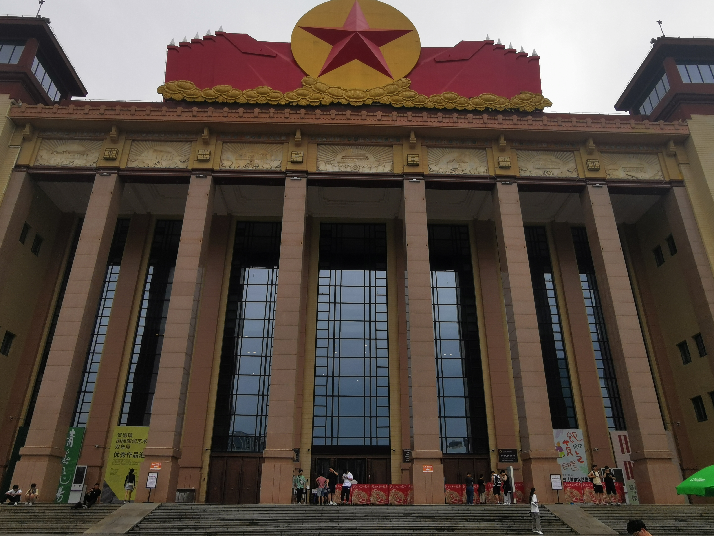
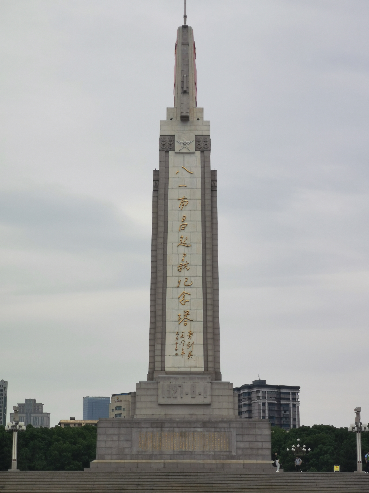
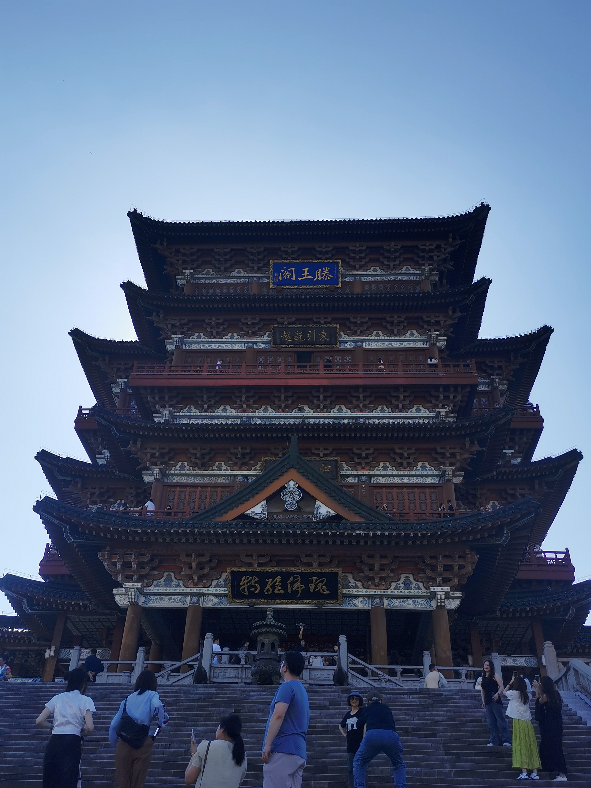
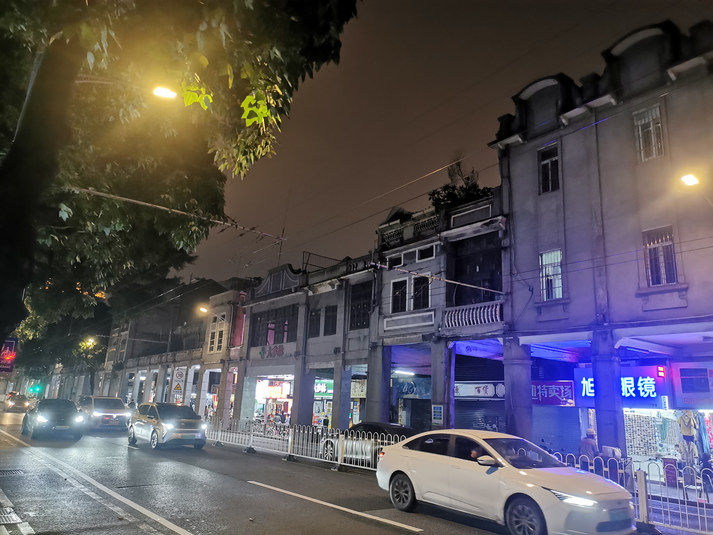
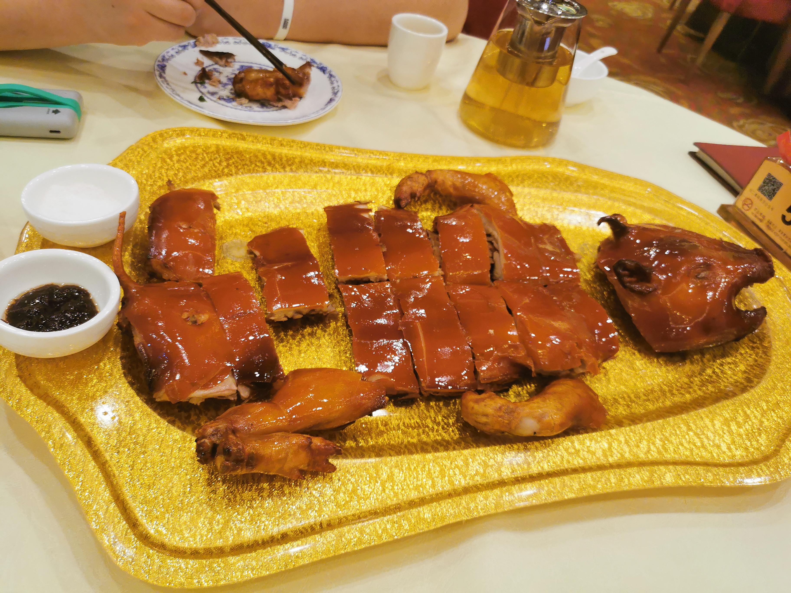
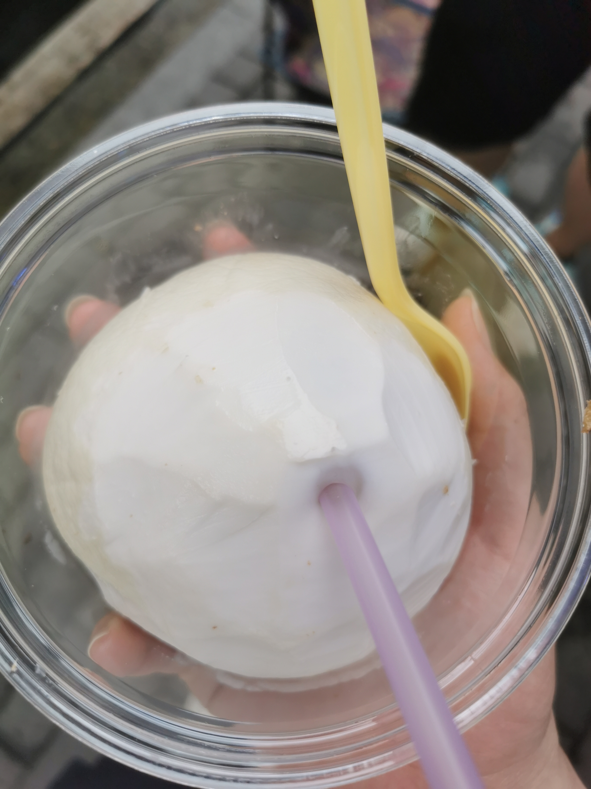

# 2024 年终总结

1. 不会有人 2024 年终总结在 2025 年写吧（
2. 24 年简单的分为两部分：考研复试和读研初体验（大学第五年，乐）。

## 1. 智力

1. 初试结束后到暑期这段时间，技术基本没有长进，全程都在忙着复试。

2. 开学后就是漫长的“追星之路”，从加入天璇的社团，群聊中了解战队，再到招新比赛，期盼着能进战队；最后也算是勉强和天璇的人共同学习与比赛。
    本科学习走了太多弯路，现在读研后真的很痛苦，有限时间下的焦虑与压力并存。也算是切身体验了“为什么不建议研究生开始 CTF”。
    Web 依旧在学习的路上，有种每个方面都懂但是依旧缺乏精进，虽然 Web 的特性这是这样，不过打比赛时依旧有心而力不足。 未来会涉及一点 Misc（偏 Web）或者其他的吧。
    也是有幸首次参加线下赛，详见：

    > https://www.endlessshw.top/Network_Security/wp/%E9%B9%8F%E7%A8%8B%E6%9D%AF%E7%BA%BF%E4%B8%8B/

    武汉很好，可以没能驻足留恋。

3. 偷摸去投了几家的实习，实战经验不足是面试官经常吐槽的点。挖！还得挖 SRC！

4. 明年的主要 TODO：

    1. Web 精进
    2. Misc 部分
    3. 云攻防
    4. SRC
    5. 质疑赛棍，理解赛棍，成为赛棍！（

## 2. 力敏

1. 暑期正式列举计划训练长跑，终于在秋末跑出一次半马：
    
    可惜通州的半马没有报上，来年一定！
    最终的目标：全马 330！
2. 跑步和健身交替，明显感觉到肌肉量有些许提升，什么时候才能瘦呢 。

## 3. 信仰

1. 今年一年竟然一本书都没读过，乘着年初空闲读点书。每次想写点什么，发现自己肚子里是真没有墨水。

## 4. 感应

1. 和某 gal 群群友一路从安徽一路南下，玩了一路：
    

    

    

    

    

    

    

    

    

    

    
    和群友出去玩也学到了很多，以后出去玩还是得多了解当地文化而不是走马观花。

2. 然后就是北京惯例的天安门了，没啥好说的。

## 4. 总结

1. 这一年感觉都在网上冲浪了。重点还是放在“智力”上，同时“感应”还得点，如果能成为高等级水桶号就更好了（乐。
    2025，前有艾尔登法环，你一定要很有资格啊！敬请见证！
