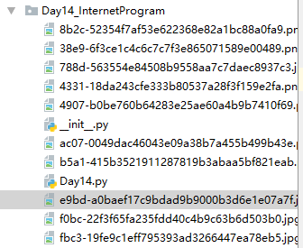
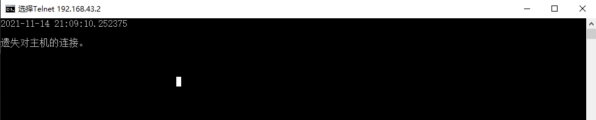

# 网络编程入门

## 1. 基于HTTP协议的网络资源访问

### 1. requests库

requests库是一个基于 ==HTTP 协议来使用网络的第三库==，其[官方网站](http://cn.python-requests.org/zh_CN/latest/)有这样的一句介绍它的话：“Requests 是唯一的一个**非转基因**的 Python HTTP 库，人类可以安全享用。” 简单的说，==使用 requests 库可以非常方便的使用 HTTP，避免安全缺陷、冗余代码以及 “重复发明轮子”==（行业黑话，通常用在软件工程领域表示重新创造一个已有的或是早已被优化過的基本方法）。通过 requests 来实现一个访问新浪电竞的网络数据接口并从中获取图片下载链接，然后下载文章中游戏的图片到本地的例子程序，程序中使用了[天行数据](https://www.tianapi.com/)提供的网络 API。

代码如下：

```python
from time import time
from threading import Thread
import requests

# 继承Thread类创建自定义的线程类
class DownloadHanlder(Thread):

    def __init__(self, url):
        super().__init__()
        self.url = url

    def run(self):
        # 这里的 self.url.rfind('/') + 1 需要用()括住，否则会产生运算符运算顺序错误的问题，从而导致 filename 获取到的名称不对
        # rfind()函数用于返回字符串中指定元素最后一次出现的位置。
        filename = self.url[(self.url.rfind('/') + 1):]
        resp = requests.get(self.url)
        # 文件直接以二进制的形式保存在.py同一目录下
        with open(filename, 'wb') as f:
            f.write(resp.content)


def main():
    # 通过requests模块的get函数获取网络资源
    # 下面的代码中使用了天行数据接口提供的网络API
    # 要使用该数据接口需要在天行数据的网站上注册
    # 然后用自己的Key替换掉下面代码的中APIKey即可
    resp = requests.get(
        'http://api.tianapi.com/esports/index?key=d4ed5a3a8d5d42f8700754b792cf8c7d&num=10')
    # 将服务器返回的JSON格式的数据解析为字典
    data_model = resp.json()
    for mm_dict in data_model['newslist']:
        # 由于天行数据返回的 json 中，其地址开头是//，所以要在开头添加 http 协议头来获取内容
        url = "http:" + mm_dict['picUrl']
        # 通过多线程的方式实现图片下载
        DownloadHanlder(url).start()


if __name__ == '__main__':
    main()
```


下载的图片目录如下：




### 2. 基于传输层协议的套接字(socket)编程

套接字，通俗点说，就是一套用 [C 语言](https://zh.wikipedia.org/wiki/C语言)写成的应用程序开发库，主要用于实现==进程间通信==和==网络编程==，在网络应用开发中被广泛使用。在 Python 中也可以基于套接字来使用传输层提供的传输服务，并基于此开发自己的网络应用。实际开发中使用的套接字可以分为三类：==流套接字==（TCP 套接字）、==数据报套接字==和==原始套接字==。

#### 1. TCP 套接字

所谓 TCP 套接字就是使用 TCP 协议提供的传输服务来实现网络通信的编程接口。在 Python 中可以==通过创建 socket 对象并指定 type 属性为 SOCK_STREAM 来使用 TCP 套接字==。由于一台主机可能拥有多个 IP 地址，而且很有可能会配置多个不同的服务，所以作为服务器端的程序，需要在创建套接字对象后将其==绑定到指定的 IP 地址和端口==上。

下面的代码实现了一个提供时间日期的服务器：

```python
"""
使用 TCP 套接字来实现一个提供时间日期的服务器
"""
from socket import socket, SOCK_STREAM, AF_INET
from datetime import datetime

def main():
    # 1. 创建套接字对象并指定使用那种传输服务
    # family=AF_INET - IPv4地址
    # family=AF_INET6 - IPv6地址
    # type=SOCK_STREAM - TCP套接字
    # type=SOCK_DGRAM - UDP套接字
    # type=SOCK_RAW - 原始套接字
    server = socket(family=AF_INET, type=SOCK_STREAM)

    # 2. 绑定 IP 地址和端口（端口用于区分不同的服务）
    # 同一时间在同一端口上只能绑定一个服务，否则报错
    server.bind(('192.168.43.2', 12345))

    # 3. 开启监听 - 监听客户端连接到服务器
    # 参数可以理解为连接队列的大小
    server.listen(1)

    print('服务器启动开始监听...')
    while True:
        # 4.通过循环接收客户端的连接并作出相应的处理(提供服务)
        # accept方法是一个阻塞方法。如果没有客户端连接到服务器代码不会向下执行
        # accept方法返回一个元组。其中的第一个元素是客户端对象
        # 第二个元素是连接到服务器的客户端的地址(由IP和端口两部分构成)
        client, client_addr = server.accept()
        print(str(client_addr), ' 连接到了服务器')
        
        # 5. 向访问的客户端发送数据
        client.send(str(datetime.now()).encode('utf-8'))
        
        # 6. 断开连接
        client.close()

if __name__ == '__main__':
    main()
```


输入

```bash
telnet 192.168.43.2 12345
```

结果如下：




当然我们也可以通过 Python 的程序来实现 TCP 客户端的功能，相较于实现服务器程序，实现客户端程序就简单多了，代码如下所示。

```python
"""
TCP 客户端的功能实现
"""
from socket import socket

def main():
    # 1. 创建套接字对象默认使用 IPV4 和 TCP 协议
    clientServer = socket()

    # 2. 连接到服务器器（需要指定 IP 地址和端口）
    clientServer.connect(('192.168.43.2', 12345))

    # 3. 从服务器接收数据
    print(clientServer.recv(1024).decode('utf-8'))
    clientServer.close()

if __name__ == '__main__':
    main()
```


需要注意的是，上面的服务器并==没有使用多线程或者异步 I/O== 的处理方式，这也就意味着当服务器与一个客户端处于通信状态时，其他的客户端只能排队等待。很显然，这样的服务器并不能满足我们的需求，我们需要的服务器是==能够同时接纳和处理多个用户请求==的。下面我们来设计一个使用==多线程==技术处理多个用户请求的服务器，该服务器会向连接到服务器的客户端发送一张图片。

服务器端代码：

```python
```


